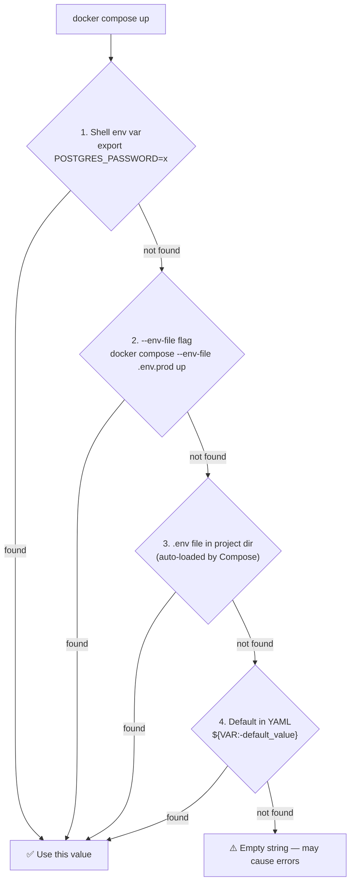

# Why This Matters

သင်의 application run ဖို့အတွက် configuration တွေ လိုအပ်ပါတယ်။ ဥပမာ- database passwords, API keys, feature flags နဲ့ service URLs တို့ ဖြစ်ပါတယ်။ ဒီ configuration တွေကို မှန်ကန်စွာ စီမံခန့်ခွဲနိုင်ဖို့ဆိုတာ production deployment တိုင်းမှာ အရေးအကြီးဆုံး (ဒါပေမဲ့ အများဆုံး မှားယွင်းတတ်တဲ့) အပိုင်းတွေထဲက တစ်ခု ဖြစ်ပါတယ်။

ရွှေစည်းမျဉ်း သုံးခု:
1. Source code ထဲမှာဖြစ်စေ၊ Docker image ထဲမှာဖြစ်စေ **Secrets တွေကို hardcode လုံးဝ မလုပ်ပါနဲ့**
2. Git ထဲကို secrets တွေ **လုံးဝ commit မတင်ပါနဲ့** (`.env` ထဲမှာ real passwords တွေထည့်တာ၊ `docker-compose.prod.yml` ထဲမှာ credentials တွေထည့်တာမျိုးတွေ မလုပ်ရပါ)
3. environment တစ်ခုချင်းစီအတွက် **တူညီတဲ့ values တွေကို မသုံးပါနဲ့** — dev နဲ့ prod အတွက် `DATABASE_URL` တူတူသုံးမိရင်တော့ ပြဿနာကြီးကြီး တက်ဖို့ သေချာသလောက် ရှိနေပါပြီ။

---

## How Compose Resolves Variables: The Lookup Chain

YAML file တစ်ခုထဲမှာ Compose က `${VARIABLE_NAME}` ကို တွေ့တဲ့အခါ၊ အောက်ပါရင်းမြစ်တွေဆီကနေ **ဦးစားပေးအလိုက်** value တွေကို ရှာယူပါတယ်:



```bash
# Shell env က ဦးစားပေးအမြင့်ဆုံး ဖြစ်ပါတယ် — ကျန်တာတွေကို override လုပ်ပါတယ်
POSTGRES_PASSWORD=prod_secret docker compose up -d

# သီးသန့် env file တစ်ခုကို သုံးချင်ရင်
docker compose --env-file .env.production up -d

# Compose က project directory ထဲက .env ကို automatic load လုပ်ပါတယ် (explicit files ထဲမှာ ဦးစားပေး အနိမ့်ဆုံးပါ)
```

---

## Variable Syntax in `docker-compose.yml`

```yaml
services:
  api:
    environment:
      # Basic substitution — မသတ်မှတ်ထားဘဲ default လည်းမရှိရင် error တက်ပါမယ်
      DATABASE_URL: "${DATABASE_URL}"

      # variable ကို မသတ်မှတ်ရသေးဘူး သို့မဟုတ် empty ဖြစ်နေရင် default value ကို သုံးရန်
      NODE_ENV: "${NODE_ENV:-development}"

      # variable ကို လုံးဝ မသတ်မှတ်ထားမှသာ default value ကိုသုံးရန် (empty "" ဖြစ်နေရင် မဟုတ်ပါ)
      LOG_LEVEL: "${LOG_LEVEL-info}"

      # variable ကို မသတ်မှတ်ရသေးရင် error တက်စေရန်
      POSTGRES_PASSWORD: "${POSTGRES_PASSWORD:?POSTGRES_PASSWORD must be set}"

      # Compose က string interpolation ကို support ပေးပါတယ်
      REDIS_URL: "redis://:${REDIS_PASSWORD}@cache:${REDIS_PORT:-6379}"
```

---

## The `.env` File Strategy: Three Files

environments တွေကြားမှာ config တွေကို စီမံခန့်ခွဲတဲ့အခါ အသန့်ရှင်းဆုံး pattern ကတော့:

```bash
# .env — Git ထဲမှာ commit တင်ထားရန် (sensitive မဟုတ်တဲ့ default တွေအတွက်)
# ─────────────────────────────────────────────────
NODE_ENV=development
APP_PORT=3000
LOG_LEVEL=info
POSTGRES_USER=appuser
POSTGRES_DB=myapp
POSTGRES_PORT=5432
REDIS_PORT=6379
```

```bash
# .env.local — developer ရဲ့ စက်ပေါ်မှာပဲ ရှိရမын (လုံးဝ commit မတင်ရပါ — gitignored လုပ်ထားပါ)
# ─────────────────────────────────────────────────────────────────
# default တန်ဖိုးတွေကို ကိုယ့်ရဲ့ local values နဲ့ override လုပ်ရန်
POSTGRES_PASSWORD=mydevpassword123
REDIS_PASSWORD=mydevredis
```

```bash
# .env.production — server ပေါ်မှာပဲ ရှိရမын (လုံးဝ commit မတင်ရပါ — gitignored ဒါမှမဟုတ် vault-managed လုပ်ပါ)
# ──────────────────────────────────────────────────────────────────────────────────
NODE_ENV=production
LOG_LEVEL=warn
POSTGRES_USER=appuser
POSTGRES_DB=myapp
POSTGRES_PASSWORD=Str0ng!ProductionP4ssw0rd
REDIS_PASSWORD=Str0ng!RedisP4ssw0rd
IMAGE_TAG=v1.5.2
```

```bash
# .gitignore
.env.local
.env.*.local
.env.production
.env.staging
*.pem
*.key
```

```bash
# environment တစ်ခုချင်းစီအလိုက် သင့်တော်တဲ့ env file နဲ့ run ရန်
# Development (uses .env + .env.local override)
docker compose --env-file .env --env-file .env.local up -d

# Production
docker compose --env-file .env.production -f docker-compose.yml -f docker-compose.prod.yml up -d
```

---

## Injecting Variables vs Using `env_file`

```yaml
services:
  api:
    # Option A: env_file — file ထဲက vars အားလုံးကို container ထဲကို load လုပ်ပေးပါတယ်
    env_file:
      - .env              # Container environment variables အဖြစ် loaded လုပ်ပါတယ်
      - .env.local        # Local values နဲ့ override လုပ်ပါတယ်

    # Option B: environment — compose vars ကနေ container vars တွေကို explicit mapping လုပ်ပါတယ်
    environment:
      NODE_ENV: "${NODE_ENV}"
      DATABASE_URL: "postgres://${POSTGRES_USER}:${POSTGRES_PASSWORD}@db:5432/${POSTGRES_DB}"
      # ^ Compose interpolation က ဒီနေရာမှာ (compose context ထဲမှာ) ဖြစ်သွားပါတယ်
      #   Container က variable references တွေကို မမြင်ရတော့ဘဲ ပြီးသွားတဲ့ string တန်ဖိုးကိုပဲ မြင်ရပါမယ်
```

**အဓိက ကွာခြားချက်**: `env_file` က file ထဲမှာရှိတဲ့အတိုင်း container environment ထဲကို တိုက်ရိုက်ထည့်ပေးပါတယ်။ `${}` ပါတဲ့ `environment:` ကျတော့ container မစတင်ခင်မှာ Compose ကနေ အရင် ဖြေရှင်းပေးပါတယ်။ Connection string လိုမျိုး variable பலခုကို ပေါင်းစပ်ပြီး တည်ဆောက်ရတော့မယ်ဆိုရင် `environment:` ကို သုံးပါ။

---

## Verifying Variables Are Set Correctly

```bash
# ဖြေရှင်းပြီးသား compose config ကို ထုတ်ပြပါ (interpolated values အားလုံးကို ပြပါလိမ့်မယ်)
docker compose config | grep -A 20 "api:"
# run မလုပ်ခင် DATABASE_URL ကို မှန်ကန်စွာ တွဲစပ်ပြီးပြီလားဆိုတာ စစ်ဆေးဖို့ ဒါကို သုံးပါ

# Running ဖြစ်နေတဲ့ container ထဲမှာ ဘယ် env vars တွေ တကယ်ရှိနေလဲဆိုတာ စစ်ဆေးရန်
docker compose exec api env | sort

# သီးသန့် variable တစ်ခုကို စစ်ဆေးရန်
docker compose exec api printenv DATABASE_URL
# postgres://appuser:mydevpassword123@db:5432/myapp

# variable တစ်ခု လွတ်နေလား စစ်ဆေးရန် (DATABASE_URL empty ဖြစ်နေရင် 1 ပြန်ပါမယ်)
docker compose exec api test -n "$DATABASE_URL" && echo "SET" || echo "NOT SET"
```

---

## Per-Environment Configuration Pattern

environment တစ်ခုနဲ့တစ်ခု Settings တွေအတွက် value အမျိုးမျိုး လိုအပ်တတ်ပါတယ်:

```yaml
# base docker-compose.yml
services:
  api:
    environment:
      DATABASE_URL: "postgres://${POSTGRES_USER}:${POSTGRES_PASSWORD}@db:5432/${POSTGRES_DB}"
      REDIS_URL: "redis://:${REDIS_PASSWORD}@cache:6379"
      NODE_ENV: "${NODE_ENV:-development}"
      LOG_LEVEL: "${LOG_LEVEL:-info}"
```

```yaml
# docker-compose.dev.yml additions
services:
  api:
    environment:
      NODE_ENV: development
      LOG_LEVEL: debug
      NEXT_PUBLIC_API_URL: http://localhost:3000  # Browser-side var
      DEBUG: "api:*"                              # Debug namespace
```

```yaml
# docker-compose.prod.yml additions
services:
  api:
    image: "ghcr.io/yourorg/myapp:${IMAGE_TAG}"   # Pre-build လုပ်ထားတဲ့ image ကို pull လုပ်ရန်
    environment:
      NODE_ENV: production
      LOG_LEVEL: warn
      NEXT_PUBLIC_API_URL: "https://api.yourdomain.com"
```

```bash
# Usage
# Development
docker compose -f docker-compose.yml -f docker-compose.dev.yml \
  --env-file .env --env-file .env.local up -d

# Production
IMAGE_TAG=v1.5.2 docker compose -f docker-compose.yml -f docker-compose.prod.yml \
  --env-file .env.production up -d
```

---

## Secret Management: Four Approaches by Risk Level

### Level 1: `.env.production` on Server (Minimum Viable)

```bash
# Server ပေါ်မှာ — လုံခြုံတဲ့ permissions တွေ ချမှတ်ပါ
chmod 600 /home/deploy/.env.production
chown deploy:deploy /home/deploy/.env.production

# အဲ့ဒါနဲ့ Compose ကို run ပါ
docker compose --env-file /home/deploy/.env.production up -d
```

**သင့်တော်သည်မှာ**: အဖွဲ့ငယ်တွေ၊ server တစ်လုံးတည်း သုံးတာတွေအတွက်
**အန္တရာယ်**: file က disk ပေါ်မှာ ရှိနေပါတယ်။ server ဝင်ရောက်ခွင့်ရှိသူတိုင်း မြင်နိုင်ပါတယ်။

### Level 2: Docker Secrets (Built-in, File-based)

Docker Secrets က secrets တွေကို env vars အဖြစ် မပြဘဲ `/run/secrets/` ထဲမှာ files တွေအနေနဲ့ mount လုပ်ပေးပါတယ်:

```yaml
# docker-compose.yml with Docker Secrets
services:
  api:
    secrets:
      - db_password
      - redis_password
      - jwt_secret
    environment:
      # App က env var ကနေ မဖတ်ဘဲ file ကနေ secret ကို ဖတ်ပါတယ်
      # ဥပမာ- Node.js မှာဆိုရင်: fs.readFileSync('/run/secrets/db_password', 'utf8').trim()
      DB_PASSWORD_FILE: /run/secrets/db_password

  db:
    image: postgres:16-alpine
    secrets:
      - db_password
    environment:
      POSTGRES_USER: appuser
      POSTGRES_DB: myapp
      # Official postgres image က _FILE convention ကို support ပေးပါတယ်:
      POSTGRES_PASSWORD_FILE: /run/secrets/db_password

secrets:
  db_password:
    file: ./secrets/db_password.txt    # Plain text file (chmod 400)
  redis_password:
    file: ./secrets/redis_password.txt
  jwt_secret:
    file: ./secrets/jwt_secret.txt
```

```bash
# Secret files တွေကို ဖန်တီးပါ (တစ်ခါပဲ run ပါ၊ commit မတင်ပါနဲ့)
mkdir -p secrets
openssl rand -base64 32 > secrets/db_password.txt
openssl rand -base64 32 > secrets/redis_password.txt
openssl rand -base64 48 > secrets/jwt_secret.txt
chmod 400 secrets/*.txt
echo "secrets/" >> .gitignore
```

### Level 3: CI/CD Secrets Injection (Recommended for Teams)

Secrets တွေကို files ထဲမှာ မထည့်ဘဲ GitHub Actions Secrets ထဲမှာ သိမ်းဆည်းပါ:

```yaml
# .github/workflows/deploy.yml
name: Deploy
on:
  push:
    branches: [main]

jobs:
  deploy:
    runs-on: ubuntu-latest
    steps:
      - name: Deploy to server
        uses: appleboy/ssh-action@master
        with:
          host: ${{ secrets.SERVER_HOST }}
          username: ${{ secrets.SERVER_USER }}
          key: ${{ secrets.SSH_PRIVATE_KEY }}
          script: |
            # CI secrets ကနေ env file ကို ရေးပါ (Git ကို လုံးဝ မထိတွေ့ပါ)
            cat > /home/deploy/.env.production << 'EOF'
            NODE_ENV=production
            POSTGRES_USER=appuser
            POSTGRES_PASSWORD=${{ secrets.POSTGRES_PASSWORD }}
            POSTGRES_DB=myapp
            REDIS_PASSWORD=${{ secrets.REDIS_PASSWORD }}
            IMAGE_TAG=${{ github.sha }}
            EOF
            chmod 600 /home/deploy/.env.production
            
            # Deploy
            cd /home/deploy/myapp
            docker compose --env-file /home/deploy/.env.production \
              -f docker-compose.yml -f docker-compose.prod.yml pull
            docker compose --env-file /home/deploy/.env.production \
              -f docker-compose.yml -f docker-compose.prod.yml up -d
```

### Level 4: External Secrets Manager (Enterprise)

Compliance လိုအပ်ချက်တွေရှိတဲ့ အဖွဲ့တွေအတွက်ဆိုရင် deploy လုပ်တဲ့အချိန်မှာ AWS Secrets Manager, Vault၊ ဒါမှမဟုတ် GCP Secret Manager ကနေ secrets တွေကို ဆွဲထုတ်သုံးပါ:

```bash
# ဥပမာ- AWS Secrets Manager
aws secretsmanager get-secret-value \
  --secret-id myapp/production/db \
  --query SecretString \
  --output text | python3 -c "
import sys, json
secrets = json.load(sys.stdin)
for k, v in secrets.items():
    print(f'{k}={v}')
" > .env.production

docker compose --env-file .env.production up -d
rm -f .env.production  # ချက်ချင်း ရှင်းလင်းပစ်ပါ
```

---

## Runtime Configuration: Build Args vs Env Vars

**build-time** နဲ့ **runtime** variables တွေရဲ့ ကွာခြားချက်ကို နားလည်ထားပါ:

```dockerfile
# Dockerfile
ARG NODE_VERSION=20           # Build-time argument — image layer ထဲမှာ တခါတည်း ပါသွားပါတယ်
ARG BUILD_ENV=production      # Container runtime မှာ သုံးလို့ မရပါ

ENV NODE_ENV=production        # Runtime environment variable — app ကနေ သုံးလို့ရပါတယ်
```

```yaml
# docker-compose.yml
services:
  api:
    build:
      context: .
      args:
        NODE_VERSION: "20"     # docker build ကို --build-arg အနေနဲ့ ပေးပါတယ်
        BUILD_ENV: production  # image build လုပ်နေချိန်မှာပဲ သုံးလို့ရပါတယ်
    environment:
      NODE_ENV: production     # container run တဲ့အခါ သုံးလို့ရပါတယ်
      DATABASE_URL: "..."      # container run တဲ့အခါ သုံးလို့ရပါတယ်
```

**စည်းမျဉ်း**: Build ကို သက်ရောက်မှုရှိတဲ့အရာတွေ (Node version, build target, optimization flags) အတွက် `build.args` ကို သုံးပါ။ Run နေတဲ့ app လိုအပ်တဲ့အရာတွေ (database URLs, API keys, feature flags) အတွက် `environment` ကို သုံးပါ။

---

## Feature Flags via Environment Variables

```yaml
# docker-compose.yml
services:
  api:
    environment:
      # Feature flags များကို env vars အဖြစ် သုံးခြင်း (environment တစ်ခုချင်းစီအလိုက် ဖွင့်/ပိတ် လုပ်ရ လွယ်ကူစေရန်)
      FEATURE_NEW_CHECKOUT: "${FEATURE_NEW_CHECKOUT:-false}"
      FEATURE_ANALYTICS: "${FEATURE_ANALYTICS:-false}"
      FEATURE_RATE_LIMITING: "${FEATURE_RATE_LIMITING:-true}"
      MAX_UPLOAD_SIZE_MB: "${MAX_UPLOAD_SIZE_MB:-10}"
```

```bash
# Dev မှာပဲ feature ကို ဖွင့်ရန်
echo "FEATURE_NEW_CHECKOUT=true" >> .env.local

# Production မှာပဲ ဖွင့်ရန် — .env.production ကို update လုပ်ပါ
FEATURE_NEW_CHECKOUT=true docker compose --env-file .env.production up -d
```

---

## Security Checklist

Production မတင်ခင် အောက်ပါတို့ကို စစ်ဆေးပါ:

- [ ] Git ထဲ commit တင်ထားတဲ့ `.env` ထဲမှာ **passwords ဒါမှမဟုတ် API keys လုံးဝမပါဘဲ** — sensitive မဟုတ်တဲ့ default တွေချည်းပဲ ပါဝင်နေခြင်း
- [ ] `.env.local` နဲ့ `.env.production` တို့ကို `.gitignore` ထဲမှာ ထည့်ထားခြင်း
- [ ] logs တွေထဲမှာ secrets တွေ ပေါက်ထွက်မသွားဘဲ `docker compose config` က တန်ဖိုးများကို မှန်ကန်စွာ ပြသနေခြင်း
- [ ] Database ကို public port (`5432:5432` public IP ပေါ်မှာ) ဖွင့်မထားခြင်း
- [ ] Secrets တွေမှာ သင့်တော်တဲ့ file permissions (`chmod 600`) ရှိနေခြင်း
- [ ] Dev နဲ့ production environments တွေအတွက် password တွေ ကွဲပြားခြားနားနေခြင်း
- [ ] CI/CD secrets တွေကို repo ထဲမှာ မဟုတ်ဘဲ platform secret store (GitHub Secrets, GitLab CI Variables) တွေထဲမှာ သိမ်းဆည်းထားခြင်း

---

## Summary

Docker Compose ထဲမှာ environment variable စီမံခန့်ခွဲမှုက ရှင်းလင်းတဲ့ hierarchy တစ်ခုအတိုင်း သွားပါတယ်:
- **Shell env vars** → `--env-file` flag → auto-loaded `.env` → YAML defaults
- Safe 되는 defaults တွေနဲ့ `.env` ကို commit တင်ပါ; `.env.local` နဲ့ `.env.production` တွေကိုတော့ gitignored လုပ်ထားပါ
- **Build args** (`build.args`) က image တည်ဆောက်မှုကို သက်ရောက်စေပါတယ်။ **env vars** (`environment`) ကတော့ runtime မှာ သုံးလို့ရပါတယ်။
- Production အတွက် secret strategy ၄ ခုထဲက တစ်ခုခုကို သုံးပါ: server ပေါ်က `.env.production`၊ Docker Secrets (file-based)၊ CI/CD secret injection၊ ဒါမှမဟုတ် external secrets manager
- Deploy မလုပ်ခင် interpolated values တွေကို စစ်ဆေးဖို့ `docker compose config` ကို အမြဲတမ်း run ပါ။

နောက် သင်ခန်းစာမှာတော့ service dependency ordering နဲ့ health checks အကြောင်းကို လေ့လာရမှာ ဖြစ်ပါတယ် — container တွေ အစဉ်လိုက် မှန်ကန်စွာ စတင်ဖို့နဲ့ dependencies တွေ အဆင်သင့်မဖြစ်ခင် မချိတ်မိအောင် သေချာလုပ်ဆောင်နည်းတွေကို တတ်မြောက်သွားပါလိမ့်မယ်။