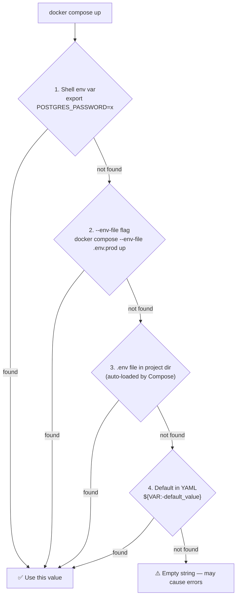

# ဤအရာက ဘကြောင့် အရေးကြီးသနည်း

သင်၏ အပလီကေးရှင်း လည်ပတ်နိုင်ရန်အတွက် ဒေတာဘေ့စ် စကားဝှက်များ၊ API သော့များ၊ လုပ်ဆောင်ချက် ဖလက်ဂ်များ (feature flags) နှင့် ဝန်ဆောင်မှု URL များ စသည့် ဖွဲ့စည်းမှုပုံစံများ (configuration) လိုအပ်ပါသည်။ ဤဖွဲ့စည်းမှုပုံစံများကို မှန်ကန်စွာ စီမံခန့်ခွဲခြင်းသည် ပရိုဒပ်ရှင် (production) သို့ တင်သွင်းရာတွင် အအရေးကြီးဆုံး (နှင့် အမကြာခဏ အမှားအယွင်းအများဆုံး) အပိုင်းများထဲမှ တစ်ခု ဖြစ်ပါသည်။

ရွှေစည်းမျဉ်း သုံးရပ်မှာ-
1. အရင်းအမြစ် ကုဒ် (source code) သို့မဟုတ် Docker ပုံရိပ်များ (images) ထဲတွင် **စကားဝှက်များကို Hardcode လုပ်မထားပါနှင့်**
2. Git ထဲသို့ စကားဝှက်များ **လုံးဝ မတင်ပါနှင့်** (စစ်မှန်သော စကားဝှက်များပါရှိသော `.env`၊ အထောက်အထားများပါရှိသော `docker-compose.prod.yml`)
3. ပတ်ဝန်းကျင် (environment) တစ်ခုချင်းစီအတွက် **တန်ဖိုးအမျိုးမျိုးကို အသုံးပြုပါ** — ဒယ်ဗ် (dev) နှင့် ပရိုဒပ်ရှင် (prod) အတွက် `DATABASE_URL` တန်ဖိုး တူညီနေခြင်းသည် ပြဿနာကြီးကြီး တက်လာနိုင်ချေရှိပါသည်။

---

## Compose သည် အပြောင်းအလဲရှိသော တန်ဖိုးများကို မည်သို့ ဖြေရှင်းသနည်း (The Lookup Chain)

Compose သည် YAML ဖိုင်တစ်ခုအတွင်း `${VARIABLE_NAME}` ကို တွေ့ရှိသောအခါ၊ ၎င်းတန်ဖိုးကို အောက်ပါ အရင်းအမြစ်များမှ **ဦးစားပေး အစဉ်လိုက်** ရယူပါသည်-



```bash
# Shell env တွင် ဦးစားပေးအမြင့်ဆုံး ရှိသည် — အခြားမည်သည့်အရာကိုမဆို ကျော်လွန်သွားမည်
POSTGRES_PASSWORD=prod_secret docker compose up -d

# သီးသန့် env ဖိုင်တစ်ခုကို အသုံးပြုရန်
docker compose --env-file .env.production up -d

# Compose သည် ပရောဂျက် ဖိုင်တွဲမှ .env ကို အလိုအလျောက် တင်ပေးသည် (အတိအလင်းဖော်ပြထားသော ဖိုင်များထဲတွင် ဦးစားပေး အနိမ့်ဆုံးဖြစ်သည်)
```

---

## `docker-compose.yml` ထဲရှိ Variable Syntax

```yaml
services:
  api:
    environment:
      # အခြေခံ အစားထိုးခြင်း — မသတ်မှတ်ထားဘဲ မူလတန်ဖိုး (default) မရှိပါက အမှားတက်မည်
      DATABASE_URL: "${DATABASE_URL}"

      # Variable ကို မသတ်မှတ်ရသေးပါက သို့မဟုတ် ಖಾಲಿနေပါက မူလတန်ဖိုး
      NODE_ENV: "${NODE_ENV:-development}"

      # Variable ကို မသတ်မှတ်ရသေးမှသာ မူလတန်ဖိုး (ಖಾಲಿစာသား "" ဖြစ်နေလျှင် မဟုတ်ပါ)
      LOG_LEVEL: "${LOG_LEVEL-info}"

      # Variable ကို မသတ်မှတ်ရသေးပါက အမှားတက်စေရန်
      POSTGRES_PASSWORD: "${POSTGRES_PASSWORD:?POSTGRES_PASSWORD must be set}"

      # Compose သည် string interpolation ကို ပံ့ပိုးသည်
      REDIS_URL: "redis://:${REDIS_PASSWORD}@cache:${REDIS_PORT:-6379}"
```

---

## `.env` ဖိုင် မဟာဗျူဟာ- ဖိုင်သုံးခု

ပတ်ဝန်းကျင် အသီးသီးအတွက် config ကို စီမံခန့်ခွဲရာတွင် အသန့်ရှင်းဆုံး ပုံစံမှာ-

```bash
# .env — Git သို့ တင်သွင်းသည် (လုံခြုံရေးအရ အရေးမကြီးသော မူလတန်ဖိုးများ)
# ─────────────────────────────────────────────────
NODE_ENV=development
APP_PORT=3000
LOG_LEVEL=info
POSTGRES_USER=appuser
POSTGRES_DB=myapp
POSTGRES_PORT=5432
REDIS_PORT=6379
```

```bash
# .env.local — Developer စက်များတွင် ရှိသည် (Git ထဲသို့ လုံးဝ မတင်ပါ — gitignored လုပ်ထားသည်)
# ─────────────────────────────────────────────────────────────────
# သင့်ဒေသတွင်း တန်ဖိုးများဖြင့် မူလတန်ဖိုးများကို အစားထိုးပါ
POSTGRES_PASSWORD=mydevpassword123
REDIS_PASSWORD=mydevredis
```

```bash
# .env.production — ဆာဗာတွင်သာ ရှိသည် (Git ထဲသို့ လုံးဝ မတင်ပါ — gitignored သို့မဟုတ် vault-managed လုပ်ထားသည်)
# ──────────────────────────────────────────────────────────────────────────────────
NODE_ENV=production
LOG_LEVEL=warn
POSTGRES_USER=appuser
POSTGRES_DB=myapp
POSTGRES_PASSWORD=Str0ng!ProductionP4ssw0rd
REDIS_PASSWORD=Str0ng!RedisP4ssw0rd
IMAGE_TAG=v1.5.2
```

```bash
# .gitignore
.env.local
.env.*.local
.env.production
.env.staging
*.pem
*.key
```

```bash
# ပတ်ဝန်းကျင်တစ်ခုချင်းစီအတွက် မှန်ကန်သော env ဖိုင်ဖြင့် လုပ်ဆောင်ခြင်း
# Development (အသုံးပြုသည်မှာ .env + .env.local override)
docker compose --env-file .env --env-file .env.local up -d

# Production
docker compose --env-file .env.production -f docker-compose.yml -f docker-compose.prod.yml up -d
```

---

## Variable များကို ထည့်သွင်းခြင်း (Injecting) နှင့် `env_file` ကို အသုံးပြုခြင်း

```yaml
services:
  api:
    # ရွေးချယ်စရာ A: env_file — ဖိုင်ထဲရှိ variables အားလုံးကို ကွန်တိန်နာထဲသို့ တင်သွင်းသည်
    env_file:
      - .env              # ကွန်တိန်နာ၏ ပတ်ဝန်းကျင် variable များအဖြစ် တင်သွင်းသည်
      - .env.local        # ဒေသတွင်း တန်ဖိုးများဖြင့် အစားထိုးရန်

    # ရွေးချယ်စရာ B: environment — compose vars မှ ကွန်တိန်နာ vars သို့ တိုက်ရိုက်သတ်မှတ်ခြင်း
    environment:
      NODE_ENV: "${NODE_ENV}"
      DATABASE_URL: "postgres://${POSTGRES_USER}:${POSTGRES_PASSWORD}@db:5432/${POSTGRES_DB}"
      # ^ Compose interpolation သည် ဤနေရာတွင် ဖြစ်ပေါ်သည် (compose context ထဲတွင်)
      #   ကွန်တိန်နာသည် variable ကိုညွှန်းဆိုချက်ကို မမြင်ရဘဲ ဖြေရှင်းပြီးသား စာသား (string) ကိုသာ မြင်ရသည်
```

**အဓိက ကွာခြားချက်**: `env_file` သည် ဖိုင်ကို ရှိရင်းစွဲအတိုင်း ကွန်တိန်နာ ပတ်ဝန်းကျင်သို့ တင်သွင်းပေးပါသည်။ `${}` ပါရှိသော `environment:` ကိုမူ ကွန်တိန်နာ မစတင်မီ Compose က ဦးစွာ ဖြေရှင်းပေးပါသည်။ ချိတ်ဆက်မှု စာသား (connection string) ကဲ့သို့သော variable များစွာကို ပေါင်းစပ်ရန် လိုအပ်သည့်အခါ `environment:` ကို အသုံးပြုပါ။

---

## Variable များကို မှန်ကန်စွာ သတ်မှတ်ထားခြင်း ရှိမရှိ စစ်ဆေးခြင်း

```bash
# ဖြေရှင်းပြီးသား compose config ကို ထုတ်ပြပါ (interpolated တန်ဖိုးအားလုံးကို ပြသသည်)
docker compose config | grep -A 20 "api:"
# မလည်ပတ်မီ DATABASE_URL ကို မှန်ကန်စွာ စုစည်းထားခြင်း ရှိမရှိ စစ်ဆေးရန် ဤအရာကို အသုံးပြုပါ

# လက်ရှိ လည်ပတ်နေသော ကွန်တိန်နာတစ်ခုအတွင်းတွင် မည်သည့် env vars များ ရှိနေသည်ကို စစ်ဆေးရန်
docker compose exec api env | sort

# သီးသန့် variable တစ်ခုကို စစ်ဆေးရန်
docker compose exec api printenv DATABASE_URL
# postgres://appuser:mydevpassword123@db:5432/myapp

# Variable လွတ်နေခြင်း ရှိမရှိ စစ်ဆေးရန် (DATABASE_URL ఖಾಲಿနေပါက 1 ကို ပြန်ပေးသည်)
docker compose exec api test -n "$DATABASE_URL" && echo "SET" || echo "NOT SET"
```

---

## ပတ်ဝန်းကျင်တစ်ခုချင်းစီအတွက် ဖွဲ့စည်းပုံ ပုံစံ (Per-Environment Configuration Pattern)

ပတ်ဝန်းကျင် အသီးသီးတွင် ဆက်တင်များစွာအတွက် တန်ဖိုး အမျိုးမျိုး လိုအပ်ပါသည်-

```yaml
# base docker-compose.yml
services:
  api:
    environment:
      DATABASE_URL: "postgres://${POSTGRES_USER}:${POSTGRES_PASSWORD}@db:5432/${POSTGRES_DB}"
      REDIS_URL: "redis://:${REDIS_PASSWORD}@cache:6379"
      NODE_ENV: "${NODE_ENV:-development}"
      LOG_LEVEL: "${LOG_LEVEL:-info}"
```

```yaml
# docker-compose.dev.yml ပေါင်းထည့်မှုများ
services:
  api:
    environment:
      NODE_ENV: development
      LOG_LEVEL: debug
      NEXT_PUBLIC_API_URL: http://localhost:3000  # ဘရောက်ဆာဘက်ခြမ်း var
      DEBUG: "api:*"                              # ဒက်ဘတ် namespace
```

```yaml
# docker-compose.prod.yml ပေါင်းထည့်မှုများ
services:
  api:
    image: "ghcr.io/yourorg/myapp:${IMAGE_TAG}"   # ကြိုတင်တည်ဆောက်ထားသော ပုံရိပ်ကို ဆွဲယူရန်
    environment:
      NODE_ENV: production
      LOG_LEVEL: warn
      NEXT_PUBLIC_API_URL: "https://api.yourdomain.com"
```

```bash
# အသုံးပြုပုံ
# Development
docker compose -f docker-compose.yml -f docker-compose.dev.yml \
  --env-file .env --env-file .env.local up -d

# Production
IMAGE_TAG=v1.5.2 docker compose -f docker-compose.yml -f docker-compose.prod.yml \
  --env-file .env.production up -d
```

---

## လျှို့ဝှက်ချက် စီမံခန့်ခွဲမှု (Secret Management): အန္တရာယ် အဆင့်အလိုက် နည်းလမ်းလေးမျိုး

### အဆင့် ၁: ဆာဗာပေါ်ရှိ `.env.production` (အနည်းဆုံး လုပ်ဆောင်နိုင်သည့် အဆင့်)

```bash
# ဆာဗာပေါ်တွင် — လုံခြုံသော ခွင့်ပြုချက်များ သတ်မှတ်ပါ
chmod 600 /home/deploy/.env.production
chown deploy:deploy /home/deploy/.env.production

# ၎င်းဖြင့် Compose ကို လည်ပတ်ပါ
docker compose --env-file /home/deploy/.env.production up -d
```

**သင့်လျော်သည်မှာ**: အဖွဲ့ငယ်များ၊ ဆာဗာ တစ်လုံးတည်း သုံးခြင်း
**အန္တရာယ်**: ဖိုင်သည် ဒစ်ခ်ပေါ်တွင် ရှိနေသည်၊ ဆာဗာသို့ ဝင်ရောက်ခွင့်ရှိသူတိုင်း မြင်နိုင်သည်

### အဆင့် ၂: Docker Secrets (ပါ၀င်ပြီးသား၊ ဖိုင်အခြေခံ)

Docker Secrets သည် လျှို့ဝှက်ချက်များကို `/run/secrets/` တွင် ဖိုင်များအဖြစ် ချိတ်ဆက်ပေးသည် — env vars အဖြစ် ပေါ်မနေပါ။

```yaml
# Docker Secrets ပါရှိသော docker-compose.yml
services:
  api:
    secrets:
      - db_password
      - redis_password
      - jwt_secret
    environment:
      # အပလီကေးရှင်းသည် env var မှမဟုတ်ဘဲ ဖိုင်မှ လျှို့ဝှက်ချက်ကို ဖတ်သည်
      # ဥပမာ Node.js တွင်: fs.readFileSync('/run/secrets/db_password', 'utf8').trim()
      DB_PASSWORD_FILE: /run/secrets/db_password

  db:
    image: postgres:16-alpine
    secrets:
      - db_password
    environment:
      POSTGRES_USER: appuser
      POSTGRES_DB: myapp
      # တရားဝင် postgres ပုံရိပ်သည် _FILE ပုံစံကို ပံ့ပိုးသည်:
      POSTGRES_PASSWORD_FILE: /run/secrets/db_password

secrets:
  db_password:
    file: ./secrets/db_password.txt    # ရိုးရိုးစာသား ဖိုင် (chmod 400)
  redis_password:
    file: ./secrets/redis_password.txt
  jwt_secret:
    file: ./secrets/jwt_secret.txt
```

```bash
# လျှို့ဝှက်ချက် ဖိုင်များကို ဖန်တီးပါ (တစ်ကြိမ်သာ လုပ်ပါ၊ Git သို့ မတင်ပါနှင့်)
mkdir -p secrets
openssl rand -base64 32 > secrets/db_password.txt
openssl rand -base64 32 > secrets/redis_password.txt
openssl rand -base64 48 > secrets/jwt_secret.txt
chmod 400 secrets/*.txt
echo "secrets/" >> .gitignore
```

### အဆင့် ၃: CI/CD Secrets ထည့်သွင်းခြင်း (အဖွဲ့များအတွက် အကြံပြုသည်)

ဖိုင်များထဲတွင် မထားဘဲ GitHub Actions Secrets ထဲတွင် လျှို့ဝှက်ချက်များကို သိမ်းဆည်းပါ-

```yaml
# .github/workflows/deploy.yml
name: Deploy
on:
  push:
    branches: [main]

jobs:
  deploy:
    runs-on: ubuntu-latest
    steps:
      - name: Deploy to server
        uses: appleboy/ssh-action@master
        with:
          host: ${{ secrets.SERVER_HOST }}
          username: ${{ secrets.SERVER_USER }}
          key: ${{ secrets.SSH_PRIVATE_KEY }}
          script: |
            # CI secrets မှ env ဖိုင်ကို ရေးပါ (Git ကို လုံးဝ မထိပါ)
            cat > /home/deploy/.env.production << 'EOF'
            NODE_ENV=production
            POSTGRES_USER=appuser
            POSTGRES_PASSWORD=${{ secrets.POSTGRES_PASSWORD }}
            POSTGRES_DB=myapp
            REDIS_PASSWORD=${{ secrets.REDIS_PASSWORD }}
            IMAGE_TAG=${{ github.sha }}
            EOF
            chmod 600 /home/deploy/.env.production
            
            # Deploy လုပ်ရန်
            cd /home/deploy/myapp
            docker compose --env-file /home/deploy/.env.production \
              -f docker-compose.yml -f docker-compose.prod.yml pull
            docker compose --env-file /home/deploy/.env.production \
              -f docker-compose.yml -f docker-compose.prod.yml up -d
```

### အဆင့် ၄: ပြင်ပ လျှို့ဝှက်ချက် စီမံခန့်ခွဲမှု (Enterprise)

စည်းမျဉ်းဥပဒေများနှင့် ကိုက်ညီရန် လိုအပ်သော အဖွဲ့များအတွက်၊ deploy လုပ်သည့်အချိန်တွင် AWS Secrets Manager၊ Vault သို့မဟုတ် GCP Secret Manager တို့မှ လျှို့ဝှက်ချက်များကို ဆွဲယူပါ-

```bash
# ဥပမာ: AWS Secrets Manager
aws secretsmanager get-secret-value \
  --secret-id myapp/production/db \
  --query SecretString \
  --output text | python3 -c "
import sys, json
secrets = json.load(sys.stdin)
for k, v in secrets.items():
    print(f'{k}={v}')
" > .env.production

docker compose --env-file .env.production up -d
rm -f .env.production  # ချက်ချင်း ဖယ်ရှားရှင်းလင်းပါ
```

---

## ရန်းတိုင်းမ် ဖွဲ့စည်းပုံ (Runtime Configuration): Build Args နှင့် Env Vars

**တည်ဆောက်ချိန် (build-time)** နှင့် **လည်ပတ်ချိန် (runtime)** variable များအကြား ကွာခြားချက်ကို နားလည်ပါ-

```dockerfile
# Dockerfile
ARG NODE_VERSION=20           # တည်ဆောက်ချိန် အကြောင်းပြချက် — ပုံရိပ်အလွှာထဲသို့ ထည့်သွင်းပြီးသား
ARG BUILD_ENV=production      # ကွန်တိန်နာ လည်ပတ်ချိန်တွင် မရရှိနိုင်ပါ

ENV NODE_ENV=production        # လည်ပတ်ချိန် ပတ်ဝန်းကျင် variable — အပလီကေးရှင်းအတွက် ရရှိနိုင်သည်
```

```yaml
# docker-compose.yml
services:
  api:
    build:
      context: .
      args:
        NODE_VERSION: "20"     # docker build သို့ --build-arg အဖြစ် ပေးပို့သည်
        BUILD_ENV: production  # ပုံရိပ် တည်ဆောက်နေစဉ်အတွင်းသာ ရရှိနိုင်သည်
    environment:
      NODE_ENV: production     # ကွန်တိန်နာ လည်ပတ်နေစဉ် ရရှိနိုင်သည်
      DATABASE_URL: "..."      # ကွန်တိန်နာ လည်ပတ်နေစဉ် ရရှိနိုင်သည်
```

**စည်းမျဉ်း**: တည်ဆောက်မှုကို ထိခိုက်စေသည့် အရာများ (Node ဗားရှင်း၊ တည်ဆောက်မည့် ပစ်မှတ်၊ ပိုမိုကောင်းမွန်အောင် ပြုလုပ်ခြင်း ဖလက်ဂ်များ) အတွက် `build.args` ကို အသုံးပြုပါ။ လည်ပတ်နေသော အပလီကေးရှင်း လိုအပ်သည့် အရာများ (ဒေတာဘေ့စ် URL များ၊ API သော့များ၊ လုပ်ဆောင်ချက် ဖလက်ဂ်များ) အတွက် `environment` ကို အသုံးပြုပါ။

---

## ပတ်ဝန်းကျင် Variable များမှတဆင့် လုပ်ဆောင်ချက် ဖလက်ဂ်များ (Feature Flags)

```yaml
# docker-compose.yml
services:
  api:
    environment:
      # env vars အဖြစ် လုပ်ဆောင်ချက် ဖလက်ဂ်များ (ပတ်ဝန်းကျင်တစ်ခုချင်းစီအလိုက် ပြောင်းလဲရန် လွယ်ကူသည်)
      FEATURE_NEW_CHECKOUT: "${FEATURE_NEW_CHECKOUT:-false}"
      FEATURE_ANALYTICS: "${FEATURE_ANALYTICS:-false}"
      FEATURE_RATE_LIMITING: "${FEATURE_RATE_LIMITING:-true}"
      MAX_UPLOAD_SIZE_MB: "${MAX_UPLOAD_SIZE_MB:-10}"
```

```bash
# ဒယ်ဗ်တွင်သာ လုပ်ဆောင်ချက်ကို ဖွင့်ရန်
echo "FEATURE_NEW_CHECKOUT=true" >> .env.local

# ပရိုဒပ်ရှင်တွင်သာ ဖွင့်ရန် — .env.production ကို အပ်ဒိတ်လုပ်ပါ
FEATURE_NEW_CHECKOUT=true docker compose --env-file .env.production up -d
```

---

## လုံခြုံရေး စာရင်းဇယား (Security Checklist)

ပရိုဒပ်ရှင်သို့ မသွားမီ အောက်ပါတို့ကို စစ်ဆေးပါ-

- [ ] Git သို့ တင်ထားသော `.env` တွင် **စကားဝှက်များ သို့မဟုတ် API သော့များ မပါရှိပါ** — လုံခြုံရေးအရ အရေးမကြီးသော မူလတန်ဖိုးများသာ ပါရှိသည်
- [ ] `.env.local` နှင့် `.env.production` တို့သည် `.gitignore` ထဲတွင် ရှိနေသည်
- [ ] `docker compose config` သည် လော့ဂ်များတွင် လျှို့ဝှက်ချက်များကို မပေါ်စေဘဲ မှန်ကန်သော တန်ဖိုးများကို ပြသသည်
- [ ] ဒေတာဘေ့စ်ကို အများပြည်သူသုံး ပေါ့တ် (public port) တွင် မဖွင့်ထားပါ (`5432:5432` အများပြည်သူသုံး IP တွင် မဟုတ်ပါ)
- [ ] လျှို့ဝှက်ချက်များတွင် သင့်လျော်သော ဖိုင်ခွင့်ပြုချက်များ ရှိသည် (`chmod 600`)
- [ ] ဒယ်ဗ်နှင့် ပရိုဒပ်ရှင် ပတ်ဝန်းကျင်များအတွက် စကားဝှက်များ ကွဲပြားခြားနားသည်
- [ ] CI/CD လျှို့ဝှက်ချက်များကို ရေပို (repo) ထဲတွင် မဟုတ်ဘဲ ပလက်ဖောင်း လျှို့ဝှက်ချက်စတိုး (GitHub Secrets, GitLab CI Variables) တွင် သိမ်းဆည်းထားသည်

---

## အနှစ်ချုပ်

Docker Compose တွင် ပတ်ဝန်းကျင် variable စီမံခန့်ခွဲမှုသည် ရှင်းလင်းသော အဆင့်ဆင့် စနစ်ရှိသည်-
- **Shell env vars** → `--env-file` ဖိုင်အလံ → အလိုအလျောက် တင်ပေးသော `.env` → YAML မူလတန်ဖိုးများ
- လုံခြုံသော မူလတန်ဖိုးများပါရှိသော `.env` ကို တင်သွင်းပါ; `.env.local` နှင့် `.env.production`တို့ကို gitignored လုပ်ထားပါ
- **Build args** (`build.args`) သည် ပုံရိပ် တည်ဆောက်မှုကို ထိခိုက်စေသည်; **env vars** (`environment`) သည် လည်ပတ်ချိန် (runtime) တွင် ရရှိနိုင်သည်
- ပရိုဒပ်ရှင်အတွက် လျှို့ဝှက်ချက် မဟာဗျူဟာ လေးခုထဲမှ တစ်ခုကို အသုံးပြုပါ: ဆာဗာပေါ်ရှိ `.env.production`၊ Docker Secrets (ဖိုင်အခြေခံ)၊ CI/CD လျှို့ဝှက်ချက် ထည့်သွင်းခြင်း၊ သို့မဟုတ် ပြင်ပ လျှို့ဝှက်ချက် မန်နေဂျာ
- မတင်သွင်းမီ interpolated တန်ဖိုးများ မှန်ကန်ကြောင်း စစ်ဆေးရန် `docker compose config` ကို အမြဲတမ်း လုပ်ဆောင်ပါ

နောက်သင်ခန်းစာတွင်၊ ဝန်ဆောင်မှု မှီခိုမှု အစဉ်လိုက် (service dependency ordering) နှင့် ကျန်းမာရေး စစ်ဆေးမှုများ (health checks) ကို ကျွမ်းကျင်လာမည်ဖြစ်သည် — ၎င်းက သင့်ကွန်တိန်နာများသည် မှန်ကန်သော အစဉ်လိုက် စတင်ရန်နှင့် မှီခိုမှုများ အဆင်သင့်မဖြစ်မီ ချိတ်ဆက်ရန် မကြိုးစားစေရန် သေချာစေမည် ဖြစ်ပါသည်။