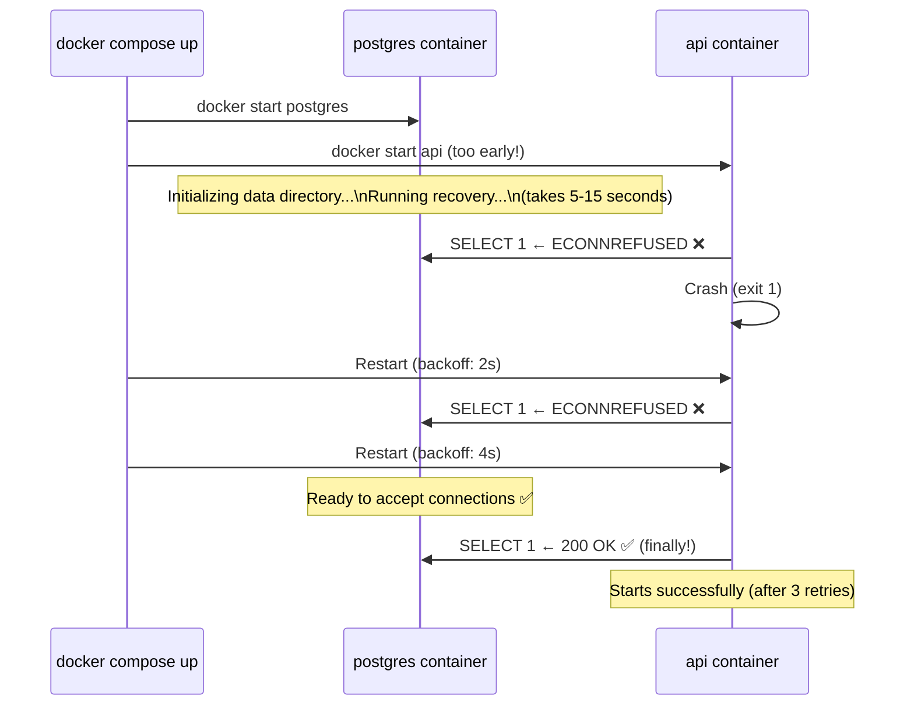
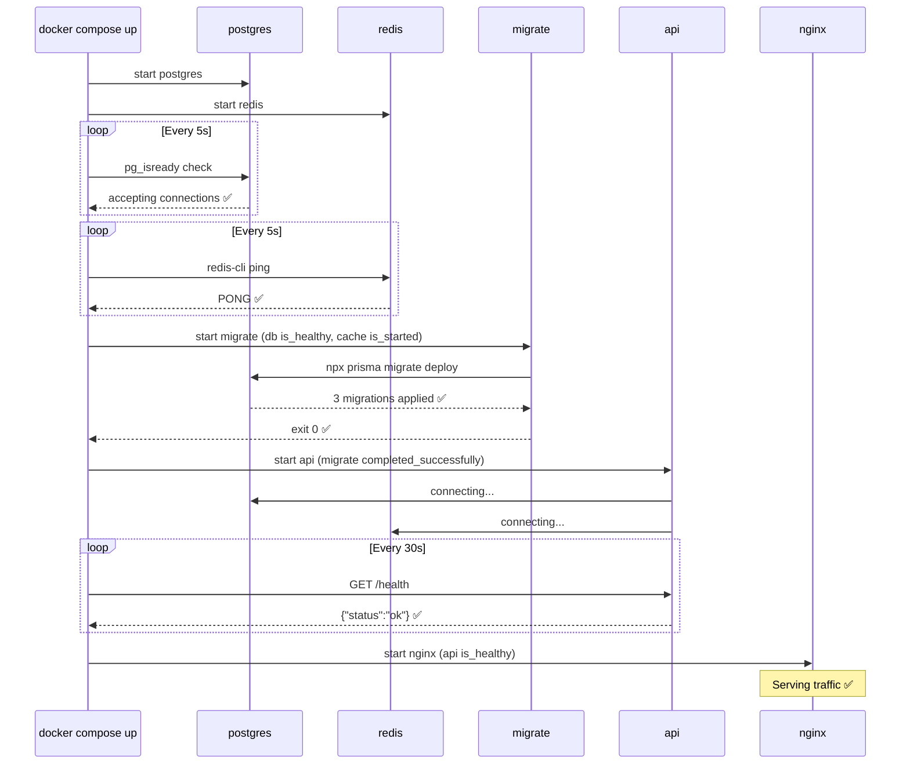

# The Startup Race Condition

Docker Compose တွင် အဖြစ်အများဆုံး ပြဿနာတစ်ခုမှာ- သင်၏ application container စတင်လာပြီး၊ ချက်ချင်းပင် ဒေတာဘေ့စ် (database) သို့ ချိတ်ဆက်ရန် ကြိုးစားသောအခါ `ECONNREFUSED` အမှားကို ရရှိခြင်းပင် ဖြစ်သည်။ အဘယ်ကြောင့်ဆိုသော် PostgreSQL သည် ပထမဆုံးအကြိမ် စတင်ဖွင့်လှစ်ချိန်တွင် (ဒေတာလမ်းကြောင်း ဖန်တီးခြင်း၊ WAL recovery လုပ်ဆောင်ခြင်းနှင့် ချိတ်ဆက်မှုများကို လက်ခံခြင်းတို့ ပြုလုပ်ရန်) အပြည့်အဝ အလုပ်လုပ်နိုင်ရန် ၅ စက္ကန့်မှ ၁၅ စက္ကန့်အထိ ကြာမြင့်တတ်သောကြောင့် ဖြစ်သည်။



ကျန်းမာရေး စစ်ဆေးမှု (health check) ပါဝင်ခြင်း မရှိဘဲ အသုံးပြုထားသော `depends_on` သည် **container စတင်ခြင်း** ကိုသာ အာမခံချက် ပေးသည် — အတွင်းရှိ **application အသင့်ဖြစ်နေပြီ** ဆိုသည်ကို အာမခံချက် မပေးပေ။ ဤသင်ခန်းစာတွင် ဤပြဿနာကို မည်သို့ မှန်ကန်စွာ ဖြေရှင်းရမည်ကို ပြသပေးမည် ဖြစ်သည်။

---

## The Three `depends_on` Conditions

```yaml
services:
  api:
    depends_on:
      # ── Condition 1: service_started (DEFAULT) ───────────────────
      # Container process has started — that's ALL it checks.
      # Does NOT wait for the app inside to be ready.
      # Only appropriate for services that are immediately ready (static file servers).
      cache:
        condition: service_started

      # ── Condition 2: service_healthy ──────────────────────────────
      # Container passes its healthcheck before api starts.
      # Use for: PostgreSQL, MySQL, Redis, Elasticsearch, RabbitMQ.
      db:
        condition: service_healthy
        restart: true     # Restart api if db restarts (maintains the dependency)

      # ── Condition 3: service_completed_successfully ───────────────
      # Container has exited with code 0.
      # Use for: migration scripts, seed scripts, one-off setup tasks.
      migrate:
        condition: service_completed_successfully
```

---

## Writing Effective Health Checks

### PostgreSQL

```yaml
services:
  db:
    image: postgres:16-alpine
    environment:
      POSTGRES_USER: ${POSTGRES_USER}
      POSTGRES_PASSWORD: ${POSTGRES_PASSWORD}
      POSTGRES_DB: ${POSTGRES_DB}
    healthcheck:
      # pg_isready checks if postgres is accepting connections on the right user/db
      test: ["CMD-SHELL", "pg_isready -U ${POSTGRES_USER} -d ${POSTGRES_DB}"]
      interval: 5s        # Check every 5 seconds
      timeout: 5s         # Fail if no response within 5 seconds
      retries: 10         # Mark unhealthy after 10 consecutive failures (50s)
      start_period: 15s   # Give Postgres up to 15s to start before failures count
                          # (Prevents false failures during first-boot initialization)
```

### MySQL / MariaDB

```yaml
services:
  db:
    image: mysql:8.0
    environment:
      MYSQL_ROOT_PASSWORD: ${MYSQL_ROOT_PASSWORD}
      MYSQL_DATABASE: ${MYSQL_DB}
      MYSQL_USER: ${MYSQL_USER}
      MYSQL_PASSWORD: ${MYSQL_PASSWORD}
    healthcheck:
      test: ["CMD", "mysqladmin", "ping", "-h", "localhost",
             "-u", "${MYSQL_USER}", "-p${MYSQL_PASSWORD}"]
      interval: 5s
      timeout: 5s
      retries: 10
      start_period: 30s   # MySQL is slower to initialize than Postgres
```

### Redis

```yaml
services:
  cache:
    image: redis:7-alpine
    command: redis-server --requirepass ${REDIS_PASSWORD}
    healthcheck:
      test: ["CMD", "redis-cli", "-a", "${REDIS_PASSWORD}", "ping"]
      interval: 5s
      timeout: 3s
      retries: 5
      start_period: 5s
```

### MongoDB

```yaml
services:
  mongo:
    image: mongo:7
    environment:
      MONGO_INITDB_ROOT_USERNAME: ${MONGO_USER}
      MONGO_INITDB_ROOT_PASSWORD: ${MONGO_PASSWORD}
    healthcheck:
      test: >
        echo 'db.runCommand("ping").ok' |
        mongosh localhost:27017/admin
        --username ${MONGO_USER}
        --password ${MONGO_PASSWORD}
        --quiet
      interval: 10s
      timeout: 10s
      retries: 5
      start_period: 30s
```

### Elasticsearch

```yaml
services:
  elasticsearch:
    image: elasticsearch:8.12.0
    environment:
      discovery.type: single-node
      ES_JAVA_OPTS: "-Xms512m -Xmx512m"
      xpack.security.enabled: "false"
    healthcheck:
      test: ["CMD-SHELL", "curl -s http://localhost:9200/_cluster/health | grep -q '\"status\":\"green\"\\|\"status\":\"yellow\"'"]
      interval: 10s
      timeout: 10s
      retries: 15
      start_period: 60s   # ES is very slow to start — give it a full minute
```

### Your Own API / Node.js App

```yaml
services:
  api:
    build: .
    healthcheck:
      # wget is available in alpine images (curl is not always pre-installed)
      test: ["CMD-SHELL", "wget -qO- http://localhost:3000/health || exit 1"]
      interval: 30s
      timeout: 10s
      retries: 3
      start_period: 20s
```

### What Makes a Good `/health` Endpoint

```typescript
// app/api/health/route.ts — check real dependencies, not just HTTP up
export async function GET() {
  const checks: Record<string, "ok" | "error"> = {};
  let overall = "ok";

  // Check database
  try {
    await db.raw("SELECT 1");
    checks.database = "ok";
  } catch {
    checks.database = "error";
    overall = "degraded";
  }

  // Check Redis
  try {
    await redis.ping();
    checks.cache = "ok";
  } catch {
    checks.cache = "error";
    overall = "degraded";
  }

  return Response.json(
    { status: overall, checks, ts: Date.now() },
    { status: overall === "ok" ? 200 : 503 }
  );
}
```

ဒေတာဘေ့စ် ချို့ယွင်းနေချိန်တွင်ပင် `200` ကို ပြန်ပေးသော health endpoint တစ်ခုသည် **health check လုံးဝမရှိသည်ထက် ပိုဆိုးသည်** — အဘယ်ကြောင့်ဆိုသော် ၎င်းသည် ဝန်ဆောင်မှု အသင့်မဖြစ်သေးဘဲနှင့် အသင့်ဖြစ်နေပြီဟု Compose အား မှားယွင်းစွာ အကြောင်းကြားနေသောကြောင့် ဖြစ်သည်။

---

## The Full Startup Sequence: Correct Implementation



---

## Putting It All Together: Full `docker-compose.yml`

```yaml
services:
  # ── PostgreSQL ───────────────────────────────────────────────────────
  db:
    image: postgres:16-alpine
    environment:
      POSTGRES_USER: ${POSTGRES_USER}
      POSTGRES_PASSWORD: ${POSTGRES_PASSWORD}
      POSTGRES_DB: ${POSTGRES_DB}
    volumes:
      - postgres-data:/var/lib/postgresql/data
    networks:
      - backend
    restart: unless-stopped
    healthcheck:
      test: ["CMD-SHELL", "pg_isready -U ${POSTGRES_USER} -d ${POSTGRES_DB}"]
      interval: 5s
      timeout: 5s
      retries: 10
      start_period: 15s

  # ── Redis ─────────────────────────────────────────────────────────────
  cache:
    image: redis:7-alpine
    command: redis-server --requirepass ${REDIS_PASSWORD} --loglevel warning
    volumes:
      - redis-data:/data
    networks:
      - backend
    restart: unless-stopped
    healthcheck:
      test: ["CMD", "redis-cli", "-a", "${REDIS_PASSWORD}", "ping"]
      interval: 5s
      timeout: 3s
      retries: 5
      start_period: 5s

  # ── Migration (one-shot) ──────────────────────────────────────────────
  migrate:
    build:
      context: .
      target: builder
    command: ["npx", "prisma", "migrate", "deploy"]
    environment:
      DATABASE_URL: "postgres://${POSTGRES_USER}:${POSTGRES_PASSWORD}@db:5432/${POSTGRES_DB}"
    depends_on:
      db:
        condition: service_healthy    # Must be healthy before running migrations
    networks:
      - backend
    restart: "no"                     # Never restart — it's a one-shot task

  # ── API ───────────────────────────────────────────────────────────────
  api:
    build:
      context: .
      target: runner
    environment:
      NODE_ENV: ${NODE_ENV:-production}
      DATABASE_URL: "postgres://${POSTGRES_USER}:${POSTGRES_PASSWORD}@db:5432/${POSTGRES_DB}"
      REDIS_URL: "redis://:${REDIS_PASSWORD}@cache:6379"
    depends_on:
      migrate:
        condition: service_completed_successfully  # Migrations done first
      cache:
        condition: service_healthy
    networks:
      - backend
    restart: unless-stopped
    healthcheck:
      test: ["CMD-SHELL", "wget -qO- http://localhost:3000/health || exit 1"]
      interval: 30s
      timeout: 10s
      retries: 3
      start_period: 20s

  # ── Nginx ─────────────────────────────────────────────────────────────
  nginx:
    image: nginx:alpine
    ports:
      - "80:80"
    volumes:
      - ./nginx/default.conf:/etc/nginx/conf.d/default.conf:ro
    depends_on:
      api:
        condition: service_healthy    # Only serve traffic once API is healthy
    networks:
      - backend
    restart: unless-stopped
    healthcheck:
      test: ["CMD", "wget", "-qO-", "http://localhost/nginx-health"]
      interval: 30s
      timeout: 5s
      retries: 3

networks:
  backend:
    driver: bridge

volumes:
  postgres-data:
  redis-data:
```

---

## Monitoring Health Status

```bash
# View current health status of all containers
docker compose ps
# NAME            IMAGE              STATUS
# myapp-db-1      postgres:16        Up 5m (healthy)      ← ✅ passed healthcheck
# myapp-cache-1   redis:7-alpine     Up 5m (healthy)
# myapp-migrate-1 myapp-api          Exited (0) 4m        ← ✅ completed successfully
# myapp-api-1     myapp-api          Up 4m (healthy)
# myapp-nginx-1   nginx:alpine       Up 3m (healthy)

# See detailed health check output (last 5 checks)
docker inspect myapp-db-1 | python3 -c "
import sys, json
data = json.load(sys.stdin)
health = data[0]['State']['Health']
print('Status:', health['Status'])
for log in health['Log'][-3:]:
    print(f'  [{log[\"ExitCode\"]}] {log[\"Output\"].strip()}' )"

# Quick health check for a specific service
docker inspect --format='{{.State.Health.Status}}' myapp-db-1
# healthy

# Watch health status change in real time
watch -n 2 'docker compose ps'
```

---

## Debugging Unhealthy or Failing Services

```bash
# === Service stuck in "starting" (healthcheck not passing) ===

# 1. Read the health check logs
docker inspect myapp-api-1 | python3 -c "
import sys, json
h = json.load(sys.stdin)[0]['State']['Health']
for l in h['Log']: print(l['Output'])"
# wget: can't connect to remote host (127.0.0.1): Connection refused
# → App hasn't bound to port 3000 yet — check app logs

# 2. Check the app logs
docker compose logs api --tail=50
# Error: Cannot find module '@prisma/client'
# → Missing dependencies in production image — fix Dockerfile

# === Migration fails (exits non-zero) ===
docker compose logs migrate
# Error: P3009 migrate found failed migrations
# Fix: repair or reset the migration history

# Run migration in interactive mode to see full output
docker compose run --rm migrate npx prisma migrate status

# === Service depends_on isn't being respected ===
# If api is starting before migrations complete, verify:
docker compose config | grep -A 10 "depends_on"

# === Database connection still failing after health check passes ===
# pg_isready checks if Postgres accepts TCP connections, NOT if your user/db exists
# Test the actual connection:
docker compose exec db psql -U ${POSTGRES_USER} -d ${POSTGRES_DB} -c "SELECT 1"
# If this fails: check POSTGRES_DB and POSTGRES_USER match
```

---

## Restarting and Recovery Behavior

```bash
# === What happens when db crashes? ===
# With restart: unless-stopped:
docker compose kill db           # Simulate crash
docker compose ps
# myapp-db-1    Restarting    ← Docker restarts it automatically

# After db restarts, api might lose its connection pool
# With depends_on.db.restart: true, Compose also restarts api
# Or your app should implement connection retry logic

# === Manual restart workflow ===
# Update just the API without touching DB or cache:
docker compose pull api          # Pull new image
docker compose up -d api         # Restart only api (brief downtime)

# Or with a rolling-style restart:
docker compose build api
docker compose up --force-recreate --no-deps -d api
```

---

## Summary

ဝန်ဆောင်မှု အပြန်အလှန် မှီခိုမှုများ (Service dependencies) သည် ယုံကြည်စိတ်ချရသော multi-container stack တစ်ခု၏ အခြေခံအုတ်မြစ် ဖြစ်သည်-

- **`depends_on` တစ်ခုတည်းဖြင့် မလုံလောက်ပါ** — ၎င်းသည် container စတင်သည်အထိသာ စောင့်ဆိုင်းပြီး ဝန်ဆောင်မှု အလုပ်လုပ်ရန် အသင့်ဖြစ်ပြီလား ဆိုသည်ကို မစောင့်ပေ။
- ဒေတာဘေ့စ်များနှင့် ကက်ရှ်များ အမှန်တကယ် အသင့်ဖြစ်ပြီဆိုသည်ကို Compose သိရှိနိုင်ရန် **always add `healthcheck`** ပြုလုပ်ပါ။
- မှန်ကန်သော အခြေအနေကို အသုံးပြုပါ: ရေရှည်လည်ပတ်မည့် ဝန်ဆောင်မှုများအတွက် `service_healthy`၊ တစ်ကြိမ်တည်း လုပ်ဆောင်မည့် migration လုပ်ငန်းများအတွက် `service_completed_successfully`၊ အလွန်မြန်ဆန်စွာ စတင်နိုင်သော ဝန်ဆောင်မှုများအတွက်သာ `service_started` ကို အသုံးပြုပါ။
- **`start_period`** ကွက်လပ်သည် ပထမဆုံးအကြိမ် စတင်ဖွင့်လှစ်ချိန်တွင် ကျန်းမာရေး စစ်ဆေးမှုများ စောစီးစွာ မအောင်မမြင်ဖြစ်ခြင်းမှ ကာကွယ်ပေးသည် (Postgres နှင့် Elasticsearch တို့အတွက် အလွန်အရေးကြီးသည်)။
- `docker compose ps` နှင့် `docker inspect` တို့ဖြင့် စောင့်ကြည့်ပါ — ကျန်းမာရေး အခြေအနေနှင့် လော့ဂ် (logs) များက မည်သည့်အရာ ချို့ယွင်းနေသည်ကို တိကျစွာ ပြသပေးပါလိမ့်မည်။
- သင်၏ `/health` endpoint သည် **အမှန်တကယ် ချိတ်ဆက်ထားသော dependencies များ** (DB, cache) ကို စစ်ဆေးရမည် — လမ်းကြောင်းလွဲစေသော `200 OK` သည် ကျန်းမာရေး စစ်ဆေးမှု မှီခိုကွင်းဆက် (dependency chain) တစ်ခုလုံးကို ပျက်စီးစေသည်။

နောက်လာမည့် သင်ခန်းစာတွင်၊ ကွဲပြားခြားနားသော ပတ်ဝန်းကျင်များ (environments) အတွက် သင်၏ Compose ဖိုင်များကို မည်သို့ တည်ဆောက်ရမည်၊ Git တွင် လျှို့ဝက်ချက်များ (secrets) လုံးဝမပါရှိဘဲ production server တစ်ခုပေါ်သို့ မည်သို့ ဖြန့်ဝေရမည် (deploy) ကို သင်ယူရမည် ဖြစ်သည်။