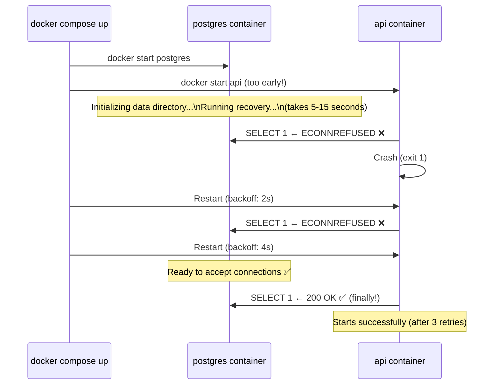
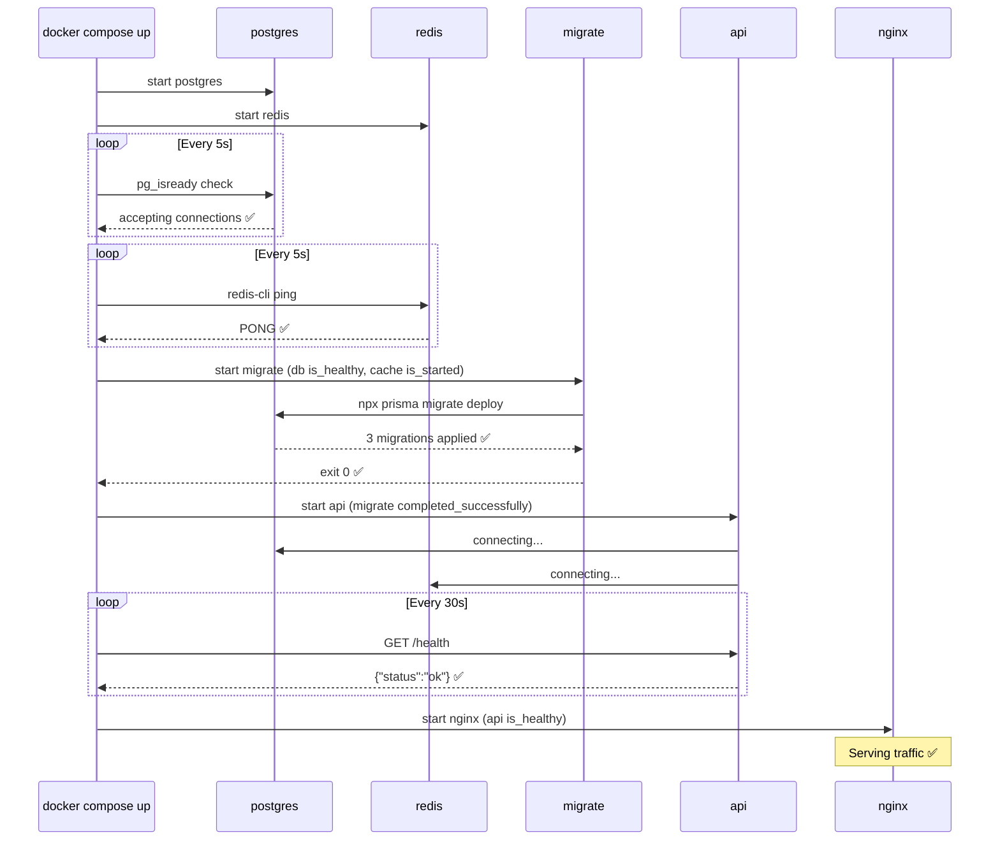

# The Startup Race Condition

Compose တွင် အဖြစ်များဆုံး ပြဿနာတစ်ခုမှာ: သင်၏ application container စတင်လာပြီးချင်း database ကို ချိတ်ဆက်ဖို့ ချက်ချင်းကြိုးစားလိုက်ရာ `ECONNREFUSED` error တက်လာခြင်း ဖြစ်သည် — အကြောင်းမှာ PostgreSQL သည် ပထမဆုံးအကြိမ် boot လုပ်ချိန်တွင် (data directory ဖန်တီးခြင်း၊ WAL recovery လုပ်ခြင်း နှင့် connections လက်ခံခြင်းတို့အတွက်) အပြည့်အဝ initialize ဖြစ်ရန် ၅ စက္ကန့်မှ ၁၅ စက္ကန့်အထိ ကြာမြင့်တတ်သောကြောင့် ဖြစ်သည်။



health check မပါဘဲ `depends_on` ကို သုံးခြင်းသည် **container စတင်လာခြင်း** ကိုသာ အာမခံသည် — **အတွင်းရှိ application အဆင်သင့်ဖြစ်နေပြီ** ကို မာမခံပါ။ ဤသင်ခန်းစာတွင် ဤပြဿနာကို မည်သို့ မှန်ကန်စွာ ဖြေရှင်းရမည်ကို ပြသပေးပါမည်။

---

## The Three `depends_on` Conditions

```yaml
services:
  api:
    depends_on:
      # ── Condition 1: service_started (DEFAULT) ───────────────────
      # Container process စတင်သွားပြီ — ၎င်းက စစ်ဆေးသည်မှာ ဒါပါပဲ။
      # အတွင်းရှိ app အဆင်သင့်ဖြစ်ပြီလား ဆိုတာကို စောင့်မနေပါ။
      # ချက်ချင်း အဆင်သင့်ဖြစ်နေသော services တွေ (static file servers ကဲ့သို့သော) အတွက်သာ သင့်လျော်သည်။
      cache:
        condition: service_started

      # ── Condition 2: service_healthy ──────────────────────────────
      # api မစတင်မီ container သည် ၎င်း၏ healthcheck ကို အောင်မြင်ရပါမည်။
      # ဤအတွက် သုံးပါ: PostgreSQL, MySQL, Redis, Elasticsearch, RabbitMQ.
      db:
        condition: service_healthy
        restart: true     # db restart ဖြစ်သွားရင် api ကိုပါ restart လုပ်သည် (dependency ကို ထိန်းသိမ်းရန်)

      # ── Condition 3: service_completed_successfully ───────────────
      # Container သည် code 0 ဖြင့် ထွက်သွားပြီး ဖြစ်ရပါမည်။
      # ဤအတွက် သုံးပါ: migration scripts, seed scripts, one-off setup tasks.
      migrate:
        condition: service_completed_successfully
```

---

## Writing Effective Health Checks

### PostgreSQL

```yaml
services:
  db:
    image: postgres:16-alpine
    environment:
      POSTGRES_USER: ${POSTGRES_USER}
      POSTGRES_PASSWORD: ${POSTGRES_PASSWORD}
      POSTGRES_DB: ${POSTGRES_DB}
    healthcheck:
      # pg_isready သည် postgres သည် မှန်ကန်သော user/db ဖြင့် connections များကို လက်ခံနေပြီလား စစ်ဆေးသည်
      test: ["CMD-SHELL", "pg_isready -U ${POSTGRES_USER} -d ${POSTGRES_DB}"]
      interval: 5s        # ၅ စက္ကန့်တစ်ကြိမ် စစ်ဆေးမည်
      timeout: 5s         # ၅ စက္ကန့်အတွင်း reply မလာပါက fail မည်
      retries: 10         # ဆက်တိုက် ၁၀ ကြိမ် fail မှ unhealthy ဟု သတ်မှတ်မည် (စုစုပေါင်း ၅၀ စက္ကန့်)
      start_period: 15s   # failures မရေတွက်ခင် Postgres ကို စတင်ရန် ၁၅ စက္ကန့် အချိန်ပေးသည်
                          # (ပထမဆုံး boot လုပ်ချိန်တွင် အမှားအယွင်းများ မပြအောင် ကာကွယ်ပေးသည်)
```

### MySQL / MariaDB

```yaml
services:
  db:
    image: mysql:8.0
    environment:
      MYSQL_ROOT_PASSWORD: ${MYSQL_ROOT_PASSWORD}
      MYSQL_DATABASE: ${MYSQL_DB}
      MYSQL_USER: ${MYSQL_USER}
      MYSQL_PASSWORD: ${MYSQL_PASSWORD}
    healthcheck:
      test: ["CMD", "mysqladmin", "ping", "-h", "localhost",
             "-u", "${MYSQL_USER}", "-p${MYSQL_PASSWORD}"]
      interval: 5s
      timeout: 5s
      retries: 10
      start_period: 30s   # MySQL သည် Postgres ထက် initialize ဖြစ်ရန် ပိုနှေးသည်
```

### Redis

```yaml
services:
  cache:
    image: redis:7-alpine
    command: redis-server --requirepass ${REDIS_PASSWORD}
    healthcheck:
      test: ["CMD", "redis-cli", "-a", "${REDIS_PASSWORD}", "ping"]
      interval: 5s
      timeout: 3s
      retries: 5
      start_period: 5s
```

### MongoDB

```yaml
services:
  mongo:
    image: mongo:7
    environment:
      MONGO_INITDB_ROOT_USERNAME: ${MONGO_USER}
      MONGO_INITDB_ROOT_PASSWORD: ${MONGO_PASSWORD}
    healthcheck:
      test: >
        echo 'db.runCommand("ping").ok' |
        mongosh localhost:27017/admin
        --username ${MONGO_USER}
        --password ${MONGO_PASSWORD}
        --quiet
      interval: 10s
      timeout: 10s
      retries: 5
      start_period: 30s
```

### Elasticsearch

```yaml
services:
  elasticsearch:
    image: elasticsearch:8.12.0
    environment:
      discovery.type: single-node
      ES_JAVA_OPTS: "-Xms512m -Xmx512m"
      xpack.security.enabled: "false"
    healthcheck:
      test: ["CMD-SHELL", "curl -s http://localhost:9200/_cluster/health | grep -q '\"status\":\"green\"\\|\"status\":\"yellow\"'"]
      interval: 10s
      timeout: 10s
      retries: 15
      start_period: 60s   # ES သည် စတင်ရန် အလွန်နှေးသည် — တစ်မိနစ်တိတိ အချိန်ပေးပါ
```

### Your Own API / Node.js App

```yaml
services:
  api:
    build: .
    healthcheck:
      # wget ကို alpine images တွင် သုံးနိုင်သည် (curl သည် အမြဲတမ်း အရင်ပါပြီးသား မဟုတ်ပါ)
      test: ["CMD-SHELL", "wget -qO- http://localhost:3000/health || exit 1"]
      interval: 30s
      timeout: 10s
      retries: 3
      start_period: 20s
```

### What Makes a Good `/health` Endpoint

```typescript
// app/api/health/route.ts — HTTP up တစ်ခုတည်းကို မဟုတ်ဘဲ တကယ့် dependencies များကို စစ်ဆေးပါ
export async function GET() {
  const checks: Record<string, "ok" | "error"> = {};
  let overall = "ok";

  // Check database
  try {
    await db.raw("SELECT 1");
    checks.database = "ok";
  } catch {
    checks.database = "error";
    overall = "degraded";
  }

  // Check Redis
  try {
    await redis.ping();
    checks.cache = "ok";
  } catch {
    checks.cache = "error";
    overall = "degraded";
  }

  return Response.json(
    { status: overall, checks, ts: Date.now() },
    { status: overall === "ok" ? 200 : 503 }
  );
}
```

Database ကျနေချိန်မှာတောင် `200` ပြန်ပေးတဲ့ health endpoint တစ်ခုရှိနေခြင်းသည် **health check လုံးဝမရှိတာထက် ပိုဆိုးသည်** — ၎င်းက service မပြီးသေးဘဲ အဆင်သင့်ဖြစ်နေပြီဟု Compose ကို လိမ်ညာပြောဆိုနေခြင်း ဖြစ်သည်။

---

## The Full Startup Sequence: Correct Implementation



---

## Putting It All Together: Full `docker-compose.yml`

```yaml
services:
  # ── PostgreSQL ───────────────────────────────────────────────────────
  db:
    image: postgres:16-alpine
    environment:
      POSTGRES_USER: ${POSTGRES_USER}
      POSTGRES_PASSWORD: ${POSTGRES_PASSWORD}
      POSTGRES_DB: ${POSTGRES_DB}
    volumes:
      - postgres-data:/var/lib/postgresql/data
    networks:
      - backend
    restart: unless-stopped
    healthcheck:
      test: ["CMD-SHELL", "pg_isready -U ${POSTGRES_USER} -d ${POSTGRES_DB}"]
      interval: 5s
      timeout: 5s
      retries: 10
      start_period: 15s

  # ── Redis ─────────────────────────────────────────────────────────────
  cache:
    image: redis:7-alpine
    command: redis-server --requirepass ${REDIS_PASSWORD} --loglevel warning
    volumes:
      - redis-data:/data
    networks:
      - backend
    restart: unless-stopped
    healthcheck:
      test: ["CMD", "redis-cli", "-a", "${REDIS_PASSWORD}", "ping"]
      interval: 5s
      timeout: 3s
      retries: 5
      start_period: 5s

  # ── Migration (one-shot) ──────────────────────────────────────────────
  migrate:
    build:
      context: .
      target: builder
    command: ["npx", "prisma", "migrate", "deploy"]
    environment:
      DATABASE_URL: "postgres://${POSTGRES_USER}:${POSTGRES_PASSWORD}@db:5432/${POSTGRES_DB}"
    depends_on:
      db:
        condition: service_healthy    # migrations မလုပ်ခင် healthy ဖြစ်ရပါမည်
    networks:
      - backend
    restart: "no"                     # ဘယ်တော့မှ restart မလုပ်ပါ — one-shot task ဖြစ်သည်

  # ── API ───────────────────────────────────────────────────────────────
  api:
    build:
      context: .
      target: runner
    environment:
      NODE_ENV: ${NODE_ENV:-production}
      DATABASE_URL: "postgres://${POSTGRES_USER}:${POSTGRES_PASSWORD}@db:5432/${POSTGRES_DB}"
      REDIS_URL: "redis://:${REDIS_PASSWORD}@cache:6379"
    depends_on:
      migrate:
        condition: service_completed_successfully  # Migrations ကို အရင်ဆုံး လုပ်ပါမည်
      cache:
        condition: service_healthy
    networks:
      - backend
    restart: unless-stopped
    healthcheck:
      test: ["CMD-SHELL", "wget -qO- http://localhost:3000/health || exit 1"]
      interval: 30s
      timeout: 10s
      retries: 3
      start_period: 20s

  # ── Nginx ─────────────────────────────────────────────────────────────
  nginx:
    image: nginx:alpine
    ports:
      - "80:80"
    volumes:
      - ./nginx/default.conf:/etc/nginx/conf.d/default.conf:ro
    depends_on:
      api:
        condition: service_healthy    # API healthy ဖြစ်မှသာ traffic ကို လက်ခံမည်
    networks:
      - backend
    restart: unless-stopped
    healthcheck:
      test: ["CMD", "wget", "-qO-", "http://localhost/nginx-health"]
      interval: 30s
      timeout: 5s
      retries: 3

networks:
  backend:
    driver: bridge

volumes:
  postgres-data:
  redis-data:
```

---

## Monitoring Health Status

```bash
# Containers အားလုံး၏ လက်ရှိ health status ကို ကြည့်ရန်
docker compose ps
# NAME            IMAGE              STATUS
# myapp-db-1      postgres:16        Up 5m (healthy)      ← ✅ healthcheck အောင်မြင်သည်
# myapp-cache-1   redis:7-alpine     Up 5m (healthy)
# myapp-migrate-1 myapp-api          Exited (0) 4m        ← ✅ အောင်မြင်စွာ ပြီးဆုံးသွားသည်
# myapp-api-1     myapp-api          Up 4m (healthy)
# myapp-nginx-1   nginx:alpine       Up 3m (healthy)

# အသေးစိတ် health check output ကို ကြည့်ရန် (နောက်ဆုံး စစ်ဆေးမှု ၅ ခု)
docker inspect myapp-db-1 | python3 -c "
import sys, json
data = json.load(sys.stdin)
health = data[0]['State']['Health']
print('Status:', health['Status'])
for log in health['Log'][-3:]:
    print(f'  [{log[\"ExitCode\"]}] {log[\"Output\"].strip()}' )"

# သီးသန့် service တစ်ခုအတွက် မြန်ဆန်သော health check
docker inspect --format='{{.State.Health.Status}}' myapp-db-1
# healthy

# Health status ပြောင်းလဲမှုကို real time ဖြင့် ကြည့်ရန်
watch -n 2 'docker compose ps'
```

---

## Debugging Unhealthy or Failing Services

```bash
# === Service တစ်ခု "starting" အနေအထားမှာ တန့်နေလျှင် (healthcheck မအောင်မြင်သေးလျှင်) ===

# 1. Health check logs များကို ဖတ်ပါ
docker inspect myapp-api-1 | python3 -c "
import sys, json
h = json.load(sys.stdin)[0]['State']['Health']
for l in h['Log']: print(l['Output'])"
# wget: can't connect to remote host (127.0.0.1): Connection refused
# → App သည် port 3000 ကို bind လုပ်မထားသေးပါ — app logs များကို စစ်ဆေးပါ

# 2. App logs များကို စစ်ဆေးပါ
docker compose logs api --tail=50
# Error: Cannot find module '@prisma/client'
# → Production image တွင် dependencies ပျောက်နေသည် — Dockerfile ကို ပြင်ပါ

# === Migration fail ဖြစ်ပါက (exit non-zero) ===
docker compose logs migrate
# Error: P3009 migrate found failed migrations
# Fix: migration history ကို ပြန်ပြင်ပါ သို့မဟုတ် reset လုပ်ပါ

# အပြည့်အစုံ output ကို ကြည့်ရန် interactive mode ဖြင့် migration ကို run ပါ
docker compose run --rm migrate npx prisma migrate status

# === Service depends_on ကို မလိုက်နာနေလျှင် ===
# Migrations ပြီးဆုံးခြင်းမရှိဘဲ api စတင်နေပါက အောက်ပါအတိုင်း စစ်ဆေးပါ:
docker compose config | grep -A 10 "depends_on"

# === Health check အောင်မြင်ပြီးနောက်ပိုင်းတွင်လည်း Database connection error ဆက်တက်နေပါက ===
# pg_isready သည် Postgres က TCP connections များကို လက်ခံခြင်း ရှိမရှိသာ စစ်ဆေးသည်၊ user/db ရှိမရှိ မစစ်ဆေးပါ။
# တကယ့် connection ကို စစ်ဆေးပါ:
docker compose exec db psql -U ${POSTGRES_USER} -d ${POSTGRES_DB} -c "SELECT 1"
# ဤအရာ fail ဖြစ်ပါက: POSTGRES_DB နှင့် POSTGRES_USER ကိုက်ညီမှုရှိမရှိ စစ်ဆေးပါ
```

---

## Restarting and Recovery Behavior

```bash
# === db crash ဖြစ်သွားသောအခါ ဘာဖြစ်သွားမလဲ? ===
# restart: unless-stopped ဖြင့်:
docker compose kill db           # crash ဖြစ်တာကို စမ်းသပ်ခြင်း
docker compose ps
# myapp-db-1    Restarting    ← Docker မှ ၎င်းကို အလိုအလျောက် restart ပြန်လုပ်ပေးသည်

# db restart ဖြစ်သွားပြီးနောက် api ၏ connection pool ပျက်သွားနိုင်သည်
# depends_on.db.restart: true ဖြင့်ဆိုလျှင် Compose သည် api ကိုပါ restart လုပ်ပေးပါလိမ့်မည်
# သို့မဟုတ် သင့် app တွင် connection retry logic ပါရှိသင့်သည်

# === Manual restart လုပ်နည်း ===
# DB သို့မဟုတ် cache ကို မထိဘဲ API ကိုသာ update လုပ်ရန်:
docker compose pull api          # image အသစ်ကို pull လုပ်ရန်
docker compose up -d api         # api ကိုသာ restart လုပ်ရန် (ခေတ္တခဏသာ downtime ဖြစ်မည်)

# သို့မဟုတ် rolling-style restart ဖြင့်:
docker compose build api
docker compose up --force-recreate --no-deps -d api
```

---

## Summary

Service dependencies သည် ယုံကြည်စိတ်ချရသော multi-container stack တစ်ခု၏ အခြေခံအုတ်မြစ် ဖြစ်သည်:

- **`depends_on` တစ်ခုတည်းနဲ့ မလုံလောက်ပါ** — ၎င်းသည် container စတင်မှုကိုသာ စောင့်သည်၊ service အဆင်သင့်ဖြစ်မှုကို မစောင့်ပါ။
- Databases နှင့် caches များတွင် Compose အနေဖြင့် တကယ့်အဆင်သင့်ဖြစ်ပြီလား သိနိုင်ရန် **အမြဲတမ်း `healthcheck` ထည့်ပါ**။
- မှန်ကန်သော condition ကို သုံးပါ: ရေရှည်သုံးမည့် services များအတွက် `service_healthy`၊ one-shot migration tasks များအတွက် `service_completed_successfully`၊ အလွန်မြန်ဆန်စွာ စတင်နိုင်သော services များအတွက်သာ `service_started` ကို သုံးပါ။
- **`start_period`** field သည် ပထမဆုံးအကြိမ် boot လုပ်ချိန်တွင် premature health check failures များ မဖြစ်အောင် ကာကွယ်ပေးသည် (Postgres နှင့် Elasticsearch တို့အတွက် အလွန်အရေးကြီးသည်)။
- `docker compose ps` နှင့် `docker inspect` တို့ဖြင့် စောင့်ကြည့်ပါ — health status နှင့် logs များက ဘာတွေ error တက်နေလဲဆိုတာ အတိအကျ ပြသပေးပါလိမ့်မည်။
- သင်၏ `/health` endpoint သည် **တကယ့် dependencies များကို** (DB, cache) စစ်ဆေးရပါမည် — မှားယွင်းနေသော `200 OK` သည် health-check dependency chain တစ်ခုလုံးကို ပျက်စီးစေနိုင်သည်။

နောက်သင်ခန်းစာတွင် environments အမျိုးမျိုးအတွက် Compose files များကို မည်သို့ပုံစံထုတ်ရမည်၊ Git တွင် secrets လုံးဝမပါဘဲ production server ပေါ်သို့ မည်သို့ deploy လုပ်ရမည်ကို သင်ယူရမည် ဖြစ်ပါသည်။