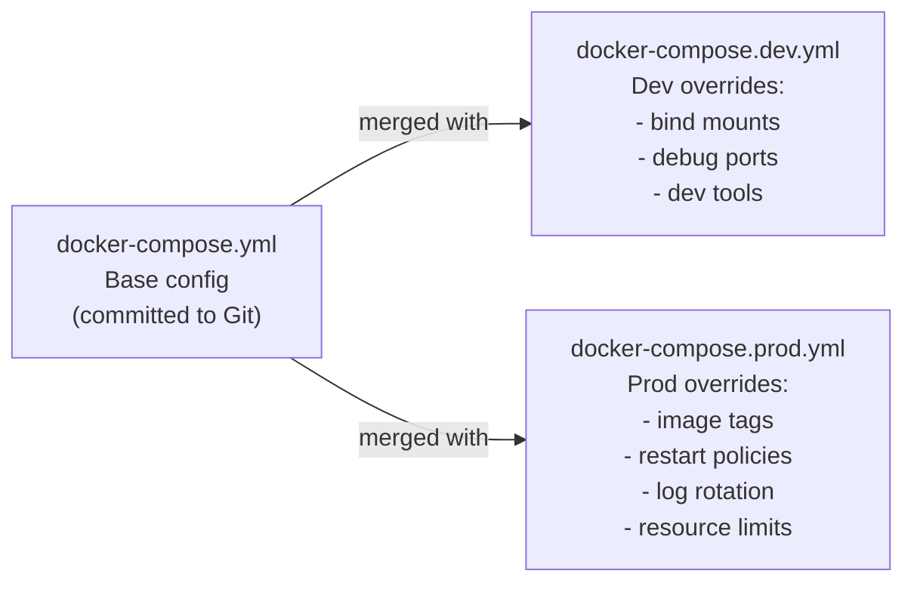

# Production vs Development: What Changes

Docker Compose ကို production မှာ run တာက Development နဲ့ ယှဉ်ရင် အခြေခံအားဖြင့် စဉ်းစားပုံ လုံးဝကွာသွားပါပြီ။ ဦးစားပေးရမယ့် အချက်တွေက ဒီလိုပြောင်းလဲသွားပါတယ် -

| Concern | Development | Production |
|---------|------------|------------|
| **Code** | Bind mount (live reload) | Baked into immutable image |
| **Secrets** | `.env.local` file | CI/CD injection, Docker Secrets, Vault |
| **Image** | Build locally from source | Pull from container registry |
| **Ports** | Expose everything for debugging | Expose only port 80/443; bind rest to 127.0.0.1 |
| **Logging** | Default stdout | JSON with rotation + external aggregation |
| **Restart** | Optional | `unless-stopped` — always |
| **Resources** | Unconstrained | CPU/memory limits defined |
| **Rollback** | Re-run compose | Pull old image tag, restart |
| **Zero downtime** | Not needed | Manual: replace with brief interruption |

---

## The Override File Pattern

Compose file တွေကို သီးသန့်စီ သီးခြားခွဲပြီး ဘယ်တော့မှ မထိန်းသိမ်းပါနဲ့။ Environment တစ်ခုချင်းစီအတွက် **override files** တွေနဲ့ တွဲသုံးဖို့ **base file** တစ်ခုတည်းကိုပဲ သုံးပါ -



`docker compose -f docker-compose.yml -f docker-compose.prod.yml up` ဆိုပြီး run လိုက်တဲ့အခါ ဖိုင်တွေက **deep merged** ဖြစ်သွားပါတယ်။ ဆိုလိုတာက conflict ဖြစ်တဲ့အခါ override file ထဲက တန်ဖိုးတွေက နိုင်သွားပြီး၊ conflict မဖြစ်တဲ့ key တွေကတော့ ဖိုင်နှစ်ခုလုံးကနေ ဆက်လက်ပါလာမှာ ဖြစ်ပါတယ်။

---

## The Base `docker-compose.yml` (Shared)

```yaml
# docker-compose.yml — committed to Git — no secrets, no env-specific settings
services:
  db:
    image: postgres:16-alpine
    environment:
      POSTGRES_USER: ${POSTGRES_USER}
      POSTGRES_PASSWORD: ${POSTGRES_PASSWORD}
      POSTGRES_DB: ${POSTGRES_DB}
    volumes:
      - postgres-data:/var/lib/postgresql/data
    networks:
      - backend
    restart: unless-stopped
    healthcheck:
      test: ["CMD-SHELL", "pg_isready -U ${POSTGRES_USER} -d ${POSTGRES_DB}"]
      interval: 5s
      timeout: 5s
      retries: 10
      start_period: 15s

  cache:
    image: redis:7-alpine
    command: redis-server --requirepass ${REDIS_PASSWORD} --loglevel warning
    volumes:
      - redis-data:/data
    networks:
      - backend
    restart: unless-stopped
    healthcheck:
      test: ["CMD", "redis-cli", "-a", "${REDIS_PASSWORD}", "ping"]
      interval: 5s
      timeout: 3s
      retries: 5

  migrate:
    build: { context: ., target: builder }
    command: ["npx", "prisma", "migrate", "deploy"]
    environment:
      DATABASE_URL: "postgres://${POSTGRES_USER}:${POSTGRES_PASSWORD}@db:5432/${POSTGRES_DB}"
    depends_on:
      db:
        condition: service_healthy
    networks:
      - backend
    restart: "no"

  api:
    environment:
      DATABASE_URL: "postgres://${POSTGRES_USER}:${POSTGRES_PASSWORD}@db:5432/${POSTGRES_DB}"
      REDIS_URL: "redis://:${REDIS_PASSWORD}@cache:6379"
    depends_on:
      migrate:
        condition: service_completed_successfully
      cache:
        condition: service_healthy
    networks:
      - backend
    restart: unless-stopped

  nginx:
    image: nginx:alpine
    ports:
      - "80:80"
    volumes:
      - ./nginx/default.conf:/etc/nginx/conf.d/default.conf:ro
    depends_on:
      api:
        condition: service_healthy
    networks:
      - backend
    restart: unless-stopped

networks:
  backend:
    driver: bridge

volumes:
  postgres-data:
  redis-data:
```

---

## The Development Override

```yaml
# docker-compose.dev.yml — local developer machines only
services:
  api:
    build:
      context: .
      target: builder          # Dev stage — includes nodemon, dev tools
    command: ["npm", "run", "dev"]
    ports:
      - "3000:3000"            # Direct API access for debugging
    volumes:
      - ./src:/app/src         # Hot reload
      - ./public:/app/public
    environment:
      NODE_ENV: development
      LOG_LEVEL: debug

  db:
    ports:
      - "127.0.0.1:5432:5432"  # DB GUI access from host

  cache:
    ports:
      - "127.0.0.1:6379:6379"  # Redis CLI/Insight access from host

  adminer:
    image: adminer:4
    ports:
      - "127.0.0.1:8080:8080"
    networks:
      - backend
    profiles: ["tools"]        # Only with: --profile tools
```

```bash
# Development workflow
docker compose \
  -f docker-compose.yml \
  -f docker-compose.dev.yml \
  --env-file .env \
  --env-file .env.local \
  up -d

# With dev tools
docker compose \
  -f docker-compose.yml \
  -f docker-compose.dev.yml \
  --profile tools up -d
```

---

## The Production Override

```yaml
# docker-compose.prod.yml — production servers
services:
  api:
    # Pull pre-built, tested image from registry instead of building from source
    image: "ghcr.io/${GITHUB_REPOSITORY}:${IMAGE_TAG}"
    build: null              # Override build: null to prevent accidental local builds
    ports:
      - "127.0.0.1:3000:3000"   # Local only — nginx proxies from port 80
    environment:
      NODE_ENV: production
      LOG_LEVEL: warn
    deploy:
      resources:
        limits:
          cpus: "0.5"
          memory: "512M"
        reservations:
          cpus: "0.1"
          memory: "128M"
    logging:
      driver: json-file
      options:
        max-size: "10m"
        max-file: "5"
        tag: "{{.Name}}/{{.ID}}"

  db:
    deploy:
      resources:
        limits:
          cpus: "1.0"
          memory: "1G"
    logging:
      driver: json-file
      options:
        max-size: "10m"
        max-file: "3"

  cache:
    deploy:
      resources:
        limits:
          cpus: "0.25"
          memory: "300M"
    logging:
      driver: json-file
      options:
        max-size: "5m"
        max-file: "3"

  nginx:
    ports:
      - "80:80"
      - "443:443"            # Add TLS in production
    volumes:
      - ./nginx/default.conf:/etc/nginx/conf.d/default.conf:ro
      - ./certbot/certs:/etc/letsencrypt:ro     # TLS certificates
      - ./certbot/www:/var/www/certbot:ro       # ACME challenge
    logging:
      driver: json-file
      options:
        max-size: "10m"
        max-file: "3"
```

---

## HTTPS with Certbot + Nginx

Production stack ထဲကို Free TLS certificates ထည့်သွင်းရန် -

```yaml
# Add to docker-compose.prod.yml
services:
  certbot:
    image: certbot/certbot
    volumes:
      - ./certbot/certs:/etc/letsencrypt
      - ./certbot/www:/var/www/certbot
    profiles: ["certbot"]    # Only run manually
```

```bash
# First-time certificate issuance (run manually on server)
docker compose -f docker-compose.yml -f docker-compose.prod.yml \
  --profile certbot run --rm certbot certonly \
  --webroot -w /var/www/certbot \
  -d yourdomain.com -d www.yourdomain.com \
  --email you@example.com \
  --agree-tos --non-interactive

# Auto-renew via cron (add to server's crontab)
0 3 * * * docker compose --env-file /home/deploy/.env.production \
  -f /home/deploy/myapp/docker-compose.yml \
  -f /home/deploy/myapp/docker-compose.prod.yml \
  --profile certbot run --rm certbot renew --quiet && \
  docker compose exec nginx nginx -s reload
```

```nginx
# nginx/default.conf — production config with HTTPS
server {
    listen 80;
    server_name yourdomain.com www.yourdomain.com;

    # ACME challenge for cert renewal
    location /.well-known/acme-challenge/ {
        root /var/www/certbot;
    }

    # Redirect all HTTP to HTTPS
    location / {
        return 301 https://$host$request_uri;
    }
}

server {
    listen 443 ssl http2;
    server_name yourdomain.com www.yourdomain.com;

    ssl_certificate     /etc/letsencrypt/live/yourdomain.com/fullchain.pem;
    ssl_certificate_key /etc/letsencrypt/live/yourdomain.com/privkey.pem;

    # Modern SSL settings
    ssl_protocols TLSv1.2 TLSv1.3;
    ssl_ciphers ECDHE-ECDSA-AES128-GCM-SHA256:ECDHE-RSA-AES128-GCM-SHA256:...;
    ssl_prefer_server_ciphers off;
    ssl_session_timeout 1d;
    ssl_session_cache shared:SSL:10m;

    # HSTS
    add_header Strict-Transport-Security "max-age=63072000; includeSubDomains; preload";

    location / {
        proxy_pass http://api:3000;
        proxy_set_header Host $host;
        proxy_set_header X-Real-IP $remote_addr;
        proxy_set_header X-Forwarded-For $proxy_add_x_forwarded_for;
        proxy_set_header X-Forwarded-Proto $scheme;
    }
}
```

---

## Full CI/CD Deployment Pipeline

### GitHub Actions: Build → Push → Deploy

```yaml
# .github/workflows/deploy.yml
name: Build and Deploy

on:
  push:
    branches: [main]

env:
  REGISTRY: ghcr.io
  IMAGE_NAME: ${{ github.repository }}

jobs:
  # ── Job 1: Build and push Docker image ──────────────────────────────
  build:
    runs-on: ubuntu-latest
    outputs:
      image-tag: ${{ steps.meta.outputs.version }}
    permissions:
      contents: read
      packages: write

    steps:
      - uses: actions/checkout@v4

      - name: Set up Docker Buildx
        uses: docker/setup-buildx-action@v3

      - name: Login to GitHub Container Registry
        uses: docker/login-action@v3
        with:
          registry: ${{ env.REGISTRY }}
          username: ${{ github.actor }}
          password: ${{ secrets.GITHUB_TOKEN }}

      - name: Extract metadata
        id: meta
        uses: docker/metadata-action@v5
        with:
          images: ${{ env.REGISTRY }}/${{ env.IMAGE_NAME }}
          tags: |
            type=sha,prefix=,format=short  # e.g., abc1234
            type=raw,value=latest,enable={{is_default_branch}}

      - name: Build and push
        uses: docker/build-push-action@v5
        with:
          context: .
          target: runner          # Only build the production stage
          push: true
          tags: ${{ steps.meta.outputs.tags }}
          labels: ${{ steps.meta.outputs.labels }}
          # Cache layers in GitHub Actions for faster builds
          cache-from: type=gha
          cache-to: type=gha,mode=max

  # ── Job 2: Deploy to server ──────────────────────────────────────────
  deploy:
    needs: build
    runs-on: ubuntu-latest
    environment: production      # Requires manual approval if configured

    steps:
      - uses: actions/checkout@v4

      - name: Copy compose files to server
        uses: appleboy/scp-action@master
        with:
          host: ${{ secrets.SERVER_HOST }}
          username: ${{ secrets.SERVER_USER }}
          key: ${{ secrets.SSH_PRIVATE_KEY }}
          source: "docker-compose.yml,docker-compose.prod.yml,nginx/"
          target: "/home/deploy/myapp"

      - name: Deploy
        uses: appleboy/ssh-action@master
        with:
          host: ${{ secrets.SERVER_HOST }}
          username: ${{ secrets.SERVER_USER }}
          key: ${{ secrets.SSH_PRIVATE_KEY }}
          script: |
            set -e  # Exit immediately on any error

            # Write the env file from GitHub Secrets
            cat > /home/deploy/.env.production << EOF
            NODE_ENV=production
            POSTGRES_USER=appuser
            POSTGRES_PASSWORD=${{ secrets.POSTGRES_PASSWORD }}
            POSTGRES_DB=myapp
            REDIS_PASSWORD=${{ secrets.REDIS_PASSWORD }}
            GITHUB_REPOSITORY=${{ github.repository }}
            IMAGE_TAG=${{ needs.build.outputs.image-tag }}
            EOF
            chmod 600 /home/deploy/.env.production

            cd /home/deploy/myapp

            # Login to registry from server
            echo "${{ secrets.GITHUB_TOKEN }}" | \
              docker login ghcr.io -u ${{ github.actor }} --password-stdin

            # Pull new image
            docker compose \
              --env-file /home/deploy/.env.production \
              -f docker-compose.yml \
              -f docker-compose.prod.yml \
              pull api

            # Restart with new image (brief downtime)
            docker compose \
              --env-file /home/deploy/.env.production \
              -f docker-compose.yml \
              -f docker-compose.prod.yml \
              up -d

            # Verify deployment
            sleep 10
            curl -f http://localhost/api/health || exit 1

            echo "✅ Deployment successful: ${{ needs.build.outputs.image-tag }}"
```

---

## Minimizing Downtime During Updates

Docker Compose မှာ built-in zero-downtime rolling updates လုပ်ပေးတဲ့ စနစ် မပါပါဘူး။ ဒါပေမဲ့ ဒီနည်းလမ်းတွေသုံးပြီး downtime ကို အတတ်နိုင်ဆုံး လျှော့ချလို့ရပါတယ် -

### Strategy 1: Pre-pull then restart (30-60s downtime)

```bash
# Pre-pull the new image while old version is still running
docker compose --env-file .env.production \
  -f docker-compose.yml -f docker-compose.prod.yml \
  pull api

# Restart only the api service (DB and cache keep running — no data interruption)
docker compose --env-file .env.production \
  -f docker-compose.yml -f docker-compose.prod.yml \
  up -d --no-deps api

# Brief downtime: only the time for the container to start and pass health check (~10-20s)
```

### Strategy 2: Blue/Green with Nginx (True Zero Downtime)

```bash
# Run two stacks: "blue" (current) and "green" (new)
# Step 1: Start the green stack on a different port
IMAGE_TAG=v2.0.0 docker compose \
  -p myapp-green \
  -f docker-compose.yml -f docker-compose.prod.yml \
  up -d api

# Step 2: Wait for green to be healthy
docker compose -p myapp-green exec api wget -qO- http://localhost:3000/health

# Step 3: Switch nginx upstream to green
# (Update nginx.conf to point to green API service, reload)
docker compose -p myapp-green exec nginx nginx -s reload

# Step 4: Tear down blue
docker compose -p myapp-blue down

# True zero downtime — users never see an error
```

---

## Server Setup: First-Time Deployment

```bash
# === On the server (run once) ===

# Install Docker
curl -fsSL https://get.docker.com | sh
usermod -aG docker $USER   # Allow running docker without sudo (re-login)

# Create deploy directory
mkdir -p /home/deploy/myapp/nginx
mkdir -p /home/deploy/certbot/{certs,www}

# Clone or upload compose files
git clone https://github.com/yourorg/myapp.git /home/deploy/myapp --depth=1
# (Or use CI/CD scp — see pipeline above)

# Create the env file
cat > /home/deploy/.env.production << 'EOF'
# Fill in real values
POSTGRES_USER=appuser
POSTGRES_PASSWORD=CHANGEME
POSTGRES_DB=myapp
REDIS_PASSWORD=CHANGEME
IMAGE_TAG=latest
EOF
chmod 600 /home/deploy/.env.production

# Log into the container registry
echo $GITHUB_PAT | docker login ghcr.io -u YOUR_GITHUB_USER --password-stdin

# First deployment (builds network, volumes, and pulls images)
cd /home/deploy/myapp
docker compose \
  --env-file /home/deploy/.env.production \
  -f docker-compose.yml \
  -f docker-compose.prod.yml \
  up -d

# Verify everything is running
docker compose ps
curl http://localhost/api/health
```

---

## Production Operations Runbook

```bash
# === Daily operations ===

# View running containers and health
docker compose ps

# Tail logs for all services
docker compose logs -f --tail=100

# Tail logs for one service
docker compose logs -f api --tail=50

# Check resource usage
docker stats --format "table {{.Name}}\t{{.CPUPerc}}\t{{.MemUsage}}\t{{.NetIO}}"

# === Maintenance ===

# Rolling restart of api (if it's wedged/deadlocked)
docker compose restart api

# Update only one service (without restarting db/cache)
docker compose up -d --no-deps api

# Force recreation (use if container config changed)
docker compose up -d --force-recreate --no-deps api

# Clean up unused images (free disk space)
docker image prune -f

# === Backup PostgreSQL ===
docker compose exec db pg_dump \
  -U ${POSTGRES_USER} ${POSTGRES_DB} \
  --format=custom \
  > /backup/myapp-$(date +%Y%m%d-%H%M%S).dump

# === Restore PostgreSQL ===
docker compose exec -T db pg_restore \
  -U ${POSTGRES_USER} -d ${POSTGRES_DB} \
  --clean < /backup/myapp-20260818.dump

# === Roll back to previous image ===
IMAGE_TAG=v1.4.0 docker compose \
  --env-file .env.production \
  -f docker-compose.yml \
  -f docker-compose.prod.yml \
  up -d api
```

---

## When to Graduate from Compose to Kubernetes

Single server တစ်ခုပေါ်မှာ run တဲ့ Docker Compose ဟာ workload တွေအများကြီးအတွက် production မှာ သုံးလို့ကောင်းပါတယ်။ ဘယ်လိုအချိန်တွေမှာပြောင်းသင့်လဲဆိုတာ ဆုံးဖြတ်ဖို့ -

| Signal | Stick with Compose | Consider K8s/K3s |
|--------|-------------------|-----------------|
| **Servers** | 1 server | 2+ servers needed |
| **Traffic** | < 10k req/min | > 10k req/min, variable |
| **Scaling** | Manual `--scale` | Auto-scaling on CPU/memory |
| **Downtime tolerance** | 10-30s acceptable | Zero-downtime required |
| **Team size** | 1-5 engineers | 5+ engineers, multiple teams |
| **Monthly budget** | $5-50 VPS | $100+ for a small cluster |
| **Uptime SLA** | 99.9% (8.7h/year) | 99.99% (< 1h/year) |

---

## Summary

Production မှာ Docker Compose ကို deploy လုပ်ဖို့အတွက် အောက်ပါအချက်တွေ လိုအပ်ပါတယ် -
- Environment သီးသန့် config တွေအတွက် **override files** (`docker-compose.prod.yml`) ကိုသုံးပါ — Base file ကို ဘယ်တော့မှ ထပ်မရေးပါနဲ့။
- Container registry ကနေ **Pre-built images** တွေပဲ pull လုပ်ပါ — Production server ပေါ်မှာ ဘယ်တော့မှ `build:` မလုပ်ပါနဲ့။
- Git ထဲကို ဘယ်တော့မှ တိုက်ရိုက်မတင်ဘဲ **CI/CD ကနေ Secrets တွေကို inject လုပ်ပါ**။
- Disk ပြည့်တာတွေ မဖြစ်အောင် `json-file` driver နဲ့ **Log rotation** လုပ်ပါ။
- Noisy-neighbor ပြဿနာကို ရှောင်ရှားဖို့ **Resource limits** (CPU နဲ့ memory caps) သတ်မှတ်ပါ။
- **HTTPS with Certbot** သုံးပြီး free, automatic TLS certificates တွေ တပ်ဆင်ပါ။
- **Full GitHub Actions pipeline** ကို အသုံးပြုပါ — Build လုပ်မယ်၊ GHCR ကို push မယ်၊ Server ပေါ် deploy မယ်၊ Health check စစ်မယ်။
- Cron job တစ်ခုအနေနဲ့ **PostgreSQL backup** လုပ်ထားပါ — သင့်ရဲ့ data တွေကို Docker တစ်ခုတည်းက ကာကွယ်ပေးမှာ မဟုတ်ပါဘူး။

ဂုဏ်ယူပါတယ် — Docker Compose course ကို အောင်မြင်စွာ ပြီးဆုံးသွားပါပြီ။ အခုဆိုရင် Server များစွာပေါ်မှာ Container တွေကို automatic self-healing နဲ့ zero-downtime deployments လုပ်ဆောင်နိုင်ဖို့ Kubernetes Basics course ဆက်တက်ဖို့ အဆင်သင့် ဖြစ်နေပါပြီ။