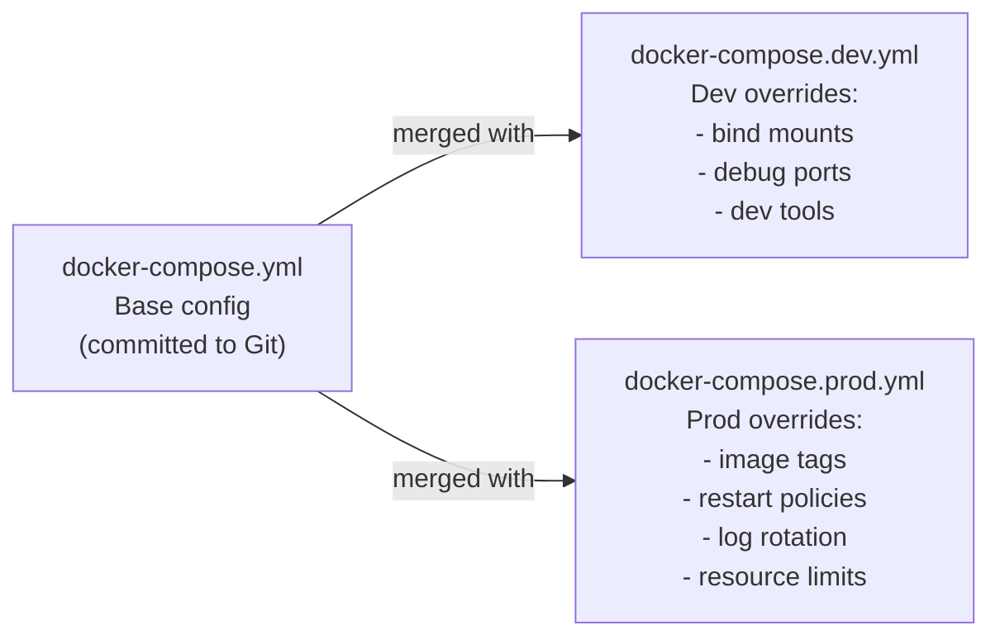

# Production နှင့် Development: ဘာတွေပြောင်းလဲသွားသလဲ

Production ပတ်ဝန်းကျင်တွင် Docker Compose ကို အသုံးပြုခြင်းသည် Development နှင့် လုံးဝခြားနားသော စဉ်းစားပုံစံ လိုအပ်ပါသည်။ ဦးစားပေးမှုများ ပြောင်းလဲသွားပုံမှာ အောက်ပါအတိုင်း ဖြစ်သည်-

| အချက် | Development | Production |
|---------|------------|------------|
| **Code** | Bind mount (live reload) | ပြုပြင်၍မရသော (immutable) image ထဲသို့ တိုက်ရိုက်ထည့်သွင်းခြင်း |
| **Secrets** | `.env.local` ဖိုင် | CI/CD မှ ထည့်သွင်းခြင်း၊ Docker Secrets၊ Vault |
| **Image** | source ကုဒ်မှ ဒေသတွင်း၌ တည်ဆောက်ခြင်း (Build) | container registry မှ ဆွဲယူခြင်း (Pull) |
| **Ports** | ပုံမှန်ရှာဖွေပြင်ဆင်ရန် (Debugging) အားလုံးဖွင့်ထားခြင်း | port 80/443 ကိုသာ ဖွင့်ပြီး ကျန်သည်များကို 127.0.0.1 သို့ ချိတ်ဆက်ခြင်း |
| **Logging** | မူလ stdout | JSON နှင့် rotation + ပြင်ပ စုစည်းမှုစနစ် |
| **Restart** | ရွေးချယ်စရာ | `unless-stopped` — အမြဲတမ်း |
| **Resources** | ကန့်သတ်ချက်မရှိ | CPU/memory ကန့်သတ်ချက်များ သတ်မှတ်ထားခြင်း |
| **Rollback** | compose ကို ပြန်လည်လုပ်ဆောင်ခြင်း | ပုံစံဟောင်း image tag ကို ဆွဲယူပြီး ပြန်လည်စတင်ခြင်း |
| **Zero downtime** | မလိုအပ်ပါ | လက်ဖြင့်လုပ်ဆောင်ခြင်း: ခဏတာရပ်တန့်၍ အစားထိုးခြင်း |

---

## Override File ပုံစံ (Pattern)

Compose ဖိုင်များကို သီးခြားစီ သင့်မြဲသိမ်းဆည်းထားခြင်း မပြုလုပ်ပါနှင့်။ ပတ်ဝန်းကျင်အလိုက် **override ဖိုင်များ** ပါရှိသော **အခြေခံဖိုင် (base file)** တစ်ခုတည်းကိုသာ အသုံးပြုပါ-



သင်သည် `docker compose -f docker-compose.yml -f docker-compose.prod.yml up` ကို လုပ်ဆောင်သည့်အခါ ဖိုင်များကို **deep merged** (အသေးစိတ် ပေါင်းစပ်) လုပ်ပေးပါသည်။ ဆိုလိုသည်မှာ ကွဲလွဲမှုများရှိလာပါက override ဖိုင်ရှိ တန်ဖိုးများက အနိုင်ယူမည်ဖြစ်ပြီး၊ မကွဲလွဲသော သော့ချက်များမှာမူ ဖိုင်နှစ်ခုလုံးမှ ဆက်လက်ပါရှိနေမည် ဖြစ်သည်။

---

## အခြေခံ `docker-compose.yml` (မျှဝေသုံးစွဲရန်)

```yaml
# docker-compose.yml — committed to Git — no secrets, no env-specific settings
services:
  db:
    image: postgres:16-alpine
    environment:
      POSTGRES_USER: ${POSTGRES_USER}
      POSTGRES_PASSWORD: ${POSTGRES_PASSWORD}
      POSTGRES_DB: ${POSTGRES_DB}
    volumes:
      - postgres-data:/var/lib/postgresql/data
    networks:
      - backend
    restart: unless-stopped
    healthcheck:
      test: ["CMD-SHELL", "pg_isready -U ${POSTGRES_USER} -d ${POSTGRES_DB}"]
      interval: 5s
      timeout: 5s
      retries: 10
      start_period: 15s

  cache:
    image: redis:7-alpine
    command: redis-server --requirepass ${REDIS_PASSWORD} --loglevel warning
    volumes:
      - redis-data:/data
    networks:
      - backend
    restart: unless-stopped
    healthcheck:
      test: ["CMD", "redis-cli", "-a", "${REDIS_PASSWORD}", "ping"]
      interval: 5s
      timeout: 3s
      retries: 5

  migrate:
    build: { context: ., target: builder }
    command: ["npx", "prisma", "migrate", "deploy"]
    environment:
      DATABASE_URL: "postgres://${POSTGRES_USER}:${POSTGRES_PASSWORD}@db:5432/${POSTGRES_DB}"
    depends_on:
      db:
        condition: service_healthy
    networks:
      - backend
    restart: "no"

  api:
    environment:
      DATABASE_URL: "postgres://${POSTGRES_USER}:${POSTGRES_PASSWORD}@db:5432/${POSTGRES_DB}"
      REDIS_URL: "redis://:${REDIS_PASSWORD}@cache:6379"
    depends_on:
      migrate:
        condition: service_completed_successfully
      cache:
        condition: service_healthy
    networks:
      - backend
    restart: unless-stopped

  nginx:
    image: nginx:alpine
    ports:
      - "80:80"
    volumes:
      - ./nginx/default.conf:/etc/nginx/conf.d/default.conf:ro
    depends_on:
      api:
        condition: service_healthy
    networks:
      - backend
    restart: unless-stopped

networks:
  backend:
    driver: bridge

volumes:
  postgres-data:
  redis-data:
```

---

## Development Override ဖိုင်

```yaml
# docker-compose.dev.yml — local developer machines only
services:
  api:
    build:
      context: .
      target: builder          # Dev stage — includes nodemon, dev tools
    command: ["npm", "run", "dev"]
    ports:
      - "3000:3000"            # Direct API access for debugging
    volumes:
      - ./src:/app/src         # Hot reload
      - ./public:/app/public
    environment:
      NODE_ENV: development
      LOG_LEVEL: debug

  db:
    ports:
      - "127.0.0.1:5432:5432"  # DB GUI access from host

  cache:
    ports:
      - "127.0.0.1:6379:6379"  # Redis CLI/Insight access from host

  adminer:
    image: adminer:4
    ports:
      - "127.0.0.1:8080:8080"
    networks:
      - backend
    profiles: ["tools"]        # Only with: --profile tools
```

```bash
# Development workflow
docker compose \
  -f docker-compose.yml \
  -f docker-compose.dev.yml \
  --env-file .env \
  --env-file .env.local \
  up -d

# With dev tools
docker compose \
  -f docker-compose.yml \
  -f docker-compose.dev.yml \
  --profile tools up -d
```

---

## Production Override ဖိုင်

```yaml
# docker-compose.prod.yml — production servers
services:
  api:
    # Pull pre-built, tested image from registry instead of building from source
    image: "ghcr.io/${GITHUB_REPOSITORY}:${IMAGE_TAG}"
    build: null              # Override build: null to prevent accidental local builds
    ports:
      - "127.0.0.1:3000:3000"   # Local only — nginx proxies from port 80
    environment:
      NODE_ENV: production
      LOG_LEVEL: warn
    deploy:
      resources:
        limits:
          cpus: "0.5"
          memory: "512M"
        reservations:
          cpus: "0.1"
          memory: "128M"
    logging:
      driver: json-file
      options:
        max-size: "10m"
        max-file: "5"
        tag: "{{.Name}}/{{.ID}}"

  db:
    deploy:
      resources:
        limits:
          cpus: "1.0"
          memory: "1G"
    logging:
      driver: json-file
      options:
        max-size: "10m"
        max-file: "3"

  cache:
    deploy:
      resources:
        limits:
          cpus: "0.25"
          memory: "300M"
    logging:
      driver: json-file
      options:
        max-size: "5m"
        max-file: "3"

  nginx:
    ports:
      - "80:80"
      - "443:443"            # Add TLS in production
    volumes:
      - ./nginx/default.conf:/etc/nginx/conf.d/default.conf:ro
      - ./certbot/certs:/etc/letsencrypt:ro     # TLS certificates
      - ./certbot/www:/var/www/certbot:ro       # ACME challenge
    logging:
      driver: json-file
      options:
        max-size: "10m"
        max-file: "3"
```

---

## Certbot + Nginx ဖြင့် HTTPS အသုံးပြုခြင်း

သင်၏ Production Stack တွင် အခမဲ့ TLS လက်မှတ်များ (certificates) ထည့်သွင်းပါ-

```yaml
# Add to docker-compose.prod.yml
services:
  certbot:
    image: certbot/certbot
    volumes:
      - ./certbot/certs:/etc/letsencrypt
      - ./certbot/www:/var/www/certbot
    profiles: ["certbot"]    # Only run manually
```

```bash
# First-time certificate issuance (run manually on server)
docker compose -f docker-compose.yml -f docker-compose.prod.yml \
  --profile certbot run --rm certbot certonly \
  --webroot -w /var/www/certbot \
  -d yourdomain.com -d www.yourdomain.com \
  --email you@example.com \
  --agree-tos --non-interactive

# Auto-renew via cron (add to server's crontab)
0 3 * * * docker compose --env-file /home/deploy/.env.production \
  -f /home/deploy/myapp/docker-compose.yml \
  -f /home/deploy/myapp/docker-compose.prod.yml \
  --profile certbot run --rm certbot renew --quiet && \
  docker compose exec nginx nginx -s reload
```

```nginx
# nginx/default.conf — production config with HTTPS
server {
    listen 80;
    server_name yourdomain.com www.yourdomain.com;

    # ACME challenge for cert renewal
    location /.well-known/acme-challenge/ {
        root /var/www/certbot;
    }

    # Redirect all HTTP to HTTPS
    location / {
        return 301 https://$host$request_uri;
    }
}

server {
    listen 443 ssl http2;
    server_name yourdomain.com www.yourdomain.com;

    ssl_certificate     /etc/letsencrypt/live/yourdomain.com/fullchain.pem;
    ssl_certificate_key /etc/letsencrypt/live/yourdomain.com/privkey.pem;

    # Modern SSL settings
    ssl_protocols TLSv1.2 TLSv1.3;
    ssl_ciphers ECDHE-ECDSA-AES128-GCM-SHA256:ECDHE-RSA-AES128-GCM-SHA256:...;
    ssl_prefer_server_ciphers off;
    ssl_session_timeout 1d;
    ssl_session_cache shared:SSL:10m;

    # HSTS
    add_header Strict-Transport-Security "max-age=63072000; includeSubDomains; preload";

    location / {
        proxy_pass http://api:3000;
        proxy_set_header Host $host;
        proxy_set_header X-Real-IP $remote_addr;
        proxy_set_header X-Forwarded-For $proxy_add_x_forwarded_for;
        proxy_set_header X-Forwarded-Proto $scheme;
    }
}
```

---

## CI/CD Deployment Pipeline အပြည့်အစုံ

### GitHub Actions: Build → Push → Deploy

```yaml
# .github/workflows/deploy.yml
name: Build and Deploy

on:
  push:
    branches: [main]

env:
  REGISTRY: ghcr.io
  IMAGE_NAME: ${{ github.repository }}

jobs:
  # ── Job 1: Build and push Docker image ──────────────────────────────
  build:
    runs-on: ubuntu-latest
    outputs:
      image-tag: ${{ steps.meta.outputs.version }}
    permissions:
      contents: read
      packages: write

    steps:
      - uses: actions/checkout@v4

      - name: Set up Docker Buildx
        uses: docker/setup-buildx-action@v3

      - name: Login to GitHub Container Registry
        uses: docker/login-action@v3
        with:
          registry: ${{ env.REGISTRY }}
          username: ${{ github.actor }}
          password: ${{ secrets.GITHUB_TOKEN }}

      - name: Extract metadata
        id: meta
        uses: docker/metadata-action@v5
        with:
          images: ${{ env.REGISTRY }}/${{ env.IMAGE_NAME }}
          tags: |
            type=sha,prefix=,format=short  # e.g., abc1234
            type=raw,value=latest,enable={{is_default_branch}}

      - name: Build and push
        uses: docker/build-push-action@v5
        with:
          context: .
          target: runner          # Only build the production stage
          push: true
          tags: ${{ steps.meta.outputs.tags }}
          labels: ${{ steps.meta.outputs.labels }}
          # Cache layers in GitHub Actions for faster builds
          cache-from: type=gha
          cache-to: type=gha,mode=max

  # ── Job 2: Deploy to server ──────────────────────────────────────────
  deploy:
    needs: build
    runs-on: ubuntu-latest
    environment: production      # Requires manual approval if configured

    steps:
      - uses: actions/checkout@v4

      - name: Copy compose files to server
        uses: appleboy/scp-action@master
        with:
          host: ${{ secrets.SERVER_HOST }}
          username: ${{ secrets.SERVER_USER }}
          key: ${{ secrets.SSH_PRIVATE_KEY }}
          source: "docker-compose.yml,docker-compose.prod.yml,nginx/"
          target: "/home/deploy/myapp"

      - name: Deploy
        uses: appleboy/ssh-action@master
        with:
          host: ${{ secrets.SERVER_HOST }}
          username: ${{ secrets.SERVER_USER }}
          key: ${{ secrets.SSH_PRIVATE_KEY }}
          script: |
            set -e  # Exit immediately on any error

            # Write the env file from GitHub Secrets
            cat > /home/deploy/.env.production << EOF
            NODE_ENV=production
            POSTGRES_USER=appuser
            POSTGRES_PASSWORD=${{ secrets.POSTGRES_PASSWORD }}
            POSTGRES_DB=myapp
            REDIS_PASSWORD=${{ secrets.REDIS_PASSWORD }}
            GITHUB_REPOSITORY=${{ github.repository }}
            IMAGE_TAG=${{ needs.build.outputs.image-tag }}
            EOF
            chmod 600 /home/deploy/.env.production

            cd /home/deploy/myapp

            # Login to registry from server
            echo "${{ secrets.GITHUB_TOKEN }}" | \
              docker login ghcr.io -u ${{ github.actor }} --password-stdin

            # Pull new image
            docker compose \
              --env-file /home/deploy/.env.production \
              -f docker-compose.yml \
              -f docker-compose.prod.yml \
              pull api

            # Restart with new image (brief downtime)
            docker compose \
              --env-file /home/deploy/.env.production \
              -f docker-compose.yml \
              -f docker-compose.prod.yml \
              up -d

            # Verify deployment
            sleep 10
            curl -f http://localhost/api/health || exit 1

            echo "✅ Deployment successful: ${{ needs.build.outputs.image-tag }}"
```

---

## အပ်ဒိတ်လုပ်နေစဉ်အတွင်း Downtime ကို အနည်းဆုံးဖြစ်အောင် လုပ်ဆောင်ခြင်း

Docker Compose တွင် အလိုအလျောက် zero-downtime rolling updates လုပ်ဆောင်နိုင်သည့် စနစ် မပါရှိပါ။ အောက်ပါ နည်းလမ်းများသည် အဆိုပါ ကွာဟချက်ကို အနည်းဆုံးဖြစ်စေရန် ကူညီပေးသည်-

### နည်းလမ်း ၁: ပထမဦးစွာ ဆွဲယူပြီးမှ ပြန်လည်စတင်ခြင်း (30-60s downtime)

```bash
# Pre-pull the new image while old version is still running
docker compose --env-file .env.production \
  -f docker-compose.yml -f docker-compose.prod.yml \
  pull api

# Restart only the api service (DB and cache keep running — no data interruption)
docker compose --env-file .env.production \
  -f docker-compose.yml -f docker-compose.prod.yml \
  up -d --no-deps api

# Brief downtime: only the time for the container to start and pass health check (~10-20s)
```

### နည်းလမ်း ၂: Nginx ဖြင့် Blue/Green ပြုလုပ်ခြင်း (True Zero Downtime)

```bash
# Run two stacks: "blue" (current) and "green" (new)
# Step 1: Start the green stack on a different port
IMAGE_TAG=v2.0.0 docker compose \
  -p myapp-green \
  -f docker-compose.yml -f docker-compose.prod.yml \
  up -d api

# Step 2: Wait for green to be healthy
docker compose -p myapp-green exec api wget -qO- http://localhost:3000/health

# Step 3: Switch nginx upstream to green
# (Update nginx.conf to point to green API service, reload)
docker compose -p myapp-green exec nginx nginx -s reload

# Step 4: Tear down blue
docker compose -p myapp-blue down

# True zero downtime — users never see an error
```

---

## ဆာဗာ တပ်ဆင်ခြင်း: ပထမဆုံးအကြိမ် Deployment ပြုလုပ်ခြင်း

```bash
# === On the server (run once) ===

# Install Docker
curl -fsSL https://get.docker.com | sh
usermod -aG docker $USER   # Allow running docker without sudo (re-login)

# Create deploy directory
mkdir -p /home/deploy/myapp/nginx
mkdir -p /home/deploy/certbot/{certs,www}

# Clone or upload compose files
git clone https://github.com/yourorg/myapp.git /home/deploy/myapp --depth=1
# (Or use CI/CD scp — see pipeline above)

# Create the env file
cat > /home/deploy/.env.production << 'EOF'
# Fill in real values
POSTGRES_USER=appuser
POSTGRES_PASSWORD=CHANGEME
POSTGRES_DB=myapp
REDIS_PASSWORD=CHANGEME
IMAGE_TAG=latest
EOF
chmod 600 /home/deploy/.env.production

# Log into the container registry
echo $GITHUB_PAT | docker login ghcr.io -u YOUR_GITHUB_USER --password-stdin

# First deployment (builds network, volumes, and pulls images)
cd /home/deploy/myapp
docker compose \
  --env-file /home/deploy/.env.production \
  -f docker-compose.yml \
  -f docker-compose.prod.yml \
  up -d

# Verify everything is running
docker compose ps
curl http://localhost/api/health
```

---

## Production လုပ်ငန်းဆောင်တာများအတွက် လမ်းညွှန် (Runbook)

```bash
# === Daily operations ===

# View running containers and health
docker compose ps

# Tail logs for all services
docker compose logs -f --tail=100

# Tail logs for one service
docker compose logs -f api --tail=50

# Check resource usage
docker stats --format "table {{.Name}}\t{{.CPUPerc}}\t{{.MemUsage}}\t{{.NetIO}}"

# === Maintenance ===

# Rolling restart of api (if it's wedged/deadlocked)
docker compose restart api

# Update only one service (without restarting db/cache)
docker compose up -d --no-deps api

# Force recreation (use if container config changed)
docker compose up -d --force-recreate --no-deps api

# Clean up unused images (free disk space)
docker image prune -f

# === Backup PostgreSQL ===
docker compose exec db pg_dump \
  -U ${POSTGRES_USER} ${POSTGRES_DB} \
  --format=custom \
  > /backup/myapp-$(date +%Y%m%d-%H%M%S).dump

# === Restore PostgreSQL ===
docker compose exec -T db pg_restore \
  -U ${POSTGRES_USER} -d ${POSTGRES_DB} \
  --clean < /backup/myapp-20260818.dump

# === Roll back to previous image ===
IMAGE_TAG=v1.4.0 docker compose \
  --env-file .env.production \
  -f docker-compose.yml \
  -f docker-compose.prod.yml \
  up -d api
```

---

## Compose မှ Kubernetes သို့ မည်သည့်အခါ ပြောင်းရွှေ့သင့်သနည်း

ဆာဗာတစ်ခုတည်းပေါ်ရှိ Docker Compose သည် လုပ်ငန်းဆောင်တာ အများအပြားအတွက် Production တွင် အသုံးပြုရန် သင့်လျော်ပါသည်။ မည်သို့ ဆုံးဖြတ်ရမည်နည်း-

| အချက်ပြမှု | Compose ဖြင့် ဆက်သွားရန် | K8s/K3s ကို စဉ်းစားရန် |
|--------|-------------------|-----------------|
| **Servers** | ဆာဗာ ၁ ခု | ဆာဗာ ၂ ခု သို့မဟုတ် ထို့ထက်ပို၍ လိုအပ်ခြင်း |
| **Traffic** | တစ်မိနစ်လျှင် 10k တောင်းဆိုမှုအောက် | တစ်မိနစ်လျှင် 10k တောင်းဆိုမှုထက် ပိုခြင်း၊ အတက်အကျရှိခြင်း |
| **Scaling** | လက်ဖြင့် `--scale` ပြုလုပ်ခြင်း | CPU/memory အပေါ် မူတည်၍ အလိုအလျောက်ချဲ့ထွင်ခြင်း |
| **Downtime tolerance** | 10-30 စက္ကန့် လက်ခံနိုင်ခြင်း | Zero-downtime လိုအပ်ခြင်း |
| **Team size** | အင်ဂျင်နီယာ ၁-၅ ဦး | အင်ဂျင်နီယာ ၅ ဦးနှင့်အထက်၊ အဖွဲ့များစွာ |
| **Monthly budget** | $5-50 VPS | Cluster ငယ်တစ်ခုအတွက် $100+ |
| **Uptime SLA** | 99.9% (တစ်နှစ်လျှင် 8.7 နာရီ) | 99.99% (တစ်နှစ်လျှင် ၁ နာရီအောက်) |

---

## အကျဉ်းချုပ်

Docker Compose ကို Production တွင် အသုံးပြုရန်အတွက် အောက်ပါတို့ လိုအပ်ပါသည်-
- ပတ်ဝန်းကျင်အလိုက် သီးသန့်ဖွဲ့စည်းပုံအတွက် **Override ဖိုင်များ** (`docker-compose.prod.yml`) - အခြေခံဖိုင်ကို ဘယ်သောအခါမှ မိတ္တူပွားမထားပါနှင့်။
- Container registry မှ **ကြိုတင်တည်ဆောက်ထားသော ပုံများ (Pre-built images)** - Production ဆာဗာပေါ်တွင် `build:` ကို ဘယ်တော့မှ မသုံးပါနှင့်။
- CI/CD မှ **ထည့်သွင်းပေးသော Secrets များ** - Git တွင် ဘယ်တော့မှ တိုက်ရိုက်မတင်ပါနှင့်။
- `json-file` ဒရိုက်ဘာပါရှိသော **Log rotation** - ဒစ်ခ်နေရာပြည့်သွားခြင်းမှ ကာကွယ်ပေးသည်။
- **Resource ကန့်သတ်ချက်များ** - CPU နှင့် memory ကန့်သတ်ချက်များသည် အရင်းအမြစ်လုသည့် ပြဿနာကို တားဆီးပေးသည်။
- **Certbot ဖြင့် HTTPS** - အခမဲ့ဖြစ်ပြီး အလိုအလျောက် လုပ်ဆောင်ပေးသော TLS လက်မှတ်များ။
- **GitHub Actions ပိုက်လိုင်း အပြည့်အစုံ** - တည်ဆောက်ခြင်း၊ GHCR သို့ ပို့ခြင်း၊ ဆာဗာသို့ ပို့ဆောင်ခြင်း၊ ကျန်းမာရေး စစ်ဆေးမှု (health check) ပြုလုပ်ခြင်း။
- Cron လုပ်ငန်းစဉ်တစ်ခုအနေဖြင့် **PostgreSQL မိတ္တူကူးခြင်း (Backup)** - သင်၏ အချက်အလက်များကို Docker တစ်ခုတည်းကသာ ကာကွယ်ပေးနိုင်မည် မဟုတ်ပါ။

ဂုဏ်ယူပါတယ် — သင်သည် Docker Compose သင်တန်းကို အောင်မြင်စွာ ပြီးဆုံးသွားပါပြီ။ ယခုအခါ ဆာဗာများစွာတွင် အလိုအလျောက် ပြင်ဆင်နိုင်စွမ်း (self-healing) နှင့် Zero-downtime deployments များဖြင့် ကွန်တိန်နာများကို စီမံခန့်ခွဲပုံကို သင်ယူနိုင်မည့် Kubernetes Basics သင်တန်းအတွက် အဆင်သင့် ဖြစ်နေပါပြီ။