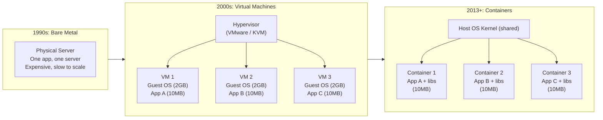

# အခြေခံအဆောက်အအုံ၏ ဆင့်ကဲဖြစ်စဉ် (The Evolution of Infrastructure)

Docker ကို မလေ့လာမီ၊ ၎င်း အဘယ်ကြောင့် ရှိနေရသည် နှင့် ၎င်းဖြေရှင်းပေးသော ပြဿနာကို သင် ဦးစွာနားလည်ရပါမည်။ အပလီကေးရှင်းများ လက်ခံ hosting လုပ်ခြင်း၏ သမိုင်းကြောင်းက ယခင်မျိုးဆက်၏ ချို့ယွင်းချက်များကို မျိုးဆက်သစ်တစ်ခုချင်းစီက မည်သို့ဖြေရှင်းခဲ့ကြသည်ဟူသော ရှင်းလင်းသောဇာတ်လမ်းတစ်ပုဒ်ကို ပြသနေပါသည်။



---

## ခေတ် ၁- ဘဲယားမက်တယ် ခေတ် (၁၉၉၀ ခုနှစ်များ)

အပလီကေးရှင်းတစ်ခုကို ဖြန့်ဝေခြင်း (Deploying) ဆိုသည်မှာ ရုပ်ပိုင်းဆိုင်ရာ ဆာဗာ (Physical Server) တစ်ခု ဝယ်ယူခြင်း — Linux တပ်ဆင်ခြင်း၊ နေရာချိတ်ဆက်မှုများ ပြင်ဆင်ခြင်း၊ လုပ်ဆောင်ချက်ဆိုင်ရာ မှီခိုမှုများ (Java, Node, Python) ကို ထည့်သွင်းခြင်း နှင့် သင့်ကုဒ်များကို ကူးယူခြင်းတို့ကို ဆိုလိုသည်။

**အဓိကပြဿနာ**: ဆာဗာတစ်ခုတည်းပေါ်ရှိ အပလီကေးရှင်းနှစ်ခုသည် များသောအားဖြင့် အချင်းချင်း ပဋိပက္ခဖြစ်တတ်ပါသည်။ App A က Python 2 လိုအပ်ပြီး App B က Python 3 လိုအပ်သည်။ App A က OpenSSL 1.0 လိုအပ်ပြီး App B က OpenSSL 3 လိုအပ်သည်။ ဤအရာကို ဖြေရှင်းရန်ဆိုသည်မှာ **ရုပ်ပိုင်းဆိုင်ရာ ဆာဗာတစ်ခုလျှင် အပလီကေးရှင်းတစ်ခု**နှုန်းဖြင့် လုပ်ဆောင်ရခြင်းဖြစ်သည် — CPU အသုံးပြုမှု ၅% မှ ၁၅% သသာရှိသော ဟာ့ဒ်ဝဲကို အလွန်အကျွံ အချည်းနှီးဖြစ်စေသော အသုံးပြုမှုတစ်ခု ဖြစ်ပါသည်။

---

## ခေတ် ၂- ဗာတွယ်လ်မက်ရှင်များ (၂၀၀၀ ခုနှစ်များ)

Hypervisors (VMware, VirtualBox, KVM, Hyper-V) များသည် ရုပ်ပိုင်းဆိုင်ရာစက်တစ်လုံးကို သီးခြားခွဲထုတ်ထားသော Virtual Machines များစွာအဖြစ် ပိုင်းခြားခြင်းဖြင့် "ဆာဗာတစ်ခုလျှင် အပလီကေးရှင်းတစ်ခု" အချည်းနှီးဖြစ်ရခြင်း ပြဿနာကို ဖြေရှင်းပေးခဲ့ပါသည်။

**အလုပ်လုပ်ပုံ**: Hypervisor သည် ဟာ့ဒ်ဝဲကို အတုယူဖန်တီးပေးသည်။ VM တစ်ခုချင်းစီသည် ၎င်းတို့အစစ်အမှန်ဟု ယုံကြည်ထားသော ရုပ်ပိုင်းဆိုင်ရာစက်တစ်လုံးကို မြင်တွေ့ရသည် — virtual CPU၊ virtual RAM၊ virtual disk တို့ဖြင့် ဖြစ်သည်။ VM တစ်ခုချင်းစီသည် ၎င်းတို့၏ **ကိုယ်ပိုင် အပြည့်အစုံပါရှိသော Guest OS** တစ်ခုကို ထပ်ဆင့်အလုပ်လုပ်ကြသည်။

```
Physical Server: 32 CPU cores, 128 GB RAM
├── VM 1: 4 cores, 16 GB RAM
│   └── Guest OS: Ubuntu 20.04 (2.5 GB)
│       └── App A: 50 MB Node.js API
├── VM 2: 4 cores, 16 GB RAM
│   └── Guest OS: Ubuntu 20.04 (2.5 GB)
│       └── App B: 80 MB Python service
└── VM 3: 4 cores, 16 GB RAM
    └── Guest OS: CentOS 7 (1.8 GB)
        └── App C: 100 MB Java service
```

**VM များက ဖြေရှင်းပေးနိုင်ခဲ့သည်များ**: ရုပ်ပိုင်းဆိုင်ရာစက်တစ်လုံးပေါ်တွင် သုံးစွဲသူအများအပြား အသုံးပြုနိုင်ခြင်း (Multi-tenancy)၊ လုပ်ငန်းလည်ပတ်မှုများအကြား ခိုင်မာသော သီးသန့်ခွဲထုတ်မှု၊ ကွဲပြားခြားနားသော OS များကို ဘေးချင်းယှဉ်တွဲသုံးနိုင်ခြင်း။

**VM များက မဖြေရှင်းပေးနိုင်ခဲ့သည်များ**:
- **စတင်ချိန် (Startup time)**: VM တစ်ခု စတင်ရန် စက္ကန့် ၃၀ မှ ၁၂၀ အထိ ကြာတတ်သည် (၎င်းသည် OS အပြည့်အစုံကို တင်နေရသောကြောင့်ဖြစ်သည်)
- **မှတ်ဉာဏ် အလဟဿဖြစ်မှု (Memory waste)**: 2.5 GB ရှိသော Ubuntu တပ်ဆင်မှုကြီးကို သယ်ဆောင်ထားရသော 10 MB သာရှိသည့် Node.js app တစ်ခုသည် အဓိပ္ပာယ်မရှိလှပါ
- **သိပ်သည်းဆ (Density)**: Guest OS ၏ ဝန်ထုပ်ဝန်ပိုးကြောင့် RAM ကုန်ဆုံးမသွားမီ ဆာဗာတစ်ခုပေါ်တွင် VM ၁၀ ခုခန့်သာ တင်နိုင်မည်ဖြစ်သည်။
- **သယ်ယူပို့ဆောင်နိုင်စွမ်း (Portability)**: hypervisors တစ်ခုမှ တစ်ခုသို့ VM ကို ရွှေ့ပြောင်းခြင်းသည် ခက်ခဲနာကျင်စေသည်; ကလောက်ဒ် ပံ့ပိုးပေးသူ (Cloud providers) များကြား ရွှေ့ပြောင်းခြင်းမှာမူ လက်တွေ့တွင် မဖြစ်နိုင်သလောက်ပင် ဖြစ်သည်။

---

## ခေတ် ၃- ကွန်တိန်နာများ (၂၀၁၃ မှ ယနေ့အထိ)

Docker (၂၀၁၃ ခုနှစ်တွင် စတင်ခဲ့သည်) သည် လုံးဝကွဲပြားခြားနားသော ချဉ်းကပ်မှုပုံစံကို လူကြိုက်များလာစေခဲ့သည်: **ဟာ့ဒ်ဝဲ** ကို virtualize လုပ်မည့်အစား ကွန်တိန်နာများသည် **Operating System** ကို virtualize လုပ်ကြသည်။

**အဓိက ထိုးထွင်းသိမြင်မှု**: ဟော့စ် (Host) တစ်ခုပေါ်ရှိ ကွန်တိန်နာအားလုံးသည် အောက်ခြေအခြေခံကျသော Linux kernel တူညီသည်ကို မျှဝေသုံးစွဲကြသည်။ ၎င်းတို့တွင် ကိုယ်ပိုင် OS မလိုအပ်ပါ — လက်ရှိရှိပြီးသား OS ၏ သီးသန့်ခွဲထုတ်ထားသော အစိတ်အပိုင်းတစ်ခုသာ လိုအပ်သည်။

ဤအရာဖြစ်လာစေရန် Linux သည် kernel အင်္ဂါရပ်နှစ်ခုကို ပံ့ပိုးပေးထားသည်:

- **Namespaces**: လုပ်ငန်းစဉ်တစ်ခုက *ဘာတွေမြင်နိုင်လဲ* ဆိုတာကို သီးသန့်ခွဲထုတ်ပေးသည် — ၎င်း၏ ကိုယ်ပိုင် PID namespace (အခြားလုပ်ငန်းစဉ်များကို မမြင်နိုင်ရန်)၊ network namespace (၎င်း၏ ကိုယ်ပိုင် network stack)၊ mount namespace (၎င်း၏ ကိုယ်ပိုင် ဖိုင်စနစ်အမြင်)၊ user namespace (၎င်း၏ ကိုယ်ပိုင် UIDs)
- **cgroups** (Control Groups): လုပ်ငန်းစဉ်တစ်ခုက *ဘာတွေအသုံးပြုနိုင်လဲ* ဆိုတာကို ကန့်သတ်ပေးသည် — CPU အချိန်၊ မမ်မိုရီ၊ I/O bandwidth

```
Physical Server: 32 CPU cores, 128 GB RAM
├── Container 1: App A (50 MB Node.js binary + Alpine base = 60 MB total)
├── Container 2: App B (80 MB Python + deps = 120 MB total)
├── Container 3: App C (100 MB Java JAR + JRE = 200 MB total)
└── Host OS Kernel: shared by all containers (not duplicated)

Total memory for 3 apps: ~380 MB  ← vs 7.5 GB for 3 VMs
```

---

## ဘေးချင်းယှဉ် နှိုင်းချက် (Side-by-Side Comparison)

| | Bare Metal | Virtual Machine | Container |
|--|-----------|----------------|-----------|
| **သီးသန့်ခွဲထုတ်မှု (Isolation)** | မရှိပါ | ဟာ့ဒ်ဝဲ အတုယူဖန်တီးမှု အပြည့်အစုံ | OS အဆင့်ရှိ namespaces များ |
| **စတင်ချိန် (Startup time)** | မိနစ်ပိုင်း (လက်ဖြင့်) | စက္ကန့် ၃၀ မှ ၁၂၀ | ၁ စက္ကန့်အောက် |
| **Image ပမာဏ** | N/A | ၁ မှ ၁၀ GB | ၅ မှ ၅၀၀ MB |
| **Memory ဝန်ထုပ်ဝန်ပိုး** | မရှိပါ | Guest OS တစ်ခုလျှင် ၁ မှ ၂ GB | သုညနီးပါး |
| **သိပ်သည်းဆ (Density)** | အပလီကေးရှင်း ၁ ခု/ဆာဗာ | VM ၅ မှ ၂၀/ဆာဗာ | ကွန်တိန်နာ ၅၀ မှ ၅၀၀/ဆာဗာ |
| **သယ်ယူပို့ဆောင်နိုင်စွမ်း** | မရှိပါ | ကန့်သတ်ထားသည် (hypervisor-သီးသန့်) | မည်သည့်နေရာတွင်မဆို အတူတူ လည်ပတ်နိုင်သည် |
| **စတင်အလုပ်လုပ်နိုင်သည့် အမြန်နှုန်း** | ပတ်သီးပေါင်းများစွာ (ဟာ့ဒ်ဝဲဝယ်ယူရခြင်း) | မိနစ်ပိုင်း | မီလီစက္ကန့်ပိုင်း |

---

## "ကျွန်တော့်စက်ပေါ်မှာတော့ အလုပ်လုပ်တယ်" ပြဿနာ — ဖြေရှင်းပြီး

ဤသည်မှာ Docker ၏ နာမည်အကြီးဆုံး တန်ဖိုးသတ်မှတ်ချက် ဖြစ်သည်။ ကွန်တိန်နာများ မပေါ်မီက ဤစကားစမြောပြောဆိုမှုသည် အမြဲတမ်းလိုလို ဖြစ်ပွားခဲ့သည်:

```
Developer:  "I tested it locally, it works!"
Ops:        "It's crashing in production."
Developer:  "But it works on my machine!"
Ops:        "Your machine has Node 18 and libssl 3.0.
             Production server has Node 16 and libssl 1.0.
             Of course it doesn't work."
```

Docker ကွန်တိန်နာတစ်ခုတွင် **သင့်ကုဒ်တင်မကဘဲ**၊ တိကျသော runtime (Node 18.x)၊ တိကျသော စာကြည့်တိုက်များ (libssl 3.0)၊ တိကျသော configuration ဖိုင်များ — အပလီကေးရှင်းတစ်ခု လည်ပတ်ရန် လိုအပ်သမျှ အားလုံးပါဝင်ပါသည်။ ကွန်တိန်နာသည် "စက်" တစ်ခု ဖြစ်လာသည်။ အကယ်၍ ၎င်းသည် သင့်လက်ပ်တော့ပ်ပေါ်ရှိ ကွန်တိန်နာတစ်ခုအတွင်း အလုပ်လုပ်ပါက၊ ၎င်းသည် CI ဆာဗာ၊ စတေဂျင်းဆာဗာ နှင့် ပရိုဒက်ရှင်ဆာဗာပေါ်ရှိ တူညီသော ကွန်တိန်နာထဲတွင်လည်း အလုပ်လုပ်ပါမည်။ ပတ်ဝန်းကျင်သည် ကုဒ်နှင့်အတူ လိုက်ပါသွားပါသည်။

---

## အပြန်အလှန်တုံ့ပြန်နိုင်သော တာမီနယ် ဆန်းဘောက်စ် (Interactive Terminal Sandbox): Docker Runtime

ဘရောက်ဇာအတွင်း၌ပင် ကွန်တိန်နာ လုပ်ငန်းစဉ်များနှင့် ရုပ်ပုံများကို တိုက်ရိုက် စမ်းသပ်လေ့လာပါ:

<InteractiveTerminal
  title="Docker CLI Simulator"
  welcomeMessage="Docker Daemon is active. Run 'docker ps' or 'docker images' to inspect running container environments."
  initialCommand="docker ps"
  presets={[
    { label: "List Containers", command: "docker ps" },
    { label: "List Local Images", command: "docker images" },
    { label: "System Host Uptime", command: "uname -a" },
    { label: "Process Monitor", command: "htop" }
  ]}
/>

<CloudSandboxCallout />

---

## ဗဟုသုတ စစ်ဆေးခြင်း (Knowledge Check)

<KnowledgeCheck
  question="မထင်မရှားသော Linux ဆာဗာတစ်ခုတည်းပေါ်တွင် Docker ကွန်တိန်နာ ၁၀၀ ကျော် တစ်ပြိုင်နက်တည်း လည်ပတ်နိုင်စေရန် မည်သည့်အရာက ခွင့်ပြုပေးသနည်း။"
  hint="ကွန်တိန်နာများသည် VM များကဲ့သို့ နှစ်ထပ်ဖြစ်အောင် ပုံတူပွားရမည့်အရာများနှင့် မည်သည့်အရာများကို မျှဝေသုံးစွဲကြသည်ကို စဉ်းစားပါ။"
  options={[
    { id: "1", text: "ကွန်တိန်နာတိုင်းသည် ၎င်းတို့၏ ကိုယ်ပိုင် ပေါ့ပါးသော hypervisor ကို လည်ပတ်ကြသည်။", isCorrect: false },
    { id: "2", text: "ကွန်တိန်နာအားလုံးသည် အောက်ခြေအခြေခံကျသော ဟော့စ် OS kernel တစ်ခုတည်းကို မျှဝေသုံးစွဲကြပြီး၊ မိတ္တူပွားထားသော Guest OS memory ဝန်ထုပ်ဝန်ပိုးကို ဖယ်ရှားပေးသည်။", isCorrect: true },
    { id: "3", text: "Docker သည် hardware swap ကို သီးသန့်အသုံးပြု၍ RAM ကို ဖိသိပ်ပေးသည်။", isCorrect: false },
    { id: "4", text: "ကွန်တိန်နာများသည် တက်ကြွသော နက်ဝက်ခ် တောင်းဆိုချက်များ ရှိနေစဉ်အတွင်းသာ လုပ်ဆောင်ကြသည်။", isCorrect: false }
  ]}
  explanation="ကွန်တိန်နာများသည် ဟော့စ် Linux kernel ကို မျှဝေသုံးစွဲကြပြီး Namespaces နှင့် cgroups များကို အသုံးပြု၍ လုပ်ငန်းစဉ်များကို သီးသန့်ခွဲထုတ်ကြသည်။ ကွန်တိန်နာတစ်ခုချင်းစီသည် VM များကဲ့သို့ 1-2GB ရှိသော Guest OS ကို မိတ္တူပွားရန် မလိုအပ်သောကြောင့်၊ memory အသုံးပြုမှု အနည်းဆုံးဖြစ်ပြီး သပ်သပ်ရပ်ရပ်ဖြင့် အဆ ၁၀ ဆ ပိုမိုသိပ်သည်းစွာ တင်နိုင်ပါသည်။"
/>

---

## အနှစ်ချုပ် (Summary)

- **Bare Metal**: ရုပ်ပိုင်းဆိုင်ရာ ဆာဗာတစ်ခုလျှင် အပလီကေးရှင်းတစ်ခု — ဈေးကြီးပြီး အချည်းနှီးဖြစ်စေသည်
- **Virtual Machines**: ခိုင်မာသော သီးသန့်ခွဲထုတ်မှု + ဟာ့ဒ်ဝဲ အတုယူဖန်တီးမှု — လေးလံသည် (VM တစ်ခုလျှင် GB ပမာဏရှိသော Guest OS၊ မိနစ်နှင့်ချီ၍ စတင်ချိန်ကြာသည်)
- **Containers**: Linux namespaces + cgroups မှတဆင့် OS အဆင့် သီးသန့်ခွဲထုတ်မှု — ပေါ့ပါးသည် (MB ပမာဏ၊ မီလီစက္ကန့်ပိုင်းဖြင့် စတင်နိုင်သည်)၊ သယ်ယူပို့ဆောင်ရလွယ်ကူသည်၊ သိပ်သည်းဆမြင့်သည်
- ကွန်တိန်နာ **image** သည် အပလီကေးရှင်းနှင့် ၎င်း၏ တိကျသော မှီခိုမှုများကို စုစည်းပေးသည် — "ကျွန်တော့်စက်ပေါ်မှာတော့ အလုပ်လုပ်တယ်" ဆိုသော ပြဿနာကို ထာဝရ ဖယ်ရှားပေးသည်
- ကွန်တိန်နာများသည် ဟော့စ် kernel ကို မျှဝေသုံးစွဲကြသည် — VM များထက် ပိုမြန်ပြီး ပိုငယ်သော်လည်း သီးသန့်ခွဲထုတ်သည့် နယ်နိမိတ်မှာ ပိုပါးလွှာသည်

နောက်သင်ခန်းစာတွင်၊ Docker ကို အတွင်းပိုင်းတွင် မည်သို့ တည်ဆောက်ထားသည်ကို လေ့လာရမည်ဖြစ်သည် — client, daemon, registry နှင့် images နှင့် containers တို့အကြား ကွာခြားချက်များအကြောင်း ဖြစ်ပါသည်။