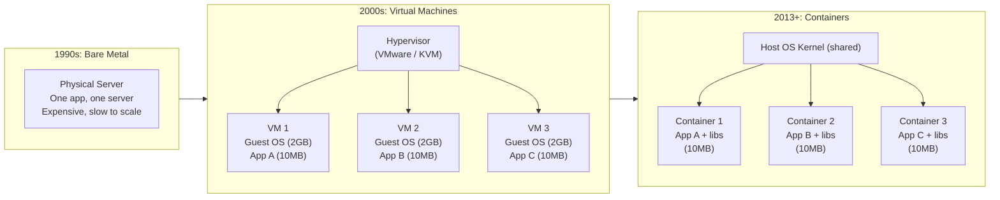

# Infrastructure ၏ ဆင့်ကဲဖြစ်စဉ် (The Evolution of Infrastructure)

Docker ကို မလေ့လာမီ၊ Docker က *ဘာကြောင့်* ရှိနေရတာလဲ၊ ဘယ်ပြဿနာကို ဖြေရှင်းပေးလဲဆိုတာကို နားလည်ထားဖို့ လိုပါတယ်။ Application များကို host လုပ်ခဲ့တဲ့ သိုင်းသမိုင်းကြောင်းက မျိုးဆက်တစ်ခုက သူတို့ရဲ့ ရှေ့လူတွေ ကျရှုံးခဲ့တဲ့ ပြဿနာတွေကို ဘယ်လို ဖြေရှင်းခဲ့ကြလဲဆိုတာကို ရှင်းရှင်းလင်းလင်း ပြသနေပါတယ်။



---

## Era 1: Bare Metal ခေတ် (၁၉၉၀ ခုနှစ်များ)

Application တစ်ခုကို Deploy လုပ်တယ်ဆိုတာ Physical server တစ်လုံး ဝယ်ရတယ် — Linux တင်တယ်၊ Networking တွေ Configure လုပ်တယ်၊ Runtime dependencies တွေ (Java, Node, Python) တင်တယ်၊ ပြီးမှ ကိုယ့် Code ကို Copy ကူးထည့်ရပါတယ်။

**အဓိကကျတဲ့ ပြဿနာ**: Server တစ်လုံးတည်းပေါ်မှာ Application နှစ်ခု တင်လိုက်ရင် အမြဲလိုလို Conflict ဖြစ်ကြပါတယ်။ App A က Python 2 လိုချင်ပြီး App B က Python 3 လိုချင်တယ်။ App A က OpenSSL 1.0 လိုချင်ပြီး App B က OpenSSL 3 လိုချင်တယ်။ ဒီပြဿနာကို ဖြေရှင်းဖို့ဆိုရင် **Physical server တစ်လုံးမှာ App တစ်ခုပဲ** Run ရပါတယ်။ ဒါက Hardware ကို အလွန်အမင်း အضیအကျယ် အလဟဿဖြစ်စေပြီး CPU သုံးစွဲမှုကလည်း ပုံမှန်အားဖြင့် ၅% ကနေ ၁၅% လောက်မှာပဲ ရှိနေပါတယ်။

---

## Era 2: Virtual Machines (၂၀၀၀ ခုနှစ်များ)

Hypervisors (VMware, VirtualBox, KVM, Hyper-V) တွေက Physical server တစ်လုံးကို Isolated ဖြစ်တဲ့ Virtual Machine အများကြီးအဖြစ် ခွဲထုတ်ပေးခြင်းအားဖြင့် "Server တစ်လုံးမှာ App တစ်ခုပဲ တင်ရတဲ့" အလဟဿဖြစ်မှုကို ဖြေရှင်းပေးခဲ့ပါတယ်။

**ဘယ်လို အလုပ်လုပ်လဲ**: Hypervisor က Hardware ကို Emulate လုပ်ပေးပါတယ်။ VM တരോင်းစီတိုင်းက Virtual CPU, Virtual RAM, Virtual Disk တွေပါတဲ့ တကယ့် Physical machine စစ်စစ်တစ်ခုလို့ သူတို့ဘာသာ ထင်မှတ်ကြပါတယ်။ VM တိုင်းမှာ သူတို့ရဲ့ ကိုယ်ပိုင် **Guest OS အပြည့်အစုံ** ကို အပေါ်ကနေ ထပ်တင် Run ကြရပါတယ်။

```
Physical Server: 32 CPU cores, 128 GB RAM
├── VM 1: 4 cores, 16 GB RAM
│   └── Guest OS: Ubuntu 20.04 (2.5 GB)
│       └── App A: 50 MB Node.js API
├── VM 2: 4 cores, 16 GB RAM
│   └── Guest OS: Ubuntu 20.04 (2.5 GB)
│       └── App B: 80 MB Python service
└── VM 3: 4 cores, 16 GB RAM
    └── Guest OS: CentOS 7 (1.8 GB)
        └── App C: 100 MB Java service
```

**VM တွေ ဖြေရှင်းပေးနိုင်ခဲ့တာတွေ**: Physical server တစ်လုံးတည်းပေါ်မှာ Multi-tenancy သုံးနိုင်ခြင်း၊ Workload တွေကြားထဲမှာ ခိုင်မာတဲ့ Isolation ရှိခြင်း၊ OS အမျိုးမျိုးကို ဘေးချင်းယှဉ်ပြီး တင်သုံးနိုင်ခြင်း။

**VM တွေ ရှင်းမပေးနိုင်ခဲ့တာတွေ**:
- **Startup time**: VM တစ်ခု Boot တက်ဖို့ စက္ကန့် ၃၀ ကနေ ၁၂၀ လောက် ကြာပါတယ် (OS အပြည့်အစုံကို Load လုပ်နေရလို့ပါ)
- **Memory အလဟဿဖြစ်မှု**: 2.5 GB ရှိတဲ့ Ubuntu installation ကြီးကို သယ်လာရတဲ့ 10 MB ပဲရှိတဲ့ Node.js app က အရမ်းကို ရယ်စရာကောင်းပါတယ်။
- **Density (သိပ်သည်းဆ)**: Guest OS ရဲ့ Overhead ကြောင့် RAM ကုန်သွားတဲ့အထိ Server တစ်လုံးပေါ်မှာ VM ၁၀ လောက်ပဲ တင်လို့ရနိုင်ပါတယ်။
- **Portability**: Hypervisor တစ်ခုကနေ တစ်ခုကို VM ရွှေ့ရတာ အရမ်းခက်ခဲပါတယ်၊ Cloud provider တစ်ခုကနေ တစ်ခုကို ရွှေ့ဖို့ဆိုရင်တော့ လုံးဝ မဖြစ်နိုင်သလောက်ပါပဲ။

---

## Era 3: Containers (၂၀၁၃ မှ ယနေ့အထိ)

Docker (၂၀၁၃ ခုနှစ်မှာ စတင်ခဲ့) က လုံးဝ ကွဲပြားခြားနားတဲ့ ချဉ်းကပ်ပုံကို လူသိများလာစေခဲ့ပါတယ်: **Hardware** ကို Virtual လုပ်မယ့်အစား Containers တွေက **Operating System** ကို Virtual လုပ်ကြပါတယ်။

**အဓိက တွေ့ရှိချက်**: Host တစ်ခုပေါ်က Containers အားလုံးဟာ အောက်ခြေက တူညီတဲ့ Linux kernel တစ်ခုတည်းကို အတူတူ သုံးကြပါတယ်။ သူတို့မှာ ကိုယ်ပိုင် OS ရှိဖို့ မလိုပါဘူး — ရှိပြီးသား OS ရဲ့ Isolation ဖြစ်နေတဲ့ အပိုင်းအစလေးကိုပဲ သုံးကြတာပါ။

Linux က ဒါကို ဖြစ်မြောက်စေတဲ့ Kernel Feature နှစ်ခုကို ထောက်ပံ့ပေးထားပါတယ်:

- **Namespaces**: Process တစ်ခု *မြင်နိုင်တဲ့* အရာတွေကို Isolated ဖြစ်စေပါတယ် — ကိုယ့်ရဲ့ PID namespace (အခြား Process တွေကို မမြင်ရအောင်)၊ Network namespace (ကိုယ့်ရဲ့ Network stack နဲ့ကိုယ်)၊ Mount namespace (ကိုယ့် Filesystem view နဲ့ကိုယ်)၊ User namespace (ကိုယ့်ရဲ့ UIDs နဲ့ကိုယ်)
- **cgroups** (Control Groups): Process တစ်ခု *သုံးနိုင်တဲ့* ပမာဏကို ကန့်သတ်ပေးပါတယ် — CPU time, Memory, I/O bandwidth စသည်ဖြင့်

```
Physical Server: 32 CPU cores, 128 GB RAM
├── Container 1: App A (50 MB Node.js binary + Alpine base = 60 MB total)
├── Container 2: App B (80 MB Python + deps = 120 MB total)
├── Container 3: App C (100 MB Java JAR + JRE = 200 MB total)
└── Host OS Kernel: shared by all containers (not duplicated)

Total memory for 3 apps: ~380 MB  ← vs 7.5 GB for 3 VMs
```

---

## နှိုင်းယှဉ်ချက် ဇယား (Side-by-Side Comparison)

| | Bare Metal | Virtual Machine | Container |
|--|-----------|----------------|-----------|
| **Isolation** | မရှိပါ | Full hardware emulation | OS-level namespaces |
| **Startup time** | မိနစ်ပိုင်း (Manual ဖြင့်) | စက္ကန့် ၃၀ မှ ၁၂၀ | ၁ စက္ကန့်အောက် |
| **Image size** | သက်ဆိုင်ခြင်းမရှိ | 1–10 GB | 5–500 MB |
| **Memory overhead** | မရှိပါ | Guest OS တစ်ခုလျှင် 1–2 GB | လုံးဝနီးပါး မရှိပါ |
| **Density** | App ၁ ခု / Server | VM 5–20 ခု / Server | Containers 50–500 ခု / Server |
| **Portability** | မရှိပါ | ကန့်သတ်ချက်ရှိ (Hypervisor ပေါ် မူတည်) | ဘယ်နေရာမှာမဆို အတူတူ Run နိုင်သည် |
| **Startup speed** | ሳምንታት (Hardware ဝယ်ယူရသဖြင့်) | မိနစ်ပိုင်း | မီလီစက္ကန့်ပိုင်း |

---

## "Works On My Machine" ပြဿနာ — ဖြေရှင်းပြီး

ဒါက Docker ရဲ့ နာမည်အကြီးဆုံး Value Proposition ဖြစ်ပါတယ်။ Containers တွေ မပေါ်ခင်တုန်းက ဒီလို ပြောဆိုဆွေးနွေးမှုတွေက အမြဲ ဖြစ်နေတတ်ပါတယ်:

```
Developer:  "I tested it locally, it works!"
Ops:        "It's crashing in production."
Developer:  "But it works on my machine!"
Ops:        "Your machine has Node 18 and libssl 3.0.
             Production server has Node 16 and libssl 1.0.
             Of course it doesn't work."
```

Docker container တစ်ခုထဲမှာ **ကိုယ့် Code တင်မကပါဘူး**၊ တိကျတဲ့ Runtime (Node 18.x)၊ တိကျတဲ့ Libraries တွေ (libssl 3.0)၊ တိကျတဲ့ Configuration ဖိုင်တွေ — Application တစ်ခု Runဖို့ လိုအပ်သမျှ အားလုံး ပါဝင်ပါတယ်။ Container ကိုယ်တိုင်က "Machine" တစ်လုံး ဖြစ်ပါတယ်။ ကိုယ့် Laptop ပေါ်က Container ထဲမှာ အလုပ်လုပ်တယ်ဆိုရင် CI Server ပေါ်မှာ၊ Staging Server ပေါ်မှာ၊ Production Server ပေါ်မှာပါ အဲ့ဒီ Container အတိုင်းပဲ အလုပ်လုပ်မှာ ဖြစ်ပါတယ်။ Environment က Code နဲ့အတူ လိုက်သွားပါတယ်။

---

## Interactive Terminal Sandbox: Docker Runtime

Browser ထဲမှာတင် Container Process တွေနဲ့ Images များကို တိုက်ရိုက် Run ကြည့်ပါ:

<InteractiveTerminal
  title="Docker CLI Simulator"
  welcomeMessage="Docker Daemon is active. Run 'docker ps' or 'docker images' to inspect running container environments."
  initialCommand="docker ps"
  presets={[
    { label: "List Containers", command: "docker ps" },
    { label: "List Local Images", command: "docker images" },
    { label: "System Host Uptime", command: "uname -a" },
    { label: "Process Monitor", command: "htop" }
  ]}
/>

<CloudSandboxCallout />

---

## ဗဟုသုတ စစ်ဆေးရန် (Knowledge Check)

<KnowledgeCheck
  question="ရိုးရှင်းတဲ့ Linux server တစ်လုံးတည်းပေါ်မှာ Docker containers ၁၀၀ ကျော် တစ်ပြိုင်နက် Run နိုင်တာက ဘာကြောင့်လဲ?"
  hint="Containers တွေက ဘာတွေကို မျှဝေသုံးပြီး VMs တွေက ဘာတွေကို Duplicate လုပ်ရလဲဆိုတာ စဉ်းစားပါ။"
  options={[
    { id: "1", text: "Container တိုင်းမှာ သူတို့ရဲ့ ကိုယ်ပိုင် Lightweight hypervisor ပါလို့ပါ။", isCorrect: false },
    { id: "2", text: "Container အားလုံးက အောက်ခြေက တူညီတဲ့ Host OS kernel တစ်ခုတည်းကို မျှဝေသုံးကြပြီး Guest OS memory အလဟဿဖြစ်မှုကို ဖယ်ရှားပေးလို့ပါ။", isCorrect: true },
    { id: "3", text: "Docker က Hardware swap ကိုပဲ သီးသန့်သုံးပြီး RAM ကို Compress လုပ်လို့ပါ။", isCorrect: false },
    { id: "4", text: "Containers တွေက Active network requests တွေ ရှိနေချိန်မှာပဲ Execute လုပ်လို့ပါ။", isCorrect: false }
  ]}
  explanation="Containers တွေက Host Linux kernel ကို မျှဝေသုံးကြပြီး Namespaces နဲ့ cgroups တွေကို သုံးပြီး Process တွေကို Isolation လုပ်ကြပါတယ်။ VM တွေလို Container တစ်ခုချင်းစီတိုင်းက 1-2GB ရှိတဲ့ Guest OS ကို မပွားများတော့တဲ့အတွက် Memory သုံးစွဲမှု အလွန်နည်းပြီး Density က ၁၀ ဆ ပိုများပါတယ်။"
/>

---

## အနှစ်ချုပ် (Summary)

- **Bare Metal**: Physical server တစ်လုံးမှာ App တစ်ခု — ကုန်ကျစရိတ်များပြီး အလဟဿ ဖြစ်စေသည်
- **Virtual Machines**: ခိုင်မာတဲ့ Isolation + Hardware emulation — လေးလံသည် (VM တစ်ခုချင်းစီမှာ GB နဲ့ချီတဲ့ Guest OS ပါပြီး Boot တက်ဖို့ မိနစ်နဲ့ချီ ကြာသည်)
- **Containers**: Linux namespaces + cgroups ကို သုံးပြီး OS-level isolation လုပ်ခြင်း — ပေါ့ပါးသည် (MB ပမာဏသာရှိ၊ မီလီစက္ကန့်ပိုင်းနဲ့ Boot တက်သည်)၊ Portable ဖြစ်သည်၊ Density မြင့်သည်
- Container **image** က App နဲ့အတူ တိကျတဲ့ Dependencies များကို ပူးတွဲထုပ်ပိုးပေးသည် — "Works on my machine" ဆိုတဲ့ ပြဿနာကို ရာသက်ပန် ဖြေရှင်းပေးသည်
- Containers တွေက Host Kernel ကို မျှဝေသုံးကြသည် — ပိုမြန်ပြီး ပိုငယ်သလို VM တွေထက်တော့ Isolation နယ်နိမိတ် ပိုပါးလွှာသည်

နောက် పాఠခန်းမှာတော့ Docker ရဲ့ အတွင်းပိုင်း Architecture ဘယ်လိုဖွဲ့စည်းထားလဲ — Client, Daemon, Registry နဲ့ Images နဲ့ Containers ကြားက ကွာခြားချက်တွေကို ဆက်လက် လေ့လာရမှာ ဖြစ်ပါတယ်။