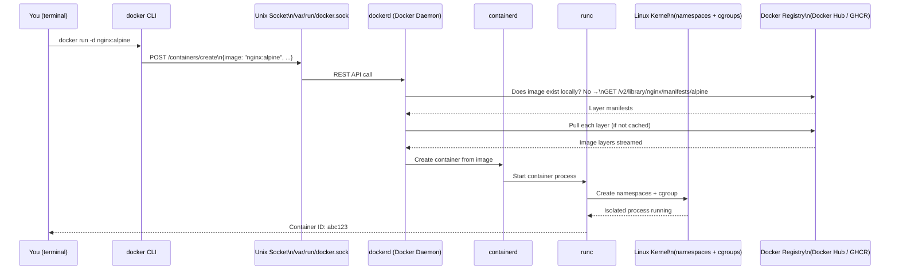
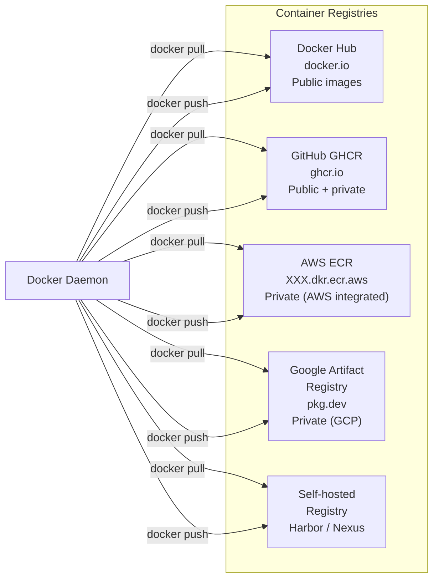
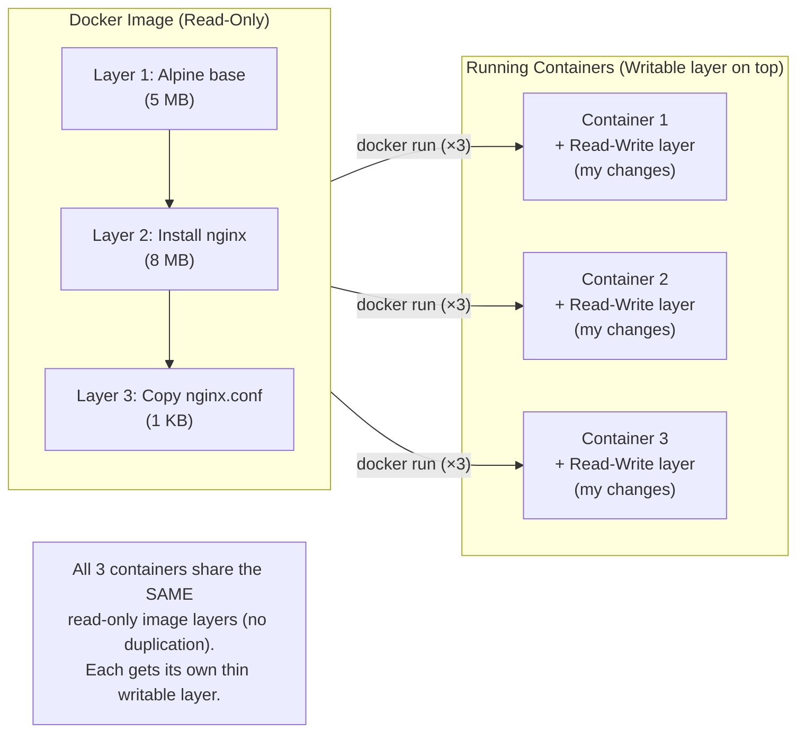

# Docker ၏ အလုပ်လုပ်ပုံ (Under the Hood of Docker)

သင် `docker run nginx` ဆိုပြီး run လိုက်တဲ့အခါ စနစ်ထဲမှာ တကယ်တမ်း ဘာတွေ ဖြစ်ပျက်သွားလဲ? Docker ဆိုတာ monolithic binary တစ်ခုတည်း မဟုတ်ပါဘူး — ဒါဟာ ပူးပေါင်းလုပ်ဆောင်ကြတဲ့ component အမျိုးစုံနဲ့ ဖွဲ့စည်းထားတဲ့ distributed client-server architecture တစ်ခု ဖြစ်ပါတယ်။



---

## Component 1: The Docker CLI (`docker`)

The `docker` binary ဆိုတာ pure client တစ်ခုပါ — သူက **container အလုပ်တွေကို တကယ်လုပ်တာ မဟုတ်ပါဘူး**။ သူ့ရဲ့ တစ်ခုတည်းသော တာဝန်တွေကတော့:
1. သင့်ရဲ့ command တွေကို လက်ခံဖို့ (`docker run`, `docker build`, `docker ps`)
2.  వాటిကို REST API call တွေအဖြစ် ပြောင်းလဲပေးဖို့
3. အဲဒီ call တွေကို Unix socket ကနေတဆင့် Docker Daemon ဆီ ပို့ပေးဖို့

```bash
# The CLI talks to the daemon at this socket by default:
# /var/run/docker.sock   (Linux / Docker Desktop on Mac)

# You can even call the Docker API directly with curl
curl --unix-socket /var/run/docker.sock \
  http://localhost/version | python3 -m json.tool
# {
#   "Version": "27.0.3",
#   "Os": "linux",
#   "Arch": "amd64",
#   "KernelVersion": "6.8.0-40-generic",
#   ...
# }

# Or connect to a remote Docker daemon (over TCP)
DOCKER_HOST=tcp://192.168.1.100:2376 docker ps
```

---

## Component 2: The Docker Daemon (`dockerd`)

Daemon ဆိုတာကတော့ နောက်ကွယ်မှာ အလုပ်တွေအများကြီး လုပ်ပေးနေတဲ့ background process ဖြစ်ပါတယ်။ သူက:
- API request တွေအတွက် Unix socket (သို့မဟုတ် TCP) ကို နားထောင်နေပါတယ်
- Images, containers, networks နဲ့ volumes တွေရဲ့ lifecycle တွေကို စီမံခန့်ခွဲပေးပါတယ်
- တကယ်တမ်း container ဖန်တီးတဲ့ အလုပ်ကိုတော့ `containerd` ဆီ လွှဲပြောင်းပေးပါတယ်
- Image layer တွေကို ဒေါင်းလုပ်ဆွဲတာ၊ စစ်ဆေးတာနဲ့ cache လုပ်တာတွေကို ကိုင်တွယ်ပေးပါတယ်

```bash
# Check if the daemon is running
sudo systemctl status docker

# View daemon logs
journalctl -u docker.service -f

# Configure the daemon (edit and restart)
cat /etc/docker/daemon.json
{
  "log-driver": "json-file",
  "log-opts": { "max-size": "10m", "max-file": "3" },
  "default-ulimits": { "nofile": { "Hard": 65536, "Name": "nofile", "Soft": 65536 } },
  "live-restore": true,    # Keep containers running when daemon restarts
  "userland-proxy": false  # Better performance for port forwarding
}
```

**Mac နဲ့ Windows မှာ**: Docker Desktop က lightweight Linux VM တစ်ခုကို (HyperKit/WSL2 ကိုသုံးပြီး) run ပေးထားပြီး Docker Daemon က အဲဒီ VM ထဲမှာ run နေတာ ဖြစ်ပါတယ်။ Mac ပေါ်က သင့်ရဲ့ `docker` CLI က အဲဒီ Linux VM ထဲမှာရှိတဲ့ daemon နဲ့ စကားပြောတာ ဖြစ်ပါတယ်။

---

## Component 3: containerd နှင့် runc

နောက်ကွယ်မှာ `dockerd` က တကယ်တမ်း container ဖန်တီးတဲ့ အလုပ်ကို နောက်ထပ် component နှစ်ခုဆီ လွှဲပေးပါတယ်:

- **containerd**: Industry-standard container runtime supervisor တစ်ခု ဖြစ်ပါတယ်။ သူက container တစ်ခုလုံးရဲ့ lifecycle (ဖန်တီးခြင်း၊ စတင်ခြင်း၊ ရပ်တန့်ခြင်း၊ ဖျက်ပစ်ခြင်း) ကို စီမံခန့်ခွဲပေးပြီး image storage နဲ့ container snapshot တွေကိုပါ ကိုင်တွယ်ပါတယ်။ Kubernetes ကလည်း ဒါကို တိုက်ရိုက် အသုံးပြုပါတယ်။
- **runc**: အောက်ဆုံးအဆင့် component ဖြစ်ပါတယ်။ `runc` က namespaces တွေ ဖန်တီးဖို့နဲ့ cgroups တွေ သတ်မှတ်ဖို့အတွက် Linux kernel ရဲ့ `clone()` syscall ကို တကယ်တမ်း ခေါ်ဆိုပေးတဲ့ CLI tool တစ်ခု ဖြစ်ပါတယ်။ သင် run သမျှ container တိုင်းဟာ နောက်ဆုံးမှာ `runc` process တစ်ခုစီ ဖြစ်လာပါတယ်။

```bash
# See containerd running
ps aux | grep containerd
# root   1234   dockerd
# root   1235   containerd         ← spawned by dockerd
# root   1236   containerd-shim    ← one per container
# root   1237   nginx              ← your container's process (inside namespace)
```

---

## Component 4: Docker Registry

Registry ဆိုတာကတော့ Docker image တွေ သိမ်းဆည်းပေးပြီး ဖြန့်ဝေပေးတဲ့ server တစ်ခု ဖြစ်ပါတယ်။ Default အနေနဲ့သုံးတာကတော့ **Docker Hub** (`docker.io`) ဖြစ်ပါတယ်။



### Image Naming Convention

```
registry.example.com / namespace / repository : tag @ digest
─────────────────── ─────────── ────────────── ─── ──────────────────────
Optional (default    User or org Image name    Tag  SHA256 (immutable ref)
= docker.io)

# Examples:
nginx                                   # = docker.io/library/nginx:latest
nginx:1.25-alpine                       # = docker.io/library/nginx:1.25-alpine
johndoe/my-api:v2.0.1                   # = docker.io/johndoe/my-api:v2.0.1
ghcr.io/yourorg/backend:abc1234         # GitHub GHCR
123456789.dkr.ecr.us-east-1.amazonaws.com/my-app:v1.0.0  # AWS ECR
nginx@sha256:a3b4c5d6...                # Immutable — pinned to exact digest
```

---

## Images vs Containers: အဓိက ကွာခြားချက်

ဒါဟာ Docker မှာ သိထားရမယ့် အရေးကြီးဆုံး သဘောတရား ကွာခြားချက် ဖြစ်ပါတယ်:



| | Image | Container |
|--|-------|-----------|
| **State** | Static, immutable | Running, mutable |
| **Analogy** | Recipe / Blueprint | ဖုတ်ပြီးသား ကိတ်မုန့် |
| **Disk** | Shared read-only layers | +Thin writable layer |
| **Lives on** | Disk (not running) | CPU + Memory |
| **Create from** | `docker build` သို့မဟုတ် `docker pull` | `docker run` |
| **Delete** | `docker rmi` | `docker rm` |
| **Multiple instances** | Image တစ်ခုတည်း → Container ၁၀၀ | တစ်ခုချင်းစီဟာ သီးခြားစီ ဖြစ်ကြတယ် |

```bash
# Images on disk
docker images
# REPOSITORY   TAG       IMAGE ID       CREATED        SIZE
# nginx        alpine    abc123def456   2 weeks ago    41.6MB
# postgres     16        789xyz...      1 month ago    432MB

# Running containers (instances of those images)
docker ps
# CONTAINER ID   IMAGE          COMMAND              STATUS
# a1b2c3         nginx:alpine   "/docker-entrypoint" Up 5 minutes
# d4e5f6         nginx:alpine   "/docker-entrypoint" Up 3 minutes
# Both are running from the SAME nginx:alpine image

# Every container adds a writable layer on top of the read-only image layers
# When the container is deleted, the writable layer is lost
# If you need data to survive container deletion → use a Volume
```

---

## The Image Layer Cache

Image တွေကို disk ပေါ်မှာ layer တွေအနေနဲ့ သိမ်းဆည်းပါတယ်။ Docker က layer တိုင်းကို သူ့ရဲ့ SHA256 digest နဲ့ cache လုပ်ထားပါတယ်။ ကွဲပြားတဲ့ image နှစ်ခုမှာ တူညီတဲ့ layer တစ်ခုခု ပါနေမယ်ဆိုရင် (ဥပမာ- နှစ်ခုစလုံးက `FROM node:20-alpine` နဲ့ စတယ်ဆိုရင်) အဲဒီ layer ကို **တစ်ကြိမ်တည်း** ပဲ သိမ်းဆည်းပြီး အတူတူ မျှဝေသုံးစွဲပါတယ်:

```bash
# Pull two images that share the node:20-alpine base
docker pull my-api:v1     # Downloads: alpine base, node, your app
docker pull my-api:v2     # Downloads: ONLY your changed app layer
                          # Alpine base + node are already cached!
```

ဒါကြောင့် သင့် app ရဲ့ image ကို v2 ကို အပ်ဒိတ်လုပ်တဲ့အခါ မြန်ဆန်နေတာ ဖြစ်ပါတယ် — image တစ်ခုလုံးကို ဒေါင်းလုပ်ဆွဲနေစရာမလိုဘဲ ပြောင်းလဲသွားတဲ့ layer တွေကိုပဲ ဒေါင်းလုပ်ဆွဲတာကြောင့် ဖြစ်ပါတယ်။

---

## အနှစ်ချုပ် (Summary)

Docker architecture မှာ အဓိက component ၄ ခု ပါဝင်ပါတယ်:
- **Docker CLI** (`docker`): Pure client — command တွေကို REST API call အားဖြင့် daemon ဆီ ပို့ပေးပါတယ်
- **Docker Daemon** (`dockerd`): Server — images, containers, networks, volumes တွေကို စီမံခန့်ခွဲပြီး containerd ဆီ လွှဲပေးပါတယ်
- **containerd + runc**: တကယ်တမ်း အလုပ်လုပ်တဲ့ container engine — isolation အတွက် Linux namespaces နဲ့ cgroups တွေကို ဖန်တီးပေးပါတယ်
- **Registry**: Image တွေ သိမ်းဆည်းပြီး ဖြန့်ဝေပေးတဲ့နေရာ — Docker Hub က default public ဖြစ်ပြီး၊ private/org image တွေအတွက် GHCR, ECR, GAR တို့ကို သုံးပါတယ်

**Image** ဆိုတာကတော့ static ဖြစ်ပြီး read-only ဖြစ်တဲ့ blueprint (disk ပေါ်က layer တွေ) ဖြစ်ပါတယ်။ **Container** ဆိုတာကတော့ image တစ်ခုရဲ့ running instance ဖြစ်ပြီး အပေါ်ဆုံးမှာ သူ့အတွက် သီးသန့် writable layer ပါရှိပါတယ်။ Image တစ်ခုတည်းကနေ container ၁၀၀ ထိ run နိုင်ပြီး သူတို့အားလုံးဟာ image ရဲ့ read-only layer တွေကို အတူတူ မျှဝေသုံးစွဲကြပါတယ်။

နောက်လာမယ့် သင်ခန်းစာမှာတော့ သင်ဟာ ပထမဆုံး container ကို စတင် run ကြည့်မှာဖြစ်ပြီး မရှိမဖြစ်လိုအပ်တဲ့ Docker CLI command တွေကို ကျွမ်းကျင်လာမှာ ဖြစ်ပါတယ်။