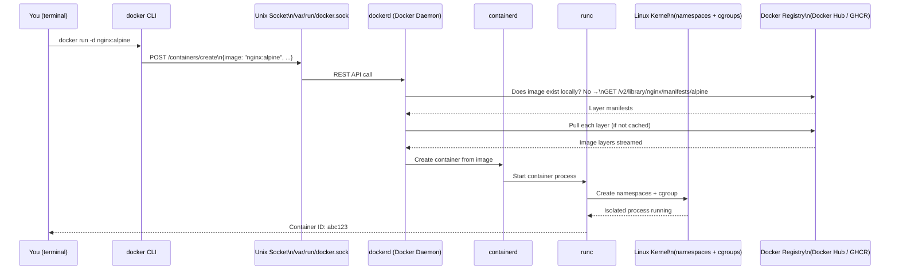
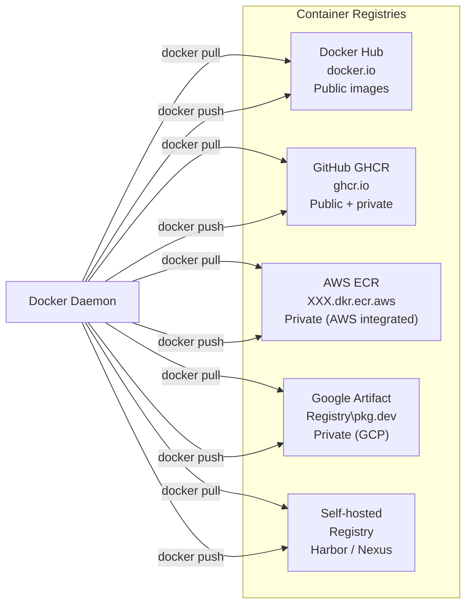
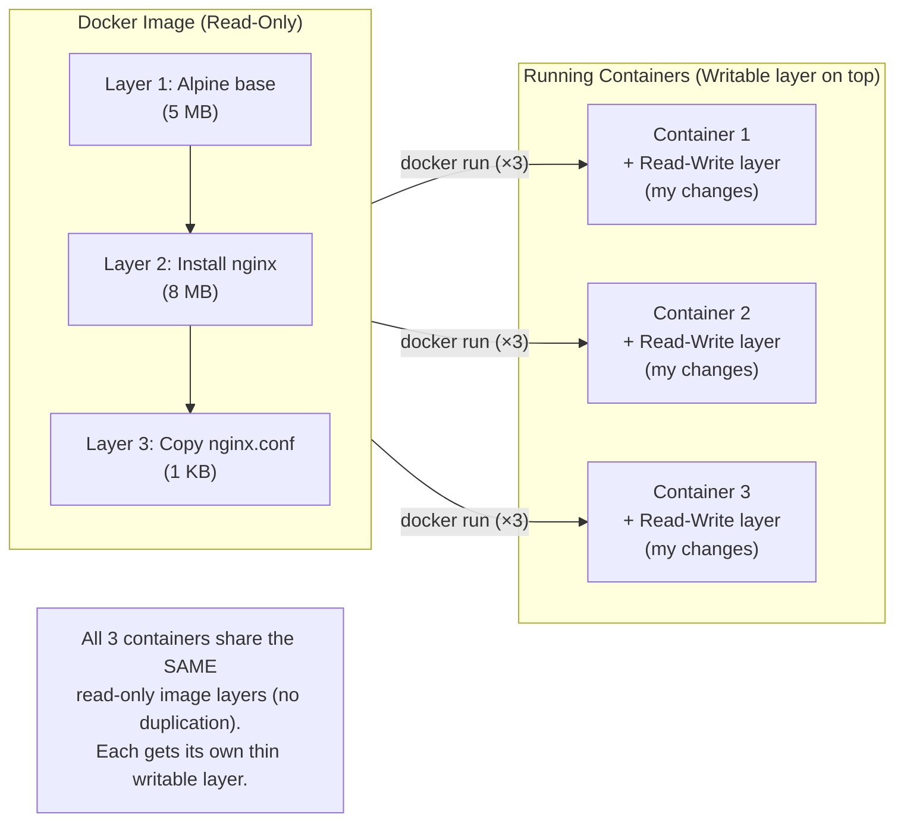

# Docker ၏ အတွင်းပိုင်းလုပ်ဆောင်ချက်များ

သင်သည် `docker` တွင် `docker run nginx` ဟု ရိုက်ထည့်လိုက်သောအခါ စနစ်အတွင်း၌ အမှန်တကယ် ဘာတွေဖြစ်ပျက်သွားသနည်း။ Docker သည် တစ်ခုတည်းသော တစ်သားတည်းဖြစ်နေသော binary တစ်ခုမဟုတ်ပါ — ၎င်းသည် အတူတကွ ပူးပေါင်းလုပ်ဆောင်ကြသော အစိတ်အပိုင်းများစွာဖြင့် ဖွဲ့စည်းထားသည့် distributed client-server architecture တစ်ခုဖြစ်သည်။



---

## အစိတ်အပိုင်း ၁ - Docker CLI (`docker`)

`docker` binary သည် သက်သက်သာသာ client တစ်ခုသာ ဖြစ်သည် — ၎င်းသည် **မည်သည့် container အလုပ်ကိုမျှ တိုက်ရိုက်လုပ်ဆောင်ခြင်း မရှိပါ။** ၎င်း၏ တစ်ခုတည်းသော တာဝန်မှာ:
၁။ သင့်အမိန့်များကို လက်ခံရန် (`docker run`, `docker build`, `docker ps`)
၂။ ၎င်းတို့ကို REST API ခေါ်ဆိုမှုများ (API calls) အဖြစ် ပြောင်းလဲရန်
၃။ ထိုခေါ်ဆိုမှုများကို Unix socket တစ်ခုမှတဆင့် Docker Daemon ထံသို့ ပို့ဆောင်ရန်

```bash
# မူလအခြေအနေအရ CLI သည် ဤ socket တွင် daemon နှင့် ဆက်သွယ်သည်:
# /var/run/docker.sock   (Linux / Docker Desktop on Mac)

# curl ကို အသုံးပြု၍ Docker API ကို တိုက်ရိုက်ပင် ခေါ်ဆိုနိုင်သည်
curl --unix-socket /var/run/docker.sock \
  http://localhost/version | python3 -m json.tool
# {
#   "Version": "27.0.3",
#   "Os": "linux",
#   "Arch": "amd64",
#   "KernelVersion": "6.8.0-40-generic",
#   ...
# }

# သို့မဟုတ် (TCP မှတဆင့်) အဝေးရောက် Docker daemon သို့ ချိတ်ဆက်ရန်
DOCKER_HOST=tcp://192.168.1.100:2376 docker ps
```

---

## အစိတ်အပိုင်း ၂ - Docker Daemon (`dockerd`)

Daemon သည် နောက်ကွယ်မှ အဓိကလေးလံသော အလုပ်များကို လုပ်ဆောင်ပေးသည့် လုပ်ငန်းစဉ် (background process) ဖြစ်သည်။ ၎င်းသည်:
- API တောင်းဆိုမှုများအတွက် Unix socket (သို့မဟုတ် TCP) ကို စောင့်ဆိုင်းနေသည် (listens)
- image များ၊ container များ၊ network များ နှင့် volume 들의 သက်တမ်းတိုရှည်မှုကို စီမံခန့်ခွဲသည်
- အမှန်တကယ် container တည်ဆောက်ခြင်းကို `containerd` ထံသို့ လွှဲပြောင်းပေးသည်
- image layer များကို ဒေါင်းလုဒ်ဆွဲခြင်း၊ စစ်ဆေးခြင်းနှင့် cache လုပ်ခြင်းတို့ကို ဆောင်ရွက်သည်

```bash
# daemon အလုပ်လုပ်နေခြင်း ရှိမရှိ စစ်ဆေးရန်
sudo systemctl status docker

# daemon လော့ဂ်များကို ကြည့်ရှုရန်
journalctl -u docker.service -f

# daemon ကို ပြင်ဆင်သတ်မှတ်ရန် (ပြင်ဆင်ပြီးလျှင် ပြန်လည်စတင်ပါ)
cat /etc/docker/daemon.json
{
  "log-driver": "json-file",
  "log-opts": { "max-size": "10m", "max-file": "3" },
  "default-ulimits": { "nofile": { "Hard": 65536, "Name": "nofile", "Soft": 65536 } },
  "live-restore": true,    # daemon ပြန်စချိန်တွင် container များကို ဆက်လက်အလုပ်လုပ်စေရန်
  "userland-proxy": false  # port forwarding အတွက် စွမ်းဆောင်ရည် ပိုမိုကောင်းမွန်စေရန်
}
```

**Mac နှင့် Windows တွင်**: Docker Desktop သည် ပေါ့ပါးသော Linux VM တစ်ခုကို (HyperKit/WSL2 ကို အသုံးပြု၍) လည်ပတ်စေပြီး Docker Daemon သည် ထို VM အတွင်း၌ အလုပ်လုပ်သည်။ Mac ပေါ်ရှိ သင့်၏ `docker` CLI သည် Linux VM အတွင်းရှိ daemon နှင့် ဆက်သွယ်သည်။

---

## အစိတ်အပိုင်း ၃ - containerd နှင့် runc

အတွင်းပိုင်းတွင် `dockerd` သည် အမှန်တကယ် container တည်ဆောက်မှုကို အခြားသော အစိတ်အပိုင်းနှစ်ခုထံသို့ လွှဲပြောင်းပေးသည်:

- **containerd**: စက်မှုလုပ်ငန်းအဆင့်မီ container runtime supervisor တစ်ခုဖြစ်သည်။ ၎င်းသည် container ၏ တစ်သက်တာလုံးဆိုင်ရာ စီမံခန့်ခွဲမှု (ဖန်တီးခြင်း၊ စတင်ခြင်း၊ ရပ်တန့်ခြင်း၊ ဖျက်ဆီးခြင်း) ကို လုပ်ဆောင်ပေးပြီး image သိုလှောင်မှုကို ကိုင်တွယ်ကာ container snapshot များကို စီမံခန့်ခွဲသည်။ ၎င်းကို Kubernetes မှလည်း တိုက်ရိုက်အသုံးပြုသည်။
- **runc**: အနိမ့်ဆုံးအဆင့်ရှိ အစိတ်အပိုင်းဖြစ်သည်။ `runc` သည် Linux kernel ၏ `clone()` syscall ကို အမှန်တကယ်ခေါ်ဆိုကာ namespaces များကို တည်ဆောက်ပေးပြီး cgroups များကို သတ်မှတ်ပေးသည့် CLI ကိရိယာတစ်ခုဖြစ်သည်။ သင်လည်ပတ်သမျှ container တိုင်းသည် နောက်ဆုံးတွင် `runc` process တစ်ခုစီပင် ဖြစ်သည်။

```bash
# containerd အလုပ်လုပ်နေမှုကို ကြည့်ရှုရန်
ps aux | grep containerd
# root   1234   dockerd
# root   1235   containerd         ← spawned by dockerd
# root   1236   containerd-shim    ← one per container
# root   1237   nginx              ← your container's process (inside namespace)
```

---

## အစိတ်အပိုင်း ၄ - Docker Registry

Registry ဆိုသည်မှာ Docker image များကို သိမ်းဆည်းပေးပြီး ဖြန့်ဝေပေးသော server တစ်ခုဖြစ်သည်။ မူလသတ်မှတ်ထားသည်မှာ **Docker Hub** (`docker.io`) ဖြစ်သည်။



### Image အမည်ပေးစနစ် (Naming Convention)

```
registry.example.com / namespace / repository : tag @ digest
─────────────────── ─────────── ────────────── ─── ──────────────────────
Optional (default    User or org Image name    Tag  SHA256 (immutable ref)
= docker.io)

# ဥပမာများ:
nginx                                   # = docker.io/library/nginx:latest
nginx:1.25-alpine                       # = docker.io/library/nginx:1.25-alpine
johndoe/my-api:v2.0.1                   # = docker.io/johndoe/my-api:v2.0.1
ghcr.io/yourorg/backend:abc1234         # GitHub GHCR
123456789.dkr.ecr.us-east-1.amazonaws.com/my-app:v1.0.0  # AWS ECR
nginx@sha256:a3b4c5d6...                # Immutable — pinned to exact digest
```

---

## Images နှင့် Containers အကြား ကွာခြားချက် - အရေးအကြီးဆုံးအချက်

ဤသည်မှာ Docker တွင် အရေးအပါဆုံး အယူအဆပိုင်းဆိုင်ရာ ကွာခြားချက် ဖြစ်သည်:



| | Image | Container |
|--|-------|-----------|
| **အခြေအနေ (State)** | တည်ငြိမ်သည်၊ ပြင်ဆင်၍မရပါ (Static, immutable) | အလုပ်လုပ်နေသည်၊ ပြင်ဆင်နိုင်သည် (Running, mutable) |
| **ဥပမာပေးရလျှင်** | ချက်နည်းလက်နည်း / ပုံစံကြမ်း (Recipe / Blueprint) | ဖုတ်ပြီးသား ကိတ်မုန့် |
| **ဒစ်ခ် (Disk)** | မျှဝေထားသော read-only layer များ | +ပါးလွှာသော writable layer တစ်ခု |
| **တည်ရှိရာ** | Disk ပေါ်တွင် (အလုပ်မလုပ်နေပါ) | CPU + Memory |
| **ဖန်တီးရန်** | `docker build` သို့မဟုတ် `docker pull` | `docker run` |
| **ဖျက်ဆီးရန်** | `docker rmi` | `docker rm` |
| **စောင်ရေများစွာ (Multiple instances)** | Image တစ်ခု → Container ၁၀၀ | တစ်ခုချင်းစီသည် သီးခြားလွတ်လပ်သည် |

```bash
# Disk ပေါ်ရှိ image များ
docker images
# REPOSITORY   TAG       IMAGE ID       CREATED        SIZE
# nginx        alpine    abc123def456   2 weeks ago    41.6MB
# postgres     16        789xyz...      1 month ago    432MB

# အလုပ်လုပ်နေသော container များ (ထို image များ၏ ဥပမာများ)
docker ps
# CONTAINER ID   IMAGE          COMMAND              STATUS
# a1b2c3         nginx:alpine   "/docker-entrypoint" Up 5 minutes
# d4e5f6         nginx:alpine   "/docker-entrypoint" Up 3 minutes
# နှစ်ခုစလုံးသည် တူညီသော nginx:alpine image မှ လည်ပတ်နေခြင်း ဖြစ်သည်

# container တိုင်းသည် read-only image layer များ၏ အပေါ်ဘက်တွင် writable layer တစ်ခုကို ထည့်ပေါင်းပေးသည်
# container ကို ဖျက်လိုက်သောအခါ writable layer ပျောက်ကွယ်သွားသည်
# အကယ်၍ ဒေတာများကို container ဖျက်လိုက်သော်လည်း ဆက်လက်ရှိနေစေလိုပါက → Volume ကို အသုံးပြုပါ
```

---

## Image Layer Cache

Image များကို disk ပေါ်တွင် layer များအဖြစ် သိမ်းဆည်းထားသည်။ Docker သည် layer တိုင်းကို ၎င်းတို့၏ SHA256 digest ဖြင့် cache လုပ်ထားသည်။ အကယ်၍ image နှစ်ခုသည် ဘုံ layer တစ်ခုကို မျှဝေသုံးစွဲကြလျှင် (ဥပမာ- နှစ်ခုစလုံးသည် `FROM node:20-alpine` ဖြင့် စတင်ကြသည်)၊ ထို layer ကို **တစ်ကြိမ်သာ** သိမ်းဆည်းပြီး မျှဝေသုံးစွဲသည်:

```bash
# node:20-alpine base ကို မျှဝေသုံးစွဲသော image နှစ်ခုကို pull ဆွဲပါ
docker pull my-api:v1     # ဒေါင်းလုဒ်လုပ်သည်: alpine base၊ node၊ သင်၏ app
docker pull my-api:v2     # ဒေါင်းလုဒ်လုပ်သည်: သင်ပြောင်းလဲထားသော app layer ကို **သာ**
                          # Alpine base + node တို့သည် cache လုပ်ပြီးသား ဖြစ်နေပြီ!
```

ဤအကြောင်းကြောင့် သင်၏ app image ကို v2 သို့ အပ်ဒိတ်လုပ်သည့်အခါ မြန်ဆန်ခြင်း ဖြစ်သည် — image တစ်ခုလုံးမဟုတ်ဘဲ ပြောင်းလဲသွားသော layer များကိုသာ ဒေါင်းလုဒ်ဆွဲခြင်း ဖြစ်သည်။

---

## အနှစ်ချုပ်

Docker ၏ architecture တွင် အဓိကအစိတ်အပိုင်း ၄ ခု ပါဝင်သည်:
- **Docker CLI** (`docker`): သက်သက်သာသာ client တစ်ခု — အမိန့်များကို REST API ခေါ်ဆိုမှုများအဖြစ် ပြောင်းလဲပေးပြီး daemon သို့ ပို့ဆောင်သည်
- **Docker Daemon** (`dockerd`): server — image များကို၊ container များကို၊ network များကို၊ volume များကို စီမံခန့်ခွဲသည်၊ containerd ထံသို့ လွှဲပြောင်းပေးသည်
- **containerd + runc**: အမှန်တကယ် container အင်ဂျင် — သီးသန့်ဖြစ်စေရန် Linux namespaces + cgroups များကို ဖန်တီးပေးသည်
- **Registry**: Image သိမ်းဆည်းမှုနှင့် ဖြန့်ဝေမှု — Docker Hub သည် မူလအများသုံးဖြစ်ပြီး၊ GHCR၊ ECR၊ GAR တို့သည် သီးသန့်/အဖွဲ့အစည်းဆိုင်ရာ image များအတွက် ဖြစ်သည်

**Image** ဆိုသည်မှာ တည်ငြိမ်ပြီး ပြင်ဆင်၍မရသော ပုံစံကြမ်း (disk ပေါ်ရှိ layer များ) ဖြစ်သည်။ **Container** ဆိုသည်မှာ အပေါ်ဆုံးတွင် ပါးလွှာသော writable layer တစ်ခုပါရှိသည့် image ၏ အလုပ်လုပ်နေသော ဥပမာတစ်ခု ဖြစ်သည်။ Image တစ်ခုတည်းမှ container ၁၀၀ ကို သင်လည်ပတ်နိုင်သည် — ၎င်းတို့အားလုံးသည် image ၏ read-only layer များကို မျှဝေသုံးစွဲကြသည်။

နောက်လာမည့် သင်ခန်းစာတွင် သင်၏ ပထမဆုံး container ကို လည်ပတ်စေမည်ဖြစ်ပြီး မရှိမဖြစ်လိုအပ်သော Docker CLI အမိန့်များကို ကျွမ်းကျင်အောင် လုပ်ဆောင်သွားမည် ဖြစ်သည်။