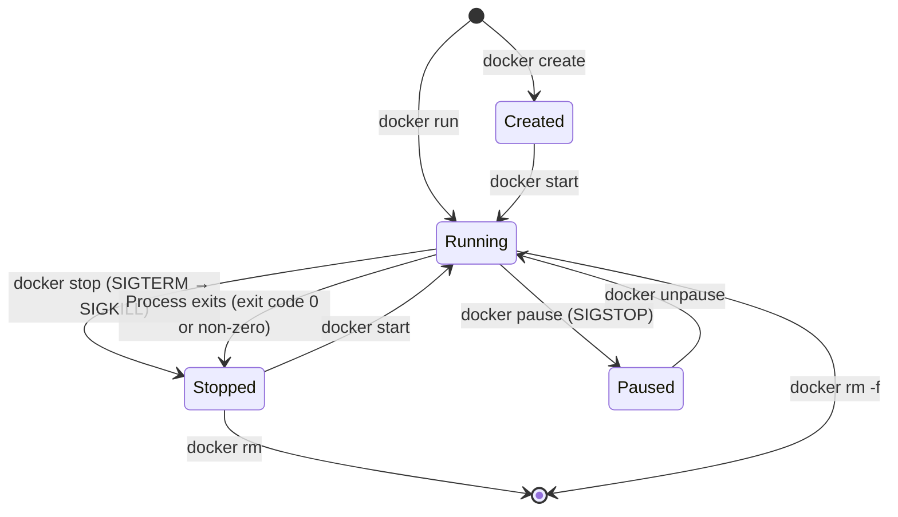

# `docker run` အမိန့်ခေါ်ဆိုမှု- အပြည့်အစုံ ကိုးကားချက်

`docker run` သည် အရေးအပါဆုံး Docker အမိန့် (command) ဖြစ်သည်။ အလံ (flag) တိုင်းသည် container ၏ သီးခြားကွဲထွက်မှု (isolation)၊ အရင်းအမြစ်များ (resources) နှင့် ကွန်ရက်ချိတ်ဆက်မှု (networking) တို့၏ သီးသန့်ကဏ္ဍများကို ထိန်းချုပ်ပေးသည်။ ၎င်းကို အသေးစိတ် ဆွေးနွေးကြပါစို့။

## docker run အမိန့်၏ ဖွဲ့စည်းပုံ

```bash
docker run \
  -d \                                    # နောက်ခံတွင် အလုပ်လုပ်ရန် (Detached)
  -p 8080:80 \                            # ပေါ့တ်ချိတ်ဆက်မှု host:container
  --name my-nginx \                       # အလွယ်မှတ်အမည်
  --restart unless-stopped \             # အလိုအလျောက် ပြန်စတင်သည့် မူဝါဒ
  -e NGINX_PORT=80 \                      # ပတ်ဝန်းကျင်ဆိုင်ရာ ကိန်းရှင် (Environment variable)
  -v /host/path:/container/path \        # Volume သို့မဟုတ် bind mount
  --network my-network \                 # ကွန်ရက်သို့ ချိတ်ဆက်ရန်
  --memory 256m \                        # မှတ်ဉာဏ် (Memory) ကန့်သတ်ချက်
  --cpus 0.5 \                           # CPU ကန့်သတ်ချက် (core တစ်ဝက်)
  nginx:alpine                           # ရုပ်ပုံ (Image) (repo:tag)
```

---

## သင့်ပထမဆုံး Container: NGINX ဝဘ်ဆာဗာ

```bash
# အရိုးရှင်းဆုံး လုပ်ဆောင်ချက် — NGINX ကို ရှေ့ဆုံး (foreground) တွင် စတင်သည်
docker run nginx:alpine

# ရပ်တန့်ရန် Ctrl+C ကို နှိပ်ပါ

# ပေါ့တ်ဖွင့်လှစ်၍ နောက်ခံတွင် လုပ်ဆောင်ပါ
docker run -d -p 8080:80 --name my-nginx nginx:alpine
# ပြန်လာမည့်တန်ဖိုး: a3b4c5d6e7f8...  (container ID)

# စမ်းသပ်ကြည့်ပါ
curl http://localhost:8080
# <!DOCTYPE html> ... Welcome to nginx! ...
```

### အလံများ (Flags) ကို လေ့လာခြင်း

| အလံ (Flag) | ပုံစံအပြည့်အစုံ (Long form) | အဓိပ္ပာယ် |
|------|-----------|---------|
| `-d` | `--detach` | နောက်ခံတွင် လုပ်ဆောင်သည်၊ container ID ကို ပြသသည် |
| `-p 8080:80` | `--publish` | ဟိုစ်ပေါ့တ် 8080 ကို container ပေါ့တ် 80 သို့ ချိတ်ဆက်သည် |
| `--name my-nginx` | | အလွယ်မှတ်အမည် သတ်မှတ်သည် |
| `-e KEY=VAL` | `--env` | ပတ်ဝန်းကျင်ဆိုင်ရာ ကိန်းရှင်ကို သတ်မှတ်သည် |
| `-v` | `--volume` | Volume သို့မဟုတ် bind mount ကို ချိတ်ဆက်သည် |
| `--rm` | | Container ထွက်သွားသောအခါ အလိုအလျောက် ဖယ်ရှားသည် |
| `-it` | | အပြန်အလှန် တုံ့ပြန်မှု + TTY (shell များအတွက်) |
| `--restart` | | ပြန်လည်စတင်သည့် မူဝါဒ: `no`, `on-failure`, `always`, `unless-stopped` |

---

## မရှိမဖြစ်လိုအပ်သော Container စီမံခန့်ခွဲမှု အမိန့်များ

```bash
# === Container များကို စာရင်းပြုစုခြင်း ===
docker ps                   # အလုပ်လုပ်နေသော container များသာ
docker ps -a                # Container အားလုံး (ရပ်တန့်သွားသည်များပါ အပါအဝင်)
docker ps -q                # Container ID များသာ (script ရေးရာတွင် အသုံးဝင်သည်)
docker ps --format "table {{.Names}}\t{{.Status}}\t{{.Ports}}"

# === စတင်ခြင်းနှင့် ရပ်တန့်ခြင်း ===
docker stop my-nginx        # SIGTERM ပေးပို့သည် (စနစ်တကျ ပိတ်ခြင်း၊ 10 စက္ကန့်အကြာတွင် SIGKILL ပေးသည်)
docker start my-nginx       # ရပ်တန့်နေသော container ကို ပြန်စသည် (ဖွဲ့စည်းပုံကို ထိန်းသိမ်းသည်)
docker restart my-nginx     # stop + start လုပ်သည်
docker kill my-nginx        # SIGKILL ကို ချက်ချင်း ပေးပို့သည် (စောင့်ဆိုင်းချိန်မရှိ)
docker pause my-nginx       # ဖြစ်စဉ်ကို ရပ်တန့်ထားသည် (SIGSTOP — လုပ်ဆောင်မှုကို ဆိုင်းငံ့သည်)
docker unpause my-nginx     # ပြန်လည်စတင်သည်

# === ရှင်းလင်းခြင်း ===
docker rm my-nginx          # ရပ်တန့်နေသော container ကို ဖယ်ရှားသည်
docker rm -f my-nginx       # အလုပ်လုပ်နေသော container ကို အတင်းအကျပ် ဖယ်ရှားသည်
docker rm $(docker ps -aq)  # Container အားလုံးကို ဖယ်ရှားသည်
docker container prune      # ရပ်တန့်နေသော container အားလုံးကို ဖယ်ရှားသည် (အတည်ပြုချက်ဖြင့်)
```

---

## Container မှတ်တမ်းများ (Logs) ကို ဖတ်ရှုခြင်း

```bash
# Container စတင်ကတည်းက မှတ်တမ်းအားလုံးကို ကြည့်ရန်
docker logs my-nginx

# မှတ်တမ်းများကို အချိန်နှင့်တပြေးညီ လိုက်ကြည့်ရန် (tail -f ကဲ့သို့)
docker logs -f my-nginx

# နောက်ဆုံး စာကြောင်း 50 သာ
docker logs --tail=50 my-nginx

# အချိန်အမှတ်အသားများ (Timestamps) ပါရှိသော မှတ်တမ်း
docker logs --timestamps my-nginx

# သတ်မှတ်ထားသော အချိန်မှစတင်၍
docker logs --since 2026-08-18T10:00:00 my-nginx
docker logs --since 5m my-nginx      # နောက်ဆုံး 5 မိနစ်

# လိုက်ကြည့်ခြင်း၊ အချိန်အမှတ်အသားနှင့် tail သုံးခုစလုံး ပါဝင်သော ပုံစံ
docker logs -f --timestamps --tail=100 my-nginx
```

---

## အလုပ်လုပ်နေသော Container အတွင်း အမိန့်များ လုပ်ဆောင်ခြင်း

```bash
# အလုပ်လုပ်နေသော container အတွင်းသို့ အပြန်အလှန်တုံ့ပြန်နိုင်သော shell ဖြင့် ဝင်ရောက်ရန်
docker exec -it my-nginx /bin/sh

# (ယခုအခါ Container အတွင်းသို့ ရောက်ရှိနေပါပြီ)
ls /etc/nginx/
cat /etc/nginx/nginx.conf
nginx -t               # nginx ဖွဲ့စည်းပုံကို စမ်းသပ်ရန်
exit

# Container အတွင်း ဆက်မနေဘဲ အမိန့်တစ်ခုတည်းကို လုပ်ဆောင်ပြီး ထွက်ရန်
docker exec my-nginx nginx -t
# nginx: configuration file /etc/nginx/nginx.conf test is successful

# သတ်မှတ်ထားသော သုံးစွဲသူ (User) အဖြစ် လုပ်ဆောင်ရန်
docker exec -it --user root my-nginx /bin/sh

# ပတ်ဝန်းကျင်ဆိုင်ရာ ကိန်းရှင်များဖြင့်
docker exec -it -e DEBUG=true my-nginx /bin/sh
```

---

## Container များကို စစ်ဆေးခြင်း (Inspecting)

```bash
# Container အကြောင်း အချက်အလက်အပြည့်အစုံပါသော JSON 
docker inspect my-nginx

# Go templates ကို အသုံးပြု၍ သတ်မှတ်ထားသော ကွက်လပ်များကို ထုတ်ယူရန်
docker inspect --format '{{.State.Status}}' my-nginx
# running

docker inspect --format '{{.NetworkSettings.IPAddress}}' my-nginx
# 172.17.0.2

docker inspect --format '{{.HostConfig.PortBindings}}' my-nginx
# map[80/tcp:[{0.0.0.0 8080}]]

# အရင်းအမြစ် အသုံးပြုမှု (တိုက်ရိုက်၊ container များအတွက် top ကဲ့သို့)
docker stats                 # အလုပ်လုပ်နေသော container အားလုံး
docker stats my-nginx        # Container တစ်ခုတည်းအတွက်
docker stats --no-stream     # တစ်ကြိမ်တည်း ရိုက်ကူးထားသော ပုံစံ (Snapshot)

# Container အတွင်း အလုပ်လုပ်နေသော ဖြစ်စဉ်များ (Processes)
docker top my-nginx
# UID   PID   PPID  CMD
# root  1234  1     nginx: master process
# nginx 1235  1234  nginx: worker process
```

---

## အပြန်အလှန်တုံ့ပြန်နိုင်သော Container များ (Interactive Containers)

အချို့သော အသုံးပြုမှုများတွင် daemon မပါဘဲ၊ ပေါ့တ်ချိတ်ဆက်မှု မလိုဘဲ shell တစ်ခုတည်းဖြင့် အပြန်အလှန်တုံ့ပြန် လုပ်ဆောင်ရန် လိုအပ်သည်-

```bash
# ယာယီ Alpine shell (ထွက်လိုက်သည်နှင့် ဖျက်ဆီးပစ်သည်)
docker run --rm -it alpine:latest /bin/sh
# (alpine အတွင်း) apk add curl && curl https://example.com
# (alpine အတွင်း) exit
# Container ကို အလိုအလျောက် ဖယ်ရှားပြီးပါပြီ

# Python script တစ်ခုတည်းကို လုပ်ဆောင်ရန်
docker run --rm python:3.12-alpine python3 -c "print('Hello from Docker!')"
# Hello from Docker!

# Database CLI ကို လေ့လာစမ်းသပ်ရန်
docker run --rm -it postgres:16-alpine psql --version
# psql (PostgreSQL) 16.3

# Node.js ၏ သတ်မှတ်ထားသော ဗားရှင်းကို လုပ်ဆောင်ရန် (စက်တွင်း၌ ထည့်သွင်းရန် မလိုပါ)
docker run --rm -it node:18-alpine node --version
# v18.20.3
```

ဤပုံစံသည် အောက်ပါတို့အတွက် အလွန် အသုံးဝင်ပါသည်-
- မထည့်သွင်းဘဲ သီးသန့် runtime ဗားရှင်းတစ်ခုတွင် ကုဒ်ကို စမ်းသပ်ခြင်း
- စက်ကို မညစ်ပတ်စေဘဲ CLI ကိရိယာများကို အသုံးပြုခြင်း
- ပတ်ဝန်းကျင် ကွာခြားချက်များကို စစ်ဆေးဖယ်ရှားခြင်း (Debugging)

---

## အရင်းအမြစ် ကန့်သတ်ချက်များ (Resource Constraints)

Production ပတ်ဝန်းကျင်တွင် Container တစ်ခုတည်းက ဟိုစ်စက်ရှိ CPU သို့မဟုတ် RAM အားလုံးကို မစားသုံးမိစေရန် အရင်းအမြစ် ကန့်သတ်ချက်များကို အမြဲ သတ်မှတ်သင့်သည်-

```bash
# မှတ်ဉာဏ် (Memory) ကန့်သတ်ချက်များ
docker run -d \
  --memory 512m \          # တင်းကျပ်သော ကန့်သတ်ချက်: ကျော်လွန်ပါက ရပ်တန့်မည် (OOMKilled)
  --memory-swap 512m \     # memory နှင့် ညီမျှသည် = swap မရှိပါ (အကြံပြုသည်)
  --memory-reservation 256m \   # ပျော့ပြောင်းသော ကန့်သတ်ချက် (တင်းကျပ်မထားပါ၊ ချန်လှပ်ထားခြင်းသာ)
  nginx:alpine

# CPU ကန့်သတ်ချက်များ
docker run -d \
  --cpus 0.5 \             # CPU core တစ်ခု၏ အများဆုံး 50%
  --cpu-shares 512 \       # နှိုင်းယှဉ် အလေးချိန် (မူလတန်ဖိုး 1024 — နည်းလေ ဦးစားပေး နည်းလေ)
  nginx:alpine

# အရင်းအမြစ် အသုံးပြုမှုကို စစ်ဆေးရန်
docker stats --no-stream
# NAME        CPU %   MEM USAGE / LIMIT   MEM %
# my-nginx    0.0%    3.5MiB / 512MiB     0.68%
```

---

## Container သက်တမ်းစက်ဝန်း ပုံစံပြဇယား (Lifecycle Diagram)



---

## Host နှင့် Container အကြား ဖိုင်များ ကူးယူခြင်း

```bash
# Host မှ container သို့ ကူးယူရန်
docker cp ./nginx.conf my-nginx:/etc/nginx/nginx.conf

# Container မှ host သို့ ကူးယူရန်
docker cp my-nginx:/var/log/nginx/access.log ./access.log

# ဖိုင်တွဲတစ်ခုလုံးကို ကူးယူရန်
docker cp my-nginx:/etc/nginx/ ./nginx-config/
```

---

## လက်တွေ့ကျကျ အသုံးပြုရန်: အသုံးအများဆုံး အမိန့်များ

```bash
# စတင်ခြင်း + အတည်ပြုခြင်း
docker run -d -p 8080:80 --name app nginx:alpine
docker ps
curl http://localhost:8080

# ချို့ယွင်းနေသော container ကို စစ်ဆေးဖယ်ရှားခြင်း
docker logs app                       # စတင်ချိန် အမှားများကို စစ်ဆေးရန်
docker inspect app | grep -i health   # ကျန်းမာရေး အခြေအနေကို စစ်ဆေးရန်
docker exec -it app /bin/sh          # အတွင်းသို့ဝင်၍ စစ်ဆေးရန်

# အားလုံးကို ရှင်းလင်းခြင်း
docker stop app && docker rm app
# သို့မဟုတ် အတင်းအကျပ်:
docker rm -f app

# အဓိက နည်းလမ်း: container များ + image များ + ကွန်ရက်များ + volume အားလုံးကို ဖယ်ရှားခြင်း
docker system prune -a --volumes      # ⚠️ နောက်ပြန်လှည့်၍ မရပါ
```

---

## အကျဉ်းချုပ်

`docker run` သည် Docker ရှိ အရာအားလုံး၏ အခြေခံအုတ်မြစ် ဖြစ်သည်-
- `-d` က နောက်ခံတွင် လုပ်ဆောင်သည်၊ `-it` က အပြန်အလှန်တုံ့ပြန်သော terminal အတွက်ဖြစ်ပြီး၊ `--rm` က ထွက်သွားပြီးနောက် အလိုအလျောက် ရှင်းလင်းပေးသည်
- `-p host:container` က ပေါ့တ်များကို ချိတ်ဆက်ပေးသည်၊ `-e KEY=VAL` က ပတ်ဝန်းကျင် ကိန်းရှင်များကို သတ်မှတ်ပေးသည်၊ `-v` က volume များကို ချိတ်ဆက်ပေးသည်
- `docker logs -f` က container ရဲ့ အထွက်ကို လိုက်ကြည့်ပေးသည်၊ `docker exec -it ... /bin/sh` က အတွင်းဘက် shell သို့ ရောက်ရှိစေသည်
- `docker inspect` က container အချက်အလက်အပြည့်အစုံကို ဖော်ပြပေးသည်၊ `docker stats` က အရင်းအမြစ် အသုံးပြုမှုကို တိုက်ရိုက်ပြသပေးသည်
- `docker stop` က SIGTERM ပေးပို့သည် (စနစ်တကျ)၊ `docker kill` က SIGKILL ပေးပို့သည် (ချက်ချင်း)
- Production လုပ်ငန်းဆောင်တာများအတွက် `--memory` နှင့် `--cpus` ကန့်သတ်ချက်များကို အမြဲ သတ်မှတ်ပါ

နောက်သင်ခန်းစာတွင်၊ စိတ်ကြိုက်အက်ပ်လီကေးရှင်းတစ်ခုကို Docker image အဖြစ် ပုံစံဖော်ရန် သင့်ကိုယ်ပိုင် `Dockerfile` ကို ရေးသားရမည်ဖြစ်ပါသည်။