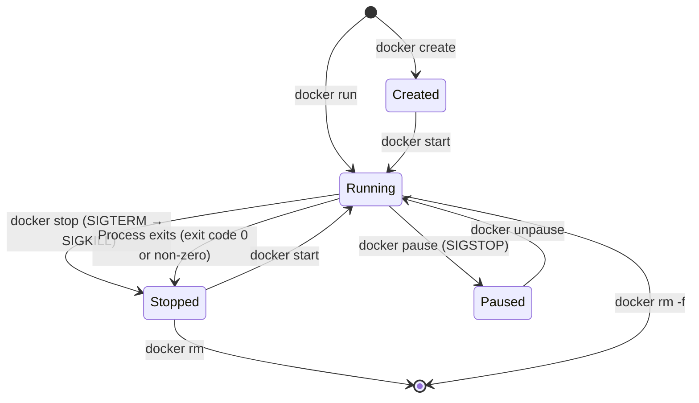

# `docker run` Command: အသေးစိတ် လေ့လာခြင်း

`docker run` ဆိုတာ Docker ရဲ့ အရေးကြီးဆုံး Command တစ်ခု ဖြစ်ပါတယ်။ Flag တစ်ခုချင်းစီက Container ရဲ့ isolation, resources နဲ့ networking တွေကို သီးသန့် ထိန်းချုပ်ပေးပါတယ်။ ဒီအကြောင်းအရာကို အသေးစိတ် ခွဲခြမ်းစိတ်ဖြာ ကြည့်ရအောင်။

## docker run Command တစ်ခု၏ တည်ဆောက်ပုံ (Anatomy)

```bash
docker run \
  -d \                                    # Detached (background)
  -p 8080:80 \                            # Port mapping host:container
  --name my-nginx \                       # Friendly name
  --restart unless-stopped \             # Auto-restart policy
  -e NGINX_PORT=80 \                      # Environment variable
  -v /host/path:/container/path \        # Volume or bind mount
  --network my-network \                 # Connect to network
  --memory 256m \                        # Memory limit
  --cpus 0.5 \                           # CPU limit (half a core)
  nginx:alpine                           # Image (repo:tag)
```

---

## သင့်ရဲ့ ပထမဆုံး Container: NGINX Web Server

```bash
# အရိုးရှင်းဆုံး run နည်း — NGINX ကို foreground မှာ စတင်ရန်
docker run nginx:alpine

# ရပ်တန့်ရန် Ctrl+C နှိပ်ပါ

# Port ချိတ်ဆက်ပြီး background မှာ run ရန်
docker run -d -p 8080:80 --name my-nginx nginx:alpine
# ပြန်ပေါ်လာမည့် ရလဒ်: a3b4c5d6e7f8...  (container ID)

# စမ်းသပ်ကြည့်ရန်
curl http://localhost:8080
# <!DOCTYPE html> ... Welcome to nginx! ...
```

### Flag များကို ခွဲခြမ်းစိတ်ဖြာခြင်း

| Flag | Long form | အဓိပ္ပာယ် |
|------|-----------|---------|
| `-d` | `--detach` | Background မှာ run ပြီး container ID ကို ထုတ်ပြမည် |
| `-p 8080:80` | `--publish` | Host port 8080 ကို container port 80 နဲ့ ချိတ်ဆက်မည် |
| `--name my-nginx` | | လွယ်ကူမှတ်မိမည့် နာမည်တစ်ခု ပေးမည် |
| `-e KEY=VAL` | `--env` | Environment variable တစ်ခု သတ်မှတ်မည် |
| `-v` | `--volume` | Volume သို့မဟုတ် bind mount ကို ချိတ်ဆက်မည် |
| `--rm` | | Container ထွက်သွားသည်နှင့် အလိုအလျောက် ဖယ်ရှားမည် |
| `-it` | | Interactive + TTY (shell သုံးရန်အတွက်) |
| `--restart` | | ပြန်လည်စတင်သည့် ပေါ်လစီ: `no`, `on-failure`, `always`, `unless-stopped` |

---

## မရှိမဖြစ် လိုအပ်သော Container Management Commands များ

```bash
# === Container များကို ကြည့်ရှုရန် ===
docker ps                   # လက်ရှိ run နေသော container များသာ
docker ps -a                # Container အားလုံး (ရပ်နေသည်များ အပါအဝင်)
docker ps -q                # Container ID များသာ (script ရေးရာတွင် အသုံးဝင်သည်)
docker ps --format "table {{.Names}}\t{{.Status}}\t{{.Ports}}"

# === စတင်ခြင်းနှင့် ရပ်တန့်ခြင်း ===
docker stop my-nginx        # SIGTERM ပို့မည် (သေသေသပ်သပ် ပိတ်မည်၊ 10 စက္ကန့်ကြာပြီးနောက် SIGKILL ပို့မည်)
docker start my-nginx       # ရပ်နေသော container ကို ပြန်စမည် (config များကို ထိန်းသိမ်းထားသည်)
docker restart my-nginx     # stop + start လုပ်သည်
docker kill my-nginx        # SIGKILL ကို ချက်ချင်း ပို့မည် (စောင့်ဆိုင်းချိန်မရှိပါ)
docker pause my-nginx       # Process ကို ခေတ္တရပ်မည် (SIGSTOP — အလုပ်လုပ်မှုကို ရပ်ဆိုင်းသည်)
docker unpause my-nginx     # ပြန်လည်စတင်မည်

# === ရှင်းလင်းခြင်း ===
docker rm my-nginx          # ရပ်နေသော container ကို ဖယ်ရှားမည်
docker rm -f my-nginx       # Run နေသော container ကို အတင်းအဓမ္မ ဖယ်ရှားမည်
docker rm $(docker ps -aq)  # Container အားလုံးကို ဖယ်ရှားမည်
docker container prune      # ရပ်နေသော container အားလုံးကို ဖယ်ရှားမည် (အတည်ပြုချက် တောင်းမည်)
```

---

## Container Logs များကို ဖတ်ရှုခြင်း

```bash
# Container စတင်ခဲ့ချိန်မှစ၍ log အားလုံးကို ကြည့်ရန်
docker logs my-nginx

# Real-time ဖြင့် log များကို လိုက်ကြည့်ရန် (tail -f ကဲ့သို့)
docker logs -f my-nginx

# နောက်ဆုံး 50 လိုင်းကိုသာ ကြည့်ရန်
docker logs --tail=50 my-nginx

# အချိန်အမှတ်အသား (Timestamps) များပါ ထည့်သွင်းကြည့်ရန်
docker logs --timestamps my-nginx

# သတ်မှတ်ထားသော အချိန်တစ်ခုမှစ၍ ကြည့်ရန်
docker logs --since 2026-08-18T10:00:00 my-nginx
docker logs --since 5m my-nginx      # နောက်ဆုံး 5 မိနစ်

# Follow, Timestamps နဲ့ Tail အားလုံးကို ပေါင်းသုံးရန်
docker logs -f --timestamps --tail=100 my-nginx
```

---

## Run နေသော Container အတွင်းသို့ ဝင်ရောက်၍ Commands များ လုပ်ဆောင်ခြင်း

```bash
# Run နေသော container ထဲတွင် interactive shell ရယူရန်
docker exec -it my-nginx /bin/sh

# (ယခု container ထဲသို့ ရောက်ရှိနေပါပြီ)
ls /etc/nginx/
cat /etc/nginx/nginx.conf
nginx -t               # nginx config ကို စမ်းသပ်မည်
exit

# Container ထဲတွင် အမြဲမနေဘဲ အမိန့်တစ်ခုတည်းကိုသာ ချက်ချင်း run ပြီး ထွက်ရန်
docker exec my-nginx nginx -t
# nginx: configuration file /etc/nginx/nginx.conf test is successful

# User တစ်ဦးဦး၏ ခွင့်ပြုချက်ဖြင့် run ရန်
docker exec -it --user root my-nginx /bin/sh

# Environment variables များနှင့်အတူ run ရန်
docker exec -it -e DEBUG=true my-nginx /bin/sh
```

---

## Container များကို စစ်ဆေးခြင်း (Inspecting)

```bash
# Container တစ်ခုအကြောင်း အချက်အလက်အပြည့်အစုံကို JSON ဖြင့် ကြည့်ရန်
docker inspect my-nginx

# Go templates ကိုသုံး၍ သီးခြား ကွက်လပ်များကို ထုတ်ယူရန်
docker inspect --format '{{.State.Status}}' my-nginx
# running

docker inspect --format '{{.NetworkSettings.IPAddress}}' my-nginx
# 172.17.0.2

docker inspect --format '{{.HostConfig.PortBindings}}' my-nginx
# map[80/tcp:[{0.0.0.0 8080}]]

# Resource အသုံးပြုမှုကို ကြည့်ရန် (live ဖြင့်၊ top ကဲ့သို့)
docker stats                 # Run နေသော container အားလုံး
docker stats my-nginx        # Container တစ်ခုတည်းအတွက်
docker stats --no-stream     # တစ်ကြိမ်တည်း Snapshot ယူရန်

# Container ထဲတွင် run နေသော process များကို ကြည့်ရန်
docker top my-nginx
# UID   PID   PPID  CMD
# root  1234  1     nginx: master process
# nginx 1235  1234  nginx: worker process
```

---

## Interactive Containers များကို အသုံးပြုခြင်း

အချို့သော လုပ်ဆောင်ချက်များတွင် daemon မပါဘဲ၊ port forward မလုပ်ဘဲ shell တစ်ခုတည်းကိုသာ interactive ဖြင့် run ဖို့ လိုအပ်တတ်သည်:

```bash
# ယာယီ Alpine shell (ထွက်လိုက်သည်နှင့် ပျက်သွားမည်)
docker run --rm -it alpine:latest /bin/sh
# (alpine ထဲတွင်) apk add curl && curl https://example.com
# (alpine ထဲမှ) exit
# Container ကို အလိုအလျောက် ဖယ်ရှားပြီးပါပြီ

# Python script တစ်ခုတည်းကို run ပြီး ထွက်ရန်
docker run --rm python:3.12-alpine python3 -c "print('Hello from Docker!')"
# Hello from Docker!

# Database CLI ကို စမ်းသပ်ကြည့်ရန်
docker run --rm -it postgres:16-alpine psql --version
# psql (PostgreSQL) 16.3

# Node.js ဗားရှင်း သီးသန့်ကို run ရန် (စက်ထဲတွင် တပ်ဆင်ထားစရာမလိုပါ)
docker run --rm -it node:18-alpine node --version
# v18.20.3
```

ဒီပုံစံက အောက်ပါအချက်တွေအတွက် အလွန် အသုံးဝင်ပါတယ်:
- Software version အသစ်တစ်ခုကို စက်ထဲမှာ မသွင်းဘဲ စမ်းသပ်လိုသည့်အခါ
- ကိုယ့်စက်ကို မရှုပ်ပွစေဘဲ CLI tools များကို run လိုသည့်အခါ
- ပတ်ဝန်းကျင်ချင်း မတူညီမှု (Environment differences) များကို ဖြေရှင်း (debug) လုပ်သည့်အခါ

---

## Resource ကန့်သတ်ချက်များ (Resource Constraints)

Production ပတ်ဝန်းကျင်တွင် Container တစ်ခုတည်းက CPU သို့မဟုတ် RAM အားလုံးကို မစားသုံးသွားစေရန် Resource limits များကို အမြဲ သတ်မှတ်ပေးသင့်သည်:

```bash
# Memory ကန့်သတ်ချက်များ
docker run -d \
  --memory 512m \          # Hard limit: ကျော်လွန်သွားပါက ရပ်ပစ်မည် (OOMKilled)
  --memory-swap 512m \     # memory နဲ့ ပမာဏတူသည် = swap မသုံးပါ (အကြံပြုသည်)
  --memory-reservation 256m \   # Soft limit (အတင်းအကျပ် မဟုတ်ပါ၊ ချန်လှပ်ထားပေးခြင်းသာ)
  nginx:alpine

# CPU ကန့်သတ်ချက်များ
docker run -d \
  --cpus 0.5 \             # CPU core တစ်ခုရဲ့ အများဆုံး 50% သာ
  --cpu-shares 512 \       # အချိုးကျ အလေးချိန် (မူလတန်ဖိုး 1024 — နည်းလေ ဦးစားပေးမှု နိမ့်လေ)
  nginx:alpine

# Resource အသုံးပြုမှုကို စစ်ဆေးရန်
docker stats --no-stream
# NAME        CPU %   MEM USAGE / LIMIT   MEM %
# my-nginx    0.0%    3.5MiB / 512MiB     0.68%
```

---

## Container သက်တမ်းစက်ဝန်း (Lifecycle Diagram)



---

## Host နှင့် Container အကြား ဖိုင်များ ကူးယူခြင်း

```bash
# Host မှ Container ထဲသို့ ကူးယူရန်
docker cp ./nginx.conf my-nginx:/etc/nginx/nginx.conf

# Container မှ Host သို့ ကူးယူရန်
docker cp my-nginx:/var/log/nginx/access.log ./access.log

# ဖိုင်တွဲ (Directory) တစ်ခုလုံးကို ကူးယူရန်
docker cp my-nginx:/etc/nginx/ ./nginx-config/
```

---

## လက်တွေ့အသုံးများသော Commands များ (Practical Reference)

```bash
# စတင်ခြင်း + အလုပ်လုပ်မှုကို စစ်ဆေးခြင်း
docker run -d -p 8080:80 --name app nginx:alpine
docker ps
curl http://localhost:8080

# အလုပ်မလုပ်တော့သော container ကို ဖြေရှင်းခြင်း (Debug)
docker logs app                       # စတင်ချိန်က Error များကို စစ်ဆေးရန်
docker inspect app | grep -i health   # ကျန်းမာရေး အခြေအနေကို စစ်ဆေးရန်
docker exec -it app /bin/sh          # အတွင်းပိုင်းကို ဝင်ရောက်စစ်ဆေးရန်

# အားလုံးကို ရှင်းလင်းခြင်း
docker stop app && docker rm app
# သို့မဟုတ် အတင်းအဓမ္မ ဖယ်ရှားရန်:
docker rm -f app

# အဓိကရှင်းလင်းရေး နည်းလမ်း: container + image + network + volume အားလုံးကို ဖယ်ရှားမည်
docker system prune -a --volumes      # ⚠️ နောက်ပြန်လှည့်၍ မရပါ
```

---

## အနှစ်ချုပ်

`docker run` ဆိုတာ Docker ရဲ့ အခြေခံအကျဆုံး အစိတ်အပိုင်း ဖြစ်ပါတယ်:
- `-d` က background မှာ run ပေးပြီး၊ `-it` က interactive terminal အတွက်ဖြစ်ကာ၊ `--rm` က exit လုပ်ပြီးတာနဲ့ အလိုအလျောက် ရှင်းလင်းပေးပါတယ်
- `-p host:container` က port တွေကို ချိတ်ဆက်ပေးပြီး၊ `-e KEY=VAL` က env vars များကို သတ်မှတ်ပေးကာ၊ `-v` က volume များကို mount လုပ်ပေးပါတယ်
- `docker logs -f` က container ရဲ့ output များကို ထုတ်ပြပေးပြီး၊ `docker exec -it ... /bin/sh` က container ထဲကို shell နဲ့ ဝင်ရောက်နိုင်စေပါတယ်
- `docker inspect` က metadata အပြည့်အစုံကို ထုတ်ပြပေးပြီး၊ `docker stats` က live resource အသုံးပြုမှုကို ပြသပေးပါတယ်
- `docker stop` က SIGTERM ကို ပို့ပေးပြီး (သေသေသပ်သပ် ပိတ်ခြင်း)၊ `docker kill` က SIGKILL ကို ပို့ပေးပါတယ် (ချက်ချင်းပိတ်ခြင်း)
- Production ပတ်ဝန်းကျင်တွေအတွက် `--memory` နဲ့ `--cpus` limits များကို အမြဲ သတ်မှတ်ပေးသင့်ပါတယ်

နောက် သင်ခန်းစာမှာတော့ ကိုယ်ပိုင် application တစ်ခုကို Docker image အဖြစ် ဖန်တီးဖို့အတွက် `Dockerfile` ကို ကိုယ်တိုင် ရေးသားသွားမှာ ဖြစ်ပါတယ်။