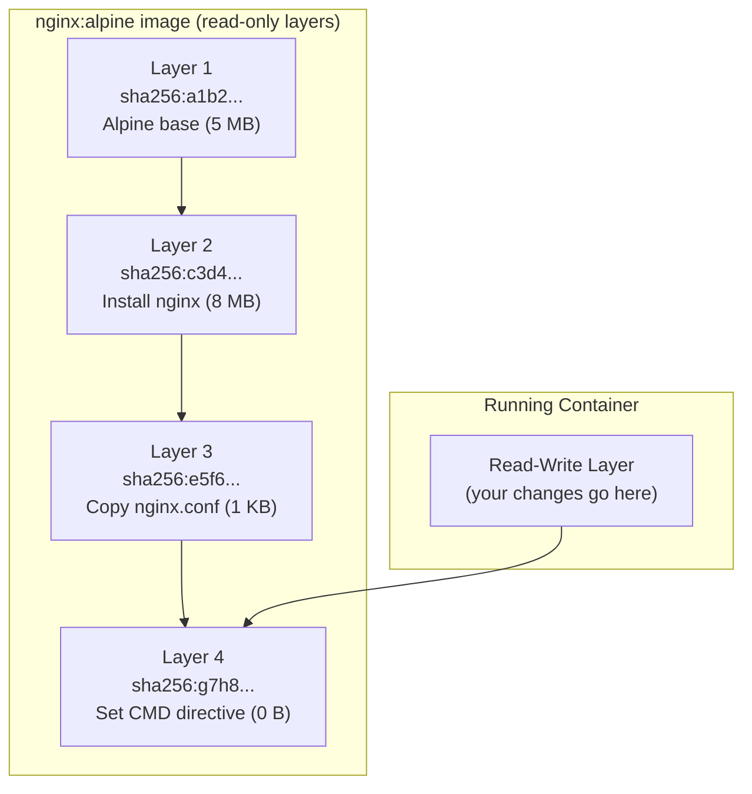

# Build အမြန်နှုန်းက ဘာကြောင့် အရေးကြီးတာလဲ

CI/CD build အချိန်တိုင်းရဲ့ တစ်စက္ကန့်ချင်းစီဟာ သင့်အဖွဲ့သားတွေအတွက် အဆပေါင်းများစွာ အချိန်ကုန်သက်သာစေပါတယ်။ Developers ၅ ဦးက တစ်နေ့ကို commit ၁၀ ခုစီ ပို့ကြပြီး သင့်ရဲ့ Docker build က ၅ မိနစ်ကြာမယ်ဆိုရင် — ဒါဟာ **တစ်နေ့ကို developer တွေ စောင့်ဆိုင်းရတဲ့ အချိန် ၂၅၀ မိနစ်** ဖြစ်လာပြီး CI compute ကုန်ကျစရိတ်တွေပါ ပိုများလာစေပါတယ်။

Docker ရဲ့ layer cache ကို နားလည်ထားခြင်းအားဖြင့် build လုပ်ချိန်ကို ၅ မိနစ်ကနေ ၁၅ စက္ကန့်အထိ လျှော့ချနိုင်ပါတယ်။

---

## Layers ဘယ်လိုအလုပ်လုပ်လဲ: စိတ်ကူးပုံဖော်ကြည့်ခြင်း

Dockerfile ထဲက ညွှန်ကြားချက်တိုင်းဟာ **layer** တစ်ခုကို ဖန်တီးပေးပါတယ် — ဒါဟာ SHA256 hash နဲ့ သိမ်းဆည်းထားတဲ့ ပြောင်းလဲလို့မရတဲ့၊ အကြောင်းအရာအခြေခံတဲ့ ဖိုင်စနစ် snapshot တစ်ခု ဖြစ်ပါတယ်။



ပုံရိပ် (image) တစ်ခုကို တည်ဆောက်တဲ့အခါ Docker က ညွှန်ကြားချက်တိုင်းကို သူ့ရဲ့ cache နဲ့ တိုက်စစ်ပါတယ်-
၁။ ဒီညွှန်ကြားချက်ဟာ ယခင် build တုန်းကအတိုင်း **အတိအကျ တူညီပါသလား**?
၂။ ကူးယူနေတဲ့ **အကြောင်းအရာ (content)** ကရော **အတိအကျ တူညီပါသလား** (`COPY` ညွှန်ကြားချက်တွေအတွက်)?
၃။ နှစ်ခုစလုံး ဟုတ်တယ်ဆိုရင် → **cache hit** (layer ကို ပြန်သုံးမယ်၊ ပြန်မလုပ်တော့ဘူး)
၄။ မဟုတ်ဘူးဆိုရင် → **cache miss** (ပြန်လုပ်မယ်) ပြီးတော့ **နောက်လာမယ့် layer အားလုံးကိုပါ အကျုံးမဝင်တော့အောင် (invalidate) လုပ်ပစ်မယ်**

**ရွှေစည်းမျဉ်း**: Layer N မှာ cache miss ဖြစ်သွားပြီဆိုရင် အပြောင်းအလဲ မရှိသေးရင်တောင်မှ နောက်လာမယ့် N+1၊ N+2၊ N+3... layer တွေ အားလုံးကိုပါ အစကနေ ပြန်လုပ်ခိုင်းပါလိမ့်မယ်။

---

## အဖြစ်များဆုံး အမှား: မလုပ်ခင် ကူးယူခြင်း (Copy Before Install)

```dockerfile
# ❌ အမှားအယွင်းရှိသော အစဉ်လိုက် — ကုဒ်အပြောင်းအလဲရှိတိုင်း cache ပျက်သွားမည်
FROM node:20-alpine
WORKDIR /app
COPY . .             # ဖိုင်အားလုံးကို ကူးယူသည် (src, package.json, README စသည်ဖြင့်)
RUN npm install      # ဖိုင်တစ်ခုခု ပြောင်းလဲတိုင်း အမြဲတမ်း အစကနေ ပြန်လုပ်သည်!
CMD ["node", "server.js"]
```

**ပြဿနာ**: `server.js` ထဲက စာကြောင်းတစ်ကြောင်းကို ပြောင်းလိုက်တိုင်း `COPY . .` layer က အပြောင်းအလဲကို တွေ့ရှိသွားပါတယ်။ ဒါဟာ သူ့အောက်မှာ ရှိတဲ့ `RUN npm install` layer ကို အကျုံးမဝင်တော့အောင် (invalidate) လုပ်ပစ်ပါတယ်။ `package.json` မှာ ဘာမှမပြောင်းလဲသေးရင်တောင်မှ Docker က `node_modules` အားလုံးကို ဒေါင်းလုဒ်ဆွဲပြီး ပြန် install လုပ်ပါလိမ့်မယ်။

npm dependencies ၅၀၀ ပါတဲ့ ပရောဂျက်တစ်ခုမှာ `npm install` က ၃ မိနစ်ကနေ ၅ မိနစ်အထိ ကြာနိုင်ပါတယ်။ commit တိုင်းမှာ အဲဒီလိုလုပ်တာက အချိန်ကုန် လူပင်ပန်းစေပါတယ်။

---

## ဖြေရှင်းချက်: Layer စီစဉ်ပုံ အဓိကမူ

သင့်ရဲ့ ညွှန်ကြားချက်တွေကို **"ပြောင်းလဲဖို့ အခွင့်အလမ်း အနည်းဆုံး"** ကနေ **"ပြောင်းလဲဖို့ အခွင့်အလမ်း အများဆုံး"** ဆီသို့ စီစဉ်ပါ-

```dockerfile
# ✅ မှန်ကန်သော အစဉ်လိုက် — cache အတွက် အကောင်းဆုံးဖြစ်အောင် ပြင်ဆင်ထားသည်
FROM node:20-alpine
WORKDIR /app

# အဆင့် ၁: package ဖိုင်များကိုသာ ကူးယူပါ (အလွန်ရှားပါးစွာ ပြောင်းလဲသည်)
COPY package.json package-lock.json ./

# အဆင့် ၂: dependencies များကို install လုပ်ပါ (`package.json` မပြောင်းသမျှ cache မှ လာမည်)
RUN npm ci

# အဆင့် ၃: source code ကို ကူးယူပါ (မကြာခဏ ပြောင်းလဲသည် — နောက်ဆုံးမှ လုပ်ဆောင်မည်)
COPY . .

CMD ["node", "server.js"]
```

အခုအခါမှာ `server.js` ကို ပြောင်းလိုက်တဲ့အခါ-
- Layer 1 (`FROM`): cache hit ဖြစ်သည် ✅
- Layer 2 (`WORKDIR`): cache hit ဖြစ်သည် ✅
- Layer 3 (`COPY package.json`): cache hit ဖြစ်သည် ✅ (`package.json` မပြောင်းလဲပါ)
- Layer 4 (`RUN npm ci`): cache hit ဖြစ်သည် ✅ (လုံးဝ ကျော်သွားသည်!)
- Layer 5 (`COPY . .`): cache miss ဖြစ်သည် ❌ (ဤ layer တစ်ခုတည်းသာ အစကနေ ပြန်လုပ်သည် — ၀.၁ စက္ကန့်သာ ကြာသည်)

**ရလဒ်**: Build လုပ်ချိန်က ၅ မိနစ်ကနေ ၃ စက္ကန့်အထိ သိသိသာသာ လျော့ကျသွားပါတယ်။

---

## ပရိုဂရမ်ဘာသာစကားအလိုက် Cache ကို အကောင်းဆုံးပြင်ဆင်ခြင်း ပုံစံများ

### Python (pip)

```dockerfile
FROM python:3.12-alpine
WORKDIR /app

# Dependency ဖိုင်များကို အရင်ကူးယူပါ
COPY requirements.txt ./
RUN pip install --no-cache-dir -r requirements.txt

# App ကုဒ်ကို နောက်ဆုံးမှ ကူးယူပါ
COPY . .
CMD ["python", "app.py"]
```

### Go (go modules)

```dockerfile
FROM golang:1.22-alpine AS builder
WORKDIR /app

# Module ဖိုင်များကို အရင်ကူးယူပါ — go mod download ကို သီးသန့် cache လုပ်ထားမည်
COPY go.mod go.sum ./
RUN go mod download

# Source code ကို နောက်ဆုံးမှ ကူးယူပါ
COPY . .
RUN go build -o server ./cmd/server
```

### Java (Maven)

```dockerfile
FROM maven:3.9-eclipse-temurin-21 AS builder
WORKDIR /app

# POM ဖိုင်ကို အရင်ကူးယူပါ — dependency ဒေါင်းလုဒ်ဆွဲခြင်းကို cache လုပ်မည်
COPY pom.xml ./
RUN mvn dependency:go-offline -B    # dependencies အားလုံးကို local cache သို့ ဒေါင်းလုဒ်ဆွဲမည်

# Source code ကို နောက်ဆုံးမှ ကူးယူပါ
COPY src/ ./src/
RUN mvn package -DskipTests
```

---

## CI/CD တွင် Build Cache အသုံးပြုခြင်းဆိုင်ရာ စိန်ခေါ်မှုများ

local ဖွံ့ဖြိုးတိုးတက်မှုကို အမြန်ဆန်ဆုံးဖြစ်စေတဲ့ per-build cache ဟာ **CI run တစ်ခုနဲ့ တစ်ခုကြားမှာ ပျောက်ဆုံးသွားပါတယ်** — GitHub Actions job တိုင်းဟာ runner အသစ်စက်စက်နဲ့ စတင်ပါတယ်။

Cache မပါဘဲနဲ့ဆိုရင် CI build တိုင်းက dependencies တွေအားလုံးကို အစကနေ ပြန်ဒေါင်းလုဒ်လုပ်ပါလိမ့်မယ်။ Cache စနစ်တွေကို အသုံးပြုမယ်ဆိုရင်တော့ build မလုပ်ခင်မှာ cache လုပ်ထားတဲ့ layer တွေကို ပြန်လည်ဖော်ဆောင်ပေးနိုင်ပါတယ်။

### ဗျူဟာ ၁: GitHub Actions Cache (BuildKit)

```yaml
# .github/workflows/build.yml
- name: Set up Docker Buildx
  uses: docker/setup-buildx-action@v3

- name: Build and push with cache
  uses: docker/build-push-action@v5
  with:
    context: .
    push: true
    tags: ghcr.io/yourorg/app:${{ github.sha }}
    # GitHub Actions cache store သို့ cache ကို ပို့မည်
    cache-from: type=gha
    cache-to: type=gha,mode=max
```

**mode=max** က နောက်ဆုံး image တင်မကဘဲ ကြားခံ layer (intermediate layer) တိုင်းကိုပါ cache လုပ်ပေးပါတယ်။ ဒါဟာ branch အမျိုးမျိုးကြားမှာ cache ကို ပြန်လည်အသုံးပြုနိုင်မှုကို အမြင့်ဆုံးဖြစ်စေပါတယ်။

### ဗျူဟာ ၂: Registry Cache (container registry ထဲတွင် cache layer များကို သိမ်းဆည်းခြင်း)

```yaml
- name: Build with registry cache
  uses: docker/build-push-action@v5
  with:
    context: .
    push: true
    tags: ghcr.io/yourorg/app:latest
    cache-from: type=registry,ref=ghcr.io/yourorg/app:buildcache
    cache-to: type=registry,ref=ghcr.io/yourorg/app:buildcache,mode=max
```

Cache layer တွေကို registry ထဲမှာ manifest တစ်ခုအနေနဲ့ သိမ်းဆည်းထားပါတယ် — CI runner အမျိုးမျိုးနဲ့ စက်တွေကြားမှာ အလုပ်လုပ်ပါတယ်။

### ဗျူဟာ ၃: Local Registry Cache (ကိုယ်တိုင် Host လုပ်ထားသော runner များအတွက်)

```bash
# ယခင် image ဖြင့် local Docker layer cache ကို ကြိုတင်ပြင်ဆင်ပါ
docker pull ghcr.io/yourorg/app:latest || true  # ပထမအကြိမ် build ဖြစ်လျှင် အမှားမတက်စေရန်
docker build \
  --cache-from=ghcr.io/yourorg/app:latest \
  -t ghcr.io/yourorg/app:$GIT_SHA \
  -t ghcr.io/yourorg/app:latest \
  .
docker push ghcr.io/yourorg/app:$GIT_SHA
docker push ghcr.io/yourorg/app:latest
```

---

## Layer အရေအတွက်နှင့် Image အရွယ်အစားကို လျှော့ချခြင်း

### RUN ညွှန်ကြားချက်များကို ပေါင်းစပ်ပါ

```dockerfile
# အဆိုးဆုံး: layer ၄ ခု၊ layer တစ်ခုတည်းအတွင်းမှာ cache ကို ရှင်းလင်းလို့ မရပါ
RUN apt-get update
RUN apt-get install -y curl wget git
RUN apt-get clean
RUN rm -rf /var/lib/apt/lists/*

# အကောင်းဆုံး: layer ၁ ခု၊ အဆင့်တူညီစွာဖြင့် package cache ကို ရှင်းလင်းပြီးသား ဖြစ်သည်
RUN apt-get update \
    && apt-get install -y --no-install-recommends \
       curl \
       wget \
       git \
    && apt-get clean \
    && rm -rf /var/lib/apt/lists/*
```

### Package Manager များအတွက် `--no-cache` အလံများကို အသုံးပြုပါ

```dockerfile
# Alpine: --no-cache သည် index cache ကို ဒစ်ဂျစ်တယ်ပေါ်သို့ ရေးသားခြင်းကို ရှောင်ရှားသည်
RUN apk add --no-cache curl wget

# npm: --no-cache သည် image အတွင်းရှိ npm ၏ ကိုယ်ပိုင် cache layer ကို တားဆီးပေးသည်
RUN npm ci --no-audit --no-fund

# pip: --no-cache-dir သည် pip ၏ ဒေါင်းလုဒ် cache ကို ရှောင်ရှားသည်
RUN pip install --no-cache-dir -r requirements.txt
```

### တူညီသော RUN Layer ထင်းတွင်ပင် ရှင်းလင်းပါ

```dockerfile
# တည်ဆောက်ရေး ပစ္စည်းကိရိယာများကို install လုပ်သည်၊ compile လုပ်သည်၊ ထို့နောက် ပြန်ဖျက်သည် — အားလုံးသည် layer တစ်ခုတည်းတွင် ဖြစ်သည်
RUN apk add --no-cache --virtual .build-deps \
      python3 make g++ \
    && npm ci \
    && apk del .build-deps    # နောက်ဆုံး layer မှ တည်ဆောက်ရေး ပစ္စည်းကိရိယာများကို ဖယ်ရှားပါ
```

`--virtual` အလံက ပက်ကေ့ဂျ်တွေကို virtual အမည်တစ်ခုအောက်မှာ စုစည်းပေးပြီး အစုလိုက်ဖယ်ရှားရတာ လွယ်ကူစေပါတယ်။ install လုပ်တာနဲ့ delete လုပ်တာဟာ layer တူတူမှာပဲ ဖြစ်ပျက်သွားတဲ့အတွက် စုစုပေါင်း image ထဲမှာ တည်ဆောက်ရေး ပစ္စည်းကိရိယာတွေ ပါမလာတော့ပါဘူး။

---

## Image အရွယ်အစားနှင့် Layer များကို စစ်ဆေးခြင်း

```bash
# image အရွယ်အစားကို စစ်ဆေးပါ
docker images my-api
# REPOSITORY   TAG     SIZE
# my-api       v1.0    230MB   ← အကောင်းဆုံး မဖြစ်ခင်က
# my-api       v2.0    89MB    ← အကောင်းဆုံး ဖြစ်သွားပြီးနောက်

# docker history ဖြင့် layer များကို ကြည့်ရှုပါ
docker history my-api:v1.0
# IMAGE          CREATED BY                                      SIZE
# abc123         CMD ["node" "server.js"]                        0B
# def456         COPY . . #buildkit                              45.2MB
# ghi789         RUN npm ci                                      180MB   ← npm ကြောင့် ကြီးနေခြင်း
# jkl012         COPY package*.json ./                           12KB
# mno345         WORKDIR /app                                    0B
# pqr678         FROM node:20-alpine                             7.6MB

# layer တစ်ခုချင်းစီကို အမြင်အာရုံဖြင့် စစ်ဆေးရန် dive ကို အသုံးပြုပါ
# brew install dive  (သို့မဟုတ်: docker run --rm -it wagoodman/dive my-api:v1.0)
dive my-api:v1.0
```

**dive** က layer တစ်ခုချင်းစီမှာ ဘယ်ဖိုင်တွေ ထည့်သွင်းထားလဲ သို့မဟုတ် ဖယ်ရှားထားလဲဆိုတာကို အတိအကျ ပြသပေးပါတယ် — သင့် image ကို ဘာတွေက ပိုလေးနေစေလဲဆိုတာ ရှာဖွေဖို့အတွက် အလွန်တရာ အဖိုးတန်ပါတယ်။

---

## BuildKit: Docker ၏ ခေတ်မီ Build အင်ဂျင်

BuildKit ဟာ Docker 23 ကစလို့ မူလတန်းဝင် (default) build အင်ဂျင် ဖြစ်လာခဲ့ပါပြီ။ ဒါက အောက်ပါတို့ကို ပံ့ပိုးပေးပါတယ်-
- multi-stage build များတွင် **အဆင့်များကို ပြိုင်တူ လုပ်ဆောင်ခြင်း (Parallel stage execution)**
- **ပိုမိုကောင်းမွန်သော cache စီမံခန့်ခွဲမှု**
- **Secret mounts** (layer ထဲကို ပေါက်ကြားသွားခြင်းမရှိဘဲ build လုပ်ချိန်မှာ secret များကို ထည့်သွင်းပေးခြင်း)
- **SSH agent forwarding** (private git repo များအတွက်)

```bash
# BuildKit အလုပ်လုပ်နေခြင်း ရှိမရှိ စစ်ဆေးပါ (မူလအတိုင်း ဖြစ်သင့်သည်)
docker buildx version
# github.com/docker/buildx v0.14.0

# layer ထဲသို့ မရောက်သွားစေဘဲ build လုပ်ချိန်တွင် secret များကို ထည့်သွင်းပါ
docker build \
  --secret id=npmtoken,env=NPM_TOKEN \
  -t my-api .

# Dockerfile ထဲတွင် secret ကို layer တစ်ခုတည်းမှာပင် မပေါ်စေဘဲ ဝင်ရောက်အသုံးပြုနိုင်သည်:
# RUN --mount=type=secret,id=npmtoken \
#     NPM_TOKEN=$(cat /run/secrets/npmtoken) npm install

# private git repository များအတွက် SSH agent forwarding
docker build --ssh default -t my-api .
# RUN --mount=type=ssh git clone git@github.com:yourorg/private-repo.git
```

---

## အနှစ်ချုပ်

Layer caching ဟာ ရရှိနိုင်တဲ့ အထိရောက်ဆုံး အကောင်းဆုံးပြင်ဆင်မှုတွေထဲက တစ်ခု ဖြစ်ပါတယ်-
- ညွှန်ကြားချက်များကို ပြောင်းလဲမှု အနည်းဆုံးမှ အများဆုံးဆီသို့ **အစဉ်လိုက် စီစဉ်ပါ** — `COPY package.json` ကို `COPY . .` ရဲ့ ရှေ့မှာ ထားပါ။
- မည်သည့် layer မှာမဆို cache miss ဖြစ်သွားပါက အပြောင်းအလဲ မရှိသေးသော **နောက်လာမယ့် layer အားလုံးကိုပါ** အကျုံးမဝင်တော့အောင် (invalidate) လုပ်ပစ်ပါလိမ့်မယ်။
- ဆက်စပ်နေသော **RUN ညွှန်ကြားချက်များကို ညွှန်ကြားချက်တစ်ခုတည်းအဖြစ် ပေါင်းစပ်ပါ**; တူညီသော `RUN` ထဲမှာပင် package cache တွေနဲ့ temp ဖိုင်တွေကို ရှင်းလင်းပါ။
- CI/CD တွင် run တစ်ခုနဲ့ တစ်ခုကြား cache ကို ဆက်လက်ထိန်းသိမ်းထားရန် `type=gha` (သို့) `type=registry` cache backend များကို အသုံးပြုပါ။
- image layer တစ်ခုချင်းစီရဲ့ အတွင်းပိုင်းကို စစ်ဆေးဖို့အတွက် **`dive`** ဟာ အကောင်းဆုံးကိရိယာ ဖြစ်ပါတယ်။
- **BuildKit** (`--mount=type=secret`) က layer ထဲကို ပေါက်ကြားသွားခြင်းမရှိဘဲ build လုပ်ချိန်မှာ လုံခြုံစွာ secret ထည့်သွင်းမှုကို ခွင့်ပြုပေးပါတယ်။

နောက်သင်ခန်းစာမှာတော့ minimal production image တွေကို ထုတ်လုပ်နိုင်ဖို့အတွက် compile လုပ်တဲ့ ပတ်ဝန်းကျင်နဲ့ runtime ပတ်ဝန်းကျင်တွေကို ခွဲထုတ်ပေးမယ့် multi-stage build အကြောင်းကို သင်ယူရမှာ ဖြစ်ပါတယ်။