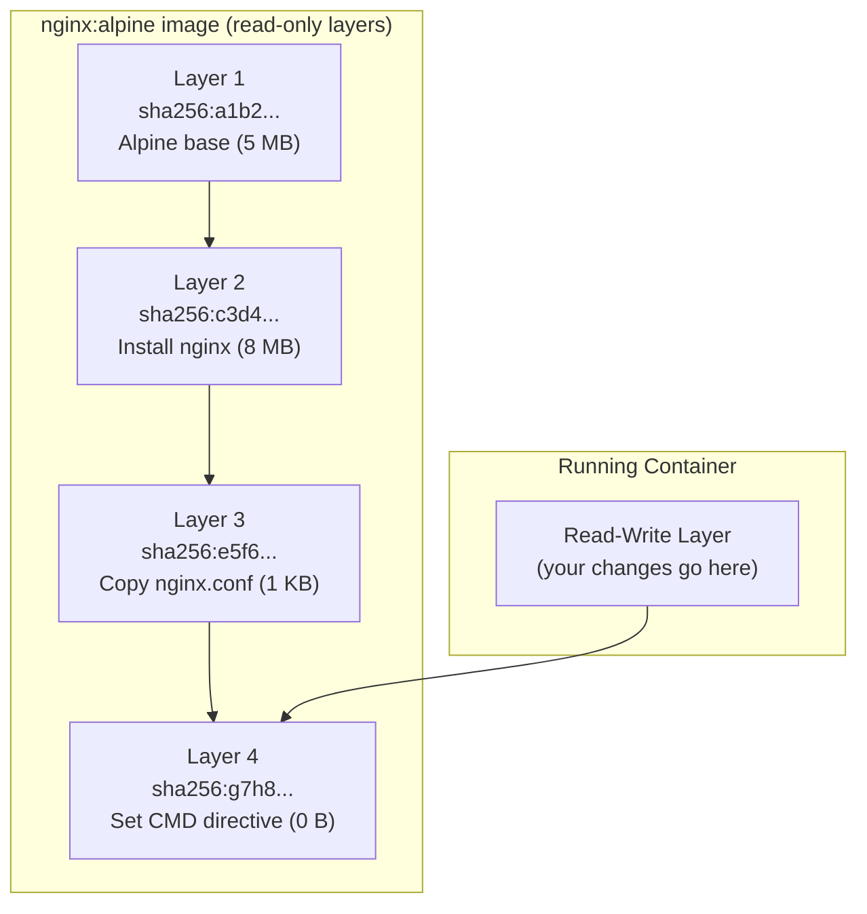

# Build Speed က ဘไมို့ အရေးကြီးတာလဲ

CI/CD build time ရဲ့ တစ်စက္ကန့်တိုင်းဟာ သင့် team တစ်ခုလုံးအတွက် အဆပေါင်းများစွာ သက်ရောက်မှုရှိပါတယ်။ Developer ၅ ယောက်က တစ်ယောက်ကို commit ၁၀ ခုနှုန်းနဲ့ တစ်နေ့မှာ push ကြတယ်၊ ပြီးတော့ သင့် Docker build က ၅ မိနစ်ကြာတယ်ဆိုရင် — ဒါဟာ **တစ်ရက်ကို developer တွေ စောင့်နေရတဲ့အချိန် စုစုပေါင်း မိနစ် ၂၅၀** ဖြစ်ပြီး CI compute ကုန်ကျစရိတ်တွေလည်း ပိုကုန်ပါတယ်။

Docker ရဲ့ layer cache အလုပ်လုပ်ပုံကို နားလည်ထားခြင်းအားဖြင့် build ကြာချိန်ကို ၅ မိနစ်ကနေ ၁၅ စက္ကန့်အထိ လျှော့ချနိုင်ပါတယ်။

---

## Layers ဘယ်လိုအလုပ်လုပ်လဲ: Mental Model တစ်ခု

Dockerfile ထဲက instruction တိုင်းဟာ SHA256 hash နဲ့ သိမ်းဆည်းထားတဲ့ ပြောင်းလဲလို့မရတဲ့ (immutable)၊ content-addressable ဖြစ်တဲ့ filesystem snapshot တစ်ခုဖြစ်တဲ့ **layer** တစ်ခုကို ဖန်တီးပေးပါတယ်။



Image တစ်ခုကို build တဲ့အခါ Docker ဟာ instruction တစ်ခုချင်းစီကို သူ့ရဲ့ cache နဲ့ တိုက်ဆိုင်စစ်ဆေးပါတယ်-
1. ဒီ instruction ဟာ အရင် build တုန်းကနဲ့ **လုံးဝတူညီရဲ့လား**?
2. Copy ကူးနေတဲ့ **content** ကော (`COPY` instructions တွေအတွက်) **တူညီရဲ့လား**?
3. နှစ်ခုစလုံး မှန်တယ်ဆိုရင် → **cache hit** (layer ကို ပြန်သုံးမယ်၊ ပြန်မ run ဘဲ ကျော်မယ်)
4. မမှန်ဘူးဆိုရင် → **cache miss** (ပြန် run မယ်) ပြီးတော့ **နောက်လာမယ့် layer အားလုံးကိုပါ invalidate လုပ်ပစ်မယ်** (cache ပျက်သွားမယ်)

**ရွှေစည်းမျဉ်း**: Layer N မှာ cache miss ဖြစ်သွားပြီဆိုရင် အဲ့ဒီနောက်က layer တွေဖြစ်တဲ့ N+1၊ N+2၊ N+3... တွေမှာ ဘာမှမပြောင်းလဲသေးရင်တောင် အကုန်လုံးကို အသစ်ပြန် run ရပါတော့တယ်။

---

## ဂန္ထဝင်အမှား: Install မလုပ်ခင် Copy အရင်လုပ်ခြင်း

```dockerfile
# ❌ WRONG ORDER — destroys cache on every code change
FROM node:20-alpine
WORKDIR /app
COPY . .             # Copies ALL files (src, package.json, README, etc.)
RUN npm install      # Re-runs every time ANY file changes!
CMD ["node", "server.js"]
```

**ပြဿနာ**: `server.js` ထဲမှာ စာတစ်ကြောင်းပဲ ပြောင်းလိုက်ရင်တောင် `COPY . .` layer က အပြောင်းအလဲကို သိသွားပါတယ်။ ဒါဟာ သူ့အောက်က `RUN npm install` layer ကို cache ပျက်သွားစေပါတယ်။ `package.json` မှာ ဘာမှမပြောင်းလဲသေးရင်တောင် Docker က `node_modules` အားလုံးကို ဒေါင်းလုဒ်ပြန်ဆွဲပြီး npm install ကို အစကနေ ပြန်လုပ်ပါတယ်။

npm dependencies ၅၀၀ ပါတဲ့ project တစ်ခုမှာဆိုရင် `npm install` က ၃ မိနစ်ကနေ ၅ မိနစ်အထိ ကြာနိုင်ပါတယ်။ commit တိုင်းမှာ အဲ့ဒီလိုလုပ်နေတာဟာ အချိန်နဲ့ ကုန်ကျစရိတ် အလွန်များပါတယ်။

---

## ဖြေရှင်းချက်: Layer တွေစီစဉ်ပုံ စည်းမျဉ်း (Layer Ordering Principle)

သင့်ရဲ့ instruction တွေကို **"ပြောင်းလဲဖို့အရာရာ အနည်းဆုံး"** ကနေ **"အမြဲလိုလို ပြောင်းလဲနေတဲ့ အရာ"** ဆီကို စီစဉ်ပါ-

```dockerfile
# ✅ CORRECT ORDER — cache-optimized
FROM node:20-alpine
WORKDIR /app

# Step 1: Copy ONLY the package files (rarely change)
COPY package.json package-lock.json ./

# Step 2: Install dependencies (cached unless package.json changes)
RUN npm ci

# Step 3: Copy source code (changes frequently — runs last)
COPY . .

CMD ["node", "server.js"]
```

အခုလိုဆိုရင် `server.js` ကို ပြောင်းလိုက်တဲ့အခါ-
- Layer 1 (`FROM`): cache hit ✅
- Layer 2 (`WORKDIR`): cache hit ✅
- Layer 3 (`COPY package.json`): cache hit ✅ (package.json မပြောင်းလဲပါဘူး)
- Layer 4 (`RUN npm ci`): cache hit ✅ (လုံးဝ ကျော်သွားပါတယ်!)
- Layer 5 (`COPY . .`): cache miss ❌ (ဒီ layer တစ်ခုတည်းသာ အသစ်ပြန် run ပါမယ် - ၀.၁ စက္ကန့်ပဲ ကြာပါတယ်)

**ရလဒ်**: Build ကြာချိန်ဟာ ၅ မိနစ်ကနေ ၃ စက္ကန့်အထိ သိသိသာသာ လျော့ကျသွားပါတယ်။

---

## Language အလိုက် Cache Optimization ပုံစံများ

### Python (pip)

```dockerfile
FROM python:3.12-alpine
WORKDIR /app

# Dependency files first
COPY requirements.txt ./
RUN pip install --no-cache-dir -r requirements.txt

# App code last
COPY . .
CMD ["python", "app.py"]
```

### Go (go modules)

```dockerfile
FROM golang:1.22-alpine AS builder
WORKDIR /app

# Module files first — go mod download is cached independently
COPY go.mod go.sum ./
RUN go mod download

# Source code last
COPY . .
RUN go build -o server ./cmd/server
```

### Java (Maven)

```dockerfile
FROM maven:3.9-eclipse-temurin-21 AS builder
WORKDIR /app

# POM file first — dependency download is cached
COPY pom.xml ./
RUN mvn dependency:go-offline -B    # Download all deps to local cache

# Source code last
COPY src/ ./src/
RUN mvn package -DskipTests
```

---

## CI/CD ပေါ်ရှိ Build Cache: စိန်ခေါ်မှု

Local development မှာ build အမြန်လုပ်ပေးတဲ့ per-build cache ဟာ **CI run တိုင်းမှာ ပျောက်သွားပါတယ်** — GitHub Actions job တိုင်းဟာ runner အသစ်စက်စက်နဲ့ပဲ စတင်ကြတာကြောင့်ပါ။

Cache မရှိဘူးဆိုရင် CI build တိုင်းမှာ dependencies တွေ အားလုံးကို အစကနေ ပြန်ဒေါင်းရပါတယ်။ Cache strategy တွေကို သုံးမယ်ဆိုရင်တော့ build မလုပ်ခင်မှာ cached ဖြစ်နေတဲ့ layer တွေကို ပြန်ခေါ်သုံးလို့ရပါတယ်။

### Strategy 1: GitHub Actions Cache (BuildKit)

```yaml
# .github/workflows/build.yml
- name: Set up Docker Buildx
  uses: docker/setup-buildx-action@v3

- name: Build and push with cache
  uses: docker/build-push-action@v5
  with:
    context: .
    push: true
    tags: ghcr.io/yourorg/app:${{ github.sha }}
    # Export cache to GitHub Actions cache store
    cache-from: type=gha
    cache-to: type=gha,mode=max
```

**mode=max** က final image တင်မကဘဲ intermediate layer တိုင်းကိုပါ cache လုပ်ပေးပါတယ်။ ဒါဟာ branch တွေအချင်းချင်း cache ပြန်သုံးနိုင်မှုကို အများဆုံး ဖြစ်စေပါတယ်။

### Strategy 2: Registry Cache (container registry ထဲမှာ layer တွေ cache လုပ်ခြင်း)

```yaml
- name: Build with registry cache
  uses: docker/build-push-action@v5
  with:
    context: .
    push: true
    tags: ghcr.io/yourorg/app:latest
    cache-from: type=registry,ref=ghcr.io/yourorg/app:buildcache
    cache-to: type=registry,ref=ghcr.io/yourorg/app:buildcache,mode=max
```

Cache layer တွေကို သင့်ရဲ့ registry ထဲမှာ special manifest တစ်ခုအနေနဲ့ သိမ်းဆည်းထားပါတယ်။ ဒါဟာ CI runner တွေနဲ့ machine မျိုးစုံကြားမှာ အလုပ်လုပ်ပါတယ်။

### Strategy 3: Local Registry Cache (self-hosted runners တွေအတွက်)

```bash
# Pre-warm the local Docker layer cache with the previous image
docker pull ghcr.io/yourorg/app:latest || true  # Don't fail if first build
docker build \
  --cache-from=ghcr.io/yourorg/app:latest \
  -t ghcr.io/yourorg/app:$GIT_SHA \
  -t ghcr.io/yourorg/app:latest \
  .
docker push ghcr.io/yourorg/app:$GIT_SHA
docker push ghcr.io/yourorg/app:latest
```

---

## Layer အရေအတွက်နဲ့ Image Size ကို လျှော့ချခြင်း

### RUN Commands များကို ပေါင်းစပ်ပါ

```dockerfile
# Bad: 4 layers, cache cannot be cleaned within the same layer
RUN apt-get update
RUN apt-get install -y curl wget git
RUN apt-get clean
RUN rm -rf /var/lib/apt/lists/*

# Good: 1 layer, package cache cleaned in the same step
RUN apt-get update \
    && apt-get install -y --no-install-recommends \
       curl \
       wget \
       git \
    && apt-get clean \
    && rm -rf /var/lib/apt/lists/*
```

### Package Manager တွေအတွက် `--no-cache` Flags ကို သုံးပါ

```dockerfile
# Alpine: --no-cache skips writing the index cache to disk
RUN apk add --no-cache curl wget

# npm: --no-cache prevents npm's own layer of caching inside the image
RUN npm ci --no-audit --no-fund

# pip: --no-cache-dir skips pip's download cache
RUN pip install --no-cache-dir -r requirements.txt
```

### RUN Layer တစ်ခုတည်းမှာပင် Clean Up လုပ်ပါ

```dockerfile
# Installs build tools, compiles, then removes build tools — all in ONE layer
RUN apk add --no-cache --virtual .build-deps \
      python3 make g++ \
    && npm ci \
    && apk del .build-deps    # Remove build tools from the final layer
```

`--virtual` flag က package တွေကို virtual နာမည်တစ်ခုအောက်မှာ စုစည်းပေးပြီး အလွယ်တကူ အစုလိုက် ဖြုတ်ထုတ် (remove) လုပ်လို့ကောင်းစေပါတယ်။ Install လုပ်တာနဲ့ delete လုပ်တာကို layer တစ်ခုတည်းမှာပဲ လုပ်တာဖြစ်တဲ့အတွက် final image ထဲမှာ build tools တွေ ပါမလာတော့ပါဘူး။

---

## Image Size နဲ့ Layers များကို စစ်ဆေးခြင်း (Analysing)

```bash
# Check image size
docker images my-api
# REPOSITORY   TAG     SIZE
# my-api       v1.0    230MB   ← before optimization
# my-api       v2.0    89MB    ← after optimization

# Inspect layers with docker history
docker history my-api:v1.0
# IMAGE          CREATED BY                                      SIZE
# abc123         CMD ["node" "server.js"]                        0B
# def456         COPY . . #buildkit                              45.2MB
# ghi789         RUN npm ci                                      180MB   ← npm bloat
# jkl012         COPY package*.json ./                           12KB
# mno345         WORKDIR /app                                    0B
# pqr678         FROM node:20-alpine                             7.6MB

# Use dive for a visual layer-by-layer inspector
# brew install dive  (or: docker run --rm -it wagoodman/dive my-api:v1.0)
dive my-api:v1.0
```

**dive** tool က layer တစ်ခုချင်းစီမှာ ဘယ် file တွေ ထည့်ထားတယ် ဒါမှမဟုတ် ဖယ်ထုတ်ထားတယ်ဆိုတာကို အတိအကျ ပြသပေးပါတယ်။ Image size ကို ဘာတွေက ပွစေလဲဆိုတာ ရှာဖွေရာမှာ အရမ်းကို တန်ဖိုးရှိတဲ့ tool တစ်ခုဖြစ်ပါတယ်။

---

## BuildKit: Docker ရဲ့ ခေတ်မီ Build Engine

BuildKit ဟာ Docker 23 ကစလို့ default build engine ဖြစ်လာခဲ့ပါတယ်။ ဒါတွေ ပါဝင်ပါတယ်-
- Multi-stage builds တွေမှာ **Parallel stage execution** (အဆင့်တွေကို တွဲလုပ်နိုင်ခြင်း)
- **ပိုမိုကောင်းမွန်တဲ့ cache စီမံခန့်ခွဲမှု**
- **Secret mounts** (layer ထဲကို ပေါက်ကြားမသွားဘဲ build တဲ့အချိန်မှာ secrets တွေကို ထည့်သုံးနိုင်ခြင်း)
- **SSH agent forwarding** (private git repos တွေအတွက်)

```bash
# Verify BuildKit is active (should be default)
docker buildx version
# github.com/docker/buildx v0.14.0

# Pass secrets at build time without baking them into layers
docker build \
  --secret id=npmtoken,env=NPM_TOKEN \
  -t my-api .

# In Dockerfile, access the secret without it appearing in any layer:
# RUN --mount=type=secret,id=npmtoken \
#     NPM_TOKEN=$(cat /run/secrets/npmtoken) npm install

# SSH agent forwarding for private git repositories
docker build --ssh default -t my-api .
# RUN --mount=type=ssh git clone git@github.com:yourorg/private-repo.git
```

---

## အနှစ်ချုပ်

Layer caching ဟာ သက်ရောက်မှု အကြီးမားဆုံး optimization တွေထဲက တစ်ခုဖြစ်ပါတယ်-
- Instruction တွေကို ပြောင်းလဲမှု အနည်းဆုံးကနေ အများဆုံးဆီသို့ **စဉ်ဆက်မပြတ် စီစဉ်ပါ** — `COPY package.json` ကို `COPY . .` ရဲ့ ရှေ့မှာထားပါ။
- ဘယ် layer မှာမဆို cache miss ဖြစ်သွားပြီဆိုရင် မပြောင်းလဲသေးတဲ့ **နောက်လာမယ့် layer အားလုံး** ပါ cache ပျက်သွားပါမယ်။
- ဆက်စပ်နေတဲ့ **RUN command တွေကို instruction တစ်ခုတည်းအဖြစ် ပေါင်းစပ်ပါ**၊ package caches နဲ့ temp files တွေကို `RUN` တစ်ခုတည်းမှာပဲ clean up လုပ်ပါ။
- CI/CD မှာ run တိုင်း layer cache တွေ ဆက်ရှိနေစေဖို့ `type=gha` (သို့) `type=registry` cache backends တွေကို သုံးပါ။
- Image layer တစ်ခုချင်းစီရဲ့ အတွင်းပိုင်းကို စစ်ဆေးဖို့အတွက် **`dive`** ဟာ အကောင်းဆုံး tool ဖြစ်ပါတယ်။
- **BuildKit** (`--mount=type=secret`) က layer တွေထဲကို မပေါက်ကြားစေဘဲ build တဲ့အချိန်မှာ secrets တွေကို လုံလုံခြုံခြုံ ထည့်သွင်းအသုံးပြုနိုင်စေပါတယ်။

နောက်လာမယ့် သင်ခန်းစာမှာတော့ Compile-time environment တွေနဲ့ Runtime environment တွေကို ခွဲထုတ်ပြီး production image အရွယ်အစား အသေးဆုံးဖြစ်အောင် ထုတ်လုပ်ပေးတဲ့ multi-stage builds အကြောင်းကို သင်ယူရမှာ ဖြစ်ပါတယ်။