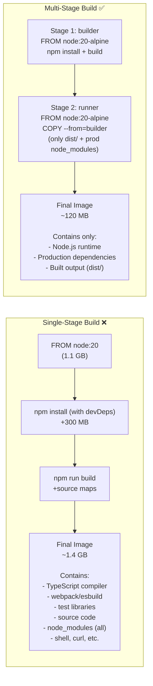

# The Problem: Build Tools Don't Belong in Production

When you compile an application, you need heavy build tools: compilers, SDKs, test frameworks, type checkers, linters, source maps. တစ်ခါတလေ naive Dockerfile တွေမှာ ဒါတွေအားလုံးက final image ထဲ အကုန်ပါသွားတတ်ပါတယ် — တကယ်တော့ running application က အဲဒါတွေ တစ်ခုမှ မလိုပါဘူး။



**The impact**:
- **Smaller image** → pulls ပိုမြန်တယ်၊ Kubernetes မှာ pod startup ပိုမြန်တယ်
- **Smaller attack surface** → compiler မရှိဘူး၊ shell tools တွေ မရှိဘူး၊ attacker တွေ exploit လုပ်လို့ရမယ့် source code တွေ မပါဘူး
- **Less data in transit** → CI/CD မှာ bandwidth cost ပိုသက်သာတယ်

---

## The Core Concept: `COPY --from`

Multi-stage builds တွေမှာ `FROM` statements တွေ အများကြီးသုံးပါတယ်။ `FROM` တစ်ခုချင်းစီက သူ့ရဲ့ကိုယ်ပိုင် filesystem နဲ့ fresh stage တစ်ခုကို စတင်ပါတယ်။ အဓိက magic ကတော့ `COPY --from=<stage>` ဖြစ်ပြီး၊ ကျန်တာတွေအကုန် ဖယ်ထုတ်ပြီး previous stage က specific files တွေကိုပဲ လှမ်းယူလို့ရစေပါတယ်။

```dockerfile
# Stage 1: heavy build environment
FROM node:20-alpine AS builder     # ← "AS" gives this stage a name
WORKDIR /app
COPY package*.json ./
RUN npm ci                          # installs ALL deps (dev + prod)
COPY . .
RUN npm run build                   # outputs to /app/dist

# Stage 2: minimal runtime (completely fresh filesystem)
FROM node:20-alpine AS runner       # ← new base, nothing from stage 1 yet
WORKDIR /app
COPY package*.json ./
RUN npm ci --only=production        # only prod deps
COPY --from=builder /app/dist ./dist  # ← only pull the compiled output!

CMD ["node", "dist/server.js"]
# The compiler, devDependencies, source files, and test code
# are NOT in this final image — they stayed in the builder stage
```

---

## Pattern 1: Node.js / Next.js

```dockerfile
# ── Deps: install all dependencies ─────────────────────────────────────
FROM node:20-alpine AS deps
RUN apk add --no-cache libc6-compat
WORKDIR /app
COPY package.json package-lock.json ./
RUN npm ci

# ── Builder: compile the application ───────────────────────────────────
FROM node:20-alpine AS builder
WORKDIR /app
COPY --from=deps /app/node_modules ./node_modules
COPY . .

# Build-time env (doesn't persist to runtime)
ARG NEXT_PUBLIC_API_URL
ENV NEXT_PUBLIC_API_URL=${NEXT_PUBLIC_API_URL}
ENV NEXT_TELEMETRY_DISABLED=1

RUN npx prisma generate && npm run build

# ── Runner: minimal production image ────────────────────────────────────
FROM node:20-alpine AS runner
WORKDIR /app

ENV NODE_ENV=production
ENV NEXT_TELEMETRY_DISABLED=1
ENV PORT=3000

# Non-root user
RUN addgroup -S nodejs && adduser -S nextjs -G nodejs

# Next.js standalone output mode: includes only needed files
COPY --from=builder --chown=nextjs:nodejs /app/.next/standalone ./
COPY --from=builder --chown=nextjs:nodejs /app/.next/static ./.next/static
COPY --from=builder --chown=nextjs:nodejs /app/public ./public

USER nextjs
EXPOSE 3000

HEALTHCHECK --interval=30s --timeout=10s --start-period=30s --retries=3 \
  CMD wget -qO- http://localhost:3000/api/health || exit 1

CMD ["node", "server.js"]
```

`next.config.js` ထဲမှာ Next.js standalone ကို enable လုပ်ပါ:
```js
module.exports = { output: "standalone" }
```

ဒါက Next.js ကို runtime မှာ လိုအပ်တဲ့ exact files တွေကိုပဲ bundle လုပ်ဖို့ ညွှန်ပြတာဖြစ်ပါတယ် — မသုံးတဲ့ modules တွေ၊ locale files တွေကို ဖယ်ထုတ်ပစ်ပါတယ်။ Multi-stage builds နဲ့ တွဲသုံးလိုက်တဲ့အခါ final image size က ~1.4 GB ကနေ ~120 MB အထိ ကျသွားပါတယ်။

---

## Pattern 2: Go Binary (Scratch Image)

Go က single, statically linked binary အဖြစ် compile ဖြစ်ပါတယ် — multi-stage builds အတွက်တော့ အကောင်းဆုံး case ပါပဲ။ Final image က လုံးဝ scratch (empty) ဖြစ်နိုင်ပါတယ်:

```dockerfile
# ── Build stage ─────────────────────────────────────────────────────────
FROM golang:1.22-alpine AS builder

# Install necessary tools
RUN apk add --no-cache git ca-certificates tzdata

WORKDIR /app

# Download dependencies (cached separately for speed)
COPY go.mod go.sum ./
RUN go mod download && go mod verify

# Copy source and build
COPY . .
RUN CGO_ENABLED=0 GOOS=linux GOARCH=amd64 go build \
    -ldflags="-w -s -X main.version=$(git describe --tags --always)" \
    -o /bin/server \
    ./cmd/server

# ── Final stage: scratch (empty image) ─────────────────────────────────
FROM scratch

# Copy only what we need from builder
COPY --from=builder /etc/ssl/certs/ca-certificates.crt /etc/ssl/certs/
COPY --from=builder /usr/share/zoneinfo /usr/share/zoneinfo
COPY --from=builder /bin/server /bin/server

# Use a non-root numeric UID (no users file in scratch)
USER 65532:65532

EXPOSE 8080
ENTRYPOINT ["/bin/server"]
```

**Result**: `FROM scratch` image က literal အရ 0 bytes ဖြစ်ပြီး your binary တစ်ခုတည်းသာ ပါပါတယ်။ Typical size: `golang:1.22` ရဲ့ 800 MB နဲ့ ယှဉ်ရင် **5–15 MB** သာ ရှိပါတယ်။

---

## Pattern 3: Python (Wheels + Virtualenv)

```dockerfile
# ── Build stage: install with full pip ──────────────────────────────────
FROM python:3.12-slim AS builder

WORKDIR /app

# Install build tools for compiling native extensions
RUN apt-get update \
    && apt-get install -y --no-install-recommends gcc libpq-dev \
    && rm -rf /var/lib/apt/lists/*

# Create a virtualenv (self-contained, easy to copy)
RUN python -m venv /opt/venv
ENV PATH="/opt/venv/bin:$PATH"

COPY requirements.txt ./
RUN pip install --no-cache-dir -r requirements.txt

# ── Final stage: minimal runtime ────────────────────────────────────────
FROM python:3.12-slim AS runner

# Only copy the virtualenv (no pip, no build tools)
COPY --from=builder /opt/venv /opt/venv
ENV PATH="/opt/venv/bin:$PATH"

WORKDIR /app
COPY . .

RUN useradd -m -u 1001 appuser
USER appuser

EXPOSE 8000
CMD ["python", "-m", "uvicorn", "main:app", "--host", "0.0.0.0", "--port", "8000"]
```

---

## Pattern 4: React / Vue / Angular (Static Files + Nginx)

```dockerfile
# ── Build stage ─────────────────────────────────────────────────────────
FROM node:20-alpine AS builder
WORKDIR /app
COPY package*.json ./
RUN npm ci
COPY . .
ARG VITE_API_URL
ENV VITE_API_URL=${VITE_API_URL}
RUN npm run build    # Outputs to /app/dist

# ── Final stage: Nginx serving static files ─────────────────────────────
FROM nginx:alpine AS runner

# Remove default nginx config
RUN rm /etc/nginx/conf.d/default.conf

# Copy custom nginx config
COPY nginx.conf /etc/nginx/conf.d/

# Copy built static files
COPY --from=builder /app/dist /usr/share/nginx/html

EXPOSE 80

# Nginx runs as nobody in official alpine image (already non-root)
HEALTHCHECK --interval=30s --timeout=5s \
  CMD wget -qO- http://localhost/health || exit 1

CMD ["nginx", "-g", "daemon off;"]
```

**Result**: Node.js နဲ့ `node_modules` 500 MB က final image ထဲ လုံးဝ ရောက်မလာပါဘူး။ Runtime က `nginx:alpine` (~41 MB) နဲ့ static HTML/CSS/JS files တွေပဲ ဖြစ်ပါတယ်။

---

## Targeting Specific Stages

```bash
# Build only the 'builder' stage (useful for debugging build issues)
docker build --target builder -t my-api:builder .

# Build only the 'deps' stage (check dependency installation)
docker build --target deps -t my-api:deps .

# Normal: builds the last/default stage
docker build -t my-api:latest .
```

---

## Size Comparison Table

| Language | Single-Stage | Multi-Stage (Alpine) | Multi-Stage (Distroless/Scratch) |
|---------|-------------|---------------------|--------------------------------|
| **Node.js** | ~1.4 GB | ~120 MB | ~90 MB (distroless) |
| **Go** | ~800 MB | ~15 MB | **5 MB** (scratch) |
| **Python** | ~1.2 GB | ~160 MB | ~100 MB (distroless) |
| **Java (Spring)** | ~700 MB | ~200 MB | ~150 MB (distroless JRE) |
| **React SPA** | — | ~50 MB (nginx:alpine + dist) | — |

---

## Summary

Production container images တွေအတွက် multi-stage builds တွေက အလွန်အရေးကြီးပါတယ်:
- `FROM` statements တွေ အများကြီးသုံးပါ — တစ်ခုချင်းစီက clean slate နဲ့ စပါတယ်။
- `AS <name>` syntax က `COPY --from=<name>` အတွက် stages တွေကို label လုပ်ပေးပါတယ်။
- `COPY --from=builder /app/dist ./dist` က compiled output ကိုပဲ ယူပါတယ် — build tools တွေ အကုန် ကျန်ခဲ့စေပါတယ်။
- **Node.js**: `deps` → `builder` → `runner` stages တွေကို ခွဲသုံးပါ၊ minimal artifacts အတွက် Next.js `output: "standalone"` ကို သုံးပါ။
- **Go**: CGO_ENABLED=0 နဲ့ compile လုပ်ပါ၊ `FROM scratch` နဲ့ deploy လုပ်ပါ — final image က binary သက်သက်ပါပဲ။
- **Python**: builder ထဲမှာ virtualenv တည်ဆောက်ပါ၊ `/opt/venv` ကိုပဲ runtime image ထဲ copy ကူးပါ။
- **React/Vue**: Node.js နဲ့ build လုပ်ပါ၊ `nginx:alpine` နဲ့ serve လုပ်ပါ — static files တွေပဲ ship လုပ်ပါတယ်။

နောက် lesson မှာတော့ Docker က Volumes နဲ့ Bind Mounts တွေကိုသုံးပြီး persistent data တွေကို ဘطورစီမံခန့်ခွဲတယ်ဆိုတာကို လေ့လာရမှာ ဖြစ်ပါတယ်။