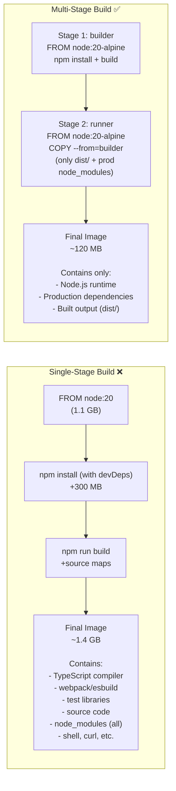

# ပြဿနာ- ဘီးလ်ဒ် တူးလ်များ (Build Tools) သည် တိုက်ရိုက်ထုတ်လုပ်ရေး (Production) ပတ်ဝန်းကျင်တွင် မရှိသင့်ပါ

အပလီကေးရှင်းတစ်ခုကို ကုဒ်ပေါင်းစုံမှ စက်သုံးဘာသာစကားသို့ ပြောင်းလဲတည်ဆောက် (Compile) ချိန်တွင် လေးလံသော ဘီးလ်ဒ် တူးလ်များ လိုအပ်သည် — ကွန်ပိုင်လာများ (Compilers)၊ SDK များ၊ တက်စ်ဖရိန်ဝิร์ာ့ခ်များ (Test frameworks)၊ အမျိုးအစားစစ်ဆေးသူများ (Type checkers)၊ လင်တာများ (Linters) နှင့် ဆို့စ်မက်ပ်များ (Source maps) တို့ ဖြစ်ကြသည်။ သာမန် Dockerfile တစ်ခုတွင် ဤအရာအားလုံးသည် နောက်ဆုံးထွက်လာသော ရုပ်ပုံဖိုင် (Image) ထဲသို့ အကုန်ပါသွားတတ်သည် — အမှန်တကယ် လည်ပတ်နေသော အပလီကေးရှင်းက ၎င်းတို့ထဲမှ တစ်ခုမှ မလိုအပ်ဘဲနှင့်ပင် ဖြစ်သည်။



**သက်ရောက်မှုများ**:
- **အရွယ်အစား ပိုမိုသေးငယ်ခြင်း** → ပိုမိုမြန်ဆန်စွာ ဒေါင်းလုပ်ဆွဲနိုင်ခြင်း၊ Kubernetes တွင် ပေါ့ဒ် (Pod) များ ပိုမိုမြန်ဆန်စွာ စတင်နိုင်ခြင်း
- **တိုက်ခိုက်ခံရနိုင်ခြေ မျက်နှာပြင် ပိုမိုသေးငယ်ခြင်း** → ကွန်ပိုင်လာမရှိ၊ ရှဲလ်တူးလ်များ မရှိ၊ ဟက်ကာများ အသုံးချနိုင်မည့် ဆို့စ်ကုဒ်များ မရှိခြင်း
- **သယ်ယူပို့ဆောင်နေစဉ် ဒေတာပမာဏ နည်းပါးခြင်း** → CI/CD တွင် ဘန်းဝစ်သ် (Bandwidth) ကုန်ကျစရိတ် သက်သာခြင်း

---

## အဓိက သဘောတရား- `COPY --from`

အဆင့်ဆင့် တည်ဆောက်ခြင်း (Multi-stage builds) သည် `FROM` ဖော်ပြချက် အများအပြားကို အသုံးပြုသည်။ `FROM` တိုင်းသည် ၎င်း၏ကိုယ်ပိုင် ဖိုင်စနစ်ပါရှိသော အဆင့်အသစ်တစ်ခုကို စတင်ပေးသည်။ ၎င်း၏ မှော်ဆန်ချက်မှာ `COPY --from=<stage>` ဖြစ်ပြီး၊ ကျန်ရှိသမျှ အားလုံးကို စွန့်ပစ်လိုက်ကာ ယခင်အဆင့်မှ သီးသန့်ဖိုင်များကို ဆွဲထုတ်ယူနိုင်စေခြင်း ဖြစ်သည်။

```dockerfile
# Stage 1: heavy build environment
FROM node:20-alpine AS builder     # ← "AS" gives this stage a name
WORKDIR /app
COPY package*.json ./
RUN npm ci                          # installs ALL deps (dev + prod)
COPY . .
RUN npm run build                   # outputs to /app/dist

# Stage 2: minimal runtime (completely fresh filesystem)
FROM node:20-alpine AS runner       # ← new base, nothing from stage 1 yet
WORKDIR /app
COPY package*.json ./
RUN npm ci --only=production        # only prod deps
COPY --from=builder /app/dist ./dist  # ← only pull the compiled output!

CMD ["node", "dist/server.js"]
# The compiler, devDependencies, source files, and test code
# are NOT in this final image — they stayed in the builder stage
```

---

## ပုံစံ ၁: Node.js / Next.js

```dockerfile
# ── Deps: install all dependencies ─────────────────────────────────────
FROM node:20-alpine AS deps
RUN apk add --no-cache libc6-compat
WORKDIR /app
COPY package.json package-lock.json ./
RUN npm ci

# ── Builder: compile the application ───────────────────────────────────
FROM node:20-alpine AS builder
WORKDIR /app
COPY --from=deps /app/node_modules ./node_modules
COPY . .

# Build-time env (doesn't persist to runtime)
ARG NEXT_PUBLIC_API_URL
ENV NEXT_PUBLIC_API_URL=${NEXT_PUBLIC_API_URL}
ENV NEXT_TELEMETRY_DISABLED=1

RUN npx prisma generate && npm run build

# ── Runner: minimal production image ────────────────────────────────────
FROM node:20-alpine AS runner
WORKDIR /app

ENV NODE_ENV=production
ENV NEXT_TELEMETRY_DISABLED=1
ENV PORT=3000

# Non-root user
RUN addgroup -S nodejs && adduser -S nextjs -G nodejs

# Next.js standalone output mode: includes only needed files
COPY --from=builder --chown=nextjs:nodejs /app/.next/standalone ./
COPY --from=builder --chown=nextjs:nodejs /app/.next/static ./.next/static
COPY --from=builder --chown=nextjs:nodejs /app/public ./public

USER nextjs
EXPOSE 3000

HEALTHCHECK --interval=30s --timeout=10s --start-period=30s --retries=3 \
  CMD wget -qO- http://localhost:3000/api/health || exit 1

CMD ["node", "server.js"]
```

`next.config.js` တွင် Next.js standalone ကို ဖွင့်ပါ:
```js
module.exports = { output: "standalone" }
```

ဤသည်မှာ အသုံးမပြုသော မော်ဂျူးများ၊ လိုကယ်ဖိုင်များစသည်တို့ကို ဖယ်ရှားကာ ရန်းတိုင်းမ် (Runtime) တွင် လိုအပ်သည့် တိကျသောဖိုင်များကိုသာ Next.js အား ဘန်ဒယ် (Bundle) လုပ်ရန် ညွှန်ပြခြင်း ဖြစ်သည်။ အဆင့်ဆင့် တည်ဆောက်ခြင်း (Multi-stage builds) နှင့် ပေါင်းစပ်လိုက်သောအခါ နောက်ဆုံးထွက် Image အရွယ်အစားသည် ~1.4 GB မှ ~120 MB သို့ လျော့ကျသွားသည်။

---

## ပုံစံ ၂: Go Binary (Scratch Image)

Go သည် တစ်ခုတည်းသော၊ တည်ငြိမ်စွာ ချိတ်ဆက်ထားသော ဘိုင်နရီ (Statically linked binary) တစ်ခုအဖြစ်သို့ ပြောင်းလဲတည်ဆောက်ပေးသည် — ၎င်းသည် အဆင့်ဆင့် တည်ဆောက်ခြင်း (Multi-stage builds) အတွက် စံပြအကောင်းဆုံး ဖြစ်သည်။ နောက်ဆုံးထွက် Image သည် လုံးဝအလွတ် (Scratch) ဖြစ်နိုင်သည်:

```dockerfile
# ── Build stage ─────────────────────────────────────────────────────────
FROM golang:1.22-alpine AS builder

# Install necessary tools
RUN apk add --no-cache git ca-certificates tzdata

WORKDIR /app

# Download dependencies (cached separately for speed)
COPY go.mod go.sum ./
RUN go mod download && go mod verify

# Copy source and build
COPY . .
RUN CGO_ENABLED=0 GOOS=linux GOARCH=amd64 go build \
    -ldflags="-w -s -X main.version=$(git describe --tags --always)" \
    -o /bin/server \
    ./cmd/server

# ── Final stage: scratch (empty image) ─────────────────────────────────
FROM scratch

# Copy only what we need from builder
COPY --from=builder /etc/ssl/certs/ca-certificates.crt /etc/ssl/certs/
COPY --from=builder /usr/share/zoneinfo /usr/share/zoneinfo
COPY --from=builder /bin/server /bin/server

# Use a non-root numeric UID (no users file in scratch)
USER 65532:65532

EXPOSE 8080
ENTRYPOINT ["/bin/server"]
```

**ရလဒ်**: `FROM scratch` ရုပ်ပုံဖိုင်သည် တကယ်တမ်းတွင် 0 ဘိုက် + သင်၏ ဘိုင်နရီဖိုင် သက်သက်သာ ဖြစ်သည်။ ပုံမှန်အရွယ်အစား: `golang:1.22` ၏ 800 MB နှင့် နှိုင်းယှဉ်ပါက **5–15 MB** သာ ရှိသည်။

---

## ပုံစံ ၃: Python (Wheels + Virtualenv)

```dockerfile
# ── Build stage: install with full pip ──────────────────────────────────
FROM python:3.12-slim AS builder

WORKDIR /app

# Install build tools for compiling native extensions
RUN apt-get update \
    && apt-get install -y --no-install-recommends gcc libpq-dev \
    && rm -rf /var/lib/apt/lists/*

# Create a virtualenv (self-contained, easy to copy)
RUN python -m venv /opt/venv
ENV PATH="/opt/venv/bin:$PATH"

COPY requirements.txt ./
RUN pip install --no-cache-dir -r requirements.txt

# ── Final stage: minimal runtime ────────────────────────────────────────
FROM python:3.12-slim AS runner

# Only copy the virtualenv (no pip, no build tools)
COPY --from=builder /opt/venv /opt/venv
ENV PATH="/opt/venv/bin:$PATH"

WORKDIR /app
COPY . .

RUN useradd -m -u 1001 appuser
USER appuser

EXPOSE 8000
CMD ["python", "-m", "uvicorn", "main:app", "--host", "0.0.0.0", "--port", "8000"]
```

---

## ပုံစံ ၄: React / Vue / Angular (Static Files + Nginx)

```dockerfile
# ── Build stage ─────────────────────────────────────────────────────────
FROM node:20-alpine AS builder
WORKDIR /app
COPY package*.json ./
RUN npm ci
COPY . .
ARG VITE_API_URL
ENV VITE_API_URL=${VITE_API_URL}
RUN npm run build    # Outputs to /app/dist

# ── Final stage: Nginx serving static files ─────────────────────────────
FROM nginx:alpine AS runner

# Remove default nginx config
RUN rm /etc/nginx/conf.d/default.conf

# Copy custom nginx config
COPY nginx.conf /etc/nginx/conf.d/

# Copy built static files
COPY --from=builder /app/dist /usr/share/nginx/html

EXPOSE 80

# Nginx runs as nobody in official alpine image (already non-root)
HEALTHCHECK --interval=30s --timeout=5s \
  CMD wget -qO- http://localhost/health || exit 1

CMD ["nginx", "-g", "daemon off;"]
```

**ရလဒ်**: Node.js နှင့် `node_modules` ၏ 500 MB သည် နောက်ဆုံးထွက် Image ထဲသို့ လုံးဝမရောက်လာပါ။ ရန်းတိုင်းမ် (Runtime) မှာ `nginx:alpine` (~41 MB) နှင့် သင်၏ Static HTML/CSS/JS ဖိုင်များသာ ဖြစ်သည်။

---

## သီးသန့်အဆင့်များကို ပစ်မှတ်ထားခြင်း (Targeting Specific Stages)

```bash
# Build only the 'builder' stage (useful for debugging build issues)
docker build --target builder -t my-api:builder .

# Build only the 'deps' stage (check dependency installation)
docker build --target deps -t my-api:deps .

# Normal: builds the last/default stage
docker build -t my-api:latest .
```

---

## အရွယ်အစား နှိုင်းယှဉ်ချက်ဇယား

| ဘာသာစကား | တစ်ဆင့်တည်း (Single-Stage) | အဆင့်များစွာ (Alpine) | အဆင့်များစွာ (Distroless/Scratch) |
|---------|-------------|---------------------|--------------------------------|
| **Node.js** | ~1.4 GB | ~120 MB | ~90 MB (distroless) |
| **Go** | ~800 MB | ~15 MB | **5 MB** (scratch) |
| **Python** | ~1.2 GB | ~160 MB | ~100 MB (distroless) |
| **Java (Spring)** | ~700 MB | ~200 MB | ~150 MB (distroless JRE) |
| **React SPA** | — | ~50 MB (nginx:alpine + dist) | — |

---

## အနှစ်ချုပ်

အဆင့်ဆင့် တည်ဆောက်ခြင်း (Multi-stage builds) သည် တိုက်ရိုက်ထုတ်လုပ်ရေး (Production) ကွန်တိန်နာ ရုပ်ပုံဖိုင်များအတွက် မရှိမဖြစ် လိုအပ်ပါသည်:
- `FROM` ဖော်ပြချက် အများအပြားကို အသုံးပြုပါ — တစ်ခုချင်းစီသည် အသစ်စက်စက် အစပျိုးပေးသည်
- `AS <name>` ပုံစံသည် `COPY --from=<name>` အတွက် အဆင့်များကို အမည်ပေးသတ်မှတ်ပေးသည်
- `COPY --from=builder /app/dist ./dist` သည် တည်ဆောက်ထားသော အخرအထွက် (Compiled output) ကိုသာ ဆွဲထုတ်သည် — ဘီးလ်ဒ် တူးလ်အားလုံးကို နောက်တွင် ချန်လှပ်ခဲ့သည်
- **Node.js**: သီးခြား `deps` → `builder` → `runner` အဆင့်များ; အနည်းဆုံး လိုအပ်သော ဖိုင်များအတွက် Next.js ၏ `output: "standalone"` ကို အသုံးပြုပါ
- **Go**: CGO_ENABLED=0 ဖြင့် ကွန်ပိုင်းလ်လုပ်ပါ၊ `FROM scratch` ဖြင့် ဖြန့်ဝေပါ — နောက်ဆုံး Image သည် ဘိုင်နရီဖိုင် သက်သက်သာ ဖြစ်သည်
- **Python**: ဘီးလ်ဒ်အဆင့်တွင် virtualenv ကို တည်ဆောက်ပါ၊ ရန်းတိုင်းမ် Image သို့ `/opt/venv` ကိုသာ ကူးယူပါ
- **React/Vue**: Node.js ဖြင့် တည်ဆောက်ပါ၊ `nginx:alpine` ဖြင့် ဆာဗာတင်ပါ — Static ဖိုင်များသာ ပို့ဆောင်ပေးရမည်

နောက်သင်ခန်းစာတွင်၊ Docker သည် Persistent ဒေတာများကို Volumes နှင့် Bind Mounts များဖြင့် မည်သို့ စီမံခန့်ခွဲသည်ကို လေ့လာရမည် ဖြစ်သည်။