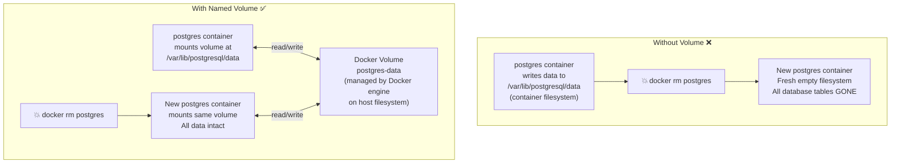

# ကွန်တိန်နာများ (Containers) အ ஏன் Persistent Storage လိုအပ်သလဲ

ကွန်တိန်နာတစ်ခု၏ ဖိုင်စနစ် (filesystem) သည် ယာယီသာဖြစ်သည် — ကွန်တိန်နာ အသက်ရှင်နေသမျှ ကာလပတ်လုံးသာ တည်ရှိသည်။ ကွန်တိန်နာကို ဖျက်လိုက်သည့်အခါတိုင်း ၎င်း၏ အတွင်းပိုင်း ဖိုင်စနစ်ထဲသို့ ရေးသားထားသော ဖိုင်မှန်သမျှ အပြီးတိုင် ပျောက်ကွယ်သွားမည်ဖြစ်သည်။ Stateless အပလီကေးရှင်းများ (APIs၊ ဝဘ်ဆာဗာများ) အတွက်ဆိုလျှင် ဤအချက်သည် ပြဿနာမရှိပါ။ သို့သော် ဒေတာသိမ်းဆည်းသော မည်သည့်အရာအတွက်မဆို (ဒေတာဘေ့စ်များ၊ ဖိုင် အပ်လုဒ်တင်ခြင်းများ၊ လော့ဂ်ဖိုင်များ) ဆိုးဝါးသော ဆုံးရှုံးမှုကြီး ဖြစ်လာပါလိမ့်မည်။



ဒေါကာ (Docker) သည် persistent storage အတွက် နည်းလမ်းနှစ်ခု ပံ့ပိုးပေးထားသည်: **Named Volumes** နှင့် **Bind Mounts** တို့ ဖြစ်ကြသည်။

---

## အမျိုးအစား ၁: Named Volumes (ထုတ်လုပ်ရေး ပတ်ဝန်းကျင်အတွက် - Production)

Named volumes များကို Docker အင်ဂျင်က စီမံခန့်ခွဲသည်။ Docker သည် ဒေတာများကို host ၏ ဖိုင်စနစ်ပေါ်တွင် (ပုံမှန်အားဖြင့် `/var/lib/docker/volumes/` တွင်) ဘယ်နေရာ၌ သိမ်းဆည်းရမည်ကို ဆုံးဖြတ်သည်။ သင်က အမည်ဖြင့်သာ ခေါ်ဆိုအသုံးပြုရပြီး — ရုပ်ပိုင်းဆိုင်ရာ ဖိုင်လမ်းကြောင်း (physical path) က အရေးမကြီးပါ။

### Named Volumes တည်ဆောက်ခြင်းနှင့် အသုံးပြုခြင်း

```bash
# Create a named volume
docker volume create postgres-data

# List all volumes
docker volume ls
# DRIVER    VOLUME NAME
# local     postgres-data

# Inspect a volume (see where Docker stores it on disk)
docker volume inspect postgres-data
# [
#   {
#     "Name": "postgres-data",
#     "Driver": "local",
#     "Mountpoint": "/var/lib/docker/volumes/postgres-data/_data",
#     "CreatedAt": "2026-08-18T10:00:00Z"
#   }
# ]

# Run PostgreSQL with a named volume
docker run -d \
  --name my-postgres \
  --restart unless-stopped \
  -e POSTGRES_USER=appuser \
  -e POSTGRES_PASSWORD=secret \
  -e POSTGRES_DB=myapp \
  -v postgres-data:/var/lib/postgresql/data \
  postgres:16-alpine

# The volume mounts at /var/lib/postgresql/data inside the container
# All database files go there → persist across container restarts and deletion

# Remove the container — volume stays
docker rm -f my-postgres
docker volume ls   # postgres-data still listed!

# New container, same data:
docker run -d --name my-postgres -v postgres-data:/var/lib/postgresql/data postgres:16-alpine
docker exec my-postgres psql -U appuser -d myapp -c "\dt"
# All your tables are still there ✅
```

### Named Volume အကောင်းဆုံး ကျင့်င့်စဉ်များ (Best Practices)

```bash
# === Backup a named volume ===
docker run --rm \
  -v postgres-data:/source:ro \
  -v $(pwd):/backup \
  busybox \
  tar czf /backup/postgres-data-$(date +%Y%m%d).tar.gz -C /source .

# === Restore a volume from backup ===
docker run --rm \
  -v postgres-data:/target \
  -v $(pwd):/backup:ro \
  busybox \
  tar xzf /backup/postgres-data-20260818.tar.gz -C /target

# === Copy from volume to host ===
docker run --rm \
  -v postgres-data:/data:ro \
  -v $(pwd)/output:/output \
  busybox \
  cp -r /data/. /output/

# === Remove unused volumes (free disk space) ===
docker volume prune         # Removes volumes not mounted by any container
docker volume rm volume-name  # Remove specific volume (must not be in use)
```

---

## အမျိုးအစား ၂: Bind Mounts (ဖွံ့ဖြိုးတိုးတက်ရေး ပတ်ဝန်းကျင်အတွက် - Development)

Bind mount တစ်ခုသည် **သင်၏ host စက်ပေါ်ရှိ တိကျသေချာသော ဖိုင်တွဲတစ်ခုကို** ကွန်တိန်နာထဲသို့ ချိတ်ဆက်ပေးသည်။ Named volumes နှင့် မတူသည်မှာ ဒေတာများ ဘယ်နေရာတွင် တည်ရှိသည်ကို သင်ကိုယ်တိုင် အတိအကျ ထိန်းချုပ်နိုင်ခြင်း ဖြစ်သည်။

```bash
# Map current directory's /src folder into the container
docker run -d \
  -p 3000:3000 \
  -v $(pwd)/src:/app/src \      # Bind mount: host_path:container_path
  my-node-app

# Any file you edit in ./src on your laptop is instantly visible
# inside the container at /app/src — enabling hot reload!
```

### ဖိုင်တစ်ခုတည်းကို Bind Mount လုပ်ခြင်း

```bash
# Mount a single config file (not a whole directory)
docker run -d \
  --name my-nginx \
  -p 8080:80 \
  -v $(pwd)/nginx/nginx.conf:/etc/nginx/nginx.conf:ro \  # :ro = read-only
  nginx:alpine
```

### Bind Mounts ဖြင့် Development Workflow ပြုလုပ်ခြင်း

```bash
# Full dev setup: source code bind-mounted for hot reload
docker run -d \
  --name api-dev \
  -p 3000:3000 \
  -e NODE_ENV=development \
  -v $(pwd):/app \            # Bind entire project
  -v /app/node_modules \      # EXCEPTION: don't bind node_modules from host
  my-node-api:dev \
  npm run dev
```

`/app/node_modules` အသုံးကွက် (trick): `/app/node_modules` ကို host path မပါဘဲ anonymous volume တစ်ခုအနေဖြင့် စာရင်းပြုစုခြင်းဖြင့် Docker သည် ၎င်းအတွက် သီးခြားလွတ်လပ်သော volume တစ်ခုကို ဖန်တီးပေးသည် — ၎င်းက သင့် host ၏ `node_modules` က ကွန်တိန်နာ၏ `node_modules` ကို ထပ်မံအုပ်မသွားစေရန် တားဆီးပေးသည် (အခြား OS တစ်ခုခုအတွက် တည်ဆောက်ထားနိုင်သောကြောင့် ဖြစ်သည်)။

---

## Named Volumes နှင့် Bind Mounts: မည်သည့်အခါတွင် အသုံးပြုသင့်သလဲ

| | Named Volumes | Bind Mounts |
|--|--------------|-------------|
| **Data location** | Docker manages (opaque) | Explicit host path |
| **Portability** | Works on any Docker host | Path must exist on host |
| **Performance** | Optimal (native filesystem) | Slower on Mac/Windows (overlay) |
| **Use for** | Databases, persistent app data | Development hot-reload, config injection |
| **Environment** | Production | Development only |
| **Backup** | `docker run --rm -v volume:/source busybox tar` | Regular filesystem copy |
| **Permissions** | Managed by Docker | Must match container UID |

<Callout type="warning" title="ထုတ်လုပ်ရေးပတ်ဝန်းကျင် (Production) တွင် ဒေတာဘေ့စ်များအတွက် Bind Mounts ကို လုံးဝမသုံးပါနှင့်">
Bind mounts များသည် သင်၏ ဒေတာဘေ့စ်ကို သီးခြားဆာဗာတစ်ခုပေါ်ရှိ သီးခြားဖိုင်လမ်းကြောင်းတစ်ခုနှင့် ချိတ်ဆက်ထားစေသည်။ သင် ဆာဗာပြောင်းပါက ဖိုင်လမ်းကြောင်း ပြောင်းသွားမည်ဖြစ်သည်။ Nodes များစွာသို့ ချဲ့ထွင်ပါက တစ်ခုစီတွင် ဒေတာများ မတူညီကြတော့ပါ။ ဒေတာဘေ့စ် သိမ်းဆည်းမှုများအတွက် အမြဲတမ်း named volumes များကိုသာ အသုံးပြုပါ — Docker သည် ၎င်းတို့ကို host path များမှ သီးခြားစီ စီမံခန့်ခွဲပေးသည်။
</Callout>

---

## Volume ခွင့်ပြုချက်များ နှင့် ပိုင်ဆိုင်မှုများ (Permissions and Ownership)

ဖြစ်လေ့ရှိသော ပြဿနာတစ်ခုမှာ: UID များ မကိုက်ညီသောကြောင့် ကွန်တိန်နာ ပရိုเซสသည် mount လုပ်ထားသော volume ထဲသို့ စာမရေးနိုင်ခြင်း ဖြစ်သည်။

```bash
# Check the UID the container runs as
docker run --rm my-app id
# uid=1001(appuser) gid=1001(appgroup)

# The volume directory on the host might be owned by root:
ls -la /var/lib/docker/volumes/mydata/_data/
# drwxr-xr-x root root ...  ← container's appuser (1001) can't write!

# Fix 1: Set ownership in Dockerfile
RUN mkdir -p /app/data && chown -R appuser:appgroup /app/data
VOLUME /app/data

# Fix 2: Use --user flag at runtime
docker run --user $(id -u):$(id -g) my-app

# Fix 3: Set correct permissions at mount time using an init container
docker run --rm -v mydata:/data busybox chown -R 1001:1001 /data
```

---

## tmpfs Mounts (RAM ကိုအသုံးပြုသည်၊ Persistent မဟုတ်ပါ)

တစ်ခါတစ်ရံတွင် ဒစ်ခ် (disk) ကို လုံးဝမထိတွေ့ဘဲ ယာယီအသုံးပြုရန် လိုအပ်တတ်သည် — စွမ်းဆောင်ရည်အတွက်ဖြစ်စေ၊ ဒစ်ခ်ပေါ်တွင် အမြဲတမ်း မသိမ်းဆည်းသင့်သော လျို့ဝှက်ချက်များ (secrets) အတွက်ဖြစ်စေ ဖြစ်သည်:

```bash
# Mount RAM as a temporary filesystem (not persisted, lost on container stop)
docker run -d \
  --tmpfs /tmp:rw,size=100m,uid=1001 \   # 100MB RAM-backed /tmp
  --tmpfs /run:rw,noexec,size=10m \      # Small /run dir
  my-api

# Use case 1: readOnlyRootFilesystem security hardening
docker run -d \
  --read-only \                    # Root filesystem is read-only
  --tmpfs /tmp \                   # But /tmp is writable (RAM)
  --tmpfs /run \                   # And /run is writable (RAM)
  my-api

# Use case 2: High-speed scratch space for data processing
docker run -d \
  --tmpfs /data/scratch:rw,size=2g \  # 2 GB RAM disk for processing
  my-data-pipeline
```

---

## အဆင့်မြင့် သိုလှောင်မှုအတွက် Volume Drivers များ

```bash
# Default driver: local (host filesystem)
docker volume create --driver local mydata

# NFS driver (shared volume across multiple servers)
docker volume create \
  --driver local \
  --opt type=nfs \
  --opt o=addr=192.168.1.100,rw,nfsvers=4 \
  --opt device=:/exports/mydata \
  shared-uploads

# AWS EFS (Elastic File System) — for ECS/EC2 clusters
# Install the efs driver: docker plugin install amazon/amazon-ecs-volume-plugin
docker volume create \
  --driver amazon/amazon-ecs-volume-plugin \
  --opt type=efs \
  --opt efsId=fs-12345678 \
  efs-data
```

---

## docker volume အမိန့်ပေးချက်များ: အပြည့်အစုံ ကိုးကားချက်

```bash
# Create
docker volume create my-volume

# List
docker volume ls
docker volume ls -q              # IDs only

# Inspect
docker volume inspect my-volume

# Remove
docker volume rm my-volume       # Fails if volume is in use
docker volume rm -f my-volume    # Force remove

# Prune (removes all volumes not used by any container)
docker volume prune
docker volume prune --filter "label!=keep"  # Keep labeled volumes

# Export volume contents (backup)
docker run --rm -v my-volume:/source -v $(pwd):/dest \
  busybox tar czf /dest/backup.tar.gz -C /source .

# Import volume contents (restore)
docker run --rm -v my-volume:/dest -v $(pwd):/source \
  busybox tar xzf /source/backup.tar.gz -C /dest
```

---

## အကျဉ်းချုပ်

Docker သိုလှောင်မှုတွင် ပုံစံသုံးမျိုး ရှိသည်-
- **Named volumes** — Docker မှ စီမံခန့်ခွဲသော persistent storage ဖြစ်ပြီး အမည်ဖြင့် မှတ်သားသည်။ ထုတ်လုပ်ရေး ဒေတာအားလုံးအတွက် (ဒေတာဘေ့စ်များ၊ အပ်လုဒ်များ၊ လော့ဂ်ဖိုင်များ) အသုံးပြုပါ။ ကွန်တိန်နာ ဖျက်လိုက်သော်လည်း ဆက်လက်တည်ရှိနေမည်၊ ဘက်ခ်အပ်ယူရန်နှင့် ပြန်လည်ရယူရန် လွယ်ကူသည်။
- **Bind mounts** — ကွန်တိန်နာထဲသို့ ချိတ်ဆက်ထားသော တိကျသေချာသည့် host path ဖြစ်သည်။ Hot-reload လုပ်ငန်းစဥ်များအတွက် development တွင်သာ အသုံးပြုပါ။ Portability မရှိပါ၊ ဒေတာဘေ့စ်များအတွက် ရှောင်ကြဉ်ပါ။
- **tmpfs mounts** — RAM ကို အခြေခံထားသော၊ persistent မဟုတ်သည့် ယာယီနေရာ ဖြစ်သည်။ လျို့ဝှက်ချက်များ၊ ယာယီဖိုင်များ၊ သို့မဟုတ် ဒစ်ခ်ကို လုံးဝမထိတွေ့ရမည့် စွမ်းဆောင်ရည်မြင့် ယာယီဒေတာများအတွက် အသုံးပြုပါ။

အဓိက စည်းမျဉ်းမှာ: **ကွန်တိန်နာ ပြန်လည်စတင်ခြင်း သို့မဟုတ် ဖျက်ဆီးခြင်းမှ လွတ်မြောက်ရမည့် မည်သည့်အရာမဆို named volume သို့မဟုတ် bind mount ထဲတွင် ရှိရမည်**။ ကွန်တိန်နာ ဖိုင်စနစ်များသည် ဒီဇိုင်းအရ ယာယီသက်တမ်းသာ ရှိကြသည်။

နောက်သင်ခန်းစာတွင်၊ Docker networking မည်သို့ အလုပ်လုပ်သည်ကို သင်ယူရမည် ဖြစ်သည် — ကွန်တိန်နာများသည် အများပြည်သူသုံး အင်တာနက်သို့ တိုက်ရိုက်မပြဘဲ လုံခြုံစွာ ဆက်သွယ်နိုင်ရန် စွမ်းဆောင်ပေးသည်။