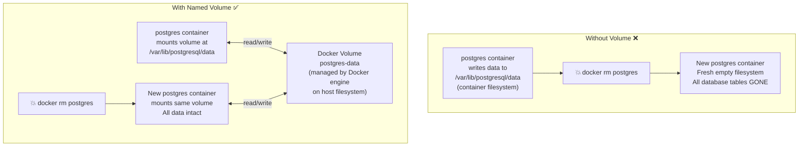

# Containers တွေမှာ Persistent Storage ဘାကြောင့် လိုအပ်တာလဲ

Container တစ်ခုရဲ့ filesystem က ephemeral ဖြစ်ပါတယ် (ခဏတာပဲ သက်တမ်းရှိပါတယ်) - ဆိုလိုတာက container ရှိနေချိန်မှာပဲ အဲ့ဒီ filesystem က ရှိနေမှာပါ။ Container တစ်ခုကို delete လိုက်တဲ့အခါ သူ့ရဲ့ internal filesystem ပေါ်မှာ ရေးသားထားတဲ့ ဖိုင်မှန်သမျှ လုံးဝပျောက်ကွယ်သွားပါတော့တယ်။ Stateless applications (APIs, web servers) တွေအတွက် ဒါက ပြဿနာမရှိပေမယ့် Data သိမ်းဆည်းရတဲ့ မည်သည့်အရာအတွက်မဆို (databases, file uploads, logs) ဒါဟာ ဆိုးရွားတဲ့ ပျက်စီးဆုံးရှုံးမှုတစ်ခု ဖြစ်လာပါလိမ့်မယ်။



Docker က persistent storage အတွက် နည်းလမ်းနှစ်ခု ပေးထားပါတယ် - **Named Volumes** နဲ့ **Bind Mounts** တို့ ဖြစ်ပါတယ်။

---

## Type 1: Named Volumes (Production)

Named volumes တွေကို Docker engine က စီမံခန့်ခွဲပါတယ်။ Host filesystem ပေါ်မှာ data ဘယ်မှာသွားသိမ်းရမယ်ဆိုတာကို Docker ကပဲ ဆုံးဖြတ်ပါတယ် (ပုံမှန်အားဖြင့် `/var/lib/docker/volumes/` မှာ ဖြစ်ပါတယ်)။ ဒါတွေကို နာမည်နဲ့ပဲ ညွှန်းဆိုသုံးစွဲရပြီး physical path က ဘာလဲဆိုတာကို သိစရာမလိုပါဘူး။

### Named Volumes တည်ဆောက်ခြင်းနှင့် အသုံးပြုခြင်း

```bash
# Create a named volume
docker volume create postgres-data

# List all volumes
docker volume ls
# DRIVER    VOLUME NAME
# local     postgres-data

# Inspect a volume (see where Docker stores it on disk)
docker volume inspect postgres-data
# [
#   {
#     "Name": "postgres-data",
#     "Driver": "local",
#     "Mountpoint": "/var/lib/docker/volumes/postgres-data/_data",
#     "CreatedAt": "2026-08-18T10:00:00Z"
#   }
# ]

# Run PostgreSQL with a named volume
docker run -d \
  --name my-postgres \
  --restart unless-stopped \
  -e POSTGRES_USER=appuser \
  -e POSTGRES_PASSWORD=secret \
  -e POSTGRES_DB=myapp \
  -v postgres-data:/var/lib/postgresql/data \
  postgres:16-alpine

# The volume mounts at /var/lib/postgresql/data inside the container
# All database files go there → persist across container restarts and deletion

# Remove the container — volume stays
docker rm -f my-postgres
docker volume ls   # postgres-data still listed!

# New container, same data:
docker run -d --name my-postgres -v postgres-data:/var/lib/postgresql/data postgres:16-alpine
docker exec my-postgres psql -U appuser -d myapp -c "\dt"
# All your tables are still there ✅
```

### Named Volume Best Practices

```bash
# === Backup a named volume ===
docker run --rm \
  -v postgres-data:/source:ro \
  -v $(pwd):/backup \
  busybox \
  tar czf /backup/postgres-data-$(date +%Y%m%d).tar.gz -C /source .

# === Restore a volume from backup ===
docker run --rm \
  -v postgres-data:/target \
  -v $(pwd):/backup:ro \
  busybox \
  tar xzf /backup/postgres-data-20260818.tar.gz -C /target

# === Copy from volume to host ===
docker run --rm \
  -v postgres-data:/data:ro \
  -v $(pwd)/output:/output \
  busybox \
  cp -r /data/. /output/

# === Remove unused volumes (free disk space) ===
docker volume prune         # Removes volumes not mounted by any container
docker volume rm volume-name  # Remove specific volume (must not be in use)
```

---

## Type 2: Bind Mounts (Development)

Bind mount ဆိုတာကတော့ **သင်ရဲ့ host machine ပေါ်ရှိ သတ်မှတ်ထားသော directory တစ်ခုကို** container ထဲသို့ ချိတ်ဆက် (map) ပေးတာ ဖြစ်ပါတယ်။ Named volumes နဲ့မတူဘဲ data တွေ ဘယ်မှာသွားနေတယ်ဆိုတာကို သင်ကိုယ်တိုင် အတိအကျ ထိန်းချုပ်နိုင်ပါတယ်။

```bash
# Map current directory's /src folder into the container
docker run -d \
  -p 3000:3000 \
  -v $(pwd)/src:/app/src \      # Bind mount: host_path:container_path
  my-node-app

# Any file you edit in ./src on your laptop is instantly visible
# inside the container at /app/src — enabling hot reload!
```

### Single File Bind Mount

```bash
# Mount a single config file (not a whole directory)
docker run -d \
  --name my-nginx \
  -p 8080:80 \
  -v $(pwd)/nginx/nginx.conf:/etc/nginx/nginx.conf:ro \  # :ro = read-only
  nginx:alpine
```

### Development Workflow with Bind Mounts

```bash
# Full dev setup: source code bind-mounted for hot reload
docker run -d \
  --name api-dev \
  -p 3000:3000 \
  -e NODE_ENV=development \
  -v $(pwd):/app \            # Bind entire project
  -v /app/node_modules \      # EXCEPTION: don't bind node_modules from host
  my-node-api:dev \
  npm run dev
```

`/app/node_modules` ရဲ့ trick လေးကတော့ - `/app/node_modules` ကို host path မပါတဲ့ anonymous volume တစ်ခုအနေနဲ့ သတ်မှတ်လိုက်ခြင်းအားဖြင့် Docker က သူ့အတွက် သီးသန့် volume တစ်ခု ဖန်တီးပေးပါတယ်။ ဒါကြောင့် သင်ရဲ့ host ထဲက `node_modules` က container ရဲ့ `node_modules` ကို overwrite လုပ်မသွားအောင် (OS မတူတာတွေကြောင့် ဖြစ်တတ်တာကို) ကာကွယ်ပေးပါတယ်။

---

## Named Volumes vs Bind Mounts: ဘယ်ဟာကို ဘယ်တော့သုံးမလဲ

| | Named Volumes | Bind Mounts |
|--|--------------|-------------|
| **Data location** | Docker manages (opaque) | Explicit host path |
| **Portability** | Works on any Docker host | Path must exist on host |
| **Performance** | Optimal (native filesystem) | Slower on Mac/Windows (overlay) |
| **Use for** | Databases, persistent app data | Development hot-reload, config injection |
| **Environment** | Production | Development only |
| **Backup** | `docker run --rm -v volume:/source busybox tar` | Regular filesystem copy |
| **Permissions** | Managed by Docker | Must match container UID |

<Callout type="warning" title="Never Use Bind Mounts for Databases in Production">
Bind mounts တွေက သင်ရဲ့ database ကို specific server တစ်ခုပေါ်က specific path တစ်ခုနဲ့ တွဲချိတ်ပေးထားပါတယ်။ Server ပြောင်းလိုက်ရင် path က ပြောင်းသွားပါလိမ့်မယ်။ Nodes အများကြီးကို scale လုပ်တဲ့အခါ တစ်ခုချင်းစီမှာ data တွေ မတူညီဘဲ ဖြစ်နေပါလိမ့်မယ်။ Database storage အတွက်ဆိုရင် အမြဲတမ်း named volumes တွေကိုသာ သုံးပါ - Docker က host paths တွေနဲ့ မသက်ဆိုင်ဘဲ သီးသန့်စီမံခန့်ခွဲပေးပါလိမ့်မယ်။
</Callout>

---

## Volume Permissions and Ownership

ဖြစ်လေ့ဖြစ်ထရှိတဲ့ ပြဿနာတစ်ခုကတော့ - UID တွေ မကိုက်ညီတာကြောင့် container process က mounted volume ထဲကို write လို့ မရတာ ဖြစ်ပါတယ်။

```bash
# Check the UID the container runs as
docker run --rm my-app id
# uid=1001(appuser) gid=1001(appgroup)

# The volume directory on the host might be owned by root:
ls -la /var/lib/docker/volumes/mydata/_data/
# drwxr-xr-x root root ...  ← container's appuser (1001) can't write!

# Fix 1: Set ownership in Dockerfile
RUN mkdir -p /app/data && chown -R appuser:appgroup /app/data
VOLUME /app/data

# Fix 2: Use --user flag at runtime
docker run --user $(id -u):$(id -g) my-app

# Fix 3: Set correct permissions at mount time using an init container
docker run --rm -v mydata:/data busybox chown -R 1001:1001 /data
```

---

## tmpfs Mounts (RAM-Backed, Non-Persistent)

တခါတလေမှာ disk ကို လုံးဝ မထိတွေ့တဲ့ ယာယီ scratch space တွေ လိုအပ်တတ်ပါတယ် - performance အတွက်ဖြစ်စေ၊ disk ပေါ်မှာ လုံးဝ မကျန်ခဲ့သင့်တဲ့ secrets တွေအတွက်ဖြစ်စေ သုံးနိုင်ပါတယ်:

```bash
# Mount RAM as a temporary filesystem (not persisted, lost on container stop)
docker run -d \
  --tmpfs /tmp:rw,size=100m,uid=1001 \   # 100MB RAM-backed /tmp
  --tmpfs /run:rw,noexec,size=10m \      # Small /run dir
  my-api

# Use case 1: readOnlyRootFilesystem security hardening
docker run -d \
  --read-only \                    # Root filesystem is read-only
  --tmpfs /tmp \                   # But /tmp is writable (RAM)
  --tmpfs /run \                   # And /run is writable (RAM)
  my-api

# Use case 2: High-speed scratch space for data processing
docker run -d \
  --tmpfs /data/scratch:rw,size=2g \  # 2 GB RAM disk for processing
  my-data-pipeline
```

---

## Volume Drivers for Advanced Storage

```bash
# Default driver: local (host filesystem)
docker volume create --driver local mydata

# NFS driver (shared volume across multiple servers)
docker volume create \
  --driver local \
  --opt type=nfs \
  --opt o=addr=192.168.1.100,rw,nfsvers=4 \
  --opt device=:/exports/mydata \
  shared-uploads

# AWS EFS (Elastic File System) — for ECS/EC2 clusters
# Install the efs driver: docker plugin install amazon/amazon-ecs-volume-plugin
docker volume create \
  --driver amazon/amazon-ecs-volume-plugin \
  --opt type=efs \
  --opt efsId=fs-12345678 \
  efs-data
```

---

## docker volume Commands: Full Reference

```bash
# Create
docker volume create my-volume

# List
docker volume ls
docker volume ls -q              # IDs only

# Inspect
docker volume inspect my-volume

# Remove
docker volume rm my-volume       # Fails if volume is in use
docker volume rm -f my-volume    # Force remove

# Prune (removes all volumes not used by any container)
docker volume prune
docker volume prune --filter "label!=keep"  # Keep labeled volumes

# Export volume contents (backup)
docker run --rm -v my-volume:/source -v $(pwd):/dest \
  busybox tar czf /dest/backup.tar.gz -C /source .

# Import volume contents (restore)
docker run --rm -v my-volume:/dest -v $(pwd):/source \
  busybox tar xzf /source/backup.tar.gz -C /dest
```

---

## Summary

Docker storage မှာ ပုံစံသုံးမျိုး ရှိပါတယ်:
- **Named volumes** — Docker က စီမံခန့်ခွဲပေးတဲ့ persistent storage ဖြစ်ပြီး နာမည်နဲ့ မှတ်သားပါတယ်။ Production data အားလုံး (databases, uploads, logs) အတွက် သုံးပါ။ Container delete လိုက်ရင်တောင် မပျောက်သွားပါဘူး၊ backup လုပ်ရနဲ့ restore လုပ်ရ လွယ်ကူပါတယ်။
- **Bind mounts** — host path ကို container ထဲသို့ တိုက်ရိုက်ချိတ်ဆက်ပေးတာ ဖြစ်ပါတယ်။ Development မှာ hot-reload workflows တွေအတွက်သာ သုံးပါ။ ပုံစံတူပြောင်းရွှေ့သုံးစွဲဖို့ (portable ဖြစ်ဖို့) မလွယ်ကူပါဘူး၊ database တွေအတွက် ရှောင်ကြဉ်ပါ။
- **tmpfs mounts** — RAM ပေါ်မှာ အလုပ်လုပ်တဲ့ ယာယီ non-persistent scratch space ဖြစ်ပါတယ်။ Secrets တွေ၊ temp files တွေ ဒါမှမဟုတ် disk ကို လုံးဝ မထိတွေ့သင့်တဲ့ performance မြင့်မြင့် လိုအပ်တဲ့ data တွေအတွက် သုံးပါ။

အဓိကစည်းမျဉ်းကတော့ - **container restart လုပ်တာပဲဖြစ်ဖြစ်၊ delete လုပ်တာပဲဖြစ်ဖြစ် ခံနိုင်ရည်ရှိပြီး ဆက်ရှိနေရမယ့် မည်သည့်အရာမဆို named volume ဒါမှမဟုတ် bind mount ထဲမှာ ရှိရပါမယ်**။ Container filesystems တွေဟာ ဒီဇိုင်းအရကိုက ခဏတာပဲ သက်တမ်းရှိဖို့ ဖန်တီးထားတာ ဖြစ်ပါတယ်။

နောက်သင်ခန်းစာမှာတော့ Docker networking ဘယ်လိုအလုပ်လုပ်လဲဆိုတာကို လေ့လာရမှာဖြစ်ပါတယ် - container တွေအနေနဲ့ public internet ကို တိုက်ရိုက်မထွက်ရဘဲ အချင်းချင်း လုံခြုံစွာ ဆက်သွယ်နိုင်မယ့် နည်းလမ်းတွေကို သင်ယူရမှာ ဖြစ်ပါတယ်။