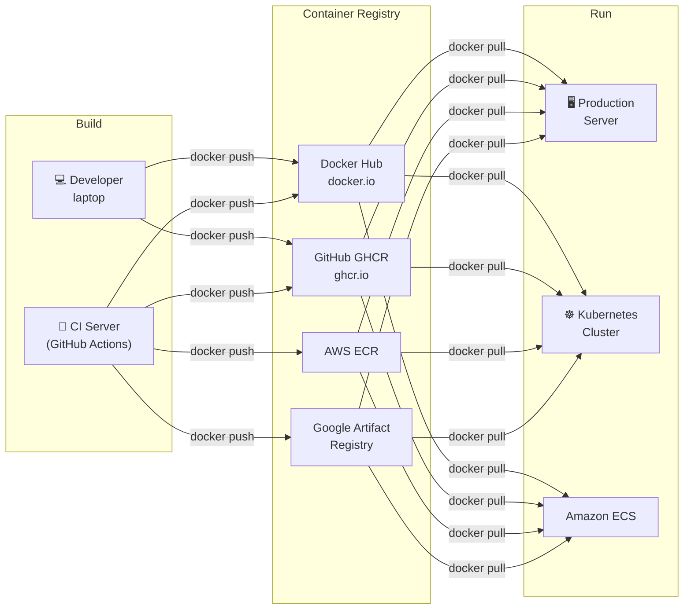

# Container Registries: The Distribution Layer

Container registry ဆိုတာက ကိုယ် build ထထားတဲ့ image (developer ရဲ့ laptop သို့မဟုတ် CI server) နဲ့ အဲဒီ image ကို run မယ့်နေရာ (production server, Kubernetes cluster) အကြားက distribution layer တစ်ခု ဖြစ်ပါတယ်။ Registry သာ မရှိရင် စက်တွေကြားမှာ image tarballs တွေကို လက်နဲ့ ကိုယ်တိုင် copy ကူးနေရမှာ ဖြစ်ပါတယ်။



---

## Image Naming: The Full Format

Registry တစ်ခုခုကို push မလုပ်ခင်မှာ image ကို နာမည်မှန်ကန်စွာနဲ့ tag လုပ်ထားဖို့ လိုအပ်ပါတယ် -

```
[registry/][namespace/]repository[:tag][@digest]

registry   = docker.io (default), ghcr.io, ECR URL, etc.
namespace  = Docker Hub username or org; GitHub org/user
repository = image name
tag        = version label (default: latest if omitted)
digest     = sha256:abc123... (immutable, always points to same image)

Examples:
nginx                                          # docker.io/library/nginx:latest
node:20-alpine                                 # docker.io/library/node:20-alpine
johndoe/my-api:v1.2.3                          # docker.io/johndoe/my-api:v1.2.3
ghcr.io/yourorg/backend:abc1234                # GitHub GHCR
123456789.dkr.ecr.us-east-1.amazonaws.com/app  # AWS ECR
nginx@sha256:a3b4c5d6...                        # Immutable digest reference
```

---

## Docker Hub: The Default Public Registry

Docker Hub (`docker.io`) ကတော့ default registry တစ်ခုဖြစ်ပြီး container images တွေအတွက် အကြီးဆုံး public repository လည်း ဖြစ်ပါတယ်။

### Setup and Login

```bash
# Create account at hub.docker.com first

# Login interactively
docker login
# Username: johndoe
# Password: ****
# Login Succeeded

# Login with a token (more secure — use an Access Token, not your password)
# 1. Go to hub.docker.com → Account Settings → Security → New Access Token
# 2. Copy the token
echo "dckr_pat_..." | docker login --username johndoe --password-stdin
# Login Succeeded

# Credentials are stored in:
cat ~/.docker/config.json
# {"auths": {"https://index.docker.io/v1/": {"auth": "base64(user:token)"}}}
```

### Build, Tag, and Push

```bash
# Build your image
docker build -t my-api:v1.0.0 .

# Tag for Docker Hub (must prefix with your username)
docker tag my-api:v1.0.0 johndoe/my-api:v1.0.0

# Also tag as latest
docker tag my-api:v1.0.0 johndoe/my-api:latest

# Push both tags
docker push johndoe/my-api:v1.0.0
docker push johndoe/my-api:latest

# Anyone can pull your public image:
docker pull johndoe/my-api:v1.0.0
```

### Private Repositories on Docker Hub

```bash
# Create private repo at hub.docker.com → Repositories → Create Repository
# Set visibility to Private

# Push to private repo (same process — auth required on pull)
docker push johndoe/my-private-api:v1.0.0

# Pull from private repo (must be logged in)
docker pull johndoe/my-private-api:v1.0.0

# On servers/CI: pull with credentials
echo "$DOCKER_TOKEN" | docker login --username "$DOCKER_USERNAME" --password-stdin
docker pull johndoe/my-private-api:v1.0.0
```

---

## GitHub Container Registry (GHCR): Recommended for GitHub Projects

GHCR ကတော့ source code နဲ့အတူ image တွေကိုပါ တွဲသိမ်းပေးတာ ဖြစ်ပါတယ်။ GitHub permissions နဲ့ access control လုပ်လို့ရပြီး repository တစ်ခုတည်းမှာပဲ အတူတကွ မြင်တွေ့ရမှာ ဖြစ်ပါတယ်။

### Authentication

```bash
# Method 1: Personal Access Token (PAT)
# Go to: GitHub → Settings → Developer Settings → Personal Access Tokens (classic)
# Required scopes: read:packages, write:packages, delete:packages

export CR_PAT="ghp_yourtokenhere"
echo "$CR_PAT" | docker login ghcr.io --username YOUR_GITHUB_USERNAME --password-stdin
# Login Succeeded

# Method 2: In GitHub Actions (automatic, no manual token)
# Uses the built-in GITHUB_TOKEN secret
```

### Build, Tag, and Push to GHCR

```bash
# GHCR image naming: ghcr.io/GITHUB_ORG_OR_USER/REPO_NAME:TAG

# Build
docker build -t my-api .

# Tag for GHCR
docker tag my-api ghcr.io/yourorg/my-api:v1.0.0
docker tag my-api ghcr.io/yourorg/my-api:latest

# Push
docker push ghcr.io/yourorg/my-api:v1.0.0
docker push ghcr.io/yourorg/my-api:latest

# Pull (requires auth for private packages)
docker pull ghcr.io/yourorg/my-api:v1.0.0
```

### Full GitHub Actions CI/CD Pipeline

```yaml
# .github/workflows/docker-publish.yml
name: Build and Publish Docker Image

on:
  push:
    branches: [main]
    tags: ["v*.*.*"]           # Trigger on version tags too
  pull_request:
    branches: [main]           # Build on PRs (but don't push)

env:
  REGISTRY: ghcr.io
  IMAGE_NAME: ${{ github.repository }}   # = yourorg/my-api

jobs:
  build-and-push:
    runs-on: ubuntu-latest
    permissions:
      contents: read
      packages: write            # Required to push to GHCR

    steps:
      - name: Checkout repository
        uses: actions/checkout@v4

      - name: Set up Docker Buildx
        uses: docker/setup-buildx-action@v3

      - name: Log in to GitHub Container Registry
        if: github.event_name != 'pull_request'   # Don't push on PRs
        uses: docker/login-action@v3
        with:
          registry: ${{ env.REGISTRY }}
          username: ${{ github.actor }}
          password: ${{ secrets.GITHUB_TOKEN }}   # Auto-provided by GitHub Actions

      - name: Extract metadata (tags and labels)
        id: meta
        uses: docker/metadata-action@v5
        with:
          images: ${{ env.REGISTRY }}/${{ env.IMAGE_NAME }}
          tags: |
            # Tag with short git SHA (e.g., abc1234)
            type=sha,prefix=,format=short
            # Tag with semantic version from git tag (e.g., v1.2.3)
            type=semver,pattern={{version}}
            type=semver,pattern={{major}}.{{minor}}
            # Always tag main branch as 'latest'
            type=raw,value=latest,enable={{is_default_branch}}
            # Tag with branch name for non-main branches (e.g., feature-xyz)
            type=ref,event=branch,enable=${{ github.ref != 'refs/heads/main' }}

      - name: Build and push Docker image
        uses: docker/build-push-action@v5
        with:
          context: .
          target: runner                  # Only build the production stage
          push: ${{ github.event_name != 'pull_request' }}
          tags: ${{ steps.meta.outputs.tags }}
          labels: ${{ steps.meta.outputs.labels }}
          # Cache: reuse layers from the previous build (drastically speeds up CI)
          cache-from: type=gha
          cache-to: type=gha,mode=max

      - name: Image digest
        run: echo "Pushed image digest: ${{ steps.build.outputs.digest }}"
```

---

## AWS Elastic Container Registry (ECR)

AWS deployments (ECS, EKS, Lambda) တွေအတွက်ဆိုရင် -

```bash
# Authenticate with ECR (token valid for 12 hours)
aws ecr get-login-password --region us-east-1 | \
  docker login --username AWS \
  --password-stdin 123456789.dkr.ecr.us-east-1.amazonaws.com

# Create a repository (if it doesn't exist)
aws ecr create-repository --repository-name my-api --region us-east-1

# Tag and push
IMAGE_URI="123456789.dkr.ecr.us-east-1.amazonaws.com/my-api"
docker tag my-api:latest $IMAGE_URI:latest
docker tag my-api:latest $IMAGE_URI:$(git rev-parse --short HEAD)

docker push $IMAGE_URI:latest
docker push $IMAGE_URI:$(git rev-parse --short HEAD)

# ECR image scanning (free vulnerability scanning)
aws ecr describe-image-scan-findings \
  --repository-name my-api \
  --image-id imageTag=latest
```

---

## Tagging Strategy: Semantic Versioning + Git SHA

Production အတွက် `:latest` တစ်ခုတည်းကို လုံးဝ မမှီခိုသင့်ပါဘူး။ ခိုင်မာတဲ့ tagging strategy တစ်ခုကတော့ -

```bash
VERSION="v1.2.3"
GIT_SHA=$(git rev-parse --short HEAD)
BRANCH=$(git rev-parse --abbrev-ref HEAD)

# Build once, tag multiple times
docker build -t my-api .

docker tag my-api ghcr.io/yourorg/my-api:${VERSION}         # Semantic version
docker tag my-api ghcr.io/yourorg/my-api:${GIT_SHA}         # Immutable SHA reference
docker tag my-api ghcr.io/yourorg/my-api:latest              # Mutable "current" pointer

docker push ghcr.io/yourorg/my-api:${VERSION}
docker push ghcr.io/yourorg/my-api:${GIT_SHA}
docker push ghcr.io/yourorg/my-api:latest
```

| Tag | Example | Mutable? | Use for |
|-----|---------|----------|---------|
| Semantic version | `v1.2.3` | No | Production releases |
| Git SHA | `abc1234` | No | Debugging, audit trail |
| Branch name | `main` | Yes | Latest from that branch |
| `latest` | `latest` | Yes | Convenience only |

**Rule**: Production Kubernetes သို့မဟုတ် Compose manifests တွေမှာ တိကျတဲ့ tag တစ်ခုခု (`v1.2.3` သို့မဟုတ် `abc1234`) ကိုပဲ အမြဲ သုံးသင့်ပြီး `:latest` ကို လုံးဝ မသုံးသင့်ပါဘူး။ ဒါမှသာ rollbacks လုပ်တဲ့အခါ ခန့်မှန်းရလွယ်ကူစေမှာ ဖြစ်ပါတယ်။

---

## Image Management Locally

```bash
# List images
docker images
docker images my-api              # Filter by name
docker images --filter "dangling=true"  # Untagged/orphaned images

# Remove images
docker rmi my-api:v1.0.0
docker rmi -f my-api:v1.0.0       # Force (even if containers reference it)
docker image prune                 # Remove dangling (untagged) images
docker image prune -a              # Remove ALL unused images (careful!)

# Inspect image metadata
docker inspect my-api:v1.0.0
docker inspect --format '{{.Config.Env}}' my-api:v1.0.0  # Print env vars
docker inspect --format '{{.Config.Labels}}' my-api:v1.0.0

# Save/load images (for offline/air-gapped transfers)
docker save my-api:v1.0.0 | gzip > my-api-v1.tar.gz     # Export
docker load < my-api-v1.tar.gz                            # Import
```

---

## Summary

Container registries ဆိုတာက build→run pipeline ရဲ့ အဓိက ကျောရိုး ဖြစ်ပါတယ် -
- **Docker Hub** သည် public default ဖြစ်ပြီး open-source images နဲ့ personal projects တွေအတွက် သင့်တော်ပါတယ်။ Passwords တွေအစား Access Tokens တွေကို သုံးပါ
- **GitHub GHCR** သည် org projects တွေအတွက် အကြံပြုလိုပါတယ်။ GitHub permissions ကနေတဆင့် access control လုပ်နိုင်ပြီး source code နဲ့အတူ image တွေပါ တွဲရှိနေမှာ ဖြစ်ပါတယ်
- **AWS ECR / Google GAR** တွေကိုတော့ သက်ဆိုင်ရာ cloud platforms တွေပေါ်က cloud-native production deployments တွေအတွက် သုံးပါတယ်
- Images တွေကို semantic versions နဲ့ git SHAs တွေ အမြဲ tag လုပ်ပါ။ Production မှာ `:latest` တစ်ခုတည်းကို လုံးဝ မမှီခိုပါနဲ့
- `docker/build-push-action` + `cache-from: type=gha` ပါတဲ့ GitHub Actions pipeline ကတော့ အမြန်ဆန်ဆုံးနဲ့ production-ready အဖြစ်ဆုံး CI setup ဖြစ်ပါတယ်
- Production manifests တွေမှာ rollbacks တွေ ခန့်မှန်းရလွယ်ကူစေဖို့အတွက် တိကျပြီး မပြောင်းလဲနိုင်တဲ့ tag တစ်ခုခုကို အမြဲ ညွှန်းဆိုပေးထားသင့်ပါတယ်

နောက်လာမယ့် သင်ခန်းစာမှာတော့ containers တွေကို security ခြိမ်းခြောက်မှုတွေကနေ ကာကွယ်ဖို့ (non-root users, vulnerability scanning နဲ့ minimal base images တွေ သုံးခြင်း) ဘယ်လို လုပ်ရမယ်ဆိုတာကို လေ့လာရမှာ ဖြစ်ပါတယ်။