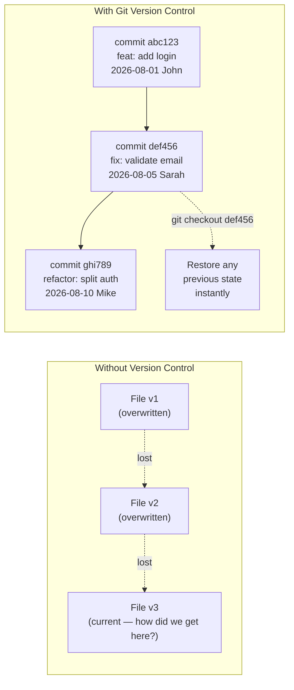
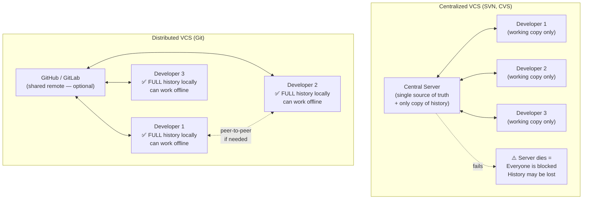

# Codebase တိုင်းမှာ Time Machine တစ်ခု လိုအပ်ပါတယ်

Version control မရှိဘဲနဲ့ software development လုပ်တယ်ဆိုတာ နောက်ပြန်ပြင်လို့မရတဲ့ ဆုံးဖြတ်ချက်တွေ ချမှတ်နေတာနဲ့ အတူတူပါပဲ။ File တစ်ခုကို ပြင်လိုက်တယ်၊ တစ်ခုခု ပျက်သွားတယ်၊ အရင်အလုပ်လုပ်နေတဲ့ ပုံစံအတိုင်း ပြန်သွားလို့မရတော့ဘူး။ Colleague တစ်ယောက်ကို code တွေ မျှဝေချင်လို့ zip file နဲ့ email ပို့လိုက်တယ် — အဲဒီအချိန်ကစပြီး သင်တို့နှစ်ယောက်ရဲ့ code တွေ ကွဲထွက်သွားပါတော့တယ်။ နှစ်ပတ်ကြာသွားတဲ့အခါ ဘယ် version က "မှန်ကန်" တယ်ဆိုတာ ဘယ်သူမှ မသိတော့ပါဘူး။

Version control systems တွေက ဒီပြဿနာကို ဖြေရှင်းပေးပါတယ်။ Project တိုင်းကို အကန့်အသတ်မရှိ undo လုပ်လို့ရတဲ့ history၊ အပြည့်အစုံ မှတ်တမ်းတင်ထားတဲ့ audit trail နဲ့ လူအများကြီး တစ်ချိန်တည်းမှာ Codebase တစ်ခုတည်းအပေါ် အတူတကွ အလုပ်လုပ်နိုင်မယ့် ဖွဲ့စည်းပုံစနစ်တစ်ခုကို ပေးစွမ်းပါတယ်။

---

## Pre-Git ခေတ်ဆိုးကြီး

Version control က standard တစ်ခု ဖြစ်လာခင်တုန်းက dev တွေဟာ ဒီလို workflow မျိုးကို သုံးခဲ့ကြပါတယ်:

```
📁 MyProject/
├── app_v1.zip                                   ← first version
├── app_v2_mike_edits.zip                        ← mike's version
├── app_v2_sarah_edits.zip                       ← sarah's version  
├── app_v2_final_mike_sarah_merged.zip           ← someone manually merged
├── app_FINAL.zip                                ← "final" version
├── app_FINAL_2.zip                              ← actually final
└── app_FINAL_real_FINAL_do_not_delete.zip       ← production? nobody knows
```

**ဒါကြောင့် ဖြစ်လာတဲ့ တကယ့်ပြဿနာများ**:
- **အလုပ်တွေ ဆုံးရှုံးရခြင်း**: Sarah က zip ဖိုင်ဟောင်းကနေ စတင်ခဲ့လို့ Mike ရဲ့ ပြင်ဆင်ချက်တွေကို overwrite လုပ်မိသွားတယ်
- **Audit trail မရှိခြင်း**: မတ်လ ၃ ရက်နေ့က payment calculation ကို ဘယ်သူပြင်လိုက်တာလဲ? ဘယ်သူမှ မသိဘူး
- **Rollback လုပ်မရခြင်း**: Bug က v1 နဲ့ FINAL ကြား တစ်နေရာရာမှာ ဝင်လာတာ — ဒါပေမဲ့ zip files တွေကို diff လုပ်လို့မှ မရတာ
- **အပြောင်းအလဲလုပ်ဖို့ ကြောက်ရွံ့ခြင်း**: ဘာမှ refactor မလုပ်ချင်ကြတော့ဘူး၊ ဘာဖြစ်လို့လဲဆိုတော့ "ပြင်လိုက်လို့ ပျက်သွားပြီး အရင်အတိုင်း ပြန်မရရင် ဘယ်လိုလုပ်မလဲ" ဆိုတဲ့ စိုးရိမ်စိတ်ကြောင့်ပေါ့

---

## Version Control က အမှန်တကယ် ဘာတွေပေးလဲ



**Commit တိုင်းက အောက်ပါတို့ကို ပေးစွမ်းပါတယ်**:
1. **အမြဲတမ်း မှတ်တမ်းတင်ထားတဲ့ snapshot တစ်ခု** (အဲဒီအချိန်က file တိုင်းရဲ့ ပုံစံ)
2. **Attribution**: ဘယ်သူက ပြင်ဆင်ခဲ့တာလဲ (နာမည် + email)
3. **Context**: ဘာကြောင့် ဒီအပြောင်းအလဲကို လုပ်ခဲ့တာလဲ (commit message)
4. **Timestamp**: ဘယ်အချိန်မှာ ဖြစ်ပျက်ခဲ့တာလဲ
5. **Reversibility**: ဘယ် point ကိုမဆို အလွယ်တကူ ပြန်သွားနိုင်ဖို့ `git revert` သို့မဟုတ် `git checkout`

---

## Centralized vs Distributed Version Control

Git ဆိုတာ **Distributed** VCS တစ်ခု ဖြစ်ပါတယ် — SVN လိုမျိုး ပိုဟောင်းတဲ့ centralized စနစ်တွေနဲ့ လုံးဝ ကွာခြားပါတယ်:



| အပိုင်း | Centralized (SVN) | Distributed (Git) |
|--------|-----------------|-------------------|
| **Offline commits** | ❌ Server နဲ့ ချိတ်ဆက်ထားဖို့ လိုတယ် | ✅ Local history အပြည့်အစုံ ပါရှိတယ် |
| **Speed** | နှေးတယ် (command တိုင်း network round-trip လုပ်ရလို့) | ⚡ မြန်ဆန်တယ် (local disk အလုပ်တွေပဲမို့) |
| **Single point of failure** | ⚠️ Server ပျက်ရင် = အဖွဲ့သားအားလုံး အလုပ်ရပ်သွားမယ် | 🛡️ Clone တိုင်းက full backup တစ်ခု ဖြစ်တယ် |
| **Branching** | နှေးတယ်၊ ကုန်ကျစရိတ်များတယ် (files တွေကို ကူးရလို့) | ချက်ချင်းနီးပါး ပြီးတယ် (pointer တစ်ခုပဲမို့) |
| **History** | Server မှာပဲ ရှိတယ် | Developer တိုင်းရဲ့ machine မှာ ရှိတယ် |

---

## Git vs GitHub: အဖြစ်များဆုံး ရှုပ်ထွေးမှု

```
Git  ≠  GitHub

Git:    သင့်ကွန်ပျူတာမှာ တပ်ဆင်ထားတဲ့ အခမဲ့၊ open-source command-line tool တစ်ခု ဖြစ်ပြီး 
        commits၊ branches နဲ့ diffs တွေကို သုံးပြီး file history တွေကို ခြေရာခံပေးပါတယ်။
        Linux kernel ကို စီမံခန့်ခွဲဖို့ Linus Torvalds က ၂၀၀၅ ခုနှစ်မှာ ဖန်တီးခဲ့တာပါ။
        အသုံးပြုပုံများ: git init, git commit, git branch

GitHub: Git ပေါ်မှာ တည်ဆောက်ထားတဲ့ cloud platform တစ်ခု ဖြစ်ပါတယ်။
        ဒါက အောက်ပါတို့ကို ပံ့ပိုးပေးပါတယ်: web UI, pull requests, code review, GitHub Actions CI/CD,
        issue tracking, wikis နဲ့ team access control တို့ ဖြစ်ပါတယ်။
        အခြားရွေးချယ်စရာများ: GitLab, Bitbucket, Azure DevOps, Gitea
```

GitHub မပါဘဲနဲ့ Git ကို သုံးလို့ရပါတယ် (local-only repos ပေါ့)။ ဒါပေမဲ့ Git မပါဘဲ GitHub ကို လုံးဝ သုံးလို့မရပါဘူး။

---

## Git ပေးတဲ့ အာမခံချက် ၃ ရပ်

**၁။ Integrity — Commit တိုင်းမှာ SHA-256 fingerprint တစ်ခုစီ ပါရှိပါတယ်**

```bash
git log --oneline
# abc1234 feat: add payment processing
# def5678 fix: handle expired sessions
# ghi9012 docs: update API reference

# "abc1234" တစ်ခုချင်းစီဟာ SHA-256 hash ရဲ့ ပထမဆုံး စာလုံး ၇ လုံး ဖြစ်ပါတယ်
# Hash မှာ content၊ parent commit၊ author နဲ့ timestamp တွေ အားလုံးပါဝင်ပါတယ်
# အဲ့ဒီ data ထဲက ဘာမဆို bit တစ်ခု ပြောင်းသွားတာနဲ့ → လုံးဝကွဲပြားခြားနားတဲ့ hash ဖြစ်သွားပါမယ်
# → ဒါကြောင့် Git က ဝင်ရောက်နှောင့်ယှက်မှု (tampering) ဒါမှမဟုတ် ပျက်စီးမှု မှန်သမျှကို အလိုအလျောက် သိရှိနိုင်ပါတယ်
```

**၂။ Completeness — Clone တိုင်းမှာ history အပြည့်အစုံ ပါရှိပါတယ်**

```bash
git clone https://github.com/torvalds/linux.git
# Linux kernel commits ပေါင်း ၁,၂၀၀,၀၀၀+ ကျော်ထဲက တစ်ခုချင်းစီဟာ သင့် machine ပေါ်မှာ အခု ရောက်နေပါပြီ
# ၂၀၀၅ ခုနှစ်ကနေ ယနေ့အထိ Linux ရဲ့ ဘယ် version ကိုမဆို offline အနေနဲ့ ကြည့်ရှုနိုင်ပါတယ်
```

**၃။ Reversibility — ဘယ် state ကိုမဆို ပြန်ယူလို့ရပါတယ်**

```bash
# နောက်ဆုံး commit ကို ပယ်ဖျက်လိုက်ပါ၊ ဒါပေမဲ့ ပြင်ဆင်ချက်တွေကိုတော့ ဆက်သိမ်းထားပါမယ်
git reset HEAD~1

# သတ်မှတ်ထားတဲ့ commit တစ်ခုဆီကို အပြည့်အဝ ပြန်သွားပါ (အသစ် "undo" commit တစ်ခု ဖန်တီးပေးပါတယ်)
git revert abc1234

# လွန်ခဲ့တဲ့ commit ၃ ခုက သတ်မှတ်ထားတဲ့ file တစ်ခုကို ပြန်ယူပါ
git checkout HEAD~3 -- src/payments/processor.ts

# သင့်ရဲ့ working tree တစ်ခုလုံးကို သတ်မှတ်ထားတဲ့ commit တစ်ခုဆီ ပြန်ပြောင်းပါ
git checkout abc1234
```

---

## DevOps အတွက် ဒါက ဘာကြောင့် အရေးကြီးတာလဲ

Version control ဆိုတာ DevOps practice တိုင်းရဲ့ အခြေခံအုတ်မြစ် ဖြစ်ပါတယ်-

- **CI/CD pipelines တွေက git push လုပ်တဲ့အခါ အလုပ်စလုပ်ပါတယ်** — တစ်ခုခု commit တင်လိုက်လို့ pipeline က အလုပ်စလုပ်တာပါ
- **Infrastructure as Code** (Terraform, Kubernetes manifests) တွေကို Git မှာ သိမ်းဆည်းပါတယ် — သင့်ရဲ့ infrastructure မှာ history ရှိမယ်၊ PR reviews ရှိမယ်၊ rollback လုပ်နိုင်စွမ်း ရှိပါမယ်
- **GitOps** က တစ်စနစ်လုံးရဲ့ state အတွက် source of truth အဖြစ် Git ကို အသုံးပြုပါတယ် — cluster က repo ထဲမှာရှိတဲ့ ပုံစံအတိုင်း ကိုယ့်ကိုကိုယ် ပြန်ညှိယူပါတယ်
- **Incident response**: "လွန်ခဲ့တဲ့ တစ်နာရီအတွင်း ဘာတွေပြောင်းသွားလဲ?" — `git log --since 1h` က သင့်ကို အဖြေချက်ချင်း ပေးပါမယ်
- **Code review** (Pull Requests) ကတော့ code တွေ main branch ထဲ မရောက်ခင်မှာ လုပ်ရမယ့် ပင်မ quality gate တစ်ခု ဖြစ်ပါတယ်

```bash
# DevOps တွေရဲ့ နေ့စဉ် လက်တွေ့ဘဝ: git နဲ့ production မေးခွန်းတွေကို ဖြေဆိုခြင်း
git log --since="2 hours ago" --oneline --author="john"
# လွန်ခဲ့တဲ့ ၂ နာရီအတွင်း John push လုပ်ခဲ့တာတွေကို အတိအကျပြသပေးပါတယ် — production ပျက်သွားတာ ဒါကြောင့်လား?

git diff HEAD~5 HEAD -- config/nginx.conf
# လွန်ခဲ့တဲ့ commits ၅ ခုအတွင်း nginx config မှာ ဘာတွေပြောင်းလဲသွားလဲ?
```

---

## အနှစ်ချုပ်

- Version control က software development ကို **permanent snapshots** (commits)၊ **full attribution** (ဘယ်သူက ဘာပြောင်းလဲလဲ)၊ **context** (ဘာကြောင့်လဲ) နဲ့ **reversibility** (ဘယ် state ကိုမဆို ပြန်သွားနိုင်မှု) တွေကို ပေးစွမ်းပါတယ်
- **Git ဆိုတာ distributed ဖြစ်ပါတယ်**: developer တိုင်းမှာ history တစ်ခုလုံးရဲ့ local copy အပြည့်အစုံ ရှိပါတယ် — မြန်ဆန်တယ်၊ offline သုံးလို့ရတယ်၊ ခိုင်ခံ့တယ်
- **Git ≠ GitHub**: Git က local tool ဖြစ်ပြီး၊ GitHub ကတော့ အပေါ်ကနေ တည်ဆောက်ထားတဲ့ cloud platform ဖြစ်ပါတယ်
- Commit တိုင်းမှာ **SHA-256 fingerprint** ပါရှိပါတယ် — တိုက်ခိုက်ဖျက်ဆီးလို့မရအောင် လုံခြုံရေး တည်ဆောက်ထားပါတယ်
- Version control ဆိုတာ CI/CD၊ GitOps၊ Infrastructure as Code နဲ့ အခြား DevOps practice တိုင်းရဲ့ အခြေခံအုတ်မြစ် ဖြစ်ပါတယ်

နောက်လာမယ့် lesson မှာတော့ သင့်ရဲ့ machine မှာ Git ကို install လုပ်မယ်၊ identity ကို configure လုပ်မယ် — ဒါက code တွေကို မစောင့်ကြည့်ခင် လုပ်ရမယ့် ပထမဆုံး အဆင့်ပါပဲ။