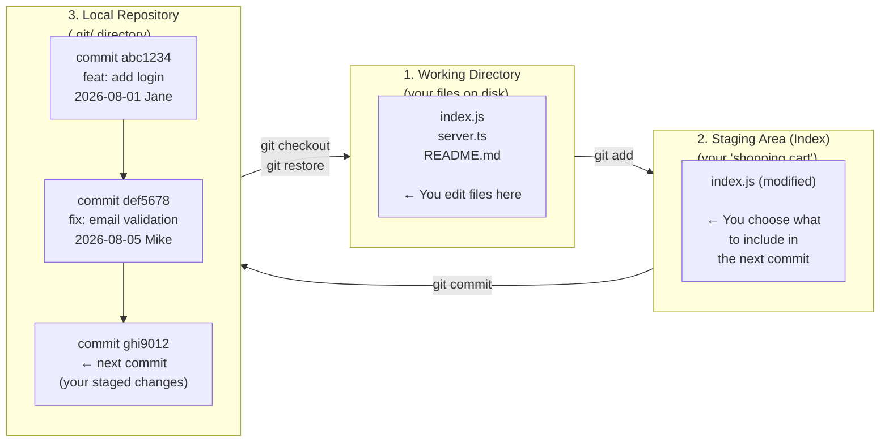

# Git ရဲ့ Area သုံးခု- Core Mental Model

Git မှာရှိတဲ့ အရာရာတိုင်းဟာ Area သုံးခုနဲ့ပဲ သက်ဆိုင်နေပါတယ်။ ဒီ Mental Model ကို ဦးနှောက်ထဲမှာ ကွက်ကွက်ကွင်းကွင်း မြင်လာတဲ့အထိ မဖြစ်မချင်း Git သုံးရတာ တစ်မျိုးကြီး ဖြစ်နေပါလိမ့်မယ်။ တစ်ခါ သဘောပေါက်သွားပြီဆိုရင်တော့ Command တိုင်းက သဘာဝကျပြီး အဓိပ္ပါယ်ရှိလာပါလိမ့်မယ်။



- **Working Directory**: ကိုယ့်ရဲ့ IDE ထဲမှာ မြင်နေရ၊ ပြင်နေရတဲ့ တကယ့်ဖိုင်တွေပါ။ ဒီထဲက ပြောင်းလဲမှုတွေက "dirty" ဖြစ်နေပါသေးတယ် (Staged မလုပ်ရသေးဘူး)။
- **Staging Area** (Index လို့လည်း ခေါ်ပါတယ်): ပြင်ဆင်တဲ့ နေရာတစ်ခုပါ။ Commit မလုပ်ခင် ကိုယ်ထည့်ချင်တဲ့ ပြောင်းလဲမှုတွေကို ရွေးချယ်ပြီး တင်ထားတဲ့နေရာဖြစ်ပါတယ်။ ဒါက ဖိုင်အပြောင်းအလဲ အကုန်လုံးထဲကမှ လိုချင်တာကိုပဲ ရွေးပြီး Commit လုပ်လို့ရအောင် ကူညီပေးပါတယ်။
- **Local Repository**: `.git/` ဖိုဒါထဲမှာ သိမ်းဆည်းထားတဲ့ အမြဲတမ်းမှတ်တမ်း (Commit history) တွေပါ။ Commit လုပ်ပြီးသွားပြီဆိုရင် အဲ့ဒီ Snapshot က ပြောင်းလဲလို့မရတော့ပါဘူး (Immutable ဖြစ်သွားပါတယ်)။

---

## Step 1: Repository တစ်ခု စတင်ဖန်တီးခြင်း (Initialize)

```bash
mkdir my-devops-project && cd my-devops-project

git init
# Initialized empty Git repository in /Users/jane/my-devops-project/.git/

ls -la
# drwxr-xr-x  .git/   ← all of git's data is stored here
# (everything else is empty — your working directory)
```

**`.git/` ထဲမှာ ဘာတွေပါလဲ**:
```
.git/
├── HEAD          ← ကိုယ်လက်ရှိ ရောက်နေတဲ့ branch
├── config        ← local repository config
├── objects/      ← commit ဒေတာ အားလုံး (SHA hash နဲ့ သိမ်းပါတယ်)
├── refs/
│   ├── heads/    ← branch ပွိုင်တာများ (main, feature/login စသည်ဖြင့်)
│   └── tags/     ← release tag များ
└── index         ← staging area (binary ဖော်မတ်နဲ့)
```

<Callout type="warning" title="Never Delete or Edit .git Manually">
`.git/` ဆိုတာ တကယ့် Repository ပါပဲ။ အဲ့ဒါကို ဖျက်လိုက်ရင် ကိုယ့်ရဲ့ဖိုဒါဟာ Version ထိန်းချုပ်လို့မရတော့တဲ့ သာမန်ဖိုဒါတစ်ခု ဖြစ်သွားပါမယ်။ ကိုယ်ဘာလုပ်နေမှန်း သေချာမသိရင် `.git/` ထဲကဖိုင်တွေကို ဘယ်တော့မှ လက်နဲ့ သွားမပြင်ပါနဲ့။
</Callout>

---

## Step 2: Status ကို အမြဲစစ်ဆေးပါ

`git status` ဆိုတာ အရေးအကြီးဆုံး Command တစ်ခုဖြစ်ပါတယ်။ မကြာခဏ Run ပေးသင့်ပါတယ်-

```bash
# ဖိုင်အချို့ ဖန်တီးမည်
echo '{"name":"my-app","version":"1.0.0"}' > package.json
echo "console.log('hello devops');" > index.js
mkdir src && echo "export const greet = (name) => \`Hello \${name}\`" > src/greet.ts

git status
```

```text
On branch main

No commits yet

Untracked files:
  (use "git add <file>..." to include in what will be committed)
        index.js
        package.json
        src/

nothing added to commit but untracked files present
```

**Status သင်္ကေတများ**:
```
?? filename.txt     → Untracked (Git က ဒီဖိုင်အသစ်ကို မသိသေးပါဘူး)
A  filename.txt     → Added to staging (ဖိုင်အသစ်ကို Staging Area တင်ထားပြီး)
M  filename.txt     → Modified (Git သိပြီးသားဖိုင် ပြောင်းလဲထားတာရှိတယ်)
D  filename.txt     → Deleted
MM filename.txt     → Staging Area ရော Working Directory မှာပါ နှစ်နေရာလုံး ပြင်ထားတာ
```

```bash
# Status ကို အတိုချုံးကြည့်ချင်ရင် (ဖိုင်တွေများလာရင် ပိုအသုံးဝင်ပါတယ်)
git status -sb
# ?? index.js
# ?? package.json
# ?? src/
```

---

## Step 3: Changes များကို Stage လုပ်ခြင်း

`git add` က ပြောင်းလဲမှုတွေကို Working Directory ကနေ Staging Area ထဲကို ရွှေ့ပေးပါတယ်-

```bash
# ဖိုင်တစ်ခုတည်းကို Add မည်
git add package.json

# သီးခြားဖိုင်အများစုကို Add မည်
git add index.js src/greet.ts

# အကုန်လုံးကို Add မည် (သတိနဲ့သုံးပါ — .gitignore ကို အရင်စနစ်တကျလုပ်ပါ!)
git add .

# .ts ဖိုင်အားလုံးကို Recursive လုပ်ပြီး Add မည်
git add "*.ts"

# ဖိုင်တစ်ခုရဲ့ အစိတ်အပိုင်းအချို့ကို ရွေးပြီး Staging တင်မည် (အရမ်းမိုက်တဲ့ Feature ပါ!)
git add -p index.js
# ပြောင်းလဲထားတာတွေကို ပြပြီး မေးပါလိမ့်မယ်: Stage this hunk? [y,n,q,a,d,?]
```

```bash
# package.json ကို Stage လုပ်ပြီးသွားတဲ့အခါ
git status
# Changes to be committed:
#   (use "git restore --staged <file>..." to unstage)
#         new file:   package.json
#
# Untracked files:
#         index.js
#         src/
```

### Unstaging လုပ်ခြင်း (`git add` ကို ပြန်ဖြုတ်ခြင်း)

```bash
# သီးခြားဖိုင်တစ်ခုကို Staging ကနေ ဖြုတ်မည် (ကိုယ့် Working Directory ထဲကပြင်ဆင်ချက်တွေကတော့ ရှိနေတုန်းပါပဲ)
git restore --staged package.json

# အကုန်လုံးကို Unstage မည်
git restore --staged .
```

---

## Step 4: Snapshot တစ်ခု Commit လုပ်ခြင်း

```bash
# အကုန်လုံးကို Stage လုပ်ပြီး Commit မည်
git add .
git commit -m "feat: initial project setup"
```

```text
[main (root-commit) 4a8b1c2] feat: initial project setup
 3 files changed, 3 insertions(+)
 create mode 100644 index.js
 create mode 100644 package.json
 create mode 100644 src/greet.ts
```

### Commit Message ရေးတဲ့အခါ လိုက်နာသင့်တဲ့ အလေ့အကျင့်ကောင်းများ

```bash
# ❌ အသုံးမဝင်တဲ့ Message တွေ — အနာဂတ်မှာ ကိုယ့်ကိုကိုယ် ဘာမှန်း ပြန်မသိနိုင်ပါဘူး
git commit -m "update"
git commit -m "fix"
git commit -m "stuff"
git commit -m "wip"

# ✅ Conventional Commits ပုံစံ (Industry Standard ဖြစ်ပါတယ်)
# type(scope): လက်ရှိအချိန်အခါနဲ့ ရေးထားတဲ့ အတိုချုပ် (စာလုံးရေ 72 ထက်မပိုရပါ)
git commit -m "feat(auth): add JWT token refresh endpoint"
git commit -m "fix(payments): handle null response from Stripe API"
git commit -m "ci: add Trivy container scanning to pipeline"
git commit -m "docs: update deployment guide for k8s"
git commit -m "refactor(db): extract connection pool to singleton"
```

### စာကြောင်းရေများတဲ့ Multi-line Commit Messages တွေ ရေးချင်ရင်

```bash
# အရေးကြီးတဲ့ ပြောင်းလဲမှုတွေအတွက် အသေးစိတ် ရေးနိုင်ပါတယ်
git commit
# ကိုယ် Configure လုပ်ထားတဲ့ Editor ပွင့်လာပါမယ် — အဲ့ဒီမှာ အသေးစိတ် ရေးပါ:
```

```text
feat(api): add rate limiting middleware

Adds per-IP rate limiting to the API to prevent abuse:
- 100 requests/minute for unauthenticated users
- 1000 requests/minute for authenticated users

Uses the token bucket algorithm (redis-backed) for accuracy.
Resolves: #234
```

---

## Step 5: History ကို စစ်ဆေးခြင်း

```bash
# အသေးစိတ် Log အားလုံး ကြည့်မည်
git log

# တစ်ကြောင်းတည်းနဲ့ အတိုချုပ်ကြည့်မည် (နေ့စဉ်သုံးဖို့ အကောင်းဆုံးပါ)
git log --oneline
# 9f7e3a1 fix: handle empty cart state
# 4c2b8d5 feat: add product search with filters
# 1a9f4c2 feat: initial project setup

# Branch/merge တွေကို ပုံစံအလှနဲ့ ကြည့်မည် (Lesson 2 မှာ လုပ်ခဲ့တဲ့ alias ပါ)
git log --oneline --graph --decorate --all
# * 9f7e3a1 (HEAD -> main, origin/main) fix: handle empty cart state
# * 4c2b8d5 feat: add product search with filters
# * 1a9f4c2 feat: initial project setup

# နောက်ဆုံး Commit N ခုကို ပြရန်
git log -5 --oneline

# Author တစ်ဦးချင်းစီရဲ့ Commit များကို ပြရန်
git log --author="Jane" --oneline

# கடந்த 2 weeks အတွင်းက Commit များကို ပြရန်
git log --since="2 weeks ago" --oneline

# သီးခြားဖိုင်တစ်ခုနဲ့ သက်ဆိုင်တဲ့ Commit များကို ပြရန်
git log --oneline -- src/payments/processor.ts

# Commit တစ်ခုချင်းစီရဲ့ အသေးစိတ် Diff များကို ပြရန်
git show 4c2b8d5
```

---

## Step 6: Diff — ဘာတွေပြောင်းလဲသွားလဲဆိုတာ တိတိကျကျ ကြည့်ခြင်း

```bash
# Working Directory ထဲမှာ ပြောင်းလဲမှုတွေ (Staged မလုပ်ရသေးတာတွေ)
git diff

# Staged လုပ်ပြီးသား ပြောင်းလဲမှုများ (Commit လုပ်ဖို့ အသင့်ဖြစ်နေတာတွေ)
git diff --staged

# Commit နှစ်ခုကြားက ကွာခြားချက်
git diff HEAD~3 HEAD

# Branch နှစ်ခုကြားက ကွာခြားချက်
git diff main feature/checkout

# သီးခြားဖိုင်တစ်ခုရဲ့ Diff ကို ကြည့်ရန်
git diff src/greet.ts

# စာရင်းအင်းများ (ဖိုင်တစ်ဖိုင်ချင်းစီမှာ ဘယ်လောက်လိုင်း တိုးလာ/လျော့သွားလဲ)
git diff --stat HEAD~5
# src/auth/login.ts  | 45 ++++++++++---
# src/auth/logout.ts | 12 ----
# 2 files changed, 45 insertions(+), 16 deletions(-)
```

---

## ပြောင်းလဲမှုများကို ပြန်ဖျက်ခြင်း (Undoing Changes)

Git မှာ အဆင့်အမျိုးမျိုးနဲ့ ပြန်ဖြုတ်လို့ရပါတယ်:

```bash
# === Working Directory (`git add` မလုပ်ခင်) ===

# Staged မလုပ်ရသေးတဲ့ ပြောင်းလဲမှု အားလုံးကို ဖျက်မည် (ပြန်ပြင်လို့မရတော့ပါ — သတိနဲ့သုံးပါ!)
git restore .

# သီးခြားဖိုင်တစ်ခုတည်းရဲ့ ပြောင်းလဲမှုများကို ဖျက်မည်
git restore src/greet.ts

# === Staging Area (`git add` ပြီး၊ `git commit` မလုပ်ခင်) ===

# Unstage လုပ်မည် (Working Directory ထဲကို ပြန်ပို့လိုက်မယ် — ကိုယ့်ပြင်ဆင်ချက်တွေကတော့ ရှိနေတုန်းပါပဲ)
git restore --staged src/greet.ts

# === Repository (`git commit` ပြီးနောက်) ===

# နောက်ဆုံး Commit ကို ဖျက်လိုက်မယ်၊ ဒါပေမဲ့ ပြောင်းလဲမှုတွေကို Staged အဖြစ် ဆက်ထားမယ်
git reset HEAD~1 --soft

# နောက်ဆုံး Commit ကို ဖျက်မယ်၊ Staged ကနေပါ ဖြုတ်လိုက်မယ်၊ ဒါပေမဲ့ Working Dir ထဲမှာတော့ ပြင်ဆင်ချက်တွေ ဆက်ရှိနေမယ်
git reset HEAD~1 --mixed    # ← Default ပါ

# နောက်ဆုံး Commit ကိုရော၊ ပြောင်းလဲမှုတွေကိုပါ အကုန်ဖျက်ပစ်မယ် (အန္တရာယ်များပါတယ်!)
git reset HEAD~1 --hard

# Commit အသစ်တစ်ခုအနေနဲ့ အရင်ဟာကို ပြန်ဖျက်တဲ့ Commit တည်ဆောက်မည် (Share လုပ်ထားတဲ့ Branch တွေအတွက် လုံခြုံပါတယ်)
git revert abc1234          # abc1234 ရဲ့ ပြောင်းလဲမှုတွေကို ပြန်ဖျက်ပေးမယ့် Commit အသစ်တစ်ခု ဆောက်ပေးပါတယ်

# သီးခြားဖိုင်တစ်ခုကို အရင် Commit တစ်ခုတုန်းက အတိုင်း အနေအထားကို ပြန်ပြောင်းမည်
git checkout abc1234 -- src/greet.ts
```

<Callout type="warning" title="Never git reset --hard on Pushed Commits">
`git reset --hard` က History ကို အသစ်ပြန်ရေးပါတယ်။ ကိုယ်က Commit ကို GitHub တင်ပြီးသားဖြစ်ပြီး တခြားသူတွေက Pull ဆွဲထားပြီးသားဆိုရင် Reset လုပ်လိုက်တာက အားလုံးအတွက် ပြဿနာတွေ ဖြစ်စေပါလိမ့်မယ်။ History ကို မပြောင်းလဲဘဲ Commit အသစ်နဲ့ ပြန်ပြင်ပေးတဲ့ `git revert` ကို အသုံးပြုပါ။
</Callout>

---

## `.gitignore` ဖိုင်

ဒါကို ပထမဆုံး Commit မလုပ်ခင်ကတည်းက ဖန်တီးထားသင့်ပါတယ်။ Secrets တွေ၊ Dependencies တွေနဲ့ Build Artifact တွေ မတော်တဆ ပါသွားတာကို ကာကွယ်ပေးပါတယ်:

```bash
# .gitignore ဖိုင်ကို ဖန်တီးမည် (Repository ရဲ့ Root မှာ ရှိရပါမယ်)
cat > .gitignore << 'EOF'
# Dependencies
node_modules/
vendor/

# Build outputs
dist/
build/
.next/
*.pyc
__pycache__/

# Secrets and environment (CRITICAL!)
.env
.env.local
.env.production
*.pem
*.key
id_rsa
id_ed25519

# IDE / OS files
.DS_Store
.vscode/
.idea/
Thumbs.db
EOF

git add .gitignore
git commit -m "chore: add comprehensive .gitignore"
```

**မတော်တဆ Secret တစ်ခုခု Commit လုပ်မိသွားရင် ဘာလုပ်ရမလဲ?**

```bash
# History ထဲကနေ ချက်ချင်းဖယ်ရှားပါ (ဘယ်သူမှ Pull မဆွဲခင် လုပ်ရပါမယ်!)
git filter-repo --path .env --invert-paths   # History အားလုံးကို ပြန်ပြင်မည်

# ပြီးရင် Force Push လုပ်ပါ (History ပြင်ပြီးရင် ဒါက မဖြစ်မနေ လုပ်ရပါမယ်)
git push origin --force --all

# ပြီးတာနဲ့ ထွက်သွားတဲ့ Secret ကို ချက်ချင်း အသစ်ပြောင်းပါ (Rotate လုပ်ပါ)
# (GitHub က အလိုအလျောက် စကင်ဖတ်ပြီး တွေ့သွားနိုင်ပါတယ်)
```

---

## အနှစ်ချုပ်: Core Workflow Cheat Sheet

```bash
# ပရောဂျက်တစ်ခု စတင်ရန်
git init && git add . && git commit -m "feat: initial commit"

# နေ့စဉ် အလုပ်လုပ်ရာတွင်
git status                  # လက်ရှိ အနေအထားကို စစ်မည်
git diff                    # ဘာတွေပြောင်းလဲသွားလဲ ကြည့်မည် (Staged မလုပ်ရသေးတာ)
git add specific-file.ts    # သီးခြားဖိုင်တွေကို Stage တင်မည်
git diff --staged           # Commit မလုပ်ခင် ပြန်စစ်မည်
git commit -m "feat: ..."   # ရှင်းလင်းတဲ့ Message နဲ့ Commit မည်
git log --oneline           # Commit ဝင်သွားတာ သေချာအောင် စစ်မည်

# အမှားများကို ပြန်ပြင်ရန်
git restore file.ts         # Staged မလုပ်ရသေးတာတွေကို ဖျက်မည်
git restore --staged file.ts # ဖိုင်တစ်ခုကို Unstage လုပ်မည်
git reset HEAD~1 --mixed    # နောက်ဆုံး Commit ကို ပြန်ဖြုတ်မည် (ပြင်ဆင်ချက်တွေ သိမ်းထားမယ်)
git revert <SHA>            # Push ပြီးသား Commit ကို လုံလုံခြုံခြုံ ပြန်ဖြုတ်မည်
```

နောက် Lesson မှာတော့ Branching အကြောင်းကို ဆက်လက်သင်ယူရမှာ ဖြစ်ပါတယ်။ Main Codebase ကို မထိခိုက်စေဘဲ Feature အသစ်တွေအတွက် Parallel Timeline တွေ ဖန်တီးပြီး ဘယ်လိုအလုပ်လုပ်ရမလဲဆိုတာကို လေ့လာရပါမယ်။