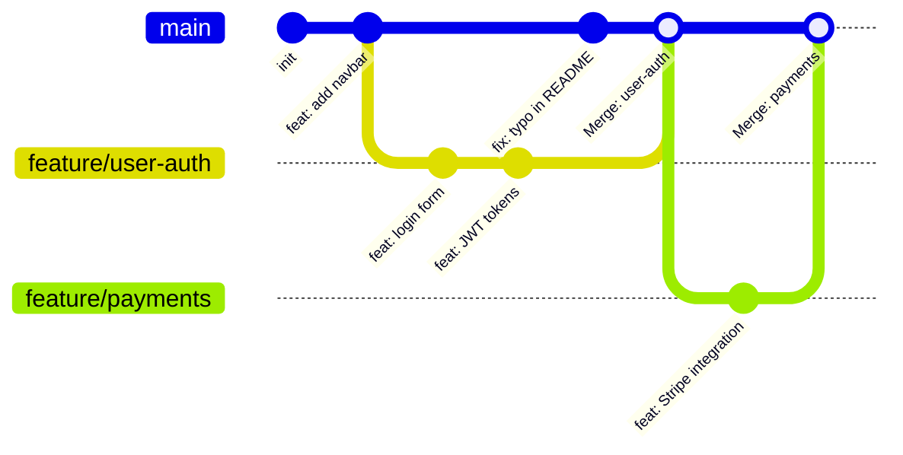

# Branches: Parallel Timelines

Git branch ဆိုတာ commit တစ်ခုဆီကို ညွှန်ပြနေတဲ့ ပေါ့ပါးပြီး ရွှေ့ပြောင်းလို့လွယ်ကူတဲ့ pointer တစ်ခု ဖြစ်ပါတယ်။ Branch တစ်ခု ဖန်တီးတယ်ဆိုတာ ဖိုင်တွေကို ကော်ပီကူးတာ မဟုတ်ပါဘူး — pointer အသစ်တစ်ခု ဖန်တီးလိုက်တာပဲ ဖြစ်ပါတယ်။ ဒါကြောင့် ရှေးခေတ် VCS စနစ်တွေမှာလို ဖိုင်တွေကို တကယ် ကော်ပီကူးယူရတာမျိုး မဟုတ်ဘဲ Git မှာ branching လုပ်တာက စက္ကန့်ပိုင်းအတွင်း ပြီးစီးပါတယ်။



Branch တိုင်းဟာ သီးခြားလွတ်လပ်တဲ့ development လမ်းကြောင်းတစ်ခု ဖြစ်ပါတယ်။ `feature/user-auth` ကို တည်ဆောက်နေစဉ်မှာ `main` က feature အသစ်တွေကို ဆက်ပြီး တင်နေနိုင်ပါတယ် — သူတို့ဟာ တစ်ခုနဲ့တစ်ခု နှောင့်ယှက်မှု မရှိပါဘူး။

---

## Creating and Switching Branches

```bash
# === Modern commands (Git 2.23+) ===

# Branch အသစ် ဖန်တီးပြီး အဲ့ဒီထဲကို ပြောင်းဝင်ရန် (အသုံးအများဆုံး)
git switch -c feature/payment-gateway

# ရှိပြီးသား branch တစ်ခုဆီသို့ ပြောင်းရန်
git switch main
git switch feature/payment-gateway

# === Legacy commands (နေရာတိုင်းမှာ အလုပ်လုပ်ဆဲ) ===
git checkout -b feature/payment-gateway   # switch -c နဲ့ အတူတူပါပဲ
git checkout main                          # switch နဲ့ အတူတူပါပဲ

# === Branch အားလုံးကို ကြည့်ရန် ===
git branch                  # Local branches တွေ
git branch -r               # Remote branches တွေ
git branch -a               # အားလုံး (local + remote)
git branch -v               # နောက်ဆုံး commit အချက်အလက်ပါတဲ့ branches တွေ

# Output:
#   feature/payment-gateway  4c2b8d5 feat: add Stripe webhook handler
# * main                     9f7e3a1 fix: handle empty cart state
# ← ကြယ်ပွင့် (*) လေးက သင့်လက်ရှိ ရောက်နေတဲ့ branch ကို ပြပါတယ်။

# Branch တစ်ခုကို ဖျက်ရန် (Merge ပြီးမှသာ ဖျက်ပါ)
git branch -d feature/payment-gateway      # Safe delete (unmerge ဖြစ်နေရင် error တက်ပါမယ်)
git branch -D feature/payment-gateway      # Force delete (unmerge ဖြစ်နေရင်တောင် ဖျက်မည်)
```

---

## HEAD: Where You Are Right Now

`HEAD` ဆိုတာ သင့်ရဲ့လက်ရှိ တည်နေရာကို အမြဲတမ်း ညွှန်ပြနေတဲ့ special pointer တစ်ခု ဖြစ်ပါတယ် — များသောအားဖြင့် သင့်ရဲ့လက်ရှိ branch ရဲ့ အစွန်းဆုံး (tip) ကို ညွှန်ပြနေပါတယ်။

```bash
git log --oneline
# 9f7e3a1 (HEAD -> main) fix: handle empty cart state   ← သင် ဒီမှာ ရှိနေပါတယ်
# 4c2b8d5 feat: add product search
# 1a9f4c2 feat: initial setup

# Branch ပြောင်းလိုက်တဲ့အခါ HEAD လည်း ရွှေ့သွားပါတယ်
git switch feature/login
git log --oneline
# abc1234 (HEAD -> feature/login) feat: add login form   ← HEAD ရွှေ့သွားပါပြီ
# 4c2b8d5 feat: add product search
# 1a9f4c2 feat: initial setup

cat .git/HEAD
# ref: refs/heads/feature/login   ← HEAD က branch reference ကို သိမ်းဆည်းထားပါတယ်
```

---

## Merging: Combining Branch Work

### Fast-Forward Merge

သင် branch ခွဲထုတ်လိုက်ကတည်းက `main` မှာ ဘာမှ ပြောင်းလဲမှု မရှိသေးဘူးဆိုရင် Git က `main` pointer ကို ရှေ့ကို ရွှေ့ပေးလိုက်ုံပါပဲ — merge commit ဖန်တီးစရာ မလိုပါဘူး။

```bash
git switch main
git merge feature/login

# Output:
# Updating 4c2b8d5..abc1234
# Fast-forward
#  src/auth/login.ts | 45 ++++++++++++++++
#  1 file changed, 45 insertions(+)
```

```
Before:              After fast-forward:
main → A → B         main/feature/login → A → B → C → D
          ↓
          feature/login → C → D
```

### True Merge (Creates a Merge Commit)

Branch နှစ်ခုစလုံးမှာ commit အသစ်တွေ အသီးသီး ရှိနေတဲ့အခါ Git က parent နှစ်ခုပါတဲ့ "merge commit" တစ်ခုကို ဖန်တီးပေးပါတယ်။

```bash
git switch main
git merge feature/payments

# Conflict မရှိဘူးဆိုရင်:
# Merge made by the 'ort' strategy.
# Merge commit is automatically created
```

```
Before:              After true merge:
main → A → B → E     main → A → B → E → M (merge commit)
          ↓                   ↓         ↗
          feature → C → D     C → D ──╯
```

### Forcing a Merge Commit (No Fast-Forward)

```bash
# Fast-forward လုပ်လို့ရနေရင်တောင်မှ branch history ကို ထိန်းသိမ်းဖို့အတွက် merge commit ကို ဖန်တီးပါ
git merge --no-ff feature/login
# ဘယ် branches တွေ merge ဖြစ်ခဲ့လဲဆိုတာကို ကြည့်ချင်တဲ့ Git Flow တွေမှာ ဒါက အသုံးဝင်ပါတယ်။
```

---

## Merge Conflicts: What They Are and How to Resolve Them

Branch နှစ်ခုက ဖိုင်တစ်ခုတည်းရဲ့ **လိုင်းတူတွေ** ကို ပြင်ဆင်လိုက်တဲ့အခါ conflict ဖြစ်ပေါ်လာပါတယ်။ ဘယ် version ကို ဆက်ထိန်းထားရမလဲဆိုတာ Git က ဆုံးဖြတ်လို့မရတော့ပါဘူး — ဒါကြောင့် သင့်ကို အောက်ပါအတိုင်း မေးမြန်းပါလိမ့်မယ်။

```bash
git merge feature/new-header

# Auto-merging src/components/Header.tsx
# CONFLICT (content): Merge conflict in src/components/Header.tsx
# Automatic merge failed; fix conflicts and then commit the result.
```

**ဖိုင်ထဲက conflict markers များ**:

```
<<<<<<< HEAD                          ← ဒီကနေ divider အထိ အားလုံးက သင့်လက်ရှိ branch (main) က ဖြစ်ပါတယ်
const Header = () => (
  <nav className="bg-blue-600">
||||||| base                          ← (zdiff3 နဲ့သာ) κοινος ancestor (common ancestor)
const Header = () => (
  <nav className="bg-gray-800">
=======                               ← divider ကနေ ဒီအထိ အားလုံးက ဝင်လာတဲ့ branch က ဖြစ်ပါတယ်
const Header = () => (
  <nav className="bg-indigo-900">
>>>>>>> feature/new-header            ← ပြောင်းလဲမှုတွေ ဘယ် branch က လာတာလဲဆိုတာကို ပြပါတယ်။
```

**Conflict ကို ဖြေရှင်းခြင်း (Resolving a conflict)**:

```bash
# Option 1: ဖိုင်ကို ကိုယ်တိုင် Edit လုပ်ပါ (conflict markers တွေကိုဖျက်ပြီး လိုချင်တာကို ထားပါ။)
# လိုချင်တဲ့ ပုံစံအတိုင်း src/components/Header.tsx ကို ပြင်ဆင်ပါ။

# Option 2: VS Code ရဲ့ built-in merge editor ကို သုံးပါ ("Resolve in Merge Editor" ကို နှိပ်ပါ)

# Option 3: Git ရဲ့ merge tool ကို သုံးပါ
git mergetool   # သင် configure လုပ်ထားတဲ့ diff tool ကို ဖွင့်ပေးပါလိမ့်မယ်

# ဖိုင်ထဲက conflict အားလုံးကို ဖြေရှင်းပြီးသွားတဲ့အခါ:
git add src/components/Header.tsx

# Merge ကို ဆက်လုပ်ပါ
git commit -m "merge: integrate new-header with main"

# (သို့) မလုပ်တော့ဘဲ အစကနေ ပြန်စရန်
git merge --abort
```

---

## Rebasing: A Cleaner Alternative to Merging

Rebase ဆိုတာ main ပေါ်က နောက်ဆုံး commits တွေရဲ့ **နောက်မှာ** လုပ်ခဲ့သလိုမျိုး သင့် branch ရဲ့ commits တွေကို linear history ဖြစ်အောင် ပြန်လည်ရေးသားပေးတာ ဖြစ်ပါတယ်။

```bash
# သင်က feature/login မှာ ရှိနေပြီး၊ main က ရှေ့ကို ရောက်သွားပါပြီ
git switch feature/login
git rebase main

# Git က:
# 1. Common ancestor ကို ရှာပါတယ် (feature/login စခွဲခဲ့တဲ့ နေရာ)
# 2. သင့်ရဲ့ feature commits တွေကို patches အဖြစ် သိမ်းထားပါတယ်
# 3. feature/login ကို main ရဲ့ tip ဆီ ရွှေ့လိုက်ပါတယ်
# 4. သင့်ရဲ့ patches တွေကို main ရဲ့ အပေါ်မှာ တစ်ခုပြီး တစ်ခု ပြန်လည် ထည့်သွင်းပါတယ်
```

```
Before rebase:               After rebase:
main:    A → B → C           main:    A → B → C
feature: A → D → E           feature: A → B → C → D' → E'
                                                  ↑ rebased (new SHAs)
```

**Merge vs Rebase**:

| | Merge | Rebase |
|--|-------|--------|
| **History** | Non-linear (explicit merge commits တွေ ပါဝင်သည်) | Linear (ပိုမိုသန့်ရှင်းတဲ့ git log) |
| **Safety** | Shared branches တွေအတွက် လုံခြုံသည် | ❌ Public branches တွေကို ဘယ်တော့မှ rebase မလုပ်ရပါ |
| **Traceability** | Branches ဘယ်တုန်းက ကွဲသွားလဲဆိုတာ ရှင်းလင်းစွာ မြင်ရသည် | မူလ branch history ကို မြင်ဖို့ ပိုခက်သည် |
| **Use for** | သက်တမ်းရှည် feature branches တွေ၊ release merges တွေအတွက် | PR မတင်ခင် ကိုယ့်ရဲ့ personal feature branches တွေအတွက် |

<Callout type="warning" title="The Golden Rule of Rebasing">
**Shared branch တစ်ခုဆီကို push ပြီးသားဖြစ်တဲ့ commits တွေကို ဘယ်တော့မှ rebase မလုပ်ပါနဲ့။** Rebase က commit SHA တွေကို ပြန်လည်ရေးသားပစ်ပါတယ်။ တခြားသူတွေက အဲ့ဒီ commits တွေအပေါ်မှာ အခြေခံပြီး အလုပ်လုပ်နေကြပြီဆိုရင် သူတို့ရဲ့ history တွေ လွဲသွားလိမ့်မယ် — ဒါဟာ လူတိုင်းအတွက် ကြီးမားတဲ့ conflict တွေ ဖြစ်စေပါတယ်။ ကိုယ့် local machine မှာပဲ ရှိသေးတဲ့ commits တွေကိုသာ rebase လုပ်ပါ။
</Callout>

---

## Interactive Rebase: Rewriting Local History

PR မဖွင့်ခင်မှာ ရှုပ်ပွနေတဲ့ local commits တွေကို professional ဆန်ပြီး ရှင်းလင်းတဲ့ snapshots တွေ ဖြစ်အောင် ပြင်ဆင်ပါ:

```bash
# နောက်ဆုံး commits 5 ခုကို interactive rebase လုပ်ရန်
git rebase -i HEAD~5

# သင့်ရဲ့ editor ပွင့်လာပါလိမ့်မယ်:
# pick abc1234 feat: add login form (rough draft)
# pick def5678 fix typo
# pick ghi9012 wip
# pick jkl0123 wip 2
# pick mno4567 cleanup and finalize login

# "pick" ဆိုတာကို အောက်ပါအတိုင်း ပြောင်းပါ:
# r (reword) = commit ကို ထိန်းသိမ်းထားမယ်၊ ဒါပေမဲ့ message ကို ပြောင်းမယ်
# s (squash) = ဒီ commit ကို သူ့အပေါ်က commit နဲ့ ပေါင်းမယ်
# f (fixup)  = squash နဲ့ တူပေမဲ့ ဒီ commit ရဲ့ message ကို ဖျက်ပစ်မယ်
# d (drop)   = ဒီ commit ကို လုံးဝ ဖျက်ပစ်မယ်

# Squash + reword လုပ်ပြီးနောက် ထွက်လာမည့် ရလဒ်:
# pick abc1234 feat(auth): add complete login form with JWT handling
# f def5678 fix typo         ← abc1234 ထဲသို့ ပေါင်းထည့်လိုက်သည်
# f ghi9012 wip              ← abc1234 ထဲသို့ ပေါင်းထည့်လိုက်သည်
# f jkl0123 wip 2            ← abc1234 ထဲသို့ ပေါင်းထည့်လိုက်သည်
# f mno4567 cleanup          ← abc1234 ထဲသို့ ပေါင်းထည့်လိုက်သည်
```

ဒါဟာ ရှုပ်ပွနေတဲ့ commits 5 ခုကို professional ဆန်တဲ့ clean commit 1 ခုအဖြစ် ပြောင်းလဲပေးပါတယ် — code review လုပ်ဖို့အတွက် အထူးသင့်လျော်ပါတယ်။

---

## Cherry-Pick: Copy Specific Commits

```bash
# တခြား branch တစ်ခုက သတ်မှတ်ထားတဲ့ commit တစ်ခုကို လက်ရှိ branch ထဲသို့ ထည့်သွင်းရန်
git cherry-pick abc1234

# ဥပမာ - အရေးကြီးတဲ့ bug fix တစ်ခုကို feature branch တစ်ခုမှာ commit လုပ်မိသွားတယ်
# ဒါပေမဲ့ အဲ့ဒါကို main မှာ ချက်ချင်း လိုအပ်နေတယ်ဆိုရင်
git switch main
git cherry-pick abc1234   # အဲ့ဒီ fix commit တစ်ခုတည်းကိုပဲ main မှာ သုံးပါ

# Commit အပိုင်းအခြား (range) တစ်ခုကို cherry-pick လုပ်ရန်
git cherry-pick abc1234..ghi5678   # abc ကနေ ghi အထိ commits အားလုံး
```

---

## Stash: Save Work Without Committing

```bash
# လက်ရှိ dirty ဖြစ်နေတဲ့ working directory အခြေအနေကို stash (သိမ်းဆည်း) ထားရန်
git stash

# အမည်ပေးပြီး stash လုပ်ရန်
git stash push -m "half-done payment form"

# Stashes အားလုံးကို ကြည့်ရန်
git stash list
# stash@{0}: On feature/payments: half-done payment form
# stash@{1}: WIP on main: 9f7e3a1 fix: empty cart

# အသစ်ဆုံး stash ကို ပြန်သုံးရန် (stash list ထဲမှာ ဆက်ရှိနေပါမယ်)
git stash apply

# သုံးပြီးရင် stash list ထဲကနေ ဖယ်ရှားရန်
git stash pop

# သတ်မှတ်ထားတဲ့ stash တစ်ခုကို ပြန်သုံးရန်
git stash apply stash@{1}

# Stash တစ်ခုကို ဖျက်ရန်
git stash drop stash@{0}

# Stashes အားလုံးကို ဖျက်ရန်
git stash clear
```

---

## Summary

| Operation | Command |
|-----------|---------|
| Create + switch branch | `git switch -c feature/name` |
| Switch branch | `git switch main` |
| List branches | `git branch -a` |
| Fast-forward merge | `git merge feature/name` (main မရွှေ့သေးတဲ့အခါ) |
| True merge | `git merge feature/name` (နှစ်ခုစလုံးမှာ commit အသစ်တွေ ရှိတဲ့အခါ) |
| Abort merge | `git merge --abort` |
| Rebase on main | `git rebase main` |
| Interactive rebase | `git rebase -i HEAD~5` |
| Cherry-pick a commit | `git cherry-pick abc1234` |
| Stash dirty work | `git stash` → fix bug → `git stash pop` |

နောက် သင်ခန်းစာမှာတော့ သင့်ရဲ့ local repository ကို GitHub နဲ့ ချိတ်ဆက်ပြီး push, pull နဲ့ fetch လုပ်ပုံတွေကို လေ့လာရမှာ ဖြစ်ပါတယ်။