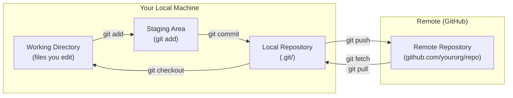

# Local vs Remote Repositories

ယခုအချိန်အထိ သင်၏ Git repository သည် သင့်စက်ထဲတွင်သာ ရှိနေခဲ့သည် — ၎င်းကို local repository ဟုခေါ်သည်။ **Remote** ဆိုသည်မှာ သင့်အဖွဲ့သားများ အတူတကွ 공유 (share) လုပ်နိုင်ရန် server တစ်ခု (GitHub, GitLab စသည်တို့) ပေါ်တွင် တင်ထားသော ထို repository ၏ မိတ္တူတစ်ခု ဖြစ်သည်။



---

## Setting Up a Remote

### Option A: GitHub မှ စတင်ခြင်း (အဖြစ်များဆုံး)

```bash
# 1. GitHub တွင် repo အသစ်တစ်ခု ဖန်တီးပါ (+ → New repository ကိုနှိပ်ပါ)
# 2. သင့်စက်ထဲသို့ clone လုပ်ပါ (စတင်ရန် အလွတ်ဖြစ်နေပါမည်)
git clone git@github.com:yourorg/my-repo.git
cd my-repo

# Git သည် GitHub ကို ညွှန်ပြနေသော "origin" ကို အလိုအလျောက် သတ်မှတ်ပေးသည်
git remote -v
# origin  git@github.com:yourorg/my-repo.git (fetch)
# origin  git@github.com:yourorg/my-repo.git (push)
```

### Option B: ရှိပြီးသား Local Repo ကို GitHub နှင့် ချိတ်ဆက်ခြင်း

```bash
# သင့်တွင် local repo တစ်ခု ရှိပြီးသားဖြစ်ပြီး, ယခု GitHub သို့ push လုပ်လိုသည်
# 1. GitHub တွင် repo အလွတ်တစ်ခု ဖန်တီးပါ (README မပါ၊ .gitignore မပါ)
# 2. remote ချိတ်ဆက်မှုကို ပေါင်းထည့်ပါ
git remote add origin git@github.com:yourorg/my-repo.git

# အမှန်တဟုတ် စစ်ဆေးပါ
git remote -v

# ပထမဆုံးအကြိမ် push လုပ်ပါ
git push -u origin main
# -u = --set-upstream (local main ကို remote origin/main နှင့် ချိတ်ဆက်ပေးသည်)
# ဤသို့လုပ်ပြီးပါက "git push origin main" အစား "git push" ဟုသာ ရိုက်ထည့်နိုင်ပါပြီ
```

---

## Managing Remotes

```bash
# remote များကို ကြည့်ရှုရန်
git remote -v
# origin   git@github.com:yourorg/my-repo.git (fetch)
# origin   git@github.com:yourorg/my-repo.git (push)

# remote ဒုတိယတစ်ခု ထည့်ရန် (ဥပမာ - fork တစ်ခု သို့မဟုတ် server အခြားတစ်ခု)
git remote add upstream git@github.com:originalorg/their-repo.git

# remote တစ်ခု၏ အမည်ပြောင်းရန်
git remote rename origin github

# remote ၏ URL ကို ပြောင်းရန် (ဥပမာ - repo အမည်ပြောင်းပြီးနောက် သို့မဟုတ် HTTPS မှ SSH သို့ ပြောင်းသည့်အခါ)
git remote set-url origin git@github.com:yourorg/new-repo-name.git

# remote တစ်ခုကို ဖယ်ရှားရန်
git remote remove upstream

# remote ကို စစ်ဆေးရန် (remote branch များကို ပြသသည်)
git remote show origin
```

---

## `git push`: Send Local Commits to Remote

```bash
# လက်ရှိ branch ကို origin သို့ push လုပ်ပါ (-u သတ်မှတ်ပြီးနောက်)
git push

# တိကျစွာ push လုပ်ခြင်း (-u မပါဘဲ အလုပ်လုပ်သည်)
git push origin main
git push origin feature/login

# branch အသစ်တစ်ခု push လုပ်ပြီး tracking သတ်မှတ်ရန် (-u = --set-upstream)
git push -u origin feature/new-ui

# local branch အားလုံးကို push လုပ်ရန်
git push --all origin

# tag များကို push လုပ်ရန် (ပုံမှန် push ထဲတွင် မပါဝင်ပါ)
git push origin v1.5.2           # သတ်မှတ်ထားသော tag ကို push လုပ်ရန်
git push origin --tags           # tag အားလုံးကို push လုပ်ရန်

# Force push လုပ်ခြင်း (remote history ကို ပြန်ရေးသည် — အထူးသတိထား၍ သုံးပါ)
git push --force                    # ❌ အန္တရာယ်ရှိသည်
git push --force-with-lease         # ✅ ပိုလုံခြုံသည်: သင် pull မလုပ်ရသေးသော commit အသစ်များ remote တွင် ရှိနေပါက error တက်မည်
```

<Callout type="warning" title="Always Use --force-with-lease Instead of --force">
`git push --force` သည် သင် အလုပ်လုပ်နေစဉ် အခြားသူတစ်ဦးက push လုပ်ထားလျှင်ပင် remote ကို သင့် local history ဖြင့် ထပ်ရေး overwrite လုပ်ပစ်မည် ဖြစ်သည်။ `--force-with-lease` ကမူ အရင်စစ်ဆေးသည် - remote ပြောင်းလဲသွားပြီဆိုလျှင် ငြင်းပယ်မည်ဖြစ်ပြီး သင့်အဖွဲ့သားများ၏ အလုပ်ကို ကာကွယ်ပေးပါမည်။ သင်ခန်းစာ ၂ မှ alias ကို သတ်မှတ်ထားပါ: `git config --global alias.pushf "push --force-with-lease"`။
</Callout>

---

## `git fetch`: Download Without Merging

`git fetch` သည် remote မှ commit အသစ်များကို download ဆွဲယူသော်လည်း သင့် local branch များကို **မပြောင်းလဲ** ပေးပါ။ ပေါင်းစပ် (integrate) မလုပ်မီ ဘာတွေပြောင်းလဲသွားလဲဆိုတာကို စစ်ဆေးနိုင်သည် -

```bash
# remote ပြောင်းလဲမှု အားလုံးကို download လုပ်ရန်
git fetch origin

# သတ်မှတ်ထားသော branch တစ်ခုကို fetch လုပ်ရန်
git fetch origin main

# fetch လုပ်ထားသည်များကို ကြည့်ရန် (remote ပေါ်ရှိ commit အသစ်များ)
git log HEAD..origin/main --oneline
# def5678 fix: correct order total calculation  ← ဤအရာသည် remote တွင် ရှိနေပြီး local တွင် မရှိသေးပါ
# abc1234 feat: add bulk discount support

# သင့် local branch ကို remote နှင့် နှိုင်းယှဉ်ရန်
git diff main origin/main

# စစ်ဆေးပြီးနောက် remote ပြောင်းလဲမှုများကို merge လုပ်ပါ
git merge origin/main    # သို့မဟုတ်: git rebase origin/main
```

`git fetch` သည် အမြဲတမ်း လုံခြုံသည် — working directory သို့မဟုတ် local branch များကို လုံးဝ မထိခိုက်ပါ။

---

## `git pull`: Fetch + Merge in One Step

`git pull` သည် fetch + merge (သို့မဟုတ် configured လုပ်ထားပါက fetch + rebase) ကို ပေါင်းစပ်ပေးသည် -

```bash
# Fetch ပြီး merge လုပ်ပါ (history များ ကွဲလွဲနေပါက merge commit တစ်ခု ဖန်တီးသည်)
git pull

# Fetch ပြီး rebase လုပ်ပါ (history ကို ဖြောင့်တန်းစေသည် — pull.rebase=true ဖြင့် အကြံပြုသည်)
git pull --rebase
git pull --rebase origin main

# သတ်မှတ်ထားသော branch တစ်ခုကို pull လုပ်ရန်
git pull origin feature/updates

# config ထဲတွင် pull.rebase = true ဟု သတ်မှတ်ထားပါက (သင်ခန်းစာ ၂)၊ --rebase သည် အလိုအလျောက် ဖြစ်သွားမည်
```

**`git pull --rebase` vs `git pull`**:

```
git pull (merge):
main: A → B → C → M (merge commit)  ← history က merge ဖြစ်သွားတာကို ထင်ရှားစွာပြသည်
                 ↗
remote: D → E ─╯

git pull --rebase:
main: A → B → D → E → C   ← သင့် local commit (C) သည် remote commit ပြီးမှ ပြန်လည်ဝင်ရောက်သည်
                           သန့်ရှင်းပြီး ဖြောင့်တန်းသော history
```

---

## Tracking Branches

သင်သည် `git push -u origin main` ကို အသုံးပြုသည့်အခါ Git သည် **tracking relationship (ခြေရာခံချိတ်ဆက်မှု)** တစ်ခုကို ဖန်တီးပေးသည် - သင့် local `main` သည် `origin/main` ကို ခြေရာခံသည်။ ဤအရာက အောက်ပါတို့ကို လုပ်ဆောင်နိုင်စေသည် -

```bash
# tracking ဆက်နွယ်မှုများကို ကြည့်ရန်
git branch -vv
# * main         9f7e3a1 [origin/main] fix: handle empty cart
#   feature/auth abc1234 [origin/feature/auth: ahead 2] feat: add login

# "ahead 2" ဆိုသည်မှာ: remote သို့ မတင်ရသေးသော local commit ၂ ခု ရှိနေသည်
# "behind 3" ဆိုသည်မှာ: သင် pull မလုပ်ရသေးသော commit ၃ ခု remote တွင် ရှိနေသည်

# ahead/behind အခြေအနေကို ကြည့်ရန်
git status
# On branch main
# Your branch is ahead of 'origin/main' by 2 commits.
#   (use "git push" to publish your local commits)
```

---

## Working With Forks

Open-source ပံ့ပိုးမှုများတွင် မူရင်း repo ကို fork လုပ်ခြင်း၊ သင့် fork တွင် အပြောင်းအလဲများလုပ်ခြင်းနှင့် PR တင်ခြင်းတို့ကို ပြုလုပ်ကြသည်။ သင့် fork ကို အမြဲ update ဖြစ်နေအောင် ထားရှိရပါမည် -

```bash
# သင့် fork ကို clone လုပ်ပါ
git clone git@github.com:yourname/original-project.git

# မူရင်း project ကို "upstream" အဖြစ် ပေါင်းထည့်ပါ
git remote add upstream git@github.com:originalorg/original-project.git

git remote -v
# origin    git@github.com:yourname/original-project.git
# upstream  git@github.com:originalorg/original-project.git

# သင့် fork ကို upstream နှင့် အမြဲ update ဖြစ်အောင် လုပ်ပါ
git fetch upstream
git switch main
git rebase upstream/main    # upstream အပြောင်းအလဲများကို သင့်အလုပ်အောက်တွင် ထည့်သွင်းပါ
git push origin main        # GitHub ပေါ်ရှိ သင့် fork ကို update လုပ်ပါ

# feature တစ်ခုအတွက် အလုပ်လုပ်ပါ
git switch -c fix/typo-in-readme
# ... အပြောင်းအလဲများလုပ်ပါ ...
git push origin fix/typo-in-readme
# GitHub ပေါ်တွင် yourname/fix/typo-in-readme → originalorg/main သို့ PR တစ်ခု ဖွင့်ပါ
```

---

## Common Remote Scenarios

### Scenario 1: Teammate Pushed, Your Push Is Rejected

```bash
git push origin main
# ! [rejected] main -> main (non-fast-forward)
# hint: Updates were rejected because the remote contains work you do not have locally.

# ဖြေရှင်းချက် - ပထမဦးစွာ pull လုပ်ပါ၊ ပြီးမှ push လုပ်ပါ
git pull --rebase origin main
git push origin main
```

### Scenario 2: Pull With Conflicts

```bash
git pull --rebase origin main
# CONFLICT (content): Merge conflict in src/api.ts
# error: could not apply abc1234... feat: add rate limiting
# hint: Resolve all conflicts manually, mark them as resolved with git add

# src/api.ts ထဲရှိ conflict များကို ဖြေရှင်းပြီးနောက် -
git add src/api.ts
git rebase --continue

# သို့မဟုတ် rebase ကို ဖျက်သိမ်းရန်
git rebase --abort
```

### Scenario 3: Delete a Remote Branch

```bash
# PR တစ်ခုကို merge ပြီးနောက် remote feature branch ကို ဖျက်ပါ
git push origin --delete feature/user-auth

# local tracking branch ကိုပါ ဖျက်ပါ
git branch -d feature/user-auth
```

### Scenario 4: Pull a Remote Branch You Don't Have Locally

```bash
# Remote တွင် feature/payments ရှိသော်လည်း သင့် local တွင် မရှိပါ
git fetch origin
git switch feature/payments
# Git သည် origin/feature/payments ကို အခြေခံ၍ local tracking branch ကို အလိုအလျောက် ဖန်တီးပေးမည်
```

---

## Summary

| Operation | Command |
|-----------|---------|
| Clone a repo | `git clone git@github.com:org/repo.git` |
| Add remote | `git remote add origin <url>` |
| List remotes | `git remote -v` |
| Push + set tracking | `git push -u origin main` |
| Push subsequent times | `git push` |
| Safe force push | `git push --force-with-lease` |
| Download without merging | `git fetch origin` |
| Download + merge | `git pull --rebase` |
| Delete remote branch | `git push origin --delete branch-name` |
| Check ahead/behind status | `git branch -vv` |

နောက်လာမည့် သင်ခန်းစာတွင် သင်သည် `main` ထဲသို့ ဝင်ရောက်လာမည့် အပြောင်းအလဲတိုင်းကို စစ်ဆေးပေးသော code review လုပ်ငန်းစဉ်ဖြစ်သည့် Pull Request workflow အပြည့်အစုံကို သင်ယူရမည် ဖြစ်ပါသည်။