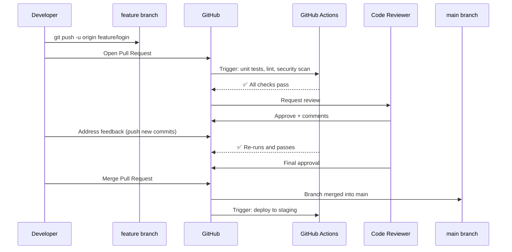

# Pull Requests: The Quality Gate

Pull Request (PR) ဆိုတာ branch တစ်ခုကနေ အခြား branch တစ်ခုဆီသို့ code ပေါင်းထည့်ဖို့ (merge လုပ်ဖို့) တင်ပြချက်တစ်ခု ဖြစ်ပါတယ်။ ဒါဟာ ခေတ်မီ software development တွေမှာ အဓိက ပူးပေါင်းဆောင်ရွက်တဲ့ နည်းလမ်းဖြစ်ပါတယ် — ပြောင်းလဲမှုတိုင်းဟာ `main` ကို မထိခင်မှာ PR ကို ဖြတ်သန်းရပါမယ်၊ code review လုပ်ခံရမယ်၊ automated testing တွေ ဖြတ်ရမယ်၊ ပြီးမှ အတည်ပြုချက် (approval) ရယူရပါတယ်။



---

## Opening a Pull Request

```bash
# 1. Create and switch to your feature branch
git switch -c feature/user-auth

# 2. Make your changes and commit
git add .
git commit -m "feat(auth): add JWT login with refresh token support"
git commit -m "test(auth): add unit tests for token validation"

# 3. Push the branch to GitHub
git push -u origin feature/user-auth

# 4. GitHub shows a banner: "feature/user-auth had recent pushes. Compare & pull request."
# Click it, or create via GitHub CLI:
gh pr create \
  --title "feat(auth): add JWT authentication" \
  --body "## Summary
  
  Adds JWT-based authentication with:
  - Login endpoint returning access + refresh tokens
  - Token refresh endpoint
  - Middleware for protected routes
  
  ## Testing
  - Unit tests: src/auth/*.test.ts
  - Manual: see testing instructions in PR description
  
  ## Checklist
  - [x] Unit tests pass locally
  - [x] No new security vulnerabilities
  - [x] Tested manually in dev environment
  
  Closes #234" \
  --reviewer "@alice,@bob" \
  --label "feature,auth"
```

---

## Writing an Excellent PR Description

PR description ကောင်းတစ်ခုက review ကြာချိန်ကို အများကြီး လျှော့ချပေးနိုင်ပါတယ် -

```markdown
## What This PR Does
Brief explanation of the change and why it's needed.

## Technical Approach
How you implemented it. Key design decisions.
Why you chose this approach over alternatives.

## Screenshots / Demo
(For UI changes — include before/after screenshots)

## Testing Done
- [ ] Unit tests: `npm run test:unit` passes
- [ ] Integration tests pass
- [ ] Tested in development environment
- [ ] Edge cases considered: empty input, invalid token, expired session

## Breaking Changes
None / describe any breaking changes here

## Related Issues
Closes #234
Related to #189

## Checklist
- [ ] Code follows our style guide
- [ ] Self-reviewed my own diff
- [ ] Tests added for new functionality
- [ ] Documentation updated if needed
```

---

## Code Review: Being a Good Reviewer

Code review ဆိုတာ ကျွမ်းကျင်မှုတစ်ခု ဖြစ်ပါတယ်။ bug ရှာတာတင် မဟုတ်ပါဘူး — knowledge transfer လုပ်တာ၊ လမ်းညွှန်ပြသတာ (mentorship) နဲ့ စုပေါင်းတာဝန်ယူမှု (collective ownership) တို့ ဖြစ်ပါတယ်။

### What to Look For

```
✅ Correctness     Does the code do what the PR description says?
✅ Tests           Are edge cases covered? Are tests meaningful?
✅ Security        SQL injection? Hardcoded secrets? SSRF vulnerabilities?
✅ Performance     N+1 queries? Missing indices? Large data in memory?
✅ Readability     Will someone understand this in 6 months?
✅ Architecture    Does this fit the existing patterns in the codebase?
✅ Edge cases      What happens with empty input, null values, network failures?
```

### Leaving Effective Comments

```
❌ Bad comment: "This is wrong."

✅ Good comments:
   - Nitpick (optional): "nit: could simplify to Array.from(map.values())"
   - Question: "Question: why are we using setTimeout here instead of a Promise?"
   - Blocking concern: "🚨 This will fail if the user's session token is expired
     before the request completes. We need to handle the 401 response."
   - Suggestion with code:
     ```typescript
     // Suggestion: this could be simplified using optional chaining
     // const email = user?.profile?.contact?.email;
     // instead of:
     // const email = user && user.profile && user.profile.contact && user.profile.contact.email;
     ```
```

GitHub ရဲ့ comment tone settings တွေကို သုံးပါ — non-blocking feedback တွေအတွက် "nit:" (သို့) "optional:" လို့ ရှေ့ကနေ ခံရေးပါ၊ ဒါမှ author က merge လုပ်ခင် ဘယ်အချက်တွေကို မဖြစ်မနေ ပြင်ရမယ်ဆိုတာ သိနိုင်မှာ ဖြစ်ပါတယ်။

---

## Responding to Review Feedback

```bash
# 1. Reviewer requests changes
# 2. Make the changes in your branch (additional commits OR amend existing)

# Option A: Add a new commit (simpler, shows change history)
git add .
git commit -m "fix: address code review feedback - handle null token"
git push origin feature/user-auth

# Option B: Amend your last commit (cleaner history if fixing a mistake)
git add .
git commit --amend --no-edit   # Add changes to last commit, keep message
git push --force-with-lease origin feature/user-auth

# Option C: Interactive rebase to clean up before merge
git rebase -i HEAD~3   # Squash/fixup review-feedback commits
git push --force-with-lease origin feature/user-auth
```

---

## Branch Protection Rules

GitHub ပေါ်က branch protection rules တွေက `main` ဆီကို မတော်တဆ ဒါမှမဟုတ် ခွင့်ပြုချက်မရှိဘဲ ပြောင်းလဲမှုတွေ ဝင်လာတာကို ကာကွယ်ပေးပါတယ် -

### Setting Up Protection (GitHub → Settings → Branches → Add Rule)

```yaml
# Recommended protection rules for the "main" branch:
Branch name pattern: main

✅ Require a pull request before merging
   - Required approvals: 2 (or 1 for small teams)
   - Dismiss stale reviews when new commits are pushed
   - Require review from Code Owners

✅ Require status checks to pass before merging
   - unit-tests          (must be green)
   - integration-tests   (must be green)
   - security-scan       (must be green)
   - lint                (must be green)

✅ Require conversation resolution before merging
   (All PR comments must be resolved)

✅ Require signed commits
   (GPG-signed commits only)

✅ Do not allow bypassing the above settings
   (Admins also cannot bypass — prevents emergency "just push it")

✅ Restrict who can push to matching branches
   → Only selected teams/individuals can push directly
```

### CODEOWNERS File

ဘယ် file တွေ ပြောင်းလဲသွားလဲဆိုတာအပေါ် မူတည်ပြီး reviewers တွေကို အလိုအလျောက် သတ်မှတ်ပေးပါတယ် -

```
# .github/CODEOWNERS
# Syntax: <file-pattern> <@user-or-team>

# Global owners — required reviewers for any file
*                   @yourorg/backend-team

# Auth code requires security team review
src/auth/           @yourorg/security-team @alice

# Payment processing requires finance + security
src/payments/       @yourorg/security-team @yourorg/finance-team

# Kubernetes configs require DevOps team
k8s/                @yourorg/devops-team

# CI/CD pipeline changes require DevOps
.github/workflows/  @yourorg/devops-team
```

---

## Merge Strategies

GitHub ပေါ်မှာ PR တစ်ခုကို merge လုပ်တဲ့အခါ သင့်လျော်တဲ့ strategy ကို ရွေးချယ်ပါ -

| Strategy | What it does | Best for |
|---------|-------------|---------|
| **Merge commit** | Creates a merge commit, preserves all commits | Feature branches, audit trail important |
| **Squash and merge** | Combines all PR commits into one commit on main | Clean main history, many messy commits in PR |
| **Rebase and merge** | Replays PR commits linearly on main | Clean linear history, already clean PR commits |

```bash
# Merge via CLI
gh pr merge 123 --squash --delete-branch
gh pr merge 123 --rebase --delete-branch
gh pr merge 123 --merge --delete-branch
```

**အကြံပြုချက်**: အများစုသော team တွေအတွက် "Squash and merge" ကို သုံးပါ — PR conversation က commit history အပြည့်အစုံကို ထိန်းသိမ်းပေးထားပြီးသား ဖြစ်ပေမဲ့ `main` မှာတော့ feature တစ်ခုချင်းစီအတွက် သပ်ရပ်တဲ့ commit တစ်ခုစီပဲ ရရှိမှာ ဖြစ်ပါတယ်။

---

## Useful GitHub CLI (gh) Commands

```bash
# Install
brew install gh

# Authenticate
gh auth login

# Create PR
gh pr create --title "..." --body "..."

# List open PRs
gh pr list

# Check out someone else's PR locally (for testing)
gh pr checkout 123

# View PR status
gh pr status

# Review a PR
gh pr review 123 --approve
gh pr review 123 --request-changes --body "Please fix the null handling"

# Merge a PR
gh pr merge 123 --squash --delete-branch

# View all open issues
gh issue list

# Create an issue from a failing test
gh issue create \
  --title "Flaky test: auth token refresh" \
  --label "bug,flaky-test" \
  --body "Test fails intermittently in CI. Run ID: $GITHUB_RUN_ID"
```

---

## Summary

- **Pull Requests** ဆိုတာ မဖြစ်မနေ ဖြတ်သန်းရမယ့် quality gate တစ်ခု ဖြစ်ပါတယ် — `main` ထဲ ဝင်မယ့် ပြောင်းလဲမှုတိုင်းဟာ automated CI checks တွေနဲ့ လူကိုယ်တိုင် review လုပ်တာတွေကို PR ကနေတဆင့် ဖြတ်သန်းရပါမယ်။
- PR ကောင်းတစ်ခုမှာ ရှင်းလင်းတဲ့ title၊ အသေးစိတ် description၊ testing checklist နဲ့ ဆက်စပ်နေတဲ့ issues တွေဆီ လင့်ခ်တွေ ပါရှိရပါမယ်။
- **Code review** က bug တွေကို ရှာဖွေပေးတယ်၊ security ကို အာမခံချက်ပေးတယ်၊ ပြီးတော့ knowledge transfer လုပ်ပေးပါတယ် — ဝေဖန်ချက်တွေကို ရှေ့ကနေ "nit:" လို့ တပ်ပြီး ရေးခြင်းဖြင့် မလိုအပ်ဘဲ နားလည်မှုလွဲတာတွေကို ရှောင်ရှားနိုင်ပါတယ်။
- Review feedback တွေကို commit အသစ်တွေ တင်ခြင်း (သို့) `--amend + force-push` သုံးပြီး တုံ့ပြန်ပါ၊ merge မလုပ်ခင် သပ်ရပ်အောင် interactive rebase ကို သုံးပါ။
- **Branch protection rules** တွေက အောက်ပါတို့ကို အဓိက ထိန်းချုပ်ပေးပါတယ်: အနည်းဆုံး လိုအပ်တဲ့ approvals အရေအတွက်၊ status checks တွေ၊ signed commits နဲ့ conversation resolution တွေ ဖြစ်ပါတယ်။
- **CODEOWNERS** က file path ပေါ်မူတည်ပြီး reviewers တွေကို အလိုအလျောက် သတ်မှတ်ပေးပါတယ် — သက်ဆိုင်ရာ domain experts တွေကသာ လိုအပ်တဲ့ ပြောင်းလဲမှုတွေကို review လုပ်ဖို့ သေချာစေပါတယ်။
- အများစုသော PR တွေအတွက် **Squash and merge** ကို သုံးပါ — `main` ပေါ်မှာ feature တစ်ခုချင်းစီအတွက် သပ်ရပ်တဲ့ commit တစ်ခုစီ ဖြစ်စေပါတယ်။

နောက်လာမယ့် သင်ခန်းစာမှာတော့ Git best practices တွေဖြစ်တဲ့ `.gitignore`၊ Conventional Commits နဲ့ `git stash` workflow တို့ကို လေ့လာရမှာ ဖြစ်ပါတယ်။