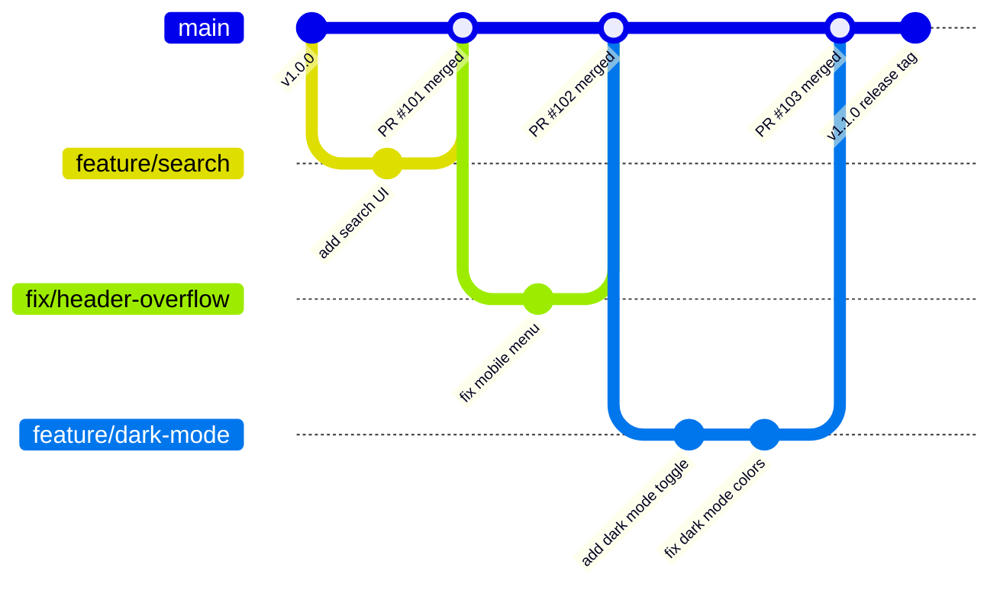
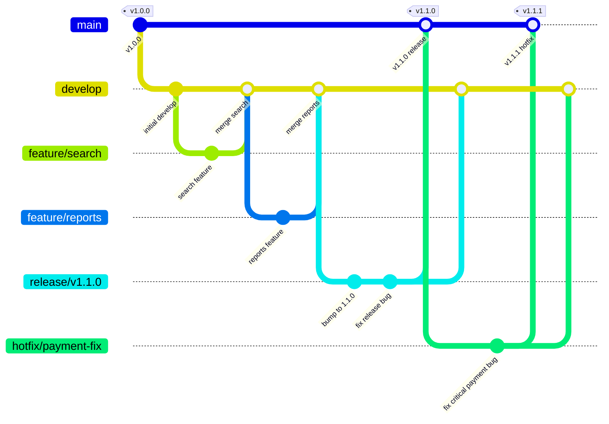
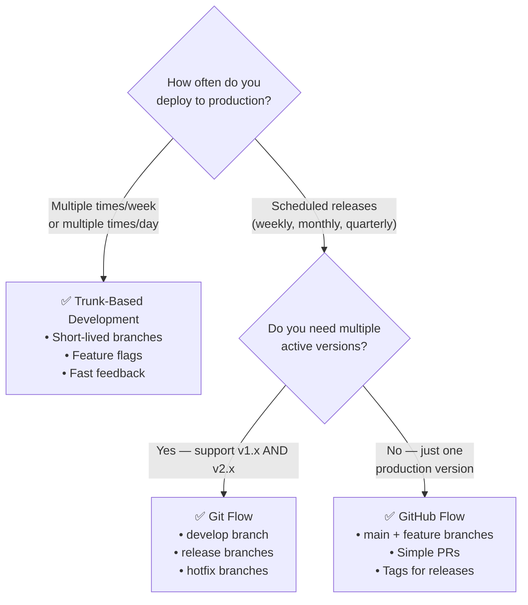

# Branching Strategy တစ်ခုကို ရွေးချယ်ခြင်း

Branching strategy ဆိုတာကတော့ developer ရဲ့ laptop ကနေ production ကို code တွေ ဘယ်လို သွားမလဲဆိုတဲ့ အသင်းသားတွေရဲ့ သဘောတူညီချက်ပဲ ဖြစ်ပါတယ်။ အသုံးအများဆုံး strategy နှစ်ခုကတော့ **Trunk-Based Development** (မြန်ဆန်တဲ့ CI/CD teams တွေအတွက်) နဲ့ **Git Flow** (အချိန်ဇယားဆွဲပြီး release လုပ်တဲ့ teams တွေအတွက်) တို့ ဖြစ်ပါတယ်။ ကိုယ့်ရဲ့ project အခြေအနေနဲ့ မကိုက်ညီတဲ့ strategy ကို ရွေးချယ်မိရင် delivery တိုင်းကို နှေးကွေးစေတဲ့ အခက်အခဲတွေကို ဖြစ်စေပါလိမ့်မယ်။

---

## Strategy 1: Trunk-Based Development (Modern CI/CD Standard)

Trunk-Based Development (TBD) ဆိုတာကတော့ Google, Netflix, Airbnb နဲ့ တစ်နေ့ကို deploy အကြိမ်များစွာ လုပ်နေတဲ့ ကုမ္ပဏီအများစု အသုံးပြုကြတဲ့ branching strategy ဖြစ်ပါတယ်။ သူ့ရဲ့ ပင်မစည်းမျဉ်းကတော့: အားလုံးက `main` ("trunk") ထဲကို မကြာခဏ (အနည်းဆုံး တစ်နေ့တစ်ကြိမ်) integrate လုပ်ကြတာ ဖြစ်ပါတယ်။



### အဓိက Principles များ

1. **သက်တမ်းတိုတဲ့ branches များ**: feature branch တွေဟာ အများဆုံး နာရီအနည်းငယ်ကနေ ၂ ရက်အထိပဲ ကြာပါတယ်။ ဘယ်တော့မှ ပတ်နဲ့ချီ မကြာပါဘူး။
2. **မကြာခဏ merge လုပ်ပါ**: developer တစ်ဦးလျှင် တစ်နေ့ကို အနည်းဆုံး တစ်ကြိမ် `main` ထဲ merge လုပ်ပါ။
3. **`main` သည် အမြဲတမ်း deploy လုပ်လို့ရနေရမည်**: `main` ပေါ်က commit တိုင်းဟာ test အားလုံးကို ဖြတ်ကျော်ထားရမဖြစ်ပြီး အခုချက်ချင်း deploy လုပ်လို့ရတဲ့ အနေအထားမှာ ရှိရပါမယ်။
4. **မပြီးသေးတဲ့ feature တွေအတွက် Feature flags ကို သုံးပါ**: feature တစ်ခုက ၂ ပတ်လောက် ကြာမယ်ဆိုရင် ပထမနေ့ကတည်းက flag တစ်ခုရဲ့ နောက်ကွယ်မှာ deploy လုပ်ထားရပါမယ်။

```bash
# TBD daily workflow
git switch main
git pull --rebase

git switch -c feature/add-search-filters   # Short-lived branch
# ... work for a few hours ...
git add .
git commit -m "feat(search): add price range filter"
git push -u origin feature/add-search-filters

# Open PR → get 1 review → merge → done
# Branch lifetime: < 4 hours
```

### ကြာမြင့်မယ့် Feature တွေအတွက် Feature Flags

```typescript
// Feature in progress — deployed but hidden behind a flag
export function CheckoutPage() {
  const { isEnabled } = useFeatureFlag('new-checkout-v2');
  
  if (isEnabled) {
    return <NewCheckoutV2 />;   // Only 5% of users see this
  }
  return <OldCheckout />;       // Everyone else sees this
}
```

```bash
# Feature flag management (using Unleash or LaunchDarkly)
# 1. Day 1: deploy feature/new-checkout behind flag at 0% rollout
# 2. Day 7: 5% rollout to internal employees
# 3. Day 14: 20% rollout — monitor metrics
# 4. Day 21: 100% rollout → remove flag in next PR
```

### TBD ကို ဘယ်အချိန်မှာ သုံးသင့်လဲ

- ✅ သင့် team က production ကို တစ်ပတ်မှာ အကြိမ်များစွာ deploy လုပ်တယ်ဆိုရင်
- ✅ ခိုင်မာတဲ့ automated test coverage (unit + integration) ရှိတယ်ဆိုရင်
- ✅ Developers ၅ ယောက်ကနေ ၅၀၀ ကြား ရှိတဲ့ teams တွေ
- ✅ SaaS products, web applications, microservices တွေအတွက်

---

## Strategy 2: Git Flow (Release-Based Workflow)

Git Flow (Vincent Driessen က ၂၀၁၀ မှာ စတင်ခဲ့တာပါ) ကတော့ သတ်မှတ်ထားတဲ့ release schedule တစ်ခုကို ထောက်ပံ့ဖို့အတွက် သက်တမ်းရှည်တဲ့ branch တွေ အများကြီးကို အသုံးပြုပါတယ်။ ဒါဟာ သီးသန့် version တွေနဲ့ ထွက်တဲ့ software တွေဖြစ်တဲ့ mobile apps, desktop software, versioned contracts ပါတဲ့ APIs, embedded firmware တွေအတွက် ဒီဇိုင်းထုတ်ထားတာ ဖြစ်ပါတယ်။



### Git Flow Branch Structure

| Branch | ရည်ရွယ်ချက် | ဘယ်ကနေ Merge လဲ | ဘယ်ကို Merge လဲ |
|--------|---------|------------|-----------|
| **`main`** | Production အနေအထား | `release/*`, `hotfix/*` | — |
| **`develop`** | release အသစ်အတွက် Integration branch | `feature/*` | `release/*` |
| **`feature/*`** | လုပ်ဆောင်ချက် အသစ်များ | `develop` | `develop` |
| **`release/*`** | release မလုပ်ခင် Stabilization လုပ်ရန် | `develop` | `main` + `develop` |
| **`hotfix/*`** | အရေးပေါ် production ပြဿနာ ဖြေရှင်းရန် | `main` | `main` + `develop` |

### Git Flow Commands များ

```bash
# Option A: Use git-flow CLI extension
brew install git-flow-avh
git flow init   # Prompts for branch names (accept defaults)

# Feature workflow
git flow feature start user-notifications
# ... develop the feature ...
git flow feature finish user-notifications   # Merges to develop, deletes branch

# Release workflow
git flow release start v1.2.0
# ... final QA, bump version number ...
git flow release finish v1.2.0   # Merges to main AND develop, creates tag

# Hotfix workflow
git flow hotfix start payment-null-check
# ... fix the critical bug ...
git flow hotfix finish payment-null-check   # Merges to main AND develop, creates tag

# Option B: Manual git commands
git switch develop
git switch -c feature/user-notifications
# ... develop ...
git switch develop && git merge --no-ff feature/user-notifications
git branch -d feature/user-notifications
```

### Git Flow ကို ဘယ်အချိန်မှာ သုံးသင့်လဲ

- ✅ Mobile apps တွေ (App Store မှာ အချိန်ဇယားနဲ့ release လုပ်ရတာတွေ)
- ✅ တင်းကျပ်တဲ့ semantic versioning လိုအပ်တဲ့ Library/SDK တွေ
- ✅ QA cycle ရှည်လျားတဲ့ Enterprise software တွေ
- ✅ Embedded firmware သို့မဟုတ် hardware ပေါ်မူတည်တဲ့ software တွေ
- ❌ မကြာခဏ deploy လုပ်နေရတဲ့ SaaS web apps တွေအတွက်တော့ TBD က ပိုကောင်းပါတယ်

---

## Strategy 3: GitHub Flow (Simplified)

TBD နဲ့ Git Flow ကြားထဲက ပုံစံတစ်ခု ဖြစ်ပါတယ် — `main` branch တစ်ခု၊ feature branches တွေနဲ့ PR တွေပဲ ပါဝင်ပါတယ်။ `develop` branch လည်း မရှိဘူး၊ release branch တွေလည်း မရှိပါဘူး။ Team အများစုအတွက် ရိုးရှင်းပြီး ထိရောက်မှု ရှိပါတယ်:

```bash
# The entire workflow:
git switch -c feature/my-feature
# ... code ...
git push -u origin feature/my-feature
# Open PR, get reviewed, merge
# Done. main = production at all times.
```

---

## Release Tagging နှင့် Semantic Versioning

Git tags တွေက သီးသန့် commit တွေကို release points တွေအဖြစ် မှတ်သားပေးပါတယ်။ တော်တော်များဆَف pipeline တွေမှာ tags တွေက CI/CD deployments တွေကို စတင်ပေးပါတယ်:

```bash
# Create an annotated tag (preferred — includes tagger info and description)
git tag -a v1.2.0 -m "Release v1.2.0

New features:
- User notification preferences
- Dark mode support

Bug fixes:
- Fixed cart total calculation
- Resolved mobile menu overflow"

# Create a lightweight tag (just a pointer, no metadata)
git tag v1.2.0   # Only if you really want lightweight

# List all tags
git tag
git tag -l "v1.*"   # Filter tags matching pattern

# Show tag details
git show v1.2.0

# Push tags to GitHub (not included in regular push)
git push origin v1.2.0          # Push specific tag
git push origin --tags          # Push all local tags

# Delete a tag (be careful — CI may have already built it)
git tag -d v1.2.0               # Delete locally
git push origin --delete v1.2.0 # Delete from remote
```

### Semantic Versioning (SemVer)

```
MAJOR.MINOR.PATCH   →   v1.2.3

MAJOR (1): Breaking changes — API incompatible with previous version
           git commit -m "feat!: require API key for all endpoints"

MINOR (2): New features — backward compatible
           git commit -m "feat(api): add bulk export endpoint"

PATCH (3): Bug fixes — backward compatible
           git commit -m "fix(auth): handle expired refresh tokens"

Pre-release identifiers:
v1.2.0-alpha.1    ← first alpha (internal testing)
v1.2.0-beta.2     ← second beta (external testing)
v1.2.0-rc.1       ← release candidate (final testing)
v1.2.0             ← stable release
```

### Conventional Commits ဖြင့် Automated Semantic Versioning လုပ်ခြင်း

```bash
# semantic-release automatically determines version bump from commit messages
npm install --save-dev semantic-release \
  @semantic-release/git \
  @semantic-release/github \
  @semantic-release/changelog

# .releaserc.json
cat > .releaserc.json << 'EOF'
{
  "branches": ["main"],
  "plugins": [
    "@semantic-release/commit-analyzer",
    "@semantic-release/release-notes-generator",
    "@semantic-release/changelog",
    "@semantic-release/npm",
    "@semantic-release/git",
    "@semantic-release/github"
  ]
}
EOF

# In GitHub Actions:
# - on: push to main
# - runs: npx semantic-release
# Automatically: analyses commits → bumps version → creates tag → generates changelog → creates GitHub Release
```

---

## မှန်ကန်သော Workflow ကို ရွေးချယ်ခြင်း: ဆုံးဖြတ်ချက်လမ်းညွှန်



---

## အနှစ်ချုပ်: ခြုံငုံသုံးသပ်ချက်

| | Trunk-Based | GitHub Flow | Git Flow |
|--|------------|------------|----------|
| **Main branch** | `main` (always deployable) | `main` (always deployable) | `main` + `develop` |
| **Branch lifetime** | နာရီအနည်းငယ်မှ ၂ ရက်အထိ | ရက်အနည်းငယ်မှ ၁ ပတ်အထိ | ပတ်နှင့်ချီ၍ လနှင့်ချီ၍ |
| **Release mechanism** | Continuous deployment | Tag + deploy | `release/*` branch + tag |
| **Emergency fix** | Hotfix PR to main | Hotfix branch | `hotfix/*` → main + develop |
| **အသင့်တော်ဆုံးကတော့** | CI/CD SaaS teams တွေအတွက် | လူငယ်/အလတ်စား web teams တွေအတွက် | Version ခွဲထားတဲ့ software တွေအတွက် |
| **ရှုပ်ထွေးမှု** | နည်းပါးသည် | နည်းပါးသည် | များပြားသည် |

**ခေတ်မီဆန်းသစ်သော မူလပုံစံ**: GitHub Flow နဲ့ စတင်ပါ။ အကယ်၍ သನೀတို့ team ဟာ တစ်ပတ်ကို အကြိမ်များစွာ deploy လုပ်နေပြီး test coverage ကောင်းကောင်းရှိတယ်ဆိုရင် Trunk-Based Development ကို ပြောင်းပါ။ သင့်ရဲ့ release လုပ်ငန်းစဉ်က သက်တမ်းရှည် branch တွေ အများကြီးကို တကယ်လိုအပ်မှသာ Git Flow ကို သုံးပါ။

ဒါဆိုရင်တော့ Git & GitHub Fundamentals သင်ခန်းစာ ပြီးဆုံးသွားပါပြီ။ ယခုအခါမှာ version control သဘောတရားတွေကစပြီး လက်တွေ့ကမ္ဘာ team workflows တွေအထိ Professional engineering အဖွဲ့အစည်းတိုင်းမှာ ပါဝင်ဆောင်ရွက်နိုင်ဖို့အတွက် လိုအပ်တဲ့ အခြေခံအုတ်မြစ် အပြည့်အစုံကို ရရှိသွားပါပြီ။