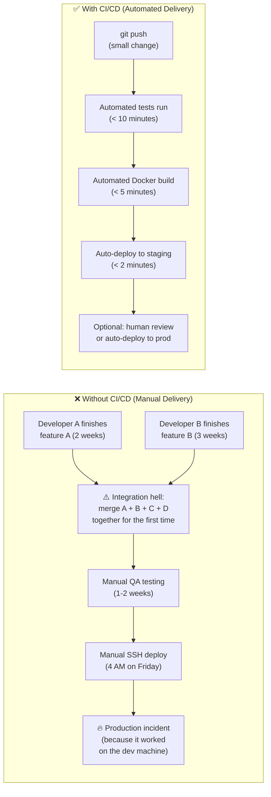
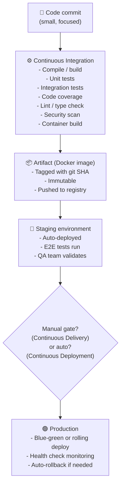

# The Problem: Manual Software Delivery

CI/CD မရှိခင်တုန်းက Software တစ်ခုကို Production တင်တယ်ဆိုတာ တော်တော်လေး အလုပ်ရှုပ်ပြီး Risk များတဲ့ လုပ်ငန်းစဉ်တစ်ခု ဖြစ်ပါတယ်။ Team တွေအနေနဲ့ Code အပြောင်းအလဲတွေကို ပတ်နဲ့ချီ၊ လနဲ့ချီပြီး စုဆောင်းကြတယ်၊ ပြီးမှ "Big Bang" release တစ်ခုဖြစ်လာဖို့ အားလုံးကို တစ်ပြိုင်နက်တည်း ပေါင်းထည့် (Merge) ဖို့ ကြိုးစားကြပါတယ်။



---

## CI vs CD: အဓိပ္ပါယ်ဖွင့်ဆိုချက်များ

### Continuous Integration (CI)

Developer တစ်ယောက်ယောက်က Code `push` လိုက်တိုင်း အလိုအလျောက် အလုပ်လုပ်တဲ့ စနစ်တစ်ခုက အောက်ပါအတိုင်း လုပ်ဆောင်줍니다:
1. Repository ထဲက Latest Code ကို **Pulls** လုပ်တယ်
2. Clean environment တစ်ခုထဲမှာ Dependencies တွေ အားလုံးကို **Installs** လုပ်တယ်
3. Tests တွေ အားလုံးကို **Runs** လုပ်တယ် (Unit, integration, linting, type checking)
4. မိနစ်ပိုင်းအတွင်းမှာ Pass ဖြစ်လား၊ Fail လားဆိုတာကို **Reports** တင်ပေးတယ်

**အဓိက အကျိုးကျေးဇူး**: Bug တွေကို Code စရေးတဲ့အချိန် သို့မဟုတ် Developer ရဲ့ ဦးနှောက်ထဲမှာ အမှတ်တရရှိနေဆဲ မိနစ်ပိုင်းအတွင်းမှာတင် ရှာဖွေတွေ့ရှိနိုင်ပါတယ်။ ရက်သတ္တပတ်တွေကြာပြီးမှ Integration လုပ်ရင်း ခေါင်းစားရမယ့် အလုပ်မျိုး မရှိတော့ပါဘူး။

### Continuous Delivery (CD)

Pass ဖြစ်သွားတဲ့ Build တိုင်းကို အလိုအလျောက် **Packaged** လုပ်တယ် (Docker image အဖြစ် Build ပြီး Registry ထဲ ပို့တယ်) ပြီးတော့ Staging ကို **Deployed** လုပ်ပါတယ်။ Production ကိုတော့ လူကိုယ်တိုင် နှိပ်ပြီး (သို့) အတည်ပြုချက်ပေးမှသာ Deploy လုပ်ပါတယ်။

### Continuous Deployment

ဒါက CD ကို တစ်ဆင့်ထပ်တက်လှမ်းထားတာ ဖြစ်ပါတယ်: **Pass ဖြစ်တဲ့ Build တိုင်းကို လူကိုယ်တိုင်ဝင်စွက်ဖက်စရာမလိုဘဲ Production ဆီ အလိုအလျောက် Deployed လုပ်ပါတယ်**။ ဒါက Test coverage ကောင်းမွန်ဖို့နဲ့ Monitoring ကောင်းမွန်ပြီး Auto-rollback လုပ်နိုင်ဖို့ လိုအပ်ပါတယ်။

---

## ရှေ့နဲ့နောက် (Before vs After)

| Scenario | Manual (No CI/CD) | Automated CI/CD |
|---------|-------------------|-----------------|
| **Testing** | "ငါ့လက်ပ်တော့ပေါ်မှာတော့ အလုပ်လုပ်တယ်" | Commit တတိုင်းမှာ Automated tests တွေ run တယ်၊ Clean ဖြစ်တဲ့ Linux runner သုံးတယ် |
| **Bug discovery** | ဒေါသထွက်နေတဲ့ User တွေက Production မှာ တွေ့မှသိရတာ | `main` branch ထဲ မပေါင်းခင် CI မှာတင် မိသွားတယ် |
| **Deployment** | သောကြာနေ့ မနက် ၄ နာရီမှာ Manual SSH ဝင်လုပ်ရတာ | အလိုအလျောက်၊ Downtime လုံးဝမရှိဘဲ၊ ဘယ်အချိန်မဆို လုပ်လို့ရတာ |
| **Release frequency** | ၃ လတစ်ကြိမ် (စိတ်ဖိစီးမှုများတဲ့ အဖြစ်အပျက်တစ်ခု) | တစ်နေ့ကို အကြိမ်များစွာ (ပုံမှန်လုပ်နေကျ၊ စိတ်အေးချမ်းသာရတဲ့ အလုပ်တစ်ခု) |
| **Rollback** | Manual နဲ့လုပ်ရပြီး နာရီပေါင်းများစွာ ကြာတာ | အလိုအလျောက်ဖြစ်ပြီး စက္ကန့်ပိုင်းပဲ ကြာတာ |
| **Time to fix a bug** | PR တင်ပြီး နောက်ထပ် Release လာဖို့စောင့် (ရက်သတ္တပတ်များစွာ) | PR တင်ပြီး မိနစ်ပိုင်းအတွင်း Deployed ပြီးသွားတာ |

---

## Team တွေအတွက် CI/CD က ဘာကြောင့် အရာရာကို ပြောင်းလဲပစ်ရတာလဲ

**စိတ်ပိုင်းဆိုင်ရာ အပြောင်းအလဲ**: Deployment တွေက Manual နဲ့လုပ်ရပြီး ရှားရှားပါးပါးမှ လုပ်ရတယ်ဆိုရင် Deployment တိုင်းက Risk ကြီးပါတယ်။ Deploy လုပ်ရတဲ့ အကြိမ်ရေ လျော့သွားအောင် Developer တွေက အပြောင်းအလဲ အကြီးကြီးတွေကို ပုံအောပြီး စုလုပ်ကြပါတယ်။ အပြောင်းအလဲကြီးလေ Test လုပ်ရ ခက်လေပါပဲ။ Test လုပ်ရ ခက်လေ Bug များလေပါပဲ။ Bug များလေ Risk ပိုကြီးလေပါပဲ။ Risk ကြီးလေ Deployment ပိုနည်းလေပါပဲ။ ဒါက အဆိုးဘက်ကို ဦးတည်နေတဲ့ သံသရာစက်ဝိုင်းတစ်ခုပါပဲ။

CI/CD က ဒီစက်ဝိုင်းကို ဖြတ်တောက်ပစ်ပါတယ်။ Deployment ဆိုတာ အလိုအလျောက်ဖြစ်တယ်၊ ကုန်ကျစရိတ်သက်သာတယ်၊ နောက်ပြန်လှည့်လို့လွယ်တယ်ဆိုရင်:
- Developer တွေက **အပြောင်းအလဲ အသေးစားတွေကို မကြာခဏ လုပ်လာကြတယ်** (Review လုပ်ရလွယ်တယ်၊ Debug လုပ်ရလွယ်တယ်)
- အပြောင်းအလဲ သေးလေ **Bug ပိုနည်းလေပါပဲ** (Error ဖြစ်နိုင်ခြေ ဧရိယာ နည်းသွားလို့ပါ)
- Bug နည်းလေ → **ယုံကြည်မှုပိုရှိလေ** → Deployment ပိုလုပ်ဖြစ်လေပါပဲ
- Deployment ပိုလုပ်လေ → Product တိုးတက်နှုန်း ပိုမြန်လေ၊ ပိုပြီး အရှိန်အဟုန်ကောင်းလာလေပါပဲ

---

## The CI/CD Value Chain



---

## လက်တွေ့ကမ္ဘာက CI/CD ကိန်းဂဏန်းများ

| Company | Deployment Frequency | CI/CD Tool |
|---------|-------------------|-----------|
| Amazon | ~23,000 deployments/day | Internal tool |
| Netflix | Hundreds/day | Spinnaker |
| Google | Millions of builds/day | Internal (Bazel + Borg) |
| Airbnb | Dozens/day | GitHub Actions |
| Your team (target) | 5–20/day | GitHub Actions |

Amazon လောက်ကြီးဖြစ်စရာ မလိုပါဘူး။ တစ်လမှ တစ်ခါ Ship တဲ့အစား တစ်နေ့ကို ၅ ခါလောက် Ship နိုင်တာတောင်မှ Team ရဲ့ Speed နဲ့ Product Quality မှာ အံ့မခန်း တိုးတက်လာမှာ ဖြစ်ပါတယ်။

---

## Pipeline as Code

ခေတ်မီ CI/CD မှာ Pipeline ကိုယ်တိုင်က Code တစ်ခုလို ဖြစ်နေပါပြီ — Version-controlled လုပ်ထားတယ်၊ Review လုပ်လို့ရတယ်၊ Application လိုပဲ Test လုပ်လို့ရပါတယ်:

```yaml
# .github/workflows/ci.yml — The CI pipeline IS a file in your repository
name: CI Pipeline
on: [push, pull_request]

jobs:
  test:
    runs-on: ubuntu-latest
    steps:
      - uses: actions/checkout@v4
      - run: npm ci
      - run: npm test
```

Pipeline-as-Code ရဲ့ အကျိုးကျေးဇူးများ:
- **Version control**: Pipeline အပြောင်းအလဲတိုင်းမှာ Author နဲ့ အကြောင်းပြချက်ပါတဲ့ Commit တစ်ခုစီ ရှိပါတယ်။
- **Code review**: တခြား Code တွေလိုပဲ Pipeline အပြောင်းအလဲတွေကိုလည်း PR တွေကနေတဆင့် စစ်ဆေးနိုင်ပါတယ်။
- **Reproducibility**: ဘယ်သူမဆို Repo ကို Clone လုပ်ပြီး ဘယ်လို Build ထားလဲဆိုတာကို အတိအကျ နားလည်နိုင်ပါတယ်။
- **Branching**: Branch တွေအလိုက် Pipeline တွေ ကွဲပြားနိုင်ပါတယ် (ဥပမာ- `main` က Production ကို Deploy မယ်၊ Feature branches တွေက Test တာပဲ လုပ်မယ်)

---

## အနှစ်ချုပ်

- **CI** (Continuous Integration) = Clean environment တစ်ခုထဲမှာ Commit တတိုင်းကို အလိုအလျောက် Test လုပ်ခြင်း
- **CD** (Continuous Delivery) = Staging ကို Auto-package + Auto-deploy လုပ်ခြင်း၊ Production အတွက်တော့ လူကိုယ်တိုင် ဝင်စစ်ဆေးရခြင်း
- **CD** (Continuous Deployment) = Production ထိ အလိုအလျောက် အပြည့်အဝ ပို့ဆောင်ပေးခြင်း — Pass ဖြစ်တဲ့ Build တိုင်း Ship ခြင်း
- CI/CD က "Big Bang Release" ဆိုတဲ့ အလေ့အထဆိုးကို ဖြိုခွဲပစ်ပါတယ်: အသေးစား၊ အကြိမ်ရေများများ၊ အလိုအလျောက် Delivery လုပ်ခြင်းက ပိုလုံခြုံတယ်၊ ပိုမြန်တယ်၊ စိတ်ဖိစီးမှုလည်း နည်းပါတယ်။
- Pipeline ဆိုတာ Repository ထဲက YAML ဖိုင်တစ်ခုပါပဲ — Version-controlled လုပ်လို့ရတယ်၊ Review လုပ်လို့ရတယ်၊ ပြန်ထုတ်လို့လည်း ရပါတယ်။
- Elite DevOps Team တွေက DORA Metrics တွေနဲ့ အောင်မြင်မှုကို တိုင်းတာကြပါတယ်: Deployment Frequency, Lead Time, MTTR, နဲ့ Change Failure Rate တို့ ဖြစ်ကြပါတယ်။

နောက်တစ်ခန်းမှာတော့ GitHub ထဲမှာ တိုက်ရိုက်ပါလာတဲ့ CI/CD Tool ဖြစ်တဲ့ GitHub Actions အကြောင်းကို သင်ယူရမှာဖြစ်ပြီး Workflow, Jobs, Steps နဲ့ Runners ဆိုတဲ့ သဘောတရားတွေကို CI/CD Value Chain မှာ ဘယ်လိုအသုံးပြုရမလဲဆိုတာကို နားလည်သွားမှာ ဖြစ်ပါတယ်။