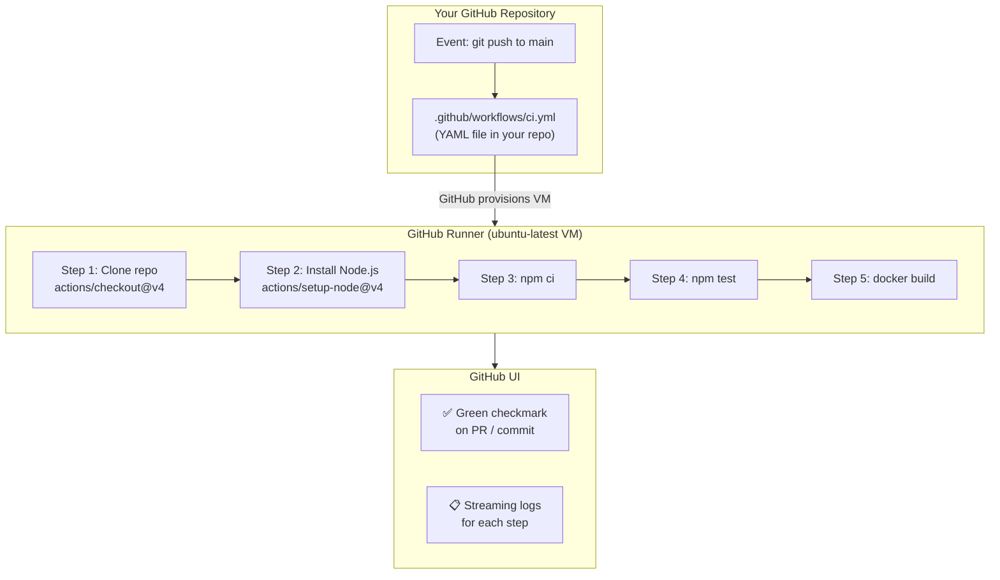

# GitHub Actions: GitHub ထဲမှာ တိုက်ရقي ပါလာတဲ့ CI/CD

GitHub Actions ဆိုတာ GitHub ရဲ့ ကိုယ်ပိုင် automation platform တစ်ခုပါ။ ပြင်ပ CI service တွေ (Jenkins, CircleCI, Travis CI) ကို သီးသန့်ချိတ်ဆက်စရာမလိုဘဲ, automation တွေကို YAML files ပုံစံနဲ့ ကိုယ့်ရဲ့ repository ထဲမှာ တိုက်ရိုက် သတ်မှတ်ရေးသားနိုင်ပါတယ်။ GitHub က virtual machines (runners) တွေကို ဖန်တီးပေးတယ်၊ ကိုယ့်ရဲ့ job တွေကို Run ပေးတယ်၊ ပြီးတော့ ရလဒ်တွေကို GitHub interface ထဲမှာပဲ တင်ပြပေးပါတယ်။



---

## မရှိမဖြစ် Core Concepts (၆) ခု

### 1. Event (Trigger)

Pipeline စတင် လုပ်ဆောင်စေမယ့် သတ်မှတ်ထားတဲ့ လှုပ်ရှားမှု (activity) ဖြစ်ပါတယ်-
```yaml
on:
  push:              # ဘယ်သူမဆို commit push လိုက်တဲ့အခါ
    branches: [main]
  pull_request:      # PR တစ်ခု ဖွင့်တဲ့အခါ (သို့) update တင်တဲ့အခါ
    branches: [main]
  schedule:          # Cron အခြေခံပြီး (ဥပမာ - ညတိုင်း security scan လုပ်တာမျိုး)
    - cron: '0 2 * * *'
  workflow_dispatch: # GitHub UI ထဲကနေ Manual ခလုတ်နှိပ်ပြီး Run တာ
```

### 2. Workflow

Automation definition လို့ ခေါ်ပါတယ်။ `.github/workflows/` ထဲမှာ ရှိတဲ့ YAML file တစ်ခု ဖြစ်ပါတယ်။ GitHub က ဒီ directory ထဲမှာ ရှိသမျှ `.yml` သို့မဟုတ် `.yaml` file တိုင်းကို အလိုအလျောက် ရှာဖွေတွေ့ရှိပါတယ်-

```
.github/
└── workflows/
    ├── ci.yml              ← CI pipeline (PR တိုင်းမှာ test လုပ်ဖို့)
    ├── deploy.yml          ← main branch ကို push တင်တဲ့အခါ deploy လုပ်ဖို့
    ├── security.yml        ← ညတိုင်း vulnerability scan လုပ်ဖို့
    └── release.yml         ← git tags တွေကြောင့် Trigger ဖြစ်တာ
```

### 3. Runner

ကိုယ့်ရဲ့ step တွေ Run မယ့် virtual machine ဖြစ်ပါတယ်။ GitHub က managed runners တွေကို ထောက်ပံ့ပေးပါတယ်-

| Runner | OS | Specs | Cost |
|--------|-----|-------|------|
| `ubuntu-latest` | Ubuntu 22.04 | 2 cores, 7 GB RAM | Free tier: 2000 min/month |
| `windows-latest` | Windows Server 2022 | 2 cores, 7 GB RAM | 1 min = 2 Ubuntu-equivalent |
| `macos-latest` | macOS Sonoma | 3 cores, 14 GB RAM | 1 min = 10 Ubuntu-equivalent |
| Self-hosted | Your machine | Whatever you have | Your infrastructure cost |

Workflow Run တိုင်းအတွက် Runner အသစ်တစ်ခုစီကို အစကနေ ပြန်ဆောက်ပေးပါတယ်။ (ကိုယ့်ဘာသာ cache လုပ်ထားတာ ဒါမှမဟုတ် artifact အနေနဲ့ upload တင်ထားတာတွေကလွဲလို့) run တိုင်းကြားမှာ ဘာမှ ဆက်ပြီး သိမ်းဆည်းထားခြင်း မရှိပါဘူး။

### 4. Job

Runner တစ်ခုတည်းပေါ်မှာ Runမယ့် step တွေရဲ့ စုစည်းမှု ဖြစ်ပါတယ်။ Job အများစုကို **Default အနေနဲ့ Parallel** Run ပါတယ်-

```yaml
jobs:
  test:      # 'lint' နဲ့ Parallel အတူတူ Run မယ်
    runs-on: ubuntu-latest
    steps: [...]
    
  lint:      # 'test' နဲ့ Parallel အတူတူ Run မယ်
    runs-on: ubuntu-latest
    steps: [...]

  build:
    needs: [test, lint]   # test နဲ့ lint နှစ်ခုစလုံး ပြီးသွားမှ ဆက် Run မယ်
    runs-on: ubuntu-latest
    steps: [...]
```

### 5. Step

Job တစ်ခုထဲမှာ ပါတဲ့ တစ်ခုချင်းစီရဲ့ Task တွေ ဖြစ်ပါတယ်။ Shell command တစ်ခုခု ဖြစ်နိုင်သလို, ပြန်သုံးလို့ရတဲ့ Action တစ်ခုလည်း ဖြစ်နိုင်ပါတယ်-

```yaml
steps:
  # Type 1: uses (Marketplace ကဖြစ်စေ၊ repository ကဖြစ်စေ ပြန်သုံးလို့ရတဲ့ Action)
  - name: Check out code
    uses: actions/checkout@v4

  # Type 2: run (shell command)
  - name: Run tests
    run: npm test

  # Type 3: run with multi-line script
  - name: Build and verify
    run: |
      npm run build
      ls -la dist/
      echo "Build size: $(du -sh dist/)"
```

### 6. Action

GitHub Marketplace မှာ တင်ထားတဲ့ ပြန်သုံးလို့ရတဲ့ ပြီးပြسည့်စုံပြီးသား automation unit တစ်ခု ဖြစ်ပါတယ်။ Code တွေ checkout လုပ်ဖို့၊ Node.js သွင်းဖို့ ဒါမှမဟုတ် AWS ကို authenticate လုပ်ဖို့ script တွေ ကိုယ်တိုင်ရေးနေမယ့်အစား အရင်လုပ်ပြီးသား Actions တွေကို သုံးနိုင်ပါတယ်-

```yaml
- uses: actions/checkout@v4          # Clone the repo
- uses: actions/setup-node@v4        # Install Node.js
- uses: actions/cache@v4             # Cache directories between runs
- uses: docker/login-action@v3       # Log in to a container registry
- uses: docker/build-push-action@v5  # Build and push Docker images
- uses: aws-actions/configure-aws-credentials@v4  # Configure AWS CLI
```

---

## Workflow Files တွေ ဘယ်မှာထားရမလဲ (အရေးကြီးသည်)

```bash
# ဒီ Path အတိုင်းအတိအကျ ဖြစ်ရပါမယ် (case sensitive ဖြစ်ပြီး အရှေ့မှာ dot ပါရပါမယ်)
.github/workflows/ci.yml

# Directory ကို ဖန်တီးရန်
mkdir -p .github/workflows
```

<Callout type="warning" title="Exact Path Required">
Directory နာမည်ကို ရှေ့က dot အပါအဝင် `.github/workflows/` လို့ အတိအကျ ပေးရပါမယ်။ ဒီ directory ထဲမှာ ရှိတဲ့ ဘယ် `.yml` သို့မဟုတ် `.yaml` file မဆို GitHub က အလိုအလျောက် သိရှိပါတယ်။ တကယ်လို့ `.Github/` လို့ပဲဖြစ်ဖြစ်၊ `.github/workflow/` ('s' မပါဘဲ) လို့ပဲဖြစ်ဖြစ် နာမည်ပေးမိရင် ရှာတွေ့မှာ မဟုတ်ပါဘူး။
</Callout>

---

## ပထမဆုံး Workflow ကို တစ်ကြောင်းချင်းစီ လေ့လာကြည့်ရအောင်

```yaml
# .github/workflows/hello-devops.yml

# === METADATA ===
name: Hello DevOps World   # GitHub Actions tab ထဲမှာ ပြမယ့်နာမည်
                           # ဖော်ပြလိုတဲ့ စာသား ဘースမဆို ပေးနိုင်ပါတယ်

# === TRIGGERS ===
on:
  push:
    branches: [main]       # main branch ကို push တင်တဲ့အခါမှသာ Trigger ဖြစ်မယ်

# === JOBS ===
jobs:
  # Job ID ("needs:" clause တွေမှာ ဒီ job ကို ညွှန်းဆိုဖို့ သုံးပါတယ်)
  hello-world:
    
    # ဘယ် GitHub-hosted runner ကို သုံးမလဲ
    runs-on: ubuntu-latest
    
    # အကြောင်းရင်းမရှိဘဲ ထွက်ပေါက်ပိတ်ပြီး Free minutes တွေ ကုန်သွားတာမျိုး မဖြစ်အောင် ကာကွယ်ရန်
    timeout-minutes: 5
    
    # === STEPS (အပေါ်ကနေ အောက်ကို အစဉ်လိုက် Run မယ်) ===
    steps:
      # Step 1: ကိုယ့်ရဲ့ repository ကို runner ပေါ်ကို Clone လုပ်မယ်
      # ဒါမပါရင် ကိုယ့်ရဲ့ code တွေ runner ပေါ်မှာ ရှိနေမှာ မဟုတ်ပါဘူး!
      - name: Checkout repository
        uses: actions/checkout@v4
        # @v4 ဆိုတာ version ဖြစ်ပါတယ် — ဘယ်တော့မှ @latest ကို မသုံးဘဲ version တစ်ခုခုကို အမြဲ fix လုပ်ထားပါ
        # ဒါမှ action update တွေကြောင့် မထင်မှတ်ထားတဲ့ error တွေ တက်တာကို ကာကွယ်နိုင်မှာပါ
      
      # Step 2: Shell command တစ်ခု Run မယ်
      - name: Greet the world
        run: echo "Hello from GitHub Actions!"
      
      # Step 3: Runner environment ကို စစ်ဆေးကြည့်မယ်
      - name: Show runner info
        run: |
          echo "OS: $(uname -a)"
          echo "Node: $(node --version)"
          echo "Python: $(python3 --version)"
          echo "Docker: $(docker --version)"
          echo "Files in workspace: $(ls -la)"
      
      # Step 4: GitHub context ကို အသုံးပြုခြင်း (ဒီ run နဲ့ပတ်သက်တဲ့ metadata တွေ)
      - name: Show run metadata
        run: |
          echo "Repository: ${{ github.repository }}"
          echo "Branch: ${{ github.ref_name }}"
          echo "Commit SHA: ${{ github.sha }}"
          echo "Actor (who triggered): ${{ github.actor }}"
          echo "Run number: ${{ github.run_number }}"
```

### ဒီ Workflow ကို Push တင်ပြီး Run တာကို ကြည့်ရအောင်

```bash
mkdir -p .github/workflows
# အပေါ်က YAML ကို .github/workflows/hello-devops.yml ဆိုပြီး save လိုက်ပါ
git add .github/workflows/hello-devops.yml
git commit -m "ci: add first GitHub Actions workflow"
git push origin main

# ဒီနေရာကို သွားပါ: github.com/yourorg/repo → Actions tab
# Workflow တန်းစီ Run နေတာနဲ့ Live streaming logs တွေကို တွေ့ရပါလိမ့်မယ်
```

---

## Free Tier နှင့် Billing

GitHub Actions က Public repositories တွေအတွက် **လုံးဝ အခမဲ့** ဖြစ်ပါတယ်။ Private repositories တွေအတွက်ကတော့:

| Plan | Free minutes/month | Storage |
|------|------------------|---------|
| **Free** | 2,000 min | 500 MB |
| **Pro** | 3,000 min | 1 GB |
| **Team** | 3,000 min | 2 GB |
| **Enterprise** | 50,000 min | 50 GB |

**Minute multipliers** (`ubuntu-latest` ကို ဘာကြောင့် default သုံးသင့်လဲဆိုတဲ့ အကြောင်းရင်း):
- `ubuntu-latest`: 1 minute = 1 included minute
- `windows-latest`: 1 minute = 2 included minutes
- `macos-latest`: 1 minute = 10 included minutes

**ကိုယ့်ရဲ့ သုံးစွဲမှုကို ကြည့်ရန်**: GitHub → Settings → Billing → Actions

---

## GitHub Actions Marketplace

[github.com/marketplace?type=actions](https://github.com/marketplace?type=actions) မှာ အသင့်သုံး Actions ပေါင်း ၂၀,၀၀၀ ကျော် ရှိပါတယ်-

```yaml
# DevOps workflows တွေအတွက် မရှိမဖြစ် actions တွေ:
uses: actions/checkout@v4              # Clone repo
uses: actions/setup-node@v4            # Install Node.js
uses: actions/setup-python@v5         # Install Python
uses: actions/setup-java@v4            # Install Java
uses: actions/cache@v4                 # Cache dependencies
uses: actions/upload-artifact@v4       # Upload build outputs
uses: actions/download-artifact@v4     # Download artifacts between jobs

uses: docker/setup-buildx-action@v3    # Enable BuildKit
uses: docker/login-action@v3           # Log in to registry
uses: docker/build-push-action@v5      # Build + push images
uses: docker/metadata-action@v5        # Generate image tags

uses: aws-actions/configure-aws-credentials@v4  # AWS auth
uses: google-github-actions/auth@v2             # GCP auth
uses: azure/login@v2                            # Azure auth

uses: appleboy/ssh-action@v1            # SSH to remote server
uses: slackapi/slack-github-action@v1   # Post to Slack

uses: aquasecurity/trivy-action@master  # Vulnerability scan
uses: github/codeql-action/analyze@v3  # SAST analysis
uses: codecov/codecov-action@v4         # Upload coverage report
```

<Callout type="important" title="Always Pin Actions to a Version">
`actions/checkout@main` သို့မဟုတ် `actions/checkout@latest` ကို မသုံးဘဲ `actions/checkout@v4` ကို သုံးပါ။ Version ဖিক্সမထားတဲ့ actions တွေဟာ သတိပေးချက်မရှိဘဲ breaking changes တွေ ဖြစ်ပေါ်စေနိုင်ပါတယ်။ လုံခြုံရေးအရ အရေးကြီးတဲ့ actions တွေအတွက်ဆိုရင် Full SHA ကို သုံးတာ ပိုကောင်းပါတယ်- ဥပမာ `actions/checkout@11bd71901bbe5b1630ceea73d27597364c9af683` (လုံးဝ မပြောင်းလဲတော့တဲ့ version)။
</Callout>

---

## အနှစ်ချုပ်

- **GitHub Actions** ဆိုတာ GitHub ရဲ့ ကိုယ်ပိုင် CI/CD ဖြစ်ပြီး `.github/workflows/` ထဲမှာ YAML files တွေနဲ့ သတ်မှတ်ပါတယ်
- **Core concepts 6 ခု**: Event (trigger) → Workflow (YAML file) → Runner (VM) → Job (runner တစ်ခုပေါ်က steps တွေ) → Step (command သို့မဟုတ် Action) → Action (Marketplace ကနေ ပြန်သုံးလို့ရတဲ့ unit)
- `ubuntu-latest` ဟ အကောင်းဆုံး အကြံပြုထားတဲ့ runner ဖြစ်ပါတယ် — ဈေးအသက်သာဆုံးနဲ့ Linux tooling တွေနဲ့ အကိုက်ညီဆုံး ဖြစ်ပါတယ်
- Job တွေဟာ Default အနေနဲ့ **Parallel** Run ကြပါတယ်။ အစဉ်လိုက် Run ချင်ရင် `needs:` ကို သုံးပါ
- **Action versions တွေကို Pin လုပ်ပါ** (`@v4` အနည်းဆုံးသုံးပါ၊ လုံခြုံရေးအထူးလိုအပ်ရင် SHA သုံးပါ) — `@latest` ကို ဘယ်တော့မှ မသုံးပါနဲ့
- Free tier: Private repos တွေအတွက် တစ်လကို 2,000 minutes; Public repos တွေအတွက် အကန့်အသတ်မရှိ

နောက်သင်ခန်းစာမှာတော့ GitHub Actions ရဲ့ YAML syntax အပြည့်အစုံ — keyword တိုင်း၊ option တိုင်းနဲ့ production pipelines တွေမှာ သုံးတဲ့ pattern တွေကို ကျွမ်းကျင်အောင် လေ့လာရမှာ ဖြစ်ပါတယ်။