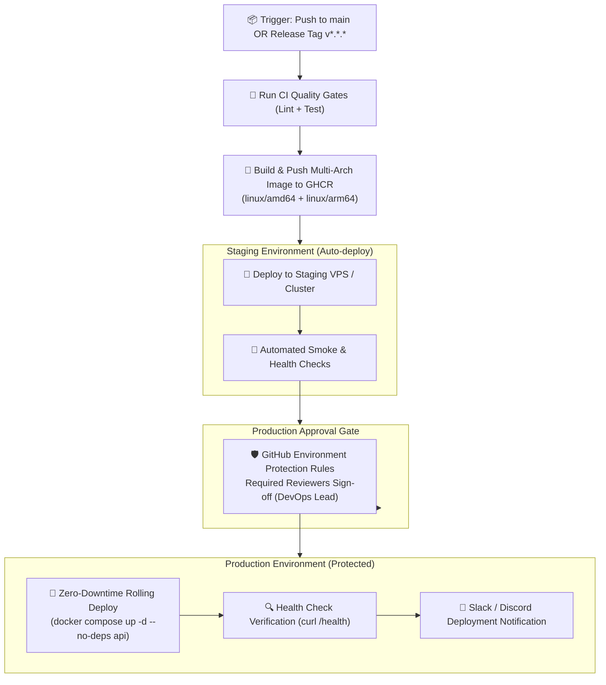

# Delivering Code to Production Safely

Continuous Deployment (CD) ဆိုတာကတော့ CI pipeline ကနေတဆင့် အောင်မြင်စွာ စစ်ဆေးပြီးသား code artifacts တွေကို target hosting environments ဆီကို လုံခြုံစွာ deploy လုပ်ပေးတဲ့ automated process တစ်ခု ဖြစ်ပါတယ်။ GitHub Actions ရဲ့ ဒီနောက်ဆုံး သင်ခန်းစာမှာတော့ multi-environment deployments, multi-architecture support နဲ့ GHCR ဆီကို container publishing လုပ်တာ၊ healthchecks တွေနဲ့ zero-downtime SSH VPS rollouts လုပ်တာ၊ ဒါတွေအပြင် environment protection governance တွေကို ကျွမ်းကျင်ပိုင်နိုင်သွားမှာ ဖြစ်ပါတယ်။



---

## 1. Publishing Multi-Architecture Docker Images to GHCR

Modern cloud infrastructure တွေဟာ x86_64 (`linux/amd64` for Intel/AMD servers) နဲ့ ARM64 (`linux/arm64` for AWS Graviton, Apple Silicon, Raspberry Pi) နှစ်ခုစလုံးပေါ်မှာ Run ကြပါတယ်။ GitHub Actions က Docker Buildx နဲ့ QEMU ကိုသုံးပြီး multi-platform images တွေကို GitHub Container Registry (GHCR) ဆီ တိုက်ရိုက် build လုပ်ပြီး push လုပ်ဖို့ ခွင့်ပြုပေးပါတယ် -

```yaml
name: Publish Container to GHCR

on:
  push:
    branches: [ main ]
    tags: [ 'v*.*.*' ]

permissions:
  contents: read
  packages: write     # Required to publish to ghcr.io

jobs:
  docker-publish:
    runs-on: ubuntu-latest
    steps:
      - uses: actions/checkout@v4

      # 1. Set up QEMU for multi-architecture CPU emulation
      - name: Set up QEMU
        uses: docker/setup-qemu-action@v3

      # 2. Set up Docker Buildx for advanced caching & builder features
      - name: Set up Docker Buildx
        uses: docker/setup-buildx-action@v3

      # 3. Authenticate to GitHub Container Registry
      - name: Log in to GHCR
        uses: docker/login-action@v3
        with:
          registry: ghcr.io
          username: ${{ github.actor }}
          password: ${{ secrets.GITHUB_TOKEN }}

      # 4. Extract Docker metadata (tags, labels, semver)
      - name: Extract metadata
        id: meta
        uses: docker/metadata-action@v5
        with:
          images: ghcr.io/${{ github.repository }}
          tags: |
            type=raw,value=latest,enable={{is_default_branch}}
            type=sha,format=short,prefix=sha-
            type=semver,pattern={{version}}
            type=semver,pattern={{major}}.{{minor}}

      # 5. Build and push multi-arch image
      - name: Build and push image
        uses: docker/build-push-action@v5
        with:
          context: .
          platforms: linux/amd64,linux/arm64
          push: true
          tags: ${{ steps.meta.outputs.tags }}
          labels: ${{ steps.meta.outputs.labels }}
          cache-from: type=gha
          cache-to: type=gha,mode=max
```

---

## 2. Zero-Downtime Server Deployment via SSH & Docker Compose

Virtual private servers (AWS EC2, DigitalOcean, Hetzner, Linode) တွေပေါ်မှာ Run နေတဲ့ Application တွေအတွက် `appleboy/ssh-action` ကိုသုံးပြီး encrypted SSH ကနေတဆင့် deployment လုပ်တာကို automate လုပ်နိုင်ပါတယ်။

Key pattern ကတော့ **zero-downtime container replacement** ဖြစ်ပါတယ် - ရှေးဟောင်း Container က traffic တွေကို ဆက်လက် serve ပေးနေတုန်းမှာပဲ image အသစ်ကို pull ဆွဲပါ၊ stateless API container တစ်ခုတည်းကိုသာ ပြန်လည် ဖန်တီးပါ၊ healthcheck ကို run ပါ၊ ပြီးတော့ check လုပ်တာ မအောင်မြင်ရင် automatic roll back လုပ်ပေးပါတယ်။

```yaml
deploy-production:
  name: 🚀 Production Rollout
  runs-on: ubuntu-latest
  environment:
    name: production
    url: https://api.mycompany.com

  steps:
    - name: SSH Remote Deployment & Health Verification
      uses: appleboy/ssh-action@v1.0.3
      with:
        host: ${{ secrets.PROD_SERVER_HOST }}
        username: ${{ secrets.PROD_SERVER_USER }}
        key: ${{ secrets.PROD_SSH_PRIVATE_KEY }}
        port: 22
        envs: GITHUB_SHA
        script: |
          set -e
          cd /opt/my-app

          echo "📦 Pulling latest image digest for SHA: $GITHUB_SHA..."
          IMAGE_TAG=sha-${GITHUB_SHA:0:7}
          docker pull ghcr.io/my-org/my-app:$IMAGE_TAG

          echo "🔄 Performing zero-downtime rolling service restart..."
          # Update ONLY the API service without disrupting DB or Redis containers
          IMAGE_TAG=$IMAGE_TAG docker compose -f docker-compose.yml -f docker-compose.prod.yml up -d --no-deps api

          echo "🔍 Verifying application health endpoint..."
          sleep 5
          for i in {1..10}; do
            if curl -f -s http://127.0.0.1:3000/api/health | grep '"status":"ok"'; then
              echo "✅ Health check passed! Deployment is healthy."
              exit 0
            fi
            echo "⏳ Waiting for health check to pass ($i/10)..."
            sleep 3
          done

          echo "❌ Health check timed out! Initiating automatic rollback..."
          # Roll back to previous stable image if health check fails
          docker compose -f docker-compose.yml -f docker-compose.prod.yml rollback api || true
          exit 1
```

---

## 3. GitHub Environment Protection Rules & Governance

Enterprise Teams တွေမှာ အတည်ပြုချက် (Approval) မပါဘဲ Production ဆီကို တိုက်ရိုက် Deploy လုပ်တာကို တားမြစ်ထားပါတယ်။ GitHub **Environments** တွေက built-in governance ကို ထောက်ပံ့ပေးပါတယ် -

```
GitHub Repository → Settings → Environments → New environment: 'production'
```

### Environment Security Controls:
1. **Required Reviewers**: Job မလုပ်ဆောင်ခင် GitHub UI သို့မဟုတ် mobile app ကနေတဆင့် deployment ကို manual အတည်ပြုပေးရမည့် လူပုဂ္ဂိုလ် သို့မဟုတ် Teams အများဆုံး ၆ ခုအထိ သတ်မှတ်နိုင်ပါတယ် (ဥပမာ - `@my-org/devops-leads`)။
2. **Wait Timer**: Background soak tests တွေ run နိုင်ဖို့အတွက် staging deployment နဲ့ production deployment အကြားမှာ မဖြစ်မနေ စောင့်ရမည့် အချိန် (ဥပမာ - ၁၅ မိနစ်) ကို သတ်မှတ်နိုင်ပါတယ်။
3. **Deployment Branches**: Production releases တွေကို `main` branch သို့မဟုတ် release tags (`v*.*.*`) တွေမှာသာ တင်းတင်းကျပ်ကျပ် ကန့်သတ်ထားနိုင်ပါတယ်။
4. **Environment-Specific Secrets**: `PROD_DATABASE_URL` ဟာ PR builds တွေနဲ့ လုံးဝ သီးသန့်ကင်းလွတ်နေပြီး `production` environment context ထဲမှာ Run နေမှသာ ဝင်ရောက်သုံးစွဲနိုင်ပါတယ်။

---

## 4. ChatOps Notifications: Slack & Discord Alerts

Commit author, branch, SHA နဲ့ deployment run ဆီကို တိုက်ရိုက်သွားတဲ့ links တွေပါဝင်တဲ့ automated Slack သို့မဟုတ် Discord notifications တွေနဲ့ engineering teams တွေကို အချိန်နဲ့တပြေးညီ အသိပေးထားနိုင်ပါတယ် -

```yaml
    - name: 📢 Notify Slack of Deployment Status
      if: always()
      uses: slackapi/slack-github-action@v1.26.0
      with:
        payload: |
          {
            "text": "${{ job.status == 'success' && '🚀 *Production Deployment Succeeded*' || '🚨 *Production Deployment FAILED*' }}",
            "blocks": [
              {
                "type": "section",
                "text": {
                  "type": "mrkdwn",
                  "text": "*Status:* ${{ job.status == 'success' && '✅ Succeeded' || '❌ Failed' }}\n*Repository:* ${{ github.repository }}\n*Commit:* <https://github.com/${{ github.repository }}/commit/${{ github.sha }}|${{ github.sha }}>\n*Triggered by:* @${{ github.actor }}\n*Environment:* Production"
                }
              }
            ]
          }
      env:
        SLACK_WEBHOOK_URL: ${{ secrets.SLACK_DEPLOYMENT_WEBHOOK }}
```

---

## 5. Complete End-to-End CI/CD Pipeline

သင်ခန်းစာ ၈ ခုလုံး ဘယ်လိုချိတ်ဆက်ပြီး master deployment pipeline တစ်ခုဖြစ်လာလဲဆိုတာကတော့ ဒီလိုပါ -

```yaml
name: Master CI/CD Pipeline

on:
  push:
    branches: [ main ]
    tags: [ 'v*.*.*' ]

concurrency:
  group: deployment-${{ github.ref }}
  cancel-in-progress: false   # Never cancel in-flight production deploys!

jobs:
  # 1. CI Quality Checks
  ci-test:
    name: 🧪 Run Quality Gates
    runs-on: ubuntu-latest
    steps:
      - uses: actions/checkout@v4
      - uses: actions/setup-node@v4
        with: { node-version: 20, cache: 'npm' }
      - run: npm ci
      - run: npm run lint
      - run: npm test

  # 2. Package Container
  publish-container:
    name: 🐳 Build & Publish OCI Image
    needs: ci-test
    runs-on: ubuntu-latest
    permissions:
      contents: read
      packages: write
    steps:
      - uses: actions/checkout@v4
      - uses: docker/setup-buildx-action@v3
      - uses: docker/login-action@v3
        with:
          registry: ghcr.io
          username: ${{ github.actor }}
          password: ${{ secrets.GITHUB_TOKEN }}
      - uses: docker/build-push-action@v5
        with:
          context: .
          push: true
          tags: ghcr.io/${{ github.repository }}:sha-${{ github.sha }}
          cache-from: type=gha
          cache-to: type=gha,mode=max

  # 3. Deploy to Staging
  deploy-staging:
    name: 🟡 Deploy Staging
    needs: publish-container
    runs-on: ubuntu-latest
    environment:
      name: staging
      url: https://staging.mycompany.com
    steps:
      - name: Deploy to Staging Cluster
        run: echo "Deployed to staging successfully!"

  # 4. Deploy to Production (Protected by Required Reviewers)
  deploy-production:
    name: 🟢 Deploy Production
    needs: deploy-staging
    runs-on: ubuntu-latest
    environment:
      name: production
      url: https://mycompany.com
    steps:
      - name: Deploy to Production
        run: echo "Deployed to production with zero downtime!"
```

---

## Course 2 Complete! 🎉

အောက်ပါ **GitHub Actions Automation** သင်ရိုးညွှန်းတမ်း တစ်ခုလုံးကို သင် တရားဝင် ကျွမ်းကျင်ပိုင်နိုင်သွားပါပြီ:
- **Lesson 1:** CI/CD core philosophy နဲ့ automated delivery value chain.
- **Lesson 2:** GitHub Actions architecture (Events, Workflows, Jobs, Steps, Runners, Marketplace).
- **Lesson 3:** Complete YAML workflow syntax, expressions, contexts နဲ့ matrix builds.
- **Lesson 4:** Event triggers (`push`, `pull_request`, `schedule`, `workflow_dispatch`, `workflow_call`).
- **Lesson 5:** Multi-job parallelism, live PostgreSQL & Redis service containers, artifact archiving နဲ့ caching.
- **Lesson 6:** Environment variables, encrypted secrets hierarchy, least-privilege `GITHUB_TOKEN` နဲ့ keyless cloud OIDC.
- **Lesson 7:** Production CI pipeline engineering with BuildKit layer caching နဲ့ fail-fast static gates.
- **Lesson 8:** Continuous Deployment, multi-arch image publishing to GHCR, zero-downtime rolling SSH updates နဲ့ environment protection rules.

---

## Next Up: Containerization & Cloud-Native Infrastructure

သင်ရဲ့ CI/CD automation အခြေခံခိုင်မာသွားပြီဆိုတော့ Modern containerization တွေကို လေ့လာဖို့ အဆင်သင့် ဖြစ်နေပါပြီ -
- **Course 4: Docker Fundamentals** — Deep Linux namespaces, cgroups, writing ultra-small multi-stage images, layer caching နဲ့ rootless container security.
- **Course 5: Docker Compose** — Orchestrating complex multi-tier microservice networks နဲ့ persistent volume storage.
- **Course 6 & 7: Kubernetes & K3s** — Pods, Deployments, Services, Ingress Controllers, StatefulSets နဲ့ GitOps deployments!