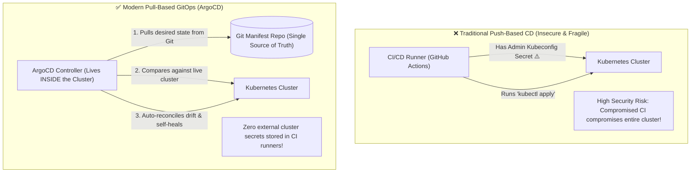
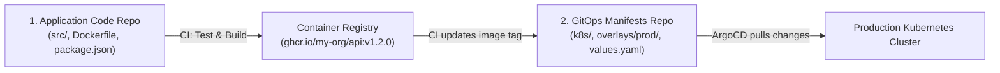

# GitOps Core Principles & Declarative Continuous Delivery

ဆယ်စုနှစ်တစ်ခုကျော်ကြာအောင် Continuous Delivery (CD) ကို **Push-Based** အနေနဲ့ သုံးခဲ့ကြပါတယ်- CI server (ဥပမာ- Jenkins ဒါမှမဟုတ် GitHub Actions လိုမျိုး) ကနေ `kubectl apply` ကို Run တာ ဒါမှမဟုတ် CI secrets ထဲမှာ သိမ်းထားတဲ့ privileged administrative credentials တွေကိုသုံးပြီး production servers တွေထဲကို SSH ဝင်တာမျိုး လုပ်ကြပါတယ်။

**GitOps** က ဒီပုံစံကို **Pull-Based** ဖြစ်တဲ့ declarative model တစ်ခုအနေနဲ့ ပြောင်းလဲလိုက်ပါတယ်။ ဒီပုံစံမှာတော့ **Git ဟာ သင့်ရဲ့ infrastructure နဲ့ application state အားလုံးအတွက် Single Source of Truth** ဖြစ်လာပါတယ်။

---

## The 4 OpenGitOps Principles

CNCF OpenGitOps စံနှုန်းအရ မဖြစ်မနေ လိုက်နာရမယ့် 4 principles ကတော့ အောက်ပါအတိုင်း ဖြစ်ပါတယ်-

1. **Declarative**: စနစ်တစ်ခုလုံးရဲ့ လိုချင်တဲ့ ပုံစံ (desired state) အားလုံးကို declarative ဖြစ်တဲ့နည်းလမ်းနဲ့ ဖော်ပြထားပါတယ် (ဥပမာ- Kubernetes manifests, Helm charts, Kustomize overlays)။
2. **Versioned and Immutable**: လိုချင်တဲ့ state ကို version control (Git) ထဲမှာ အပြည့်အစုံသော commit history, audit trails နဲ့ cryptographic commit signatures တွေနဲ့တကွ သိမ်းဆည်းထားပါတယ်။
3. **Pulled Automatically**: Cluster ထဲမှာ Run နေတဲ့ software agents တွေ (ဥပမာ- ArgoCD) က Git ကနေ desired state ကို အဆက်မပြတ် pull လုပ်ယူပါတယ်။
4. **Continuously Reconciled**: Agent က Git ထဲက desired state နဲ့ လက်ရှိ Run နေတဲ့ cluster state ကြားက ကွာဟချက် (drift) မှန်သမျှကို ရှာဖွေတွေ့ရှိပြီး cluster ကို Git နဲ့ ထပ်တူကျအောင် အလိုအလျောက် ပြန်လည် ညှိနှိုင်းပေးပါတယ် (reconcile လုပ်ပေးပါတယ်)။

---

## Push vs. Pull CD: Detailed Architectural Comparison

| Dimension | Push-Based CD (GitHub Actions `kubectl`) | Pull-Based GitOps (ArgoCD) |
| :--- | :--- | :--- |
| **Cluster Credentials** | CI runner secrets ထဲမှာ အပြင်ဘက်မှာ သိမ်းထားပါတယ် | Cluster ထဲမှာပဲ တင်းတင်းကျပ်ကျပ် သိမ်းထားပါတယ် (အပြင်ဘက် လုံးဝ ပေါက်ကြားမှု မရှိပါ) |
| **Drift Detection** | မရှိပါ (လက်နဲ့ `kubectl` ဝင်ပြင်တာတွေကို မသိနိုင်ပါ) | Real-time ဖြင့် အဆက်မပြတ် စစ်ဆေးပေးပါတယ် (alerts ပို့တာ ဒါမှမဟုတ် auto-revert လုပ်တာတွေ လုပ်ပေးပါတယ်) |
| **Rollback Strategy** | ယခင် CI pipeline build ကို ပြန် Run ရပါတယ် | `git revert <commit-hash>` (၅ စက္ကန့်ပဲ ကြာပါတယ်) |
| **Audit Log** | CI pipeline run logs တွေထဲမှာ ပျံ့နှံ့နေပါတယ် | သပ်ရပ်ပြီး ပြင်လို့မရတဲ့ (immutable) Git commit log ရှိပါတယ် |
| **Disaster Recovery** | လက်နဲ့ တစ်ခုချင်းစီ နှေးကွေးစွာ ပြန်တည်ဆောက်ရပါတယ် | Cluster အသစ်တစ်ခုပေါ်မှာ ArgoCD ကို Git repo နဲ့ ချိတ်ပေးလိုက်ုံပါပဲ |

---

## The Two-Repository Architecture

Production ပတ်ဝန်းကျင်မှာတော့ application source code နဲ့ deployment manifests တွေကို **repository နှစ်ခု ਵੱਖ ਵੱਖ** ခွဲထားလေ့ရှိပါတယ်-

### Why Separate Repositories?
1. **Prevents CI Infinite Loops**: Deployment manifest ကို ပြင်လိုက်တာနဲ့ မိနစ် ၂၀ လောက်ကြာတဲ့ application code build/test cycle ကြီး တစ်ခုလုံးကို ထပ်ဖြစ်မသွားအောင် တားဆီးပေးပါတယ်။
2. **Strict RBAC Access**: Developer တွေက App Repo ကို write access ရှိပေမဲ့ Senior DevOps engineers တွေနဲ့ automated CI bots တွေသာလျှင် GitOps Manifests Repo ကို write access ရှိပါတယ်။
3. **Clean Audit History**: Manifest repo commit log မှာ ဘယ်တုန်းက release လုပ်ခဲ့တယ်ဆိုတဲ့ အချက်အလက်အတိအကျကို ပြသပေးပါတယ် (ဥပမာ- `Deploy v1.2.0 to production`)။