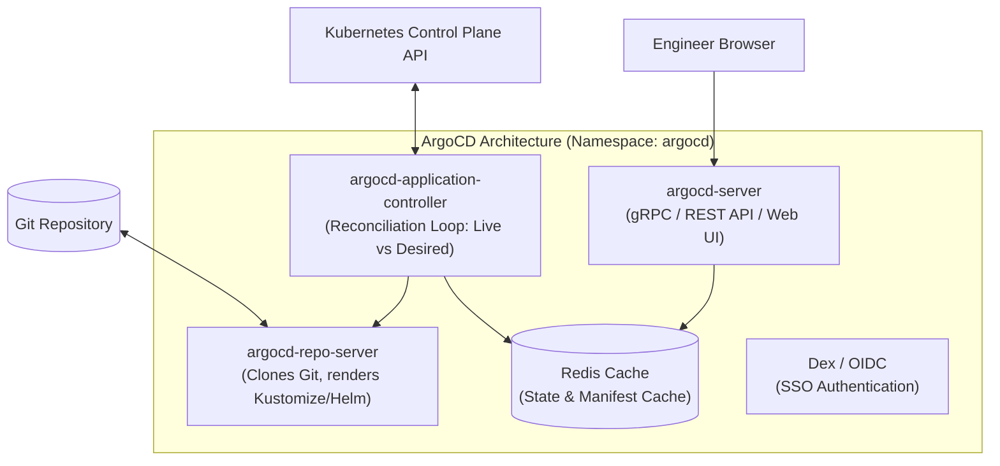

# ArgoCD Architecture & Installation

ArgoCD ဆိုတာကတော့ Kubernetes အတွက် declarative နဲ့ GitOps continuous delivery tool တစ်ခုဖြစ်ပြီး၊ Kubernetes native controller တစ်ခုအနေနဲ့ implement လုပ်ထားပါတယ်။



---

## Core Architectural Components (၄) ခု

1. **`argocd-server`**: Web UI နဲ့ gRPC/REST API တွေကို provide လုပ်ပေးပါတယ်။ Authentication (SSO/Dex) တွေ၊ RBAC enforcement နဲ့ project access တွေကို handle လုပ်ပါတယ်။
2. **`argocd-repo-server`**: Git repositories တွေကို clone လုပ်တယ်၊ raw YAML တွေကို parse လုပ်တယ်၊ ပြီးတော့ Kustomize ဒါမှမဟုတ် Helm ကိုသုံးပြီး templates တွေကို plain Kubernetes manifests တွေအဖြစ် render လုပ်ပေးပါတယ်။
3. **`argocd-application-controller`**: continuous reconciliation engine ဖြစ်ပါတယ်။ Live Kubernetes API ကို query လုပ်တယ်၊ render လုပ်ထားတဲ့ Git state နဲ့ နှိုင်းယှဥ်တယ်၊ ပြီးတော့ sync policies တွေကို execute လုပ်ပါတယ်။
4. **`Redis`**: Git providers နဲ့ Kubernetes API တွေပေါ်ကို request တွေ ပုံမှန်ထက် ပိုမိုမရောက်လာအောင် (hammering) render လုပ်ထားတဲ့ manifests တွေနဲ့ live cluster state တွေကို သိမ်းဆည်းပေးတဲ့ in-memory cache ဖြစ်ပါတယ်။

---

## Step-by-Step Production Installation

### 1. Kubernetes ထဲတွင် ArgoCD ကို Install လုပ်ခြင်း
```bash
# Create dedicated namespace
kubectl create namespace argocd

# Apply official ArgoCD installation manifests
kubectl apply -n argocd -f https://raw.githubusercontent.com/argoproj/argo-cd/stable/manifests/install.yaml
```

### 2. Running Pods တွေကို Verify လုပ်ခြင်း
```bash
$ kubectl get pods -n argocd

NAME                                                READY   STATUS    RESTARTS
argocd-application-controller-0                     1/1     Running   0
argocd-dex-server-6789b78494-abcde                  1/1     Running   0
argocd-redis-74b8896d79-fghij                       1/1     Running   0
argocd-repo-server-5f899b846-klmno                  1/1     Running   0
argocd-server-7bc99446d4-pqrst                      1/1     Running   0
```

### 3. Initial Admin Password ကို Extract လုပ်ခြင်း
ArgoCD က စတင် run တဲ့အခါ initial `admin` user အတွက် random secret တစ်ခုကို generate လုပ်ပေးပါတယ်။

```bash
kubectl -n argocd get secret argocd-initial-admin-secret -o jsonpath="{.data.password}" | base64 -d
```

### 4. Port-Forwarding ကိုသုံးပြီး Web UI သို့ Access လုပ်ခြင်း
```bash
kubectl port-forward svc/argocd-server -n argocd 8080:443
```
Browser မှာ `https://localhost:8080` ကိုဖွင့်ပြီး၊ username ကို `admin` လို့ထည့်ကာ decode လုပ်ထားတဲ့ password နဲ့ login ဝင်ပါ။

---

## ArgoCD CLI ဖြင့် အလုပ်လုပ်ခြင်း

ArgoCD CLI ကို install လုပ်ရန်:
```bash
# macOS
brew install argocd

# Linux
curl -sSL -o argocd-linux-amd64 https://github.com/argoproj/argo-cd/releases/latest/download/argocd-linux-amd64
sudo install -m 555 argocd-linux-amd64 /usr/local/bin/argocd
rm argocd-linux-amd64
```

Terminal မှတဆင့် login ဝင်ရန်:
```bash
argocd login localhost:8080 --username admin --insecure
```

---

## Private Git Repository တစ်ခုနှင့် ချိတ်ဆက်ခြင်း

Private GitHub ဒါမှမဟုတ် GitLab repositories တွေကို sync လုပ်ဖို့အတွက် SSH Deploy Key ဒါမှမဟုတ် GitHub App credentials တွေကို ထည့်ပေးရပါမယ်:

```bash
argocd repo add git@github.com:my-org/k8s-manifests.git   --ssh-private-key-path ~/.ssh/id_rsa_argocd
```