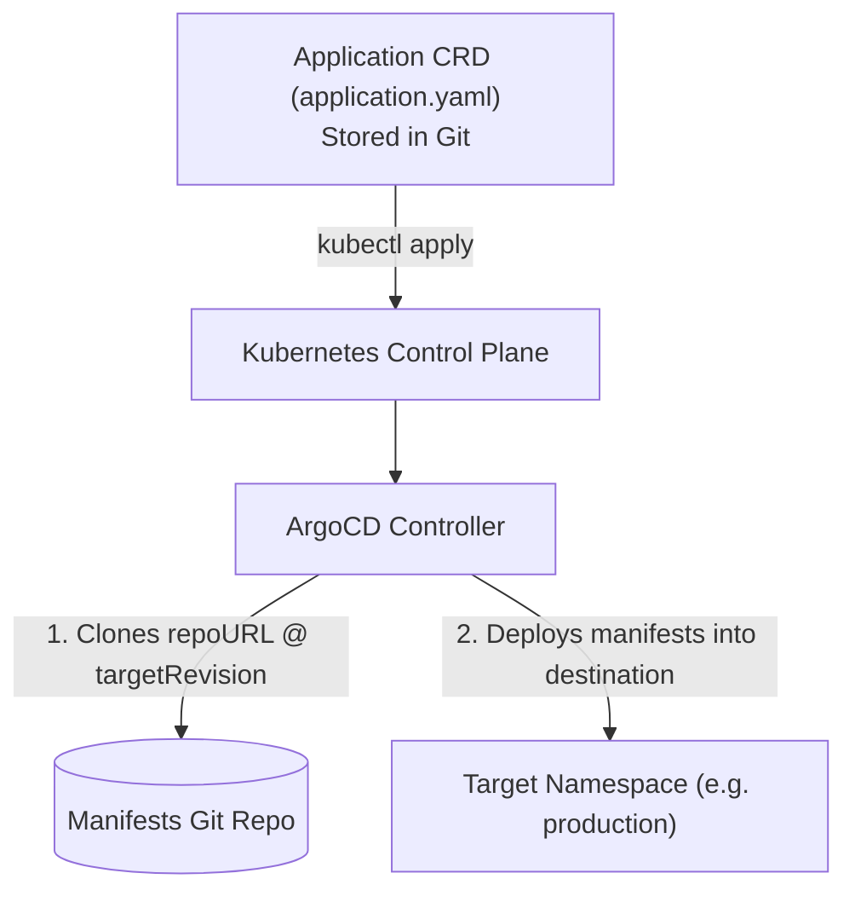

# Declarative Applications: Application CRDs

ArgoCD Web UI ကို သုံးပြီး Application တွေကို ဖန်တီးလို့ရပေမယ့်၊ အဲ့ဒီလိုလုပ်တာဟာ GitOps ရဲ့ သဘောတရားနဲ့ ငြိစွန်းသွားပါတယ်။ အမှန်တကယ် စံပြုထားတဲ့ GitOps workflow မှာဆိုရင် **ArgoCD ကိုယ်တိုင်က Kubernetes Custom Resource Definitions (CRDs) တွေကိုသုံးပြီး declarative ပုံစံနဲ့ configuration လုပ်ရပါတယ်**။



---

## Anatomy of the `Application` CRD

ဒါကတော့ production-grade အဆင့်ရှိတဲ့ အပြည့်အစုံ `Application` manifest တစ်ခု ဖြစ်ပါတယ်:

```yaml
apiVersion: argoproj.io/v1alpha1
kind: Application
metadata:
  name: production-web-api
  namespace: argocd
  finalizers:
    # Ensures that deleting the Application CR cascades and deletes all managed K8s resources
    - resources-finalizer.argocd.argoproj.io
spec:
  # The project this application belongs to (for RBAC)
  project: default

  # Source: Where the desired manifests live
  source:
    repoURL: 'https://github.com/my-org/k8s-manifests.git'
    targetRevision: main # Git branch, commit SHA, or release tag (e.g. 'v1.4.0')
    path: 'environments/production' # Subdirectory inside repo

  # Destination: Where to deploy the resources
  destination:
    server: 'https://kubernetes.default.svc' # Local in-cluster API
    namespace: production

  # Sync Policy: How ArgoCD handles drift and automated updates
  syncPolicy:
    automated:
      prune: true     # Automatically delete K8s objects removed from Git
      selfHeal: true  # Automatically overwrite manual 'kubectl' edits
    syncOptions:
      - CreateNamespace=true      # Auto-create target namespace if missing
      - ApplyOutOfSyncOnly=true   # Optimize performance for large repos
      - ServerSideApply=true      # Use modern K8s server-side apply
    retry:
      limit: 5
      backoff:
        duration: 5s
        factor: 2
        maxDuration: 3m
```

---

## Multi-Tenancy with `AppProject` CRDs

Enterprise environment တွေမှာဆိုရင် Junior developer တစ်ယောက်ရဲ့ application က cluster တစ်ခုလုံးကို သက်ရောက်တဲ့ RBAC roles တွေကို ပြောင်းလဲတာမျိုး ဒါမှမဟုတ် `kube-system` namespace ထဲကို deploy တာမျိုးတွေ မဖြစ်စေချင်ပါဘူး။

**`AppProject`** တစ်ခုက application တွေအတွက် လုံခြုံရေးစည်းမျဉ်းတွေကို သတ်မှတ်ပေးပါတယ်:

```yaml
apiVersion: argoproj.io/v1alpha1
kind: AppProject
metadata:
  name: frontend-team
  namespace: argocd
spec:
  description: "Permissions for the Frontend Engineering Team"

  # 1. Restrict which Git repositories can be used
  sourceRepos:
    - 'https://github.com/my-org/frontend-manifests.git'

  # 2. Restrict target clusters and namespaces
  destinations:
    - namespace: 'frontend-dev'
      server: 'https://kubernetes.default.svc'
    - namespace: 'frontend-prod'
      server: 'https://kubernetes.default.svc'

  # 3. Block access to cluster-scoped resources (Nodes, CRDs, ClusterRoles)
  clusterResourceWhitelist: []

  # 4. Whitelist permitted namespace-scoped resources
  namespaceResourceWhitelist:
    - group: 'apps'
      kind: 'Deployment'
    - group: ''
      kind: 'Service'
    - group: 'networking.k8s.io'
      kind: 'Ingress'
```

---

## Deploying Your Application

Application definition ကို ကိုယ့်ရဲ့ cluster ထဲမှာ apply လုပ်ပါ:

```bash
kubectl apply -f application.yaml
```

ArgoCD က ဒီ manifest ကို ချက်ချင်းဖတ်ယူပြီး, Git repository ကို clone လုပ်ကာ, resources တွေ မှန်ကန်ကြောင်း စစ်ဆေးပြီး `production` namespace ထဲကို sync လုပ်ပေးသွားပါမယ်။

```bash
# Check application status from CLI
$ argocd app get production-web-api

Name:               argocd/production-web-api
Project:            default
Server:             https://kubernetes.default.svc
Namespace:          production
URL:                https://localhost:8080/applications/production-web-api
Repo:               https://github.com/my-org/k8s-manifests.git
Target:             main
Path:               environments/production
Sync Window:        Sync Allowed
Sync Status:        Synced to main (8a1b2c3)
Health Status:      Healthy
```