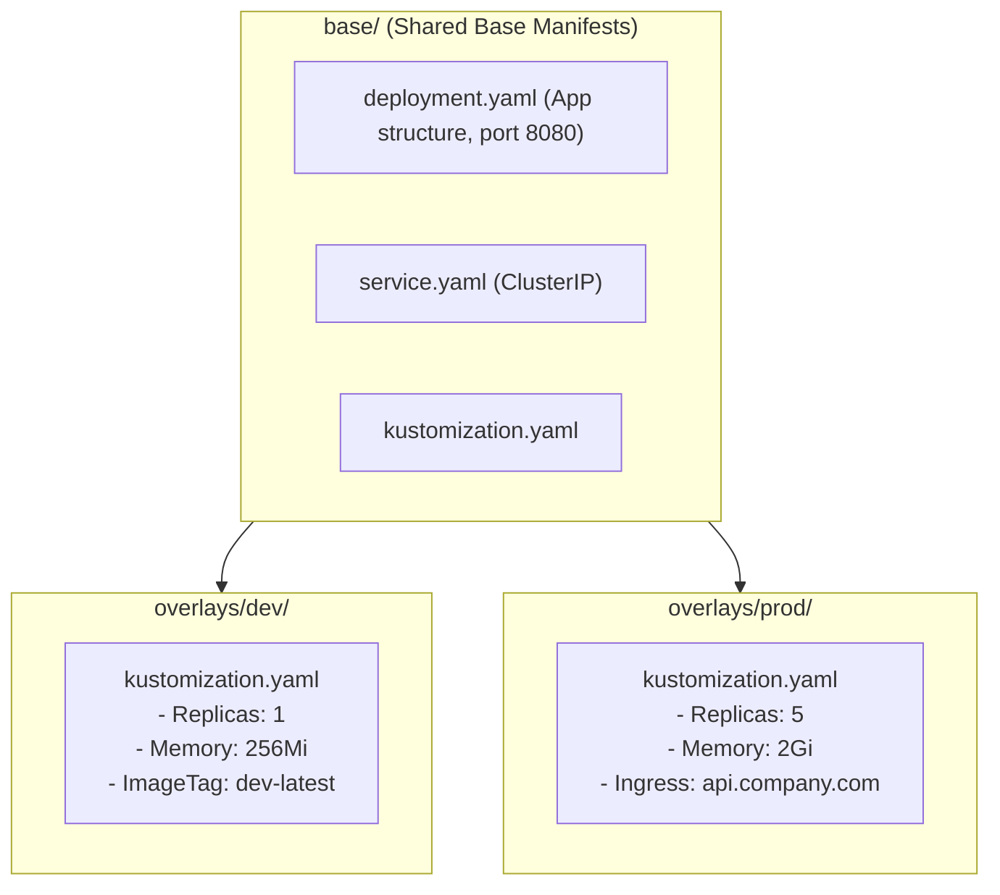

# Managing Multi-Environment Manifests with Kustomize & Helm

Kubernetes YAML တွေထဲက 500 lines လောက်ရှိတဲ့ ကုဒ်တွေကို `dev/`, `staging/`, နဲ့ `prod/` directories တွေဆီ Copy-paste လုပ်နေတာက configuration drift (ဖွဲ့စည်းပုံ ကွဲလွဲမှုကြီးတွေ) ဖြစ်ပေါ်စေပါတယ်။

ဒီ lesson မှာတော့ ArgoCD ထဲမှာ template မလိုတဲ့ configuration overrides တွေကို **Kustomize** သုံးပြီး ကျွမ်းကျင်အောင် လုပ်သွားမှာဖြစ်ပြီး၊ parameterized package management တွေကို **Helm** နဲ့ ဘယ်လိုကိုင်တွယ်ရမလဲဆိုတာကို သင်ယူသွားမှာ ဖြစ်ပါတယ်။



---

## 1. Kustomize in ArgoCD: Base & Overlays Pattern

Kustomize ကို `kubectl` နဲ့ ArgoCD တို့မှာ Native အားဖြင့် ထည့်သွင်းပေးထားပြီးသား ဖြစ်ပါတယ်။ ဒါဟာ **Base** (common configuration များ) နဲ့ **Overlays** (Environment အလိုက် သီးသန့် patches တွေ) ဆိုတဲ့ ပုံစံကို အသုံးပြုပါတယ်။

### The Directory Structure:
```
k8s-manifests/
├── base/
│   ├── deployment.yaml
│   ├── service.yaml
│   └── kustomization.yaml
│
└── overlays/
    ├── dev/
    │   ├── kustomization.yaml
    │   └── replica_count.yaml
    └── prod/
        ├── kustomization.yaml
        ├── ingress.yaml
        └── hpa.yaml
```

### `base/kustomization.yaml`:
```yaml
apiVersion: kustomize.config.k8s.io/v1beta1
kind: Kustomization

resources:
  - deployment.yaml
  - service.yaml
```

### `overlays/prod/kustomization.yaml`:
```yaml
apiVersion: kustomize.config.k8s.io/v1beta1
kind: Kustomization

# Inherit everything from base
resources:
  - ../../base
  - ingress.yaml
  - hpa.yaml

# Prefix all resources with 'prod-'
namePrefix: prod-

# Add production labels to all resources
commonLabels:
  environment: production
  tier: backend

# Update container image tag dynamically
images:
  - name: ghcr.io/my-org/api
    newTag: v1.4.2

# Patch specific fields (e.g. replicas = 5)
replicas:
  - name: web-api
    count: 5
```

---

## 2. Managing Helm Charts with ArgoCD

ArgoCD က computer ပေါ်မှာ `helm install` လုပ်စရာမလိုဘဲ Standard ဖြစ်တဲ့ Public ဒါမှမဟုတ် Private Helm Charts တွေကို တိုက်ရိုက် Pull လုပ်ယူနိုင်ပါတယ်။

```yaml
apiVersion: argoproj.io/v1alpha1
kind: Application
metadata:
  name: redis-cluster
  namespace: argocd
spec:
  project: default
  source:
    chart: redis
    repoURL: 'https://charts.bitnami.com/bitnami'
    targetRevision: 18.1.5
    helm:
      releaseName: prod-redis
      values: |
        architecture: replication
        auth:
          enabled: true
        master:
          persistence:
            size: 20Gi
        replica:
          replicaCount: 3
  destination:
    server: 'https://kubernetes.default.svc'
    namespace: database
```