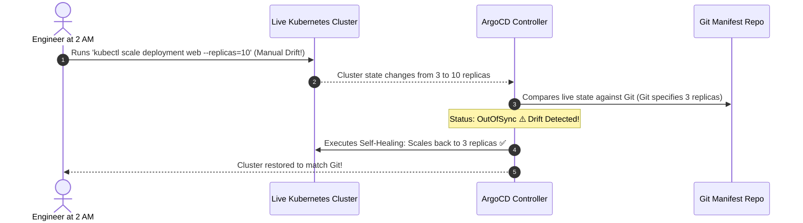

# Sync Policies: Auto-Sync, Pruning & Self-Healing

GitOps ရဲ့ အဓိက အစွမ်းထက်တဲ့ နေရာကတော့ **Continuous Reconciliation** ပဲ ဖြစ်ပါတယ်။ အကယ်၍ လူတစ်ယောက်ယောက်က live cluster ပေါ်မှာ ခွင့်ပြုချက်မရှိဘဲ manual အပြောင်းအလဲတစ်ခု လုပ်လိုက်မယ်ဆိုရင် ArgoCD က drift (ကွဲလွဲမှု) ကို အလိုအလျောက် ဖမ်းမိပြီး cluster ကို Git ထဲကအတိုင်း ပြန်ပြီး အနေအထားမှန်အောင် လုပ်ဆောင်ပေးပါတယ်။



---

## 1. The Core Sync Options ရှင်းလင်းချက်

`Application.spec.syncPolicy` ထဲမှာ ပါဝင်တာတွေကတော့:

```yaml
syncPolicy:
  automated:
    prune: true     # Git ထဲကနေ ဖယ်ရှားလိုက်တဲ့ K8s resources တွေကို အလိုအလျောက် ဖျက်ပေးတယ်
    selfHeal: true  # Cluster ထဲမှာ manual ပြောင်းလဲထားတာတွေကို overwrite လုပ်တယ်
```

### Pruning (`prune: true`) ဆိုတာ ဘာလဲ?
အကယ်၍ သင်ဟာ `redis-service.yaml` ကို Git repository ထဲကနေ ဖျက်ပြီး `main` branch ကို push လိုက်မယ်ဆိုရင်:
- `prune: false` ဖြစ်နေရင်: ArgoCD က ပုံမှန်ဟောင်းနေတဲ့ Redis service ကို Kubernetes ထဲမှာ orphan တစ်ခုအနေနဲ့ ဆက်ပြီး Run နေစေပါတယ်။
- `prune: true` ဖြစ်နေရင်တော့: ArgoCD က ဖိုင်ကို Git ထဲကနေ ဖယ်ရှားလိုက်တာကို သိရှိပြီး `kubectl delete service redis` ကို အလိုအလျောက် run ပေးပါတယ်။

### Self-Healing (`selfHeal: true`) ဆိုတာ ဘာလဲ?
အကယ်၍ Engineer တစ်ယောက်ယောက်က running ဖြစ်နေတဲ့ pod ဒါမှမဟုတ် service တစ်ခုကို တိုက်ရိုက် ပြင်ဆင်ဖို့ `kubectl edit` ဒါမှမဟုတ် `kubectl delete` ကို သုံးလိုက်မယ်ဆိုရင်:
- `selfHeal: false` ဖြစ်နေရင်: ArgoCD က application ကို `OutOfSync` လို့ အမှတ်အသားလုပ်ပါတယ် (UI မှာ ဝါကျင့်ကျင့် သတိပေးချက် ပြမယ်)၊ ဒါပေမဲ့ ဘာ action မှ မလုပ်ပါဘူး။
- `selfHeal: true` ဖြစ်နေရင်တော့: ArgoCD က အဲဒီအပြောင်းအလဲကို ချက်ချင်း ကျော်ဖြတ်ပြီး (overrides) စက္ကန့်ပိုင်းအတွင်းမှာပဲ cluster ကို Git ထဲမှာ သတ်မှတ်ထားတဲ့ YAML အတိအကျအတိုင်း ပြန်ပြီး ဖြစ်သွားစေပါတယ်!

---

## 2. Sync Waves: Deployment အစဉ်လိုက်ကို ထိန်းချုပ်ခြင်း

သင့်ရဲ့ application မှာ API pods အသစ်တွေ မစတင်ခင် **အရင်ဆုံး** database schema migration ပြီးစီးဖို့ လိုအပ်နေမယ်ဆိုရင် ဘယ်လိုလုပ်မလဲ?

ArgoCD ရဲ့ **Sync Waves** က annotations တွေကို သုံးပြီး resource တွေ ဖန်တီးတဲ့နေရာမှာ အစဉ်လိုက်အတိအကျကို ထိန်းချုပ်ပေးနိုင်ပါတယ်:


```yaml
# 1. Database Schema Migration Job
apiVersion: batch/v1
kind: Job
metadata:
  name: db-migration-v2
  annotations:
    argocd.argoproj.io/sync-wave: "1" # အရင်ဆုံး run မယ်!
spec:
  template:
    spec:
      containers:
        - name: migrate
          image: my-app:v2.0.0
          command: ["npm", "run", "db:migrate"]
      restartPolicy: Never
---
# 2. Main Web API Deployment
apiVersion: apps/v1
kind: Deployment
metadata:
  name: web-api
  annotations:
    argocd.argoproj.io/sync-wave: "2" # Wave 1 ပြီးမှသာ run မယ်!
spec:
  replicas: 3
  # ...
```

---

## 3. Sync Windows: ရုံးချိန်အတွင်း Production ကို ကာကွယ်ခြင်း

Traffic များတဲ့ ရုံးချိန်တွေ ဒါမှမဟုတ် maintenance လုပ်နေချိန်တွေမှာ အလိုအလျောက် deployments တွေ လုပ်ဆောင်တာကို တားဆီးဖို့ **Sync Windows** တွေကို configure လုပ်နိုင်ပါတယ်:

```yaml
apiVersion: argoproj.io/v1alpha1
kind: AppProject
metadata:
  name: production-project
  namespace: argocd
spec:
  syncWindows:
    # ရုံးရက်တွေမှာ မနက် 9 နာရီနဲ့ ညနေ 5 နာရီကြား အလိုအလျောက် sync လုပ်တာကို ပိတ်မယ်
    - kind: deny
      schedule: '0 9 * * 1-5'
      duration: 8h
      applications:
        - 'production-*'
      manualSync: true # Senior engineers တွေ အရေးပေါ် manual override လုပ်ခွင့်ပေးမယ်
```