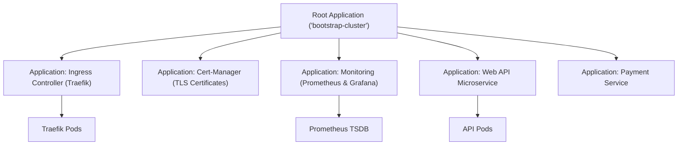

# The App-of-Apps Pattern & Multi-Cluster Deployments

Real production environment တစ်ခုမှာ Application တစ်ခုတည်း ရှိနေတာမျိုး မဟုတ်ပါဘူး။ Microservices တွေ၊ Ingress controller (Traefik/NGINX)၊ Cert-Manager၊ Prometheus၊ Grafana နဲ့ Vault တွေလိုမျိုး Application ၃၀ လောက်အထိ ရှိနေတတ်ပါတယ်။

Application ၄၀ လောက်ကို ArgoCD ထဲမှာ တစ်ခုချင်းစီ သီးသန့် manual လိုက်စီမံနေဖို့ဆိုတာ လုံးဝ အလုပ်မဖြစ်တော့ပါဘူး (unscalable ဖြစ်ပါတယ်)။

အဲ့ဒီပြဿနာအတွက် ဖြေရှင်းချက်ကတော့ **App-of-Apps Pattern** နဲ့ ခေတ်ပေါ် **`ApplicationSet` CRD** ပဲ ဖြစ်ပါတယ်။



---

## 1. App-of-Apps Pattern ကို တည်ဆောက်ခြင်း

App-of-Apps pattern မှာဆိုရင် **Root Application** တစ်ခုကို ဖန်တီးရပါတယ်။ သူ့ရဲ့ တစ်ခုတည်းသော တာဝန်ကတော့ အခြားသော `Application` manifests တွေ ပါဝင်တဲ့ directory တစ်ခုကို watch လုပ်နေဖို့ ဖြစ်ပါတယ်-

### Step 1: Root Bootstrap Manifest (`root-bootstrap.yaml`)
```yaml
apiVersion: argoproj.io/v1alpha1
kind: Application
metadata:
  name: root-bootstrap-app
  namespace: argocd
  finalizers:
    - resources-finalizer.argocd.argoproj.io
spec:
  project: default
  source:
    repoURL: 'https://github.com/my-org/k8s-gitops.git'
    targetRevision: main
    path: 'bootstrap' # Directory containing all child Application YAMLs!
  destination:
    server: 'https://kubernetes.default.svc'
    namespace: argocd
  syncPolicy:
    automated:
      prune: true
      selfHeal: true
```

### Step 2: Child Applications များ (`bootstrap/` Directory ထဲတွင်):
```
bootstrap/
├── 01-ingress-traefik.yaml
├── 02-cert-manager.yaml
├── 03-monitoring-stack.yaml
└── 04-production-api.yaml
```

အသစ်စက်စက် Kubernetes cluster တစ်ခုလုံးကို မူလအစကနေ အလုပ်လုပ်နိုင်တဲ့ အနေအထားအထိ bootstrap လုပ်ဖို့ဆိုရင် **command တစ်ခုတည်း** ကိုပဲ Run ရပါမယ်-
```bash
kubectl apply -f root-bootstrap.yaml
```
ArgoCD က root application ကို ဖတ်ပြီး child application အားလုံးကို ရှာဖွေကာ cluster architecture တစ်ခုလုံးကို အလိုအလျောက် provision လုပ်ပေးသွားပါလိမ့်မယ်။

---

## 2. ခေတ်ပေါ် `ApplicationSet` CRD

Multi-cluster နဲ့ multi-environment setups တွေအတွက်ဆိုရင် CNCF ရဲ့ **`ApplicationSet`** controller က template တစ်ခုတည်းကနေ `Application` CRD ရာပေါင်းများစွာကို အလိုအလျောက် generate လုပ်ပေးနိုင်ဖို့ **Generators** တွေကို အသုံးပြုပါတယ်။

### Multi-Cluster Matrix Generator:
Kubernetes clusters ၃ ခု (US-East၊ EU-Central၊ AP-Southeast) အနှံ့ သင့်ရဲ့ Application ကို အလိုအလျောက် Deploy လုပ်ပါ-

```yaml
apiVersion: argoproj.io/v1alpha1
kind: ApplicationSet
metadata:
  name: global-web-app
  namespace: argocd
spec:
  generators:
    - list:
        elements:
          - cluster: production-us-east
            url: https://10.0.1.50:6443
          - cluster: production-eu-central
            url: https://10.0.2.50:6443
          - cluster: production-ap-southeast
            url: https://10.0.3.50:6443
  template:
    metadata:
      name: '{{cluster}}-web-api'
    spec:
      project: default
      source:
        repoURL: 'https://github.com/my-org/k8s-manifests.git'
        targetRevision: main
        path: 'overlays/{{cluster}}'
      destination:
        server: '{{url}}'
        namespace: production
      syncPolicy:
        automated:
          prune: true
          selfHeal: true
```