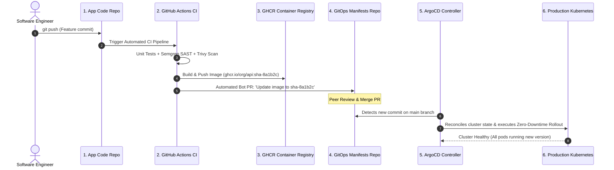
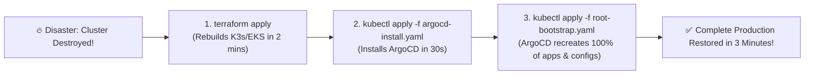

# Production GitOps Architecture & Disaster Recovery

အပိုင်းအားလုံးကို ပေါင်းစပ်ကြည့်ရအောင်- ဒီနောက်ဆုံး သင်ခန်းစာမှာတော့ enterprise-grade GitOps delivery Pipeline တစ်ခုကို တည်ဆောက်ပြီး **Cluster Disaster Recovery** drill တစ်ခုကို တိုက်ရိုက်လုပ်ဆောင်သွားမှာ ဖြစ်ပါတယ်။



---

## The Automated GitOps CI Pipeline Step

သင့်ရဲ့ Application Code Repo ထဲမှာ Docker image အသစ်တစ်ခု Build တဲ့အခါ GitOps Manifests repository ထဲက image tag ကို အလိုအလျောက် Update လုပ်ပေးတဲ့ GitHub Actions step က ဒီလိုဖြစ်ပါတယ်-

```yaml
# Inside .github/workflows/ci.yml in your Application Code Repo:

- name: Update Image Tag in GitOps Repository
  uses: peter-evans/create-pull-request@v6
  with:
    token: ${{ secrets.GITOPS_REPO_PAT }}
    repository: my-org/k8s-manifests
    branch: update-api-${{ github.sha }}
    title: "chore(release): update web-api image to ${{ github.sha }}"
    body: |
      Automated GitOps release triggered by commit: ${{ github.sha }}
      Author: @${{ github.actor }}
    commit-message: "deploy(api): update image to ${{ github.sha }}"
```

---

## Disaster Recovery Drill: Rebuilding a Dead Cluster in Under 3 Minutes

သင့်ရဲ့ cloud provider မှာ ကြီးမားတဲ့ ပျက်စီးမှုတွေဖြစ်ပေါ်ပြီး မူလ Kubernetes cluster တစ်ခုလုံး လုံးဝပျက်စီးသွားတယ်လို့ တွေးကြည့်ပါ။

ရိုးရာ ClickOps ပုံစံမျိုးဆိုရင် Infrastructure ကို ပြန်ဆောက်ဖို့ လက်နဲ့လိုက်ပြင်ရတာနဲ့ ရက်ပေါင်းများစွာ ကြာသွားနိုင်ပါတယ်။ **GitOps နဲ့ Infrastructure as Code ကို အသုံးပြုမယ်ဆိုရင်တော့ Recovery လုပ်ဖို့အတွက် Command ၃ ခုတည်းနဲ့ ပြီးပါတယ်**:



### Execution Steps:
1. **Rebuild Infrastructure with Terraform**:
   ```bash
   cd terraform/environments/prod
   terraform apply -auto-approve
   ```
2. **Install ArgoCD**:
   ```bash
   kubectl create namespace argocd
   kubectl apply -n argocd -f https://raw.githubusercontent.com/argoproj/argo-cd/stable/manifests/install.yaml
   ```
3. **Apply the Root Bootstrap Application**:
   ```bash
   kubectl apply -f root-bootstrap.yaml
   ```

ArgoCD က သင့်ရဲ့ Git repository နဲ့ ချိတ်ဆက်ပြီး Kustomize overlays အားလုံးကို render လုပ်ပေးပါမယ်၊ Sealed Secrets တွေကနေ Secrets တွေကို ပြန်ပေါ်လာစေမယ်၊ Ingress routes တွေကို mount လုပ်ပေးပြီး လူကိုယ်တိုင် စဉ်းစားခန်းဖွင့်စရာမလိုဘဲ Traffic တွေကို ပုံမှန်အတိုင်း ပြန်လည်လည်ပတ်စေမှာ ဖြစ်ပါတယ်။