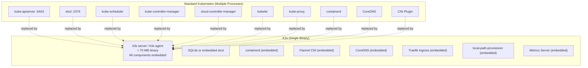
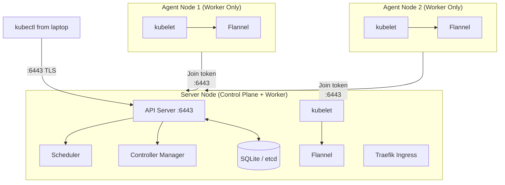

# Standard Kubernetes ၏ ပြဿနာများ

Full Kubernetes (များသောအားဖြင့် "upstream" သို့မဟုတ် "vanilla" Kubernetes ဟု ခေါ်ဆိုကြသည်) ကို node ဒါဇင်ပေါင်းများစွာတွင် microservice ရာပေါင်းများစွာကို Run နေသော cloud-native အဖွဲ့အစည်းကြီးများအတွက် ဒီဇိုင်းထုတ်ထားခြင်း ဖြစ်သည်။ ၎င်း၏ architecture သည် ထို scale ပေါ်တွင် အခြေခံထားသည် -

- **etcd** — high availability အတွက် node ၃ ခု သို့မဟုတ် ၅ ခု လိုအပ်သော distributed key-value store တစ်ခု
- **kube-apiserver** — cluster တစ်ခုလုံးအတွက် REST API gateway
- **kube-scheduler** — pod တစ်ခုချင်းစီကို ဘယ် node မှာ Run ရမလဲဆိုတာ ဆုံးဖြတ်ပေးသည်
- **kube-controller-manager** — reconciliation loops ပေါင်း ၃၀ ကျော်ကို Run ပေးသည် (deployments, services, endpoints...)
- **cloud-controller-manager** — AWS/GCP/Azure load balancers နှင့် volumes များနှင့် ချိတ်ဆက်ပေးသည်
- **kubelet** — container များကို တကယ်တမ်း Run ပေးသော per-node agent
- **kube-proxy** — Service networking အတွက် iptables rules များကို စီမံခန့်ခွဲပေးသည်
- **Container runtime** — containerd သို့မဟုတ် CRI-O

ဤအရာအားလုံးသည် သီးခြားစီဖြစ်သော processes များဖြစ်ကြပြီး သီးခြားစီ config လုပ်ရကာ၊ သီးခြားစီ monitor လုပ်ရသည်။ Airbnb ကဲ့သို့ ကုမ္ပဏီကြီးတစ်ခု၏ production-grade Kubernetes cluster တစ်ခုတွင် ၎င်းကို ကျန်းမာစွာ ရပ်တည်နိုင်စေရန်အတွက် သီးသန့် platform engineering အဖွဲ့တစ်ခုပင် လိုအပ်ပါသည်။

တစ်ဦးချင်း developer များ၊ startup ငယ်များ၊ edge deployments များ၊ သို့မဟုတ် VPS တစ်ခုတည်းပေါ်ရှိ production workloads များအတွက်ဆိုလျှင် ဤ overhead က အလွန်တရာ ကြီးမားလွန်းနေပါသည်။

**K3s သည် cluster တစ်ခုလုံးကို single binary တစ်ခုတည်းအတွင်းသို့ ပေါင်းထည့်ပေးခြင်းဖြင့် ဤပြဿနာကို ဖြေရှင်းပေးလိုက်ပါသည်။**

---

## K3s ဆိုတာ အတိအကျ ဘာလဲ။

K3s ဆိုသည်မှာ Rancher Labs (၂၀၀၀ ခုနှစ်တွင် SUSE မှ ဝယ်ယူခဲ့သည်) မှ ဖန်တီးထားသော **CNCF-certified အပြည့်အဝရရှိထားသော Kubernetes distribution** တစ်ခု ဖြစ်သည်။ K3s နာမည်ပါ "၃" ဆိုသည်မှာ ဟာသသဘောမျိုး ဖြစ်သည် - "K8s ၏ ထက်ဝက်" — စာလုံး ၈ လုံးမှ ၅ လုံး နှုတ်လိုက်လျှင် = ၃ ဟူ၍ ဖြစ်သည်။ ထိုသို့ ဟာသဆန်သော်လည်း K3s သည် Kubernetes conformance test suite အပြည့်အစုံကို အောင်မြင်ထားသည်။



---

## Standard Kubernetes မှ K3s က ဘာတွေကို ဖယ်ရှားလိုက်သလဲ

| Standard K8s Component | K3s Approach | ဘာကြောင့်လဲ |
|------------------------|-------------|-------------|
| **etcd** | SQLite (single node) သို့မဟုတ် embedded etcd (HA) | SQLite က ops လုံးဝ မလိုပါ။ Embedded etcd ကိုမူ HA multi-node အတွက် သုံးသည်။ |
| **Cloud provider integrations** | ဖယ်ရှားထားသည် (Helm မှတစ်ဆင့် optional ထည့်နိုင်သည်) | binary ကို ကြီးထွားစေမည့် AWS/GCP သီးသန့် code များ မပါဝင်တော့ပါ။ |
| **Alpha/deprecated API groups** | ဖယ်ရှားထားသည် | binary سِsize ကို သေးစေပြီး security attack surface ကို လျော့ကျစေသည်။ |
| **Docker (dockershim)** | containerd သာ | Docker ကို K8s 1.24 ဗားရှင်းမှစ၍ ဖယ်ရှားပြီးသား ဖြစ်သည်။ |
| **In-tree volume plugins** | ဖယ်ရှားထားသည် (CSI drivers များကို သုံးပါ) | VPS/bare-metal များအတွက် cloud သီးသန့် volume drivers များကို မလိုအပ်ပါ။ |

ရလဒ်အနေဖြင့်: upstream components တစ်ခုချင်းစီကို ပေါင်းထားလျှင် MB ရာပေါင်းများစွာ ရှိမည့်အစား **~70 MB** သာ ရှိသော `k3s` binary တစ်ခုကို ရရှိစေပါသည်။

---

## K3s က ဘာတွေကို အလကား (Out of the Box) ထည့်ပေးထားလဲ

ဤအချက်က K3s ကို small deployments များအတွက် bare Kubernetes ထက် ပိုမိုကောင်းမွန်စေသည် — ၎င်းတွင် *batteries included* (လိုအပ်သည်များ အစုံအလင်) ပါရှိလာသည် -

| Built-in Component | Version | ဘာလုပ်ပေးလဲ |
|-------------------|---------|--------------|
| **Traefik** | v2.x | Ingress Controller — HTTP/HTTPS traffic များကို services များဆီသို့ route လုပ်ပေးသည် |
| **CoreDNS** | 1.x | Cluster DNS — `service.namespace.svc.cluster.local` ကို resolve လုပ်ပေးသည် |
| **Flannel** | latest | CNI — node များကြားတွင် Pod-to-Pod networking ကို ပံ့ပိုးပေးသည် |
| **local-path-provisioner** | latest | PVC storage — PVC များအတွက် hostPath volumes များကို အလိုအလျောက် ဖန်တီးပေးသည် |
| **Metrics Server** | latest | `kubectl top pods` နှင့် HPA scaling ကို အသုံးပြုနိုင်စေသည် |
| **Helm Controller** | latest | Kubernetes CRDs မှတစ်ဆင့် Helm charts များကို deploy လုပ်နိုင်စေသည် |

ဤအချက်များထဲမှ မည်သည့်အရာမှ standard Kubernetes တွင် ပါမလာပါ။ တစ်ခုချင်းစီကို သီးခြား install လုပ်ကာ config လုပ်ရသည်။

---

## K3s Architecture: Server vs Agent



**Single-node setup** (အသုံးအများဆုံး): `k3s server` ကို Run ပါ။ ထို node တစ်ခုတည်းကပင် control plane ရော worker အဖြစ်ပါ လုပ်ဆောင်ပေးပါမည်။ VPS တစ်ခုတည်းအတွက် အကောင်းဆုံး ဖြစ်သည်။

**Multi-node setup**: node တစ်ခုတွင် `k3s server` ကို Run ပြီး worker node များတွင် `k3s agent` ကို Run ပါ။ Worker များသည် join token ကိုသုံး၍ server နှင့် ဝင်ရောက်ချိတ်ဆက် (register) ကြသည်။

---

## K3s နှင့် အခြား Lightweight Kubernetes ရွေးချယ်စရာများ

| Tool | အသုံးပြုမည့်နေရာ | Production-Ready ဖြစ်ပါသလား? | Real Server ပေါ်မှာ Run လို့ရပါသလား? |
|------|----------|------------------|---------------------|
| **minikube** | Local learning, desktop dev | ❌ မဟုတ်ပါ | ❌ မဟုတ်ပါ (VM-based) |
| **kind** (K8s in Docker) | CI/CD testing environments | ❌ မဟုတ်ပါ (ephemeral) | ❌ မဟုတ်ပါ |
| **k3d** | K3s in Docker, local dev | ❌ မဟုတ်ပါ (ephemeral) | ❌ မဟုတ်ပါ |
| **MicroK8s** | Ubuntu-specific snap package | ⚠️ အကန့်အသတ်ရှိသည် | ✅ ရသည် |
| **K3s** | VPS, edge, bare-metal, Raspberry Pi | ✅ **ဟုတ်ကဲ့ (Yes)** | ✅ **ဟုတ်ကဲ့ (Yes)** |
| **RKE2** | Air-gapped, FIPS-compliant enterprise | ✅ ဟုတ်ကဲ့ | ✅ ဟုတ်ကဲ့ |

ဤစာရင်းထဲတွင် K3s သည် အောက်ပါအချက်များနှင့် ပြည့်စုံသော တစ်ခုတည်းသော ရွေးချယ်မှု ဖြစ်သည် -
- Production-ready အစစ်အမှန်ဖြစ်ခြင်း (Netflix, AWS နှင့် ကုမ္ပဏီထောင်ပေါင်းများစွာ အသုံးပြုနေကြသည်)
- Raspberry Pi မှစ၍ 64-core server အထိ မည်သည့် Linux machine ပေါ်တွင်မဆို Run နိုင်ခြင်း
- CNCF Kubernetes conformance test suite အပြည့်အစုံကို အောင်မြင်ထားခြင်း

---

## လက်တွေ့ကမ္ဘာတွင် K3s ကို အသုံးပြုကြပုံများ

### 1. Single-VPS Production Deployment
Startup တစ်ခုသည် ၎င်းတို့၏ application တစ်ခုလုံးကို (API, database, ingress, monitoring) တစ်လလျှင် €10 ကျသင့်သော Hetzner VPS တစ်ခုတည်းပေါ်တွင် Run ထားခြင်း။ K3s က orchestration, rolling updates နှင့် self-healing အားလုံးကို တာဝန်ယူလုပ်ဆောင်ပေးသည်။

### 2. Edge Computing / IoT
K3s သည် edge deployments များအတွက် အဓိကရွေးချယ်စရာ Kubernetes distribution ဖြစ်သည်။ Chick-fil-A ကုမ္ပဏီသည် ၎င်းတို့၏ restaurant တစ်ခုချင်းစီတွင် real-time မှာယူမှုများနှင့် inventory စီမံခန့်ခွဲမှုများအတွက် standard hardware များပေါ်တွင် K3s ကို Run ထားကြသည်။

### 3. Development Environments
အဖွဲ့အစည်းများသည် feature branches များအတွက် ephemeral environments များကို အမြန်ဆောက်လုပ်ရန် K3s ကို အသုံးပြုကြသည်။ PR တစ်ခုချင်းစီသည် Terraform မှတစ်ဆင့် ၎င်း၏ကိုယ်ပိုင် K3s cluster ကို ရရှိကြပြီး integration testing အတွက် သုံးကာ merge ပြီးသည်နှင့် ပြန်ဖျက်ပစ်ကြသည်။

### 4. Raspberry Pi Home Lab
K3s သည် ARM64 ပေါ်တွင် Run နိုင်သောကြောင့် Raspberry Pi cluster တစ်ခုအတွက် အလွန်သင့်လျော်သည်။ Quad-Pi cluster တစ်ခုတွင် K3s ကိုသုံးခြင်းဖြင့် အိမ်မှာတင် ~$200 ခန့်ဖြင့် real multi-one Kubernetes environment ကို ဖန်တီးနိုင်မည်ဖြစ်သည်။

### 5. CI/CD Runners
GitHub Actions, GitLab CI နှင့် Jenkins တို့သည် K3s အတွင်းတွင် Run နိုင်ကြသည်။ build jobs များ စုပုံလာသည်နှင့်အမျှ cluster သည် pod အသစ်များကို အလိုအလျောက် ပုံဖော်ပေးကာ scale လုပ်ပေးသည်။

---

## K3s လိုအပ်မည့် Hardware ပမာဏ (Resource Requirements)

| Configuration | RAM | CPU | Disk |
|---------------|-----|-----|------|
| Minimal (server only, workloads မပါ) | 512 MB | 1 core | 4 GB |
| Single-node production | 2 GB | 2 cores | 20 GB |
| Small team production | 4 GB | 2-4 cores | 40 GB |
| Medium production | 8 GB | 4-8 cores | 80 GB |

ဤအချက်ကို Amazon ၏ managed Kubernetes ဖြစ်သော EKS နှင့် နှိုင်းယှဉ်ကြည့်ပါ: control plane တစ်ခုတည်းအတွက်ပင် EC2 worker nodes များအတွက် မပေးရသေးမီ တစ်လလျှင် ~$72 ခန့် ကျသင့်နေပါပြီ။

---

## K3s နှင့် Kubernetes API လိုက်ဖက်ညီမှု (Compatibility)

သင်လေ့လာခဲ့ပြီးသမျှ Kubernetes resource တိုင်းသည် K3s တွင်လည်း အတူတူပင် အလုပ်လုပ်သည် -

```bash
# ဤအရာများသည် EKS, GKE သို့မဟုတ် AKS ကဲ့သို့ပင် K3s တွင်လည်း အတူတူပင် အလုပ်လုပ်သည်:
kubectl apply -f deployment.yaml
kubectl apply -f service.yaml
kubectl apply -f ingress.yaml
kubectl get pods -n production
kubectl logs -f pod-name
kubectl exec -it pod-name -- /bin/sh
kubectl rollout status deployment/myapp
kubectl rollout undo deployment/myapp
```

AWS EKS အတွက် ဒီဇိုင်းထုတ်ထားသော Helm chart တစ်ခုကို မည်သည့်ပြောင်းလဲမှုမှ မလုပ်ဘဲ K3s ပေါ်သို့ deploy လုပ်နိုင်ပါသည်။ ကွာခြားချက်များမှာ -
- **StorageClass**: K3s သည် AWS EBS သို့မဟုတ် GCP PD အစား `local-path` ကို အသုံးပြုသည်
- **LoadBalancer Services**: K3s သည် cloud load balancer အစား host node ၏ IP ကို အသုံးပြုသည်
- **Ingress**: K3s သည် ALB သို့မဟုတ် NGINX အစား Traefik ကို အသုံးပြုသည် (နှစ်ခုစလုံးသည် တူညီသော Ingress spec ကို ပံ့ပိုးသည်)

---

## K3s Ecosystem

K3s သည် သေဆုံးသွားမည့် လေ့လာရေး tool တစ်ခုမဟုတ်ပါ — ၎င်းကို production-grade ecosystem တစ်ခုက ဝန်းရံထားသည် -

| Tool | ရည်ရွယ်ချက် |
|------|---------|
| **Rancher** | Multi-cluster management UI — dashboard တစ်ခုတည်းမှနေ၍ K3s cluster ဒါဇင်ပေါင်းများစွာကို စီမံခန့်ခွဲရန် |
| **Fleet** | GitOps at scale — K3s cluster ထောင်ပေါင်းများစွာပေါ်တွင် apps များကို deploy လုပ်ရန် |
| **Longhorn** | K3s အတွက် distributed block storage — `local-path` ကို HA storage ဖြင့် အစားထိုးရန် |
| **k3sup** | SSH မှတစ်ဆင့် K3s ကို remote ဖြင့် install လုပ်ရန် CLI tool |
| **k3d** | Local development အတွက် Docker containers အတွင်း K3s ကို Run ရန် |
| **Terraform K3s provider** | Infrastructure as Code မှတစ်ဆင့် K3s clusters များကို provision လုပ်ရန် |

---

## CNCF Certification: ဆိုလိုရင်းက ဘာလဲ

K3s သည် [CNCF Kubernetes Conformance Test Suite](https://github.com/cncf/k8s-conformance) ကို အောင်မြင်ထားသည်။ ဆိုလိုသည်မှာ -

- standard Kubernetes API objects အားလုံးသည် စာရွက်စာတမ်းများတွင် ပါသည့်အတိုင်း အလုပ်လုပ်သည်
- သင်၏ ကျွမ်းကျင်မှုများနှင့် manifests များသည် K3s နှင့် အခြားသော certified distribution များကြားတွင် လွတ်လပ်စွာ ပြောင်းရွှေ့အသုံးပြုနိုင်သည် (portable ဖြစ်သည်)
- အလုပ်ရှင်များနှင့် အသိအမှတ်ပြုလက်မှတ်များ (CKA, CKAD, CKS) တို့သည် K3s ကို တရားဝင် Kubernetes အတွေ့အကြုံအဖြစ် အသိအမှတ်ပြုကြသည်

CNCF certification ဆိုသည်မှာ marketing ကြော်ငြာသက်သက် မဟုတ်ပါ — cluster ပေါ်တွင် အလိုအလျောက် စမ်းသပ်ချက်ပေါင်း 1,200+ ကျော်ကို ဖြတ်ကျော်အောင်မြင်ရန် လိုအပ်ပါသည်။

---

## အနှစ်ချုပ်

K3s ဆိုသည်မှာ အောက်ပါအချက်များနှင့် ပြည့်စုံသော အပြည့်အဝ certified ဖြစ်ပြီး single-binary ဖြစ်သော Kubernetes distribution တစ်ခု ဖြစ်သည် -
- **Kubernetes cluster တစ်ခုလုံး** (control plane + worker) ကို **single < 70 MB binary** တစ်ခုထဲသို့ ပေါင်းထည့်ထားခြင်း
- လိုအပ်သည်များ အစုံအလင် (**batteries included**) ပါရှိခြင်း: Traefik, Flannel, CoreDNS, local-path-provisioner, Metrics Server
- Startup များမှသည် enterprise ကုမ္ပဏီများအထိ လက်တွေ့ကမ္ဘာ deployments များတွင် **production-ready** အဖြစ် အသုံးပြုနေခြင်း
- VPS, bare metal, Raspberry Pi, edge devices အစရှိသည့် **မည်သည့် Linux machine ပေါ်တွင်မဆို** Run နိုင်ခြင်း
- upstream Kubernetes နှင့် **100% API compatibility** ရှိခြင်း — manifest တိုင်း၊ kubectl command တိုင်း၊ Helm chart တိုင်းသည် အတူတူပင် အလုပ်လုပ်ခြင်း
- managed Kubernetes အတွက် တစ်လလျှင် $72+ ကုန်ကျမည့်အစား production cluster တစ်ခုအတွက် **€6/month** (Hetzner CX22) ခန့်သာ ကျသင့်ခြင်း

နောက်လာမည့် သင်ခန်းစာတွင် Linux server တစ်ခုပေါ်တွင် K3s ကို စက္ကန့် ၆၀ အတွင်း install လုပ်မည်ဖြစ်ပြီး သင့်လက်ပ်တော့ပ်မှနေ၍ remote `kubectl` access ကို config လုပ်သွားမည် ဖြစ်သည်။