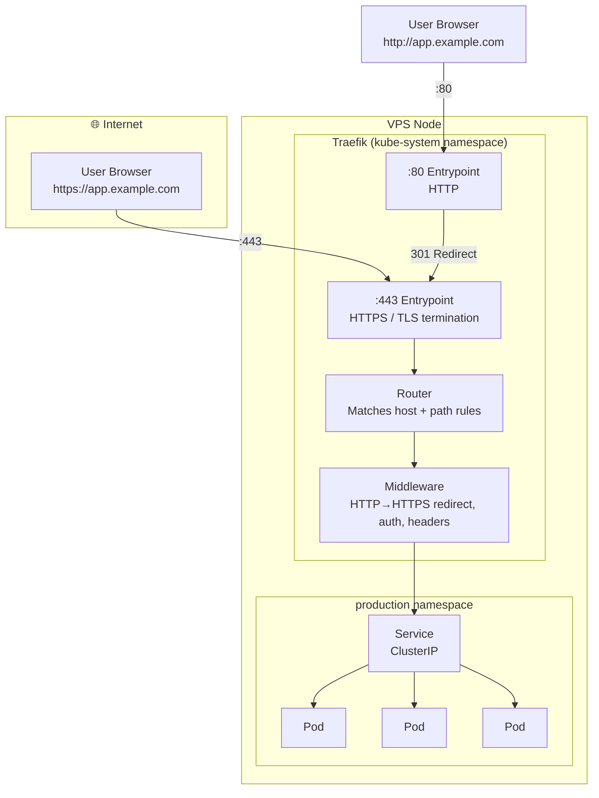

# Traffic တွေ Pods ဆီကို ဘwie ရောက်လာလဲ (How Traffic Reaches Your Pods)

Ingress Controller မပါဘဲနဲ့ Kubernetes ထဲက Service တွေဟာ cluster ထဲမှာပဲ ချိတ်လို့ရပါတယ်။ Application တစ်ခုကို internet ပေါ် ဖွင့်ပြချင် (expose လုပ်ချင်) ရင် နည်းလမ်း ၃ ခု ရှိပါတယ် -

| Service Type | အလုပ်လုပ်ပုံ (How It Works) | ဘယ်အချိန် သုံးမလဲ (When to Use) |
|-------------|-------------|-------------|
| `ClusterIP` | Internal IP ပဲ ဖြစ်ပြီး၊ အပြင်ကနေ လှမ်းချိတ်လို့ မရပါ | Pod နဲ့ Pod အချင်းချင်း ချိတ်ဆက်ဖို့ |
| `NodePort` | host ပေါ်မှာ random port တစ်ခု (30000-32767) ဖွင့်ပေးပါတယ် | အမြန် test လုပ်ဖို့အတွက်သာ၊ production မှာ လုံးဝ မသုံးရပါ |
| `LoadBalancer` | cloud provider ဆီကနေ external IP တစ်ခု တောင်းပေးပါတယ် | Cloud environments တွေမှာ (AWS, GCP) |
| **Ingress** | hostname ဒါမှမဟုတ် path rules တွေသုံးပြီး HTTP/HTTPS ကို route လုပ်ပေးတယ် | **Production — traffic အားလုံးအတွက်** |

**Ingress Controller** ဆိုတာကတော့ `Ingress` resources တွေကို စောင့်ကြည့်နေပြီး အဲ့ဒီအပေါ်မူတည်ပြီး traffic တွေ မှန်ကန်တဲ့နေရာကို ရောက်အောင် route လုပ်ဖို့ သူ့ကိုယ်သူ configure လုပ်ပေးတဲ့ ကောင် ဖြစ်ပါတယ်။ K3s မှာတော့ **Traefik v2** ကို built-in Ingress Controller အနေနဲ့ ထည့်ပေးထားပြီးသားဖြစ်ပြီး၊ install လုပ်ပြီးတာနဲ့ အသင့်သုံးလို့ရပါတယ်။

---

## K3s ထဲမှာ Traefik ဘယ်လို အလုပ်လုပ်လဲ (How Traefik Works in K3s)



Traefik က **reverse proxy** တစ်ခုအနေနဲ့ အလုပ်လုပ်ပါတယ် - သူက port 80 နဲ့ 443 ကနေ ဝင်လာတဲ့ connection အားလုံးကို လက်ခံတယ်၊ `Host` header ကို ဖတ်တယ်၊ သင့်ရဲ့ `Ingress` rules တွေနဲ့ တိုက်ဆိုင်စစ်ဆေးပြီး သင့်တော်တဲ့ `Service` ဆီကို request ကို ပို့ပေးပါတယ်။

---

## Traefik အလုပ်လုပ်နေကြောင်း စစ်ဆေးရန် (Verify Traefik Is Running)

```bash
# Check Traefik pods
kubectl get pods -n kube-system -l app.kubernetes.io/name=traefik
# NAME                       READY   STATUS    RESTARTS   AGE
# traefik-xxx-yyy            1/1     Running   0          10m

# Check Traefik's service (this is how it gets its external IP/port)
kubectl get svc -n kube-system traefik
# NAME      TYPE           CLUSTER-IP    EXTERNAL-IP    PORT(S)
# traefik   LoadBalancer   10.43.45.67   YOUR_VPS_IP    80:31234/TCP,443:31567/TCP

# The EXTERNAL-IP is your VPS public IP — all HTTP/HTTPS traffic comes through here

# View Traefik's configuration
kubectl describe deployment traefik -n kube-system

# Check Traefik logs for routing events
kubectl logs -n kube-system -l app.kubernetes.io/name=traefik --tail=50
```

---

## သင့်ရဲ့ ပထမဆုံး Ingress Resource (Your First Ingress Resource)

Simple ဖြစ်တဲ့ app တစ်ခုကို deploy လုပ်ပြီး Traefik ကနေတစ်ဆင့် expose လုပ်ကြည့်ရအောင် -

```yaml
# demo-app.yaml
---
# The application
apiVersion: apps/v1
kind: Deployment
metadata:
  name: whoami
  namespace: default
spec:
  replicas: 2
  selector:
    matchLabels:
      app: whoami
  template:
    metadata:
      labels:
        app: whoami
    spec:
      containers:
        - name: whoami
          image: traefik/whoami:latest    # Responds with request info
          ports:
            - containerPort: 80
---
# The ClusterIP Service
apiVersion: v1
kind: Service
metadata:
  name: whoami
  namespace: default
spec:
  selector:
    app: whoami
  ports:
    - port: 80
      targetPort: 80
---
# The Ingress
apiVersion: networking.k8s.io/v1
kind: Ingress
metadata:
  name: whoami-ingress
  namespace: default
  annotations:
    # Optional: specify entry points explicitly
    traefik.ingress.kubernetes.io/router.entrypoints: web,websecure
spec:
  ingressClassName: traefik   # Use the Traefik IngressClass
  rules:
    - host: whoami.example.com   # ← Replace with your domain
      http:
        paths:
          - path: /
            pathType: Prefix
            backend:
              service:
                name: whoami
                port:
                  number: 80
```

```bash
kubectl apply -f demo-app.yaml

# Verify the Ingress was created
kubectl get ingress whoami-ingress
# NAME             CLASS     HOSTS                ADDRESS        PORTS
# whoami-ingress   traefik   whoami.example.com   YOUR_VPS_IP   80

# Test (point your domain A record to the VPS IP first)
curl http://whoami.example.com
# Hostname: whoami-xxx-yyy
# IP: 10.42.0.5
# Host: whoami.example.com
```

---

## Traefik Middleware: စွမ်းဆောင်ရည်မြင့် Features တွေ (Traefik Middleware: The Power Feature)

Middleware တွေက requests နဲ့ responses တွေကို ပြုပြင်ပြောင်းလဲပေးပါတယ်။ Ingress routes တွေမှာ middleware တွေကို annotations ကနေတစ်ဆင့် ထည့်သွင်းနိုင်ပါတယ်။

### Middleware 1: HTTP → HTTPS Redirect

```yaml
# redirect-middleware.yaml
apiVersion: traefik.io/v1alpha1
kind: Middleware
metadata:
  name: redirect-to-https
  namespace: default
spec:
  redirectScheme:
    scheme: https
    permanent: true   # HTTP 301 (cached by browsers forever)

---
# Apply middleware to Ingress via annotation
apiVersion: networking.k8s.io/v1
kind: Ingress
metadata:
  name: whoami-ingress
  namespace: default
  annotations:
    # Format: NAMESPACE-MIDDLEWARENAME@kubernetescrd
    traefik.ingress.kubernetes.io/router.middlewares: default-redirect-to-https@kubernetescrd
spec:
  ingressClassName: traefik
  tls:
    - hosts:
        - whoami.example.com
      secretName: whoami-tls   # Created by cert-manager (Lesson 5)
  rules:
    - host: whoami.example.com
      http:
        paths:
          - path: /
            pathType: Prefix
            backend:
              service:
                name: whoami
                port:
                  number: 80
```

### Middleware 2: Basic Authentication

```bash
# Generate htpasswd credentials (username: admin, password: secret)
sudo apt-get install -y apache2-utils
htpasswd -nb admin secret
# admin:$apr1$abc123$xyz...

# Store as a Kubernetes Secret
kubectl create secret generic basic-auth \
  --from-literal=users='admin:$apr1$abc123$xyz...' \
  --namespace default
```

```yaml
# auth-middleware.yaml
apiVersion: traefik.io/v1alpha1
kind: Middleware
metadata:
  name: basic-auth
  namespace: default
spec:
  basicAuth:
    secret: basic-auth   # References the Secret above
```

### Middleware 3: Rate Limiting

App ကို အလွန်အကျွံ သုံးတာတွေ (abuse) ကနေ ကာကွယ်ပါ - IP တစ်ခုချင်းစီကို တစ်စက္ကန့်မှာ requests ၁၀၁ ခုပဲ လက်ခံမယ်လို့ ကန့်သတ်ရန်:

```yaml
# ratelimit-middleware.yaml
apiVersion: traefik.io/v1alpha1
kind: Middleware
metadata:
  name: rate-limit
  namespace: default
spec:
  rateLimit:
    average: 100    # Average requests per second
    burst: 50       # Allow short bursts up to 50 req/s above average
```

### Middleware 4: Security Headers

```yaml
# security-headers-middleware.yaml
apiVersion: traefik.io/v1alpha1
kind: Middleware
metadata:
  name: security-headers
  namespace: default
spec:
  headers:
    frameDeny: true                     # X-Frame-Options: DENY
    contentTypeNosniff: true            # X-Content-Type-Options: nosniff
    browserXssFilter: true              # X-XSS-Protection: 1; mode=block
    stsSeconds: 31536000                # Strict-Transport-Security: 1 year
    stsIncludeSubdomains: true
    stsPreload: true
    referrerPolicy: "strict-origin-when-cross-origin"
    customResponseHeaders:
      X-Powered-By: ""                  # Remove the X-Powered-By header (privacy)
      Server: ""                        # Remove the Server header (security)
```

### Middleware များစွာကို တစ်ပြိုင်နက် သုံးခြင်း (Applying Multiple Middlewares at Once)

```yaml
# Apply comma-separated list in annotation
annotations:
  traefik.ingress.kubernetes.io/router.middlewares: >-
    default-redirect-to-https@kubernetescrd,
    default-rate-limit@kubernetescrd,
    default-security-headers@kubernetescrd
```

---

## Path အလိုက် Routing လုပ်ခြင်း (Path-Based Routing)

Paths တွေအလိုက် Service အမျိုးမျိုးဆီကို route လုပ်ရန်:

```yaml
# path-routing-ingress.yaml
apiVersion: networking.k8s.io/v1
kind: Ingress
metadata:
  name: api-gateway
  namespace: production
spec:
  ingressClassName: traefik
  rules:
    - host: app.example.com
      http:
        paths:
          # Route /api/* to the API service
          - path: /api
            pathType: Prefix
            backend:
              service:
                name: api-service
                port:
                  number: 3000
          # Route /admin/* to the admin service
          - path: /admin
            pathType: Prefix
            backend:
              service:
                name: admin-service
                port:
                  number: 4000
          # Everything else → frontend
          - path: /
            pathType: Prefix
            backend:
              service:
                name: frontend-service
                port:
                  number: 80
```

---

## Domain အလိုက် Routing လုပ်ခြင်း (Host-Based Routing / Virtual Hosting)

Cluster တစ်ခုတည်းမှာပဲ Domain အမျိုးမျိုးကို Service အမျိုးမျိုးဆီ route လုပ်ရန်:

```yaml
# multi-domain-ingress.yaml
apiVersion: networking.k8s.io/v1
kind: Ingress
metadata:
  name: multi-domain
  namespace: production
spec:
  ingressClassName: traefik
  tls:
    - hosts: [app.example.com]
      secretName: app-tls
    - hosts: [api.example.com]
      secretName: api-tls
    - hosts: [admin.example.com]
      secretName: admin-tls
  rules:
    - host: app.example.com
      http:
        paths:
          - path: /
            pathType: Prefix
            backend:
              service:
                name: frontend-service
                port:
                  number: 80
    - host: api.example.com
      http:
        paths:
          - path: /
            pathType: Prefix
            backend:
              service:
                name: api-service
                port:
                  number: 3000
    - host: admin.example.com
      http:
        paths:
          - path: /
            pathType: Prefix
            backend:
              service:
                name: admin-service
                port:
                  number: 4000
```

---

## Traefik Dashboard ကို ဝင်ရောက်ကြည့်ရှုခြင်း (Accessing the Traefik Dashboard)

Traefik မှာ routes, services, middleware နဲ့ TLS certificates အားလုံးကို real-time မြင်နိုင်တဲ့ dashboard ပါဝင်ပါတယ်။

```yaml
# traefik-dashboard-ingress.yaml
# WARNING: Secure this with basic auth in production!
apiVersion: networking.k8s.io/v1
kind: Ingress
metadata:
  name: traefik-dashboard
  namespace: kube-system
  annotations:
    # Apply basic auth to protect the dashboard
    traefik.ingress.kubernetes.io/router.middlewares: kube-system-basic-auth@kubernetescrd
spec:
  ingressClassName: traefik
  rules:
    - host: traefik.example.com
      http:
        paths:
          - path: /
            pathType: Prefix
            backend:
              service:
                name: traefik
                port:
                  number: 9000   # Traefik dashboard port
```

ဒါမှမဟုတ် အပြင်မှာ ဖွင့်မပြဘဲ local မှာပဲ ဝင်ချင်ရင် -
```bash
# Port-forward to your laptop
kubectl -n kube-system port-forward svc/traefik 9000:9000

# Open in browser
open http://localhost:9000/dashboard/
```

---

## Traefik CRDs: IngressRoute (Ingress ရဲ့ အခြားရွေးချယ်စရာ)

Traefik မှာ ပုံမှန် `Ingress` resource ထက် features ပိုပါတဲ့ `IngressRoute` လို့ခေါ်တဲ့ သူ့ရဲ့ကိုယ်ပိုင် CRD ကိုလည်း ပံ့ပိုးပေးထားပါတယ်:

```yaml
# ingressroute.yaml (Traefik-native alternative to Ingress)
apiVersion: traefik.io/v1alpha1
kind: IngressRoute
metadata:
  name: my-app-route
  namespace: production
spec:
  entryPoints:
    - websecure    # HTTPS only
  routes:
    - match: Host(`app.example.com`) && PathPrefix(`/api`)
      kind: Rule
      middlewares:
        - name: rate-limit
        - name: security-headers
      services:
        - name: api-service
          port: 3000
    - match: Host(`app.example.com`)
      kind: Rule
      services:
        - name: frontend-service
          port: 80
  tls:
    certResolver: letsencrypt   # Traefik's built-in ACME support
```

<Callout type="tip" title="Standard Ingress vs IngressRoute">
Portability က အဓိကဖြစ်မယ် (YAML တစ်ခုတည်းနဲ့ NGINX, GKE, EKS တွေမှာ အလုပ်လုပ်ချင်တာ) ဒါမှမဟုတ် TLS အတွက် cert-manager ကို သုံးမယ်ဆိုရင် **standard `Ingress`** resources တွေကို သုံးပါ။

Standard Ingress မှာ မပါတဲ့ features တွေလိုမှ (ဥပမာ- ရှုပ်ထွေးတဲ့ routing expressions တွေ၊ TCP routes တွေ၊ load balancing weights တွေ ဒါမှမဟုတ် cert-manager မပါဘဲ Traefik ရဲ့ built-in ACME ကို သုံးချင်တာမျိုး) ဆိုရင်တော့ **`IngressRoute`** ကို သုံးပါ။
</Callout>

---

## TCP နှင့် UDP Routing (Non-HTTP)

Traefik က HTTP မဟုတ်တဲ့ protocols တွေကိုလည်း route လုပ်ပေးနိုင်ပါတယ်။ Databases, game servers တွေ ဒါမှမဟုတ် custom TCP apps တွေကို expose လုပ်ဖို့အတွက် အရမ်းအသုံးဝင်ပါတယ်။

```yaml
# tcp-ingressroute.yaml
apiVersion: traefik.io/v1alpha1
kind: IngressRouteTCP
metadata:
  name: postgres-route
  namespace: production
spec:
  entryPoints:
    - postgres-entrypoint   # Define custom entrypoints in Traefik config
  routes:
    - match: HostSNI(`postgres.example.com`)
      services:
        - name: postgres-service
          port: 5432
  tls:
    passthrough: true   # Don't terminate TLS — pass it to the backend
```

---

## K3s ထဲမှာ Traefik ကို Version မြှင့်တင်ခြင်း (Upgrading Traefik in K3s)

K3s မှာ Traefik version သတ်မှတ်ချက်တစ်ခု ပါလာပါတယ်။ Traefik version အသစ်ကို မြှင့်ချင်ရင် -

```bash
# Check current Traefik version
kubectl -n kube-system get deployment traefik -o jsonpath='{.spec.template.spec.containers[0].image}'
# traefik:2.10.7

# K3s manages Traefik via HelmChart CRD
kubectl -n kube-system get helmchart traefik -o yaml

# To upgrade, patch the HelmChart spec with a new version
kubectl -n kube-system patch helmchart traefik --type='json' \
  -p='[{"op":"replace","path":"/spec/version","value":"v26.1.0"}]'

# Watch the upgrade
kubectl -n kube-system rollout status deployment/traefik
```

ဒါမှမဟုတ် K3s ရဲ့ built-in Traefik ကို disable လုပ်ပြီး Traefik Helm chart ကနေ တိုက်ရိုက် upgrade လုပ်နိုင်ပါတယ် -
```bash
# Disable K3s's built-in Traefik (add to /etc/rancher/k3s/config.yaml)
disable:
  - traefik

# Then install Traefik from Helm with full control over values
helm repo add traefik https://traefik.github.io/charts
helm install traefik traefik/traefik -n kube-system -f traefik-values.yaml
```

---

## Traefik နှင့် NGINX Ingress နှိုင်းယှဉ်ချက် (Traefik vs NGINX Ingress: Feature Comparison)

| Feature | Traefik (K3s Built-in) | NGINX Ingress |
|---------|------------------------|---------------|
| Pre-installed in K3s | ✅ Yes | ❌ Manual install |
| Dashboard UI | ✅ Yes | ❌ No |
| CRD support (IngressRoute) | ✅ Traefik CRDs | ❌ Only standard Ingress |
| Middleware (auth, rate limit) | ✅ Native CRDs | ⚠️ Via annotations only |
| Automatic ACME/Let's Encrypt | ✅ Native (no cert-manager) | ❌ Requires cert-manager |
| TCP/UDP routing | ✅ Native | ⚠️ Limited |
| Configuration reload | ✅ Zero downtime | ✅ Zero downtime |
| Prometheus metrics | ✅ Built-in | ✅ Built-in |
| Industry familiarity | ⚠️ Traefik-specific | ✅ Very widely known |
| Annotation compatibility | ❌ Different from NGINX | ✅ Same on all clouds |

---

## အနှစ်ချုပ် (Summary)

Traefik ဆိုတာ K3s ရဲ့ built-in reverse proxy နဲ့ Ingress Controller ဖြစ်ပါတယ်။ သူ့မှာ -
- K3s install လုပ်ပြီးတာနဲ့ **Pre-installed ဖြစ်ပြီး အလုပ်လုပ်နေပြီးသား** ဖြစ်လို့ ဘာမှ setup ထပ်လုပ်စရာမလိုပါဘူး။
- Traffic တွေကို **standard `Ingress` resources** (cluster အခြားခုကိုလည်း ကူးသုံးလို့ရတာ) ဒါမှမဟုတ် **`IngressRoute` CRDs** (Traefik သီးသန့်ဖြစ်ပြီး စွမ်းဆောင်ရည်ပိုကောင်းတာ) တွေနဲ့ route လုပ်ပေးပါတယ်။
- HTTP→HTTPS redirects, rate limiting, basic auth နဲ့ security headers တွေအတွက် **middleware** တွေကို ပံ့ပိုးပေးပါတယ်။
- Service တွေအလိုက် **path-based** နဲ့ **host-based** routing တွေကို လုပ်ဆောင်နိုင်ပါတယ်။
- Routes တွေအားလုံးကို real-time မြင်နိုင်တဲ့ built-in **dashboard** ပါရှိပါတယ်။
- `IngressRouteTCP`/`IngressRouteUDP` တွေကနေတစ်ဆင့် **non-HTTP** traffic (TCP/UDP) တွေကိုပါ route လုပ်ပေးနိုင်ပါတယ်။

နောက်သင်ခန်းစာမှာတော့ production-quality ရှိတဲ့ Kubernetes manifests တွေကိုသုံးပြီး full-stack application တစ်ခု (frontend + API + database) ကို သင့်ရဲ့ K3s cluster ထဲမှာ deploy လုပ်သွားမှာ ဖြစ်ပါတယ်။