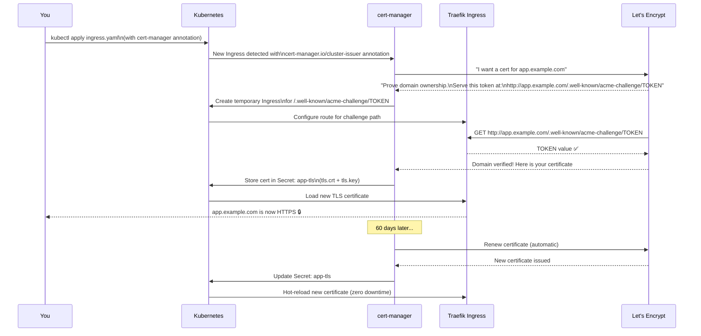

# အခမဲ့၊ Automatic လုပ်ဆောင်ပေးသော၊ လက်ဖြင့်ပြုပြင်ရန်မလိုသည့် Zero-Maintenance TLS

cert-manager မပေါ်လာခင်တုန်းက TLS certificates တွေကို စီမံခန့်ခွဲရတာ အရမ်းခက်ခဲခဲ့ပါတယ်-
1. CA တစ်ခုထံမှ certificate ကို လက်ဖြင့် တောင်းဆိုရခြင်း (များသောအားဖြင့် ငွေကုန်ကြေးကျရှိသည်)
2. `.crt` နှင့် `.key` files များကို Download ဆွဲရခြင်း
3. သင့်ရဲ့ server ပေါ်သို့ Upload တင်ရခြင်း
4. အဆိုပါ files များကိုသုံးရန် web server ကို Configure လုပ်ရခြင်း
5. သက်တမ်းမကုန်ခင် ရက် ၃၀ အလိုမှာ renew လုပ်ဖို့ calendar reminder တင်ထားရခြင်း
6. ၉၀ ရက်တစ်ကြိမ် ဒီအလုပ်တွေကို အမြဲတမ်း ပြန်လုပ်နေရခြင်း

**cert-manager က ဒီအဆင့်တွေအားလုံးကို လုံးဝဖယ်ရှားပေးပါတယ်။** သူက သင့်ရဲ့ Kubernetes cluster ထဲမှာ `Ingress` နဲ့ `Certificate` resources တွေကို စောင့်ကြည့်ပေးပြီး Let's Encrypt ထံမှ certificates တွေကို automatic တောင်းဆိုပေးခြင်း၊ Kubernetes Secrets အဖြစ် သိမ်းဆည်းပေးခြင်း၊ ပြီးတော့ သက်တမ်းမကုန်ခင်မှာ automatic renew လုပ်ပေးပါတယ်။ တစ်ခါ configuration လုပ်လိုက်ရုံနဲ့ TLS အကြောင်း ဘယ်တော့မှ ထပ်စဥ်းစားနေစရာ မလိုတော့ပါဘူး။

---

## cert-manager အလုပ်လုပ်ပုံ: တစ်ဆင့်ချင်းစီ လုပ်ဆောင်ချက်အပြည့်အစုံ



---

## Step 1: cert-manager ကို Install လုပ်ခြင်း

cert-manager ကို Helm chart (အကြံပြုသည်) သို့မဟုတ် static manifest ကိုသုံးပြီး Install လုပ်နိုင်ပါတယ်:

### Option A: Helm (အကြံပြုသည်)

```bash
# Jetstack Helm repo ကို ထည့်ပါ
helm repo add jetstack https://charts.jetstack.io
helm repo update

# CRDs များဖြင့် cert-manager ကို Install လုပ်ပါ
# CRDs (CustomResourceDefinitions) များက Certificate, ClusterIssuer စသည်တို့ကို သတ်မှတ်ပေးသည်
helm install cert-manager jetstack/cert-manager \
  --namespace cert-manager \
  --create-namespace \
  --version v1.14.5 \
  --set installCRDs=true \
  --set prometheus.enabled=false   # နောက်ပိုင်း monitoring သင်ခန်းစာတွင် enable လုပ်မည်

# Pod များအားလုံး Running ဖြစ်နေပြီလား စစ်ဆေးပါ (စက္ကန့် ၆၀ ခန့် ကြာတတ်သည်)
kubectl -n cert-manager get pods
# NAME                                      READY   STATUS    RESTARTS
# cert-manager-xxx                          1/1     Running   0          ← Main controller
# cert-manager-cainjector-xxx               1/1     Running   0          ← Webhook CA injection
# cert-manager-webhook-xxx                  1/1     Running   0          ← Validates resources
```

### Option B: Static Manifest

```bash
kubectl apply -f https://github.com/cert-manager/cert-manager/releases/download/v1.14.5/cert-manager.yaml

# Webhook အဆင်သင့်ဖြစ်သည်အထိ စောင့်ပါ (အရေးကြီးသည် — CRDs များကို စောလွန်းစွာ apply လုပ်မိပါက အမှားအယွင်းဖြစ်မည်)
kubectl -n cert-manager rollout status deployment/cert-manager-webhook
```

### Installation ကို စစ်ဆေးခြင်း

```bash
# CRDs များ ဖန်တီးပြီးပြီလား စစ်ဆေးပါ
kubectl get crd | grep cert-manager
# certificaterequests.cert-manager.io
# certificates.cert-manager.io
# challenges.acme.cert-manager.io
# clusterissuers.cert-manager.io
# issuers.cert-manager.io
# orders.acme.cert-manager.io

# Local တွင် စမ်းသပ်ရန်အတွက် cmctl CLI ကို Install လုပ်ပါ
curl -L -o cmctl https://github.com/cert-manager/cert-manager/releases/latest/download/cmctl-linux-amd64
chmod +x cmctl && sudo mv cmctl /usr/local/bin/

# Built-in check ကို Run ပါ
cmctl check api
# The cert-manager API is ready
```

---

## Step 2: ClusterIssuers များကို ဖန်တီးခြင်း

`ClusterIssuer` က cert-manager က certificates တွေကို *ဘယ်လို* ရယူရမလဲဆိုတာ သတ်မှတ်ပေးပါတယ်။ ဒါဟာ cluster-scoped ဖြစ်ပြီး namespace အားလုံးမှာ သုံးလို့ရပါတယ်။

### Staging ClusterIssuer (ပထမဆုံး အသုံးပြုပါ!)

```yaml
# cluster-issuer-staging.yaml
apiVersion: cert-manager.io/v1
kind: ClusterIssuer
metadata:
  name: letsencrypt-staging
spec:
  acme:
    # Let's Encrypt STAGING ပတ်ဝန်းကျင်
    # Rate limits: တစ်ပတ်လျှင် certificates 1500 ခု/domain (production ထက် အများကြီးပိုသည်)
    # Certs များကို FAKE CA ဖြင့် လက်မှတ်ရေးထိုးထားသည် (browser များက မယုံကြည်ပါ — စမ်းသပ်ရန်အတွက်သာ)
    server: https://acme-staging-v02.api.letsencrypt.org/directory
    email: you@example.com   # ← သင့်အီးမေးလ်ဖြင့် အစားထိုးပါ (သက်တမ်းကုန်မည့် သတိပေးချက်များကို Let's Encrypt က ဤနေရာသို့ ပို့သည်)
    privateKeySecretRef:
      name: letsencrypt-staging-account-key   # cert-manager က ACME account key ကို ဤနေရာတွင် သိမ်းဆည်းသည်
    solvers:
      - http01:
          ingress:
            ingressClassName: traefik
```

### Production ClusterIssuer

```yaml
# cluster-issuer-prod.yaml
apiVersion: cert-manager.io/v1
kind: ClusterIssuer
metadata:
  name: letsencrypt-prod
spec:
  acme:
    # Let's Encrypt PRODUCTION ပတ်ဝန်းကျင်
    # Rate limits: တစ်ပတ်လျှင် registered domain တစ်ခုအတွက် certificates 50 ခု
    # Certs များကို REAL CA ဖြင့် လက်မှတ်ရေးထိုးထားသည် (browser အားလုံးက ယုံကြည်သည်)
    server: https://acme-v02.api.letsencrypt.org/directory
    email: you@example.com   # ← သင့်အီးမေးလ်ဖြင့် အစားထိုးပါ
    privateKeySecretRef:
      name: letsencrypt-prod-account-key
    solvers:
      - http01:
          ingress:
            ingressClassName: traefik
```

```bash
kubectl apply -f cluster-issuer-staging.yaml
kubectl apply -f cluster-issuer-prod.yaml

# Issuer နှစ်ခုစလုံး Ready ဖြစ်မဖြစ် စစ်ဆေးပါ (Let's Encrypt တွင် register လုပ်ရန် စက္ကန့်အနည်းငယ် ကြာတတ်သည်)
kubectl get clusterissuer
# NAME                   READY   AGE
# letsencrypt-staging    True    15s
# letsencrypt-prod       True    15s

# Ready မဖြစ်သေးပါက အသေးစိတ်ကို စစ်ဆေးပါ
kubectl describe clusterissuer letsencrypt-staging
```

<Callout type="warning" title="Staging ဖြင့် အမြဲတမ်း ပထမဆုံး စမ်းသပ်ပါ">
Let's Encrypt production rate limits က တင်းကျပ်ပါတယ်- **မှတ်ပုံတင်ထားသော domain တစ်ခုလျှင် တစ်ပတ်ကို certificates 50 ခု** သာ ရပါတယ်။ အကယ်၍ သင်ဟာ configuration ပြဿနာတစ်ခုကို ဖြေရှင်းနေပြီး certificates အသစ်တွေကို အမြဲတမ်း တောင်းဆိုနေမယ်ဆိုရင် limit ကုန်သွားပြီး ၇ ရက်တိတိ ပိတ်ပင်ခံရမှာ ဖြစ်ပါတယ်။

Staging ပတ်ဝန်းကျင်မှာတော့ တစ်ပတ်ကို certificates 1,500 အထိ ကန့်သတ်ချက်ရှိပါတယ် — debugging လုပ်ဖို့အတွက် လုံလောက်ပါတယ်။ Staging cert များကို `(STAGING) Let's Encrypt` ဖြင့် လက်မှတ်ရေးထိုးထားပြီး browser များတွင် "Not Secure" လို့ ပြပါလိမ့်မယ်၊ ဒါပေမဲ့ ကျန်တဲ့ အလုပ်လုပ်ပုံတွေ အားလုံး တူတူပါပဲ။ Staging နဲ့ စမ်းသပ်ပါ၊ အလုပ်လုပ်ပြီဆိုမှ prod ကို ပြောင်းပါ။
</Callout>

---

## Step 3: Ingress Annotation မှတစ်ဆင့် Certificate တောင်းဆိုခြင်း

Cert တစ်ခုရယူရန် အလွယ်ကူဆုံးနည်းလမ်းကတော့ သင့်ရဲ့ `Ingress` ထဲမှာ annotation တစ်ခု ထည့်လိုက်ဖို့ပါပဲ:

```yaml
# ingress.yaml
apiVersion: networking.k8s.io/v1
kind: Ingress
metadata:
  name: myapp-ingress
  namespace: myapp
  annotations:
    # ဤ annotation က cert-manager ကို certificate တောင်းဆိုရန် စတင်လှုံ့ဆော်ပေးသည်
    cert-manager.io/cluster-issuer: "letsencrypt-staging"   # ← staging ဖြင့် စတင်ပါ!
spec:
  ingressClassName: traefik
  tls:
    - hosts:
        - app.yourdomain.com
      secretName: app-tls   # cert-manager က ဤ Secret ကို automatic ဖန်တီးပေးသည်
  rules:
    - host: app.yourdomain.com
      http:
        paths:
          - path: /
            pathType: Prefix
            backend:
              service:
                name: myapp-service
                port:
                  number: 80
```

```bash
kubectl apply -f ingress.yaml

# Certificate ထုတ်ပေးနေခြင်းကို စောင့်ကြည့်ပါ (၁-၂ မိနစ်ခန့်)
kubectl -n myapp get certificate -w
# NAME      READY   SECRET    AGE
# app-tls   False   app-tls   5s
# app-tls   True    app-tls   45s   ← Certificate ထုတ်ပေးပြီးပါပြီ!
```

---

## Step 4: Certificate ကို စစ်ဆေးခြင်း

```bash
# Certificate အခြေအနေ အကျဉ်းချုပ်
kubectl -n myapp get certificate app-tls
# NAME      READY   SECRET    AGE
# app-tls   True    app-tls   2m

# အသေးစိတ်ကြည့်ရှုခြင်း (သက်တမ်းကုန်မည့်ရက်၊ issuer၊ renewal အချိန်တို့ ပါဝင်သည်)
kubectl -n myapp describe certificate app-tls
# Status:
#   Conditions:
#     Type:               Ready
#     Status:             True
#     Message:            Certificate is up to date and has not expired
#   Not After:            2024-04-15 10:30:00 +0000 UTC   ← သက်တမ်းကုန်ဆုံးမည့်ရက်
#   Not Before:           2024-01-15 10:30:00 +0000 UTC   ← ထုတ်ပေးသည့်ရက်
#   Renewal Time:         2024-03-16 10:30:00 +0000 UTC   ← ဤအချိန်မတိုင်မီ automatic renew ဖြစ်မည်

# Secret ထဲမှ raw certificate ကို ကြည့်ရှုခြင်း
kubectl -n myapp get secret app-tls -o jsonpath='{.data.tls\.crt}' | \
  base64 -d | openssl x509 -noout -text | grep -A3 "Issuer\|Subject\|Validity"
# Issuer: CN=(STAGING) Let's Encrypt ECDSA R11   ← Staging issuer
# Subject: CN=app.yourdomain.com
# Validity:
#   Not Before: Jan 15 10:30:00 2024 GMT
#   Not After : Apr 15 10:30:00 2024 GMT
```

---

## Step 5: Staging Certificate ကို စမ်းသပ်ခြင်း

Staging certificate ကို browser များက မယုံကြည်ပါ ("Not Secure" ဟု ပြသည်။)။ Curl နှင့်အတူ `-k` (insecure) flag ကို အသုံးပြုပါ:

```bash
# Staging cert ဖြင့် HTTPS ကို စမ်းသပ်ပါ (certificate trust check ကို ကျော်သွားမည်)
curl -k https://app.yourdomain.com/api/health
# {"status":"ok","db":{"status":"connected"}}   ← App သည် HTTPS ဖြင့် အလုပ်လုပ်နေပါပြီ!

# HTTPS ချိတ်ဆက်မှုကို တည်ဆောက်ပြီး encrypt လုပ်ပြီးသားဖြစ်သည် (ယုံကြည်စိတ်ချရမှုမရှိသော CA တစ်ခုခုကို သုံးထားရုံသာ)
# ဒါက production ကို မပြောင်းခင် သင့်ရဲ့ TLS setup မှန်ကန်ကြောင်း သက်သေပြနေခြင်းဖြစ်သည်
```

---

## Step 6: Production Certificate သို့ ပြောင်းလဲခြင်း

```bash
# ၁။ Staging certificate Secret ကို ဖျက်ပါ (cert-manager က ပြန်လည်ထုတ်ပေးလိမ့်မည်)
kubectl -n myapp delete secret app-tls

# ၂။ Production issuer ကို သုံးရန် Ingress annotation ကို update လုပ်ပါ
kubectl -n myapp annotate ingress myapp-ingress \
  cert-manager.io/cluster-issuer=letsencrypt-prod \
  --overwrite

# ၃။ Production certificate ထုတ်ပေးနေခြင်းကို စောင့်ကြည့်ပါ
kubectl -n myapp get certificate -w
# NAME      READY   SECRET    AGE
# app-tls   False   app-tls   5s
# app-tls   True    app-tls   45s

# ၄။ -k မပါဘဲ စမ်းသပ်ပါ (အစစ်အမှန် certificate၊ browser ယုံကြည်သည်)
curl https://app.yourdomain.com/api/health
# {"status":"ok","db":{"status":"connected"}}   ← 🔒 Real HTTPS!

# ၅။ Issuer သည် Let's Encrypt production ဖြစ်ကြောင်း (staging မဟုတ်) စစ်ဆေးပါ
echo | openssl s_client -connect app.yourdomain.com:443 -servername app.yourdomain.com 2>/dev/null | \
  openssl x509 -noout -issuer
# issuer=C=US, O=Let's Encrypt, CN=E5   ← Production issuer ✅
```

---

## အခြားနည်းလမ်း: Standalone Certificate Resource

Ingress annotations များကို မမှီခိုလိုပါက `Certificate` resources များကို တိုက်ရိုက် ဖန်တီးနိုင်ပါတယ်:

```yaml
# certificate.yaml
apiVersion: cert-manager.io/v1
kind: Certificate
metadata:
  name: app-cert
  namespace: myapp
spec:
  secretName: app-tls   # ထုတ်ပေးသော cert ကို ဤနေရာတွင် သိမ်းသည်

  # Certificate သက်တမ်းကာလ (Let's Encrypt က ဤအချက်ကို လျစ်လျူရှုသည် — အမြဲတမ်း ရက် ၉၀ ဖြစ်သည်)
  duration: 2160h        # ရက် ၉၀

  # သက်တမ်းကုန်ရန် ရက် ၃၀ အလိုတွင် renew လုပ်ပါ
  renewBefore: 720h      # ရက် ၃၀

  subject:
    organizations:
      - MyApp Inc.

  # ဤ cert ဖြင့် လွှမ်းခြုံထားသော DNS အမည်များ
  dnsNames:
    - app.yourdomain.com
    - api.yourdomain.com    # cert တစ်ခုတည်းတွင် domain အများအပြားကို လွှမ်းခြုံနိုင်သည်

  issuerRef:
    name: letsencrypt-prod
    kind: ClusterIssuer
```

Standalone `Certificate` resource ၏ အားသာချက်များ:
- `Ingress` မရှိရင်တောင် အလုပ်လုပ်သည် (TCP routes များနောက်ကွယ်ရှိ services များအတွက် အသုံးဝင်သည်)
- multi-domain certificates (SAN certs) များကို ခွင့်ပြုသည်
- wildcard certificates များကို တောင်းဆိုနိုင်သည် (DNS-01 challenge လိုအပ်သည်)

---

## DNS-01 Challenge ဖြင့် Wildcard Certificates များ

`*.yourdomain.com` အတွက် (subdomain အားလုံးကို လွှမ်းခြုံရန်) HTTP-01 အစား **DNS-01** challenge ကို လိုအပ်ပါတယ်။ ဒါအတွက် သင့်ရဲ့ DNS provider မှာ API ရှိဖို့ လိုအပ်ပါတယ်:

```yaml
# cluster-issuer-cloudflare.yaml
apiVersion: cert-manager.io/v1
kind: ClusterIssuer
metadata:
  name: letsencrypt-cloudflare
spec:
  acme:
    server: https://acme-v02.api.letsencrypt.org/directory
    email: you@example.com
    privateKeySecretRef:
      name: letsencrypt-cloudflare-key
    solvers:
      - dns01:
          cloudflare:
            email: your-cloudflare-email@example.com
            apiTokenSecretRef:
              name: cloudflare-api-token
              key: api-token
        selector:
          dnsNames:
            - "*.yourdomain.com"    # wildcard certs များအတွက် ဤ solver ကိုသာ အသုံးပြုပါ
```

```bash
# Cloudflare API token secret ကို ဖန်တီးပါ
kubectl create secret generic cloudflare-api-token \
  --from-literal=api-token=YOUR_CLOUDFLARE_API_TOKEN \
  -n cert-manager

# ထို့နောက် wildcard cert တစ်ခုကို တောင်းဆိုပါ
kubectl apply -f - <<EOF
apiVersion: cert-manager.io/v1
kind: Certificate
metadata:
  name: wildcard-cert
  namespace: myapp
spec:
  secretName: wildcard-tls
  dnsNames:
    - "*.yourdomain.com"
    - "yourdomain.com"   # apex domain ကိုလည်း လွှမ်းခြုံပါ
  issuerRef:
    name: letsencrypt-cloudflare
    kind: ClusterIssuer
EOF
```

---

## Certificate သက်တမ်းကုန်ဆုံးမှုကို Monitoring ပြုလုပ်ခြင်း

Auto-renewal မအောင်မြင်ပါက သတိပေးချက်ရရှိရန် proactive monitoring ကို သတ်မှတ်ပါ:

```bash
# certificates များနှင့် ၎င်းတို့၏ သက်တမ်းကုန်မည့်ရက်များကို စစ်ဆေးပါ
kubectl get certificates -A
# NAMESPACE   NAME        READY   SECRET          AGE
# myapp       app-tls     True    app-tls         30d
# monitoring  grafana-tls True    grafana-tls     30d

# cert အားလုံးအတွက် သက်တမ်းကုန်ဆုံးမည့် အသေးစိတ်အချက်အလက်များကို ရယူပါ
kubectl get certificates -A -o json | jq -r \
  '.items[] | "\(.metadata.namespace)/\(.metadata.name): expires \(.status.notAfter)"'
# myapp/app-tls: expires 2024-04-15T10:30:00Z
# monitoring/grafana-tls: expires 2024-04-15T10:32:00Z

# Secret မှ တကယ့် cert သက်တမ်းကုန်ဆုံးမှုကို စစ်ဆေးပါ
kubectl -n myapp get secret app-tls -o jsonpath='{.data.tls\.crt}' | \
  base64 -d | openssl x509 -noout -enddate
# notAfter=Apr 15 10:30:00 2024 GMT
```

Certificate သက်တမ်းကုန်ရန် < 14 ရက် လိုသောအခါအတွက် Prometheus alert (CI/CD project သင်ခန်းစာမှ):
```yaml
- alert: CertExpiringSoon
  expr: certmanager_certificate_expiration_timestamp_seconds - time() < 14 * 24 * 3600
  for: 1h
  annotations:
    summary: "TLS cert {{ $labels.name }} expires in < 14 days"
```

---

## Certificate ထုတ်ပေးခြင်းဆိုင်ရာ ပြဿနာများကို ဖြေရှင်းခြင်း (Troubleshooting)

### Certificate သည် READY=False တွင် ရပ်တန့်နေခြင်း

```bash
# ၁. အခြေအနေ မက်ဆေ့ချ်များအတွက် Certificate resource ကို စစ်ဆေးပါ
kubectl -n myapp describe certificate app-tls
# ရှာဖွေရန်: "Failed to create Order: ..." သို့မဟုတ် "Waiting for http-01 challenge..."

# ၂. Order (ACME protocol order) ကို စစ်ဆေးပါ
kubectl -n myapp get order
kubectl -n myapp describe order app-tls-xxxx

# ၃. Challenge (HTTP-01 challenge pod နှင့် Ingress) ကို စစ်ဆေးပါ
kubectl -n myapp get challenge
kubectl -n myapp describe challenge app-tls-xxxx

# ၄. Port 80 သည် internet မှ ချိတ်ဆက်၍ရမရ စစ်ဆေးပါ
# (Let's Encrypt သည် HTTP-01 challenge အတွက် port 80 ကို သုံးသည် — firewall က ခွင့်ပြုရမည်)
curl -I http://app.yourdomain.com/.well-known/acme-challenge/test123
# 404 ကို ပြန်ပေးသင့်သည် (challenge ကို မတွေ့ရပါ၊ သို့သော် port 80 ပွင့်နေသည်)
# ချိတ်ဆက်မှု ငြင်းပယ်ခံရပါက: firewall က port 80 ကို ပိတ်ထားသည်
```

### "Rate limit exceeded"

```bash
kubectl -n myapp describe certificate app-tls | grep -i "rate"
# "too many certificates already issued for: yourdomain.com"

# လက်ရှိ rate limit အခြေအနေကို စစ်ဆေးပါ
# https://crt.sh/?q=yourdomain.com (ထုတ်ပေးထားသော cert အားလုံးကို ပြသည်)

# ဖြေရှင်းချက်: ၁ နာရီ စောင့်ပါ (cert တစ်ခုချင်းစီ၏ limit) သို့မဟုတ် ၁ ပတ် စောင့်ပါ (domain တစ်ခုချင်းစီ၏ limit)
# ဆက်လက်စမ်းသပ်ရန်အတွက် ထိုအချိန်တွင် staging ကို သုံးပါ
```

### "ACME account not registered"

```bash
kubectl -n cert-manager describe clusterissuer letsencrypt-prod
# ရှာဖွေရန်: "Status: False" နှင့် "reason: pending"
# များသောအားဖြင့် ဆိုလိုသည်မှာ: ClusterIssuer သည် register လုပ်ရန် စက္ကန့် ၃၀-၆၀ လိုအပ်နေသေးသည်
```

---

## Production တွင် cert-manager အသုံးပြုခြင်း: အကောင်းဆုံး အလေ့အကျင့်များ (Best Practices)

| အလေ့အကျင့် | အကြောင်းရင်း |
|-------------|------------|
| **Staging ဖြင့် ပထမဆုံး အမြဲတမ်း စမ်းသပ်ပါ** | တစ်ပတ်လျှင် cert 50 limit ပြည့်သွားခြင်းမှ ရှောင်ရှားနိုင်သည် |
| **`renewBefore: 720h` (ရက် ၃၀) ကို သုံးပါ** | ACME server ကို ယာယီ မရရှိနိုင်ပါက အရန်အနေဖြင့် အသုံးပြုရန် |
| **Prometheus alerts ဖြင့် Monitoring လုပ်ပါ** | Let's Encrypt သက်တမ်းကုန် အီးမေးလ်များကိုသာ အလုံးစုံ မမှီခိုပါနှင့် |
| **Wildcard certs များအတွက် DNS-01 ကို သုံးပါ** | HTTP-01 သည် `*.example.com` certificates များကို မထုတ်ပေးနိုင်ပါ |
| **cert-manager version ကို Pin လုပ်ပါ** | version pinning ဖြင့် `helm upgrade` လုပ်ခြင်းက breaking changes များကို ကာကွယ်ပေးသည် |
| **`cert-manager` Secrets များကို Backup လုပ်ပါ** | ACME account key (`letsencrypt-prod-account-key`) သည် အလွန်အရေးကြီးသည် |

---

## အနှစ်ချုပ်

cert-manager က သင့်အား အပြည့်အဝ automatic ဖြစ်သော TLS certificate စီမံခန့်ခွဲမှုကို ပေးစွမ်းပါတယ်-
- `cert-manager` namespace ထဲတွင် Helm မှတစ်ဆင့် Kubernetes controller အဖြစ် **Install လုပ်သည်**
- **ClusterIssuers** က ACME endpoint (staging vs production) နှင့် challenge solver (Traefik မှတစ်ဆင့် HTTP-01) တို့ကို သတ်မှတ်ပေးသည်
- သင့်ရဲ့ `Ingress` ပေါ်ရှိ **annotation တစ်ခုတည်း** (`cert-manager.io/cluster-issuer`) က automatic certificate ထုတ်ပေးခြင်းကို စတင်လှုံ့ဆော်ပေးသည်
- Certificates များကို **Kubernetes Secrets** အဖြစ် သိမ်းဆည်းပြီး သက်တမ်းကုန်ရန် ရက် ၃၀ အလိုတွင် **automatic renew** လုပ်ပေးသည်
- Production rate limits များကို ရှောင်ရှားရန် ပထမဆုံး **staging ဖြင့် အမြဲတမ်း စမ်းသပ်ပါ**
- Wildcard `*.yourdomain.com` certificates များအတွက် Cloudflare API token ဖြင့် **DNS-01 challenge** ကို အသုံးပြုပါ

နောက်လာမည့် သင်ခန်းစာတွင် worker nodes များကို ထည့်သွင်းခြင်းနှင့် server အများအပြားတွင် workload ဖြန့်ဝေမှုကို configure လုပ်ခြင်းတို့ဖြင့် သင့်ရဲ့ K3s cluster ကို scale လုပ်သွားပါမည်။