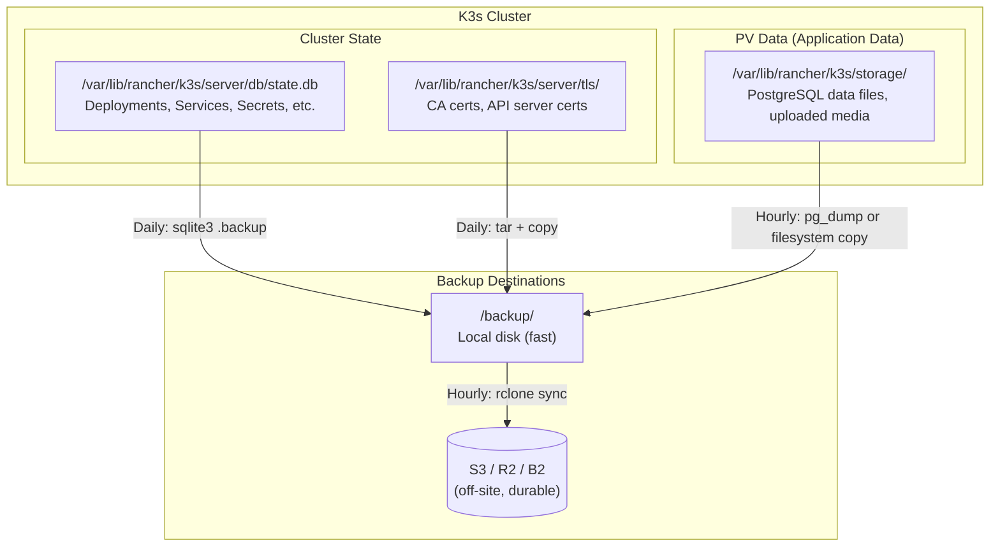

# Why Backups Are Non-Negotiable

Kubernetes cluster တစ်ခုမှာ အရေးကြီးတဲ့ critical data အမျိုးအစား နှစ်ခု ရှိပါတယ်:

1. **Cluster state** — manifest တွေထဲမှာ define လုပ်ထားသမျှ အားလုံး: Deployments, Services, Secrets, Ingress rules, ConfigMaps, PVCs တွေဖြစ်ပြီး SQLite ဒါမှမဟုတ် etcd ထဲမှာ သိမ်းဆည်းထားပါတယ်။
2. **Application data** — PostgreSQL database ဖိုင်တွေ၊ upload တင်ထားတဲ့ media တွေနဲ့ logs တွေပါ။ Node disk ပေါ်က PersistentVolumes တွေမှာ သိမ်းဆည်းထားပါတယ်။

Cluster state ပျောက်သွားရင် System တစ်ခုလုံးရဲ့ *configuration* တွေပါ ဆုံးရှုံးသွားပါမယ် — resource တစ်ခုချင်းစီကို manual ပြန်ဖန်တီးရပါလိမ့်မယ်။ Application data သာ ပျောက်သွားရင်တော့ တကယ့် business data တွေဖြစ်တဲ့ — customer records တွေ၊ orders တွေ၊ uploads တွေကို ဆုံးရှုံးရမှာ ဖြစ်ပါတယ်။

**ဒေတာ နှစ်မျိုးစလုံးကို သီးခြားစီနဲ့ ပုံမှန် backup လုပ်ထားဖို့ လိုပါတယ်။**



---

## Understanding K3s Data Storage

### SQLite (Default — Single Node)

```bash
# The SQLite database file
/var/lib/rancher/k3s/server/db/state.db

# Full K3s data directory structure
/var/lib/rancher/k3s/
├── server/
│   ├── db/
│   │   └── state.db          ← SQLite: all cluster state
│   ├── tls/                  ← CA + server certificates
│   │   ├── server-ca.crt
│   │   ├── server-ca.key     ← CRITICAL: losing this = losing your cluster
│   │   └── ...
│   ├── node-token            ← Join token for new agents
│   └── manifests/            ← HelmCharts auto-applied at startup
└── storage/                  ← local-path PVC data
    └── pvc-xxx-yyy/          ← Each PVC gets its own directory
        └── pgdata/           ← Your PostgreSQL database files
```

### Embedded etcd (Multi-Node / HA)

`--cluster-init` နဲ့ install လုပ်တဲ့အခါ K3s က SQLite အစား embedded etcd ကို သုံးပါတယ်:
```bash
/var/lib/rancher/k3s/server/db/etcd/   ← etcd WAL and snapshot files
```

---

## Backup Strategy 1: SQLite (Default Setup)

### Manual Backup

```bash
# IMPORTANT: Use sqlite3's .backup command for a consistent snapshot
# (simple cp may capture a file mid-write and produce a corrupt backup)

# Install sqlite3
sudo apt-get install -y sqlite3

# Take a live, consistent backup (no downtime required)
sudo sqlite3 /var/lib/rancher/k3s/server/db/state.db \
  ".backup /backup/k3s-state-$(date +%Y%m%d-%H%M%S).db"

# Verify the backup is valid
sqlite3 /backup/k3s-state-*.db "PRAGMA integrity_check;"
# ok
```

### Automated Daily Backup Script

```bash
# Create the backup script
sudo tee /usr/local/bin/k3s-backup.sh << 'SCRIPT'
#!/bin/bash
set -euo pipefail

BACKUP_DIR="/backup/k3s"
DATE=$(date +%Y%m%d-%H%M%S)
LOG_FILE="/var/log/k3s-backup.log"

log() { echo "[$(date -Iseconds)] $*" | tee -a "$LOG_FILE"; }

log "Starting K3s backup..."
mkdir -p "$BACKUP_DIR/state" "$BACKUP_DIR/pvdata" "$BACKUP_DIR/tls"

# 1. SQLite cluster state (live, consistent snapshot)
sqlite3 /var/lib/rancher/k3s/server/db/state.db \
  ".backup $BACKUP_DIR/state/state-$DATE.db"
log "SQLite backup complete: state-$DATE.db"

# 2. TLS certificates and CA keys
tar czf "$BACKUP_DIR/tls/tls-$DATE.tar.gz" \
  -C /var/lib/rancher/k3s/server tls/
log "TLS backup complete: tls-$DATE.tar.gz"

# 3. PVC data (local-path storage)
# Stop writes first if possible (or use pg_dump for PostgreSQL)
tar czf "$BACKUP_DIR/pvdata/pvdata-$DATE.tar.gz" \
  -C /var/lib/rancher/k3s storage/ \
  --warning=no-file-changed  # Ignore files changing during backup
log "PVC data backup complete: pvdata-$DATE.tar.gz"

# 4. Export all Kubernetes resources as YAML (useful for human inspection)
k3s kubectl get all,ingress,configmap,secret,pvc,clusterissuer \
  -A -o yaml > "$BACKUP_DIR/state/resources-$DATE.yaml" 2>/dev/null || true
log "Resource YAML export complete"

# 5. Delete backups older than 7 days (keep disk usage bounded)
find "$BACKUP_DIR" -name "*.db" -mtime +7 -delete
find "$BACKUP_DIR" -name "*.tar.gz" -mtime +7 -delete
find "$BACKUP_DIR" -name "*.yaml" -mtime +7 -delete
log "Old backups pruned"

# 6. Sync to off-site storage (S3, R2, B2, etc.)
if command -v rclone &>/dev/null; then
  rclone sync "$BACKUP_DIR" remote:your-bucket/k3s-backups/ \
    --transfers=4 \
    --retries=3 \
    >> "$LOG_FILE" 2>&1
  log "Rclone sync to remote complete"
fi

log "Backup completed successfully"
SCRIPT

sudo chmod +x /usr/local/bin/k3s-backup.sh

# Test it manually first
sudo /usr/local/bin/k3s-backup.sh
ls -lh /backup/k3s/state/
```

### Schedule with Cron

```bash
# Daily at 2:00 AM
(sudo crontab -l 2>/dev/null; echo "0 2 * * * /usr/local/bin/k3s-backup.sh >> /var/log/k3s-backup.log 2>&1") | sudo crontab -

# Verify cron is scheduled
sudo crontab -l
```

---

## Backup Strategy 2: Embedded etcd (HA Setup)

K3s မှာ built-in etcd snapshot commands တွေ ပါပြီးသား ဖြစ်ပါတယ်:

```bash
# Take an on-demand snapshot
sudo k3s etcd-snapshot save \
  --name "pre-upgrade-$(date +%Y%m%d)" \
  --snapshot-compress    # Compress the snapshot

# List all snapshots
sudo k3s etcd-snapshot list
# NAME                          NODE       CREATED                        SIZE
# pre-upgrade-20240115          server-1   2024-01-15 10:30:00 +0000 UTC  2.4 MiB
# on-demand-default-20240114    server-1   2024-01-14 02:00:00 +0000 UTC  2.3 MiB

# Snapshots are stored at:
ls /var/lib/rancher/k3s/server/db/snapshots/
```

### Automated etcd Snapshots (Config File)

```yaml
# /etc/rancher/k3s/config.yaml (add to existing config)
# Automatic snapshots every 6 hours
etcd-snapshot-schedule-cron: "0 */6 * * *"
etcd-snapshot-retention: 10                   # Keep 10 snapshots
etcd-snapshot-dir: /backup/etcd-snapshots
etcd-snapshot-compress: true
```

```bash
sudo systemctl restart k3s
```

### Sync etcd Snapshots Off-Site

```bash
# /usr/local/bin/sync-etcd-snapshots.sh
#!/bin/bash
rclone sync /backup/etcd-snapshots remote:your-bucket/etcd-snapshots/
```

---

## PostgreSQL Application Data: Database Dumps

K3s ထဲမှာ Running ဖြစ်နေတဲ့ PostgreSQL အတွက် အလုံခြုံဆုံး backup လုပ်နည်းကတော့ `pg_dump` ကိုသုံးပြီး **logical dumps** လုပ်တာပါပဲ — Write လုပ်နေတာတွေ ရှိနေပါစေ ဘယ်အချိန်မဆို consistent ဖြစ်တဲ့ snapshot တွေ ရနိုင်ပါတယ်။

```bash
# Option A: Run pg_dump inside the pod
kubectl -n myapp exec -it postgres-0 -- \
  pg_dump -U appuser -d myapp --format=custom \
  > /backup/db/myapp-$(date +%Y%m%d-%H%M%S).dump

# Verify the dump
kubectl -n myapp exec -it postgres-0 -- \
  pg_restore -U appuser -d myapp --list /dev/stdin < /backup/db/myapp-*.dump | head -20

# Option B: Kubernetes CronJob for automated dumps
```

```yaml
# postgres-backup-cronjob.yaml
apiVersion: batch/v1
kind: CronJob
metadata:
  name: postgres-backup
  namespace: myapp
spec:
  schedule: "0 1 * * *"      # Daily at 1 AM
  concurrencyPolicy: Forbid   # Don't run concurrent backups
  successfulJobsHistoryLimit: 3
  failedJobsHistoryLimit: 1

  jobTemplate:
    spec:
      template:
        spec:
          restartPolicy: OnFailure
          containers:
            - name: backup
              image: postgres:16-alpine
              command:
                - /bin/sh
                - -c
                - |
                  set -e
                  TIMESTAMP=$(date +%Y%m%d-%H%M%S)
                  BACKUP_FILE="/backups/myapp-${TIMESTAMP}.dump"
                  
                  echo "Starting backup at ${TIMESTAMP}"
                  pg_dump \
                    -h postgres.myapp.svc.cluster.local \
                    -U $POSTGRES_USER \
                    -d $POSTGRES_DB \
                    --format=custom \
                    -f "${BACKUP_FILE}"
                  
                  echo "Backup size: $(du -sh ${BACKUP_FILE})"
                  
                  # Delete dumps older than 7 days
                  find /backups -name "*.dump" -mtime +7 -delete
                  echo "Backup complete"

              env:
                - name: POSTGRES_USER
                  valueFrom:
                    secretKeyRef:
                      name: postgres-secret
                      key: POSTGRES_USER
                - name: PGPASSWORD
                  valueFrom:
                    secretKeyRef:
                      name: postgres-secret
                      key: POSTGRES_PASSWORD
                - name: POSTGRES_DB
                  valueFrom:
                    secretKeyRef:
                      name: postgres-secret
                      key: POSTGRES_DB

              volumeMounts:
                - name: backup-storage
                  mountPath: /backups

          volumes:
            - name: backup-storage
              persistentVolumeClaim:
                claimName: backup-pvc
```

---

## Off-Site Storage with rclone

rclone က Storage providers ပေါင်း 40 ကျော်ကို Support ပေးပါတယ် (S3, Cloudflare R2, Backblaze B2, Google Cloud Storage, etc.):

```bash
# Install rclone
curl https://rclone.org/install.sh | sudo bash

# Configure a remote (interactive — follow the prompts)
rclone config
# Choose: n (new remote)
# Name: remote
# Type: s3 (or r2, b2, gcs, etc.)
# Follow provider-specific prompts

# Test the connection
rclone ls remote:your-bucket

# Sync backups (one-directional: local → remote)
rclone sync /backup/k3s remote:your-bucket/k3s-backups/ \
  --transfers=4 \
  --retries=3 \
  --verbose

# Set up hourly sync via cron
(sudo crontab -l 2>/dev/null; echo "0 * * * * rclone sync /backup/k3s remote:your-bucket/k3s-backups/ >> /var/log/rclone-sync.log 2>&1") | sudo crontab -
```

### Cloudflare R2 (Free Tier: 10 GB storage, 1M writes/month)

```bash
# Cloudflare R2 is fully S3-compatible — great free option for backups
rclone config
# Type: s3
# Provider: Cloudflare
# access_key_id: YOUR_R2_ACCESS_KEY
# secret_access_key: YOUR_R2_SECRET_KEY
# endpoint: https://ACCOUNT_ID.r2.cloudflarestorage.com
```

---

## Disaster Recovery: Restoring from Backup

### Restore SQLite Cluster State

```bash
# On a FRESH server with K3s installed (but not running any apps yet):

# 1. Stop K3s
sudo systemctl stop k3s

# 2. Replace the SQLite database with the backup
sudo cp /backup/k3s/state/state-20240115-020000.db \
  /var/lib/rancher/k3s/server/db/state.db

# 3. Restore TLS certificates (CRITICAL — without these, K3s won't start)
sudo tar xzf /backup/k3s/tls/tls-20240115-020000.tar.gz \
  -C /var/lib/rancher/k3s/server/

# 4. Restore PVC data
sudo tar xzf /backup/k3s/pvdata/pvdata-20240115-020000.tar.gz \
  -C /var/lib/rancher/k3s/

# 5. Start K3s
sudo systemctl start k3s

# 6. Verify
kubectl get nodes
kubectl get pods -A
```

### Restore etcd Snapshot

```bash
# 1. Stop K3s on the server
sudo systemctl stop k3s

# 2. Restore etcd snapshot (this replaces the entire cluster state)
sudo k3s server \
  --cluster-reset \
  --cluster-reset-restore-path=/backup/etcd-snapshots/pre-upgrade-20240115

# After this command, k3s exits. Start it normally:
sudo systemctl start k3s

# 3. Verify
kubectl get nodes
kubectl get pods -A
```

### Restore PostgreSQL from pg_dump

```bash
# Restore a database dump into the running PostgreSQL pod
cat /backup/db/myapp-20240115-020000.dump | \
  kubectl -n myapp exec -i postgres-0 -- \
  pg_restore -U appuser -d myapp --clean --if-exists

# Or drop and recreate the database
kubectl -n myapp exec -i postgres-0 -- \
  psql -U appuser -c "DROP DATABASE myapp; CREATE DATABASE myapp;"
cat /backup/db/myapp-20240115-020000.dump | \
  kubectl -n myapp exec -i postgres-0 -- \
  pg_restore -U appuser -d myapp
```

---

## Backup Monitoring and Alerting

Prometheus metric လေးတစ်ခုသုံးပြီး backup ကျန်းမာရေးအခြေအနေကို ခြေရာခံနိုင်ပါတယ်:

```bash
# Add to your backup script: write a timestamp file after each successful backup
echo "$(date +%s)" > /var/lib/node_exporter/textfile/k3s_backup_last_success_timestamp.prom
cat > /var/lib/node_exporter/textfile/k3s_backup_last_success_timestamp.prom << EOF
# HELP k3s_backup_last_success_timestamp_seconds Unix timestamp of last successful K3s backup
# TYPE k3s_backup_last_success_timestamp_seconds gauge
k3s_backup_last_success_timestamp_seconds $(date +%s)
EOF
```

Prometheus alert — Backup မလုပ်တာ ၂၆ နာရီ ကျော်သွားရင် alert ထွက်လာစေရန်:
```yaml
- alert: K3sBackupMissing
  expr: time() - k3s_backup_last_success_timestamp_seconds > 93600  # 26 hours
  for: 1h
  annotations:
    summary: "K3s backup has not run in over 26 hours"
    description: "Check /var/log/k3s-backup.log on the server for errors"
```

---

## Backup Checklist

သင့်ရဲ့ backup strategy ကို production-ready ဖြစ်ပြီလို့ မသတ်မှတ်ခင် အောက်ပါတို့ကို စစ်ဆေးပါ:

- [ ] **SQLite ဒါမှမဟုတ် etcd** snapshot ကို အနည်းဆုံး တစ်ရက်တစ်ကြိမ် (နာရီတိုင်းဆို ပိုကောင်း) လုပ်ထားခြင်း
- [ ] Backup ထဲမှာ **TLS certificates** (`/var/lib/rancher/k3s/server/tls/`) တွေ ပါဝင်နေခြင်း
- [ ] **PostgreSQL** ကို data dir ကို filesystem copy ကူးတာမျိုး **မဟုတ်ဘဲ** `pg_dump` နဲ့ backup လုပ်ထားခြင်း
- [ ] **Off-site copy** (S3, R2, Backblaze) ရှိနေခြင်း — local disk မှာပဲ သိမ်းထားတာက မလုံလောက်ပါဘူး
- [ ] **Backup logs** တွေကို monitor လုပ်ထားခြင်း — backup ဖောက်ပြန်ပျက်စီးတာကို သတိမထားမိလိုက်ရင် ဆိုးရွားတဲ့ အကျိုးဆက်တွေ ဖြစ်လာနိုင်ပါတယ်
- [ ] **Restoration ကို စမ်းသပ်ပြီးဖြစ်ခြင်း** — test server တစ်ခုပေါ်မှာ full restore ကို ၃ လတစ်ကြိမ် လုပ်ကြည့်ပါ
- [ ] **RTO/RPO သတ်မှတ်ပြီးဖြစ်ခြင်း** — Downtime ဘယ်လောက်ကြာကြာ ခံနိုင်လဲ? ဒေတာ ဘယ်လောက်အထိ ဆုံးရှုံးမှုကို လက်ခံနိုင်လဲ?

<Callout type="caution" title="Test Your Backups — Untested Backups Are Not Backups">
Test VPS တစ်ခု (ဈေးအသက်သာဆုံး plan) ဝယ်ပြီး သင့်ရဲ့ latest backup ကို restore လုပ်ပါ။ ပြီးရင် application စတאר্টဖြစ်မဖြစ်နဲ့ data တွေ မှန်ကန်မှုရှိမရှိ စစ်ဆေးပါ။ ဒီအလုပ်ကို အနည်းဆုံး ၃ လတစ်ကြိမ် လုပ်ပါ။ အဖွဲ့အစည်းအများစုက backup လိုအပ်လာမှသာ သူတို့ရဲ့ backup ဖိုင်တွေ ပျက်စီးနေတာ၊ မစုံလင်တာကို သိကြရတတ်ပါတယ် — အဲဒါကတော့ အဆိုးဝါးဆုံး အချိန်အခါပါပဲ။
</Callout>

---

## Summary

Production K3s backup strategy တစ်ခုမှာ အလွှာနှစ်ခု ပါဝင်ပါတယ်:
- **Cluster state**: `sqlite3 .backup` (ဒါမှမဟုတ် `k3s etcd-snapshot save`) က cron ကနေတစ်ဆင့် အလိုအလျောက် run ပြီး Kubernetes resource configuration အပြည့်အစုံကို သိမ်းဆည်းပေးပါတယ်
- **Application data**: Kubernetes CronJob ထဲက `pg_dump` က database snapshot တွေကို consistent ဖြစ်အောင် သိမ်းပေးပါတယ်
- **Off-site sync**: rclone က backup တွေအားလုံးကို S3/R2/B2 ဆီ sync တင်ပေးပြီး disk ပျက်စီးတာနဲ့ VPS ဆုံးရှုံးတာတွေကနေ ကာကွယ်ပေးပါတယ်
- **Monitoring**: Backup မလုပ်တာ ၂၆ နာရီကျော်သွားရင် Prometheus alert တွေ ထွက်လာပါတယ်
- **Restoration**: စာရွက်စာတမ်းနဲ့ တကွ မှတ်တမ်းတင်ထားပြီး စမ်းသပ်ပြီးသားဖြစ်ပါတယ် (သီအိုရီသက်သက် မဟုတ်ပါ)

နောက်ဆုံး သင်ခန်းစာမှာတော့ သင့်ရဲ့ K3s cluster ကို real-time dashboards နဲ့ alerting တွေသုံးပြီး Prometheus နဲ့ Grafana တို့နဲ့ ဘယ်လို monitor ရမလဲဆိုတာကို လေ့လာရမှာ ဖြစ်ပါတယ်။