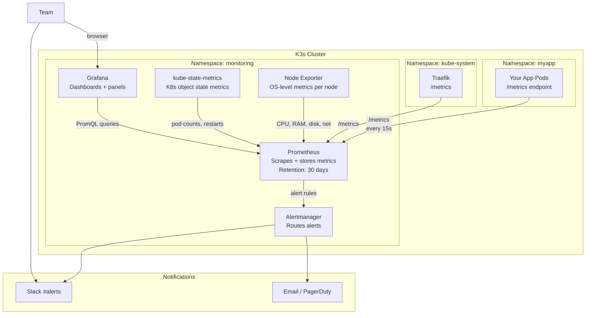

# Production Observability for K3s

Monitoring မပါဘဲ K3s cluster ကို run တယ်ဆိုတာ မျက်စိမှိတ်ပြီး ကားမောင်းနေတာနဲ့ တူပါတယ်။ အသုံးပြုသူတွေ (Users) က ပြဿနာတက်မှ ညည်းညူလာမှသာ ပြဿနာရှိမှန်း သိရပါလိမ့်မယ် — အဲ့ဒီအချိန်မှာ ပျက်စီးဆုံးရှုံးမှုတွေ ဖြစ်ပြီးသွားပါပြီ။

Production monitoring stack တစ်ခုက သင့်ကို အောက်ပါတို့ပေးစွမ်းနိုင်ပါတယ်-
- **Metrics** — CPU၊ memory၊ disk၊ network နဲ့ pod health တို့ကို ၁၅ စက္ကန့်တိုင်း စုဆောင်းပေးခြင်း
- **Dashboards** — Visual ဖြစ်ပြီး interactive ဖြစ်တဲ့ real-time နဲ့ historical data တွေကို ပြသပေးခြင်း
- **Alerts** — အသုံးပြုသူတွေ မသိခင်မှာ Slack ဒါမှမဟုတ် email ကနေတဆင့် ကြိုတင်သတိပေးချက်တွေ ပို့ပေးခြင်း

ဒီ lesson မှာတော့ Prometheus၊ Grafana၊ Alertmanager၊ Node Exporter (node တစ်ခုချင်းစီရဲ့ OS metrics တွေအတွက်) နဲ့ kube-state-metrics (Kubernetes object metrics တွေအတွက်) တို့ကို ပေါင်းစပ်ပေးထားတဲ့ `kube-prometheus-stack` အပြည့်အစုံကို deploy လုပ်သွားမှာ ဖြစ်ပြီး — အားလုံးက အတူတကွ အလုပ်လုပ်ဖို့ pre-configured ဖြစ်ပြီးသား ဖြစ်ပါတယ်။

---

## The Monitoring Architecture



---

## Step 1: Install Helm

```bash
# Install Helm (if not already installed from earlier lessons)
curl https://raw.githubusercontent.com/helm/helm/main/scripts/get-helm-3 | bash

helm version
# version.BuildInfo{Version:"v3.14.x", ...}
```

---

## Step 2: Install kube-prometheus-stack

```bash
# Add the Prometheus Community Helm repository
helm repo add prometheus-community https://prometheus-community.github.io/helm-charts
helm repo update

# Create a values file for customization
cat > /tmp/monitoring-values.yaml << 'EOF'
# Grafana configuration
grafana:
  adminPassword: "changeme-use-a-secret-in-prod"  # Change this!
  
  # Persistence: save dashboards across Grafana restarts
  persistence:
    enabled: true
    size: 5Gi
    storageClassName: local-path

  # Configure Grafana's data source (Prometheus) automatically
  sidecar:
    dashboards:
      enabled: true    # Auto-load dashboards from ConfigMaps

# Prometheus configuration
prometheus:
  prometheusSpec:
    # Keep 30 days of metrics
    retention: 30d
    
    # Maximum disk usage for metrics storage
    retentionSize: "15GB"
    
    # Persistence: keep metrics across Prometheus restarts
    storageSpec:
      volumeClaimTemplate:
        spec:
          storageClassName: local-path
          resources:
            requests:
              storage: 20Gi

    # Scrape all ServiceMonitors and PodMonitors in all namespaces
    serviceMonitorSelectorNilUsesHelmValues: false
    podMonitorSelectorNilUsesHelmValues: false

# Alertmanager configuration (we'll update with Slack webhook later)
alertmanager:
  alertmanagerSpec:
    retention: 120h   # Keep alert history for 5 days

# Node Exporter: runs on every node, collects OS-level metrics
nodeExporter:
  enabled: true

# kube-state-metrics: collects K8s object state metrics
kubeStateMetrics:
  enabled: true

# K3s-specific: CoreDNS uses a different port than standard K8s
coreDns:
  enabled: true
  service:
    port: 9153
    targetPort: 9153
EOF

# Install the stack (takes 2-4 minutes)
helm install monitoring prometheus-community/kube-prometheus-stack \
  --namespace monitoring \
  --create-namespace \
  --values /tmp/monitoring-values.yaml \
  --version 56.21.4   # Pin version for reproducibility

# Watch pods come up
kubectl -n monitoring get pods -w
```

အရာအားလုံး Running ဖြစ်သွားတဲ့အခါ မျှော်လင့်ရတဲ့ pods တွေကတော့-
```
NAME                                                   READY   STATUS
alertmanager-monitoring-kube-prometheus-alertmanager-0  2/2    Running
monitoring-grafana-xxx                                  3/3    Running
monitoring-kube-prometheus-operator-xxx                 1/1    Running
monitoring-kube-state-metrics-xxx                       1/1    Running
monitoring-prometheus-node-exporter-xxx                 1/1    Running   ← One per node
prometheus-monitoring-kube-prometheus-prometheus-0      2/2    Running
```

---

## Step 3: Access Grafana

### Option A: Port-Forward (Quick Check)

```bash
kubectl -n monitoring port-forward svc/monitoring-grafana 3000:80

# Open http://localhost:3000
# Username: admin
# Password: changeme-use-a-secret-in-prod  (what you set in values)
```

### Option B: Expose via Ingress (Production)

```yaml
# grafana-ingress.yaml
apiVersion: networking.k8s.io/v1
kind: Ingress
metadata:
  name: grafana-ingress
  namespace: monitoring
  annotations:
    cert-manager.io/cluster-issuer: "letsencrypt-prod"
    # Protect Grafana with basic auth as an extra layer
    traefik.ingress.kubernetes.io/router.middlewares: monitoring-basic-auth@kubernetescrd
spec:
  ingressClassName: traefik
  tls:
    - hosts:
        - grafana.yourdomain.com
      secretName: grafana-tls
  rules:
    - host: grafana.yourdomain.com
      http:
        paths:
          - path: /
            pathType: Prefix
            backend:
              service:
                name: monitoring-grafana
                port:
                  number: 80
```

```bash
kubectl apply -f grafana-ingress.yaml
# Then open https://grafana.yourdomain.com
```

---

## Step 4: Explore Pre-Built Dashboards

kube-prometheus-stack နဲ့အတူ pre-built dashboards ၃၀ ကျော် ပါလာပါတယ်။ Grafana ထဲမှာ သွားကြည့်ပါ-

**Dashboards → Browse → Kubernetes**

| Dashboard | What You See |
|-----------|-------------|
| **Kubernetes / Compute Resources / Cluster** | Node အားလုံးရဲ့ Overall CPU နဲ့ memory သုံးစွဲမှု |
| **Kubernetes / Compute Resources / Namespace (Pods)** | Namespace တစ်ခုအတွင်းက Pod တစ်ခုချင်းစီရဲ့ resource သုံးစွဲမှု |
| **Kubernetes / Compute Resources / Node (Pods)** | Node တစ်ခုချင်းစီအပေါ် မူတည်ပြီး Pod တွေ ပျံ့နှံ့နေမှုနဲ့ resource သုံးစွဲမှု |
| **Kubernetes / Networking / Cluster** | Pod တစ်ခုချင်းစီရဲ့ Network bytes in/out ပမာဏ |
| **Node Exporter / Full** | အသေးစိတ် OS metrics တွေ: disk I/O၊ network နဲ့ CPU per-core |
| **Kubernetes / Persistent Volumes** | PVC သုံးစွဲမှုနဲ့ ရရှိနိုင်မှု အခြေအနေ |

**Dashboards → Import → Enter Dashboard ID** ကနေတဆင့် အခြား community dashboards တွေကို ထပ်မံထည့်သွင်းနိုင်ပါတယ်-

| ID | Dashboard | Description |
|----|-----------|-------------|
| 14430 | cert-manager | TLS certificate သက်တမ်းကုန်မယ့်ရက်ကို ခြေရာခံခြင်း |
| 7587 | Blackbox Exporter | HTTP endpoint uptime နဲ့ latency ကို စောင့်ကြည့်ခြင်း |
| 13659 | Traefik 2 | Requests/s၊ error rates နဲ့ latency တွေ |
| 17375 | Node Exporter Full | ပြည့်စုံတဲ့ node metrics များ |

---

## Step 5: Configure Alertmanager → Slack

```yaml
# alertmanager-config.yaml
apiVersion: v1
kind: Secret
metadata:
  name: alertmanager-monitoring-kube-prometheus-alertmanager
  namespace: monitoring
type: Opaque
stringData:
  alertmanager.yaml: |
    global:
      resolve_timeout: 5m

    # Slack webhook URL — create at: api.slack.com/apps → Incoming Webhooks
      slack_api_url: "https://hooks.slack.com/services/YOUR/SLACK/WEBHOOK"

    route:
      # Group related alerts together to avoid notification storms
      group_by: ["alertname", "namespace", "job"]
      group_wait: 30s           # Wait 30s before sending the first notification
      group_interval: 5m        # Wait 5m before sending updates to an existing group
      repeat_interval: 4h       # Re-notify after 4h if still firing
      receiver: slack-default

      routes:
        # Critical: send immediately, repeat every 1 hour
        - matchers:
            - severity = "critical"
          receiver: slack-critical
          repeat_interval: 1h

        # Watchdog (always-firing heartbeat alert — use for "silence is broken" monitoring)
        - matchers:
            - alertname = "Watchdog"
          receiver: null    # Suppress Watchdog notifications

    receivers:
      - name: "null"

      - name: slack-default
        slack_configs:
          - channel: "#k3s-alerts"
            send_resolved: true
            title: '{{ if eq .Status "firing" }}🔥{{ else }}✅{{ end }} {{ .GroupLabels.alertname }}'
            text: |
              *Status:* {{ .Status | toUpper }}
              *Namespace:* {{ .GroupLabels.namespace }}
              {{ range .Alerts }}
              *Description:* {{ .Annotations.description }}
              {{ end }}

      - name: slack-critical
        slack_configs:
          - channel: "#k3s-critical"
            send_resolved: true
            title: '🚨 CRITICAL: {{ .GroupLabels.alertname }}'
            text: |
              *Status:* {{ .Status | toUpper }}
              {{ range .Alerts }}
              *Description:* {{ .Annotations.description }}
              *Runbook:* {{ .Annotations.runbook_url }}
              {{ end }}
```

```bash
kubectl apply -f alertmanager-config.yaml

# Reload Alertmanager config
kubectl -n monitoring rollout restart statefulset/alertmanager-monitoring-kube-prometheus-alertmanager
```

---

## Step 6: Create Custom Alert Rules

```yaml
# k3s-custom-alerts.yaml
apiVersion: monitoring.coreos.com/v1
kind: PrometheusRule
metadata:
  name: k3s-custom-alerts
  namespace: monitoring
  labels:
    release: monitoring   # Must match the Helm release name
spec:
  groups:
    - name: k3s-cluster.rules
      rules:

        # Node memory usage > 85%
        - alert: NodeMemoryHigh
          expr: |
            (
              node_memory_MemTotal_bytes - node_memory_MemAvailable_bytes
            ) / node_memory_MemTotal_bytes * 100 > 85
          for: 5m
          labels:
            severity: warning
          annotations:
            summary: "Node {{ $labels.instance }} memory usage > 85%"
            description: "Memory: {{ $value | printf \"%.1f\" }}% used on {{ $labels.instance }}"

        # Node disk usage > 80%
        - alert: NodeDiskHigh
          expr: |
            (
              node_filesystem_size_bytes{mountpoint="/", fstype!="tmpfs"}
              - node_filesystem_free_bytes{mountpoint="/", fstype!="tmpfs"}
            ) / node_filesystem_size_bytes{mountpoint="/", fstype!="tmpfs"} * 100 > 80
          for: 10m
          labels:
            severity: warning
          annotations:
            summary: "Node {{ $labels.instance }} disk usage > 80%"
            description: "Disk: {{ $value | printf \"%.1f\" }}% used. Free up space soon."

        # Node disk usage > 95% (critical)
        - alert: NodeDiskCritical
          expr: |
            (
              node_filesystem_size_bytes{mountpoint="/", fstype!="tmpfs"}
              - node_filesystem_free_bytes{mountpoint="/", fstype!="tmpfs"}
            ) / node_filesystem_size_bytes{mountpoint="/", fstype!="tmpfs"} * 100 > 95
          for: 5m
          labels:
            severity: critical
          annotations:
            summary: "Node {{ $labels.instance }} disk is almost full!"
            description: "Disk: {{ $value | printf \"%.1f\" }}% used. IMMEDIATE action required."

        # Pod crash-looping
        - alert: PodCrashLooping
          expr: |
            rate(kube_pod_container_status_restarts_total[15m]) * 60 > 1
          for: 5m
          labels:
            severity: critical
          annotations:
            summary: "Pod {{ $labels.namespace }}/{{ $labels.pod }} is crash-looping"
            description: "Container {{ $labels.container }} is restarting > 1x/min for 5 minutes."

        # Pod not ready for > 5 minutes
        - alert: PodNotReady
          expr: |
            kube_pod_status_ready{condition="true"} == 0
          for: 5m
          labels:
            severity: warning
          annotations:
            summary: "Pod {{ $labels.namespace }}/{{ $labels.pod }} is not ready"
            description: "Pod has been in a non-ready state for more than 5 minutes."

        # PVC usage > 80%
        - alert: PVCUsageHigh
          expr: |
            (
              kubelet_volume_stats_used_bytes
              / kubelet_volume_stats_capacity_bytes
            ) * 100 > 80
          for: 10m
          labels:
            severity: warning
          annotations:
            summary: "PVC {{ $labels.namespace }}/{{ $labels.persistentvolumeclaim }} > 80% full"
            description: "PVC is {{ $value | printf \"%.1f\" }}% full. Consider expanding."

        # cert-manager certificate expiring within 14 days
        - alert: CertificateExpiringSoon
          expr: |
            certmanager_certificate_expiration_timestamp_seconds - time() < 14 * 24 * 3600
          for: 1h
          labels:
            severity: warning
          annotations:
            summary: "Certificate {{ $labels.namespace }}/{{ $labels.name }} expires in < 14 days"
            description: "Check cert-manager logs for renewal issues."

        # Traefik 5xx error rate > 5%
        - alert: TraefikHighErrorRate
          expr: |
            (
              rate(traefik_service_requests_total{code=~"5.."}[5m])
              / rate(traefik_service_requests_total[5m])
            ) > 0.05
          for: 5m
          labels:
            severity: warning
          annotations:
            summary: "High 5xx error rate from Traefik"
            description: "{{ $value | printf \"%.1f\" }}% of requests are returning 5xx errors."
```

```bash
kubectl apply -f k3s-custom-alerts.yaml

# Verify rules are loaded by Prometheus
# In Prometheus UI (port-forward to 9090): Status → Rules
kubectl -n monitoring port-forward svc/monitoring-kube-prometheus-prometheus 9090:9090
# Open http://localhost:9090/rules → look for k3s-cluster.rules
```

---

## Step 7: Build a Custom Grafana Dashboard

Grafana ထဲမှာ: **Dashboards → New → New Dashboard → Add visualization** သို့ သွားပါ

### Panel 1: Node CPU Usage

```promql
# CPU usage per node (percentage)
100 - (avg by (instance) (rate(node_cpu_seconds_total{mode="idle"}[5m])) * 100)
```

### Panel 2: Node Memory Usage

```promql
# Memory usage per node (GB)
(node_memory_MemTotal_bytes - node_memory_MemAvailable_bytes) / 1024 / 1024 / 1024
```

### Panel 3: Pod Restart Count (Last 24h)

```promql
# Pods that restarted in the last 24 hours
sum by (namespace, pod) (
  increase(kube_pod_container_status_restarts_total[24h])
) > 0
```

### Panel 4: Disk Usage per PVC

```promql
# PVC usage percentage
kubelet_volume_stats_used_bytes / kubelet_volume_stats_capacity_bytes * 100
```

### Panel 5: Traefik Request Rate

```promql
# Requests per second through Traefik (by entrypoint)
sum by (entrypoint) (rate(traefik_entrypoint_requests_total[5m]))
```

### Panel 6: Traefik Error Rate

```promql
# Percentage of 5xx responses
sum(rate(traefik_service_requests_total{code=~"5.."}[5m]))
/ sum(rate(traefik_service_requests_total[5m])) * 100
```

---

## Step 8: Verify Alerting is Working

သင့် alert pipeline အလုပ်လုပ်ပုံကို အစအဆုံး စမ်းသပ်ပါ-

```bash
# Create a fake alert to verify Slack delivery
kubectl -n monitoring port-forward svc/monitoring-kube-prometheus-alertmanager 9093:9093

# In another terminal: send a test alert to Alertmanager
curl -X POST http://localhost:9093/api/v2/alerts \
  -H "Content-Type: application/json" \
  -d '[{
    "labels": {
      "alertname": "TestAlert",
      "severity": "warning",
      "namespace": "monitoring"
    },
    "annotations": {
      "summary": "This is a test alert",
      "description": "If you see this in Slack, alerting is working correctly."
    },
    "startsAt": "2024-01-15T10:00:00Z"
  }]'

# Check your Slack channel for the test alert
# Then resolve it:
curl -X POST http://localhost:9093/api/v2/alerts \
  -H "Content-Type: application/json" \
  -d '[{
    "labels": { "alertname": "TestAlert", "severity": "warning" },
    "endsAt": "2024-01-15T10:00:01Z"
  }]'
```

---

## Monitoring Checklist

သင့် monitoring ကို production-ready ဖြစ်ပြီလို့ မသတ်မှတ်ခင် ဒါတွေကို စစ်ဆေးပါ-

- [ ] Prometheus က targets အားလုံးကို scrape လုပ်နေခြင်း (Status → Targets — Prometheus UI ထဲမှာ အားလုံး GREEN ဖြစ်နေရပါမယ်)
- [ ] Grafana dashboards တွေမှာ real data တွေ ပေါ်နေခြင်း ("No Data" မပြရပါ)
- [ ] Alertmanager ကို Slack နဲ့ ချိတ်ဆက်ထားပြီး ဖြစ်ခြင်း (test alert ဝင်လာခြင်း)
- [ ] Custom alert rules တွေကို apply လုပ်ပြီးဖြစ်ခြင်း (`k3s-custom-alerts.yaml`)
- [ ] Node Exporter က node တိုင်းမှာ run နေခြင်း
- [ ] kube-state-metrics run နေခြင်း
- [ ] Prometheus data တွေကို PVC ပေါ်မှာ persistent ဖြစ်အောင် လုပ်ထားခြင်း (ephemeral မဟုတ်ပါ)
- [ ] Grafana dashboards တွေကို save လုပ်ထားခြင်း (browser memory ထဲတင် မဟုတ်ဘဲ)
- [ ] Disk space ကို စောင့်ကြည့်နေခြင်း (Prometheus storage က ကြီးမားပါတယ် — 15–20 GB)

---

## Upgrading the Monitoring Stack

```bash
helm repo update
helm upgrade monitoring prometheus-community/kube-prometheus-stack \
  --namespace monitoring \
  --values /tmp/monitoring-values.yaml \
  --reuse-values   # Keep existing values, only override what's in the values file

# Check the upgrade status
kubectl -n monitoring rollout status deployment/monitoring-grafana
kubectl -n monitoring rollout status deployment/monitoring-kube-prometheus-operator
```

---

## Summary

ယခုအခါ သင့်ရဲ့ K3s cluster မှာ production-grade ဖြစ်တဲ့ observability အပြည့်အစုံ ရှိသွားပါပြီ-

| Component | Purpose | Access |
|-----------|---------|--------|
| **Prometheus** | ၁၅ စက္ကန့်တစ်ကြိမ် metrics များကို scrape လုပ်ပြီး သိမ်းဆည်းပေးသည် | Port-forward :9090 |
| **Grafana** | Interactive dashboards များ | https://grafana.yourdomain.com |
| **Alertmanager** | Alerts များကို Slack/email သို့ ပို့ပေးသည် | Port-forward :9093 |
| **Node Exporter** | OS-level metrics (CPU, RAM, disk) | Auto-scraped |
| **kube-state-metrics** | Kubernetes object state | Auto-scraped |

သင့်မှာ အောက်ပါတို့ ရှိလာပါပြီ-
- Cluster ကို ချက်ချင်းမြင်နိုင်ဖို့အတွက် **pre-built dashboards ၃၀ ကျော်**
- Memory၊ disk၊ pod crashes၊ PVC usage၊ cert expiry နဲ့ error rates တွေကို လွှမ်းခြုံထားတဲ့ **custom alert rules ၇ ခု**
- Critical နဲ့ warning alert channels တွေပါတဲ့ **Slack integration**
- Custom application dashboards တည်ဆောက်ဖို့အတွက် **PromQL queries တွေ**

**ဂုဏ်ယူပါတယ် — K3s course ကို အောင်မြင်စွာ ပြီးဆုံးသွားပါပြီ။** ယခုဆိုရင် သင်ဟာ production-grade K3s cluster တစ်ခုကို install လုပ်ခြင်း၊ configure လုပ်ခြင်း၊ harden လုပ်ခြင်းနဲ့ operate လုပ်ခြင်းတို့ကို အပြည့်အဝ လုပ်ဆောင်နိုင်ပြီ ဖြစ်ပါတယ်။ Capstone CI/CD Project course အတွက်လည်း အပြည့်အဝ အသင့်ဖြစ်နေပါပြီ။