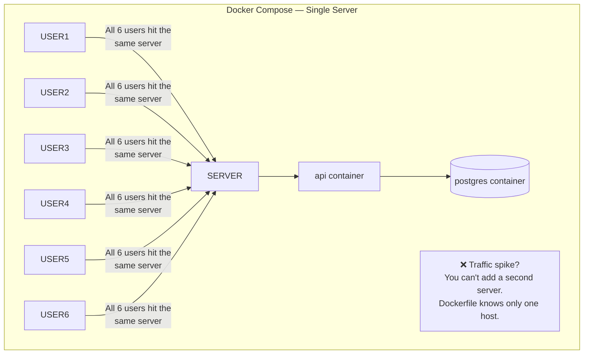
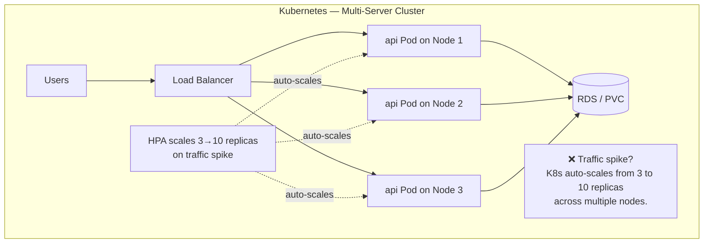
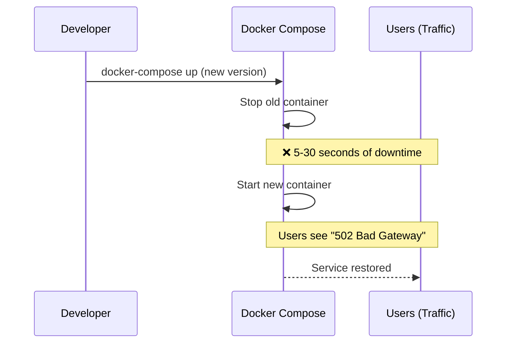
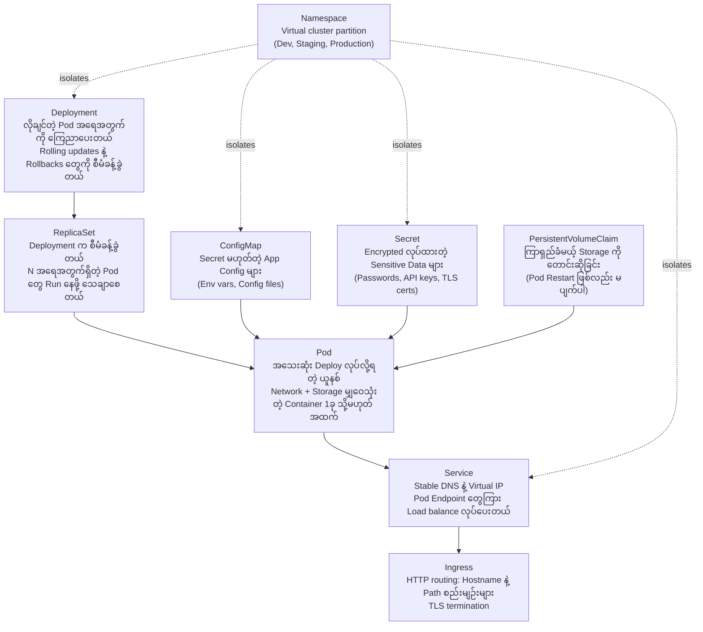

# Docker Compose မဖြေရှင်းနိုင်တဲ့ ပြဿနာ

Docker နဲ့ Docker Compose က အရမ်းကောင်းတဲ့ tools တွေ ဖြစ်ပါတယ်။ သင့်ရဲ့ Application ကို portable ဖြစ်ပြီး reproducible ဖြစ်တဲ့ Container တစ်ခုအဖြစ် Pack လုပ်ပေးနိုင်သလို `docker-compose up` အမိန့်တစ်ခုတည်းနဲ့ multi-service stack တွေကို Run နိုင်စေပါတယ်။ Local development တွေအတွက်နဲ့ Server တစ်လုံးတည်းပေါ်မှာ Run တဲ့ Production workloads ငယ်ငယ်လေးတွေအတွက်ဆိုရင် ဒါတွေက အသင့်တော်ဆုံး ရွေးချယ်မှုတွေ ဖြစ်လေ့ရှိပါတယ်။

ဒါပေမဲ့ Product တစ်ခု ကြီးထွားလာတာနဲ့အမျှ Docker Compose ရဲ့ Architecture အရ လုံးဝမဖြေရှင်းနိုင်တဲ့ တကယ့်လက်တွေ့ပြဿနာတွေ ပေါ်လာပါတော့တယ်-

---

## Scaling ပြဿနာ





---

## ကိုယ့်ဘာသာ ပြန်လည်ကုစားနိုင်စွမ်း (Self-Healing) ပြဿနာ

Docker Compose မှာဆိုရင် Container တစ်ခု Crash သွားခဲ့ရင်-
1. Process က non-zero code နဲ့ ထွက်သွားမယ်
2. Docker က အဲဒါကို Restart ပြန်လုပ်ပေးနိုင်တယ် (`restart: always` ထည့်ထားရင်ပေါ့) — ဒါပေမဲ့ **Machine တစ်ခုတည်း** ပေါ်မှာပဲ ဖြစ်ပါတယ်။
3. Machine ကိုယ်တိုင် ပျက်စီးသွားပြီဆိုရင်တော့ **ဘာမှန်းမသိ အကုန်ပျောက်သွားပါပြီ**

Kubernetes မှာဆိုရင်တော့-
1. Pod Controller က Pod တစ်ခု သေဆုံးသွားတာကို စက္ကန့်ပိုင်းအတွင်း သိရှိနိုင်ပါတယ်။
2. ဒါကို **Healthy ဖြစ်နေတဲ့ Node** တစ်ခုပေါ်မှာ အစားထိုး Pod အသစ်တစ်ခုကို Automatic အနေနဲ့ Schedule လုပ်ပေးပါတယ်။
3. Node တစ်ခုလုံး ပျက်စီးသွားခဲ့ရင်တောင် အဲဒီပေါ်က Workloads တွေအားလုံးကို ကျန်ရှိနေသေးတဲ့ Node တွေဆီ ပြန်လည် Schedule လုပ်ပေးပါတယ်။
4. ဒီအလုပ်တွေကို တစ်နေ့တာ ဘယ်အချိန်မှာမဖြစ်ဖြစ် လူကိုယ်တိုင် ဝင်လုပ်စရာ လုံးဝမလိုဘဲ (**zero manual intervention**) ဖြစ်ပျက်သွားပါတယ်။

---

## Downtime လုံးဝမရှိသော Deployment ပြဿနာ



```mermaid
sequenceSequence
    participant DEV as Developer
    participant K8S as Kubernetes
    participant USERS as Users (Traffic)

    DEV->>K8S: kubectl apply (new image tag)
    K8S->>K8S: Start 1 new pod (v2)
    K8S->>K8S: Wait for readiness probe ✅
    K8S->>K8S: Route traffic to new pod
    K8S->>K8S: Terminate 1 old pod (v1)
    Note over USERS,K8S: ✅ Zero requests dropped — users see nothing
    K8S->>K8S: Repeat for all replicas
```

---

## Kubernetes ဖြေရှင်းပေးတဲ့ အဓိကပြဿနာ (၅) ခု

| ပြဿနာ | Docker Compose | Kubernetes |
|---------|---------------|------------|
| **Server အများကြီးပေါ်မှာ Scale လုပ်ခြင်း** | ❌ Single host သל်သာ | ✅ Node အများကြီးပေါ် Pod တွေ ဖြန့်ကျက်ခြင်း |
| **Crash ဖြစ်တာတွေကို ကိုယ့်ဘာသာ ကုစားခြင်း** | ⚠️ Local မှာပဲ Restart လုပ်တယ်၊ Node ပျက်ရင် မကယ်နိုင်ပါ | ✅ Healthy ဖြစ်တဲ့ Node တွေဆီ Pod တွေကို Automatic ပြန်ပို့ပေးတယ် |
| **Downtime လုံးဝမရှိတဲ့ Deploy လုပ်ခြင်း** | ❌ Update လုပ်တိုင်း ခဏ Downtime ဖြစ်မယ် | ✅ Rolling updates နဲ့ Pod တွေကို တစ်ခုချင်းစီ အစားထိုးတယ် |
| **Apps တွေကြား Service discovery လုပ်ခြင်း** | ⚠️ Docker network တူတာချင်းမှသာ | ✅ Built-in DNS: `service-name.namespace.svc.cluster.local` |
| **Traffic Load Balancing လုပ်ခြင်း** | ❌ Built-in မပါပါ | ✅ Service တိုင်းက Healthy ဖြစ်တဲ့ Pod Endpoint တွေအားလုံးကို Load-balance လုပ်ပေးတယ် |

---

## Kubernetes ဆိုတာ အတိအကျ ဘာလဲ။

Kubernetes (K8s) ဆိုတာ Open-source ဖြစ်တဲ့ **Container orchestration platform** တစ်ခု ဖြစ်ပါတယ် — Distributed System တစ်ခုဖြစ်ပြီး အောက်ပါတို့ကို လုပ်ဆောင်ပေးပါတယ်-

1. ရရှိနိုင်တဲ့ Resources တွေအပေါ်မူတည်ပြီး Server တွေပေါ်မှာ Container တွေကို **Schedule လုပ်ပေးခြင်း**
2. Run နေတဲ့ Container တိုင်းကို **Monitor လုပ်ပေးပြီး** Error တက်နေတာတွေကို Restart ချပေးခြင်း
3. User တွေကို မနှောင့်ယှက်ဘဲ Run နေတဲ့ Application တွေကို **Update လုပ်ပေးခြင်း**
4. CPU/Memory သုံးစွဲမှုပေါ်မူတည်ပြီး Workloads တွေကို Automatic အနေနဲ့ **Scale လုပ်ပေးခြင်း**
5. Network Traffic တွေကို Healthy ဖြစ်တဲ့ Container တွေဆီ **Route လုပ်ပေးခြင်း**
6. Secrets တွေ၊ Configuration တွေကို **သိမ်းဆည်းပေးပြီး** Persistent Storage တွေကို စီမံခန့်ခွဲပေးခြင်း

> Kubernetes ကို သင့်ရဲ့ **Data Center အတွက် Operating System** တစ်ခုလို သဘောထားပါ။ OS တစ်ခုက Machine တစ်လုံးပေါ်မှာ Process တွေကို စီမံခန့်ခွဲသလိုမျိုး (CPU Time တွေ Schedule လုပ်တာ၊ Memory စီမံတာ၊ I/O တွေကို ကိုင်တွယ်တာ) Kubernetes ကလည်း Machine အစုအဝေး (Fleet) တစ်ခုလုံးပေါ်က Container တွေကို စီမံခန့်ခွဲပေးပါတယ်။

---

## Kubernetes ရဲ့ "Desired State" Model

Kubernetes အတွက် အရေးအကြီးဆုံး Mental Model ကတော့ **Declarative Infrastructure** ပဲ ဖြစ်ပါတယ်-

```yaml
# ဘလိုလုပ်ရမလဲ (HOW) ကို မရေးဘဲ ဘာလိုချင်တာလဲ (WHAT) ကို ကြေညာရပါတယ်။
apiVersion: apps/v1
kind: Deployment
metadata:
  name: web-api
spec:
  replicas: 3         # "ကျွန်တော် App Copy 3 ခု Run ထားချင်ပါတယ်"
  # ... container spec
```

ဒီ Configuration ကို Kubernetes ဆီ Apply လိုက်ပါတယ်။ အဲဒီအချိန်ကစပြီး Kubernetes ဟာ Cluster ရဲ့ လက်ရှိအခြေအနေ (Actual State) ကို သင်လိုချင်တဲ့ အခြေအနေ (Desired State) ဖြစ်လာအောင် **စဉ်ဆက်မပြတ် ညှိနှိုင်းဆောင်ရွက်ပေးနေပါတယ် (Continuously reconciles)**-

```
စက္ကန့်အနည်းငယ်ကြာတိုင်း Loop ပတ်နေပါတယ်:
  1. Observe (လေ့လာခြင်း): Run နေတဲ့ Pod အရေအတွက်ကို ရေတွက်တယ် → 2 (တစ်ခု Crash သွားလို့)
  2. Compare (နှိုင်းယှဉ်ခြင်း): လိုချင်တာ = 3၊ လက်ရှိရှိတာ = 2 → ကွာဟချက် (Drift) ကို တွေ့ရှိ
  3. Act (လုပ်ဆောင်ခြင်း): Pod အသစ် 1 ခု ဖန်တီးတယ် → လက်ရှိရှိတာ = 3 ✅
```

ဒါကြောင့် Kubernetes ကို **Self-healing** လို့ ခေါ်ဆိုကြတာ ဖြစ်ပါတယ် — သင်လိုချင်တဲ့ ပုံစံအတိုင်း ဖြစ်လာအောင် သူက အမြဲတမ်း ကြိုးစားနေပါတယ်။ Error တက်တာကို ထိုင်စောင့်ပြီး ကိုယ်တိုင် ဝင်ပြင်နေစရာ မလိုပါဘူး။ Kubernetes က သင့်အတွက် အဲဒါကို လုပ်ဆောင်ပေးပါတယ်။

---

## Kubernetes ရဲ့ Core Concepts တွေ: အနှစ်ချုပ်

လာမယ့် သင်ခန်းစာတွေမှာ ဒီအရာတွေ အားလုံးကို အသေးစိတ် ထပ်သင်ယူရမှာ ဖြစ်ပါတယ်-



---

## Kubernetes vs Docker Compose: အစအဆုံး နှိုင်းချက်

| Feature | Docker Compose | Kubernetes |
|---------|---------------|------------|
| **Multi-server** | ❌ Single host သာ | ✅ Node အရေအတွက် အကန့်အသတ်မရှိ |
| **Self-healing** | ⚠️ `restart: always` (Host တူတာမှသာ) | ✅ Node တွေကူးပြီး Pod တွေကို ပြန် Schedule လုပ်ပေးနိုင်ခြင်း |
| **Rolling deployments** | ❌ ခဏ Downtime ဖြစ်မယ် | ✅ Downtime လုံးဝမရှိခြင်း |
| **Auto-scaling** | ❌ Manual လုပ်ရမယ် | ✅ CPU/Memory/Custom metrics တွေနဲ့ HPA သုံးပြီး Scale လုပ်ခြင်း |
| **Load balancing** | ❌ Built-in မပါပါ | ✅ Service တိုင်းက Load-balance လုပ်ပေးခြင်း |
| **Service discovery** | ⚠️ Network တူတာမှသာ | ✅ Cluster တစ်ခုလုံးအတွက် Built-in DNS ပါရှိခြင်း |
| **Secrets management** | ⚠️ `.env` Files တွေ သုံးရတယ် | ✅ Encrypted လုပ်ထားတဲ့ Secrets Resource ပါရှိခြင်း |
| **Storage management** | ⚠️ Volume Mounts တွေ သုံးရတယ် | ✅ Dynamic Provisioning ပါတဲ့ PV/PVC တွေ သုံးနိုင်ခြင်း |
| **TLS management** | ❌ Manual လုပ်ရတယ် | ✅ Cert-manager + Let's Encrypt သုံးနိုင်ခြင်း |
| **Health monitoring** | ❌ မပါပါ | ✅ Liveness + Readiness Probes တွေ ပါရှိခြင်း |
| **RBAC / Access control** | ❌ မပါပါ | ✅ အသေးစိတ်ကျတဲ့ Role-based Access တွေ သုံးနိုင်ခြင်း |
| **Learning curve** | ✅ နည်းပါတယ် (လွယ်သည်) | ❌ မတ်စောက်ပါတယ် (ခက်ခဲသည်) |
| **Best for** | Dev နဲ့ Single-server Production များ | Multi-server Production များ |

---

## Kubernetes ကို ဘယ်နေရာတွေမှာ Run ကြလဲ။

| Environment | Options | အသင့်တော်ဆုံးကတော့ |
|------------|---------|---------|
| **Local development** | minikube, kind, k3d, Docker Desktop | လေ့လာရန်နှင့် စမ်းသပ်ရန် |
| **Managed cloud** | AWS EKS, Google GKE, Azure AKS | Production အတွက် (Control plane ကို အခြားသူတစ်ဦးဦးက စီမံပေးသည်) |
| **Self-hosted lightweight** | K3s (နောက်လာမယ့် Course မှာ ပါမယ်!) | VPS Production, Edge, Home lab |
| **Self-hosted full** | kubeadm, RKE2 | On-premise Data Centers တွေအတွက် |

### Cloud Managed Kubernetes ရဲ့ ဈေးနှုန်း (ခန့်မှန်းခြေ)

| Provider | Control Plane ကုန်ကျစရိတ် | Min Worker ကုန်ကျစရိတ် | မှတ်ချက် |
|----------|------------------|-----------------|-------|
| **AWS EKS** | တစ်လ ~$72 | တစ်လ ~$30 (t3.small) | အဖွဲ့ငယ်တွေအတွက် စရိတ်ကြီးနိုင်ပါတယ် |
| **Google GKE** | Free (Autopilot) | တစ်လ ~$45 | Control plane အခမဲ့ဖြစ်တာက အသာစီးရစေပါတယ် |
| **Azure AKS** | Free | တစ်လ ~$30 | Control plane အခမဲ့ |
| **K3s on Hetzner** | ပါဝင်ပြီးသား | တစ်လ ~€6 | ကိုယ့်ရဲ့ ကိုယ်ပိုင် VM၊ အပြည့်အဝ ထိန်းချုပ်နိုင်သည် |

ဒီ Course မှာတော့ အောက်ပါတို့နဲ့ အတူတူ လိုက်လုပ်နိုင်ပါတယ်-
- `kind` (Kubernetes in Docker) — အခမဲ့၊ ကိုယ့် Laptop ပေါ်မှာ Run နိုင်သည်
- `minikube` — အခမဲ့၊ ကိုယ့် Laptop ပોર્မှာ Run နိုင်သည်
- မည်သည့် Managed Cloud Cluster မဆို (EKS/GKE/AKS ရဲ့ Free Tiers တွေ သုံးလို့ရပါတယ်)

---

## Kubernetes က သင့်အတွက် သင့်တော်ရဲ့လား။

Kubernetes က အရမ်းစွမ်းဆောင်ရည်ကောင်းပေမဲ့ Operational Overhead (ထိန်းသိမ်းရတဲ့ ဝန်ထုပ်ဝန်ပိုး) လည်း ကြီးမားပါတယ်။ ဒီ Trade-offs တွေကို သေချာ စဉ်းစားပါ-

**သင့်မှာ အောက်ပါအချက်တွေရှိရင် Kubernetes လိုအပ်နိုင်ပါတယ်:**
- တစ်ခုနဲ့တစ်ခု သီးခြားစီ Scale လုပ်ဖို့ လိုအပ်တဲ့ Services အများကြီးရှိရင်
- Downtime ဖြစ်တာက သင့်အတွက် ငွေကြေး သို့မဟုတ် Customers တွေကို ထိခိုက်စေမယ်ဆိုရင်
- Engineer ၃ ယောက်နဲ့အထက် ရှိပြီး Environment အစုံ (Staging, Prod) ရှိနေရင်
- Services ၁၀ ခုနဲ့အထက် Run ဖို့ လိုအပ်နေရင်

**သင့်မှာ အောက်ပါအချက်တွေရှိရင်တော့ Kubernetes ကို **မလိုသေးပါဘူး**:**
- App ရိုးရိုးလေးတစ်ခုကို တည်ဆောက်နေတဲ့ Solo Developer တစ်ယောက်တည်း ဖြစ်နေရင်
- Traffic က လူ ၁,၀၀၀ အောက်မှာပဲ ရှိနေရင်
- Deploy လုပ်တဲ့အချိန်မှာ Downtime မိနစ်အနည်းငယ် ဖြစ်တာကို လက်ခံနိုင်ရင်
- Product နဲ့ Market ဘယ်လိုကိုက်ညီအောင် လုပ်ရမလဲဆိုတာကို အခုမှ စမ်းသပ်နေဆဲ ဖြစ်နေရင်

Docker Compose ကနေ K3s (Single VPS Kubernetes) ဆီ ကူးပြောင်းတာက Managed Kubernetes အပြည့်အစုံဆီ တန်းမသွားခင် လျှောက်ရမယ့် မှန်ကန်တဲ့ Evolution Path တစ်ခု ဖြစ်လေ့ရှိပါတယ်။

---

## အနှစ်ချုပ်

Kubernetes ဆိုတာ Industry-standard ဖြစ်တဲ့ Container Orchestration Platform တစ်ခု ဖြစ်ပြီး Server တစ်လုံးတည်း Deploy လုပ်တဲ့အခါ ကြုံတွေ့ရတဲ့ ကန့်သတ်ချက်တွေကို အဓိက ဖြေရှင်းပေးပါတယ်-

- **Self-healing**: Node တစ်ခုလုံး ပျက်စီးသွားရင်တောင် Crash ဖြစ်သွားတဲ့ Pod တွေကို Automatic အနေနဲ့ အစားထိုးပေးပါတယ်။
- **Zero-downtime rolling updates**: Podဟောင်းတွေကို မဖယ်ရှားခင် Pod အသစ်တွေ Healthy ဖြစ်မဖြစ် အရင် စစ်ဆေးပေးပါတယ်။
- **Horizontal auto-scaling**: လက်ရှိ Traffic ဝင်ရောက်မှုအပေါ်မူတည်ပြီး HPA က Pod တွေကို အလိုအလျောက် ထည့်ခြင်း/ဖယ်ရှားခြင်း လုပ်ပေးပါတယ်။
- **Multi-server scheduling**: Workloads တွေကို Cluster တစ်ခုလုံးပေါ်မှာ အကောင်းဆုံးဖြစ်အောင် ဖြန့်ကျက်ပေးပါတယ်။
- **Declarative model**: သင် *ဘာလိုချင်လဲ (WHAT)* ဆိုတာကိုပဲ ရေးပြလိုက်ပါ၊ အဲဒါကို *ဘလိုလုပ်ရမလဲ (HOW)* ဆိုတာကို Kubernetes က စဉ်ဆက်မပြတ် ညှိနှိုင်းဆောင်ရွက်ပေးပါတယ်။

လာမယ့် သင်ခန်းစာမှာတော့ Kubernetes Architecture ကို အသေးစိတ် လေ့လာရမှာ ဖြစ်ပါတယ် — Control Plane နဲ့ Worker Nodes တွေထဲက Component တစ်ခုချင်းစီရဲ့ သဘောတရားတွေနဲ့ ဒီ Orchestration Engine ကို ပံ့ပိုးပေးဖို့ ဘလို အတူတူ အလုပ်လုပ်ကြတယ်ဆိုတာကို နားလည်သွားမှာ ဖြစ်ပါတယ်။