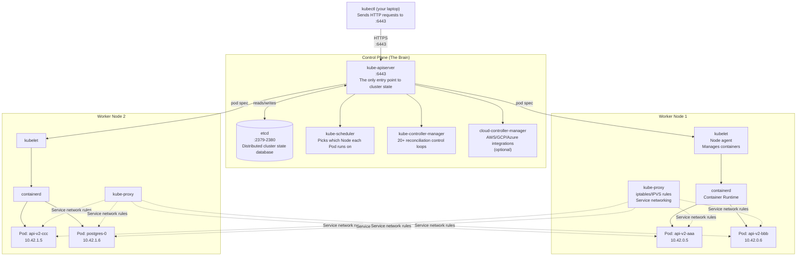
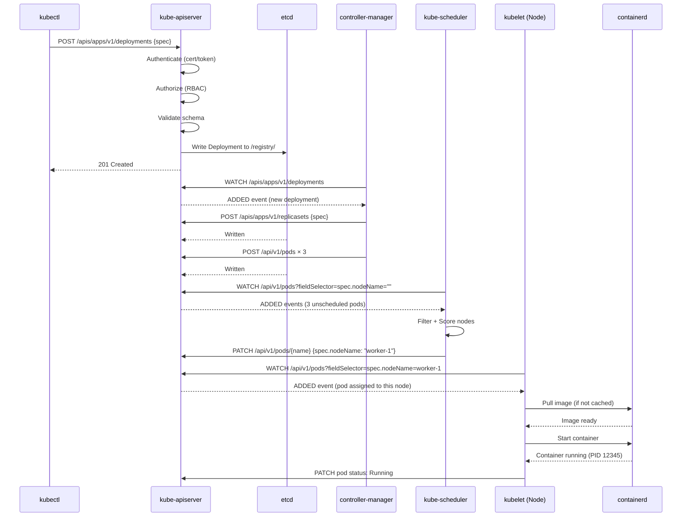

# Kubernetes Cluster တစ်ခု ဘ ယ်လို တည်ဆောက်ထားလဲ

Kubernetes cluster တိုင်းမှာ Distinct roles (ကွဲပြားခြားနားတဲ့ အခန်းကဏ္ဍ) နှစ်ခု ပါဝင်ပါတယ်။ Real cluster တစ်ခုကို debug လုပ်ဖို့၊ tune လုပ်ဖို့နဲ့ operate လုပ်ဖို့အတွက် အဲဒါတွေကို နက်နက်နဲနဲ နားလည်ထားဖို့ အလွန်အရေးကြီးပါတယ်။



---

## Control Plane: Component ငါးခု

### 1. `kube-apiserver` — အရာရာတိုင်းရဲ့ ပင်မဝင်ပေါက် (Front Door)

API server ဟာ etcd နဲ့ စကားပြောတဲ့ **တစ်ადတည်းသော** component ဖြစ်ပါတယ်။ တခြား component တိုင်းနဲ့ `kubectl`, Helm, GitHub Actions, Argo CD အပါအဝင် external tool တိုင်းဟာ API server မှတဆင့်သာ exclusive အနေနဲ့ communicate လုပ်ကြပါတယ်။

**ဘာတွေလုပ်ပေးလဲ:**
- Request တိုင်းကို Authenticate နဲ့ Authorize လုပ်ပေးတယ် (RBAC)
- Resource manifests တွေကို Validate လုပ်ပေးတယ် (ဒါဟာ valid ဖြစ်တဲ့ Deployment spec လား?)
- Desired state တွေကို etcd ထဲကို Read/Write လုပ်တယ်
- Watch streams တွေကနေတဆင့် resource update တွေကို controllers နဲ့ kubelets တွေဆီ ပို့ပေးတယ်

**`kubectl apply -f deployment.yaml` ကို Run လိုက်တဲ့အခါ ဘာတွေဆက်ဖြစ်လဲ:**
```
1. kubectl reads the YAML file
2. kubectl sends a POST/PUT HTTP request to kube-apiserver:6443
3. kube-apiserver authenticates your certificate/token
4. kube-apiserver authorizes the action (RBAC check)
5. kube-apiserver validates the Deployment schema
6. kube-apiserver writes the desired state to etcd
7. kube-apiserver returns 200 OK to kubectl
8. Controller-manager's Deployment controller detects the new resource
9. Scheduler assigns pods to nodes
10. kubelet on each node starts containers
```

---

### 2. `etcd` — အမှန်တရားရဲ့ ရင်းမြစ် (Source of Truth)

etcd ဆိုတာကတော့ Raft consensus algorithm ပေါ်မှာ တည်ဆောက်ထားတဲ့ **distributed key-value store** တစ်ခုဖြစ်ပါတယ်။ Cluster state တစ်ခုလုံးအတွက် — Deployment, Service, ConfigMap, Secret, Pod definition နဲ့ အခြားအရာအားလုံးအတွက် တစ်ခုတည်းသော source of truth ဖြစ်ပါတယ်။

**Key facts:**
- Data တွေကို key-value pairs တွေအနေနဲ့ သိမ်းဆည်းတယ်: `/registry/deployments/production/my-api → {spec JSON}`
- `kube-apiserver` တစ်ခုတည်းကသာ etcd ကနေ direct အနေနဲ့ Read နဲ့ Write လုပ်တယ်
- Raft consensus ကိုသုံးတယ်: အလုပ်လုပ်ဖို့အတွက် nodes တွေရဲ့ **quorum** (အများစု) လိုအပ်တယ်
  - 1 node: အမှား 0 ခုကို လက်ခံနိုင်တယ် (HA မဟုတ်ပါ)
  - 3 nodes: အမှား 1 ခုကို လက်ခံနိုင်တယ် ✅ (HA အတွက် အနည်းဆုံးလိုအပ်ချက်)
  - 5 nodes: အမှား 2 ခုကို လက်ခံနိုင်တယ် (Large clusters)

**etcd backup က ဘာကြောင့် အရေးကြီးဆုံးလဲ:**
```bash
# If etcd data is lost, the ENTIRE cluster state is gone:
# - All your Deployments, Services, Secrets
# - All RBAC rules
# - All PVC bindings
# - Everything

# Back up etcd regularly in self-hosted clusters:
ETCDCTL_API=3 etcdctl snapshot save /backup/etcd-snapshot-$(date +%Y%m%d).db \
  --endpoints=https://127.0.0.1:2379 \
  --cacert=/etc/etcd/ca.crt \
  --cert=/etc/etcd/etcd-server.crt \
  --key=/etc/etcd/etcd-server.key
```

---

### 3. `kube-scheduler` — Pod နေရာချပေးတဲ့ အင်ဂျင် (Pod Placement Engine)

Scheduler ကတော့ `nodeName` Assign မလုပ်ရသေးတဲ့ အသစ်ဖန်တီးထားတဲ့ Pod တွေကို စောင့်ကြည့်နေပြီး Run ဖို့အတွက် အကောင်းဆုံး Node ကို ရွေးချယ်ပေးပါတယ်။

**Scheduling ဆိုတာ အဆင့်နှစ်ဆင့်ပါတဲ့ လုပ်ငန်းစဉ်ဖြစ်ပါတယ်:**

```mermaid
flowchart LR
    POD["Unscheduled Pod\n(no nodeName)"] --> FILTER

    subgraph FILTER["Phase 1: Filtering\n(Eliminates ineligible nodes)"]
        F1["NodeSelector matches?"]
        F2["Sufficient CPU?"]
        F3["Sufficient Memory?"]
        F4["Node has required taints?"]
        F5["Affinity rules satisfied?"]
        F6["PVC's topology satisfied?"]
    end

    FILTER --> SCORE

    subgraph SCORE["Phase 2: Scoring\n(Ranks eligible nodes)"]
        S1["Most available CPU → higher score"]
        S2["Node with fewer pods → higher score"]
        S3["Topology spread → balance across zones"]
    end

    SCORE --> BIND["Assign nodeName\nWrite to etcd"]
```



**ဖြစ်လေ့ရှိတဲ့ Scheduling ပြဿနာတွေနဲ့ အကြောင်းရင်းများ:**
```bash
# Pod stuck in Pending? Run this:
kubectl describe pod my-pod-name | grep -A10 "Events:"

# "0/3 nodes are available: 3 Insufficient memory."
# → Your pod's memory request exceeds available capacity on all nodes
# Fix: reduce requests, or add a node

# "0/3 nodes are available: 3 node(s) had untolerated taint"
# → The node has a taint your pod doesn't tolerate
# Fix: add a toleration or remove the taint

# "0/3 nodes are available: 3 node(s) didn't match Pod's node affinity"
# → nodeSelector or affinity rules don't match any node
# Fix: check your nodeSelector labels vs actual node labels
```

---

### 4. `kube-controller-manager` — အခြေအနေပြန်ညှိပေးတဲ့ အင်ဂျင် (Reconciliation Engine)

Controller manager က Process တစ်ခုတည်းမှာတင် **control loops ပေါင်း ၂၀ ကျော်** ကို run ပါတယ်။ Loop တစ်ခုချင်းစီက သီးသန့် resource type တစ်ခုကို စောင့်ကြည့်နေပြီး actual state ဟာ desired state နဲ့ ကိုက်ညီမှုရှိမရှိ သေချာစေပါတယ်။

**Key controllers များ:**

| Controller | တာဝန်ယူရတဲ့အရာ |
|-----------|---------------|
| **Deployment** controller | Deployment spec ပေါ်မူတည်ပြီး ReplicaSets တွေကို ဖန်တီး/စီမံခန့်ခွဲပေးတယ် |
| **ReplicaSet** controller | Pod အရေအတွက်ဟာ `replicas` နဲ့ အတိအကျကိုက်ညီကြောင်း သေချာစေတယ် — Crash ဖြစ်သွားတဲ့ pod တွေကို အစားထိုးပေးတယ် |
| **StatefulSet** controller | ReplicaSet နဲ့ တူပေမဲ့ stable ဖြစ်တဲ့ pod တွေရဲ့နာမည်တွေနဲ့ အစဉ်လိုက် လုပ်ဆောင်ချက်တွေ ပါဝင်တယ် |
| **Job** controller | Batch jobs တွေ ပြီးဆုံးသည်အထိ Run ပေးတယ် |
| **CronJob** controller | Cron schedule အတိုင်း Jobs တွေကို Schedule လုပ်ပေးတယ် |
| **Namespace** controller | Namespace ဖန်တီးတာနဲ့ ရှင်းလင်းတာတွေကို ကိုင်တွယ်ပေးတယ် |
| **Node** controller | Node ပျက်စီးတာတွေကို ရှာဖွေတွေ့ရှိပြီး eviction လုပ်ဖို့ pod တွေကို Mark လုပ်ပေးတယ် |
| **Endpoint** controller | Pod တွေ ဝင်လာထွက်သွားလုပ်တဲ့အခါ Service endpoint list တွေကို Update လုပ်ပေးတယ် |

**Reconciliation loop (Pseudocode):**
```go
// This runs continuously, for every controller
for {
    desiredState := apiserver.Get(resourceType)
    actualState  := observation.CurrentState()
    
    if desiredState != actualState {
        actions := computeDiff(desiredState, actualState)
        for _, action := range actions {
            apiserver.Apply(action) // Create/delete/update resources
        }
    }
    
    time.Sleep(15 * time.Second)
}
```

ဒါဟာ Kubernetes ရဲ့ "self-healing" (ကိုယ်တိုင်ပြန်လည်ကုစားခြင်း) ရဲ့ အဓိကဗဟိုချက်ဖြစ်ပါတယ် — စောင့်ကြည့်နေတာကို ဘယ်တော့မှ မရပ်ဘူး၊ ပြန်လည်ညှိနှိုင်းနေတာကိုလည်း ဘယ်တော့မှ မရပ်ပါဘူး။

---

### 5. `cloud-controller-manager` — Cloud ပေါင်းစပ်ပေးသည့် အလွှာ (Cloud Integration Layer)

Cloud provider (AWS, GCP, Azure) တွေပေါ်မှာ Run တဲ့အခါ ဒီ component က Kubernetes abstractions တွေကို Cloud-specific resources တွေနဲ့ ချိတ်ဆက်ပေးပါတယ်:

| K8s Resource | Cloud Equivalent |
|-------------|-----------------|
| `Service type: LoadBalancer` | AWS ELB, GCP Load Balancer, Azure LB တွေကို Provision လုပ်ပေးတယ် |
| `PersistentVolumeClaim` | AWS EBS, GCP PD, Azure Disk တွေကို Provision လုပ်ပေးတယ် |
| `Node` creation | EC2/GCE instance အသစ်တွေကို Kubernetes nodes အဖြစ် Register လုပ်ပေးတယ် |
| Node deletion | Node တွေ terminate ဖြစ်တဲ့အခါ Cloud resources တွေကို ဖြုတ်ချပေးတယ် |

K3s မှာတော့ ဒါကို `klipper-lb` (ရိုးရှင်းတဲ့ host-port service load balancer တစ်ခု) နဲ့ အစားထိုးထားပါတယ်။

---

## Worker Node Components: Component သုံးခု

### 1. `kubelet` — Node ရဲ့ ကိုယ်စားလှယ် (Node Agent)

Kubelet ဆိုတာ Worker node တိုင်းမှာ Run နေတဲ့ မူလ Agent တစ်ခုဖြစ်ပါတယ်။ Kubernetes control plane နဲ့ Node ပေါ်က Container runtime ကြားက တံတားသဖွယ် ဖြစ်ပါတယ်။

**Kubelet ဘာတွေလုပ်လဲ:**
1. သူ့ရဲ့ Node ပေါ်မှာ Run ဖို့ Scheduled လုပ်ထားတဲ့ Pod တွေအတွက် API server ကို **စောင့်ကြည့်တယ်**
2. Image တွေကို Pull လုပ်ဖို့နဲ့ Container တွေ စတင် Run ဖို့ Container runtime (containerd) ကို **ညွှန်ကြားတယ်**
3. ပြန်လည် **သတင်းပို့တယ်**: Pod status, node resource usage, health
4. Resource limit တွေကို **ကြပ်မတ်တယ်** (cgroup subsystem နဲ့ ပူးပေါင်းပြီး)
5. Readiness/liveness probes တွေကို **Run ပေီး** ရလဒ်တွေကို တင်ပြတယ်

```bash
# kubelet runs as a systemd service on every node
systemctl status kubelet

# kubelet logs (very useful for debugging pod startup failures)
journalctl -u kubelet -f
```

---

### 2. `kube-proxy` — Network Rules များကို စီမံခန့်ခွဲသူ (Network Rules Manager)

Kubelet လိုပဲ Kube-proxy ကလည်း Node တိုင်းမှာ Run နေပြီး **Service abstraction** ကို Implement လုပ်ပေးတဲ့ Networking rules တွေကို ထိန်းသိမ်းပေးပါတယ်။ ClusterIP `10.96.0.1` နဲ့ Service တစ်ခုကို ဖန်တီးလိုက်တဲ့အခါ `10.96.0.1:80` ကိုလာတဲ့ Connection တွေဟာ မှန်ကန်တဲ့ pod IP တွေဆီကို Load-balanced ဖြစ်သွားအောင် Kube-proxy က Node တိုင်းမှာ iptables rules တွေကို Program လုပ်ပေးပါတယ်။

**Kube-proxy modes:**
- **iptables** (default): Linux iptables rules တွေကို Program လုပ်တယ် — rule တစ်ခုချင်းစီအတွက် O(n) lookup၊ Service တွေ ထောင်ပေါင်းချီလာတဲ့အခါ နှေးကွေးသွားတတ်ပါတယ်
- **IPVS** (Large clusters တွေအတွက် Recommended လုပ်ပါတယ်): Linux IP Virtual Server ကိုသုံးတယ် — O(1) lookup၊ Service ၁၀,၀၀၀ ကျော်ကို Efficient ဖြစ်ဖြစ်နဲ့ ကိုင်တွယ်ပေးနိုင်ပါတယ်

```bash
# Check kube-proxy mode
kubectl -n kube-system get configmap kube-proxy -o yaml | grep mode
```

---

### 3. Container Runtime (containerd)

 Container တွေကို တကယ်တမ်း Run ပေးတဲ့ Container Runtime Interface (CRI) Implementation ဖြစ်ပါတယ်။ ခေတ်ပေါ် Kubernetes တွေဟာ **containerd** ကို Direct အနေနဲ့ သုံးကြပါတယ် (Docker ကို K8s 1.24 မှာ Runtime တစ်ခုအနေနဲ့ ဖြုတ်ထုတ်ခဲ့ပါပြီ)။

```bash
# Check what's running via crictl (containerd's CLI equivalent to docker)
crictl ps

# Pull an image via containerd
crictl pull nginx:alpine

# Check containerd status
systemctl status containerd
```

---

## Request တွေ အပြည့်အစုံသွားပုံ: `kubectl apply` မှသည် Running Container အထိ

ဒါက Deployment တစ်ခုကို Deploy လုပ်ရတဲ့ Full lifecycle ဖြစ်ပါတယ်:



**`kubectl apply` ကနေ Running container ဖြစ်လာတဲ့အထိ ကြာချိန်: အများအားဖြင့် ၁၀ စက္ကန့်ကနေ မိနစ်ဝက် (၁၀-၃၀ စက္ကန့်) ထိ ကြာတတ်ပါတယ်**

---

## Managed Kubernetes ထဲက Control Plane

Cloud-managed Kubernetes (EKS, GKE, AKS) တွေမှာဆိုရင် Control plane ကို ဘယ်တော့မှ မြင်တွေ့ရမှာ သို့မဟုတ် စီမံခန့်ခွဲရမှာ မဟုတ်ပါဘူး:

| အချက်အလက် | Managed K8s (EKS/GKE/AKS) | Self-Hosted (K3s/kubeadm) |
|--------|--------------------------|--------------------------|
| etcd management | Cloud provider | သင်ကိုယ်တိုင် |
| Control plane HA | Cloud provider | သင်ကိုယ်တိုင် (Nodes ၃ ခု လိုအပ်ပါတယ်) |
| Control plane upgrades | Cloud provider (သင့်ရဲ့ ခွင့်ပြုချက်နဲ့) | သင်ကိုယ်တိုင် |
| etcd backups | Cloud provider | သင်ကိုယ်တိုင် |
| Control plane pricing | တစ်လကို $72+ (EKS) သို့မဟုတ် Free (GKE, AKS) | သင့်ရဲ့ VPS ကုန်ကျစရိတ်ထဲမှာ ပါပြီးသားပါ |

K3s (နောက်လာမယ့် သင်ခန်းစာ) မှာဆိုရင် Control plane တစ်ခုလုံးဟာ သင့် VPS ပေါ်မှာ Run နေတဲ့ Single binary တစ်ခုတည်းဖြစ်ပြီး — Operate လုပ်ရတာ အလွန်တရာမှ ရိုးရှင်းလွယ်ကူပါတယ်။

---

## လက်တွေ့လုပ်ဆောင်ရန်: သင့် Cluster Component များကို စစ်ဆေးခြင်း

```bash
# List all control plane pods (managed K8s shows them differently)
kubectl get pods -n kube-system

# Check control plane component health
kubectl get componentstatuses
# NAME                 STATUS    MESSAGE
# controller-manager   Healthy   ok
# scheduler            Healthy   ok
# etcd-0               Healthy   ok

# View node information (CPU, memory, conditions)
kubectl get nodes -o wide
kubectl describe node <node-name>

# Check resource allocation on a node
kubectl describe node <node-name> | grep -A 10 "Allocated resources:"
# CPU Requests    CPU Limits    Memory Requests    Memory Limits
# 650m (32%)      1600m (80%)   512Mi (25%)        1Gi (50%)

# See all API groups and versions supported by this cluster
kubectl api-versions | sort

# See all resource types the cluster supports
kubectl api-resources | head -30
```

---

## အနှစ်ချုပ်

Kubernetes control plane မှာ Component ငါးခု ပါဝင်ပါတယ်:
- **kube-apiserver**: Cluster operations အားလုံးအတွက် Single entry point ဖြစ်ပြီး — Validate လုပ်ပေးခြင်း၊ Authenticate လုပ်ပေးခြင်း၊ Authorize လုပ်ပေးခြင်းနဲ့ State တွေကို etcd ထဲမှာ သိမ်းဆည်းပေးခြင်းတို့ကို လုပ်ဆောင်ပါတယ်
- **etcd**: Cluster state အားလုံးအတွက် တစ်ခုတည်းသော source of truth ဖြစ်တဲ့ Distributed key-value store ဖြစ်ပါတယ် — Self-hosted setups တွေမှာ Backup ပုံမှန်လုပ်ထားပါ
- **kube-scheduler**: Two-phase filter + score Algorithm ကိုသုံးပြီး Scheduled မလုပ်ရသေးတဲ့ Pod တွေကို Node တွေဆီ Assign လုပ်ပေးပါတယ်
- **kube-controller-manager**: Desired state နဲ့ အမြဲတမ်းကိုက်ညီအောင် (Self-healing, scaling, rolling updates) လုပ်ဆောင်ပေးနေတဲ့ Reconciliation loops ပေါင်း ၂၀ ကျော်ကို Run ပေးပါတယ်
- **cloud-controller-manager**: K8s resources တွေကို Cloud-provider services (Load balancers, disks) တွေနဲ့ ချိတ်ဆက်ပေးပါတယ်

Worker nodes တีုင်းမှာ Component သုံးခုစီ Run ပါတယ်။
- **kubelet**: API server ဆီကနေ Pod specs တွေကိုလက်ခံရရှိပြီး Container တွေ Run ဖို့ Containerd ကို ညွှန်ကြားပေးတဲ့ Node agent ဖြစ်ပါတယ်။
- **kube-proxy**: Service networking abstraction ကို Implement လုပ်ဖို့ iptables/IPVS rules တွေကို Program လုပ်ပေးပါတယ်။
- **containerd**: Image တွေကို Pull လုပ်ပြီး Container တွေကို တကယ်တမ်း Run ပေးတဲ့ Container runtime ဖြစ်ပါတယ်။

နောက်လာမယ့် သင်ခန်းစာမှာတော့ `kubectl` ကို Install လုပ်ပြီး Kubernetes operations အားလုံးကို မောင်းနှင်ပေးတဲ့ Command-line interface အကြောင်းကို လေ့လာရမှာ ဖြစ်ပါတယ်။