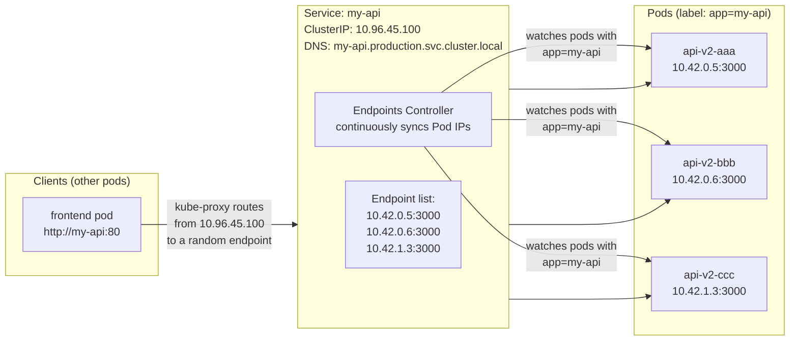

# ပြဿနာ- Pod IP တွေက ယာယီ (Ephemeral) သက်တမ်းသာ ရှိကြတယ်

Pod တိုင်းဟာ စတင် Run ချိန်မှာ random IP address တစ်ခုစီ ရကြပါတယ်။ Pod တစ်ခုက crash ဖြစ်သွားပြီး ReplicaSet controller က အစားထိုး နေရာချလိုက်တဲ့အခါ Pod အသစ်က **လုံးဝမတူတဲ့ IP address အသစ်တစ်ခု** ကို ရရှိသွားပါတယ်။ တကယ်လို့ ခင်ဗျားရဲ့ frontend က `http://10.42.0.15:3000` (backend Pod ရဲ့ IP) ကို တိုက်ရိုက်လှမ်းခေါ်နေမယ်ဆိုရင် Pod restart ဖြစ်သွားတဲ့ အချိန်မှာပဲ အဲ့ဒီ IP လိပ်စာက အလုပ်မလုပ်တော့ပါဘူး။

ဒါ့အပြင် ခင်ဗျားမှာ IP လိပ်စာအမျိုးမျိုးနဲ့ Run နေတဲ့ backend replica ၃ ခု ရှိတယ်ဆိုပါစို့။ အဲ့ဒီထဲက ဘယ် replica က request တစ်ခုချင်းစီကို ဖြေရှင်းပေးရမယ်ဆိုတာ ဘယ်သူက ဆုံးဖြတ်ပေးမှာလဲ။

**Kubernetes Service** တစ်ခုက ဒီပြဿနာ နှစ်ခုစလုံးကို အောက်ပါအတိုင်း ဖြေရှင်းပေးပါတယ်-
1. အောက်ခံ Pod တွေ ဘယ်လောက်ပဲ restart ဖြစ်ဖြစ် လုံးဝမပြောင်းလဲတဲ့ **တည်ငြိမ်တဲ့ virtual IP** (ClusterIP) တစ်ခုကို ပေးအပ်ခြင်း
2. ကျန်းမာရေးကောင်းမွန်တဲ့ pod endpoints တွေအားလုံးဆီကို **Automatic load balancing** လုပ်ပေးခြင်း
3. တည်ငြိမ်တဲ့ IP ဆီသို့ resolve လုပ်ပေးမယ့် **DNS name** တစ်ခု — cluster ထဲက ဘယ်နေရာကမဆို နမည်နဲ့ ရှာဖွေနိုင်ခြင်း

---

## Services တွေ အလုပ်လုပ်ပုံ (Under the Hood)

Service တစ်ခုဟာ traffic တွေကို ဘယ် Pod တွေဆီ လမ်းကြောင်းပေးရမིန်းဆိုတာကို သတ်မှတ်ဖို့ **label selector** ကို အသုံးပြုပါတယ်။ Endpoints controller က selector နဲ့ ကိုက်ညီတဲ့ pod တွေကို အမြဲတမ်း စောင့်ကြည့်နေပြီး Service ရဲ့ endpoint list ကို အမြဲ update လုပ်ပေးနေပါတယ်။



Pod တစ်ခုဟာ IP အသစ်နဲ့ restart ဖြစ်သွားတဲ့အခါ:
1. Endpoints controller က endpoint list ထဲက IP ဟောင်းကို ဖယ်ရှားလိုက်ပါတယ်။
2. Endpoints controller က Pod အသစ်ရဲ့ IP ကို ထည့်သွင်းပေးပါတယ် (Ready ဖြစ်သွားတာနဲ့)။
3. kube-proxy က node တိုင်းမှာရှိတဲ့ iptables rules တွေကို update လုပ်ပါတယ်။
4. Request အသစ်တွေဟာ IP အသစ်ဆီကို ရောက်သွားပြီး client ဘက်က ဘာမှ မသိလိုက်ရပါဘူး။

---

## Service Type 1: ClusterIP (Default)

**Internal-only (Cluster အတွင်းပိုင်းအတွက်သာ)**။ Service က cluster ရဲ့ network ထဲမှာပဲ ရှိတဲ့ virtual IP တစ်ခုကို ရရှိပါတယ်။ Cluster ထဲက Pod တွေကပဲ ဒါကို လှမ်းချိတ်လို့ရပြီး အပြင်ဘက်က ဘယ်ဟာမှ လှမ်းချိတ်လို့ မရပါဘူး။

```yaml
# clusterip-service.yaml
apiVersion: v1
kind: Service
metadata:
  name: my-api
  namespace: production
  labels:
    app: my-api
spec:
  type: ClusterIP          # Default — ချန်လှပ်ထားလို့ရပါတယ်
  selector:
    app: my-api            # ဒီ label ရှိတဲ့ pods တွေဆီ လမ်းကြောင်းပေးတယ်
  ports:
    - name: http
      port: 80             # Service နားထောင်မယ့် Port (တည်ငြိမ်သည်)
      targetPort: 3000     # Container အမှန်တကယ် နားထောင်မယ့် Port
      protocol: TCP
    - name: metrics
      port: 9090
      targetPort: 9090
```

```bash
kubectl apply -f clusterip-service.yaml
kubectl get svc my-api -n production
# NAME     TYPE        CLUSTER-IP      EXTERNAL-IP   PORT(S)   AGE
# my-api   ClusterIP   10.96.45.100    <none>        80/TCP    5s

# အခြား Pod တွေက ဒီ service ကို ဒီလိုလှမ်းချိတ်နိုင်ပါတယ်-
# Option A: Short name (namespace တူရင်): http://my-api
# Option B: Full DNS: http://my-api.production.svc.cluster.local
# Option C: ClusterIP တိုက်ရိုက်: http://10.96.45.100

# အခြား Pod တစ်ခုကနေ ချိတ်ဆက်မှု ရှိမရှိ စမ်းသပ်ရန်
kubectl run curl-test -n production --image=curlimages/curl --restart=Never --rm -it -- \
  curl http://my-api/health
# {"status":"ok"}
```

### Kubernetes DNS ကို နားလည်ခြင်း

CoreDNS က Services အားလုံးအတွက် automatic DNS ကို ပံ့ပိုးပေးပါတယ်-

```
Full DNS format:
<service-name>.<namespace>.svc.<cluster-domain>

Examples:
my-api.production.svc.cluster.local       # Full name၊ ဘယ် namespace ကမဆို အလုပ်လုပ်သည်
my-api.production                         # အတိုကောက် — ဘယ် namespace ကမဆို အလုပ်လုပ်သည်
my-api                                    # Namespace တူရင်သာ အလုပ်လုပ်သည် (production)

# Pod တွေလည်း DNS names တွေ ရကြပါတယ် (သိပ်မသုံးကြပါဘူး):
<pod-ip-dashes>.<namespace>.pod.cluster.local
# ဥပမာ- 10-42-0-5.production.pod.cluster.local
```

```bash
# Cluster ထဲကနေ DNS resolution ကို စစ်ဆေးရန်
kubectl run dns-test -n production --image=busybox:latest --restart=Never --rm -it -- \
  nslookup my-api
# Server:    10.96.0.10
# Address 1: 10.96.0.10 kube-dns.kube-system.svc.cluster.local
# Name:      my-api
# Address 1: 10.96.45.100 my-api.production.svc.cluster.local

# Namespace ကူးပြီး ဝင်ရောက်မှုကို စမ်းသပ်ခြင်း (frontend namespace → production)
kubectl run cross-ns-test -n frontend --image=curlimages/curl --restart=Never --rm -it -- \
  curl http://my-api.production.svc.cluster.local/health
```

---

## Service Type 2: NodePort

Node တိုင်းမှာရှိတဲ့ **high-numbered port တစ်ခုကနေတဆင့် အပြင်ဘက်ကနေ လှမ်းချိတ်နိုင်ခြင်း** ဖြစ်ပါတယ်။ NodePort service တစ်ခုကို ဖန်တီးလိုက်တဲ့အခါ cluster ထဲက node တိုင်းဟာ တူညီတဲ့ port တစ်ခုကို ဖွင့်ပေးပြီး (30000-32767 ကြား) traffic တွေကို service ရဲ့ pod တွေဆီ လမ်းကြောင်းပေးပါတယ်။

```yaml
# nodeport-service.yaml
apiVersion: v1
kind: Service
metadata:
  name: my-api-nodeport
  namespace: production
spec:
  type: NodePort
  selector:
    app: my-api
  ports:
    - port: 80              # ClusterIP port (internal access)
      targetPort: 3000      # Container port
      nodePort: 30080       # Node တိုင်းမှာ ဖွင့်မယ့် Port (30000-32767)
                            # K8s ကို random ပေးခိုင်းချင်ရင် ဒါကို ချန်လှပ်ခဲ့ပါ
```

```bash
kubectl apply -f nodeport-service.yaml
kubectl get svc my-api-nodeport -n production
# NAME              TYPE       CLUSTER-IP     EXTERNAL-IP   PORT(S)        AGE
# my-api-nodeport   NodePort   10.96.45.101   <none>        80:30080/TCP   5s

# Cluster အပြင်ဘက်ကနေ လှမ်းချိတ်ရန် (ဘယ် Node ရဲ့ IP နဲ့မဆို အစားထိုးပါ)
curl http://NODE_IP:30080/health

# NodePort traffic flow:
# Client → NodeIP:30080 → kube-proxy iptables → Pod:3000
```

<Callout type="warning" title="NodePort Is for Testing Only">
NodePort က **node တိုင်းမှာ** high-numbered port တစ်ခုကို ဖွင့်ပေးပါတယ် — ခင်ဗျားရဲ့ app ကို မrun နေတဲ့ node တွေမှာတောင် ပါပါတယ်။ ဒီမှာ SSL termination မရှိဘူး၊ hostname routing မရှိဘူး၊ rate limiting လည်း မရှိပါဘူး။ Production မှာဆိုရင် ဒီ feature တွေအားလုံးကို entry point တစ်ခုတည်းကနေ ပေးစွမ်းနိုင်တဲ့ Ingress Controller (Lesson 8) ကို အစားထိုး အသုံးပြုပါ။
</Callout>

---

## Service Type 3: LoadBalancer

**Cloud load balancer တစ်ခုကို ပြင်ဆင်ပေးပြီး** public IP/hostname တစ်ခုကို ချပေးပါတယ်။ Cloud ပတ်ဝန်းကျင်တွေမှာ TCP/HTTP မဟုတ်တဲ့ TCP/UDP services တွေကို expose လုပ်ဖို့အတွက် အသင့်တော်ဆုံး ရွေးချယ်မှု ဖြစ်ပါတယ်။

```yaml
# loadbalancer-service.yaml
apiVersion: v1
kind: Service
metadata:
  name: my-api-lb
  namespace: production
  annotations:
    # AWS-specific: internet ကို မျက်နှာမူစေရန် (internal နဲ့ မတူပါ)
    service.beta.kubernetes.io/aws-load-balancer-scheme: "internet-facing"
    # classic ELB အစား NLB ကို သုံးရန် (performance ပိုကောင်းသည်)
    service.beta.kubernetes.io/aws-load-balancer-type: "nlb"
spec:
  type: LoadBalancer
  selector:
    app: my-api
  ports:
    - port: 80
      targetPort: 3000
```

```bash
kubectl apply -f loadbalancer-service.yaml

# Cloud က external IP တစ်ခု ချပေးသည်အထိ စောင့်ပါ (AWS/GCP မှာ ၁ မိနစ်ကနေ ၃ မိနစ်အထိ ကြာတတ်သည်)
kubectl get svc my-api-lb -n production -w
# NAME        TYPE           CLUSTER-IP     EXTERNAL-IP   PORT(S)        AGE
# my-api-lb   LoadBalancer   10.96.45.102   <pending>     80:31234/TCP   10s
# my-api-lb   LoadBalancer   10.96.45.102   1.2.3.4       80:31234/TCP   2m  ← IP ရသွားပါပြီ။

# Public IP ကနေတဆင့် ချိတ်ဆက်ရန်
curl http://1.2.3.4/health
```

**LoadBalancer ကို ဘယ်အချိန်မှာ သုံးသင့်လဲ:**
- HTTP မဟုတ်တဲ့ protocol တွေကို expose လုပ်တဲ့အခါ (PostgreSQL, Redis, game servers, HTTP မပါတဲ့ gRPC)
- Service တစ်ခုအတွက် သီးသန့် dedicated IP တစ်ခု လိုချင်တဲ့အခါ
- Load balancer တစ်ခုချင်းအလိုက် ငွေပေးရတဲ့ cloud ပတ်ဝန်းကျင်မှာ run နေတဲ့အခါ

**ကုန်ကျစရိတ်ကို ထည့်သွင်းစဉ်းစားရန်**: `LoadBalancer` service တိုင်းဟာ cloud load balancer သီးသန့် တစ်ခုစီကို ဖန်တီးပေးပါတယ်-
- AWS ALB: တစ်လလျှင် ~$16-22 + data transfer
- AWS NLB: တစ်လလျှင် ~$16-22 + data transfer
- GCP Load Balancer: တစ်လလျှင် ~$18

HTTP workloads တွေအတွက်ဆိုရင် Ingress Controller ကို သုံးပါ (services တွေအားလုံး မျှသုံးမယ့် load balancer တစ်ခုတည်း)။

---

## Service Type 4: Headless Service (ClusterIP မရှိပါ)

**Headless service** တစ်ခု ဖန်တီးဖို့အတွက် `clusterIP: None` လို့ သတ်မှတ်ပေးပါ။ virtual IP အစား CoreDNS က pod IPs တွေကို တိုက်ရိုက် ပြန်ပေးပါတယ်။ Pod တိုင်းမှာ ကိုယ်ပိုင် တည်ငြိမ်တဲ့ DNS name လိုအပ်တဲ့ StatefulSets တွေအတွက် အဓိက သုံးပါတယ်။

```yaml
# headless-service.yaml (PostgreSQL StatefulSet အတွက်)
apiVersion: v1
kind: Service
metadata:
  name: postgres
  namespace: production
spec:
  clusterIP: None          # Headless — virtual IP မရှိပါ
  selector:
    app: postgres
  ports:
    - port: 5432
      targetPort: 5432
```

`postgres` လို့ခေါ်တဲ့ StatefulSet တစ်ခုအတွက် headless service ကို သုံးတဲ့အခါ:
```bash
# Pod တိုင်းက တည်ငြိမ်တဲ့ DNS name တစ်ခုစီ ရကြပါတယ်:
postgres-0.postgres.production.svc.cluster.local  # Pod 0
postgres-1.postgres.production.svc.cluster.local  # Pod 1
postgres-2.postgres.production.svc.cluster.local  # Pod 2

# Service ပေါ်မှာ DNS query လုပ်တဲ့အခါ pod IP တွေအားလုံးကို (round-robin ပုံစံနဲ့) ပြန်ပေးပါတယ်
nslookup postgres.production.svc.cluster.local
# Address: 10.42.0.15  ← pod 0
# Address: 10.42.1.5   ← pod 1
# Address: 10.42.1.6   ← pod 2
```

---

## The Endpoints Object: တကယ်တမ်း update ဖြစ်သွားတဲ့ အရာ

```bash
# Service က internal မှာ သုံးနေတဲ့ Endpoints object ကို ကြည့်ရန်
kubectl get endpoints my-api -n production
# NAME     ENDPOINTS                                   AGE
# my-api   10.42.0.5:3000,10.42.0.6:3000,10.42.1.3:3000   5m

# တကယ်လို့ Endpoints က <none> ဖြစ်နေရင် label selector က ဘယ် pod နဲ့မှ မကိုက်ညီလို့ပါ:
kubectl get endpoints my-api -n production
# NAME     ENDPOINTS   AGE
# my-api   <none>      5m

# Debug လုပ်ရန်: selector နဲ့ pod labels တွေကို နှိုင်းယှဉ်ကြည့်ပါ
kubectl get svc my-api -n production -o jsonpath='{.spec.selector}'
# {"app":"my-api"}
kubectl get pods -n production -l app=my-api --show-labels
# (output မထွက်လာရင်: label နဲ့ ကိုက်ညီတဲ့ pod မရှိပါ — selector သို့မဟုတ် pod labels တွေကို ပြင်ပါ)
```

---

## Practical: Deployment နဲ့ Service ကို တွဲသုံးခြင်း

Standard ပုံစံ — file တစ်ခုတည်းမှာပဲ အမြဲတမ်း အတူတကွ deploy လုပ်လေ့ရှိပါတယ်-

```yaml
# api-full.yaml
---
apiVersion: apps/v1
kind: Deployment
metadata:
  name: my-api
  namespace: production
spec:
  replicas: 3
  selector:
    matchLabels:
      app: my-api
  template:
    metadata:
      labels:
        app: my-api
    spec:
      containers:
        - name: api
          image: ghcr.io/youruser/my-api:v2.0.1
          ports:
            - containerPort: 3000
          readinessProbe:
            httpGet:
              path: /health
              port: 3000
            initialDelaySeconds: 5
            periodSeconds: 10
          resources:
            requests: { cpu: "100m", memory: "128Mi" }
            limits: { cpu: "500m", memory: "512Mi" }
---
apiVersion: v1
kind: Service
metadata:
  name: my-api
  namespace: production
spec:
  selector:
    app: my-api         # Deployment ရဲ့ pod labels နဲ့ တိတိကျကျ ကိုက်ညီရပါမယ်
  ports:
    - name: http
      port: 80
      targetPort: 3000
```

```bash
kubectl apply -f api-full.yaml

# Service မှာ endpoints တွေ ရှိနေပြီလားဆိုတာ စစ်ဆေးရန်
kubectl describe svc my-api -n production | grep Endpoints
# Endpoints: 10.42.0.5:3000,10.42.0.6:3000,10.42.1.3:3000

# Cluster ထဲကနေ လှမ်းစမ်းရန်
kubectl run curl -n production --image=curlimages/curl --restart=Never --rm -it -- \
  curl http://my-api/health
```

---

## Service Troubleshooting

| လက္ခဏာ (Symptom) | အကြောင်းရင်း (Cause) | ဖြေရှင်းနည်း (Fix) |
|-------------------|-------------------|-------------------|
| `Endpoints: <none>` | Label selector က pods တွေနဲ့ မကိုက်ညီပါ | `spec.selector` နဲ့ pod ရဲ့ `.metadata.labels` ကို စစ်ပါ |
| `Connection refused` | Service က port မှားတဲ့ဘက် လမ်းကြောင်းနေပါတယ် | `targetPort` က container ရဲ့ `containerPort` နဲ့ ကိုက်ညီမှု ရှိမရှိ စစ်ပါ |
| `NXDOMAIN` from DNS | Service နမည် သို့မဟုတ် namespace မှားနေပါတယ် | Full DNS ကို သုံးပါ: `service.namespace.svc.cluster.local` |
| `503 No healthy upstreams` | Pod အားလုံး readiness probe ကျရှုံးနေပါတယ် | Pod readiness probe logs များကို စစ်ဆေးပါ |
| `Connection timed out` | NetworkPolicy က traffic ကို ပိတ်ထားပါတယ် | NetworkPolicy rules များကို စစ်ဆေးပါ |
| External IP `<pending>` က အမြဲဖြစ်နေသည် | Cloud LB controller မရှိပါ (on-prem/K3s) | NodePort သို့မဟုတ် MetalLB ကို သုံးပါ |

---

## Service Summary Table

| Type | ဘယ်နေရာကနေ ချိတ်လို့ရလဲ | သုံးမည့်နေရာ | ကုန်ကျစရိတ် |
|------|------------------------|--------------|-------------|
| **ClusterIP** | Cluster ထဲကနေပဲ | Services အချင်းချင်း ချိတ်ဆက်ရန်၊ databases | အခမဲ့ |
| **NodePort** | အပြင်ဘက်ကနေ NodeIP:Port ဖြင့် | Dev/testing, အပြင်ဘက်ကနေ အမြန်ချိတ်ရန် | အခမဲ့ |
| **LoadBalancer** | အင်တာနက်ကနေ Public IP ဖြင့် | Production TCP/UDP, dedicated IPs | Cloud LB cost |
| **Headless** | Cluster ထဲကနေ၊ pod IPs တွေကို တိုက်ရိုက် | StatefulSets, Cassandra, Redis Cluster | အခမဲ့ |
| **Ingress** (နောက် သင်ခန်းစာ) | HTTP မှတဆင့် Public domain ဖြင့် | Production HTTP/HTTPS — LB တစ်ခုတည်းကို မျှသုံးရန် | Cloud LB / K3s မှာ အခမဲ့ |

---

## အကျဉ်းချုပ်

Kubernetes Services တွေဟာ Pod IP မတည်ငြိမ်တဲ့ မူလပြဿနာကို ဖြေရှင်းပေးပါတယ်-
- **ClusterIP**: cluster ထဲမှာ တည်ငြိမ်တဲ့ virtual IP + DNS name — default type ဖြစ်ပြီး service အချင်းချင်း ချိတ်ဆက်မှု အားလုံးအတွက် သုံးပါတယ်။
- **NodePort**: node တိုင်းမှာ port အမြင့်တစ်ခုကို ဖွင့်ပေးပါတယ် — testing အတွက်သာ သုံးပါတယ်။
- **LoadBalancer**: public IP ပါတဲ့ cloud load balancer တစ်ခုကို ဖန်တီးပေးပါတယ် — cloud ပတ်ဝန်းကျင်တွေမှာ HTTP မဟုတ်တဲ့ protocol တွေအတွက် သုံးပါတယ်။
- **Headless** (`clusterIP: None`): CoreDNS က pod IPs တွေကို တိုက်ရိုက် ပြန်ပေးပါတယ် — StatefulSets တွေအတွက် မရှိမဖြစ် လိုအပ်ပါတယ်။

**Label selector** က အဓိက စက်ယန္တရား ဖြစ်ပါတယ်: Endpoints controller က selector နဲ့ ကိုက်ညီတဲ့ pods တွေကို Service ရဲ့ endpoint list ထဲကို အလိုအလျောက် sync လုပ်ပေးပါတယ် — ဒါကြောင့် configuration ထပ်လုပ်စရာမလိုဘဲ service discovery ကို ဖြစ်စေပါတယ်။

ချိတ်ဆက်မှု ပြဿနာတွေကို ရှင်းတဲ့အခါ ဒီအချက်တွေကို အမြဲစစ်ပါ: `kubectl describe svc` (Endpoints ကို ကြည့်ရန်), `kubectl get pods --show-labels`, နဲ့ pod readiness probe status တို့ ဖြစ်ပါတယ်။

နောက်သင်ခန်းစာမှာတော့ ခင်ဗျားရဲ့ application configuration တွေကို container image နဲ့ သီးသန့်ခွဲထုတ်ဖို့ **ConfigMaps** နဲ့ **Secrets** တွေကို လေ့လာရမှာ ဖြစ်ပါတယ်။