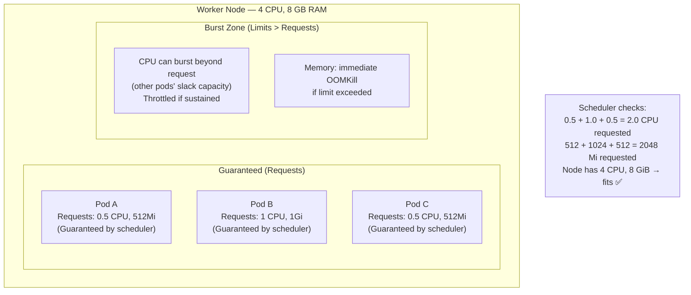
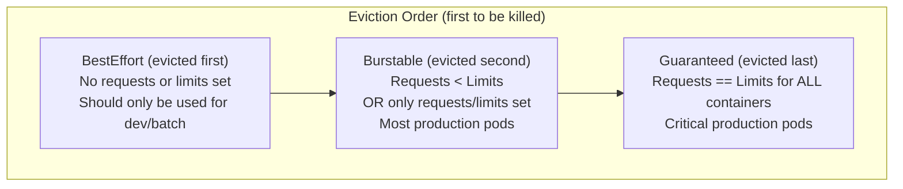

# Resource Management က ဘာကြောင့် မဖြစ်မနေ လိုအပ်တာလဲ (Why Resource Management Is Non-Negotiable)

Resource management မလုပ်ထားဘူးဆိုရင်၊ ပြဿနာရှိနေတဲ့ application တစ်ခုတည်းက node တစ်ခုပေါ်မှာရှိတဲ့ CPU နဲ့ memory အားလုံးကို ယူသုံးပစ်လိုက်နိုင်ပါတယ်။ ဒါကြောင့် အဲဒီ node ပေါ်မှာ Run နေတဲ့ အခြားသော workload တွေ အားလုံး ပျက်စီးသွားနိုင်ပါတယ်။ ဒါကို **"noisy neighbor" problem** လို့ ခေါ်ပါတယ် — memory leak ဖြစ်နေတဲ့ Pod တစ်ခု ဒါမှမဟုတ် CPU-spinning loop ထဲ ရောက်နေတဲ့ Pod တစ်ခုက machine တူတူကို သုံးနေတဲ့ တခြား unrelated services တွေကိုပါ ဆွဲချ ဖျက်ဆီးပစ်တာ ဖြစ်ပါတယ်။

Kubernetes က ဒီပြဿနာကို two-tier resource management system နဲ့ ဖြေရှင်းပေးပါတယ်: **Requests** (အာမခံချက်များ) နဲ့ **Limits** (ကန့်သတ်ချက်များ) တို့ ဖြစ်ပါတယ်။

---

## Requests vs Limits: အဓိက ကွာခြားချက်



| Setting | Used By | CPU behavior | Memory behavior |
|---------|---------|-------------|-----------------|
| **Request** | Scheduler (placement decisions) | Guaranteed minimum | Guaranteed minimum |
| **Limit** | kubelet (runtime enforcement) | Throttled (slowed down) if exceeded | **OOMKilled** (container killed) if exceeded |

**အဓိက သိရမည့်အချက်**: CPU က _compressible_ ဖြစ်ပါတယ် — process ကို မသတ်ဘဲ throttle လုပ်လို့ရပါတယ်။ Memory ကတော့ _incompressible_ ဖြစ်ပါတယ် — ကိုယ်မှာရှိတာထက် ပိုလိုရင် process ကို သတ်ပစ်ဖို့ပဲ ရှိပါတော့တယ်။

---

## CPU Units: Millicores

```
1000m  = 1 CPU core  (1 full vCPU)
 500m  = 0.5 CPU core
 250m  = 0.25 CPU core
 100m  = 0.1 CPU core  (one-tenth of a core)
  10m  = 0.01 CPU core (minimum practical granularity)

# Equivalently:
1.0    = 1 CPU core
0.5    = half a core
```

Container တစ်ခုက သူ့ရဲ့ limit ကို ကျော်သွားတဲ့အခါ kernel cgroup အဆင့်မှာ **CPU throttling** ဖြစ်သွားပါတယ်။ Container ရဲ့ process က ဆက် run နေဆဲ ဖြစ်ပေမဲ့ CPU time slices နည်းနည်းပဲ ရပါတော့တယ် — ဒါကြောင့် နှေးသွားသလို ဖြစ်လာပါတယ်။ CPU-bound app တွေ (image processing, data transformation လိုမျိုး) အတွက်ဆိုရင် throttling ဖြစ်တာက latency spikes တွေကို ဖြစ်စေပါတယ်။ I/O-bound app တွေ (အများစုသော web APIs တွေ) အတွက်ကတော့ throttling ဖြစ်တာ သိပ်ပြီး အရေးမကြီးလှပါဘူး။

## Memory Units

```
128Mi  = 128 Mebibytes  (1 Mi = 1,048,576 bytes)
256Mi  = 256 Mebibytes
512Mi  = 512 Mebibytes
1Gi    = 1 Gibibyte = 1,073,741,824 bytes
4Gi    = 4 Gibibytes

# Also valid (metric units, slightly different):
128M   = 128 Megabytes (1 M = 1,000,000 bytes)
1G     = 1 Gigabyte
```

**OOMKill** (Out of Memory Kill): container တစ်ခုရဲ့ memory သုံးစွဲမှုက သူ့ရဲ့ limit ထက် ကျော်လွန်သွားတဲ့အခါ Linux kernel က container process ဆီကို SIGKILL ကို ချက်ချင်း ပို့လိုက်ပါတယ်။ အဲဒီနောက် Kubernetes က container ကို ပြန် restart လုပ်ပေးပါတယ် (ဆက်ဖြစ်နေမယ်ဆိုရင်တော့ CrashLoopBackOff ဖြစ်သွားပါမယ်)။

---

## Deployment တစ်ခုတွင် Resources သတ်မှတ်ခြင်း

```yaml
# deployment-with-resources.yaml
apiVersion: apps/v1
kind: Deployment
metadata:
  name: my-api
  namespace: production
spec:
  replicas: 3
  selector:
    matchLabels:
      app: my-api
  template:
    metadata:
      labels:
        app: my-api
    spec:
      containers:
        - name: api
          image: ghcr.io/youruser/my-api:v2.0.1
          resources:
            requests:
              cpu: "100m"       # Guaranteed: 0.1 vCPU core
              memory: "128Mi"   # Guaranteed: 128 MB RAM
            limits:
              cpu: "500m"       # Throttled if exceeds 0.5 vCPU
              memory: "512Mi"   # OOMKilled if exceeds 512 MB
```

---

## QoS Classes: K8s က Eviction ကို ဘယ်လို Prioritize လုပ်သလဲ

Kubernetes က Pod တစ်ခုချင်းစီကို သူတို့ရဲ့ resource configuration ပေါ်မူတည်ပြီး Quality of Service (QoS) class သတ်မှတ်ပေးပါတယ်။ ဒါက node မှာ resources ကုန်သွားတဲ့အခါ ဘယ် pod တွေကို အရင် ဖြုတ်ချ (evict) ရမယ်ဆိုတာကို ဆုံးဖြတ်ပေးပါတယ်:



```yaml
# BestEffort: No resources set (don't do this in production)
resources: {}

# Burstable: requests < limits (most common in production)
resources:
  requests:
    cpu: "100m"
    memory: "128Mi"
  limits:
    cpu: "500m"
    memory: "512Mi"

# Guaranteed: requests == limits (for critical services)
resources:
  requests:
    cpu: "500m"
    memory: "512Mi"
  limits:
    cpu: "500m"     # ← Same as request
    memory: "512Mi" # ← Same as request
```

---

## Scheduler က Requests တွေကို ဘယ်လို အသုံးပြုသလဲ

Pod အသစ်တစ်ခုကို ဖန်တီးတဲ့အခါ scheduler က node တစ်ခုချင်းစီရဲ့ **allocatable** resources တွေနဲ့ your pod's requests တွေကို နှိုင်းယှဉ် စစ်ဆေးပါတယ်:

```bash
# See total allocatable resources on each node
kubectl describe node worker-1 | grep -A8 "Allocatable:"
# Allocatable:
#   cpu:               3920m     ← 4 vCPU minus OS overhead
#   memory:            7461Mi    ← 8 GiB minus OS overhead
#   pods:              110

# See what's already allocated (requests of all running pods)
kubectl describe node worker-1 | grep -A10 "Allocated resources:"
# Allocated resources:
#   Resource           Requests       Limits
#   --------           --------       ------
#   cpu                1250m (31%)    2500m (63%)
#   memory             1792Mi (24%)   3Gi (41%)

# Available for new pods:
# CPU: 3920m - 1250m = 2670m
# Memory: 7461Mi - 1792Mi = 5669Mi
```

Pod တစ်ခုရဲ့ requests က ဘယ် node မှာမဆို ရှိနေတဲ့ ပမာဏထက် ကျော်လွန်နေပြီဆိုရင် အဲဒီ Pod ဟာ **Pending** state မှာ ဆက်နေပါမယ်:
```bash
kubectl get pod my-pod -n production
# NAME     READY   STATUS    RESTARTS   AGE
# my-pod   0/1     Pending   0          3m

kubectl describe pod my-pod -n production | grep -A5 "Events:"
# Warning  FailedScheduling  default-scheduler  0/3 nodes are available:
#   3 Insufficient memory.
# Fix: reduce memory request or add a node
```

---

## LimitRange: Namespace-Wide Defaults

Pod တစ်ခုချင်းစီမှာ resources တွေ လိုက် configure လုပ်နေမယ့်အစား `LimitRange` သုံးပြီး namespace defaults တွေကို သတ်မှတ်နိုင်ပါတယ်။ Resources တိုက်ရိုက် မပါလာတဲ့ Pod တွေဟာ ဒီ defaults တွေကို အလိုအလျောက် ရရှိသွားပါမယ်:

```yaml
# limitrange.yaml
apiVersion: v1
kind: LimitRange
metadata:
  name: production-limits
  namespace: production
spec:
  limits:
    - type: Container
      # Default request (applied to containers with no request specified)
      defaultRequest:
        cpu: "100m"
        memory: "128Mi"

      # Default limit (applied to containers with no limit specified)
      default:
        cpu: "500m"
        memory: "512Mi"

      # Hard maximum per container (applying higher limits will be rejected)
      max:
        cpu: "2"
        memory: "2Gi"

      # Hard minimum per container
      min:
        cpu: "10m"
        memory: "16Mi"

    - type: Pod
      # Maximum total resources for all containers in a pod
      max:
        cpu: "4"
        memory: "4Gi"

    - type: PersistentVolumeClaim
      max:
        storage: "50Gi"     # Maximum PVC size in this namespace
      min:
        storage: "1Gi"
```

```bash
kubectl apply -f limitrange.yaml

# Verify LimitRange is active
kubectl describe limitrange production-limits -n production

# A container without resources now gets:
# Request: 100m CPU, 128Mi memory
# Limit:   500m CPU, 512Mi memory
```

---

## ResourceQuota: Namespace တစ်ခုလုံးကို ကန့်သတ်ခြင်း (Cap the Entire Namespace)

Team တစ်ခုတည်း (သို့) application တစ်ခုတည်းက cluster resources တွေကို တစ်ယောက်တည်း အကုန်ယူသုံးသွားတာမျိုး မဖြစ်အောင် ကာကွယ်ပါ:

```yaml
# resourcequota.yaml
apiVersion: v1
kind: ResourceQuota
metadata:
  name: production-quota
  namespace: production
spec:
  hard:
    # Compute resources
    requests.cpu: "10"              # Max 10 CPU cores total requested in namespace
    requests.memory: "20Gi"        # Max 20 GiB RAM total requested
    limits.cpu: "20"               # Max 20 CPU cores total limits
    limits.memory: "40Gi"          # Max 40 GiB RAM total limits

    # Object counts
    pods: "50"                     # Max 50 pods in namespace
    services: "20"                 # Max 20 services
    persistentvolumeclaims: "10"   # Max 10 PVCs
    secrets: "50"                  # Max 50 secrets
    configmaps: "50"               # Max 50 configmaps

    # Storage
    requests.storage: "200Gi"      # Max 200 GiB total PVC storage
```

```bash
kubectl apply -f resourcequota.yaml

# See current usage vs quota
kubectl describe resourcequota production-quota -n production
# Name:              production-quota
# Namespace:         production
# Resource           Used    Hard
# --------           ----    ----
# limits.cpu         2500m   20
# limits.memory      3Gi     40Gi
# pods               8       50
# requests.cpu       1250m   10
# requests.memory    1792Mi  20Gi

# If quota is exceeded, kubectl apply will fail:
# Error from server (Forbidden): error when creating "deployment.yaml":
# pods "my-api-xxx" is forbidden: exceeded quota: production-quota,
# requested: requests.memory=1Gi, used: requests.memory=19Gi, limited: requests.memory=20Gi
```

---

## လက်တွေ့ သုံးစွဲနေသည့် Resource Usage ကို တိုင်းတာခြင်း (Measuring Actual Resource Usage)

Requests နဲ့ limits တွေ မသတ်မှတ်ခင်မှာ ကိုယ့် app က တကယ်တမ်း ဘလောက်သုံးနေလဲဆိုတာကို အရင်တိုင်းတာပါ:

```bash
# Requires metrics-server to be installed
kubectl top pods -n production
# NAME               CPU(cores)   MEMORY(bytes)
# api-v2-aaa         45m          183Mi
# api-v2-bbb         52m          197Mi
# api-v2-ccc         38m          176Mi
# postgres-0         125m         512Mi

kubectl top nodes
# NAME        CPU(cores)   CPU%   MEMORY(bytes)   MEMORY%
# worker-1    450m         11%    3412Mi          43%
# worker-2    280m         7%     2048Mi          26%

# For historical data, use Prometheus PromQL:
# P95 CPU usage over the last week:
# quantile_over_time(0.95, rate(container_cpu_usage_seconds_total{container="api"}[5m])[7d:5m])
# P95 memory:
# quantile_over_time(0.95, container_memory_working_set_bytes{container="api"}[7d:5m])
```

**Resources သတ်မှတ်တဲ့နေရာမှာ သုံးရမယ့် လက်တွေ့ကျတဲ့ စည်းမျဉ်းများ (Rules of thumb):**
```
Request CPU    = metrics ကနေ ရတဲ့ P50 (median) CPU usage
Request Memory = P90 memory usage (memory က အချိန်ကြာလာတာနဲ့အမျှ တက်လာတတ်လို့ percentile ပိုမြင့်တာကို သုံးပါ)
Limit CPU      = 2-5× request (burst လုပ်ခွင့်ပေးတယ်၊ CPU throttle ဖြစ်တာက သိပ်ပြဿနာမရှိပါဘူး)
Limit Memory   = 1.5-2× request (တင်းတင်းကျပ်ကျပ်ပဲ ထားပါ — swapping လုပ်တာထက် OOMKill ဖြစ်တာက ပိုကောင်းပါတယ်)
```

---

## Resource ပြဿနာများကို ဖြေရှင်းခြင်း (Debugging Resource Issues)

### OOMKilled

```bash
kubectl get pods -n production
# NAME         READY   STATUS      RESTARTS   AGE
# api-xxx      0/1     OOMKilled   3          15m

kubectl describe pod api-xxx -n production | grep -A10 "Last State:"
# Last State:     Terminated
#   Reason:       OOMKilled
#   Exit Code:    137       ← Signal 9 (SIGKILL from kernel)
#   Started:      Mon, 18 Aug 2026 10:00:00 +0000
#   Finished:     Mon, 18 Aug 2026 10:00:30 +0000

# Fix options:
# 1. Increase the memory limit
kubectl set resources deployment/api -c api \
  --limits=memory=1Gi -n production

# 2. Find and fix the memory leak in your application
# 3. Enable Heap profiling in your app
```

### CPU Throttling (Latency Spikes)

```bash
# Check if a pod is being CPU throttled
# In Prometheus:
# rate(container_cpu_cfs_throttled_seconds_total{container="api"}[5m])
# / rate(container_cpu_cfs_periods_total{container="api"}[5m])
# If > 0.25 (25% throttled), increase CPU limit

# Or check via kubectl
kubectl exec api-xxx -n production -- cat /sys/fs/cgroup/cpu/cpu.stat
# nr_throttled: 12345  ← Number of throttled periods
# throttled_time: 123456789  ← Total nanoseconds throttled
```

### Pod Stuck ဖြစ်နေခြင်း (Pending - လုံလောက်သော Resources မရှိခြင်း)

```bash
kubectl describe pod my-pod -n production | tail -10
# Events:
#   Warning  FailedScheduling  0/3 nodes are available:
#     1 Insufficient cpu, 2 node(s) didn't match Pod's node affinity.

# Check available resources across all nodes
kubectl describe nodes | grep -A5 "Allocated resources:"

# Options:
# 1. Reduce requests in deployment.yaml
# 2. Add a new node to the cluster
# 3. Check if a PodAntiAffinity rule is unnecessarily restrictive
```

---

## Production Stack တစ်ခုအတွက် အပြည့်အစုံ Resource Configuration

```yaml
# Typical resource profile for a Node.js API:
resources:
  requests:
    cpu: "100m"      # 0.1 core — typical idle usage for a Node.js API
    memory: "200Mi"  # 200 MB — typical for a warmed-up Node process
  limits:
    cpu: "500m"      # 0.5 core — allows bursting during traffic spikes
    memory: "512Mi"  # 512 MB — tight enough to catch memory leaks early

# Typical resource profile for a PostgreSQL database:
resources:
  requests:
    cpu: "250m"      # Databases need more consistent CPU
    memory: "512Mi"  # PostgreSQL keeps indexes in shared_buffers
  limits:
    cpu: "2000m"     # Allow bursting for complex queries
    memory: "2Gi"    # Memory limit = shared_buffers + work_mem + overhead

# Typical resource profile for a Redis cache:
resources:
  requests:
    cpu: "100m"
    memory: "256Mi"
  limits:
    cpu: "500m"
    memory: "512Mi"  # Set maxmemory in Redis config to 80% of this limit
```

---

## အနှစ်ချုပ် (Summary)

Cluster တည်ငြိမ်ရေးအတွက် resource management က မရှိမဖြစ် အရေးကြီးပါတယ်:
- **Requests** = အာမခံချက် ပေးထားသော resources များဖြစ်ပြီး၊ scheduler က capacity လုံလောက်တဲ့ node တွေပေါ် Pod တွေ တင်ပေးဖို့အတွက် ဒါတွေကို သုံးပါတယ်
- **Limits** = runtime မှာ လိုက်နာစေမယ့် ကန့်သတ်ချက်များ ဖြစ်သည်; CPU က throttled ဖြစ်သွားပြီး Memory ကတော့ OOMKill ဖြစ်စေပါတယ်
- **QoS Classes**: `Guaranteed` (req=limit) က အဖျက်ခံရဆုံး နောက်ဆုံး အဆင့်ဖြစ်ပြီး၊ `BestEffort` (resources မပါတာ) က အရင်ဆုံး ဖျက်ခံရပါမယ်
- **LimitRange** က developer တွေအနေနဲ့ resource ကန့်သတ်ချက် မပါတဲ့ Pod တွေ မှားယွင်း မ run မိစေဖို့ namespace-level defaults တွေကို သတ်မှတ်ပေးပါတယ်
- **ResourceQuota** က namespace တစ်ခုလုံးရဲ့ စုစုပေါင်း သုံးစွဲမှုကို ကန့်သတ်ပေးပါတယ် — team တစ်ခုက တခြား team ရဲ့ resources တွေကို လုမစားနိုင်အောင် ကာကွယ်ပေးပါတယ်
- တန်ဖိုးတွေ မသတ်မှတ်ခင် ကိုယ့်ရဲ့ actual usage ကို အရင်ဆုံး တိုင်းတာပါ (`kubectl top pods`); CPU request အတွက် P50 ကိုသုံးပြီး memory request အတွက် P90 ကို သုံးပါ

နောက်လာမယ့် သင်ခန်းစာမှာတော့ rolling updates တွေကို ဘေးကင်းလုံခြုံစေမယ့် မူလစနစ်ဖြစ်တဲ့ **Liveness**, **Readiness**, နဲ့ **Startup** probes တွေကိုသုံးပြီး ကိုယ့်ရဲ့ containers တွေ ကျန်းမာရေး ကောင်းမကောင်း Kubernetes က ဘယ်လို ဆုံးဖြတ်သလဲဆိုတာကို သင်ယူရမှာ ဖြစ်ပါတယ်။