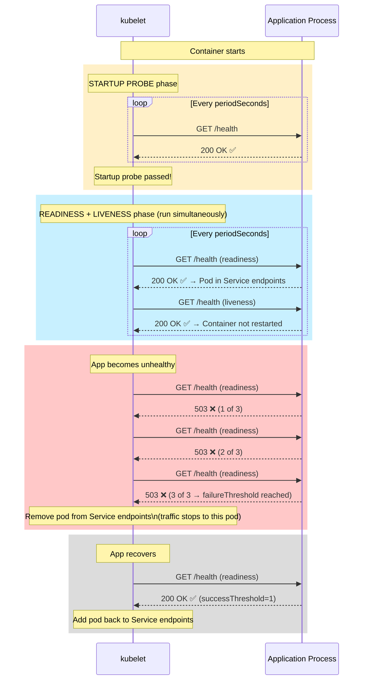
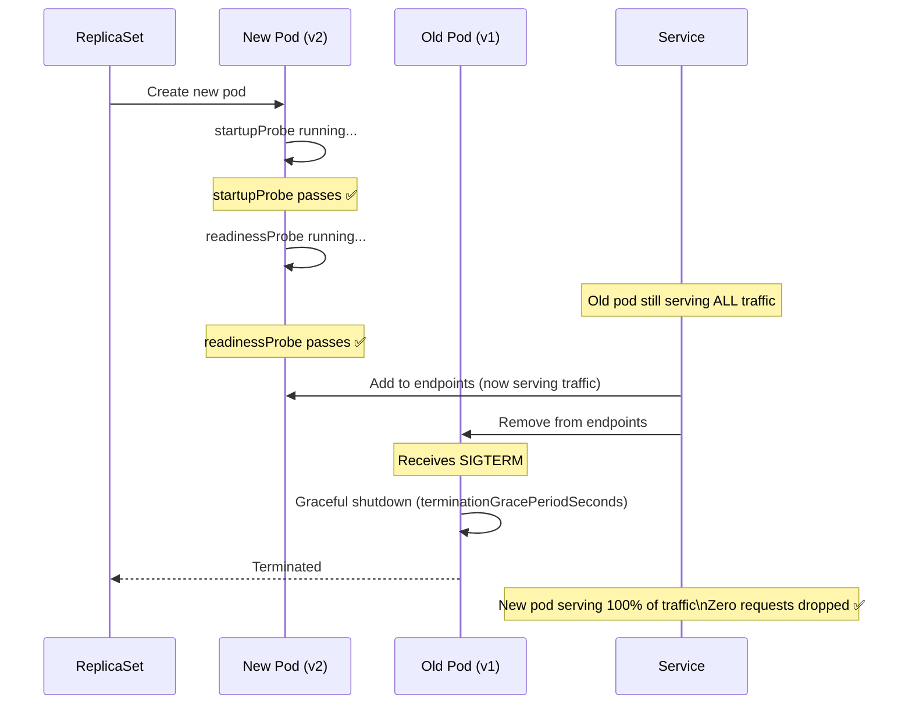

# Kubernetes က သง်၏ App 健康 (Healthy) ဖြစ်နေကြောင်း ဘယ်လိုသိသလဲ

Health probes တွေ မပါဘူးဆိုရင် Kubernetes မှာ သင့်ရဲ့ application အမှန်တကယ် အလုပ်လုပ်နေရဲ့လားဆိုတာ သိနိုင်ဖို့ နည်းလမ်းမရှိပါဘူး။ Container process က Run နေသလားဆိုတာကိုပဲ သိတာပါ — အထဲက application က ကျန်းမာရေးကောင်းရဲ့လား၊ database နဲ့ ချိတ်ဆက်နိုင်ရဲ့လား၊ Request တွေကို ဖြေကြားဖို့ အသင့်ဖြစ်နေပြီလားဆိုတာကို မသိနိုင်ပါဘူး။

Health probes တွေက Kubernetes ကို အဲ့ဒီလိုမြင်နိုင်စွမ်း (Visibility) ကို ပေးပါတယ်။

| Probe | ဖြေပေးတဲ့မေးခွန်း | Error ဖြစ်တဲ့အခါ လုပ်ဆောင်ချက် |
|-------|--------------------|--------------------|
| **Startup** | "App စတင်တာ ပြီးဆုံးသွားပြီလား?" | မအောင်မြင်မချင်း liveness/readiness ကို ဆိုင်းငံ့ထားပေးသည် |
| **Readiness** | "Traffic လက်ခံဖို့ App က အသင့်ဖြစ်ပြီလား?" | Pod ကို Service endpoints ထဲကနေ ဖြုတ်ထုတ်ပေးသည် (Traffic ရပ်သွားမည်) |
| **Liveness** | "App က အသက်ရှင်နေပြီး Deadlock ဖြစ်နေတာမျိုး မရှိဘူးလား?" | Container ကို Restart ချပေးသည် |

---

## Probes သုံးခု: Timing နှင့် Interaction



---

## Probe လုပ်ဆောင်ပုံ နည်းလမ်းများ

Kubernetes မှာ ကျန်းမာရေး စစ်ဆေးဖို့ နည်းလမ်း သုံးမျိုးကို ထောက်ပံ့ပေးထားပါတယ်:

### HTTP GET (အသုံးအများဆုံး)

```yaml
readinessProbe:
  httpGet:
    path: /health        # URL path to probe
    port: 3000           # Port (or named port like "http")
    scheme: HTTP         # HTTP or HTTPS
    httpHeaders:         # Optional custom headers
      - name: X-Health-Check
        value: kubernetes
```

Response codes `200-399` = အောင်မြင်သည်; `400+` = မအောင်မြင်ပါ။

### TCP Socket

Kubernetes က သတ်မှတ်ထားတဲ့ port ကို TCP connection ဖွင့်ဖို့ ကြိုးစားပါတယ်။ အောင်မြင်သွားရင် probe အောင်မြင်ပါတယ်။ HTTP မဟုတ်တဲ့ Server တွေအတွက် သုံးပါတယ် (Redis, PostgreSQL, gRPC):

```yaml
readinessProbe:
  tcpSocket:
    port: 5432    # PostgreSQL
```

### Exec (Shell Command)

Container ထဲမှာ Command တစ်ခုကို Run ပါတယ်။ Exit code `0` = အောင်မြင်သည်; သုညမဟုတ်ရင် = မအောင်မြင်ပါ:

```yaml
readinessProbe:
  exec:
    command:
      - /bin/sh
      - -c
      - "pg_isready -U $POSTGRES_USER -d $POSTGRES_DB"

# နောက်ထပ် ဥပမာတစ်ခု: PID file ရှိမရှိ စစ်ဆေးခြင်း
livenessProbe:
  exec:
    command:
      - /bin/sh
      - -c
      - "test -f /tmp/healthy && [ $(( $(date +%s) - $(stat -c %Y /tmp/healthy) )) -lt 30 ]"
```

### gRPC Health Check (Kubernetes 1.24+)

```yaml
readinessProbe:
  grpc:
    port: 5000
    service: "my.grpc.service"  # Optional: specific gRPC service name
```

---

## Probe Configuration Fields များ

```yaml
readinessProbe:
  httpGet:
    path: /health
    port: 3000

  # Container စတင်ပြီးနောက် ပထမဆုံး probe မစတင်ခင် ဘယ်လောက်စောင့်ရမလဲ
  # Kubernetes က Fail တယ်လို့ မသတ်မှတ်ခင် သင့် app ကို စတင်ဖို့ အချိန်ပေးပါ
  initialDelaySeconds: 5

  # Probe ကို ဘယ်လောက်ကြာမှ တစ်ခါ Run မလဲ
  periodSeconds: 10

  # Probe response ကို Fail တယ်လို့ မသတ်မှတ်ခင် ဘယ်လောက်ကြာအောင် စောင့်မလဲ
  timeoutSeconds: 3

  # ဆက်တိုက် အောင်မြင်မှု ဘယ်နှစ်ကြိမ်ပြည့်မှ အောင်မြင်တယ်လို့ ယူဆမလဲ (ပုံမှန်အားဖြင့် 1)
  successThreshold: 1

  # အရေးယူဆောင်ရွက်မှု မလုပ်ခင် ဆက်တိုက် မအောင်မြင်မှု ဘယ်နှစ်ကြိမ် ဖြစ်ရမလဲ
  failureThreshold: 3
  # Error ဖြစ်တဲ့အထိ ကြာမြင့်ချိန်: periodSeconds × failureThreshold = 10 × 3 = 30 စက္ကန့်
```

---

## Startup Probe: စတင်ချိန်ကြာသော Applications များအတွက်

**Startup Probe မပါရင် ဖြစ်လာမယ့် ပြဿနာ:**
သင့် App က စတင်ဖို့ စက္ကန့် 60 ကြာတယ်ဆိုပါစို့ (models တွေ load လုပ်တာ၊ caches တွေ warm up လုပ်တာ၊ migrations တွေ run တာ)၊ ပြီးတော့ liveness probe က စက္ကန့် 30 မှာ အလုပ်လုပ်ပြီး fail သွားမယ်ဆိုရင် Kubernetes က container ကို restart ချလိုက်မှာပါ — အဲ့ဒါက စက္ကန့် 60 စတင်ချိန်ကို ပြန်စသွားစေပါမယ်။ အဲဒီလိုနဲ့ အဆုံးမရှိတဲ့ restart loop ထဲမှာ ပိတ်မိနေပါလိမ့်မယ်။

**ဖြေရှင်းချက်: Startup Probe**

Startup probe က startup probe အောင်မြင်သွား ترထိ liveness နဲ့ readiness probes တွေကို ဆိုင်းငံ့ထားပေးပါတယ်။ သူ့မှာ ပိုပြီး အချိန်ပေးထားတဲ့ သီးသန့် timing ရှိပါတယ်:

```yaml
spec:
  containers:
    - name: slow-starter
      image: my-app:v2
      
      # Startup probe: စတင်ဖို့အတွက် အများဆုံး ၂ မိနစ်အထိ အချိန်ပေးသည်
      # (failureThreshold=24 × periodSeconds=5 = အများဆုံး ၁၂၀ စက္ကန့်)
      startupProbe:
        httpGet:
          path: /health
          port: 3000
        failureThreshold: 24    # လက်မလျှੋခင် အကြိမ် ၂၄ ကြိမ်အထိ ခွင့်ပြုသည်
        periodSeconds: 5        # ၅ စက္ကန့်တစ်ကြိမ် စစ်ဆေးသည်
        # စုစုပေါင်း startup budget: 24 × 5 = 120 စက္ကန့်

      # Readiness နှင့် Liveness တို့သည် startup probe အောင်မြင်ပြီးမှသာ စတင်သည်
      readinessProbe:
        httpGet:
          path: /health
          port: 3000
        initialDelaySeconds: 0  # နှောင့်နှေးစရာ မလိုပါ — startup probe က စောင့်ပြီးသားဖြစ်သည်
        periodSeconds: 10
        failureThreshold: 3

      livenessProbe:
        httpGet:
          path: /health
          port: 3000
        initialDelaySeconds: 0
        periodSeconds: 30
        failureThreshold: 3
```

---

## Readiness Probe: မကျန်းမာသော Pod များကို Traffic ထဲမှ ဖယ်ရှားခြင်း

Readiness probe က pod တစ်ခုဟာ သူ့ရဲ့ Service ဆီကနေ traffic လက်ခံရရှိမလားဆိုတာကို ထိန်းချုပ်ပါတယ်။ Readiness probe failသွားတဲ့ pod တစ်ခုကို **Service ရဲ့ endpoint list ထဲကနေ ဖယ်ရှားလိုက်ပါတယ်** — Request တွေ သူ့ဆီ လမ်းကြောင်းလွှဲပို့တာ ရပ်သွားပါပြီ။

**အဓိက အသုံးဝင်ပုံများ:**
1. **Rolling updates** — pod အသစ်ဟာ readiness အောင်မြင်မှသာ traffic စတင်လက်ခံရရှိမည်
2. **Database connectivity** — DB ကျသွားရင် pod က unready ဖြစ်သွားမည် (traffic ရပ်သွားပြီး ဆက်တိုက် error တက်တာကို ကာကွယ်ပေးသည်)
3. **Circuit breaking** — ဝန်ပိုနေတဲ့ pod တွေက သူတို့ capacity ပြည့်နေပြီဆိုတာကို အချက်ပြနိုင်သည်

```yaml
readinessProbe:
  httpGet:
    path: /ready    # အသေးစိတ်သိနိုင်ရန် /health အစား သီးသန့် /ready endpoint ကို သုံးပါ:
    port: 3000      # /ready က DB connectivity, cache warm-up စတာတွေကို စစ်ဆေးသည်
                    # /health က process အသက်ရှင်နေသေးလား စစ်ဆေးသည်

  initialDelaySeconds: 5   # Container စတင်ပြီး ၅ စက္ကန့်အကြာမှာ စစစ်သည်
  periodSeconds: 10        # ၁၀ စက္ကန့်တစ်ကြိမ် စစ်ဆေးသည်
  timeoutSeconds: 3        # ၃ စက္ကန့်အတွင်း response မလာရင် fail မည်
  successThreshold: 1      # ၁ ကြိမ်အောင်မြင်တာနဲ့ = ပြန်လည် ready ဖြစ်သည်
  failureThreshold: 3      # ၃ ကြိမ် fail တာနဲ့ = service endpoints ထဲကနေ ဖြုတ်မည်
```

### သင့်လျော်သော Health Endpoint တစ်ခုကို ဖန်တီးခြင်း

```typescript
// app/api/health/route.ts (Next.js App Router)
import { pool } from "@/lib/db";
import { NextResponse } from "next/server";

export async function GET() {
  const health = {
    status: "ok",
    timestamp: new Date().toISOString(),
    version: process.env.APP_VERSION ?? "unknown",
    checks: {} as Record<string, { status: string; latencyMs?: number }>,
  };

  // Check database connectivity
  try {
    const start = Date.now();
    await pool.query("SELECT 1");
    health.checks.database = {
      status: "connected",
      latencyMs: Date.now() - start,
    };
  } catch (err) {
    health.status = "degraded";
    health.checks.database = { status: "disconnected" };
  }

  // Add more checks: Redis, external APIs, etc.

  const statusCode = health.status === "ok" ? 200 : 503;
  return NextResponse.json(health, { status: statusCode });
}
```

ဒီ Endpoint က:
- အရာရာ အဆင်ပြေနေတဲ့အခါ `200` ကို Return ပြန်တယ် → Pod က Service endpoints ထဲမှာ ဆက်ရှိနေမယ်
- DB ကျနေတဲ့အခါ `503` ကို Return ပြန်တယ် → Pod ကို Service endpoints ထဲကနေ ဖြုတ်ချလိုက်မယ်
- Database ချိတ်ဆက်မှု မရှိတော့တဲ့ Pod ဆီကို ဝင်လာမယ့် Request တွေ ရောက်မသွားအောင် ကာကွယ်ပေးတယ်

---

## Liveness Probe: Deadlock ဖြစ်နေသော Container များကို Restart ချခြင်း

Liveness probe က "ဒီ container က အခုထိ အသက်ရှင်နေသေးလား?" ဆိုတာကို ဖြေပေးပါတယ်။ အကယ်၍ သူက `failureThreshold` အကြိမ်ရေ ပြည့်အောင် fail ခဲ့မယ်ဆိုရင် kubelet က container ကို **ဖျက်ဆီးပြီး Restart ချလိုက်ပါမယ်**။

ဒါတွေကို ရှာဖွေဖို့ liveness probes ကို သုံးပါ:
- **Deadlocks** — Process က run နေပေမယ့် request တွေကို မလုပ်ဆောင်ပေးနိုင်တော့တာ
- **Infinite loops** — Process က အလုပ်များနေပေမယ့် အသုံးဝင်တာ ဘာမှ မလုပ်နေတာ
- **Resource exhaustion** — Process က အသက်ရှင်နေပေမယ့် file descriptors ကုန်သွားတာ

```yaml
livenessProbe:
  httpGet:
    path: /health     # Endpoint တူတူသုံးလို့ရပါတယ် — process က response ပြန်နိုင်မလား စစ်ဖို့ပါပဲ
    port: 3000
  
  initialDelaySeconds: 30   # Readiness အောင်မြင်ပြီးနောက် liveness မစခင် App ကို စက္ကန့် ၃၀ အချိန်ပေးပါ
  periodSeconds: 30         # စက္ကန့် ၃၀ တစ်ကြိမ် စစ်ဆေးသည် (readiness ထက် အကြိမ်ရေ နည်းသည်)
  timeoutSeconds: 5
  failureThreshold: 3       # ဆက်တိုက် ၃ ကြိမ် fail မှ Restart ချသည် (အလုပ်မလုပ်တာ ၉၀ စက္ကန့်ကြာလျှင်)
```

<Callout type="warning" title="Liveness ကို အလွန်အမင်း တင်းကျပ်လွန်းအောင် မလုပ်ပါနဲ့">
`failureThreshold: 1` သို့မဟုတ် `timeoutSeconds: 1` လို့ သတ်မှတ်လိုက်တယ်ဆိုတာ Response နှေးတာနဲ့ သင့် container restart ချခံရတော့မယ်လို့ ဆိုလိုတာပါပဲ။ Traffic တက်လာတဲ့အချိန်မှာ သင့် pod က နှေးနေပေမယ့် ကျန်းမာနေဆဲ ဖြစ်နိုင်ပါတယ် — အလွန်တင်းကျပ်တဲ့ liveness probe က restart ချလိုက်ခြင်းအားဖြင့် အခြေအနေကို ပိုဆိုးသွားစေပါတယ်။

**အကြံပြုချက်**: `failureThreshold: 3` နဲ့ `periodSeconds: 30` လို့ သတ်မှတ်ပါ — App က ၉၀ စက္ကန့်တိတိ Response လုံးဝမပေးနိုင်တော့မှသာ restart ချပါ။
</Callout>

---

## ပြီးပြည့်စုံသော Production Probe Configuration

```yaml
# ပုံမှန် Node.js/Go/Java API တစ်ခုအတွက် အကောင်းဆုံး Best practice configuration:
spec:
  containers:
    - name: api
      image: my-api:v2.0.1
      
      # Startup probe: app စတင်ဖို့အတွက် အများဆုံး စက္ကန့် 60 အထိ အချိန်ပေးသည်
      # (DB connections, cache warm-up, migration check)
      startupProbe:
        httpGet:
          path: /health
          port: 3000
        failureThreshold: 12   # 12 × 5s = 60s
        periodSeconds: 5

      # Readiness probe: 10s တစ်ကြိမ်စစ်သည်၊ 3 ကြိမ်လွတ်သွားရင် fail မည် (30s)
      # ထိန်းချုပ်သည့်အရာ: ဒီ pod က traffic လက်ခံနေသလား?
      readinessProbe:
        httpGet:
          path: /health
          port: 3000
        initialDelaySeconds: 0   # Startup probe က နှောင့်နှေးမှုကို ကိုင်တွယ်ပြီးပါပြီ
        periodSeconds: 10
        timeoutSeconds: 3
        successThreshold: 1
        failureThreshold: 3

      # Liveness probe: 30s တစ်ကြိမ်စစ်သည်၊ 3 ကြိမ်လွတ်သွားရင် restart ချမည် (90s)
      # ထိန်းချုပ်သည့်အရာ: ဒီ container ကို ဖျက်ပြီး restart ချသင့်သလား?
      livenessProbe:
        httpGet:
          path: /health
          port: 3000
        initialDelaySeconds: 0
        periodSeconds: 30
        timeoutSeconds: 5
        successThreshold: 1
        failureThreshold: 3
```

---

## Probes နှင့် Rolling Updates: လုံခြုံရေး ပိုက်ကွန်



**Readiness probes မပါရင်**: Kubernetes က Pod အသစ်ကို `Running` ဖြစ်တာနဲ့ traffic တွေကို ချက်ချင်း လမ်းကြောင်းလွှဲပို့ပါတယ် — ဒါပေမဲ့ အဲ့ဒီအချိန်မှာ App က database နဲ့ ချိတ်ဆက်လို့ မပြီးသေးဖြစ်နိုင်ပါတယ်။ ရလဒ်အနေနဲ့ သုံးစွဲသူတွေ error တက်တာ ကြုံရပါမယ်။

**Readiness probes ပါရင်**: Readiness check မှာ `200 OK` ပြန်မှသာ Traffic တွေ Pod အသစ်ဆီကို ရောက်သွားပါမယ်။ Update လုပ်နေစဉ်အတွင်း သုံးစွဲသူတွေ မြင်ရမယ့် error လုံးဝ မရှိတော့ပါဘူး။

---

## Probe Fail တာတွေကို Debug လုပ်ခြင်း

```bash
# Pod က CrashLoopBackOff ဖြစ်နေသည် — liveness probe ကြောင့် အကြိမ်ကြိမ် restart ကျနေသည်
kubectl describe pod api-xxx -n production | grep -A15 "Events:"
# Warning  Unhealthy  Liveness probe failed: HTTP probe failed with statuscode: 500
# Warning  Killing    Container api failed liveness probe, will be restarted

# Pod က traffic မရရှိတော့ပါ (0/1 READY မှာ ရပ်နေသည်)
kubectl describe pod api-xxx -n production | grep -A5 "Conditions:"
# ContainersReady: False
# Events:
# Warning  Unhealthy  Readiness probe failed: connection refused 127.0.0.1:3000

# Container ထဲမှာ Port 3000 ကို ဘာက နားထောင်နေလဲ?
kubectl exec api-xxx -n production -- ss -tlnp | grep 3000
# ဘာမှမရှိရင်: app က port ကို bind လုပ်ဖို့ မအောင်မြင်ပါ

# Health endpoint ကို ကိုယ်တိုင် စမ်းသပ်ကြည့်ရန်
kubectl exec api-xxx -n production -- wget -qO- http://localhost:3000/health
# သို့မဟုတ်
kubectl exec api-xxx -n production -- curl -s http://localhost:3000/health

# Port-forward လုပ်ပြီး သင့်လက်ပ်တော့မှ စမ်းရန်
kubectl port-forward pod/api-xxx 3000:3000 -n production
curl http://localhost:3000/health
```

---

## အနှစ်ချုပ်

Health probes ဆိုတာ Kubernetes ကို Production အတွက် လုံခြုံစိတ်ချရစေတဲ့ နည်းလမ်းဖြစ်ပါတယ်:

| Probe | အလုပ်လုပ်ချိန် | Error ဖြစ်တဲ့အခါ လုပ်ဆောင်ချက် | အဓိက အသုံးပြုပုံ |
|-------|-------------|----------------|-------------|
| **Startup** | Container စစချင်းကနေ အောင်မြင်တဲ့အထိ | အခြား probes တွေကို ဆိုင်းငံ့ထားသည်; `failureThreshold` မှာ restart ချသည် | စတင်ချိန်ကြာသော App များ (Java၊ AI models) |
| **Readiness** | Startup probe အောင်မြင်ပြီးနောက်၊ အဆက်မပြတ် | Pod ကို Service endpoints ထဲကနေ ဖြုတ်သည် | Rolling updates၊ Traffic စီမံခန့်ခွဲခြင်း |
| **Liveness** | Startup probe အောင်မြင်ပြီးနောက်၊ အဆက်မပြတ် | Container ကို ဖျက်ပြီး restart ချသည် | Deadlock ပြန်လည်ကောင်းမွန်စေရန် |

Production Best practices များ:
- တကယ့် dependencies တွေ (DB, cache) ကို စစ်ဆေးပေးတဲ့ `/health` endpoint တစ်ခုကို အမြဲထည့်ပါ
- Production workload တွေအတွက် probes သုံးခုစလုံးကို သုံးပါ
- Liveness အတွက် `failureThreshold: 3` နဲ့ သင့်လျော်တဲ့ `periodSeconds` ကို သုံးပါ — အလွန်အမင်း တင်းကျပ်တဲ့ restart တွေကို ရှောင်ပါ
- စတင်ဖို့ စက္ကန့် ၂၀ ထက်ပိုကြာတဲ့ App တိုင်းအတွက် `startupProbe` ကို သုံးပါ

နောက်သင်ခန်းစာမှာတော့ **PersistentVolumes** နဲ့ **PersistentVolumeClaims** တွေကို သုံးပြီး သင့်ရဲ့ stateful workloads တွေအတွက် တာရှည်ခံ Storage တွေကို ဘယ်လိုပေးရမလဲဆိုတာကို သင်ယူရမှာ ဖြစ်ပါတယ်။