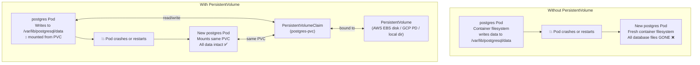
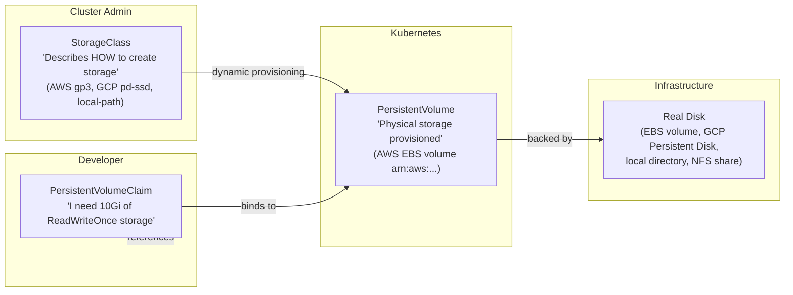

# Containers တွေမှာ Persistent Storage ဘไมိ လိုအပ်တာလဲ

Container ရဲ့ filesystem တွေက **ephemeral** ဖြစ်တယ် — ဆိုလိုတာက container တစ်ခု restart ဖြစ်သွားတဲ့အခါ (crash ဖြစ်တာ၊ update လုပ်တာ၊ node migration ဖြစ်တာစတာတွေကြောင့်) container ရဲ့ filesystem ထဲမှာ ရေးထားတဲ့ file တိုင်း ပျောက်သွားပါတယ်။ API လိုမျိုး stateless applications တွေအတွက် ဒါက ပြဿနာမရှိပေမယ့်၊ database တွေအတွက်တော့ ဒါဟာ ဆိုးရွားတဲ့ ပျက်စီးဆုံးရှုံးမှုတစ်ခု ဖြစ်လာပါလိမ့်မယ်။



---

## Storage Abstraction Layers များ

Kubernetes ဟာ "ဘာ storage တွေ ရနိုင်လဲ" ဆိုတာကို application တစ်ခုက "ဘာ storage လိုအပ်လဲ" ဆိုတာနဲ့ ခွဲခြားပေးထားပါတယ်-



### Layer ၃ ခုရဲ့ ရှင်းလင်းချက်များ

**StorageClass**: storage ရဲ့ "class" ကို သတ်မှတ်ပေးပါတယ် — provisioner, performance tier, reclaim policy နဲ့ topology constraints တွေကို ဖော်ပြပေးပါတယ်။ Cluster admin တွေက တစ်ခါပဲ ဖန်တီးပေးရပြီး၊ developer တွေက PVC တွေထဲမှာ လှမ်းညွှန်းသုံးစွဲကြပါတယ်။

**PersistentVolume (PV)**: တကယ့် physical storage ကို ကိုယ်စားပြုပါတယ်။ Cloud cluster တွေမှာဆိုရင် PVC တင်လိုက်တာနဲ့ StorageClass ကနေ automatic ဖန်တီးပေးပါတယ် (dynamic provisioning)။ On-prem cluster တွေမှာတော့ admin တွေက လက်နဲ့ ဖန်တီးပေးရပါတယ်။

**PersistentVolumeClaim (PVC)**: Developer သို့မဟုတ် application တစ်ခုက storage တောင်းဆိုတာ (storage request) ဖြစ်ပါတယ်။ ဘယ်လောက် storage အရွယ်အစားလိုလဲ၊ ဘယ်လို access mode လိုလဲဆိုတာတွေကို သတ်မှတ်ပေးပါတယ်။ Kubernetes volume controller က ဒါနဲ့ ကိုက်ညီတဲ့ PV ကို ရှာပေးပြီး ချိတ်ဆက်ပေးပါတယ် (သို့မဟုတ် PV အသစ် ဖန်တီးပေးပါတယ်)။

---

## StorageClasses များ

```bash
# List available StorageClasses
kubectl get storageclass
# NAME                   PROVISIONER              RECLAIMPOLICY   VOLUMEBINDINGMODE
# standard (default)     kubernetes.io/gce-pd     Delete          Immediate
# premium-rwo            pd.csi.storage.gke.io    Delete          WaitForFirstConsumer
# local-path             rancher.io/local-path    Delete          WaitForFirstConsumer ← K3s default

# Mark a StorageClass as default
kubectl patch storageclass local-path \
  -p '{"metadata":{"annotations":{"storageclass.kubernetes.io/is-default-class":"true"}}}'
```

### Platform အလိုက် သုံးလေ့ရှိသော StorageClasses များ

| Platform | StorageClass Name | Disk Type | ဘယ်အရာအတွက် သုံးလဲ |
|----------|------------------|-----------|---------|
| **AWS EKS** | `gp3` | GP3 SSD | ယေဘုယျ သုံးစွဲရန် |
| **AWS EKS** | `io1` | Provisioned IOPS | Performance မြင့်မားသော databases များအတွက် |
| **GKE** | `standard-rwo` | Balanced PD | ယေဘုယျ သုံးစွဲရန် |
| **GKE** | `premium-rwo` | SSD PD | Low-latency workloads များအတွက် |
| **AKS** | `managed-premium` | Azure Premium SSD | ယေဘုယျ / databases များအတွက် |
| **K3s** | `local-path` | Local node disk | Single-node dev/prod အတွက် |

---

## PersistentVolumeClaims များ

### PVC တစ်ခု ဖန်တီးခြင်း

```yaml
# postgres-pvc.yaml
apiVersion: v1
kind: PersistentVolumeClaim
metadata:
  name: postgres-pvc
  namespace: production
spec:
  accessModes:
    - ReadWriteOnce     # အောက်ပါ Access Modes ဇယားကို ကြည့်ပါ
  storageClassName: gp3  # K3s အတွက်ဆိုလျှင် "local-path" ကို သုံးပါ
  resources:
    requests:
      storage: 20Gi    # Storage 20 GiB တောင်းဆိုသည်
```

### Access Modes များ

| Mode | အတိုကောက် | အဓိပ္ပာယ် | ဘယ်အရာအတွက် သုံးလဲ |
|------|-------------|---------|---------|
| `ReadWriteOnce` | RWO | **node** တစ်ခုတည်းကသာ ဖတ်ရန် + ရေးရန် | PostgreSQL, MySQL နှင့် အများစုသော databases များ |
| `ReadOnlyMany` | ROX | Node အများအပြားက ဖတ်ရှုရန် | Shared config, static assets များ |
| `ReadWriteMany` | RWX | Node အများအပြားက ဖတ်ရန် + ရေးရန် | NFS, AWS EFS — shared uploads, logs များ |
| `ReadWriteOncePod` | RWOP | **pod** တစ်ခုတည်းကသာ ဖတ်ရန် + ရေးရန် (K8s 1.22+) | အရေးကြီးသော single-writer workloads များ |

<Callout type="warning" title="ReadWriteOnce ဆိုတာ Pod တစ်ခုတည်းလို့ မဆိုလိုပါ">
`ReadWriteOnce` ဆိုတာက volume ကို ရေးသားဖို့အတွက် **node** တစ်ခုတည်းကသာ mount လုပ်လို့ရတယ်လို့ ဆိုလိုတာပါ — Pod တစ်ခုတည်းလို့ ဆိုလိုတာ မဟုတ်ပါဘူး။ အကယ်၍ **node တစ်ခုတည်းပေါ်မှာရှိတဲ့** pod နှစ်ခုက PVC တစ်ခုတည်းကို လှမ်းညွှန်းနေမယ်ဆိုရင် (worker-1 ပေါ်မှာ နှစ်ခုစလုံး deploy လုပ်ထားရင်ပေါ့) နှစ်ခုစလုံးက mount လုပ်လို့ရပါတယ်။ ဒါပေမယ့် node အမျိုးမျိုးပေါ်က pod တွေကတော့ မရပါဘူး။

ဒါကြောင့်မို့လို့ databases တွေဟာ RWO storage နဲ့ဆိုရင် `replicas: 1` ကို သုံးရတာဖြစ်ပြီး၊ Kubernetes 1.22+ ကို သုံးနေတယ်ဆိုရင် `ReadWriteOncePod` ကို သုံးနိုင်ပါတယ်။
</Callout>

---

## Deployment တစ်ခုတွင် PVC ကို အသုံးပြုခြင်း

```yaml
# postgres-deployment.yaml
apiVersion: apps/v1
kind: Deployment
metadata:
  name: postgres
  namespace: production
spec:
  replicas: 1      # ReadWriteOnce သုံးလျှင် မဖြစ်မနေ 1 ဖြစ်ရပါမည် — writer တစ်ခုတည်းသာ ခွင့်ပြုသည်
  selector:
    matchLabels:
      app: postgres
  template:
    metadata:
      labels:
        app: postgres
    spec:
      containers:
        - name: postgres
          image: postgres:16-alpine
          ports:
            - containerPort: 5432
          env:
            - name: POSTGRES_USER
              valueFrom:
                secretKeyRef:
                  name: postgres-secret
                  key: POSTGRES_USER
            - name: POSTGRES_PASSWORD
              valueFrom:
                secretKeyRef:
                  name: postgres-secret
                  key: POSTGRES_PASSWORD
            - name: POSTGRES_DB
              valueFrom:
                secretKeyRef:
                  name: postgres-secret
                  key: POSTGRES_DB
            # PostgreSQL ကို subdirectory တစ်ခု သုံးရန် ညွှန်ကြားခြင်း ("directory not empty" အမှားများကို ရှောင်ရှားရန်)
            - name: PGDATA
              value: /var/lib/postgresql/data/pgdata

          resources:
            requests: { cpu: "250m", memory: "512Mi" }
            limits: { cpu: "2000m", memory: "2Gi" }

          readinessProbe:
            exec:
              command: ["pg_isready", "-U", "$(POSTGRES_USER)"]
            initialDelaySeconds: 10
            periodSeconds: 10
            failureThreshold: 5

          volumeMounts:
            - name: postgres-storage
              mountPath: /var/lib/postgresql/data   # PostgreSQL data ရေးမည့်နေရာ

      volumes:
        - name: postgres-storage
          persistentVolumeClaim:
            claimName: postgres-pvc   # ကျွန်ုပ်တို့ ဖန်တီးခဲ့သော PVC ကို ညွှန်းဆိုပါ
```

```bash
# PVC ကို အရင် apply လုပ်ပါ၊ ပြီးမှ deployment ကို apply လုပ်ပါ
kubectl apply -f postgres-pvc.yaml
kubectl apply -f postgres-deployment.yaml

# PVC status ကို စစ်ဆေးပါ (pod မစတင်မီ Bound ဖြစ်နေရပါမည်)
kubectl get pvc -n production
# NAME            STATUS   VOLUME                                     CAPACITY   ACCESS MODES
# postgres-pvc    Bound    pvc-a1b2c3d4-...                          20Gi       RWO

# Dynamically provision ဖြစ်လာသော PV ကို စစ်ဆေးပါ
kubectl get pv
# NAME                                       CAPACITY   ACCESS MODES   RECLAIM POLICY   STATUS
# pvc-a1b2c3d4-...                           20Gi       RWO            Delete           Bound

# Postgres pod running ဖြစ်နေပြီး data တွေ save ဖြစ်နေကြောင်း အတည်ပြုပါ
kubectl exec -n production deployment/postgres -- psql -U appuser -d myapp -c "SELECT version();"
```

---

## StatefulSets: Databases များအတွက် အသင့်တော်ဆုံး Tool

`StatefulSet` ဆိုတာ Deployment နဲ့ တူပေမယ့် stateful workloads တွေအတွက် အထူးဒီဇိုင်းထုတ်ထားတာ ဖြစ်ပါတယ်။ အောက်ပါတို့ကို ပံ့ပိုးပေးပါတယ်-

1. **တည်ငြိမ်သော Pod နာမည်များ (Stable Pod names)**: `postgres-0`, `postgres-1` (random hashes တွေ မဟုတ်ပါ)
2. **တည်ငြိမ်သော DNS နာမည်များ (Stable DNS names)**: `postgres-0.postgres.production.svc.cluster.local`
3. **အစဉ်လိုက် ဖန်တီးခြင်း/ဖျက်ခြင်း (Ordered pod creation/deletion)**: pod-1 မစတင်မီ pod-0 က Ready ဖြစ်နေရပါမည်
4. **Replica တစ်ခုချင်းစီအတွက် storage**: `volumeClaimTemplates` မှတဆင့် replica တစ်ခုချင်းစီတိုင်းအတွက် PVC သီးသန့် ရရှိစေပါတယ်

```yaml
# postgres-statefulset.yaml
apiVersion: apps/v1
kind: StatefulSet
metadata:
  name: postgres
  namespace: production
spec:
  serviceName: postgres        # headless Service နာမည်နှင့် တူရပါမည်
  replicas: 1                  # single-node အတွက် 1; HA PostgreSQL အတွက် operator ကို သုံးပါ
  selector:
    matchLabels:
      app: postgres
  
  template:
    metadata:
      labels:
        app: postgres
    spec:
      containers:
        - name: postgres
          image: postgres:16-alpine
          ports:
            - containerPort: 5432
          env:
            - name: POSTGRES_USER
              valueFrom:
                secretKeyRef: { name: postgres-secret, key: POSTGRES_USER }
            - name: POSTGRES_PASSWORD
              valueFrom:
                secretKeyRef: { name: postgres-secret, key: POSTGRES_PASSWORD }
            - name: POSTGRES_DB
              valueFrom:
                secretKeyRef: { name: postgres-secret, key: POSTGRES_DB }
            - name: PGDATA
              value: /var/lib/postgresql/data/pgdata
          
          resources:
            requests: { cpu: "250m", memory: "512Mi" }
            limits: { cpu: "2000m", memory: "2Gi" }
          
          readinessProbe:
            exec:
              command: ["pg_isready", "-U", "appuser"]
            initialDelaySeconds: 10
            periodSeconds: 10
          
          volumeMounts:
            - name: postgres-data    # volumeClaimTemplate နာမည်ကို ညွှန်းဆိုသည်
              mountPath: /var/lib/postgresql/data

  # Replica တစ်ခုချင်းစီအတွက် PVC ကို automatic ဖန်တီးပေးသည်
  volumeClaimTemplates:
    - metadata:
        name: postgres-data          # PVC နာမည် ရှေ့ဆက် (prefix)
      spec:
        accessModes: ["ReadWriteOnce"]
        storageClassName: local-path  # (သို့) AWS ပေါ်တွင် gp3
        resources:
          requests:
            storage: 20Gi
  # ဖန်တီးပေးမည့် PVC များ:
  # postgres-data-postgres-0  (postgres-0 အတွက်)
  # postgres-data-postgres-1  (postgres-1 အတွက်၊ replicas=2 ဖြစ်လျှင်)
```

```bash
# လိုအပ်ချက်: တည်ငြိမ်သော DNS နာမည်များအတွက် headless Service
kubectl apply -f - <<EOF
apiVersion: v1
kind: Service
metadata:
  name: postgres
  namespace: production
spec:
  clusterIP: None         # Headless
  selector:
    app: postgres
  ports:
    - port: 5432
EOF

kubectl apply -f postgres-statefulset.yaml

# StatefulSet က pods တွေကို အစဉ်လိုက် ဖန်တီးပေးသည်: ပထမဆုံး postgres-0၊ ပြီးမှ postgres-1
kubectl get pods -n production -w
# NAME         READY   STATUS    RESTARTS   AGE
# postgres-0   0/1     Pending   0          2s
# postgres-0   0/1     Running   0          5s
# postgres-0   1/1     Running   0          15s   ← postgres-1 မစတင်မီ Ready ဖြစ်ရပါမည်

# PVC တွေကို automatic ဖန်တီးပေးသည် (replica တစ်ခုလျှင် တစ်ခုစီ)
kubectl get pvc -n production
# NAME                     STATUS   VOLUME            CAPACITY   ACCESS MODES
# postgres-data-postgres-0 Bound    pvc-abc...        20Gi       RWO

# Pod တစ်ခုချင်းစီအတွက် DNS နာမည်များ
# postgres-0.postgres.production.svc.cluster.local
# postgres-1.postgres.production.svc.cluster.local
```

---

## PVC Reclaim Policy

PVC တစ်ခုကို ဖျက်လိုက်တဲ့အခါ မူလအခြေခံ data တွေ ဘာဖြစ်သွားမလဲ။

| Reclaim Policy | ဘာဖြစ်သွားလဲ | ဘယ်အချိန်မှာ သုံးမလဲ |
|---------------|-------------|-------------|
| `Delete` | Cloud disk ပါ **ဖျက်ပစ်သည်** (data လုံးဝ ပျောက်သွားသည်) | Cloud ပေါ်ရှိ default ဖြစ်သည် — ephemeral test environments များအတွက် |
| `Retain` | Disk ကို ဆက်လက် ထိန်းသိမ်းထားသည် (လူကိုယ်တိုင် ရှင်းလင်းရန် လိုအပ်သည်) | Production — data တွေ မတော်တဆ မဆုံးရှုံးစေရန် အသေအချာ လုပ်ဆောင်ခြင်း |
| `Recycle` | Volume ကို ရှင်းလင်းပြီး ပြန်သုံးနိုင်အောင် လုပ်ပေးသည် (deprecated ဖြစ်သွားပြီ) | အသုံးမပြုပါနှင့် |

```bash
# သင့် StorageClass ရဲ့ reclaim policy ကို စစ်ဆေးပါ
kubectl get storageclass gp3 -o jsonpath='{.reclaimPolicy}'
# Delete  ← Cloud StorageClass အများစုအတွက် default ဖြစ်သည် — သတိထားပါ!

# Retain policy ပါသော StorageClass တစ်ခု ဖန်တီးပါ
kubectl apply -f - <<EOF
apiVersion: storage.k8s.io/v1
kind: StorageClass
metadata:
  name: gp3-retain
provisioner: ebs.csi.aws.com
parameters:
  type: gp3
reclaimPolicy: Retain          # ← PVC ကို ဖျက်လိုက်သည့်အခါ disk ကို မဖျက်ပါနှင့်
volumeBindingMode: WaitForFirstConsumer
allowVolumeExpansion: true
EOF
```

---

## PVC တစ်ခုကို ချဲ့ထွင်ခြင်း (Online Resize)

```bash
# StorageClass က expansion ကို ပံ့ပိုးမှု ရှိမရှိ စစ်ဆေးပါ
kubectl get storageclass gp3 -o jsonpath='{.allowVolumeExpansion}'
# true

# 20Gi မှ 50Gi သို့ ချဲ့ထွင်ပါ (edit လုပ်ပြီး ပြန် apply လုပ်ပါ)
kubectl patch pvc postgres-pvc -n production \
  -p '{"spec":{"resources":{"requests":{"storage":"50Gi"}}}}'

# Cloud volumes များအတွက် ချဲ့ထွင်ခြင်းကို online ဖြင့် လုပ်ဆောင်ပေးသည် (downtime မရှိပါ)
kubectl get pvc postgres-pvc -n production
# NAME           STATUS   VOLUME   CAPACITY   ACCESS MODES
# postgres-pvc   Bound    pvc-...  50Gi       RWO   ← ချဲ့ထွင်ပြီးပါပြီ!
```

---

## PVC ပြဿနာဖြေရှင်းခြင်း (Troubleshooting)

```bash
# PVC က Pending အနေအထားဖြင့် ငြိမ်နေခြင်း
kubectl describe pvc postgres-pvc -n production
# Events:
#   Warning  ProvisioningFailed  no persistent volumes available for this claim
# → StorageClass မရှိခြင်း (သို့) provisioner အလုပ်မလုပ်ခြင်း

# StorageClass ရှိမရှိ စစ်ဆေးပါ
kubectl get storageclass

# WaitForFirstConsumer ပါသော PVC သည် Pending ဖြစ်နေခြင်း
kubectl get pvc postgres-pvc -n production
# STATUS: Pending  ← ပုံမှန်ပါပဲ! Pod တစ်ခုက အသုံးပြုမှသာ bind ဖြစ်ပါလိမ့်မယ်

# Mount လုပ်ထားသော volume ပေါ်တွင် Container က "Permission denied" ဖြင့် crash ဖြစ်ခြင်း
# ဖြေရှင်းရန်: container ရဲ့ user နဲ့ ကိုက်ညီအောင် fsGroup ကို သတ်မှတ်ပါ
spec:
  securityContext:
    fsGroup: 999   # official image ထဲမှာ PostgreSQL က UID 999 နဲ့ run ပါတယ်
```

---

## PVC Data များအတွက် Backup ဗျူဟာများ

```bash
# ရွေးချယ်စရာ A: pg_dump (PostgreSQL အတွက် အကြံပြုသည်)
kubectl exec -n production postgres-0 -- \
  pg_dump -U appuser myapp --format=custom > /backup/myapp-$(date +%Y%m%d).dump

# ရွေးချယ်စရာ B: Velero — PVC တွေ အပါအဝင် cluster တစ်ခုလုံးကို backup လုပ်ခြင်း
velero backup create daily-backup \
  --include-namespaces production \
  --snapshot-volumes \
  --wait

# ရွေးချယ်စရာ C: Cloud provider snapshot (AWS EBS snapshot)
aws ec2 create-snapshot \
  --volume-id vol-xxxx \   # သင့် PVC ကို support ပေးထားသော EBS volume
  --description "postgres-pvc-$(date +%Y%m%d)"
```

---

## အနှစ်ချုပ်

Kubernetes storage က stateful workloads တွေအတွက် ခိုင်မာသော persistence ကို ပံ့ပိုးပေးပါတယ်-
- **Container filesystems တွေက ephemeral ဖြစ်ပါတယ်** — pod restart ဖြစ်တာကို ခံနိုင်ရည်ရှိရမယ့် data တိုင်းအတွက် PVC ကို အမြဲတမ်း သုံးပါ
- **StorageClass** က storage ဘယ်လို ဖန်တီးရမလဲဆိုတာကို ညွှန်ပြပေးပါတယ် (provisioner, disk type, reclaim policy)
- **PVC** က သင့်ရဲ့ storage တောင်းဆိုချက်ဖြစ်ပါတယ် — Kubernetes က ကိုက်ညီတဲ့ PV ကို dynamic provision လုပ်ပေးပါတယ်
- Single-instance databases တွေအတွက် `replicas: 1` ပါတဲ့ **Deployment** ကို သုံးပါ؛ HA သို့မဟုတ် clustered databases တွေအတွက် **StatefulSet** ကို သုံးပါ
- Databases တွေအတွက် **`ReadWriteOnce`** (node တစ်ခု) က default ဖြစ်ပါတယ်؛ shared media uploads တွေအတွက် **`ReadWriteMany`** (NFS/EFS) ကို သုံးပါ
- **Reclaim policy `Retain`** က production data တွေကို မတော်တဆ ဖျက်ဆီးမိခြင်းမှ ကာကွယ်ပေးပါတယ်
- Database backups တွေအတွက် `pg_dump` (သို့) Velero ကို အမြဲတမ်း သုံးပါ — filesystem snapshots တွေက မတည်ငြိမ်တဲ့ state တွေကို ဖမ်းယူမိနိုင်ပါတယ်

နောက်ဆုံး သင်ခန်းစာမှာတော့ zero-downtime rolling updates နဲ့ instant rollbacks တွေကို ကျွမ်းကျင်အောင် သင်ယူရမှာ ဖြစ်ပါတယ် — ဒါဟာ ဒီသင်တန်းမှာ သင်ယူခဲ့သမျှတွေရဲ့ အထွတ်အထိပ်ပဲ ဖြစ်ပါတယ်။