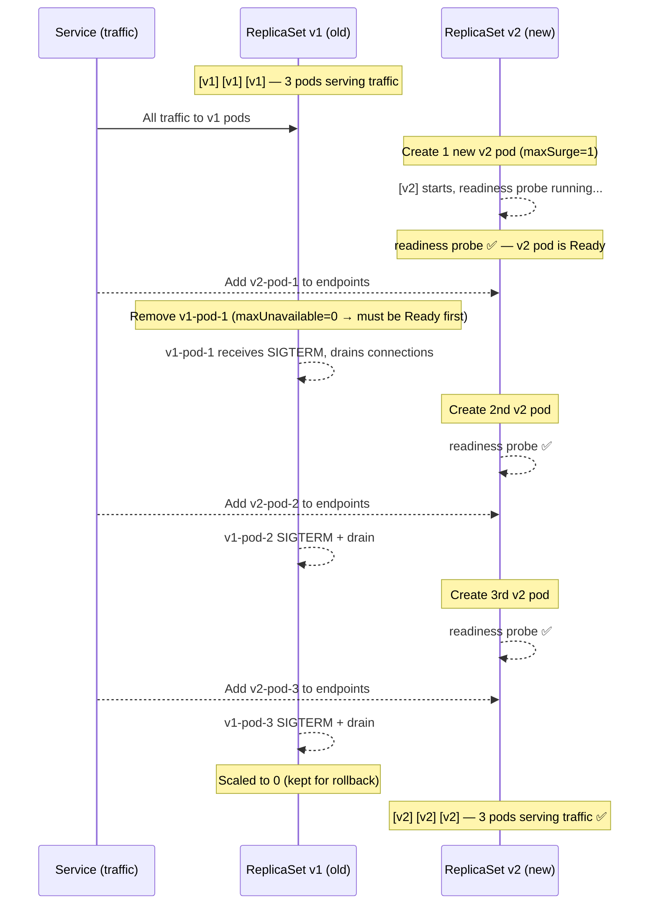
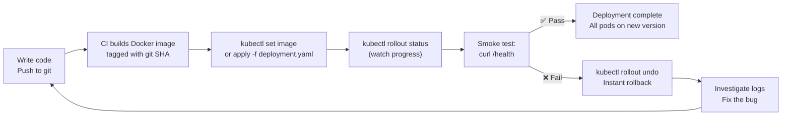

# The Goal: Ship Code Without Dropping a Single Request

Production Application တစ်ခုကို running လုပ်နေရင်းနဲ့ User တွေရဲ့ Connection တွေ မပြတ်တောက်စေဘဲ update လုပ်နိုင်စွမ်းက Kubernetes ရဲ့ အကောင်းဆုံး Features တွေထဲက တစ်ခုဖြစ်ပါတယ်။ Maintenance windows တွေ မလိုတော့ဘူး။ "ည ၃ နာရီမှ deploy လုပ်မယ်" ဆိုတာမျိုး မရှိတော့ဘူး။ Service တွေကို Manual ပြန် restart ချဖို့ အလ급တလော လုပ်စရာ မလိုတော့ဘူး။ `kubectl apply` လိုက်ရုံနဲ့ ကျန်တာတွေကို Kubernetes က ရှင်းပေးသွားလိမ့်မယ်။

ဒီ Lesson မှာတော့ Deployment Lifecycle အပြည့်အစုံကို လေ့လာသွားမှာ ဖြစ်ပါတယ် - Strategy Configuration လုပ်နည်း၊ Update တွေ Trigger လုပ်နည်း၊ Progress Monitor လုပ်နည်း၊ Rolliout ကြားထဲမှာ Pause လုပ်နည်းနဲ့ တစ်ခုခုမှားယွင်းသွားတဲ့အခါ Instant Rollback လုပ်နည်း စတာတွေ ပါဝင်ပါတယ်။

---

## How Rolling Updates Work: A Visual Walkthrough

`replicas: 3`၊ `maxSurge: 1`၊ `maxUnavailable: 0` ပါတဲ့ Deployment တစ်ခုအတွက် ကြည့်ရအောင်:



အဆင့်တိုင်းမှာ Service ဟာ **Ready** ဖြစ်နေတဲ့ Pod တွေကိုပဲ Traffic ပို့ပေးပါတယ်။ User တွေအနေနဲ့ Ready မဖြစ်သေးတဲ့ (သို့) Terminating ဖြစ်နေတဲ့ Pod ဆီကို Request ရောက်သွားတာမျိုး ဘယ်တော့မှ မကြုံရပါဘူး။

---

## Step 1: Configure the Strategy

Production Deployment တိုင်းမှာ Update Strategy ကို သေချာ Define လုပ်ထားသင့်ပါတယ်:

```yaml
apiVersion: apps/v1
kind: Deployment
metadata:
  name: my-api
  namespace: production
  annotations:
    # Always document the change — appears in `kubectl rollout history`
    kubernetes.io/change-cause: "v2.0.0: Initial deployment"
spec:
  replicas: 3

  strategy:
    type: RollingUpdate     # Default strategy
    rollingUpdate:
      maxSurge: 1           # How many extra pods can exist above `replicas` during update
                            # Can be a number (1) or percentage ("33%")
      maxUnavailable: 0     # How many pods can be unavailable during update
                            # Set to 0 for zero-downtime guarantee

  # Keep 10 old ReplicaSets (for rollback to specific revision)
  revisionHistoryLimit: 10

  # A pod must be Ready for this long before counting as "available"
  # Prevents premature "success" signals for slow-warming apps
  minReadySeconds: 10

  selector:
    matchLabels:
      app: my-api

  template:
    metadata:
      labels:
        app: my-api
    spec:
      # Give the app 30 seconds to finish in-flight requests after SIGTERM
      terminationGracePeriodSeconds: 30

      containers:
        - name: api
          image: ghcr.io/youruser/my-api:v2.0.0
          ports:
            - containerPort: 3000

          resources:
            requests: { cpu: "100m", memory: "128Mi" }
            limits: { cpu: "500m", memory: "512Mi" }

          # readinessProbe is the SAFETY NET for rolling updates
          # Traffic only goes to pods that pass this probe
          readinessProbe:
            httpGet:
              path: /health
              port: 3000
            initialDelaySeconds: 5
            periodSeconds: 10
            failureThreshold: 3

          startupProbe:
            httpGet:
              path: /health
              port: 3000
            failureThreshold: 12
            periodSeconds: 5
```

### Understanding maxSurge and maxUnavailable

```
replicas: 3, maxSurge: 1, maxUnavailable: 0

At any point during update:
  Max pods running:     3 + 1 = 4  (replicas + maxSurge)
  Min pods available:   3 - 0 = 3  (replicas - maxUnavailable)
  → 3 pods always Ready and serving traffic ✅

replicas: 10, maxSurge: "25%", maxUnavailable: "25%"
  Max pods running:     10 + 3 = 13  (rounded up)
  Min pods available:   10 - 3 = 7   (rounded down)
  → Faster update (3 pods replaced at once) but 3 unavailable at a time
```

---

## Step 2: Trigger the Rolling Update

### Method A: Declarative (Preferred for GitOps)

`deployment.yaml` ကို Edit လုပ်ပါ၊ Image tag ကို ပြောင်းပါ၊ ပြီးရင် Apply လုပ်ပါ:

```bash
# Edit deployment.yaml: change image tag from v2.0.0 → v2.1.0
# Then apply with change-cause annotation
kubectl apply -f deployment.yaml && \
  kubectl annotate deployment/my-api \
    kubernetes.io/change-cause="v2.1.0: Add search endpoint, fix pagination" \
    -n production --overwrite
```

### Method B: Imperative (Quick Updates, CI/CD)

```bash
# Update the image directly (used by CI/CD pipelines)
kubectl set image deployment/my-api api=ghcr.io/youruser/my-api:v2.1.0 -n production

# Always annotate changes for audit history
kubectl annotate deployment/my-api \
  kubernetes.io/change-cause="v2.1.0: Add search endpoint" \
  -n production --overwrite
```

### Method C: Force Rolling Restart (Same Image, No Code Change)

တစ်ခါတလေ Pod အားလုံးကို Restart ချပေးဖို့ လိုအပ်တတ်ပါတယ် (ဥပမာ- ConfigMap Env vars အသစ်တွေကို ယူဖို့၊ In-memory state တွေကို Clear လုပ်ဖို့):

```bash
# Triggers a rolling restart without changing any spec field
kubectl rollout restart deployment/my-api -n production

# This works because it adds/updates a "restartedAt" annotation to the pod template
# causing the Deployment controller to see it as a changed spec → triggers new RS
```

---

## Step 3: Monitor the Rollout

```bash
# === Real-time rollout progress ===
kubectl rollout status deployment/my-api -n production
# Waiting for deployment "my-api" rollout to finish: 0 of 3 updated replicas are available...
# Waiting for deployment "my-api" rollout to finish: 1 of 3 updated replicas are available...
# Waiting for deployment "my-api" rollout to finish: 2 of 3 updated replicas are available...
# deployment "my-api" successfully rolled out ✅

# === Watch pods being replaced ===
kubectl get pods -n production -l app=my-api -w
# NAME               READY   STATUS              RESTARTS   AGE
# my-api-v1-aaa      1/1     Running             0          5d
# my-api-v1-bbb      1/1     Running             0          5d
# my-api-v1-ccc      1/1     Running             0          5d
#                                          ← Update triggered
# my-api-v2-xxx      0/1     ContainerCreating   0          2s
# my-api-v2-xxx      0/1     Running             0          5s   ← starting
# my-api-v2-xxx      1/1     Running             0          15s  ← readiness ✅
# my-api-v1-aaa      1/1     Terminating         0          5d   ← old pod dying
# my-api-v2-yyy      0/1     ContainerCreating   0          1s
# ... (repeats for each replica)

# === Check deployment status in detail ===
kubectl describe deployment my-api -n production | grep -A15 "Conditions:"
# Conditions:
#   Type           Status  Reason
#   ----           ------  ------
#   Available      True    MinimumReplicasAvailable
#   Progressing    True    ReplicaSetUpdated (during update)
#   Progressing    True    NewReplicaSetAvailable (after completion)

# === See old and new ReplicaSets ===
kubectl get rs -n production -l app=my-api
# NAME              DESIRED   CURRENT   READY   AGE
# my-api-v2-xxx     3         3         3       5m   ← NEW (active)
# my-api-v1-yyy     0         0         0       5d   ← OLD (kept for rollback)
```

---

## Step 4: Rollout History and Rollback

```bash
# View all revisions (shows change-cause annotation)
kubectl rollout history deployment/my-api -n production
# REVISION  CHANGE-CAUSE
# 1         v2.0.0: Initial deployment
# 2         v2.0.1: Fix DB connection pooling
# 3         v2.1.0: Add search endpoint, fix pagination

# Inspect a specific revision's pod spec
kubectl rollout history deployment/my-api --revision=2 -n production
# Shows the full pod template for revision 2 (image version, env vars, etc.)

# === ROLLBACK ===

# Option A: Rollback to immediately previous revision
kubectl rollout undo deployment/my-api -n production
# deployment.apps/my-api rolled back

# Option B: Rollback to a specific revision
kubectl rollout undo deployment/my-api --to-revision=2 -n production

# Monitor rollback (same as a forward update — rolling, zero downtime)
kubectl rollout status deployment/my-api -n production

# Verify we're now running the old image
kubectl get pods -n production -l app=my-api -o jsonpath='{.items[0].spec.containers[0].image}'
# ghcr.io/youruser/my-api:v2.0.1  ← rolled back ✅
```

---

## Step 5: Pause and Resume (Mid-Rollout Canary)

မလုပ်ခင်မှာ Version အသစ်ကို Traffic အနည်းငယ်နဲ့ Manual Test လုပ်ချင်ရင် Rollout ကို Pause လုပ်လို့ရပါတယ်:

```bash
# Trigger update
kubectl set image deployment/my-api api=ghcr.io/youruser/my-api:v2.1.0 -n production

# Immediately pause after 1 pod is updated (you now have 1 v2.1 pod + 2 v2.0 pods)
kubectl rollout pause deployment/my-api -n production

# Now check: 1 of 3 pods is v2.1, serving ~33% of traffic
kubectl get pods -n production -l app=my-api
# NAME               READY   STATUS    IMAGE
# my-api-v2.1-xxx    1/1     Running   my-api:v2.1.0  ← new
# my-api-v2.0-yyy    1/1     Running   my-api:v2.0.1  ← old
# my-api-v2.0-zzz    1/1     Running   my-api:v2.0.1  ← old

# Monitor the new pod's error rate for 10-15 minutes
# kubectl logs my-api-v2.1-xxx -n production -f
# Check Grafana dashboards for error spikes

# If v2.1.0 looks good → resume
kubectl rollout resume deployment/my-api -n production
# Remaining pods updated to v2.1.0

# If v2.1.0 has problems → rollback (even while paused)
kubectl rollout undo deployment/my-api -n production
```

---

## The Recreate Strategy (With Downtime)

Version နှစ်ခုကို တစ်ပြိုင်နက် Run လို့မရတဲ့ Application တွေအတွက် (ဥပမာ- Database Schema တွေ အချင်းချင်း မကိုက်ညီတာမျိုး):

```yaml
spec:
  strategy:
    type: Recreate      # Stop ALL old pods, THEN start new pods
    # No rollingUpdate section needed
```

```
Timeline with Recreate:
1. All v1 pods terminated (service goes down)
2. [downtime begins]
3. All v2 pods start
4. v2 pods pass readiness
5. [downtime ends — service restores]

Typical downtime: 10-60 seconds
Use only when: running DB migrations that MUST run before the new app version
```

---

## Production Deployment Workflow (CI/CD Integration)

`kubectl` ကို အသုံးပြုထားတဲ့ Complete GitHub Actions Workflow တစ်ခု:

```yaml
# .github/workflows/deploy.yml
name: Deploy to Production
on:
  push:
    branches: [main]

jobs:
  deploy:
    runs-on: ubuntu-latest
    steps:
      - uses: actions/checkout@v4

      - name: Build and push Docker image
        env:
          IMAGE: ghcr.io/${{ github.repository_owner }}/my-api
          TAG: ${{ github.sha }}
        run: |
          docker build -t $IMAGE:$TAG .
          echo ${{ secrets.GITHUB_TOKEN }} | docker login ghcr.io -u ${{ github.actor }} --password-stdin
          docker push $IMAGE:$TAG

      - name: Configure kubectl
        uses: azure/k8s-set-context@v3
        with:
          kubeconfig: ${{ secrets.KUBECONFIG }}

      - name: Deploy to production
        env:
          IMAGE: ghcr.io/${{ github.repository_owner }}/my-api
          TAG: ${{ github.sha }}
        run: |
          # Update image and annotate
          kubectl set image deployment/my-api api=$IMAGE:$TAG -n production
          kubectl annotate deployment/my-api \
            kubernetes.io/change-cause="$TAG: ${{ github.event.head_commit.message }}" \
            -n production --overwrite

          # Wait for rollout with timeout
          kubectl rollout status deployment/my-api -n production --timeout=5m

      - name: Smoke test new version
        run: |
          # Hit the health endpoint to verify the new version is serving
          curl -f https://api.yourdomain.com/health || exit 1

      - name: Rollback on failure
        if: failure()
        run: |
          kubectl rollout undo deployment/my-api -n production
          echo "🚨 Deployment failed — rolled back to previous version"
```

---

## Deployment Checklist Before Going Live

Production Deployment မလုပ်ခင် ဒါတွေ စစ်ဆေးပါ:

- [ ] **Image tag is immutable** — `latest` ကို ဘယ်တော့မှ မသုံးဘဲ Specific SHA (သို့) SemVer Tag ကို သုံးပါ။
- [ ] **Readiness probe is configured** — မပါရင် Rolling Updates တွေက မလုံခြုံပါဘူး။
- [ ] **`terminationGracePeriodSeconds`** ကို In-flight requests တွေ ပြီးဆုံးအောင် စောင့်ပေးဖို့ Setting ထည့်ထားပါ။
- [ ] **`minReadySeconds`** ကို Ready ဖြစ်ပြီးပြီးချင်း Error တက်လာတဲ့ Pod တွေကို ဖမ်းမိနိုင်ဖို့ Set လုပ်ထားပါ။
- [ ] **`maxUnavailable: 0`** ကို Zero downtime သေချာစေဖို့ Set လုပ်ထားပါ။
- [ ] **`revisionHistoryLimit`** ကို Set လုပ်ထားပါ (Default က 10 ပါ) — Rollback History တွေ သိမ်းထားဖို့ပါ။
- [ ] **`kubernetes.io/change-cause`** ကို Annotate လုပ်ထားပါ — Human-readable Audit trail ဖြစ်စေဖို့ပါ။
- [ ] **Database migrations are backward-compatible** — App ဗားရှင်းအဟောင်းက Schema အသစ်နဲ့ အလုပ်လုပ်နိုင်ရပါမယ်။
- [ ] **Rollback procedure is documented** — Error တက်ရင် ဘယ် Command ရေးရမလဲ Team က သိထားရပါမယ်။
- [ ] **Monitoring dashboards are open** — Rollout လုပ်နေစဉ်နဲ့ ပြီးသွားချိန်တွေမှာ Error Rate တွေကို စောင့်ကြည့်ပါ။

---

## Troubleshooting Stuck Rollouts

```bash
# === Rollout hangs at "X of N replicas are available" ===

# Step 1: Find which pods aren't becoming Ready
kubectl get pods -n production -l app=my-api
# new pods showing 0/1 or not appearing = problem with new version

# Step 2: Check new pod events
kubectl describe pod my-api-NEWREPLICA-xxx -n production | tail -20
# Common causes:
# - ImagePullBackOff → wrong image tag or missing registry credentials
# - CrashLoopBackOff → app crashing on startup (check logs)
# - Readiness probe failing → app started but not healthy (DB connection issues?)

# Step 3: Check logs of the new (failing) pod
kubectl logs my-api-NEWREPLICA-xxx -n production

# Step 4: If the rollout is taking too long, abort and rollback
kubectl rollout undo deployment/my-api -n production

# === "Rollout stuck due to deployment quota exceeded" ===
kubectl describe deployment my-api -n production
# "Cannot create pod: pods 'my-api-xxx' is forbidden: exceeded quota"
# Fix: increase ResourceQuota or reduce replicas
```

---

## Summary: The Complete Deployment Lifecycle



Zero-downtime Deployments တွေ အောင်မြင်ဖို့ အဓိက အချက် ၄ ချက် ပေါင်းစပ်လုပ်ဆောင်ဖို့ လိုပါတယ်:
1. **`maxUnavailable: 0`** — Pod အသစ် Ready မဖြစ်သေးခင် Pod အဟောင်းကို ဘယ်တော့မှ မဖျက်ပါနဲ့။
2. **Readiness probe** — Pod အသစ်တွေ Ready ဖြစ်မှသာ Traffic လက်ခံပါမယ်။
3. **`terminationGracePeriodSeconds`** — Pod အဟောင်းတွေ မသေခင် In-flight requests တွေကို အရင်အဆုံးသတ်စေပါတယ်။
4. **`minReadySeconds`** — Available လို့ မရေတွက်ခင် Pod တွေ N စက္ကန့်တိတိ Stable ဖြစ်နေရပါမယ်။

**ဂုဏ်ယူပါတယ် — Kubernetes Basics Course ကို အောင်မြင်စွာ ပြီးဆုံးသွားပါပြီ!**

အခုဆိုရင် သင်ဟာ Kubernetes ရဲ့ မူလသဘောတရားတွေဖြစ်တဲ့ Architecture၊ CLI၊ Pods၊ Deployments၊ Services၊ ConfigMaps၊ Secrets၊ Ingress၊ Resource Management၊ Health Probes၊ Storage နဲ့ Rolling Updates တွေကို နက်နက်နဲနဲ နားလည်သွားပါပြီ။ Production Kubernetes Workloads တွေကို တည်ဆောက်ပြီး Run ဖို့ အဆင်သင့်ဖြစ်နေပါပြီ — နောက်ထပ် Course တစ်ခုအနေနဲ့ **K3s** သုံးပြီး Lightweight Production Clusters တွေ Run တဲ့အကြောင်း ဆက်လက်လေ့လာနိုင်ပါပြီ။