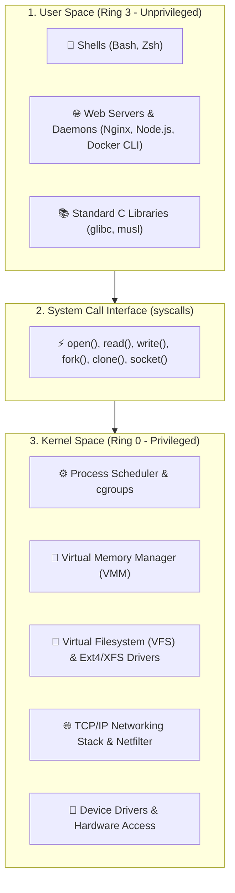
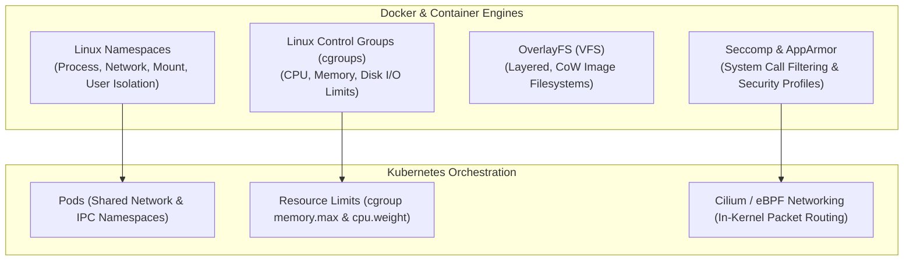

# Why Linux Is the Backbone of Modern Infrastructure

ကမ္ဘာပေါ်ရှိ ထိပ်တန်း web server **၉၆% ကျော်**၊ ထိပ်တန်း supercomputer ၅၀၀ ရဲ့ ၁၀၀%၊ Android device အားလုံးနဲ့ public cloud instance တော်တော်များများ (AWS EC2, Google Cloud Compute, Azure VMs) ဟာ Linux ပေါ်မှာ အလုပ်လုပ်နေကြပါတယ်။ သင်ဟာ DevOps၊ Site Reliability Engineering (SRE)၊ Cloud Architecture ဒါမှမဟုတ် Backend Engineering ဘက်မှာ လုပ်ကိုင်နေတယ်ဆိုရင် Linux က မရှိမဖြစ်ပါ — ဒါဟာ internet ရဲ့ operating system ဖြစ်ပါတယ်။

```mermaid
flowchart TD
    APP["🚀 Web Applications\n(Node.js, Go, Python, Java)"]
    CONTAINER["🐳 Container Engine\n(Docker, containerd, runc)"]
    ORCHESTRATION["☸️ Cluster Orchestration\n(Kubernetes, K3s)"]
    CLOUD["☁️ Cloud Infrastructure\n(AWS EC2, GCP Compute, Azure Linux)"]
    KERNEL["🐧 Linux Kernel\n(Namespaces, cgroups, eBPF, TCP/IP, VFS)"]

    APP --> CONTAINER --> ORCHESTRATION --> CLOUD --> KERNEL

    style KERNEL fill:#1e3a5f,stroke:#3b82f6,stroke-width:2px
```



---

## 1. Linux Architecture: Kernel vs. User Space

Linux ဟა ၁၉၉၁ ခုနှစ်မှာ **Linus Torvalds** ဖန်တီးခဲ့တဲ့ operating system kernel တစ်ခု ဖြစ်ပါတယ်။ အပြည့်အစုံပါတဲ့ operating system မှာ သီးခြားလည်ပတ်နေတဲ့ အပိုင်းနှစ်ပိုင်း ပါဝင်ပါတယ်-



- **Kernel Space (Ring 0)**: ရုပ်ဝတ္ထုပိုင်းဆိုင်ရာ CPU၊ memory၊ disk နဲ့ network interface card (NIC) တွေကို တိုက်ရိုက်နဲ့ ကန့်သတ်ချက်မရှိ ဝင်ရောက်အသုံးပြုနိုင်တဲ့ core software ဖြစ်ပါတယ်။
- **User Space (Ring 3)**: သင့်ရဲ့ Application တွေ၊ shell တွေ (`bash`၊ `zsh`)၊ system daemon တွေ (`systemd`၊ `ssh`) နဲ့ development tool တွေ သီးသန့်လုံခြုံတဲ့ mode နဲ့ Run တဲ့နေရာ ဖြစ်ပါတယ်။ Application တွေဟာ kernel ရဲ့ လုပ်ဆောင်ချက်တွေကို **system calls** (`syscalls`) တဆင့် လုံခြုံစွာ တောင်းဆိုကြပါတယ်။

---

## 2. The Linux Distribution (Distro) Landscape

Linux kernel က open source (GPLv2) ဖြစ်တဲ့အတွက် အဖွဲ့အစည်းအမျိုးမျိုးက kernel ကို package manager တွေ၊ core utility တွေနဲ့ system software တွေပေါင်းစပ်ပြီး **Distributions** အဖြစ် ထုတ်လုပ်ကြပါတယ်။

| Distro Family | Package Manager | Init System | Primary Use Cases | Examples |
| :--- | :--- | :--- | :--- | :--- |
| **Debian / Ubuntu** | `apt` / `dpkg` | `systemd` | Default cloud VMs, web servers, developer laptops | Ubuntu Server 22.04/24.04 LTS, Debian 12 |
| **RHEL / Fedora** | `dnf` / `rpm` | `systemd` | Enterprise corporate environments, banking, defense | Red Hat Enterprise Linux, Rocky Linux, AlmaLinux |
| **Alpine Linux** | `apk` | `OpenRC` | Ultra-minimal Docker base images (musl libc, ~5MB size) | `alpine:latest`, `node:alpine`, `python:alpine` |
| **Arch Linux** | `pacman` | `systemd` | Rolling release, bleeding-edge packages, power users | Arch, Manjaro |

<Callout type="tip" title="Enterprise Linux Tip: Rocky vs. Ubuntu">
Public cloud deployment တွေမှာ အမြန်လှုပ်ရှားနေတဲ့ startup တွေနဲ့ web platform တွေအတွက် **Ubuntu LTS** က industry standard ဖြစ်ပြီး၊ နှစ်ရှည်လများ ၁၀ နှစ်တိတိ support ပေးတာကြောင့် **RHEL / Rocky Linux** က စည်းမျဉ်းတင်းကျပ်တဲ့ enterprise နဲ့ banking architecture တွေမှာ အဓိကနေရာကနေ လွှမ်းမိုးထားပါတယ်။
</Callout>

---

## 3. The Linux Filesystem Hierarchy Standard (FHS)

Drive letter တွေ (`C:\`၊ `D:\`) သီးသန့်ခွဲပေးတဲ့ Windows နဲ့မတူဘဲ Linux က storage disk တွေ၊ partition တွေ၊ mounted volume တွေနဲ့ virtual hardware အားလုံးကို `/` ကနေ စတင်တဲ့ single root tree တစ်ခုတည်းအဖြစ် ပေါင်းစည်းပေးထားပါတယ်-

```
/ (Root Directory)
├── bin/          → Essential system binaries (ls, cp, mv, cat, sh)
├── sbin/         → System administration binaries (iptables, fdisk, reboot)
├── etc/          → System configuration files (nginx.conf, /etc/hosts, /etc/resolv.conf)
├── home/         → User personal home directories (/home/ubuntu, /home/alice)
├── root/         → Home directory of the superuser (root)
├── var/          → Variable data (logs in /var/log, web data in /var/www, caches)
├── opt/          → Optional third-party software packages
├── tmp/          → Ephemeral temporary files (cleared on system reboot)
├── usr/          → User utilities and shared libraries (/usr/bin, /usr/lib)
├── proc/         → Virtual filesystem exposing active kernel and process metrics
├── sys/          → Virtual filesystem exposing hardware and kernel subsystems
└── dev/          → Device nodes representing physical/virtual hardware (/dev/sda, /dev/null)
```

---

## 4. Why DevOps Relies on Linux Primitives

နာမည်ကြီး containerization နဲ့ orchestration နည်းပညာတွေ အားလုံးဟာ native Linux kernel feature တွေပေါ်မှာ တိုက်ရိုက် တည်ဆောက်ထားတာ ဖြစ်ပါတယ်-



1. **Linux Namespaces**: Process တွေကို သီးသန့်ခွဲထုတ်ပေးပါတယ် (PID၊ Mount၊ Network၊ IPC၊ UTS၊ User namespaces)။ Docker container တစ်ခုကို run လိုက်တဲ့အခါ ဒါဟာ virtual machine တစ်ခုမဟုတ်ပါဘူး — ဒါဟာ သီးသန့်ခွဲထုတ်ထားတဲ့ namespace တွေထဲမှာ run နေတဲ့ သာမန် Linux process တစ်ခုသာ ဖြစ်ပါတယ်။
2. **Control Groups (cgroups)**: Hardware resource ကန့်သတ်ချက်တွေကို သတ်မှတ်ပေးပါတယ် (ဥပမာ- container တစ်ခုကို CPU core အများဆုံး ၂ ခုနဲ့ RAM 512MB ထက်ပိုမသုံးအောင် ကန့်သတ်ပြီး host မှာ OOM crash မဖြစ်အောင် ကာကွယ်ပေးခြင်း)။
3. **eBPF (Extended Berkeley Packet Filter)**: အလွန်မြင့်မားတဲ့ performance ရှိတဲ့ networking (Cilium)၊ observability နဲ့ real-time security auditing တွေအတွက် sandboxed program တွေကို Linux kernel ထဲမှာ တိုက်ရိုက် run နိုင်စေပါတယ်။

---

## 5. POSIX Standards & Shell Flavors

**Shell** ဆိုတာက သיין ရိုက်ထည့်လိုက်တဲ့ text command တွေကို ဖတ်ရှုပြီး သက်ဆိုင်ရာ kernel system call တွေကို နှိုးဆော်ပေးတဲ့ command-line interpreter တစ်ခု ဖြစ်ပါတယ်-

- **`sh` (Bourne Shell)**: Unix system တိုင်းမှာ တွေ့ရတဲ့ မူလ POSIX standard shell ဖြစ်ပါတယ်။
- **`bash` (Bourne Again Shell)**: Linux distro အများစုရဲ့ default shell ဖြစ်ပြီး array တွေ၊ function တွေနဲ့ programmable completion တွေကို ကောင်းမွန်စွာ ပံ့ပိုးပေးပါတယ်။
- **`zsh` (Z Shell)**: macOS ရဲ့ modern default ဖြစ်ပြီး Oh My Zsh နဲ့အတူ developer productivity အတွက် အရမ်းနာမည်ကြီးပါတယ်။

```bash
# Check your current active shell
echo $SHELL
# Output: /bin/bash

# Check Linux kernel release version
uname -r
# Output: 6.5.0-44-generic

# Inspect operating system distribution details
cat /etc/os-release
```

---

## 6. Live Interactive Terminal Sandbox

ဘာမှ install လုပ်စရာမလိုဘဲ browser ထဲမှာတင် သင့်ရဲ့ ပထမဆုံး Linux command တွေကို စတင် run ကြည့်ပါ-

<InteractiveTerminal
  title="Linux Shell Simulator"
  welcomeMessage="Welcome to the Linux Terminal Sandbox! Practice kernel commands and file inspection below."
  initialCommand="uname -a"
  presets={[
    { label: "Kernel Version", command: "uname -a" },
    { label: "Who Am I", command: "whoami" },
    { label: "List Files", command: "ls -la" },
    { label: "Process Monitor", command: "htop" },
    { label: "Active Processes", command: "ps aux" }
  ]}
/>

<CloudSandboxCallout />

---

## Knowledge Check

<KnowledgeCheck
  question="Why is a Docker container not considered a full virtual machine?"
  hint="Think about what operating system component is shared with the host."
  options={[
    { id: "1", text: "Containers bundle their own independent guest Linux kernel and hypervisor.", isCorrect: false },
    { id: "2", text: "Containers share the host Linux kernel and rely on Namespaces & cgroups for isolation.", isCorrect: true },
    { id: "3", text: "Containers only run inside Windows Subsystem for Linux (WSL).", isCorrect: false },
    { id: "4", text: "Containers do not use CPU or Memory resources.", isCorrect: false }
  ]}
  explanation="Containers are lightweight processes running directly on the host Linux kernel. They use Linux Namespaces to provide isolated process, network, and mount views, and cgroups to enforce CPU/RAM limits without running a second guest kernel or hypervisor."
/>

---

## Summary

- Linux ဟာ web infrastructure၊ container နဲ့ cloud VM တွေရဲ့ ၉၆% ကျော်အတွက် မရှိမဖြစ် runtime အခြေခံအမြစ် ဖြစ်ပါတယ်။
- **Linux Kernel (Ring 0)** က hardware နဲ့ resource တွေကို စီမံခန့်ခွဲပြီး **User Space (Ring 3)** က user application နဲ့ shell တွေကို execute လုပ်ပါတယ်။
- File တွေ၊ disk တွေနဲ့ virtual metric တွေ အားလုံးဟာ unified hierarchy standard (`/`) အောက်မှာ တည်ရှိကြပါတယ်။
- Docker နဲ့ Kubernetes လို modern DevOps tool တွေဟာ Linux kernel primitive တွေ (**Namespaces**၊ **cgroups**၊ **VFS** နဲ့ **eBPF**) ပေါ်မှာ တည်ဆောက်ထားတဲ့ thin abstraction တွေပဲ ဖြစ်ပါတယ်။

နောက်သင်ခန်းစာမှာတော့ Linux shell environment တွေမှာ သွားလာလှုပ်ရှားပုံ၊ prompt anatomy နဲ့ high-speed terminal shortcut တွေကို ကျွမ်းကျင်အောင် သင်ယူသွားမှာ ဖြစ်ပါတယ်။