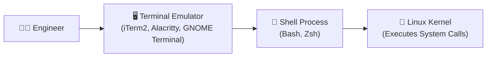

# Linux Shell Environment ကို Navigate လုပ်ခြင်း

Remote cloud virtual machine တစ်ခုကို connect လုပ်တဲ့အခါ ဒါမှမဟုတ် container shell တစ်ခုကို debug လုပ်တဲ့အခါ သင့်ရဲ့ ပထမဆုံး အဓိက interface ကတော့ terminal ပါပဲ။ Shell navigation နဲ့ command-line shortcuts တွေကို ကျွမ်းကျင်ပိုင်နိုင်လာတာနဲ့အမျှ ပင်ပန်းတဲ့ typing အလုပ်တွေကို မြန်ဆန်ပြီး အလိုလိုဖြစ်လာတဲ့ muscle memory တစ်ခုအဖြစ် ပြောင်းလဲသွားစေမှာပါ။



---

## 1. Terminal vs. Shell vs. TTY

Commands တွေ မရိုက်ခင် သုံးနှုန်းနေတဲ့ ဝေါဟာရတွေကို အရင်ရှင်းလင်းရအောင်ပါ။

- **Terminal Emulator**: စာသားတွေကို ပြသပေးပြီး key နှိပ်တာတွေကို ဖမ်းယူပေးတဲ့ graphical desktop application ဖြစ်ပါတယ် (ဥပမာ- iTerm2, macOS Terminal, Windows Terminal, Kitty)။
- **TTY (Teletypewriter)**: Linux kernel ထဲက virtual terminal device တစ်ခုဖြစ်ပြီး (`/dev/tty1`, `/dev/pts/0`) input/output streams တွေကို ကိုင်တွယ်ပေးပါတယ်။
- **Shell**: ရိုက်ထည့်လိုက်တဲ့ စာသားတွေကို parse လုပ်ပေး၊ variables တွေကို expand လုပ်ပေးပြီး processes တွေကို run ပေးတဲ့ command-line interpreter program ဖြစ်ပါတယ် (ဥပမာ- `/bin/bash`, `/bin/zsh`)။

---

## 2. Command Prompt ရဲ့ တည်ဆောက်ပုံ

Shell session တစ်ခုကို ဖွင့်လိုက်တဲ့အခါ prompt string (`$PS1` environment variable က သတ်မှတ်ထားတာ) က အရေးကြီးတဲ့ context တွေကို ဖော်ပြပေးပါတယ်:

```text
ubuntu@production-k8s-node01:~/projects/api$ 
  │               │              │        │
  │               │              │        └── User Privilege ($ = Normal User, # = Root)
  │               │              └────────── Current Working Directory (~ = /home/ubuntu)
  │               └───────────────────────── Hostname / Server Name
  └───────────────────────────────────────── Active Username
```

<Callout type="warning" title="Prompt Suffix ကို သေချာဂရုစိုက်ပါ">
- **`$`**: ပုံမှန် privilege မရှိသေးတဲ့ user တစ်ဦးကို ကိုယ်စားပြုပါတယ်။ System files တွေကို ထိခိုက်စေမယ့် command တွေအတွက် `sudo` လိုအပ်ပါလိမ့်မယ်။
- **`#`**: **`root` superuser** ကို ကိုယ်စားပြုပါတယ်။ Commands တွေကို administrative privileges အပြည့်နဲ့ execute လုပ်တာဖြစ်လို့ စာလုံးပေါင်းမှားတာက host operating system ကိုပါ ထိခိုက်စေနိုင်ပါတယ်!
</Callout>

---

## 3. Linux Command တစ်ခုရဲ့ တည်ဆောက်ပုံ

Linux command တိုင်းဟာ သတ်မှတ်ထားတဲ့ syntax convention အတိုင်း လိုက်နာကြပါတယ်:

```text
command   -short_flags   --long_options   argument1   argument2
  │            │               │              │           │
  │            │               │              └───────────┴── Target Files / Paths
  │            │               └───────────────────────────── Word Options
  │            └───────────────────────────────────────────── Single-letter Switches
  └────────────────────────────────────────────────────────── Executable Binary or Builtin
```

```bash
# Example: modification time အလိုက် စီထားပြီး ဖတ်လို့လွယ်ကူတဲ့ format နဲ့ files အားလုံးကို list လုပ်ပြပါ
ls -lah -t /var/log/nginx/

# Flags တွေကို တစ်ခုချင်းစီ သီးသန့်ပေးလို့ရသလို:
ls -l -a -h

# တစ်ခုတည်းသော flag group အဖြစ်လည်း ပေါင်းထည့်နိုင်ပါတယ်:
ls -lah
```

---

## 4. မဖြစ်မနေ သိထားရမယ့် Navigation Commands ၄ ခု

### 1. `pwd` — Print Working Directory
Root `/` ကနေ သင်လက်ရှိ ရောက်ရှိနေတဲ့နေရာအထိ တိကျတဲ့ absolute path ကို ထုတ်ပြပေးပါတယ်:

```bash
pwd
# Output: /home/ubuntu/projects/devops-zero-to-hero
```

### 2. `ls` — Directory တွေထဲက Contents တွေကို List လုပ်ပြခြင်း
Linux မှာ အသုံးအများဆုံး directory စစ်ဆေးတဲ့ tool ဖြစ်ပါတယ်:

```bash
# မြင်ရတဲ့ files များကို ပုံမှန် list လုပ်ပြခြင်း
ls

# Long listing format: permissions, owner, group, file size, modification date တွေကို ပြသပေးခြင်း
ls -l

# Hidden dotfiles တွေအပါအဝင် files အားလုံးကို ပြပါ (.env, .git, .bashrc)
ls -la

# Raw bytes အစား လူဖတ်လို့လွယ်တဲ့ size တွေနဲ့ Long listing လုပ်ခြင်း (KB, MB, GB)
ls -lh

# Last Modified Time အလိုက် files တွေကို Sort လုပ်ခြင်း (အသစ်ဆုံး files တွေက အပေါ်ဆုံးမှာ ပေါ်လာပါမယ်)
ls -lt

# Size အလိုက် files တွေကို Sort လုပ်ခြင်း (အကြီးဆုံး files တွေက အပေါ်မှာ) — နေရာစားနေတဲ့ logs တွေကို ရှာဖို့ အရမ်းကောင်းပါတယ်!
ls -lS

# ပြောင်းပြန် sort လုပ်ခြင်း
ls -ltr   # အဟောင်းဆုံး files တွေက အပေါ်ဆုံးမှာ၊ အသစ်ဆုံးတွေက screen အောက်ဆုံးမှာ
```

### 3. `cd` — Change Directory
Absolute သို့မဟုတ် relative paths တွေကို သုံးပြီး filesystem hierarchy ထဲမှာ ရွေ့လျားနိုင်ပါတယ်:

```bash
# Child folder တစ်ခုထဲသို့ ဝင်ရောက်ခြင်း
cd src/components

# တစ်ဆင့်အထက်သို့ တက်ခြင်း (parent directory)
cd ..

# နှစ်ဆင့်အထက်သို့ တက်ခြင်း
cd ../..

# ယခင်က ရှိခဲ့ဖူးတဲ့ working directory ဆီသို့ ပြန်သွားခြင်း (browser ထဲက "Back" ခလုတ်လိုမျိုး)
cd -

# သင့်ရဲ့ personal home directory ဆီကို တန်းသွားခြင်း (/home/username)
cd ~
# (သို့မဟုတ်) arguments မပါဘဲ cd လို့ပဲ ရိုက်နိုင်ပါတယ်:
cd

# Root directory ဆီကို ခုန်တက်သွားခြင်း
cd /
```

### 4. `clear` & `history` — Screen နဲ့ Command Management

```bash
# Screen viewport ကို ရှင်းလင်းခြင်း (သို့မဟုတ် Ctrl + L ကို နှိပ်ပါ)
clear

# ယခင်က run ခဲ့တဲ့ commands တွေကို နံပါတ်စဉ်နဲ့ ပြသပေးခြင်း
history

# Grep ကို သုံးပြီး command history ကို ရှာဖွေခြင်း
history | grep "docker run"

# History နံပါတ်ကို သုံးပြီး သီးသန့် command တစ်ခုကို ပြန် run ခြင်း
!142
```

---

## 5. History Expansion Shortcuts (DevOps Pro Tricks)

```bash
# အရင်ဆုံး run ခဲ့တဲ့ command ကို ထပ်ခါတလဲလဲ run ခြင်း
!!

# Example: sudo ထည့်ဖို့ မေ့သွားလား? နောက်ဆုံး run ခဲ့တဲ့ command ကို root privileges နဲ့ အမြန်ပြန် run လိုက်ပါ!
apt install nginx
# Permission denied
sudo !!
# Executes: sudo apt install nginx

# !$ က ယခင် command ရဲ့ နောက်ဆုံး argument ကို ဆွဲထုတ်ပေးပါတယ်
mkdir -p /var/www/my-application
cd !$
# Executes: cd /var/www/my-application

# Keyword သုံးပြီး ယခင် commands တွေကို interactive လုပ်ပြီး ရှာဖွေခြင်း:
# Ctrl + R ကို နှိပ်ပါ၊ ပြီးရင် "docker" လို့ စရိုက်ပါ
(reverse-i-search)`doc': docker compose up -d
```

---

## 6. GNU Readline Keyboard Shortcuts

Bash shell ဟာ command-line editing အတွက် GNU Readline library ကို အသုံးပြုပါတယ်။ ဒီ shortcuts တွေကို အလွတ်ကျက်ထားခြင်းအားဖြင့် terminal ရဲ့ လုပ်ဆောင်ချက်တွေကို အဆပေါင်းများစွာ ပိုမိုမြန်ဆန်စေမှာ ဖြစ်ပါတယ်:

| Key Combination | Action | Practical DevOps Scenario |
| :--- | :--- | :--- |
| **`Tab`** | Autocomplete path or command | ရှည်လျားတဲ့ character 50 ပါတဲ့ Kubernetes resource names တွေကို စာလုံးအပြည့်ထိုင်ရိုက်နေစရာ မလိုတော့ပါဘူး |
| **`Ctrl + A`** | Move cursor to **beginning** of line | `sudo` သို့မဟုတ် environment variable ကို အရှေ့မှာ ထည့်ဖို့ စာကြောင်းရဲ့ အစဆုံးကို ခုန်သွားခြင်း |
| **`Ctrl + E`** | Move cursor to **end** of line | Output redirection `> out.log` ကို အနောက်မှာ ထည့်ဖို့ စာကြောင်းရဲ့ အဆုံးဆုံးကို ခုန်သွားခြင်း |
| **`Alt + F` / `Esc + F`** | Move cursor **forward one word** | Directory slashes တွေကို ကျော်ပြီး အမြန် ရွေ့လျားခြင်း |
| **`Alt + B` / `Esc + B`** | Move cursor **backward one word** | Command flags တွေကို ကျော်ပြီး အမြန် ရွေ့လျားခြင်း |
| **`Ctrl + U`** | Cut line from cursor to **start** | မှားရိုက်မိတဲ့ command ကို အမြန် ဖယ်ရှားခြင်း |
| **`Ctrl + K`** | Cut line from cursor to **end** | လိုချင်စရာမရှိတော့တဲ့ နောက်က arguments တွေကို ဖြတ်ထုတ်ခြင်း |
| **`Ctrl + W`** | Delete previous **word** | Backspace ၂၀ ခါလောက် နှိပ်နေစရာမလိုဘဲ အရင်စာလုံးကို ပြင်ဆင်ခြင်း |
| **`Ctrl + Y`** | Paste (yank) previously cut text | `Ctrl + U` သို့မဟုတ် `Ctrl + W` နဲ့ ဖျက်ခဲ့တဲ့ စာသားတွေကို ပြန်ဖော်ခြင်း |
| **`Ctrl + C`** | Send `SIGINT` (Kill foreground job) | Run နေတဲ့ script တွေ၊ infinite loops တွေ သို့မဟုတ် တာရှည်နေတဲ့ ping commands တွေကို ရပ်တန့်ခြင်း |
| **`Ctrl + L`** | Clear screen | Active ဖြစ်နေတဲ့ command ကို မပျက်စေဘဲ terminal မျက်နှာပြင်ကို ရှင်းလင်းထားခြင်း |

---

## အနှစ်ချုပ်

- Command prompt (`PS1`) က သင့်ရဲ့ active ဖြစ်နေတဲ့ **username**, **hostname**, **path**, နဲ့ **privilege level** (`$` vs `#`) တွေကို ပြသပေးပါတယ်။
- Hidden files တွေ၊ လူဖတ်လို့လွယ်တဲ့ size တွေနဲ့ အချိန်အလိုက် sort လုပ်ထားတာတွေကို စစ်ဆေးဖို့ `ls -lahrt` လိုမျိုး `ls` flags တွေကို ပေါင်းစပ်သုံးပါ။
- Directory နှစ်ခုကြားမှာ အပြန်အလှန် ပြောင်းသွားလာဖို့ `cd -` ကို သုံးပါ။
- Arrow keys တွေကို မတို့ဘဲ navigate လုပ်နိုင်ဖို့ `Ctrl + A`, `Ctrl + E`, `Ctrl + W`, နဲ့ `Ctrl + R` လို Readline shortcuts တွေကို ကျွမ်းကျင်အောင် လုပ်ထားပါ။

နောက်သင်ခန်းစာမှာတော့ files နဲ့ directories တွေကို စီမံခန့်ခွဲတာ၊ absolute vs. relative paths နဲ့ `tail -f` သုံးပြီး live log streaming လုပ်တာတွေကို လေ့လာရမှာ ဖြစ်ပါတယ်!